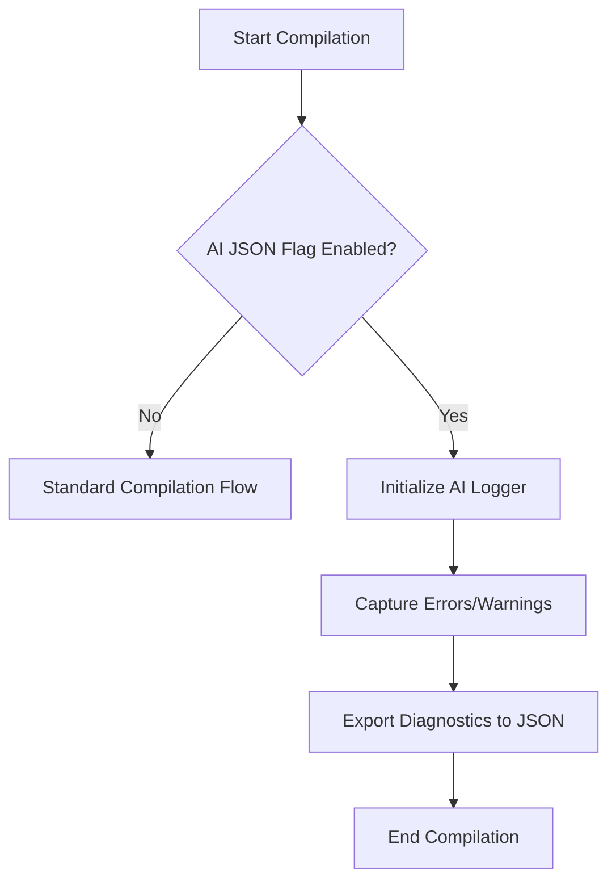
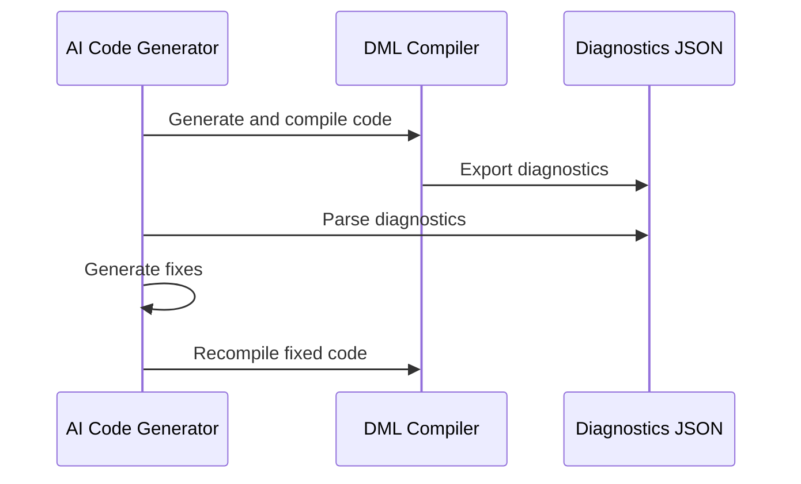

<details>
<summary>Relevant source files</summary>

- [AI_DIAGNOSTICS_README.md](../AI_DIAGNOSTICS_README.md)
- [QUICKSTART_AI_DIAGNOSTICS.md](../QUICKSTART_AI_DIAGNOSTICS.md)
- [py/dml/ai_diagnostics.py](../py/dml/ai_diagnostics.py)
- [py/dml/dmlc.py](../py/dml/dmlc.py)
- [IMPLEMENTATION_SUMMARY.md](../IMPLEMENTATION_SUMMARY.md)
</details>

# AI Diagnostics Integration

## Introduction

AI Diagnostics Integration in the Device Modeling Language Compiler (DMLC) is a feature designed to enhance the debugging and code generation process by providing structured, machine-readable JSON diagnostics. These diagnostics are optimized for AI-assisted tools to analyze, categorize, and suggest fixes for errors and warnings encountered during DML compilation. This system is seamlessly integrated into the existing DMLC infrastructure, ensuring backward compatibility while enabling advanced features like error categorization, fix suggestions, and documentation references.

The integration aims to streamline workflows for developers and AI systems, making the compilation process more efficient and enabling automated or semi-automated resolution of issues. By leveraging structured data, the diagnostics can be easily consumed by AI models for generating actionable insights and fixes.

---

## Architecture and Workflow

### Overview of Components

The AI Diagnostics Integration consists of the following key components:

1. **`AIDiagnostic` Class**: Represents a structured diagnostic message, including error codes, messages, categories, and fix suggestions.
2. **`AIFriendlyLogger` Class**: Collects and exports diagnostics during compilation.
3. **Error Categorization**: Groups errors into strategic categories for easier handling by AI tools.
4. **JSON Export**: Outputs diagnostics in a machine-readable JSON format.
5. **CLI Integration**: Adds the `--ai-json` flag to enable diagnostics export.

### Workflow



The workflow begins with the compilation process, where the `--ai-json` flag determines whether the AI diagnostics system is activated. If enabled, the system initializes the logger, captures diagnostics during compilation, and exports them as a JSON file.

**Sources**: [py/dml/ai_diagnostics.py:10-120](), [py/dml/dmlc.py:475-787]()

---

## Key Features

### Error Categorization

Diagnostics are categorized into distinct groups based on their resolution strategy. This categorization helps AI tools understand the nature of errors and generate targeted fixes.

| Category              | Error Codes              | Description                                       |
|-----------------------|--------------------------|---------------------------------------------------|
| `syntax`             | ESYNTAX, PARSE           | Errors related to syntax issues.                 |
| `type_mismatch`      | TYPE, ECAST              | Type incompatibility errors.                     |
| `undefined_symbol`   | EUNDEF, ENOSYM           | Undefined variable or symbol errors.             |
| `duplicate_definition`| EDUP, EREDEF            | Errors due to duplicate definitions.             |
| `import_error`       | IMPORT                   | Issues with module imports.                      |
| `semantic`           | Other semantic errors    | Context-specific errors.                         |

**Sources**: [AI_DIAGNOSTICS_README.md](), [IMPLEMENTATION_SUMMARY.md]()

---

### JSON Output Schema

The diagnostics are exported in a structured JSON format, providing all relevant details about errors and warnings.

```json
{
  "format_version": "1.0",
  "generator": "dmlc-ai-diagnostics",
  "compilation_summary": {
    "input_file": "example.dml",
    "dml_version": "1.4",
    "total_diagnostics": 5,
    "total_errors": 3,
    "total_warnings": 2,
    "error_categories": {
      "syntax": 1,
      "type_mismatch": 2
    },
    "success": false
  },
  "diagnostics": [
    {
      "type": "error",
      "code": "EUNDEF",
      "message": "Undefined symbol 'foo'",
      "category": "undefined_symbol",
      "location": {
        "file": "example.dml",
        "line": 12
      },
      "fix_suggestions": [
        "Check if the symbol is defined in imported files",
        "Verify the symbol name spelling"
      ]
    }
  ]
}
```

**Sources**: [QUICKSTART_AI_DIAGNOSTICS.md](), [py/dml/ai_diagnostics.py:130-200]()

---

### Integration with AI Tools

The structured diagnostics enable seamless integration with AI-based code generators and fixers. A typical workflow involves:

1. **Generate Code**: AI generates DML code.
2. **Compile**: The code is compiled with diagnostics enabled.
3. **Analyze Diagnostics**: The AI tool parses the JSON output.
4. **Generate Fixes**: Based on diagnostics, the AI suggests or applies fixes.
5. **Recompile**: The fixed code is recompiled until successful.



**Sources**: [AI_DIAGNOSTICS_README.md](), [QUICKSTART_AI_DIAGNOSTICS.md]()

---

## Implementation Details

### CLI Integration

The `--ai-json` flag enables AI diagnostics and specifies the output file for the JSON diagnostics.

```python
parser.add_argument(
    '--ai-json', dest='ai_json_output',
    metavar='FILE',
    help='Export diagnostics in AI-friendly JSON format to FILE'
)
```

**Sources**: [py/dml/dmlc.py:475]()

---

### Key Classes and Methods

#### `AIDiagnostic`

This class encapsulates the details of a single diagnostic, including its type, severity, and suggested fixes.

```python
class AIDiagnostic:
    def __init__(self, log_message):
        self.log_message = log_message
        self.message = log_message.msg
        self.category = self._categorize()
```

**Sources**: [py/dml/ai_diagnostics.py:50-100]()

#### `AIFriendlyLogger`

This logger collects all diagnostics during compilation and exports them as JSON.

```python
class AIFriendlyLogger:
    def __init__(self):
        self.diagnostics = []

    def log_message(self, log_message):
        diagnostic = AIDiagnostic(log_message)
        self.diagnostics.append(diagnostic)
```

**Sources**: [py/dml/ai_diagnostics.py:120-160]()

---

## Conclusion

AI Diagnostics Integration in DMLC significantly enhances the debugging and development experience by providing structured, actionable insights into compilation errors and warnings. By leveraging JSON-based diagnostics, the system enables seamless integration with AI tools for automated error resolution, improving efficiency and reducing manual effort. This feature is a cornerstone for modernizing the DML development workflow and empowering developers with AI-assisted capabilities.