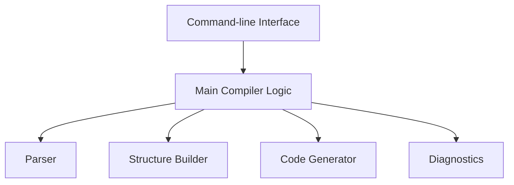
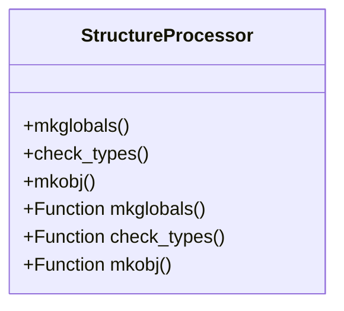
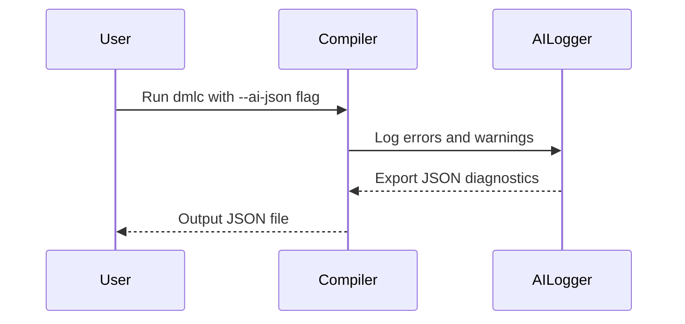
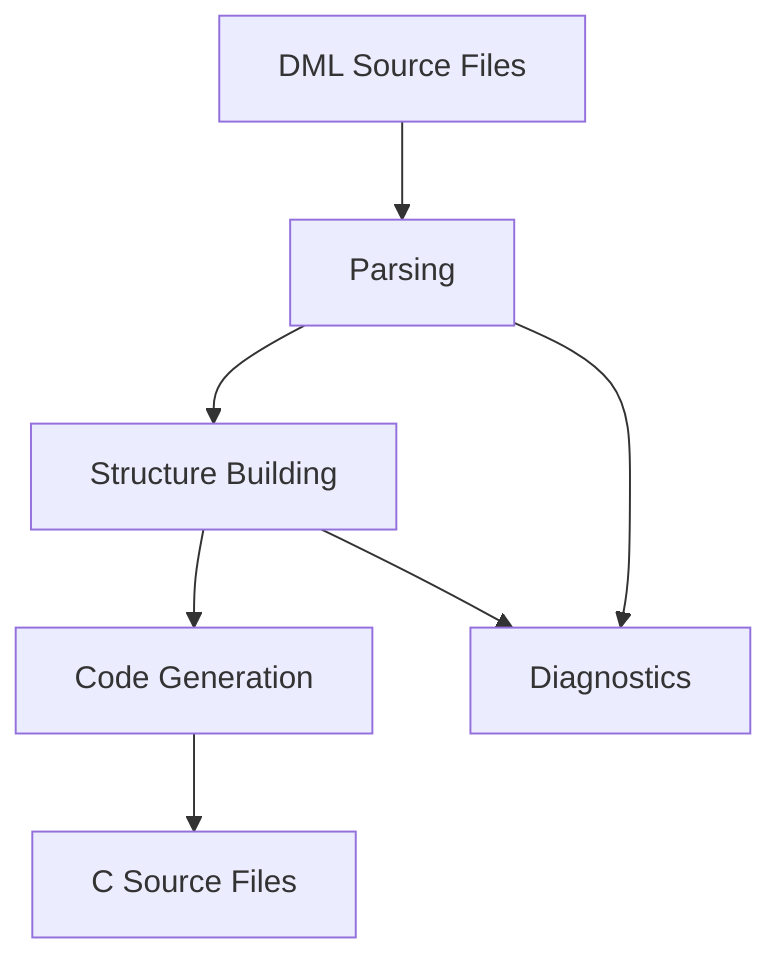

<details>
<summary>Relevant source files</summary>

- [py/dml/dmlc.py](../py/dml/dmlc.py)
- [py/dml/structure.py](../py/dml/structure.py)
- [doc/1.4/running-dmlc.md](../doc/1.4/running-dmlc.md)
- [doc/1.4/introduction.md](../doc/1.4/introduction.md)
- [py/dml/ai_diagnostics.py](../py/dml/ai_diagnostics.py)
</details>

# Architecture Overview

## Introduction

The Device Modeling Language (DML) system is designed to simplify the development of device models for simulation within the Simics platform. The system leverages the DML Compiler (DMLC) to convert high-level DML code into C source files, which can then be compiled into executable modules. This document provides an architectural overview of the DMLC system, detailing its core components, data flows, and the integration of AI diagnostics for enhanced error reporting and debugging. The architecture facilitates modularity, extensibility, and efficient processing of device models.

## Core Components

### DML Compiler (`dmlc.py`)

The `dmlc.py` module serves as the main entry point for the DML Compiler. It handles command-line arguments, orchestrates the compilation process, and integrates various subsystems such as parsing, structure generation, code generation, and diagnostics.



- **Command-line Interface**: Parses user-provided arguments and configurations.
- **Main Compiler Logic**: Coordinates the compilation workflow.
- **Parser**: Converts DML source code into an Abstract Syntax Tree (AST).
- **Structure Builder**: Analyzes the AST and generates intermediate representations.
- **Code Generator**: Produces C code based on the intermediate structures.
- **Diagnostics**: Provides detailed error and warning messages.

Sources: [py/dml/dmlc.py:1-50](), [doc/1.4/running-dmlc.md]()

### Structure Module (`structure.py`)

The `structure.py` module processes the AST to generate a hierarchical representation of the device model. It performs tasks such as:

- Identifying global variables and constants.
- Verifying type definitions.
- Creating object trees for devices, registers, and connections.



Sources: [py/dml/structure.py:10-100]()

### AI Diagnostics (`ai_diagnostics.py`)

The `ai_diagnostics.py` module enhances the compiler with AI-friendly diagnostics. It categorizes errors, provides actionable suggestions, and exports diagnostic data in JSON format for integration with AI tools.



Sources: [py/dml/ai_diagnostics.py:1-341](), [doc/1.4/running-dmlc.md]()

### Parsing (`dmlparse.py`)

The parsing module converts DML source code into an AST. It uses the PLY library for lexing and parsing, ensuring compliance with the DML grammar.

Sources: [py/dml/dmlparse.py:1-50]()

### Code Generation (`codegen.py`)

The code generation module translates the intermediate object tree into C code. It supports features like inlining and partial evaluation.

Sources: [py/dml/codegen.py:1-50]()

## Data Flow

The compilation process follows a linear workflow:

1. **Input**: DML source files are provided via the command-line interface.
2. **Parsing**: The source files are parsed into an AST.
3. **Structure Building**: The AST is analyzed to generate an intermediate representation.
4. **Code Generation**: The intermediate representation is converted into C code.
5. **Diagnostics**: Errors and warnings are logged and optionally exported in JSON format.



Sources: [py/dml/dmlc.py:50-150](), [py/dml/structure.py:10-100](), [py/dml/ai_diagnostics.py:50-150]()

## Error Categorization

The AI diagnostics system categorizes errors into the following groups:

| Category           | Description                                     |
|--------------------|-------------------------------------------------|
| `syntax`           | Syntax errors in DML code                      |
| `type_mismatch`    | Type incompatibility errors                    |
| `template_resolution` | Issues with template inheritance or usage   |
| `undefined_symbol` | References to undefined symbols                |
| `duplicate_definition` | Conflicts due to multiple definitions      |
| `import_error`     | Problems with imports and module resolution    |

Sources: [py/dml/ai_diagnostics.py:100-200]()

## Example Workflow

```bash
# Compile a DML file with AI diagnostics enabled
python3 -m dml.dmlc --ai-json diagnostics.json device.dml
```

The output JSON file can be parsed for detailed diagnostics:

```json
{
  "format_version": "1.0",
  "compilation_summary": {
    "input_file": "device.dml",
    "total_diagnostics": 5,
    "total_errors": 3,
    "total_warnings": 2
  },
  "diagnostics": [
    {
      "type": "error",
      "code": "EUNDEF",
      "message": "Undefined symbol 'foo'",
      "location": {
        "file": "device.dml",
        "line": 12
      }
    }
  ]
}
```

Sources: [doc/1.4/running-dmlc.md](), [py/dml/ai_diagnostics.py:200-300]()

## Conclusion

The DML Compiler's architecture is designed to efficiently process device models, leveraging modular components for parsing, structure building, and code generation. The integration of AI diagnostics enhances the developer experience by providing actionable insights and facilitating automated error resolution. This architecture ensures scalability, extensibility, and ease of use, making it a robust solution for device modeling in Simics.