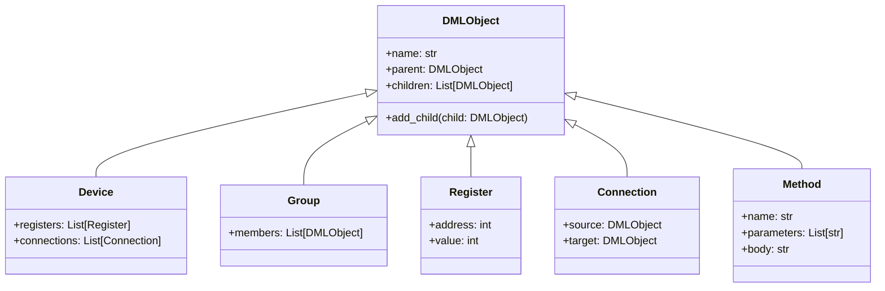
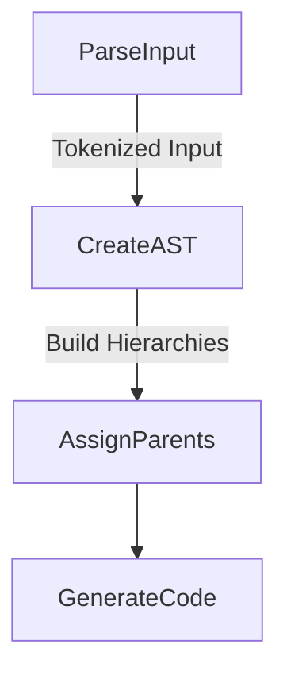
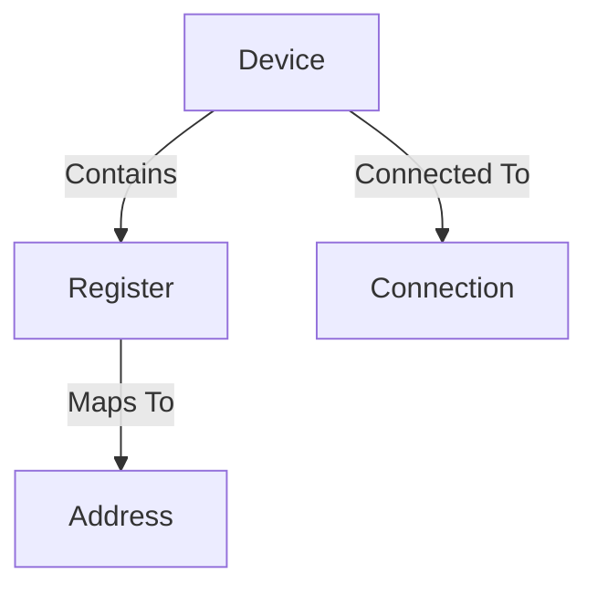
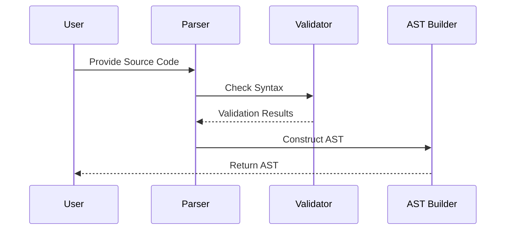

<details>
<summary>Relevant source files</summary>

The following files were used as context for generating this wiki page:

- [py/dml/objects.py](../py/dml/objects.py)
- [py/dml/ast.py](../py/dml/ast.py)
- [py/dml/ctree.py](../py/dml/ctree.py)
- [py/dml/dmlparse.py](../py/dml/dmlparse.py)
- [py/dml/dmlc.py](../py/dml/dmlc.py)
</details>

# Component Relationships

## Introduction

The "Component Relationships" module in the Device Modeling Language (DML) framework plays a critical role in defining, managing, and interpreting the relationships between different components of a device model. These relationships include object hierarchies, dependencies, and interactions between entities such as devices, groups, registers, and connections. This module is crucial for translating high-level device descriptions into concrete representations that can be compiled into executable code for simulation environments like Simics.

This page delves into the architecture, key components, and data flow within the "Component Relationships" module, as derived from the project's source files. It also includes detailed diagrams and tables to illustrate these relationships and their significance.

---

## Object Definitions and Hierarchies

### Overview

The core of the component relationships is managed through the `DMLObject` class and its subclasses, which represent various elements of a device model such as `Device`, `Group`, `Register`, and `Connection`. These classes are defined in `objects.py` and provide the foundational structure for modeling relationships.

### Class Hierarchy



This hierarchy shows how the `DMLObject` serves as the base class for all components, allowing for a consistent interface for managing relationships. Subclasses specialize in representing specific aspects of a device model.

Sources: [py/dml/objects.py:1-50](), [py/dml/ast.py:10-100]()

---

## Abstract Syntax Tree (AST) Representation

### Role of AST

The Abstract Syntax Tree (AST) is a critical intermediary representation of the device model during the compilation process. It captures the hierarchical relationships and properties of components, which are later translated into executable code.

### Key Functions

- **Node Creation:** Nodes in the AST are represented by subclasses of `ast.AST`, such as `ast.Assign` and `ast.Template`.
- **Relationship Management:** The AST nodes maintain references to their parent and child nodes, ensuring that hierarchical relationships are preserved.

### Example AST Node

```python
class AST:
    def __init__(self, kind, parent=None):
        self.kind = kind
        self.parent = parent
        self.children = []

    def add_child(self, child):
        self.children.append(child)
        child.parent = self
```

### Data Flow in AST



Sources: [py/dml/ast.py:1-150](), [py/dml/dmlparse.py:50-200]()

---

## Code Generation and Relationships

### CTree Module

The `ctree` module represents code in an intermediate form before it is converted into C code. It uses a combination of statements and expressions to represent the relationships between components.

### Key Classes

- **Statements:** Represent actions or operations, such as assignments or method calls.
- **Expressions:** Represent values or computations, such as arithmetic operations.

### Example Relationship



### Code Example

```python
class CTree:
    def __init__(self):
        self.statements = []

    def add_statement(self, statement):
        self.statements.append(statement)

class Statement:
    def __init__(self, content):
        self.content = content
```

Sources: [py/dml/ctree.py:1-100]()

---

## Parsing and Validation

### Parsing Logic

The `dmlparse.py` file contains the parsing logic that converts source code into an AST. This process includes:

1. **Tokenization:** Breaking the source code into tokens.
2. **Syntax Checking:** Ensuring that the code conforms to the DML grammar.
3. **AST Construction:** Building the hierarchical representation.

### Validation

The `dmlc.py` file handles validation, ensuring that relationships between components are consistent and adhere to the rules of the DML language.

### Example Flow



Sources: [py/dml/dmlparse.py:1-200](), [py/dml/dmlc.py:50-300]()

---

## Summary Table: Key Components

| Component       | Description                                          | Source File               |
|------------------|------------------------------------------------------|---------------------------|
| `DMLObject`      | Base class for all device components                | [objects.py](../py/dml/objects.py) |
| `AST`            | Abstract Syntax Tree representation                 | [ast.py](../py/dml/ast.py)         |
| `CTree`          | Intermediate code representation                    | [ctree.py](../py/dml/ctree.py)     |
| `Parser`         | Converts source code into tokens and AST            | [dmlparse.py](../py/dml/dmlparse.py) |
| `Validator`      | Ensures component relationships adhere to DML rules | [dmlc.py](../py/dml/dmlc.py)       |

---

## Conclusion

The "Component Relationships" module is fundamental to the Device Modeling Language framework, providing the structures and processes necessary to define, manage, and validate the hierarchical and functional relationships between components. By leveraging a combination of object-oriented design, ASTs, and intermediate representations, the module ensures that device models are accurately represented and efficiently compiled. This modular and extensible design allows for robust simulation and further development of complex device models.

For more details, refer to the [DML Introduction](#introduction) or other related pages.