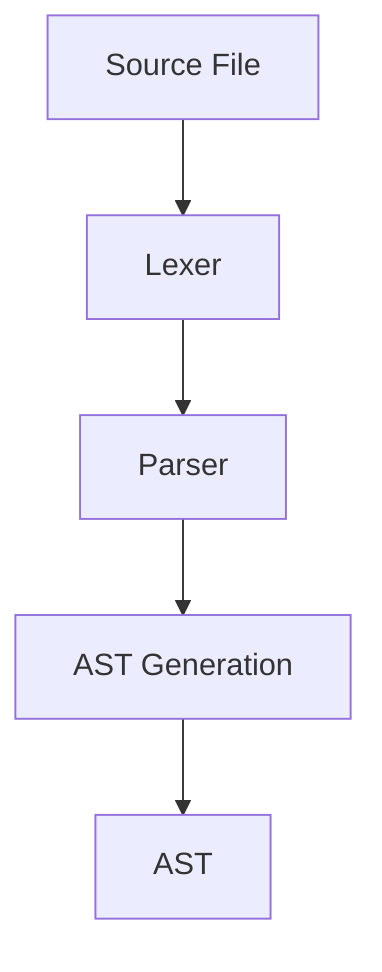
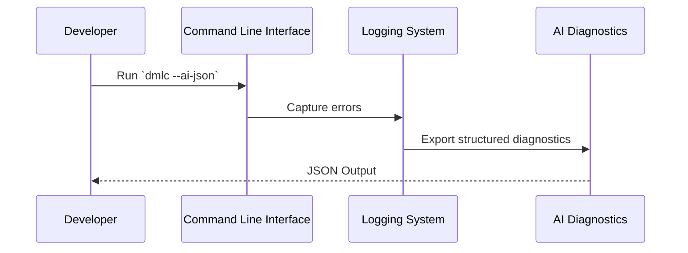
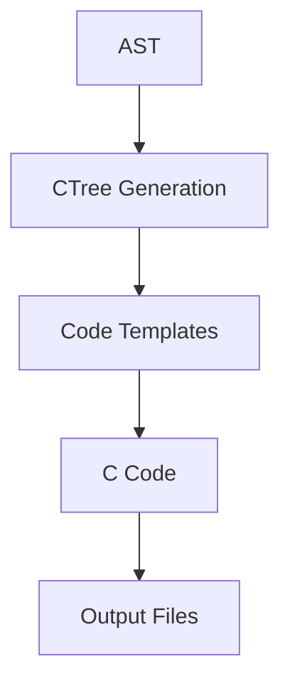

<details>
<summary>Relevant source files</summary>

The following files were used as context for generating this wiki page:

- [py/dml/dmlparse.py](../py/dml/dmlparse.py)
- [py/dml/dmlc.py](../py/dml/dmlc.py)
- [py/dml/ai_diagnostics.py](../py/dml/ai_diagnostics.py)
- [py/dml/logging.py](../py/dml/logging.py)
- [py/dml/codegen.py](../py/dml/codegen.py)
</details>

# Data Flow and Processing

## Introduction

The "Data Flow and Processing" feature in the Device Modeling Language (DML) project is responsible for managing the parsing, processing, and error handling of device model code. This system is designed to translate DML source files into a structured format that can be compiled into C code for simulation purposes. It encompasses various modules that handle parsing, logging, error reporting, and code generation, ensuring a smooth and efficient pipeline for model development.

This page provides a detailed breakdown of the architecture and components involved in data flow and processing, including the parsing logic, error diagnostics, and code generation mechanisms. Each section includes relevant diagrams, tables, and citations to illustrate the functionality.

## Parsing and Abstract Syntax Tree (AST) Generation

### Overview

The parsing module, implemented in `py/dml/dmlparse.py`, is responsible for converting DML source files into an Abstract Syntax Tree (AST). The parser uses the PLY library to define grammar rules and produce structured representations of the source code. These ASTs serve as the foundation for subsequent processing steps.

### Key Components

1. **Grammar Rules**: Defined using `@prod` and `@prod_dml12` decorators, these rules map DML syntax to corresponding AST nodes.
2. **AST Nodes**: Represented by classes such as `ast.template`, `ast.header`, and `ast.import_`, each node encapsulates a specific structure or construct in the source code.
3. **Error Reporting**: The `report()` function integrates with the logging system to capture syntax errors during parsing.



### Code Snippet

```python
@prod
def header(t):
    'toplevel : HEADER CBLOCK'
    t[0] = ast.header(site(t), t[2], False)
```

Sources: [py/dml/dmlparse.py:1-100]()

---

## Logging and Error Diagnostics

### Overview

The logging and diagnostics modules ensure robust error reporting and debugging capabilities during the compilation process. They provide detailed feedback to developers, enabling quick resolution of issues.

### Key Features

1. **Error Categorization**: Errors are grouped into categories such as syntax, type mismatch, and undefined symbols for better clarity.
2. **AI-Friendly Diagnostics**: The `ai_diagnostics` module exports errors in a structured JSON format, optimized for AI-based code correction tools.
3. **Integration with CLI**: The `--ai-json` flag in `dmlc.py` enables structured error output.



### Example JSON Output

```json
{
  "format_version": "1.0",
  "compilation_summary": {
    "input_file": "device.dml",
    "total_errors": 2,
    "total_warnings": 1,
    "success": false
  },
  "diagnostics": [
    {
      "type": "error",
      "code": "EUNDEF",
      "message": "undefined symbol 'foo'",
      "category": "undefined_symbol",
      "location": {"file": "device.dml", "line": 42},
      "fix_suggestions": ["Check imports", "Verify symbol spelling"]
    }
  ]
}
```

Sources: [py/dml/logging.py:50-100](), [py/dml/ai_diagnostics.py:1-341](), [py/dml/dmlc.py:475-787]()

---

## Code Generation

### Overview

The code generation module transforms the processed AST into C code that can be compiled and used in simulations. This step involves converting high-level DML constructs into low-level C representations.

### Key Components

1. **CTree Classes**: Represent statements and expressions in the generated C code.
2. **Code Templates**: Predefined templates simplify the generation of common patterns.
3. **Output Management**: The `output.py` module ensures proper formatting and file handling.



### Code Snippet

```python
def generate_c_code(ast):
    for node in ast:
        if isinstance(node, ast.header):
            output.out(node.toc())
```

Sources: [py/dml/codegen.py:1-100](), [py/dml/output.py:1-50]()

---

## Data Flow Summary

The following table summarizes the data flow through various components:

| Component          | Input           | Output          | Description                                     |
|--------------------|-----------------|-----------------|------------------------------------------------|
| Lexer              | Source File     | Tokens          | Tokenizes the input source code.               |
| Parser             | Tokens          | AST             | Converts tokens into an Abstract Syntax Tree.  |
| Logger             | Errors/Warnings | Log Messages    | Captures and reports issues during processing. |
| AI Diagnostics     | Log Messages    | JSON Diagnostics| Exports errors in a structured format.         |
| Code Generator     | AST             | C Code          | Generates C code from the AST.                 |

Sources: [py/dml/dmlparse.py:1-100](), [py/dml/logging.py:50-100](), [py/dml/ai_diagnostics.py:1-341](), [py/dml/codegen.py:1-100](), [py/dml/output.py:1-50]()

---

## Conclusion

The "Data Flow and Processing" system is a critical part of the DML project, ensuring the efficient transformation of source code into simulation-ready C code. By integrating robust parsing, error diagnostics, and code generation mechanisms, the system provides a seamless development experience for device modelers. Future enhancements, such as AI-driven error correction, promise to further streamline the workflow and improve developer productivity.