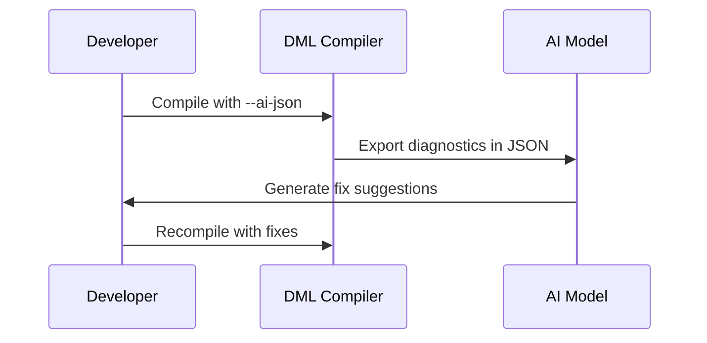

<details>
<summary>Relevant source files</summary>

The following files were used as context for generating this wiki page:

- [doc/1.4/running-dmlc.md](../doc/1.4/running-dmlc.md)
- [md_to_github.py](../md_to_github.py)
- [README.md](../README.md)
- [AI_DIAGNOSTICS_README.md](../AI_DIAGNOSTICS_README.md)
- [IMPLEMENTATION_SUMMARY.md](../IMPLEMENTATION_SUMMARY.md)
</details>

# Deployment Instructions

## Introduction

This guide provides detailed deployment instructions for the Device Modeling Language Compiler (DMLC), a core tool used for compiling DML files into C code for functional device models. The deployment process is essential for integrating DMLC into development environments and ensuring its compatibility with the Intel Simics simulator. This document covers how to build, configure, and test DMLC, as well as how to use its advanced features, including AI-friendly diagnostics.

## Building DMLC

### Prerequisites

1. **Simics Installation**: Ensure the Intel Simics simulator is installed. The DMLC compiler is part of the Simics Base package.
2. **Simics Project Setup**: Create a Simics project, which can be done automatically during the default installation of Simics.
3. **Environment Variables**:
   - `DMLC_DIR`: Set this to `<project>/<hosttype>/bin` after building DMLC. Replace `<hosttype>` with `linux64` or `win64` depending on your platform.
   - `DMLC_PATHSUBST`: Configure this to map error messages to the source files for easier debugging.

### Steps to Build

1. Clone the DML repository into the `modules/dmlc` directory of your Simics project.
2. Run the following command from the top-level directory of your project:
   ```bash
   make dmlc
   ```
3. The build artifacts will be located in `<host>/bin/dml`, where `<host>` corresponds to your system architecture.

### Directory Structure

- **`<host>/bin/dml/python`**: Python module implementing the compiler.
- **`<host>/bin/dml/1.4`**: Standard libraries for device compilation.
- **`<host>/bin/dml/api`**: `.dml` files exposing the Simics API.

Sources: [README.md:10-50]()

## Configuration

### Setting Up Environment Variables

Configure the following variables to optimize your development workflow:

| Variable           | Description                                                                                  |
|--------------------|----------------------------------------------------------------------------------------------|
| `DMLC_DIR`         | Path to the locally built DMLC binaries.                                                     |
| `DMLC_PATHSUBST`   | Rewrites error messages to point to the source files instead of copied binaries.             |
| `DMLC_DEBUG`       | Enables detailed error messages and tracebacks for debugging.                                |
| `DMLC_PROFILE`     | Enables self-profiling and generates performance reports.                                     |
| `DMLC_DUMP_INPUT_FILES` | Creates an archive of source files for reproducing issues in isolated environments.      |

Sources: [README.md:51-120]()

### Command-Line Options

DMLC supports various command-line flags for customization:

| Option                  | Description                                                                 |
|-------------------------|-----------------------------------------------------------------------------|
| `-h, --help`            | Prints usage information.                                                  |
| `-I <path>`             | Adds a directory to the module search path.                                |
| `--dep`                 | Outputs Makefile rules for dependencies.                                   |
| `--strict`              | Reports errors for constructs that will be forbidden in future versions.   |
| `--ai-json <file>`      | Exports diagnostics in an AI-friendly JSON format.                         |

For a complete list of options, refer to the [Command Line Options](#command-line-options) section.

Sources: [doc/1.4/running-dmlc.md:10-100]()

## Testing DMLC

### Unit Tests

Run the following command to execute the unit tests:
```bash
make test-dmlc
```
Alternatively, use the Simics test runner:
```bash
bin/test-runner --suite modules/dmlc/test
```

### AI Diagnostics Testing

1. Create a test file with intentional errors (e.g., `test_ai_diagnostics.dml`).
2. Run the compiler with AI diagnostics enabled:
   ```bash
   dmlc --ai-json errors.json test_ai_diagnostics.dml
   ```
3. View the results:
   ```bash
   cat errors.json | jq '.'
   ```

Sources: [AI_DIAGNOSTICS_README.md:30-100]()

## Deployment Workflow

### Compilation Process

```mermaid
flowchart TD
    A[Source File (.dml)] --> B[DMLC Compiler]
    B --> C[Generated C Code]
    C --> D[Simics Module]
    D --> E[Functional Device Model]
```

1. The source `.dml` file is compiled by DMLC.
2. DMLC generates C code, which is then compiled into a Simics module.
3. The module is loaded into Simics to simulate the functional device model.

Sources: [doc/1.4/running-dmlc.md:50-150]()

### Using AI Diagnostics



1. The developer compiles a `.dml` file with the `--ai-json` flag.
2. DMLC outputs diagnostics in a structured JSON format.
3. The AI model analyzes the diagnostics and suggests fixes.
4. The developer applies the fixes and recompiles the code.

Sources: [IMPLEMENTATION_SUMMARY.md:100-200]()

## Summary

Deploying DMLC involves building the compiler, configuring the environment, and testing its functionality. Advanced features such as AI diagnostics enhance error handling and debugging, making DMLC a powerful tool for developing functional device models. By following the steps outlined in this guide, developers can efficiently integrate DMLC into their workflows and leverage its capabilities for high-performance simulations.

Sources: [README.md](), [doc/1.4/running-dmlc.md](), [AI_DIAGNOSTICS_README.md](), [IMPLEMENTATION_SUMMARY.md](), [md_to_github.py]()