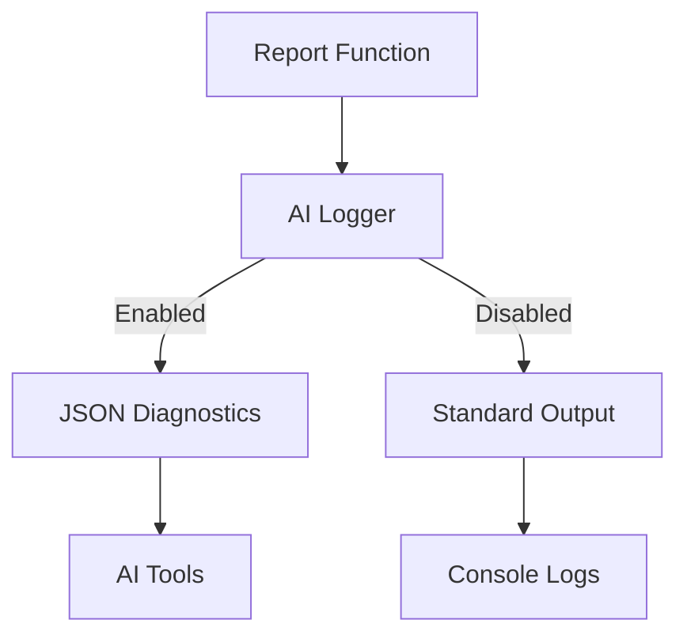
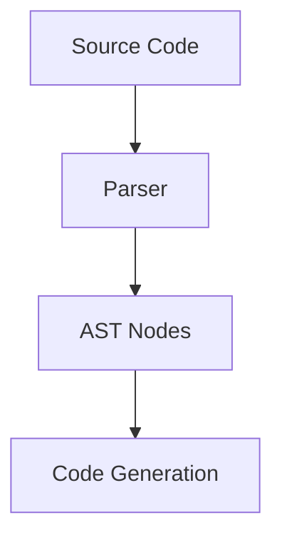
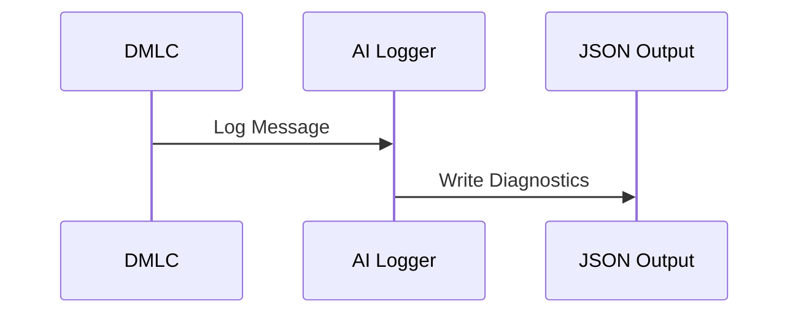

<details>
<summary>Relevant source files</summary>

The following files were used as context for generating this wiki page:

- [py/dml/dmlc.py](../py/dml/dmlc.py)
- [py/dml/logging.py](../py/dml/logging.py)
- [py/dml/ai_diagnostics.py](../py/dml/ai_diagnostics.py)
- [py/dml/globals.py](../py/dml/globals.py)
- [py/dml/ast.py](../py/dml/ast.py)
</details>

# Extensibility and Customization

## Introduction

Extensibility and customization are integral aspects of the Device Modeling Language Compiler (DMLC) project, enabling developers to adapt the system to their specific needs while preserving the integrity of the core architecture. This feature allows for the integration of additional functionalities, logging mechanisms, and diagnostic tools, ensuring that the compiler remains flexible and future-proof. By leveraging modular components and well-defined APIs, the project fosters a robust environment for innovation and tailored solutions.

This page explores the mechanisms and architecture underpinning extensibility and customization in DMLC, including the diagnostic logging system, integration of AI-friendly tools, and the global configuration structure. The focus is on the components that facilitate these capabilities, as evidenced in the provided source files.

---

## Diagnostic Logging System

### Overview

The diagnostic logging system in DMLC serves as a critical tool for capturing and reporting errors, warnings, and other important messages during the compilation process. It provides a modular structure that can be extended to support additional logging mechanisms, including AI-friendly diagnostics.

### Key Components

#### `logging.py`

The `logging.py` module defines the `report()` function, which acts as the central entry point for all diagnostic messages. The function captures messages and processes them through different logging layers, including AI-specific handlers if enabled.

```python
def report(logmessage):
    # Capture message for AI logging if enabled
    try:
        from . import ai_diagnostics
        if ai_diagnostics.is_ai_logging_enabled():
            ai_logger = ai_diagnostics.get_ai_logger()
            if ai_logger:
                ai_logger.log_message(logmessage)
    except ImportError:
        pass
    # ... existing code continues
```

Sources: [py/dml/logging.py:10-20]()

#### AI Diagnostics Integration

The `ai_diagnostics.py` module introduces the `AIFriendlyLogger` class, which collects and structures diagnostics in a JSON format suitable for AI consumption. This integration is enabled via the `--ai-json` CLI flag in `dmlc.py`.

```python
parser.add_argument(
    '--ai-json', dest='ai_json_output',
    metavar='FILE',
    help='Export diagnostics in AI-friendly JSON format to FILE'
)
```

Sources: [py/dml/ai_diagnostics.py:5-50](), [py/dml/dmlc.py:475-490]()

### Data Flow



Sources: [py/dml/logging.py:10-20](), [py/dml/ai_diagnostics.py:5-50]()

---

## Global Configuration Management

### Overview

The `globals.py` module defines a set of global variables and configurations that are used throughout the DMLC system. These variables provide a centralized way to manage settings, enabling easy customization and extension.

### Key Variables

- **`dml_version`**: Specifies the current DML version being compiled.
- **`enabled_compat`**: Tracks enabled compatibility features.
- **`debuggable`**: Boolean flag to toggle debugging features.

```python
# Global variables
dml_version = None
enabled_compat = set()
debuggable = False
```

Sources: [py/dml/globals.py:10-50]()

### Extensibility

Developers can modify these variables or add new ones to introduce custom behaviors or configurations. For example, the `enabled_compat` set allows toggling specific compatibility features dynamically.

---

## Abstract Syntax Tree (AST) Customization

### Overview

The `ast.py` module defines the Abstract Syntax Tree (AST) structure used by the compiler. This structure can be extended to support new language features or constructs.

### Key Classes and Methods

- **`ast.template`**: Represents a template node in the AST.
- **`ast.header`**: Handles header declarations.

```python
@prod
def header(t):
    'toplevel : HEADER CBLOCK'
    t[0] = ast.header(site(t), t[2], False)
```

Sources: [py/dml/ast.py:100-120]()

### Diagram: AST Node Creation



Sources: [py/dml/ast.py:100-120]()

---

## AI-Friendly Diagnostics

### Overview

The `ai_diagnostics.py` module is a significant extension to the DMLC system, providing structured diagnostic outputs designed for AI tools. This module categorizes errors, generates actionable suggestions, and outputs diagnostics in a JSON format.

### Features

- **Error Categorization**: Groups errors into predefined categories for easier processing.
- **Fix Suggestions**: Provides actionable recommendations for resolving issues.
- **JSON Output**: Ensures compatibility with AI-based systems.

```json
{
  "format_version": "1.0",
  "generator": "dmlc-ai-diagnostics",
  "compilation_summary": {
    "total_errors": 5,
    "error_categories": {
      "syntax": 2,
      "type_mismatch": 3
    }
  }
}
```

Sources: [py/dml/ai_diagnostics.py:100-150]()

### Diagram: AI Diagnostic Workflow



Sources: [py/dml/ai_diagnostics.py:100-150]()

---

## Conclusion

The extensibility and customization features of the DMLC project empower developers to adapt the compiler to their specific needs. Through modular logging systems, global configuration management, and extensible AST structures, the project fosters innovation while maintaining a robust core architecture. The integration of AI-friendly diagnostics further enhances the system's adaptability, making it a forward-looking tool for modern development workflows.