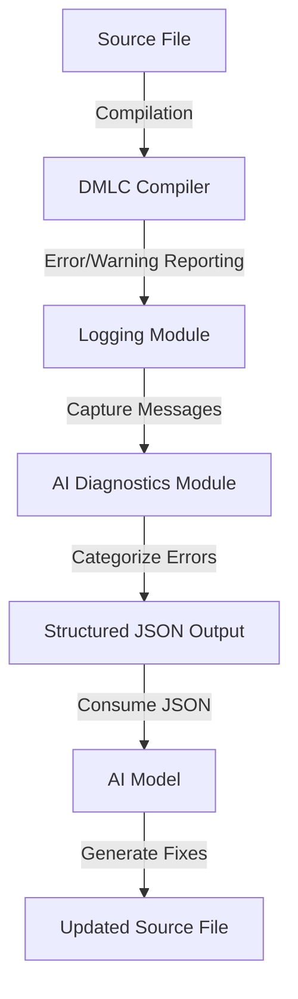
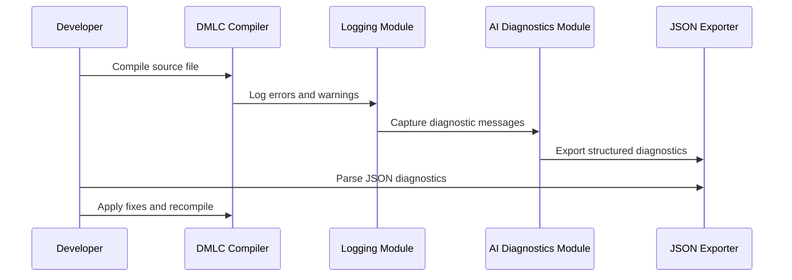

<details>
<summary>Relevant source files</summary>

The following files were used as context for generating this wiki page:

- [QUICKSTART_AI_DIAGNOSTICS.md](../QUICKSTART_AI_DIAGNOSTICS.md)
- [py/dml/logging.py](../py/dml/logging.py)
- [py/dml/ai_diagnostics.py](../py/dml/ai_diagnostics.py)
- [py/dml/dmlc.py](../py/dml/dmlc.py)
- [IMPLEMENTATION_SUMMARY.md](../IMPLEMENTATION_SUMMARY.md)
</details>

# Integration with AI Models

## Introduction

The integration of AI models with the Device Modeling Language Compiler (DMLC) introduces an innovative approach to error diagnostics and resolution. By exporting compilation errors and warnings in a structured JSON format, the DMLC compiler enables AI-assisted code generation and error correction. This system leverages the existing diagnostic infrastructure of DMLC, categorizes errors for better understanding, and provides actionable suggestions, making it highly compatible with AI-driven workflows. This page details the architecture, implementation, and usage of AI diagnostics within the DMLC framework.

## Architecture of AI Diagnostics Integration

The AI diagnostics system integrates seamlessly into the DMLC's error-reporting pipeline. It introduces a new module, `ai_diagnostics.py`, which collects and structures diagnostic messages, categorizes errors, and exports them in JSON format. The architecture includes the following components:

### Key Components

1. **AI Diagnostics Module (`ai_diagnostics.py`)**
   - Structures diagnostic messages using the `AIDiagnostic` class.
   - Categorizes errors into predefined categories using the `ErrorCategory` class.
   - Collects and exports diagnostic data through the `AIFriendlyLogger` class.
   - Provides actionable fix suggestions for each error type.

2. **Integration with DMLC (`dmlc.py`)**
   - Adds a new CLI flag `--ai-json` for enabling JSON-based diagnostics export.
   - Captures diagnostic messages during compilation and routes them to the AI diagnostics module.

3. **Logging Integration (`logging.py`)**
   - Hooks into the existing `report()` function to capture all error and warning messages for AI diagnostics.

### High-Level Data Flow



Sources: [py/dml/ai_diagnostics.py](), [py/dml/logging.py](), [py/dml/dmlc.py]()

## Error Categorization and Fix Suggestions

The AI diagnostics system categorizes errors into ten strategic categories. Each category is associated with specific fix strategies to assist developers and AI models in resolving issues.

### Error Categories

| Category            | Description                                     | Example Error Codes  |
|---------------------|-------------------------------------------------|----------------------|
| `syntax`            | Syntax errors in DML code                      | `ESYNTAX`, `PARSE`   |
| `type_mismatch`     | Type incompatibility errors                    | `ETYPE`, `ECAST`     |
| `template_resolution` | Template inheritance and instantiation errors | `EAMBINH`, `ECYCLIC` |
| `undefined_symbol`  | References to undefined symbols                | `EUNDEF`, `EREF`     |
| `duplicate_definition` | Multiple definitions of the same symbol       | `EDUP`, `EREDEF`     |
| `import_error`      | Import and module resolution errors            | `IMPORT`, `ECYCLIC`  |
| `semantic`          | Other semantic errors                          | Various              |
| `compatibility`     | DML version compatibility issues               | `ECOMPAT`, `EDML12`  |
| `deprecation`       | Use of deprecated features                     | `WDEPRECATED`        |
| `other`             | Miscellaneous warnings and info                | Various              |

Sources: [IMPLEMENTATION_SUMMARY.md](), [py/dml/ai_diagnostics.py]()

### Fix Suggestions

Each diagnostic includes actionable suggestions tailored to the error type. For example:
- **Undefined symbols**: "Check if the symbol is defined in imported files."
- **Type mismatches**: "Add type conversions or casting."
- **Template ambiguity**: "Add `is` statements to clarify precedence."

Sources: [QUICKSTART_AI_DIAGNOSTICS.md](), [py/dml/ai_diagnostics.py]()

## JSON Output Schema

The structured JSON output is designed for easy parsing by AI models. Below is an overview of the schema:

```json
{
  "format_version": "1.0",
  "generator": "dmlc-ai-diagnostics",
  "compilation_summary": {
    "input_file": "example.dml",
    "dml_version": "1.4",
    "total_diagnostics": 5,
    "total_errors": 3,
    "total_warnings": 2,
    "error_categories": {
      "type_mismatch": 1,
      "undefined_symbol": 1,
      "duplicate_definition": 1
    },
    "success": false
  },
  "diagnostics": [
    {
      "type": "error",
      "severity": "error",
      "code": "EUNDEF",
      "message": "undefined symbol 'x'",
      "category": "undefined_symbol",
      "location": {
        "file": "example.dml",
        "line": 12
      },
      "fix_suggestions": [
        "Check if the symbol is defined in imported files",
        "Verify the symbol name spelling"
      ]
    }
  ]
}
```

Sources: [QUICKSTART_AI_DIAGNOSTICS.md](), [IMPLEMENTATION_SUMMARY.md]()

## Sequence Diagram: AI Diagnostics Workflow



Sources: [py/dml/logging.py](), [py/dml/ai_diagnostics.py](), [py/dml/dmlc.py]()

## Implementation Details

### Key Functions and Classes

| Component              | Description                                                                 | Source File                     |
|------------------------|-----------------------------------------------------------------------------|---------------------------------|
| `AIDiagnostic`         | Structures individual diagnostic messages.                                 | `py/dml/ai_diagnostics.py`      |
| `AIFriendlyLogger`     | Collects diagnostics and exports them in JSON format.                      | `py/dml/ai_diagnostics.py`      |
| `ErrorCategory`        | Categorizes errors for AI-assisted resolution.                             | `py/dml/ai_diagnostics.py`      |
| `report()`             | Central logging function for capturing errors and warnings.                | `py/dml/logging.py`             |
| `--ai-json` CLI flag   | Enables AI diagnostics and specifies output file.                          | `py/dml/dmlc.py`                |

Sources: [py/dml/ai_diagnostics.py](), [py/dml/logging.py](), [py/dml/dmlc.py]()

## Summary

The integration of AI models with DMLC represents a significant enhancement in the development and debugging of DML code. By exporting structured diagnostics in JSON format, the system provides a foundation for AI-assisted error resolution, improving efficiency and reducing development time. This feature is backward-compatible, minimally invasive, and designed for extensibility, ensuring its long-term utility within the DML ecosystem.