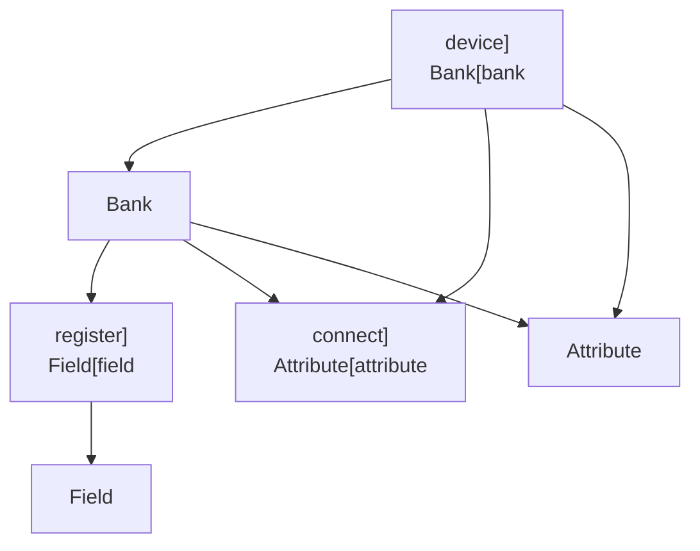
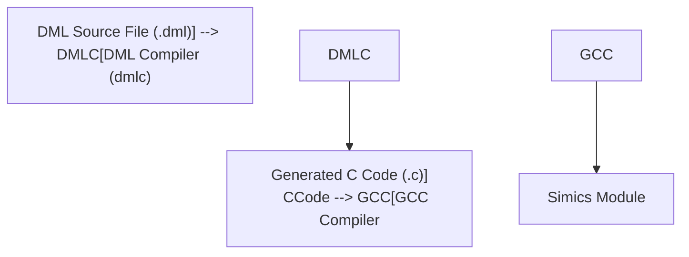

<details>
<summary>Relevant source files</summary>

The following files were used as context for generating this wiki page:

- [README.md](../README.md)
- [doc/1.2/introduction.md](../doc/1.2/introduction.md)
- [doc/1.4/introduction.md](../doc/1.4/introduction.md)
- [doc/1.4/running-dmlc.md](../doc/1.4/running-dmlc.md)
- [doc/1.2/object-model.md](../doc/1.2/object-model.md)
</details>

# Introduction to Device Modeling Language

## Introduction

The Device Modeling Language (DML) is a domain-specific programming language designed to simplify the development of device models for virtual platforms. It is primarily used in conjunction with the Intel Simics simulator to create fast, functional, or transaction-level models of hardware devices. DML offers high-level abstractions to represent common elements of device modeling, such as memory-mapped hardware registers, device attributes, connections to other devices, and checkpointable states. The language is compiled using the DML Compiler (`dmlc`), which generates C code tailored for the Simics simulator.

DML is object-oriented, allowing developers to represent devices as objects with state, attributes, and methods. Unlike general-purpose object-oriented languages, DML enforces static declaration of objects and emphasizes logical hardware components. This ensures the efficient simulation of device behaviors in virtual environments.

## Key Features of DML

| Feature                      | Description                                                                                  |
|------------------------------|----------------------------------------------------------------------------------------------|
| Object-Oriented Design       | Devices are modeled as objects with attributes, methods, and subobjects.                     |
| High-Level Abstractions      | Includes constructs for registers, bit fields, interfaces, logging, and event handling.      |
| Compiler Integration         | The `dmlc` compiler translates DML code into C for integration with the Simics simulator.    |
| Templates                    | Enables code reuse and abstraction through parameterized definitions.                        |
| Static Declarations          | Objects and their components are declared statically, optimizing simulation performance.     |
| Support for Simics API       | Provides built-in compatibility with the Simics simulator's API.                             |

Sources: [README.md](), [doc/1.2/introduction.md](), [doc/1.4/introduction.md]()

---

## Object Model in DML

DML is structured around an object model that defines devices as hierarchical compositions of objects. Each object type has specific roles and constraints based on its context within the hierarchy.

### Object Types and Hierarchy

| Object Type   | Allowed Contexts                | Description                                                                 |
|---------------|---------------------------------|-----------------------------------------------------------------------------|
| `device`      | Root of the hierarchy          | Represents the entire device model.                                         |
| `bank`        | Inside `device`                | Defines memory-mapped register banks.                                       |
| `register`    | Inside `bank`                  | Represents a memory-mapped register.                                        |
| `field`       | Inside `register`              | Defines specific bits or ranges within a register.                          |
| `connect`     | Inside `device`, `bank`, `port`| Represents connections to other devices or interfaces.                      |
| `attribute`   | Inside `device`, `bank`, etc.  | Defines configurable parameters or metadata for a device or component.      |



### Key Concepts

- **Encapsulation**: Objects form a nested scope, with each object having its namespace.
- **Static Declarations**: Objects are declared statically, ensuring a clear and optimized hierarchy.
- **Method Overrides**: Methods within objects can be overridden to customize behavior.

Sources: [doc/1.2/object-model.md](), [doc/1.4/introduction.md]()

---

## DML Compiler (`dmlc`)

The DML Compiler (`dmlc`) is responsible for translating DML code into C code, which can be compiled into Simics modules. The compiler supports various command-line options to customize the build process.

### Compiler Workflow



### Command-Line Options

| Option          | Description                                                                 |
|------------------|-----------------------------------------------------------------------------|
| `-h, --help`     | Displays usage help.                                                       |
| `-I <path>`      | Adds a directory to the search path for imported modules.                  |
| `-D <name>=<val>`| Defines a compile-time parameter.                                          |
| `--dep`          | Outputs makefile rules describing dependencies.                            |
| `-g`             | Generates artifacts for easier source-level debugging.                    |

### Example Usage

```bash
dmlc -I ./includes -D PARAM=1 my_device.dml output_base
```

This command compiles `my_device.dml`, including files from `./includes` and defining a parameter `PARAM` with a value of `1`. The generated C code will be based on `output_base`.

Sources: [doc/1.4/running-dmlc.md]()

---

## Example DML Model

Below is an example of a simple DML model defining a hypothetical device:

```dml
dml 1.4;

device example_device;

bank config_registers {
    register cfg1 size 4 @ 0x0000 {
        field status @ [7:6] is (read, write) {
            method read() -> (uint64) {
                return this.val;
            }
        }
    }
}
```

### Explanation

- **Device**: The `example_device` represents the device model.
- **Bank**: The `config_registers` defines a memory-mapped register bank.
- **Register**: The `cfg1` register occupies 4 bytes at address `0x0000`.
- **Field**: The `status` field spans bits 7-6 and supports read and write operations.

Sources: [doc/1.4/introduction.md:50-70]()

---

## Summary

The Device Modeling Language (DML) is a powerful tool for creating virtual device models optimized for the Simics simulator. Its object-oriented structure, high-level abstractions, and integration with Simics APIs make it an essential language for hardware simulation. The DML Compiler (`dmlc`) simplifies the process of generating C code, enabling seamless integration into simulation environments.

For further details, refer to the [DML 1.4 Reference Manual](#) and other relevant documentation.

Sources: [README.md](), [doc/1.2/introduction.md](), [doc/1.4/introduction.md](), [doc/1.4/running-dmlc.md](), [doc/1.2/object-model.md]()