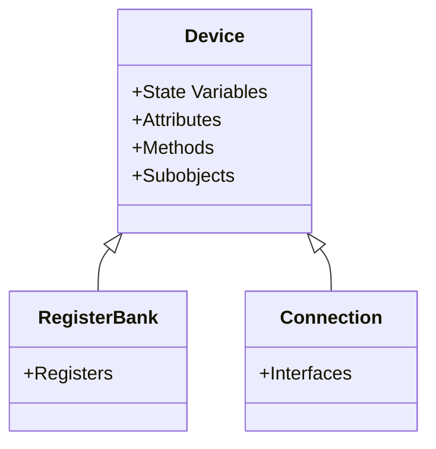
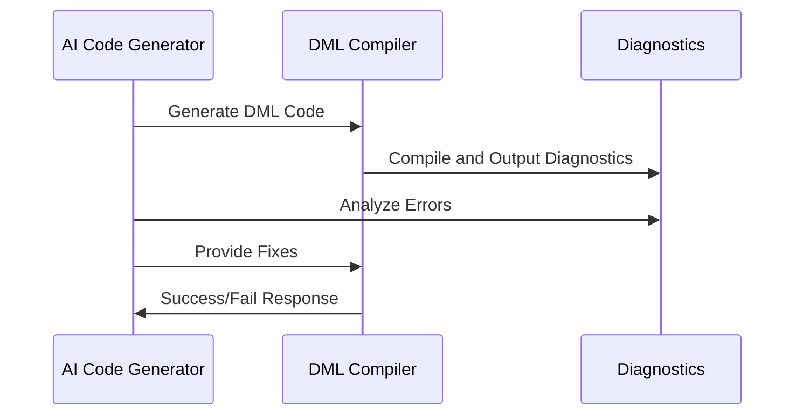

<details>
<summary>Relevant source files</summary>

The following files were used as context for generating this wiki page:

- [AI_DIAGNOSTICS_README.md](../AI_DIAGNOSTICS_README.md)
- [IMPLEMENTATION_SUMMARY.md](../IMPLEMENTATION_SUMMARY.md)
- [README.md](../README.md)
- [doc/1.4/introduction.md](../doc/1.4/introduction.md)
- [doc/1.2/introduction.md](../doc/1.2/introduction.md)
</details>

# Key Features of DML

## Introduction

The Device Modeling Language (DML) is a domain-specific programming language designed for developing device models used in simulation environments such as Intel's Simics. DML provides high-level abstractions to simplify the modeling of device-specific elements, including memory-mapped hardware registers, device connections, and checkpointable states. The DML Compiler (DMLC) translates these models into C code, making them suitable for integration with simulators. This wiki explores the key features of DML, focusing on its architecture, extensibility, and integration with AI diagnostics for error handling and code generation.

## High-Level Features of DML

### Object-Oriented Device Modeling

DML is an object-oriented language tailored for device simulation. Each device is represented as an object, which can contain:
- **State Variables**: Represent mutable device state.
- **Attributes and Parameters**: Define configurable properties.
- **Methods**: Encapsulate device behavior.
- **Subobjects**: Represent logical components of the device.

Devices are statically declared, ensuring efficient simulation performance. Features such as register banks, connections, and checkpointable state are natively supported.



*Sources: [doc/1.4/introduction.md](../doc/1.4/introduction.md), [doc/1.2/introduction.md](../doc/1.2/introduction.md)*

### Register and Memory Mapping

DML provides constructs for defining register banks and memory-mapped hardware registers. This allows developers to describe how device registers interact with memory and the simulator. The language includes features for:
- Register fields with specific access permissions (e.g., read-only, write-only).
- Memory offsets and alignment.
- Methods for handling register access logic.

```dml
bank config_registers {
    register cfg1 size 4 @ 0x0000 {
        field status @ [7:6] is (read, write) {
            method read() -> (uint64) {
                return this.val;
            }
        }
    }
}
```

*Sources: [doc/1.4/introduction.md](../doc/1.4/introduction.md)*

### Templates and Code Reuse

DML supports templates as a metaprogramming tool for reducing code duplication and enabling abstraction. Templates allow developers to define reusable components that can be instantiated with specific parameters.

*Sources: [doc/1.4/introduction.md](../doc/1.4/introduction.md)*

## AI-Friendly Diagnostics

### Overview

The DML Compiler (DMLC) includes an AI-friendly diagnostics module that provides structured error and warning data in JSON format. This feature facilitates integration with AI tools for automated error resolution and code generation.

### Error Categorization

Errors and warnings are categorized to streamline resolution. Categories include:
- **Syntax Errors**: Issues with DML syntax.
- **Type Mismatches**: Incompatible data types.
- **Undefined Symbols**: References to non-existent variables or functions.
- **Import Errors**: Problems with module resolution.
- **Deprecation Warnings**: Usage of outdated features.

| Category             | Description                         | Example Error Code |
|----------------------|-------------------------------------|--------------------|
| `syntax`            | Syntax errors in DML code          | `ESYNTAX`         |
| `type_mismatch`     | Type incompatibilities              | `ETYPE`           |
| `undefined_symbol`  | Missing variable or function        | `EUNDEF`          |

*Sources: [AI_DIAGNOSTICS_README.md](../AI_DIAGNOSTICS_README.md), [IMPLEMENTATION_SUMMARY.md](../IMPLEMENTATION_SUMMARY.md)*

### JSON Output Schema

The diagnostics module outputs errors in a structured JSON format, making it easy to parse and integrate into AI pipelines.

```json
{
  "format_version": "1.0",
  "generator": "dmlc-ai-diagnostics",
  "compilation_summary": {
    "input_file": "device.dml",
    "total_errors": 2,
    "success": false
  },
  "diagnostics": [
    {
      "type": "error",
      "code": "EUNDEF",
      "message": "undefined symbol 'foo'",
      "category": "undefined_symbol",
      "location": {"file": "device.dml", "line": 42},
      "fix_suggestions": ["Check imports", "Verify symbol name"]
    }
  ]
}
```

*Sources: [AI_DIAGNOSTICS_README.md](../AI_DIAGNOSTICS_README.md)*

### Integration with AI Workflows

The AI diagnostics feature is designed to assist in automated code generation and error correction workflows. Typical steps include:
1. **Code Generation**: AI generates DML code based on specifications.
2. **Compilation**: DMLC compiles the code and generates diagnostics.
3. **Error Correction**: AI analyzes diagnostics and suggests fixes.
4. **Iteration**: The process repeats until the code compiles successfully.



*Sources: [AI_DIAGNOSTICS_README.md](../AI_DIAGNOSTICS_README.md), [IMPLEMENTATION_SUMMARY.md](../IMPLEMENTATION_SUMMARY.md)*

## Extensibility and Compatibility

### Version Compatibility

DML supports multiple versions (e.g., 1.2 and 1.4) to ensure backward compatibility. Features can be marked as deprecated, and mechanisms are provided for smooth migration between versions.

*Sources: [doc/1.4/introduction.md](../doc/1.4/introduction.md), [README.md](../README.md)*

### Minimal Performance Impact

The AI diagnostics module is designed to have negligible impact on performance when disabled. It integrates seamlessly with existing error reporting mechanisms in DMLC.

*Sources: [IMPLEMENTATION_SUMMARY.md](../IMPLEMENTATION_SUMMARY.md)*

## Summary

DML is a powerful language for modeling device behavior in simulation environments. Its object-oriented design, support for templates, and AI-friendly diagnostics make it an invaluable tool for developers. The integration of structured diagnostics and backward compatibility ensures that DML remains both modern and user-friendly, while its extensibility paves the way for future advancements.