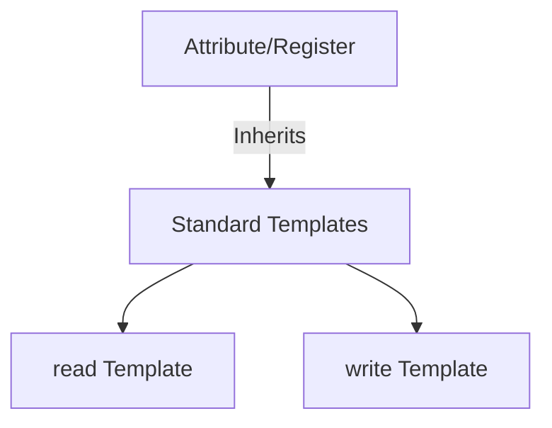
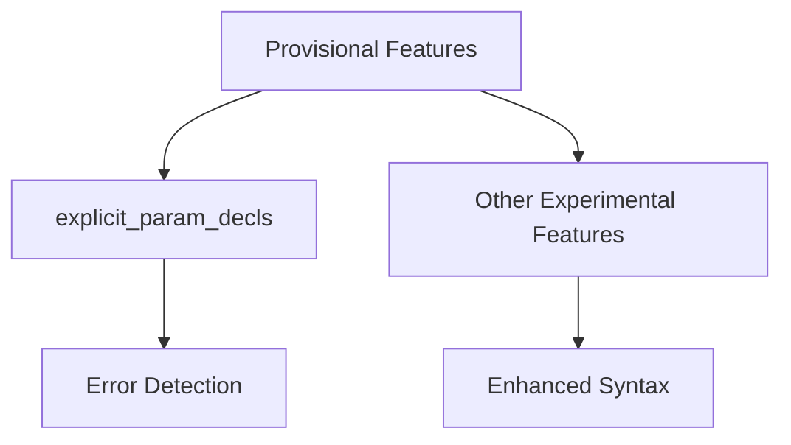
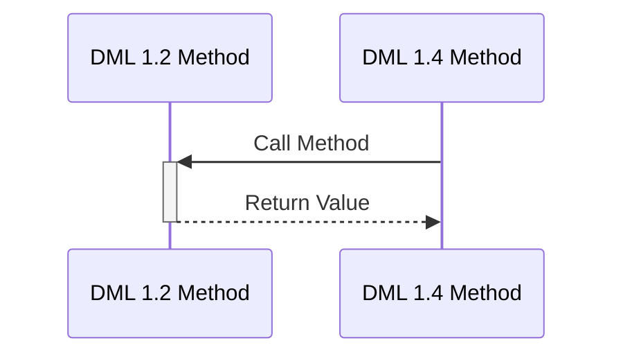
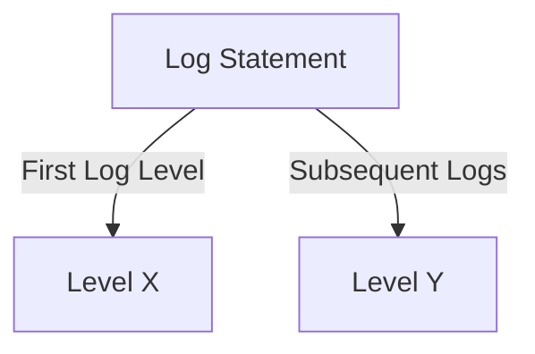

Relevant source files

- [RELEASENOTES.md](../RELEASENOTES.md)
- [RELEASENOTES-1.2.md](../RELEASENOTES-1.2.md)
- [RELEASENOTES-1.4.md](../RELEASENOTES-1.4.md)
- [doc/1.4/toc.json](../doc/1.4/toc.json)
- [doc/1.2/toc.json](../doc/1.2/toc.json)

# Release Notes

## Introduction

Release notes serve as a comprehensive record of updates, enhancements, fixes, and changes made to the Device Modeling Language (DML) project across different versions. They provide developers with a clear understanding of new features, resolved issues, and deprecated functionalities, ensuring seamless transitions between versions. This document covers release highlights for DML 1.2 and 1.4, detailing their impact on the system's architecture, usability, and compatibility.

The release notes are structured to present changes in a logical flow, starting with major updates and progressing to minor fixes and improvements. For a deeper understanding of specific modules or components referenced in these notes, see related documentation files such as `[Language Documentation](#language-overview)` and `[Utility Templates](#utility-templates)`.

---

## Major Updates in DML Versions

### DML 1.2 Highlights
- **Introduction of Standard Templates**: Templates such as `read` and `write` are now included by default in all DML files, eliminating the need for explicit imports. This simplifies the development process for attributes and registers.  
  Sources: [RELEASENOTES-1.2.md:12-15]()

- **Improved Compatibility**: The `import` statement now interprets paths starting with `./` as relative to the importing file's directory, enhancing usability.  
  Sources: [RELEASENOTES-1.2.md:19-21]()

- **Enhanced Debugging**: The build environment now supports the `DMLC_PORTING_TAG_FILE` environment variable, enabling easier migration to DML 1.4.  
  Sources: [RELEASENOTES-1.2.md:23-27]()

- **Error Handling Improvements**: Various fixes were implemented to address issues such as invalid UTF-8 characters and segmentation faults in specific scenarios.  
  Sources: [RELEASENOTES-1.2.md:30-35]()

### DML 1.4 Highlights
- **Provisional Language Features**: Introduced experimental features such as `explicit_param_decls`, which allow developers to explicitly declare parameters not intended as overrides.  
  Sources: [RELEASENOTES-1.4.md:10-15]()

- **Improved Type System**: Enhanced type-checking to detect and report errors that would previously result in invalid C code.  
  Sources: [RELEASENOTES-1.4.md:40-45]()

- **Compatibility Enhancements**: Added support for compatibility features such as `dml12-compatibility.dml`, enabling smoother transitions between DML 1.2 and 1.4.  
  Sources: [RELEASENOTES-1.4.md:50-55]()

- **New Syntax for Log Levels**: Added the ability to use `X then Y` syntax for log levels, providing greater control over logging behavior.  
  Sources: [RELEASENOTES-1.4.md:60-65]()

---

## Detailed Changes and Fixes

### Architecture and Templates

#### Standard Templates
The introduction of `read` and `write` templates by default in DML 1.2 simplifies the development of attributes and registers. Developers no longer need to explicitly import these templates, reducing boilerplate code.  

Sources: [RELEASENOTES-1.2.md:12-15]()

#### Provisional Features in DML 1.4
DML 1.4 introduced the concept of provisional language features, allowing experimental functionality to be enabled on a per-file basis. This includes features such as `explicit_param_decls`, which help catch misspelled overrides and improve code clarity.

Sources: [RELEASENOTES-1.4.md:10-15]()

---

### Error Handling and Debugging

#### Enhanced Debugging Support
DML 1.2 introduced the `DMLC_PORTING_TAG_FILE` environment variable, which generates a porting tag file during builds. This file provides machine-readable instructions for migrating devices to DML 1.4.

#### Improved Error Messages
Both versions focused on improving error messages for better clarity and usability. For instance, error messages related to `EATTRDATA` and type mismatches were refined to provide actionable insights.  

Sources: [RELEASENOTES-1.2.md:30-35](), [RELEASENOTES-1.4.md:40-45]()

---

### Compatibility Enhancements

#### DML 1.2 to 1.4 Transition
Compatibility features such as `dml12-compatibility.dml` allow DML 1.4 methods to call 1.2 methods without requiring additional error handling in certain cases. This is achieved through default implementations of methods like `read_register` and `write_register`.

Sources: [RELEASENOTES-1.4.md:50-55]()

---

### Logging Enhancements

#### Log Level Syntax
The `X then Y` syntax introduced in DML 1.4 allows developers to specify initial and subsequent log levels for logging statements. This feature enhances logging flexibility and control.

Sources: [RELEASENOTES-1.4.md:60-65]()

---

## Summary

The release notes for DML 1.2 and 1.4 highlight significant advancements in usability, error handling, and compatibility. Key features such as default templates, provisional language features, and enhanced debugging support demonstrate the project's commitment to developer productivity and system robustness. These updates ensure that DML remains a powerful and adaptable tool for device modeling across diverse environments.