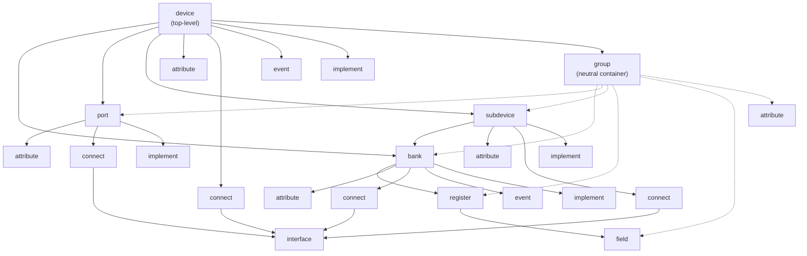
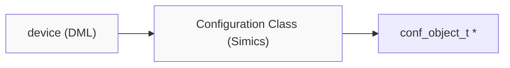
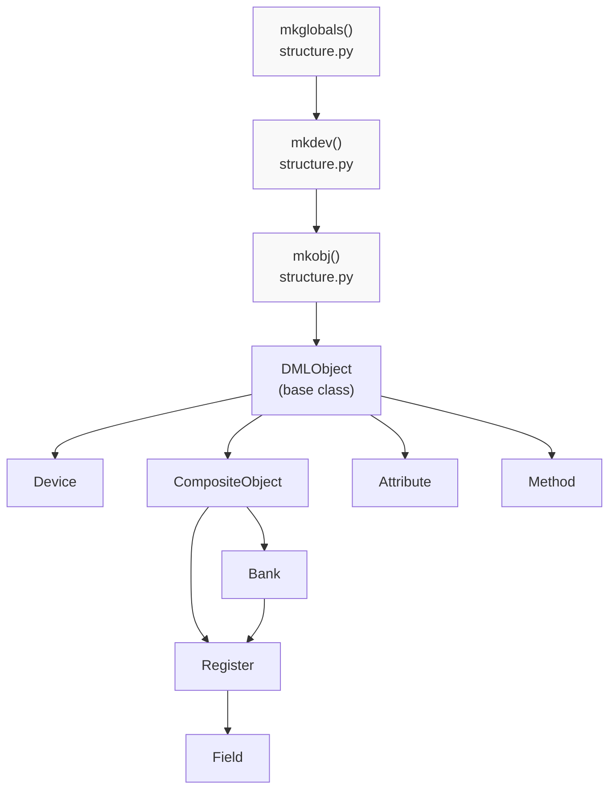
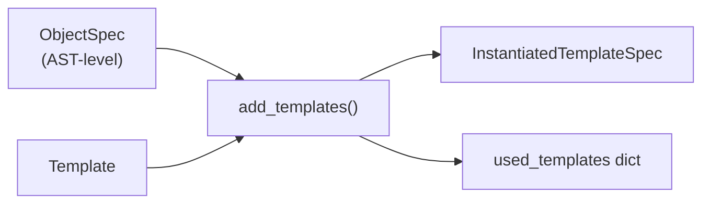
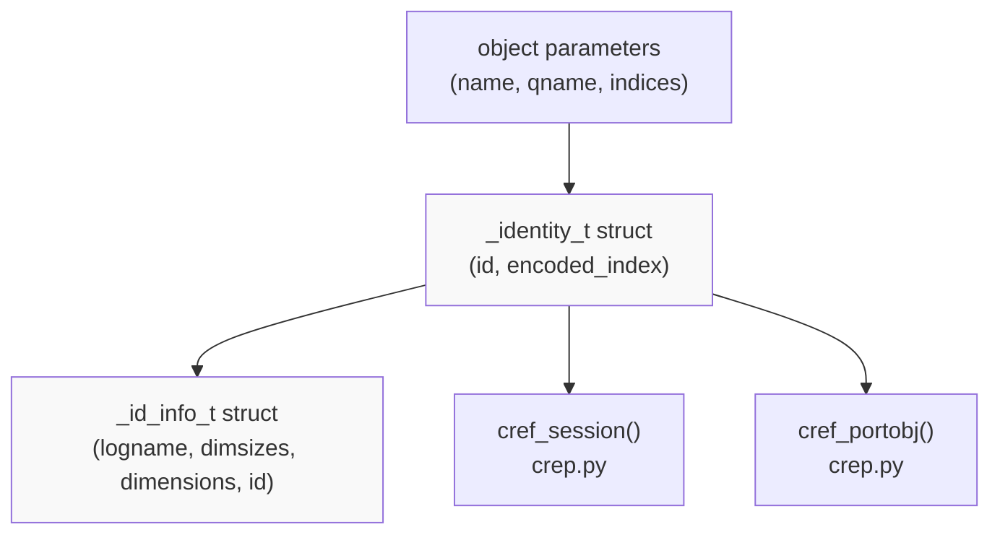
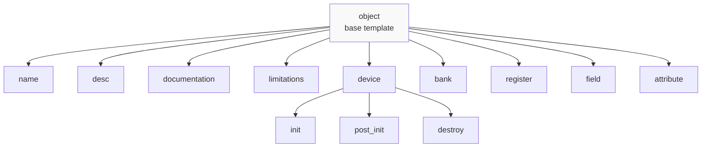

# Object Model

<details>
<summary>Relevant source files</summary>

The following files were used as context for generating this wiki page:

- [doc/1.4/language.md](doc/1.4/language.md)
- [lib/1.2/dml-builtins.dml](lib/1.2/dml-builtins.dml)
- [lib/1.4/dml-builtins.dml](lib/1.4/dml-builtins.dml)
- [py/dml/crep.py](py/dml/crep.py)
- [py/dml/dmlparse.py](py/dml/dmlparse.py)
- [py/dml/messages.py](py/dml/messages.py)
- [py/dml/structure.py](py/dml/structure.py)
- [py/dml/template.py](py/dml/template.py)
- [py/dml/traits.py](py/dml/traits.py)
- [py/dml/types.py](py/dml/types.py)

</details>


## Purpose and Scope

This page describes the **DML object model**, which defines the hierarchical structure of objects in a DML device model and the containment relationships between them. The object model specifies which object types can exist, how they nest within each other, and the common infrastructure provided by the `object` base template.

For information about the type system used by DML expressions and declarations, see [Type System](#3.3). For details on templates and code reuse mechanisms, see [Templates](#3.5). For the trait-based polymorphism system, see [Traits](#3.6). For comprehensive documentation on each object type's parameters and methods, see [Core Templates](#4.1).

## Object Hierarchy

Every DML model describes a single **device object** which contains a hierarchical tree of member objects. Each object has a specific **object type** (e.g., `bank`, `register`, `field`) that determines its role and capabilities. All objects inherit from the base `object` template, which provides common parameters and functionality.

### Object Containment Rules

The object model enforces strict containment rules that determine which object types can appear as children of other object types:



**Sources:** [doc/1.4/language.md:304-340](), [lib/1.4/dml-builtins.dml:269-747]()

Key containment rules:
- **device**: Top-level object; can contain `bank`, `port`, `subdevice`, `attribute`, `connect`, `implement`, `event`, and `group`
- **bank**: Can contain `register`, `attribute`, `connect`, `implement`, and `event`
- **register**: Can contain `field` objects
- **field**: Leaf node in the bank→register→field hierarchy
- **port** and **subdevice**: Similar containment rules to device
- **connect**: Can only contain `interface` objects
- **interface**: Must be directly under a `connect` object
- **implement**: Can only appear under `device`, `port`, `bank`, or `subdevice`
- **group**: Neutral container that can appear anywhere and inherit parent's containment rules (except cannot contain `interface` or `implement`)
- **event**: Can appear anywhere except under `field`, `interface`, `implement`, or another `event`

## Base Object Template

All DML objects inherit from the `object` template, which provides fundamental parameters and methods:

### Core Parameters

| Parameter | Type | Description |
|-----------|------|-------------|
| `this` | reference | Always refers to the current object |
| `objtype` | string constant | Object type (e.g., `"register"`, `"bank"`) |
| `parent` | reference or undefined | Containing object; `undefined` for device |
| `dev` | reference | The top-level device object |
| `name` | const char * | Object name exposed to end-user |
| `qname` | string | Fully qualified name including indices |
| `indices` | list | Local indices for this object (empty for non-arrays) |
| `templates` | auto | For template-qualified method calls |

**Sources:** [lib/1.4/dml-builtins.dml:540-578](), [doc/1.4/language.md:480-538]()

### Object Identity and Indexing

Objects can be declared as **arrays** with one or more index parameters:

```
register regs[i < 4][j < 11];  // 2D register array
```

The `indices` parameter contains the list of local indices `[i, j]`. Individual index parameters (like `i` and `j`) are also available, or can be named with the discard identifier `_` if not needed.

**Sources:** [lib/1.4/dml-builtins.dml:510-528]()

### Object Methods

The `object` template provides:
- **cancel_after()**: Cancels all pending `after` events associated with this object (but not subobjects)

Common lifecycle methods are available through template inheritance:
- **init()**: Called when device is created, before attributes are initialized
- **post_init()**: Called after attributes are initialized
- **destroy()**: Called when device is being deleted

**Sources:** [lib/1.4/dml-builtins.dml:530-537](), [lib/1.4/dml-builtins.dml:373-477]()

## Object Types

### Device Object

The `device` object represents the top-level scope of a DML file and corresponds to a Simics configuration class.



Key parameters:
- `classname`: Name of the Simics configuration class (defaults to device name)
- `obj`: Pointer to the `conf_object_t` C struct
- `register_size`: Default register width in bytes (inherited by banks)
- `byte_order`: Default byte order (`"little-endian"` or `"big-endian"`)
- `use_io_memory`: Default value for banks

**Sources:** [lib/1.4/dml-builtins.dml:626-722](), [doc/1.4/language.md:379-401]()

### Register Banks

A **bank** groups registers and exposes them through the `io_memory` Simics interface. Banks can be arrays, where each element is a separate Simics configuration object.

Bank configuration objects in Simics are named with a `.bank` prefix: for `bank regs[i < 2]` in device `dev`, the Simics objects are `dev.bank.regs[0]` and `dev.bank.regs[1]`.

**Sources:** [doc/1.4/language.md:402-420]()

### Registers and Fields

A **register** represents a hardware register with an integer value. Registers have a fixed size (1-8 bytes) and can be mapped to an address within the bank via the `offset` parameter, or left unmapped.

A **field** represents a bit range within a register. Fields enable modeling hardware registers where different bit ranges have different semantics:

```
register r0 size 2 @ 0x0000 {
    field status @ [2:0];     // bits 0-2
    field flags @ [8:3];      // bits 3-8
    field reserved @ [15:9];  // bits 9-15
}
```

**Sources:** [doc/1.4/language.md:421-636]()

### Attributes

An **attribute** object exposes device state to Simics for configuration, checkpointing, or inspection. Attributes define `get()` and `set()` methods and specify a Simics attribute type.

**Sources:** [lib/1.4/dml-builtins.dml:944-968](), [doc/1.4/language.md:638-668]()

### Connects and Interfaces

A **connect** object represents a connection to another Simics device or object. Each `connect` can contain **interface** objects that specify which Simics interfaces must be supported by the connected object.

**Sources:** [doc/1.4/language.md:669-709]()

### Implements

An **implement** object declares that the device implements a specific Simics interface, making it available to other objects in the simulation.

**Sources:** [doc/1.4/language.md:710-726]()

### Ports and Subdevices

**Port** objects group interfaces and connections, creating separate Simics configuration objects. **Subdevice** objects represent sub-components of a device with their own banks and hierarchy.

**Sources:** [doc/1.4/language.md:727-757]()

### Events

An **event** object represents a timed callback mechanism. Events can be scheduled to execute at a specific time or cycle count in the simulation.

**Sources:** [doc/1.4/language.md:758-786]()

### Groups

A **group** is a neutral container object used for organizational purposes. It can appear anywhere in the hierarchy and can contain any objects its parent can contain (with restrictions on `interface` and `implement`).

**Sources:** [lib/1.4/dml-builtins.dml:738-746](), [doc/1.4/language.md:336-339]()

## Implementation Architecture

### Python Object Representation

The DML compiler's Python implementation represents the object tree using classes defined in `py/dml/objects.py`. The structure-building process is coordinated by functions in `py/dml/structure.py`.



**Sources:** [py/dml/structure.py:74-112](), [py/dml/structure.py:39-41]()

### Object Creation Process

The compiler builds the object tree in phases:

1. **Global Symbol Collection** (`mkglobals()`): Processes top-level declarations (constants, typedefs, templates, externs, loggroups)

2. **Device Tree Construction** (`mkdev()`): Creates the device object hierarchy by:
   - Instantiating object declarations
   - Expanding templates with `add_templates()`
   - Merging parameter definitions with `merge_parameters()`
   - Resolving method overrides

3. **Template Instantiation**: The template system processes inheritance and composition:



**Sources:** [py/dml/structure.py:525-576](), [py/dml/template.py:64-146]()

### Parameter and Method Resolution

When multiple templates or object declarations define the same parameter or method, the compiler uses a **rank system** to determine precedence:

- Each `ObjectSpec` has a `Rank` with an `inferior` set
- A declaration in ObjectSpec A overrides a declaration in ObjectSpec B if A's rank's inferior set contains B's rank
- The `merge_parameters()` function computes the winning declaration
- The system reports `EAMBINH` errors if there's no unique superior declaration

**Sources:** [py/dml/structure.py:578-709](), [py/dml/template.py:24-62]()

### Object Identity and C Representation

Each object in the DML hierarchy has corresponding C structures and identifiers:



The `crep.py` module provides functions to generate C references to objects:
- `cref_session(node, indices)`: Reference to session/saved variables
- `cref_portobj(node, indices)`: Reference to port/bank/subdevice objects
- `cref_hook(hook, indices)`: Reference to hook objects
- `conf_object(site, node, indices)`: Get the `conf_object_t*` for an object

**Sources:** [lib/1.4/dml-builtins.dml:70-82](), [py/dml/crep.py:120-152]()

## Internal Object Parameters

The `object` template and its subtypes define several internal parameters used by the compiler:

| Parameter | Purpose |
|-----------|---------|
| `_ident` | Object identifier used in DML code |
| `_is_simics_object` | Whether this object maps to a Simics configuration object |
| `_nongroup_parent` | Closest ancestor that is not a group |
| `_object_relative_dims` | Number of dimensions relative to nearest Simics object |
| `_static_qname` | Statically-known portion of qualified name |

These parameters are primarily used during code generation and are not intended for user access.

**Sources:** [lib/1.4/dml-builtins.dml:540-578]()

## Object Template Inheritance

All standard object types inherit from the `object` template and may inherit additional templates:



The template system allows objects to inherit behavior from multiple templates while maintaining a clear override hierarchy through the rank system.

**Sources:** [lib/1.4/dml-builtins.dml:271-370](), [lib/1.4/dml-builtins.dml:626-722]()

## Relationship to Type System and Traits

The object model is distinct from but related to other DML subsystems:

- **Type System** ([#3.3](#3.3)): Objects have types, but the object hierarchy itself is not part of the type system. Session variables and fields have types from the type system.

- **Traits** ([#3.6](#3.6)): Templates can define trait types that support polymorphism. Objects instantiate templates, potentially implementing traits.

- **Templates** ([#3.5](#3.5)): The primary mechanism for code reuse in the object model. Every object instantiates its object-type template plus any additional templates specified via `is` declarations.

The object model defines the **structural** aspects of a device (what objects exist and how they nest), while types, traits, and templates define **behavioral** aspects (what operations are available and how they're implemented).

**Sources:** [py/dml/structure.py:1-41](), [py/dml/template.py:1-22]()