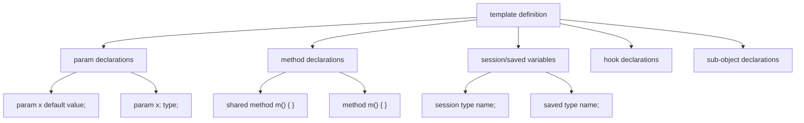
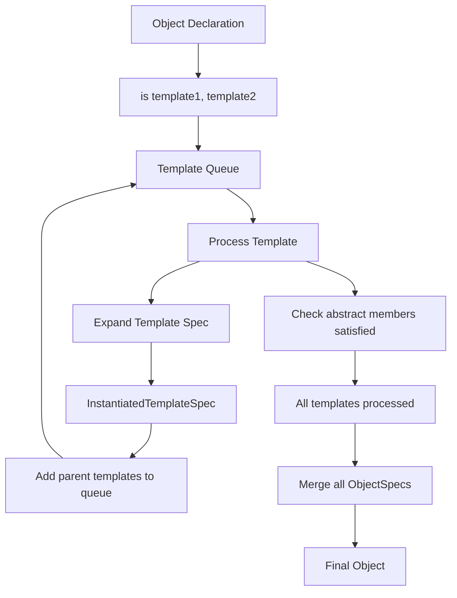
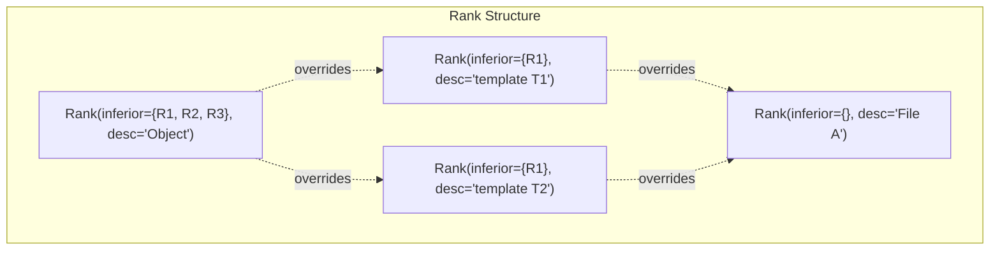
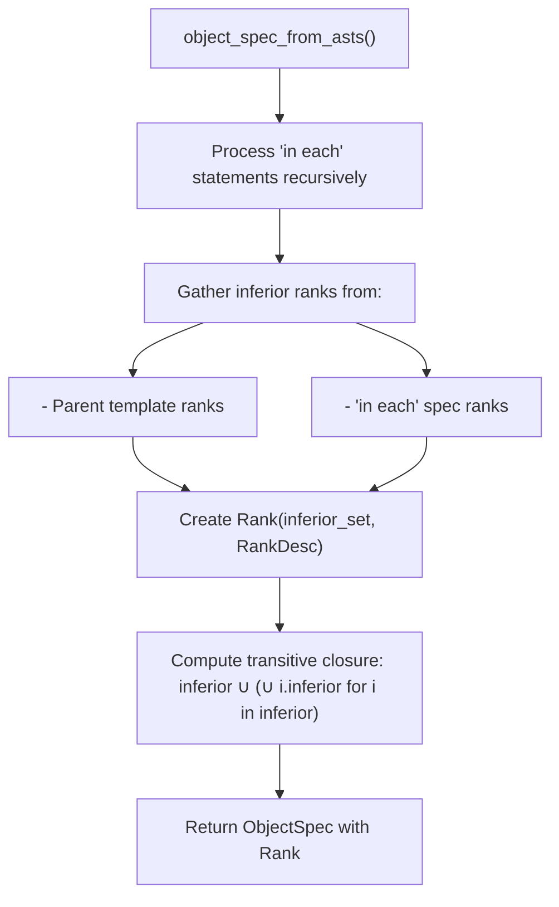
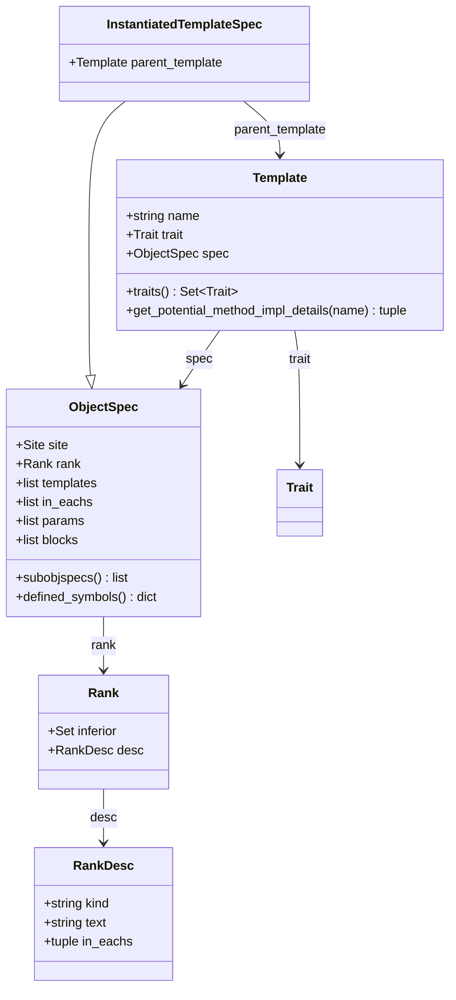
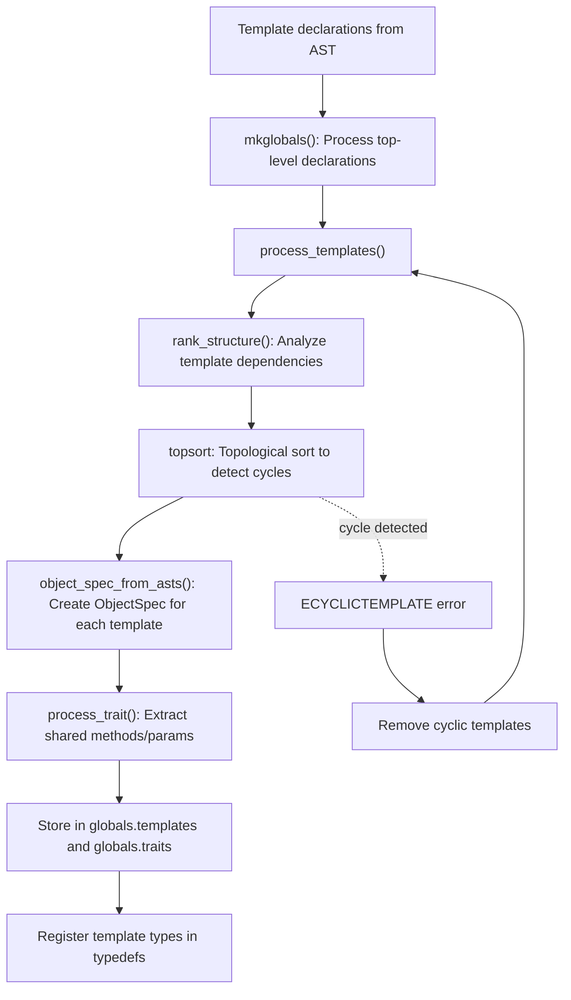
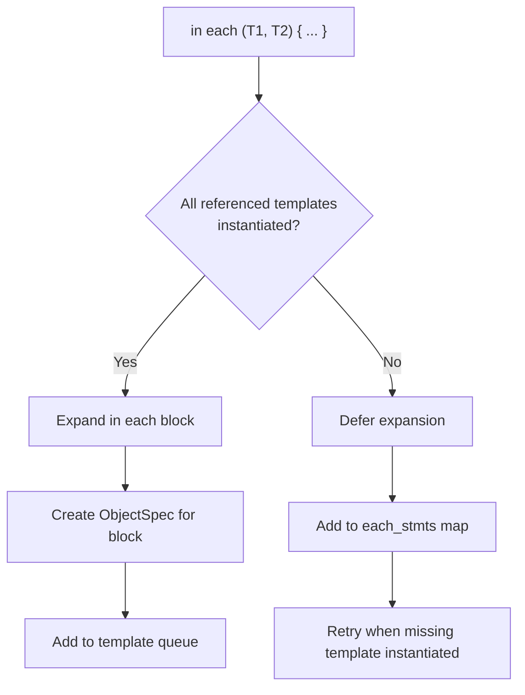
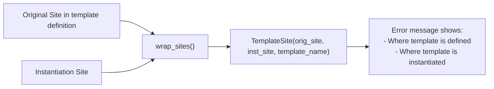

# Templates

<details>
<summary>Relevant source files</summary>

The following files were used as context for generating this wiki page:

- [doc/1.4/language.md](doc/1.4/language.md)
- [lib/1.2/dml-builtins.dml](lib/1.2/dml-builtins.dml)
- [lib/1.4/dml-builtins.dml](lib/1.4/dml-builtins.dml)
- [py/dml/crep.py](py/dml/crep.py)
- [py/dml/dmlparse.py](py/dml/dmlparse.py)
- [py/dml/messages.py](py/dml/messages.py)
- [py/dml/structure.py](py/dml/structure.py)
- [py/dml/template.py](py/dml/template.py)
- [py/dml/traits.py](py/dml/traits.py)
- [py/dml/types.py](py/dml/types.py)

</details>


## Purpose and Scope

Templates are DML's primary mechanism for code reuse and composition. A template is a reusable block of code containing parameters, methods, data fields, and other declarations that can be instantiated in multiple objects throughout a device model. Templates support multiple inheritance and provide a sophisticated precedence system for resolving conflicts when multiple templates define the same member.

This page covers template declaration, instantiation, inheritance rules, and the internal processing architecture. For information about the trait system (which templates may define), see [Traits](#3.6). For specific standard library templates, see [Standard Library](#4).

## Template Declaration and Structure

### Template Syntax

Templates are declared at the top level of a DML file or in imported modules:

```dml
template template_name {
    // template body
}
```

Templates can inherit from other templates using the `is` keyword:

```dml
template derived is base {
    // inherits all members from base
}
```

Multiple inheritance is supported:

```dml
template multi is (base1, base2, base3) {
    // inherits from all three templates
}
```

Sources: [lib/1.4/dml-builtins.dml:1-300](), [doc/1.4/language.md:286-295]()

### Template Members

A template can contain:
- **Parameters**: Static expressions that describe object properties
- **Methods**: Functions that implement object behavior
- **Session/Saved variables**: Runtime state storage
- **Hooks**: Event dispatch mechanisms (DML 1.4)
- **Sub-objects**: Nested object declarations



**Diagram: Template Member Types**

Sources: [py/dml/template.py:64-95](), [lib/1.4/dml-builtins.dml:284-398]()

### Abstract Declarations

Templates can declare abstract (unimplemented) members that must be provided by instantiating objects or derived templates:

```dml
template abstract_example {
    // Abstract method - no body
    shared method required_method();
    
    // Abstract parameter - no value
    param required_param;
}
```

Sources: [lib/1.4/dml-builtins.dml:387-398](), [py/dml/messages.py:234-248]()

## Template Instantiation

### Basic Instantiation

Objects instantiate templates using `is` statements:

```dml
bank b is register_bank {
    // inherits all members from register_bank
}
```

Multiple templates can be instantiated simultaneously:

```dml
register r is (read, write, init_val) {
    // combines behavior from all three templates
}
```

Sources: [py/dml/structure.py:525-576](), [doc/1.4/language.md:574-609]()

### Instantiation Process



**Diagram: Template Instantiation Pipeline**

The `add_templates` function in `structure.py` implements this breadth-first traversal:

| Step | Action | Code Reference |
|------|--------|----------------|
| 1 | Initialize queue with explicit `is` statements | [py/dml/structure.py:525-533]() |
| 2 | Process each template in queue | [py/dml/structure.py:530-576]() |
| 3 | Wrap template sites for error reporting | [py/dml/structure.py:464-512]() |
| 4 | Add template's parent templates to queue | [py/dml/structure.py:570-571]() |
| 5 | Expand `in each` blocks if matched | [py/dml/structure.py:553-568]() |

Sources: [py/dml/structure.py:525-576](), [py/dml/structure.py:464-512]()

### Conditional Instantiation

Templates can be instantiated conditionally using `#if` blocks:

```dml
register r {
    #if (some_condition) {
        is special_behavior;
    }
}
```

The compiler tracks which template references are unconditional to enable dead code elimination.

Sources: [py/dml/template.py:219-248](), [py/dml/template.py:321-360]()

## Template Inheritance and Override Precedence

### The Rank System

DML uses a **rank** system to determine precedence when multiple templates define the same parameter or method. Each instantiated template receives a `Rank` object that tracks its precedence relationships.



**Diagram: Rank Hierarchy Example**

A rank's `inferior` set contains all ranks it can override. When multiple definitions exist:
1. Find all definitions whose rank is not in any other's inferior set (highest-rank definitions)
2. If exactly one highest-rank definition exists, use it
3. If multiple highest-rank definitions exist with at least one non-default, report `EAMBINH` error

Sources: [py/dml/template.py:47-62](), [py/dml/structure.py:604-709]()

### Override Rules

**Parameter Override Rules:**
- A template's rank is superior to all its parent templates' ranks
- Non-default declarations take precedence over default declarations
- Multiple highest-rank definitions cause a conflict unless all are default

**Method Override Rules:**
- Similar precedence as parameters
- Abstract methods cannot override concrete methods
- Shared methods cannot override non-shared methods

Sources: [py/dml/structure.py:604-709](), [py/dml/structure.py:711-783]()

### Rank Calculation Algorithm



**Diagram: Rank Calculation Process**

The key insight is that each rank's `inferior` set includes not just direct parents, but the transitive closure of all ancestors. This ensures proper precedence even with deep inheritance hierarchies.

Sources: [py/dml/template.py:250-309](), [py/dml/structure.py:250-309]()

### Default Method Invocation

Methods can invoke their overridden implementation using `default()`:

```dml
template derived is base {
    method m() {
        // Call base implementation
        default();
        // Add additional behavior
    }
}
```

The compiler uses the rank system to determine which implementation `default()` refers to. If multiple candidates exist at the same rank level, an `EAMBDEFAULT` error is reported.

Sources: [py/dml/traits.py:117-137](), [py/dml/messages.py:184-198]()

## Template Processing Architecture

### Core Classes



**Diagram: Template Processing Class Hierarchy**

| Class | Purpose | File Location |
|-------|---------|---------------|
| `Template` | Represents a template declaration with name, trait, and specification | [py/dml/template.py:139-218]() |
| `ObjectSpec` | Partial specification of an object from template or object declaration | [py/dml/template.py:64-128]() |
| `InstantiatedTemplateSpec` | ObjectSpec for a specific template instantiation | [py/dml/template.py:130-137]() |
| `Rank` | Precedence ordering for override resolution | [py/dml/template.py:47-62]() |
| `RankDesc` | Human-readable description of rank for error messages | [py/dml/template.py:24-45]() |

Sources: [py/dml/template.py:24-218]()

### Template Processing Pipeline



**Diagram: Template Processing Flow in Compiler**

The `process_templates` function performs several key operations:

1. **Dependency Analysis**: `rank_structure()` analyzes each template's AST to determine which other templates it depends on (via `is` statements or sub-objects)

2. **Cycle Detection**: Templates that form inheritance cycles are detected and removed

3. **Trait Extraction**: For DML 1.4 templates, shared methods and typed parameters are extracted to form trait types

4. **Type Registration**: Template trait types are added to `typedefs` for use in type declarations

Sources: [py/dml/template.py:362-438](), [py/dml/structure.py:74-275]()

### In Each Statements

The `in each` construct allows conditional expansion of template content based on which templates are instantiated:

```dml
template base {
    in each (extension1, extension2) {
        // This block is only included if both
        // extension1 and extension2 are instantiated
    }
}
```

The rank structure tracks `in each` statements hierarchically, and they are processed during template instantiation:



**Diagram: In Each Statement Processing**

Sources: [py/dml/structure.py:553-568](), [py/dml/template.py:311-360]()

## Standard Library Templates

DML's standard library provides templates for all object types and common behaviors. These are automatically imported from `dml-builtins.dml`.

### Object Type Templates

Each DML object type has a corresponding template:

| Template | Object Type | Purpose | Key Parameters |
|----------|------------|---------|----------------|
| `object` | (base) | Base for all objects | `name`, `qname`, `dev`, `parent`, `indices` |
| `device` | device | Top-level device | `classname`, `obj`, `register_size`, `byte_order` |
| `bank` | bank | Register bank | `unmapped_registers`, `overlapping_registers` |
| `register` | register | Hardware register | `offset`, `size`, `init_val` |
| `field` | field | Register bit field | `msb`, `lsb` |
| `attribute` | attribute | Configuration attribute | `type`, `configuration`, `persistent` |
| `connect` | connect | Device connection | `interfaces`, `required` |
| `interface` | interface | Interface requirement | `required` |
| `event` | event | Timed callback | None (type-specific) |
| `port` | port | Interface container | None |
| `implement` | implement | Interface implementation | None |
| `group` | group | Organization grouping | None |

Sources: [lib/1.4/dml-builtins.dml:480-746](), [doc/1.4/language.md:304-340]()

### Universal Templates

Templates applicable to all object types:

- **`name`**: Provides `name` parameter (user-visible object name)
- **`desc`**: Provides `desc` and `shown_desc` parameters (documentation)
- **`documentation`**: Provides `documentation` parameter (detailed docs)
- **`limitations`**: Provides `limitations` parameter (implementation limitations)
- **`init`**: Provides `init()` method called during device creation
- **`post_init`**: Provides `post_init()` method called after attribute initialization
- **`destroy`**: Provides `destroy()` method called during device deletion

Sources: [lib/1.4/dml-builtins.dml:284-477]()

### Method Potential Implementation Resolution

The `Template` class provides `get_potential_method_impl_details()` to determine which templates may provide a method implementation. This is used for optimization and error detection:

```python
def get_potential_method_impl_details(self, method_name: str) -> tuple[bool, tuple['Template', ...]]:
    """
    Returns (provides_impl, next_candidates):
    - provides_impl: This template specifies an implementation
    - next_candidates: Unrelated ancestor templates with implementations
    """
```

This method traverses the template hierarchy to find all potential implementations, accounting for conditional blocks that may provide implementations only under certain conditions.

Sources: [py/dml/template.py:159-217]()

## Template Wrapping for Error Reporting

When templates are instantiated, their sites are wrapped with `TemplateSite` objects to provide better error messages:



**Diagram: Template Site Wrapping for Error Messages**

The `wrap_sites()` function recursively wraps all AST nodes within a template with `TemplateSite` objects. When an error occurs, the compiler can report both the template definition location and the instantiation location.

Sources: [py/dml/structure.py:464-512]()