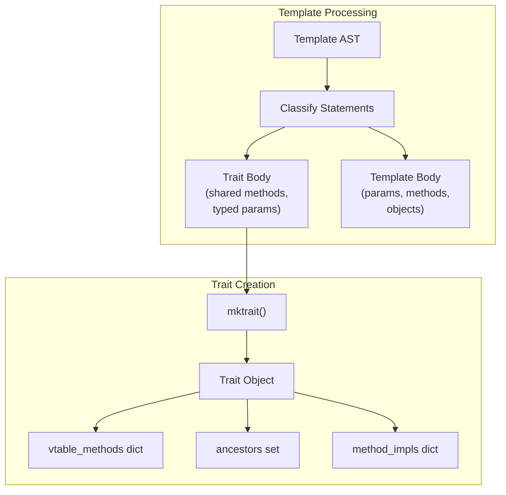
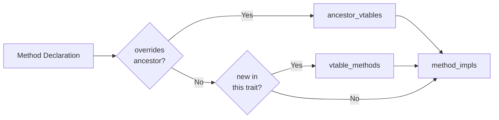
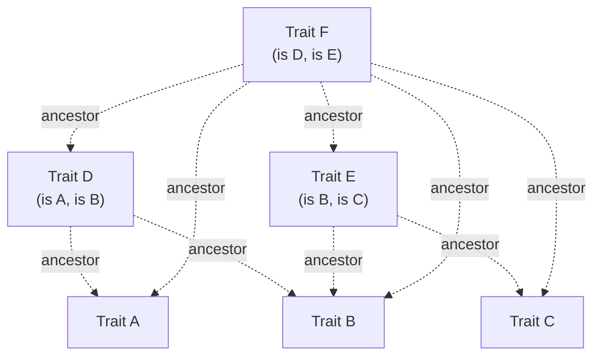
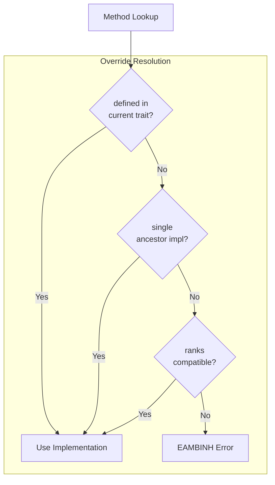
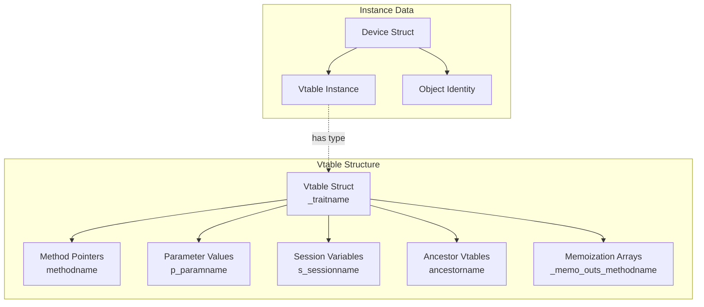
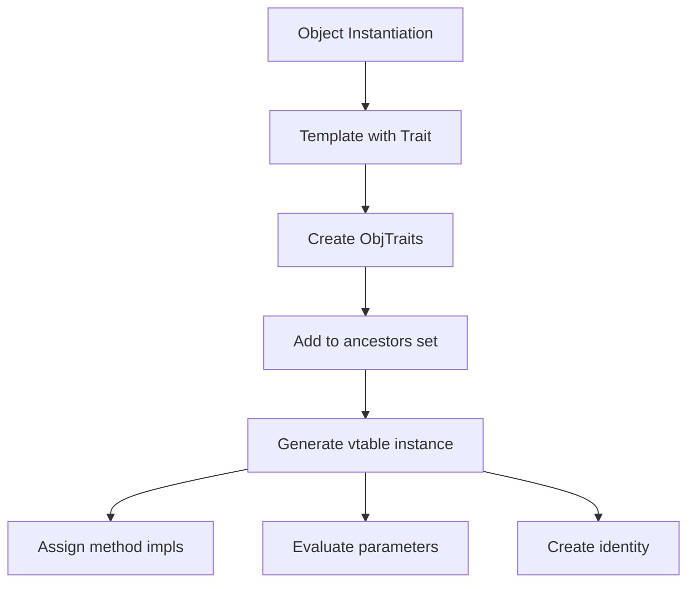
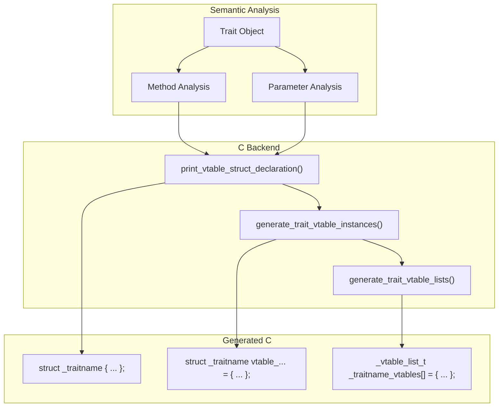

# Traits

<details>
<summary>Relevant source files</summary>

The following files were used as context for generating this wiki page:

- [doc/1.4/language.md](doc/1.4/language.md)
- [include/simics/dmllib.h](include/simics/dmllib.h)
- [py/dml/c_backend.py](py/dml/c_backend.py)
- [py/dml/codegen.py](py/dml/codegen.py)
- [py/dml/crep.py](py/dml/crep.py)
- [py/dml/ctree.py](py/dml/ctree.py)
- [py/dml/dmlparse.py](py/dml/dmlparse.py)
- [py/dml/messages.py](py/dml/messages.py)
- [py/dml/structure.py](py/dml/structure.py)
- [py/dml/template.py](py/dml/template.py)
- [py/dml/traits.py](py/dml/traits.py)
- [py/dml/types.py](py/dml/types.py)

</details>


## Purpose and Scope

This page describes DML's **trait system**, which provides trait-based polymorphism through vtables and multiple inheritance. Traits enable code reuse and polymorphic behavior by defining shared methods and typed parameters that objects can implement.

For information about templates (which are closely related but serve a different purpose), see [Templates](#3.5). For details on the object model that traits operate within, see [Object Model](#3.4). For runtime method dispatch mechanics, see [Methods and Parameters](#3.7).

---

## Overview

Traits in DML are a form of templates that support polymorphism through **shared methods**. When a template defines shared methods or typed parameters, it becomes a trait, and objects instantiating that trait can be referenced polymorphically through **trait references**. The compiler generates **vtables** (virtual function tables) to enable dynamic dispatch of shared methods at runtime.

Key characteristics:
- **Multiple inheritance**: Objects can implement multiple traits
- **Diamond inheritance resolution**: Automatic handling of diamond patterns in trait hierarchies  
- **Vtable-based dispatch**: Shared methods are called through function pointers in vtables
- **Type safety**: Trait references are typed and enforce trait compatibility
- **Independent methods**: Shared methods marked `independent` don't require device context

Sources: [py/dml/traits.py:1-35](), [doc/1.4/language.md:1-30]()

---

## Trait Definition and Creation

### Templates as Traits

A template becomes a trait when it contains:
1. **Shared methods** - methods declared with the `shared` keyword
2. **Typed parameters** - parameters with explicit type declarations (`param x: type`)
3. **Session/saved variables** - state variables in templates (in DML 1.4)



**Diagram: Template to Trait Processing**

Sources: [py/dml/structure.py:141-175](), [py/dml/traits.py:36-115]()

### Trait Object Structure

The `Trait` class (defined in [py/dml/traits.py:405-605]()) contains:

| Field | Type | Purpose |
|-------|------|---------|
| `name` | str | Trait name (template name) |
| `site` | Site | Declaration location |
| `ancestors` | Set[Trait] | All ancestor traits (transitive closure) |
| `vtable_methods` | dict[str, TraitMethod] | Methods in this trait's vtable |
| `ancestor_vtables` | dict[str, Trait] | Maps method name to trait that owns its vtable slot |
| `method_impls` | dict[str, TraitMethod] | All method implementations (including inherited) |
| `typed_params` | dict[str, Type] | Typed parameter declarations |
| `sessions` | dict[str, Type] | Session variable types |
| `hooks` | dict[str, HookInfo] | Hook declarations |

Sources: [py/dml/traits.py:405-450]()

### Method Classification

The `mktrait()` function processes method declarations:



**Diagram: Method Classification Logic**

Sources: [py/dml/traits.py:116-228]()

---

## Trait Inheritance and Ancestry

### Multiple Inheritance Model

DML traits support multiple inheritance. When a template instantiates multiple parent traits, all parent traits become ancestors:



**Diagram: Multiple Inheritance Example**

Sources: [py/dml/traits.py:229-290]()

### Ancestry Resolution

The `calc_minimal_ancestry()` function ([py/dml/traits.py:621-687]()) computes the minimal set of ancestors needed for override resolution. This handles diamond inheritance patterns:

**Diamond Pattern Example:**
```
    A
   / \
  B   C
   \ /
    D
```

In this case, `D` inherits from both `B` and `C`, which both inherit from `A`. The minimal ancestry ensures `A` appears only once in the resolution order.

The algorithm:
1. Start with immediate parents
2. Add their ancestors transitively
3. Remove ancestors that are dominated by other ancestors
4. Return the minimal set that preserves override ordering

Sources: [py/dml/traits.py:621-687]()

### Method Override Resolution

When multiple traits provide implementations of the same method, the override order is determined by:

1. **Direct definition** - if the current trait defines the method, it takes precedence
2. **Rank-based ordering** - template instantiation order determines rank
3. **Minimal ancestry** - ancestors not dominated by other ancestors can provide implementations



**Diagram: Method Override Resolution**

Sources: [py/dml/traits.py:291-370]()

---

## Trait Types and References

### Type System Integration

DML provides several type constructs for traits:

| Type | C Representation | Purpose |
|------|------------------|---------|
| `TTrait` | `_traitref_t` | Reference to a trait-implementing object |
| `TTraitList` | N/A (compile-time only) | Sequence type for `each T in (...)` |
| Trait name (as type) | `_traitref_t` | Typedef for trait references |

Sources: [py/dml/types.py:41-51]()

### Trait Reference Structure

In generated C code, trait references use the `_traitref_t` structure:

```c
typedef struct {
    void *trait;           // Pointer to vtable
    _identity_t id;        // Object identity
} _traitref_t;
```

Components:
- **`trait` pointer**: Points to the vtable instance for the specific trait
- **`id` structure**: Identifies the object instance (object ID + array index)

Sources: [include/simics/dmllib.h:209-224]()

### Identity System

The identity system tracks object instances for trait references:

```c
typedef struct {
    uint32 id;              // Unique object ID
    uint32 encoded_index;   // Flattened array index
} _identity_t;
```

Each DML object has:
- **Unique ID** - assigned during compilation, stored in `_id_infos` array
- **Encoded index** - for array objects, a single integer encoding all indices

The `_id_info_t` structure provides metadata:

```c
typedef struct {
    const char *logname;    // Fully qualified object name
    const uint32 *dimsizes; // Array dimensions
    uint32 dimensions;      // Number of dimensions
    uint32 id;              // Object ID
} _id_info_t;
```

Sources: [include/simics/dmllib.h:209-219]()

---

## Vtable Structure and Generation

### Vtable Layout

Each trait generates a C struct type representing its vtable. The vtable contains:

1. **Method pointers** - function pointers for each shared method in the trait
2. **Parameter values** - values for typed parameters
3. **Ancestor vtables** - nested vtable structures for ancestor traits
4. **Memoization state** - for memoized methods (if applicable)



**Diagram: Vtable Structure and Instances**

Sources: [py/dml/c_backend.py:1464-1550]()

### Vtable Generation Process

The compiler generates vtables through several steps:

1. **Print vtable struct declaration** ([py/dml/c_backend.py:1464-1550]()):
   - Define struct with method pointers, parameters, ancestors
   - Handle typed parameters with index-dependent values
   - Include memoization state for memoized methods

2. **Populate vtable instances** ([py/dml/c_backend.py:1551-1690]()):
   - Initialize method pointers to generated functions
   - Set parameter values (constant or array)
   - Recursively initialize ancestor vtables
   - Allocate memoization arrays for independent memoized methods

3. **Create vtable lists** ([py/dml/c_backend.py:1691-1750]()):
   - Group all vtable instances for a trait
   - Store in `_vtable_list_t` structures
   - Enable `each T in (...)` iteration

Sources: [py/dml/c_backend.py:1464-1750]()

### Parameter Representation in Vtables

Typed parameters in vtables use a special encoding:

**Constant parameters:**
- Stored as single value
- Pointer's LSB is 0
- Same value used for all array indices

**Index-dependent parameters:**
- Stored as array (one value per encoded index)
- Pointer's LSB is 1
- Index into array using `encoded_index`

The `VTABLE_PARAM` macro ([include/simics/dmllib.h:319-324]()) extracts the value:
```c
#define VTABLE_PARAM(traitref, vtable_type, member)    \
    ({ uintptr_t __member = (uintptr_t)...;            \
       ((typeof(...))(__member & ~1))[                 \
          (__member & 1) ? __tref.id.encoded_index : 0]; })
```

Sources: [include/simics/dmllib.h:312-324](), [py/dml/c_backend.py:1551-1600]()

---

## Object Traits Management

### ObjTraits Class

Each DML object that implements traits has an associated `ObjTraits` instance ([py/dml/objects.py:90-180]()), which manages:

| Field | Purpose |
|-------|---------|
| `obj` | Reference to the DML object |
| `ancestors` | Set of all implemented traits |
| `vtables` | Map trait → vtable instance identifier |
| `identities` | Map trait → object identity expression |
| `vtable_params` | Map (trait, param) → parameter value |
| `vtable_methods` | Map (trait, method) → method implementation |

Sources: [py/dml/objects.py:90-180]()

### Trait Implementation Process

When an object instantiates a template that is a trait:



**Diagram: Object Trait Implementation**

Sources: [py/dml/structure.py:1420-1550]()

### Trait Method Resolution for Objects

The `TraitObjMethod` class ([py/dml/traits.py:371-403]()) represents a bound method on an object implementing a trait:

1. **Lookup method in object's traits** - find which trait(s) provide the method
2. **Resolve to single implementation** - handle multiple inheritance
3. **Generate trait reference** - create `_traitref_t` pointing to correct vtable
4. **Call through vtable** - use `CALL_TRAIT_METHOD` macro

Sources: [py/dml/traits.py:371-403]()

---

## Method Dispatch and Calling Conventions

### Shared Method Signatures

Shared methods have a specific calling convention:

**Non-independent shared methods:**
```c
rettype methodname(
    device_t *_dev,           // Device instance
    _traitref_t _traitname,   // Implicit trait reference
    // ... input parameters ...
)
```

**Independent shared methods:**
```c
rettype methodname(
    _traitref_t _traitname,   // Implicit trait reference
    // ... input parameters ...
)
```

The implicit trait reference provides:
- **Vtable pointer** - for accessing parameters and calling other methods
- **Object identity** - for accessing session variables and other state

Sources: [py/dml/traits.py:213-220](), [py/dml/codegen.py:2100-2150]()

### Method Dispatch Macros

The C runtime provides macros for calling trait methods:

**Direct calls (method name known at compile time):**
```c
CALL_TRAIT_METHOD(traitname, methodname, dev, traitref, args...)
CALL_INDEPENDENT_TRAIT_METHOD(traitname, methodname, traitref, args...)
```

**Indirect calls (method pointer from vtable):**
```c
((struct _traitname *) traitref.trait)->methodname(dev, traitref, args...)
```

Sources: [include/simics/dmllib.h:298-310]()

### Upcasting and Downcasting

Trait references can be cast between ancestor and descendant traits:

**Upcast (subtype → supertype):**
```c
#define UPCAST(expr, from, ancestry) \
    ({_traitref_t __tref = expr;     \
      __tref.trait = (char *)(__tref.trait) + offsetof(struct _ ## from, ancestry); \
      __tref;})
```

**Downcast (supertype → subtype):**
```c
#define DOWNCAST(expr, to, ancestry) \
    ({_traitref_t __tref = expr;     \
      __tref.trait = (char *)(__tref.trait) - offsetof(struct _ ## to, ancestry); \
      __tref;})
```

The cast adjusts the vtable pointer to point to the correct ancestor vtable within the struct.

Sources: [include/simics/dmllib.h:274-296]()

---

## Session Variables and Hooks in Traits

### Session Variable Access

Session variables declared in traits (DML 1.4 only) are stored per object instance, not in vtables. Access requires:

1. **Identity lookup** - use `_traitref_t.id` to identify the object
2. **Device structure access** - locate the session variable in device struct
3. **Index into array** - use `encoded_index` for array objects

The compiler generates accessor functions for session variables in traits.

Sources: [py/dml/traits.py:76-84](), [py/dml/c_backend.py:1600-1650]()

### Hooks in Traits

Hooks declared in traits are similar to session variables:

- Stored in device structure (not vtables)
- Accessed via identity system
- May be arrays if hook is declared with dimensions

Hook callbacks can be trait methods, enabling polymorphic event handling.

Sources: [py/dml/traits.py:96-109]()

---

## Code Generation Details

### Vtable Code Generation Pipeline



**Diagram: Vtable Code Generation Pipeline**

Sources: [py/dml/c_backend.py:335-338](), [py/dml/c_backend.py:1464-1750]()

### Method Implementation Generation

For each shared method:

1. **Generate C function** ([py/dml/traits.py:224-290]()):
   - Function signature with implicit trait argument
   - Method body with proper scope and context
   - Default method handling if method is overridable

2. **Register in vtable** ([py/dml/c_backend.py:1551-1600]()):
   - Set function pointer in vtable struct
   - Handle ancestor method inheritance

3. **Memoization support** (if applicable) ([py/dml/codegen.py:330-420]()):
   - Generate memoization state struct
   - Initialize memoization arrays in vtables
   - Wrap method body with memoization prelude

Sources: [py/dml/traits.py:224-290](), [py/dml/c_backend.py:1551-1600]()

### `each T in` Expression Support

The `each T in (expr)` syntax creates sequences of trait references. The compiler:

1. **Evaluates expression** to `_each_in_t` structure
2. **Generates vtable lists** - arrays of `_vtable_list_t` for the trait
3. **Creates foreach loop** - iterates through vtable instances

The `_each_in_t` structure ([include/simics/dmllib.h:237-251]()):
```c
typedef struct {
    uint32 base_idx;    // Index into global vtable list
    uint32 num;         // Number of vtable lists
    uint32 array_idx;   // For partial array iteration
    uint32 array_size;  // Total array size
} _each_in_t;
```

Sources: [include/simics/dmllib.h:237-271](), [py/dml/ctree.py:959-1009]()

---

## Type Checking and Validation

### Trait Method Type Checking

The `typecheck_method_override()` function ([py/dml/traits.py:689-750]()) validates that method overrides are compatible:

- **Input parameter types** must match exactly
- **Output parameter types** must match exactly  
- **Throws specification** must match
- **Independence** must match

Any mismatch generates an `ETMETHTYPE` error.

Sources: [py/dml/traits.py:689-750]()

### Trait Compatibility Checking

When casting between traits:

1. **Upcast** - target must be an ancestor of source
2. **Downcast** - source must be an ancestor of target
3. **Cross-cast** - not allowed (generates `ETEMPLATEUPCAST` error)

The `ancestry_paths` dictionary ([py/dml/traits.py:490-550]()) stores paths through the inheritance graph for validation.

Sources: [py/dml/traits.py:490-550](), [py/dml/messages.py:228-233]()

---

## Runtime Support Functions

### Trait Reference Operations

The runtime library provides several utility functions:

| Function | Purpose |
|----------|---------|
| `_count_eachin()` | Count elements in an `_each_in_t` sequence |
| `_DML_format_indices()` | Format object indices for error messages |
| `VTABLE_PARAM()` | Extract parameter value from vtable |
| `UPCAST()` | Cast trait reference to ancestor trait |
| `DOWNCAST()` | Cast trait reference to descendant trait |

Sources: [include/simics/dmllib.h:265-324]()

### Error Handling

When trait method calls fail or indices are out of bounds:

```c
NORETURN static void _DML_assert_indices_fail(
    const char *restrict logname,
    const char *restrict method_name,
    const uint32 *restrict indices,
    const uint32 *restrict dimsizes,
    int len)
```

This generates a fatal error with detailed information about the failed access.

Sources: [include/simics/dmllib.h:58-77]()

---

## Key Implementation Files

| File | Purpose |
|------|---------|
| [py/dml/traits.py]() | Core trait processing and Trait class |
| [py/dml/types.py]() | Trait type definitions (`TTrait`, etc.) |
| [py/dml/structure.py]() | Template-to-trait conversion |
| [py/dml/codegen.py]() | Trait method code generation |
| [py/dml/c_backend.py]() | Vtable structure and instance generation |
| [py/dml/ctree.py]() | Trait-related ctree nodes |
| [include/simics/dmllib.h]() | C runtime support for traits |

Sources: Listed files above