# Methods and Parameters

<details>
<summary>Relevant source files</summary>

The following files were used as context for generating this wiki page:

- [doc/1.4/language.md](doc/1.4/language.md)
- [py/dml/crep.py](py/dml/crep.py)
- [py/dml/dmlparse.py](py/dml/dmlparse.py)
- [py/dml/messages.py](py/dml/messages.py)
- [py/dml/structure.py](py/dml/structure.py)
- [py/dml/template.py](py/dml/template.py)
- [py/dml/traits.py](py/dml/traits.py)
- [py/dml/types.py](py/dml/types.py)

</details>


This page describes DML's system for methods and parameters, covering their declaration syntax, types, override rules, and calling conventions. For information about how methods and parameters are used within templates and traits, see [Templates](#3.5) and [Traits](#3.6). For the standard library's built-in methods and parameters, see [Core Templates (dml-builtins)](#4.1).

## Parameters

Parameters are compile-time expressions that describe static properties of objects. Unlike variables, parameters are expanded at compile time and cannot be modified at runtime. They are similar to macros but with stricter scoping rules and type-safety options.

### Parameter Declarations

Parameters are declared using the `param` keyword with several possible forms:

```
param name = expression;                    // Simple parameter
param name default = expression;            // Default parameter (can be overridden)
param name: type = expression;              // Typed parameter (DML 1.4 only)
param name: type;                           // Abstract typed parameter (DML 1.4 only)
param name := expression;                   // Override declaration (DML 1.4 only)
```

**Sources:** [doc/1.4/language.md:342-358](), [py/dml/dmlparse.py:1093-1150]()

### Parameter Evaluation and Scoping

Parameters are evaluated in the scope where they are defined, not where they are referenced. This means a parameter can reference other parameters or methods from its defining object:

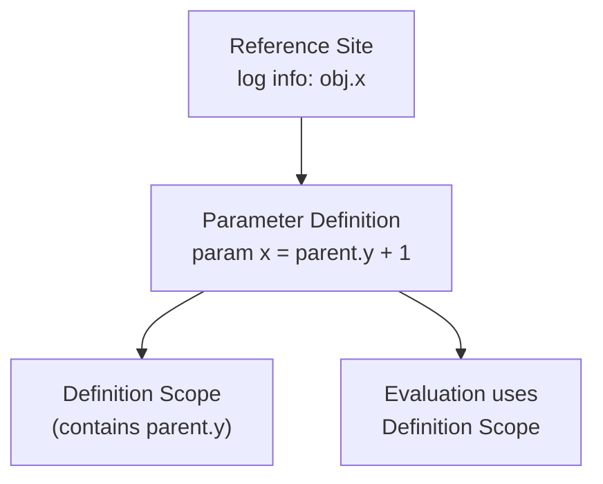

**Sources:** [doc/1.4/language.md:350-357](), [py/dml/structure.py:514-523]()

### Parameter Types

#### Untyped Parameters
Traditional DML parameters that can hold any expression. The type is determined by the expression itself:

```dml
param register_size = 4;                    // Integer
param my_name = "control_register";         // String
param enabled = true;                       // Boolean
```

#### Typed Parameters (DML 1.4)
Typed parameters explicitly declare their type, enabling compile-time type checking:

```dml
param address: uint64 = 0x1000;
param max_count: int32;                     // Abstract - must be defined in instantiation
```

Typed parameters are subject to restrictions:
- Cannot reference object hierarchy (`dev`, `this`, object names)
- Cannot call non-independent methods
- Cannot access untyped parameters

**Sources:** [doc/1.4/language.md:1234-1293](), [py/dml/crep.py:43-54]()

### Parameter Override System

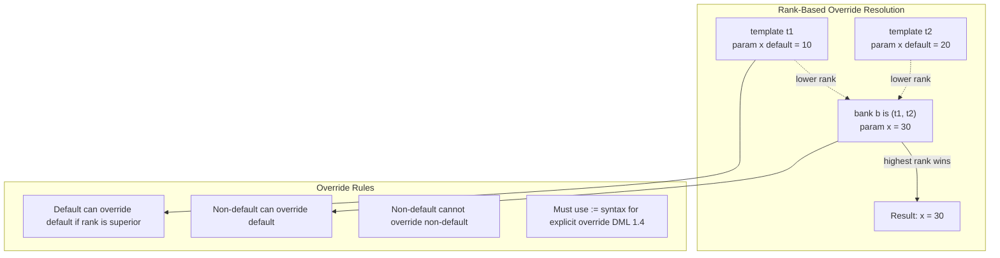

**Key override rules:**
1. A non-default parameter definition overrides all default definitions
2. Among default definitions, the one with highest rank wins
3. Multiple non-default definitions cause `EINVOVER` error
4. In DML 1.4 with `explicit_param_decls`, must use `:=` syntax to override

**Sources:** [py/dml/structure.py:604-709](), [doc/1.4/language.md:1193-1231]()

### Parameter Merging Algorithm

The compiler merges multiple parameter definitions using the `merge_parameters` function:

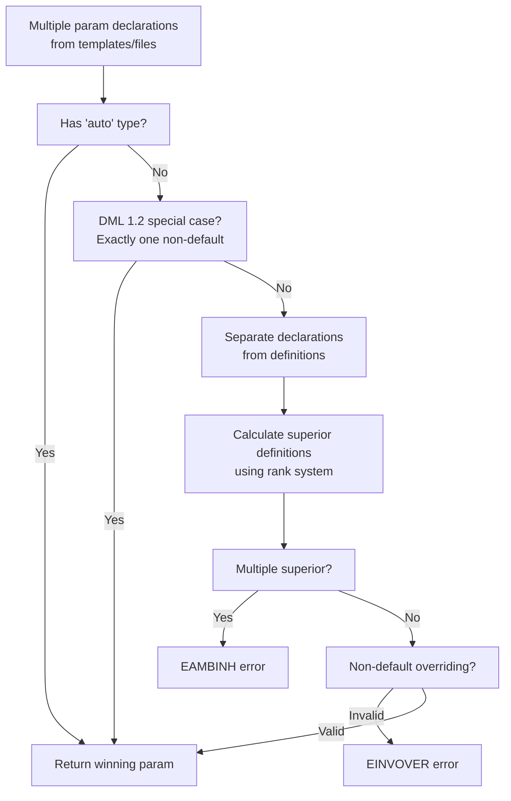

**Sources:** [py/dml/structure.py:604-709]()

## Methods

Methods are functions that implement object behavior. They can have multiple input and output parameters, support exception handling, and can be overridden through template inheritance.

### Method Declaration Syntax

```dml
method name(input_param: type, ...) -> (output_type, ...) [throws] [default] {
    // method body
}

// DML 1.2 style (deprecated)
method name(input_param, ...) -> (output_param, ...) [nothrow] [default] {
    // method body
}

// Inline method (untyped parameters)
inline method name(untyped_param, ...) -> (output_type, ...) {
    // method body
}
```

**Sources:** [doc/1.4/language.md:1383-1519](), [py/dml/dmlparse.py:536-633]()

### Method Input and Output Parameters

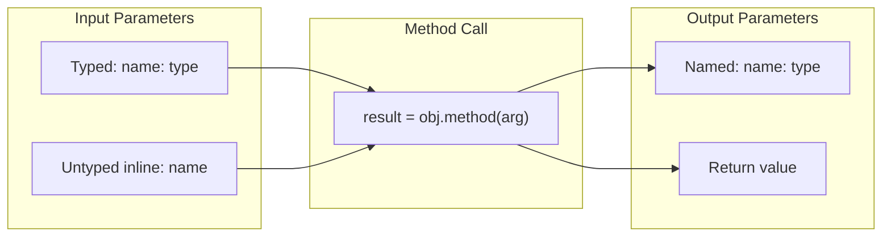

**Key differences:**
- **Typed parameters:** Type is declared in signature, checked at compile time
- **Untyped/inline parameters:** Type inferred from call site, enables inlining
- **Output parameters:** Named values returned from method, can have multiple
- In DML 1.4, methods return values instead of using output parameters

**Sources:** [doc/1.4/language.md:1383-1453](), [py/dml/dmlparse.py:607-633]()

### Method Qualifiers

Methods can be qualified with special keywords that modify their behavior:

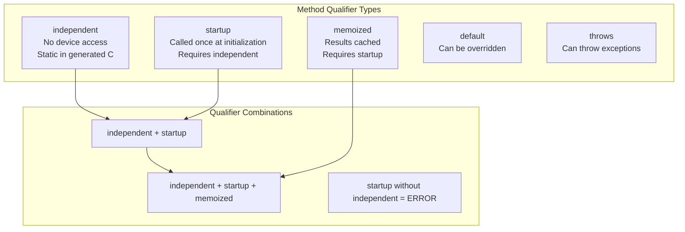

**Sources:** [doc/1.4/language.md:1454-1519](), [py/dml/dmlparse.py:584-604]()

#### Independent Methods

Independent methods cannot access device state and are generated as static C functions:

```dml
independent method calculate(uint32 x, uint32 y) -> (uint32) {
    return x + y;  // No device access allowed
}
```

**Restrictions:**
- Cannot reference `dev` or object hierarchy
- Cannot call non-independent methods
- Cannot access session/saved variables

**Sources:** [doc/1.4/language.md:1478-1497](), [py/dml/crep.py:24-67]()

#### Startup Methods

Startup methods are called once during device initialization. They must be independent and cannot have input parameters:

```dml
independent startup method init_constants() {
    // Called once at startup
}

independent startup memoized method compute_table() -> (uint32[256]) {
    // Result cached for subsequent calls
}
```

**Sources:** [doc/1.4/language.md:1498-1519](), [py/dml/structure.py:584-604]()

### Shared Methods (Trait Methods)

Shared methods belong to traits/templates and use virtual dispatch through vtables:

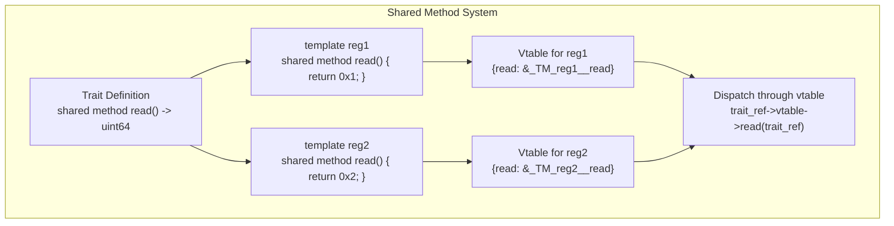

**Shared method characteristics:**
- Declared with `shared method` keyword
- Part of trait definition
- Virtual dispatch through vtables
- Can override parent trait methods
- Cannot be called from independent methods

**Sources:** [py/dml/traits.py:147-276](), [doc/1.4/language.md:1818-1887]()

### Method Override and Default Implementation

```mermaid
graph TB
    subgraph "Method Override Hierarchy"
        Base["Base Template<br/>method foo() default { ... }"]
        Middle["Middle Template<br/>method foo() default { ... }"]
        Final["Final Object<br/>method foo() { ... }"]
        
        Base -.->|"lower rank"| Middle
        Middle -.->|"lower rank"| Final
    end
    
    subgraph "Default Call Chain"
        FinalImpl["Final Implementation"]
        CallDefault["call default"]
        MiddleImpl["Middle Implementation"]
        MiddleDefault["call default"]
        BaseImpl["Base Implementation"]
        
        FinalImpl -->|"default"| CallDefault
        CallDefault --> MiddleImpl
        MiddleImpl -->|"default"| MiddleDefault
        MiddleDefault --> BaseImpl
    end
```

**Override rules:**
- Methods marked `default` can be overridden
- Overriding method can call `default` to invoke parent implementation
- Must use rank system to resolve ambiguous defaults
- Type signatures must match exactly (or use `eq_fuzzy` in DML 1.2)

**Sources:** [py/dml/structure.py:711-833](), [doc/1.4/language.md:1564-1620]()

### Method Type Checking

The compiler performs strict type checking on method overrides:

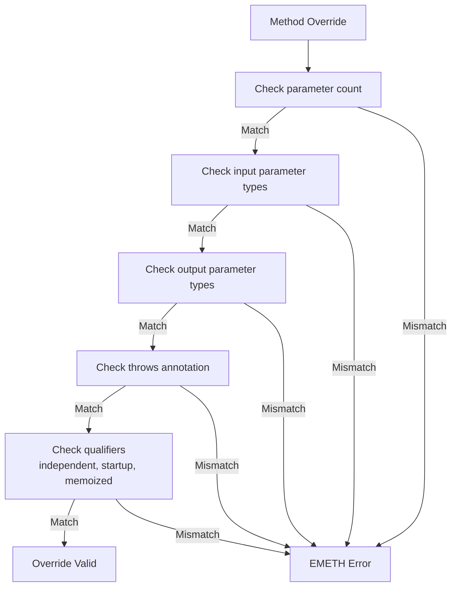

**Type checking rules:**
- Input parameter count must match
- Input parameter types must match (exactly or fuzzy depending on mode)
- Output parameter count and types must match
- `throws` annotation must match
- Qualifiers (`independent`, `startup`, `memoized`) must match

**Sources:** [py/dml/structure.py:711-805](), [py/dml/traits.py:398-438]()

## Calling Conventions

### Regular Method Calls

Methods are called using dot notation:

```dml
local uint64 value = register.read();
local (uint32 low, uint32 high) = split_value(input);
```

In generated C code, regular methods become:
- Instance methods: Include `_dev` parameter for device access
- Independent methods: Static functions with no device parameter
- Inline methods: Not generated as separate functions

**Sources:** [py/dml/codegen.py:1689-1796](), [doc/1.4/language.md:1564-1620]()

### Method Instance Generation

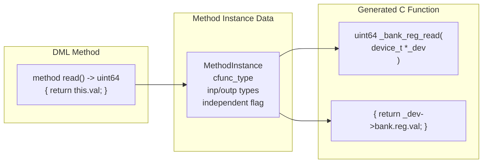

The `method_instance` function creates a representation of how a method will be generated in C code:

**Sources:** [py/dml/codegen.py:1689-1796](), [py/dml/crep.py:105-118]()

### Calling Default Implementations

The `default` keyword invokes the parent implementation:

```dml
template base {
    method process() default {
        log info: "base";
    }
}

template derived is base {
    method process() {
        log info: "derived";
        default();  // Calls base.process()
    }
}
```

**Default resolution algorithm:**
1. Find all parent templates that define the method
2. Calculate minimal ancestry to determine which parent is most specific
3. If ambiguous, report `EAMBDEFAULT` error
4. Generate call to parent method implementation

**Sources:** [py/dml/traits.py:117-137](), [py/dml/codegen.py:1041-1100]()

### Exception Handling in Methods

Methods can be marked with `throws` to indicate they may throw exceptions:

```dml
method might_fail() throws {
    if (error_condition) {
        throw;
    }
}

method caller() {
    try {
        might_fail();
    } catch {
        log error: "Failed";
    }
}
```

In generated C code:
- Throwing methods return a result tuple including success flag
- Non-throwing methods cannot call throwing methods outside `try` blocks
- DML 1.2 methods without `nothrow` are conservatively assumed to throw

**Sources:** [doc/1.4/language.md:1629-1678](), [py/dml/messages.py:618-678]()

## Method and Parameter Storage

### Method References

Methods can be stored in variables and passed as function pointers (with restrictions):

```dml
method independent my_func(int x) -> (int) { return x + 1; }

session void (*func_ptr)(int) -> (int);

method init() {
    func_ptr = my_func;  // OK: independent, non-throwing, not in array
}
```

**Restrictions for method-to-function-pointer conversion:**
- Method must be `independent`
- Method must not be `throws`
- Method must not be in object array
- Method must not be inline

**Sources:** [py/dml/messages.py:425-439](), [doc/1.4/language.md:1726-1747]()

### Parameter Storage

Parameters are not stored at runtime - they are compile-time constants that are expanded inline. However, typed parameters can be serialized for checkpointing:

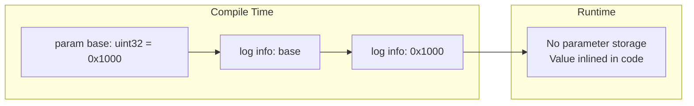

**Sources:** [doc/1.4/language.md:342-358](), [py/dml/structure.py:514-523]()

## Code Generation

### C Function Generation for Methods

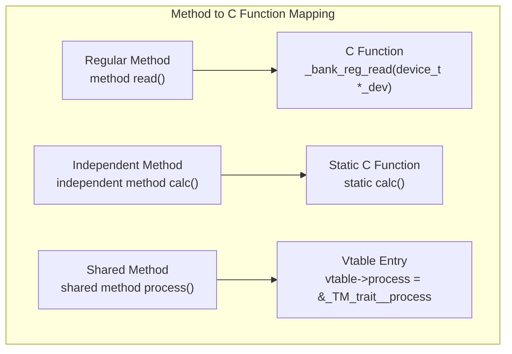

**Naming conventions:**
- Regular methods: `__{ancestor_names}__` joined
- Shared methods: `_DML_TM_{trait}__{method_name}`
- Independent methods: Same as regular but static

**Sources:** [py/dml/crep.py:105-109](), [py/dml/traits.py:174-176]()

### Method Instance Structure

The `method_instance` function returns a `MethodInstance` object containing:

```python
class MethodInstance:
    inp: tuple[InParam, ...]        # Input parameter specifications
    outp: tuple[(str, DMLType), ...]  # Output parameter specs
    throws: bool                     # Can throw exceptions
    independent: bool                # Is independent method
    cfunc_type: TFunction           # C function type
```

This structure drives C code generation for:
- Function signatures
- Parameter marshaling
- Exception handling
- Device context passing

**Sources:** [py/dml/codegen.py:1689-1796]()