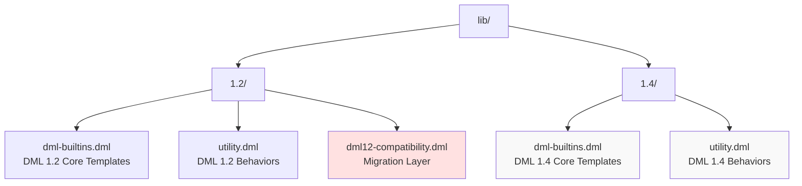
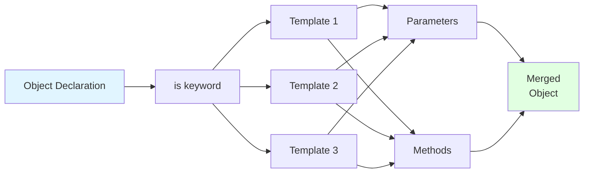
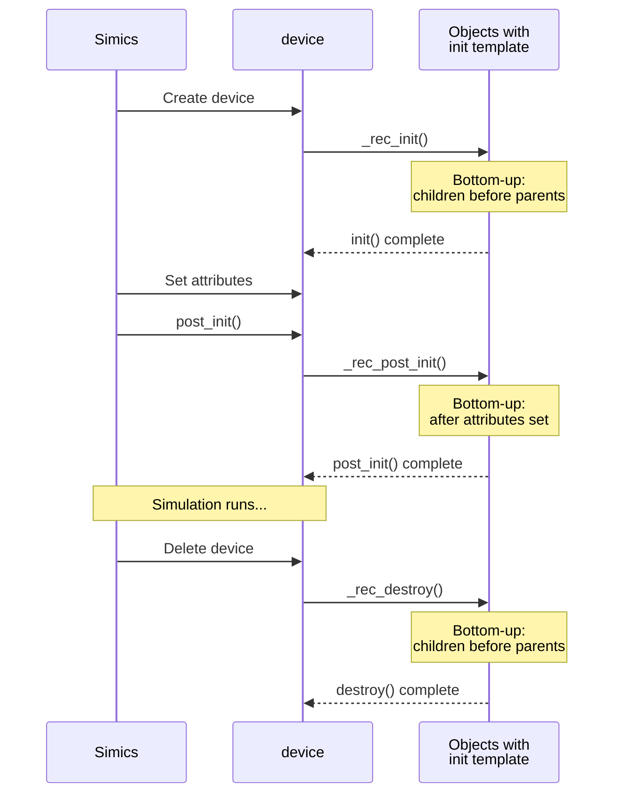
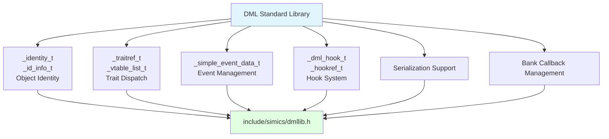

# Standard Library

<details>
<summary>Relevant source files</summary>

The following files were used as context for generating this wiki page:

- [lib/1.2/dml-builtins.dml](lib/1.2/dml-builtins.dml)
- [lib/1.4/dml-builtins.dml](lib/1.4/dml-builtins.dml)
- [lib/1.4/utility.dml](lib/1.4/utility.dml)
- [test/1.4/lib/T_io_memory.dml](test/1.4/lib/T_io_memory.dml)
- [test/1.4/lib/T_io_memory.py](test/1.4/lib/T_io_memory.py)
- [test/1.4/lib/T_map_target_connect.py](test/1.4/lib/T_map_target_connect.py)
- [test/1.4/lib/T_signal_templates.dml](test/1.4/lib/T_signal_templates.dml)
- [test/1.4/lib/T_signal_templates.py](test/1.4/lib/T_signal_templates.py)

</details>


## Purpose and Scope

The DML Standard Library provides a comprehensive collection of reusable templates that define the fundamental building blocks and common behaviors for device modeling. It consists of two primary files that work together to provide a complete device modeling framework:

- **dml-builtins.dml**: Core object templates defining the device structure (device, bank, register, field, attribute, connect, event, port, etc.)
- **utility.dml**: Behavioral templates for reset mechanisms, register access patterns, and I/O operations

This page provides an overview of the standard library's organization and template system. For detailed information about specific template categories, see the subsections:
- Core object templates: [Core Templates (dml-builtins)](#4.1)
- Behavioral templates: [Utility Templates](#4.2)
- Reset mechanisms: [Reset System](#4.3)
- Register patterns: [Register and Field Behaviors](#4.4)
- I/O operations: [Memory-Mapped I/O](#4.5)
- Configuration: [Attributes and Connections](#4.6)
- Timing and lifecycle: [Events and Lifecycle](#4.7)

For information about the DML language constructs themselves, see [DML Language Reference](#3).

**Sources:** [lib/1.4/dml-builtins.dml:1-268](), [lib/1.4/utility.dml:1-50]()

## Standard Library Organization

The standard library is organized into version-specific directories with consistent file structures:



The library is automatically imported based on the DML version specified in the device file. DML 1.4 is the modern version with improved semantics and performance, while DML 1.2 remains available for legacy devices. The `dml12-compatibility.dml` file provides a bridge for mixed-version codebases.

**Sources:** [lib/1.4/dml-builtins.dml:6](), [lib/1.2/dml-builtins.dml:6]()

## Template Hierarchy

### Object Template Hierarchy

The standard library defines a hierarchical template structure where all DML objects inherit from the `object` base template:

```mermaid
graph TB
    OBJECT["object<br/>Base template<br/>name, desc, qname, indices"]
    
    DEVICE["device<br/>Top-level device<br/>init, post_init, destroy"]
    GROUP["group<br/>Container object"]
    BANK["bank<br/>Register bank<br/>access methods"]
    REGISTER["register<br/>Hardware register<br/>get, set, read, write"]
    FIELD["field<br/>Bit field<br/>get_val, set_val"]
    
    ATTRIBUTE["attribute<br/>Configuration attribute<br/>get, set"]
    CONNECT["connect<br/>Device connection<br/>validate, required"]
    EVENT["event<br/>Timed callback"]
    PORT["port<br/>Interface group"]
    IMPLEMENT["implement<br/>Interface export"]
    INTERFACE["interface<br/>Interface validation"]
    SUBDEVICE["subdevice<br/>Child device"]
    
    OBJECT --> DEVICE
    OBJECT --> GROUP
    OBJECT --> BANK
    OBJECT --> REGISTER
    OBJECT --> FIELD
    OBJECT --> ATTRIBUTE
    OBJECT --> CONNECT
    OBJECT --> EVENT
    OBJECT --> PORT
    OBJECT --> IMPLEMENT
    OBJECT --> INTERFACE
    OBJECT --> SUBDEVICE
    
    style OBJECT fill:#f9f9f9
    style DEVICE fill:#e1f5ff
```



Each object type template defines:
- **Required parameters**: Type-specific configuration (e.g., `register_size` for registers)
- **Standard methods**: Common operations for that object type (e.g., `read`/`write` for registers)
- **Default behavior**: Sensible defaults that can be overridden

**Sources:** [lib/1.4/dml-builtins.dml:540-578](), [lib/1.4/dml-builtins.dml:626-722](), [lib/1.4/dml-builtins.dml:944-968]()

### Behavioral Template Categories

Behavioral templates modify or extend the default behavior of objects:

| Category | Purpose | Examples |
|----------|---------|----------|
| **Universal** | Apply to all object types | `name`, `desc`, `documentation`, `init`, `post_init`, `destroy` |
| **Reset** | Define reset behavior | `poreset`, `hreset`, `sreset`, `soft_reset_val`, `sticky`, `no_reset` |
| **Read Behavior** | Control read operations | `read_only`, `read_zero`, `read_constant`, `clear_on_read` |
| **Write Behavior** | Control write operations | `write_only`, `ignore_write`, `write_1_clears`, `write_1_only` |
| **Implementation Status** | Document limitations | `unimpl`, `read_unimpl`, `write_unimpl`, `reserved`, `ignore` |
| **Constants** | Define constant values | `constant`, `silent_constant`, `zeros`, `ones` |
| **I/O Mapping** | Memory-mapped I/O | `function_io_memory`, `function_mapped_bank`, `bank_io_memory` |
| **Signals** | Signal port handling | `signal_port`, `signal_connect` |

**Sources:** [lib/1.4/dml-builtins.dml:177-267](), [lib/1.4/utility.dml:50-896]()

## Template Instantiation and Composition

### Basic Template Usage

Templates are applied to objects using the `is` keyword, and multiple templates can be composed:

```dml
// Single template
register status @ 0x00 is read_only {
    // ...
}

// Multiple templates
register control @ 0x04 is (write, init_val) {
    param init_val = 0x80;
    // ...
}

// Template with nested objects
bank regs {
    register data @ 0x00 is (read, write) {
        field value[7:0] is (read_only, init_val) {
            param init_val = 0xff;
        }
    }
}
```

The `is` operator instantiates templates in the object, making their parameters and methods available. When multiple templates define the same member, a rank system determines precedence (see [Templates](#3.5)).

**Sources:** [lib/1.4/dml-builtins.dml:213-217](), [lib/1.4/dml-builtins.dml:230-246]()

### Template Composition Pattern



Templates compose by merging their parameters and methods into the target object. When conflicts occur, the rank system (based on template order and specificity) determines which definition takes precedence. The `default()` keyword in method implementations allows calling the next-ranked implementation, enabling behavioral chaining.

**Sources:** [lib/1.4/dml-builtins.dml:213-267]()

## Key Template Parameters

### Universal Parameters

All objects inheriting from the `object` template have access to these parameters:

| Parameter | Type | Description |
|-----------|------|-------------|
| `this` | reference | Reference to current object |
| `objtype` | string | Object type name (e.g., `"register"`) |
| `name` | string | Object identifier name |
| `qname` | string | Fully qualified name with indices |
| `parent` | reference | Containing parent object |
| `dev` | reference | Top-level device object |
| `indices` | list | Array indices for this object |
| `templates` | auto | Template-qualified method access |

**Sources:** [lib/1.4/dml-builtins.dml:540-578]()

### Configuration Parameters

Common configuration parameters available in device modeling:

| Parameter | Context | Type | Description |
|-----------|---------|------|-------------|
| `register_size` | device, bank | integer | Default register width in bytes |
| `byte_order` | device, bank | string | `"little-endian"` or `"big-endian"` |
| `configuration` | attribute | string | `"required"`, `"optional"`, `"pseudo"`, or `"none"` |
| `init_val` | register, field | uint64 | Initial value after reset |
| `persistent` | attribute | bool | Save in `save-persistent-state` |
| `internal` | attribute | bool | Exclude from documentation |

**Sources:** [lib/1.4/dml-builtins.dml:603-608](), [lib/1.4/dml-builtins.dml:769-843]()

## Standard Method Patterns

### Lifecycle Methods

The standard library defines a consistent lifecycle for device objects:



Objects implementing `init`, `post_init`, or `destroy` templates automatically have their corresponding methods called at the appropriate lifecycle stage. The recursive traversal ensures proper initialization and cleanup order.

**Sources:** [lib/1.4/dml-builtins.dml:387-397](), [lib/1.4/dml-builtins.dml:410-420](), [lib/1.4/dml-builtins.dml:463-477]()

### Register Access Methods

Registers and fields provide a standard set of access methods:

| Method | Context | Purpose |
|--------|---------|---------|
| `read()` | register, bank | Handle memory-mapped read |
| `write()` | register, bank | Handle memory-mapped write |
| `get()` | register | Get register value (software/hardware) |
| `set()` | register | Set register value (software/hardware) |
| `get_val()` | field | Get field value |
| `set_val()` | field | Set field value |
| `read_field()` | field | Read through memory-mapped I/O |
| `write_field()` | field | Write through memory-mapped I/O |

The distinction between `read`/`write` (memory-mapped I/O) and `get`/`set` (direct access) is important. Behavioral templates typically override `read_field` and `write_field` to intercept memory-mapped accesses while leaving `get_val` and `set_val` for internal state manipulation.

**Sources:** [lib/1.4/dml-builtins.dml:1729-1874](), [lib/1.4/utility.dml:384-895]()

## Template Inheritance with `in each`

The `in each` construct allows applying templates to all objects matching certain criteria:

```dml
// Apply to all objects implementing init_val
in each init_val {
    is _init_val_hard_reset;
}

// Apply to specific object types
in each register {
    is read;
    is write;
}
```

This mechanism is used extensively in the standard library to propagate behavior. For example, the `hreset` template uses `in each init_val` to automatically provide hard reset behavior to all registers and fields with an `init_val` parameter.

**Sources:** [lib/1.4/utility.dml:252-254](), [lib/1.4/dml-builtins.dml:396-397]()

## Runtime Support

### C Runtime Interface

The standard library interfaces with the C runtime library defined in `dmllib.h`:



The runtime library provides:
- **Identity system**: Unique object identification for arrays and dynamic dispatch
- **Trait vtables**: Runtime polymorphism through trait references
- **Event management**: Time/cycle-based event scheduling and cancellation
- **Hook support**: After-statement execution and serialization
- **Bank callbacks**: Before/after read/write instrumentation

**Sources:** [lib/1.4/dml-builtins.dml:13-14](), [lib/1.4/dml-builtins.dml:61-176]()

## Example: Complete Device Template Usage

```dml
dml 1.4;
device example;

import "utility.dml";

// Enable reset functionality
is (hreset, sreset);

bank control {
    register status @ 0x00 is (read_only, init_val) {
        param init_val = 0x00;
        
        field ready[0] is (read_only, init_val) {
            param init_val = 1;
        }
    }
    
    register command @ 0x04 is (write, init_val) {
        param init_val = 0x00;
        
        method write(uint64 value) {
            log info: "Command written: %#x", value;
            default(value);
            // Process command...
        }
    }
    
    register data[i < 16] @ 0x100 + i * 4 is (read, write, init_val) {
        param init_val = 0;
    }
}

attribute config is (uint64_attr, init_val) {
    param init_val = 0x42;
}
```

This example demonstrates:
- Reset template instantiation (`hreset`, `sreset`)
- Read-only registers with initial values
- Write handling with side effects
- Register arrays with indexed addressing
- Configuration attributes

**Sources:** [test/1.4/lib/T_io_memory.dml:7-44]()

## Template Discovery and Documentation

### Built-in Template Categories

The standard library templates follow a naming convention indicating their purpose:

| Prefix/Pattern | Purpose | Examples |
|----------------|---------|----------|
| `_` prefix | Internal/private | `_conf_attribute`, `_simple_write`, `_qname` |
| Action verbs | Behavioral modifiers | `read_only`, `write_1_clears`, `clear_on_read` |
| State description | Status indicators | `unimpl`, `reserved`, `constant` |
| Capability names | Interface provision | `init`, `post_init`, `destroy` |
| Hardware concepts | Device modeling | `poreset`, `hreset`, `sreset` |

Templates beginning with `_` are internal implementation details and should not be instantiated directly by user code. Public templates are documented in the library files with comprehensive comments describing their behavior, parameters, and log output.

**Sources:** [lib/1.4/dml-builtins.dml:177-267](), [lib/1.4/utility.dml:18-896]()

## Version Differences

### DML 1.2 vs 1.4 Library Differences

| Aspect | DML 1.2 | DML 1.4 |
|--------|---------|---------|
| Parameter syntax | `$param` | `param` (no $) |
| Method calls | `call $method()` | `method()` |
| Default dispatch | Different rank system | Improved rank system |
| Lifecycle | Device-level only | All objects support `init`/`post_init`/`destroy` |
| Reset system | `_hard_reset`, `_soft_reset` | `hard_reset`, `soft_reset`, `power_on_reset` |
| Session variables | `data` keyword | `session` keyword |
| I/O memory | Default enabled | Controlled by `use_io_memory` parameter |

The DML 1.4 standard library provides cleaner semantics, better performance, and more consistent behavior. The `dml12-compatibility.dml` layer helps bridge legacy code during migration.

**Sources:** [lib/1.4/dml-builtins.dml:33-34](), [lib/1.2/dml-builtins.dml:35]()

## Summary

The DML Standard Library provides a comprehensive foundation for device modeling through:

1. **Core object templates** defining the structural hierarchy (device → bank → register → field)
2. **Behavioral templates** for common register patterns and reset mechanisms
3. **I/O templates** for memory-mapped device access
4. **Lifecycle hooks** for initialization and cleanup
5. **Runtime support** interfacing with the C dmllib implementation

The template composition system allows flexible combination of behaviors while maintaining consistent interfaces across the device model. For detailed information about specific template categories, refer to the subsections [4.1](#4.1) through [4.7](#4.7).

**Sources:** [lib/1.4/dml-builtins.dml:1-994](), [lib/1.4/utility.dml:1-896]()