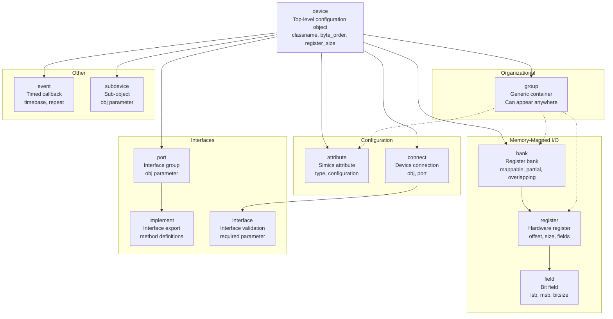
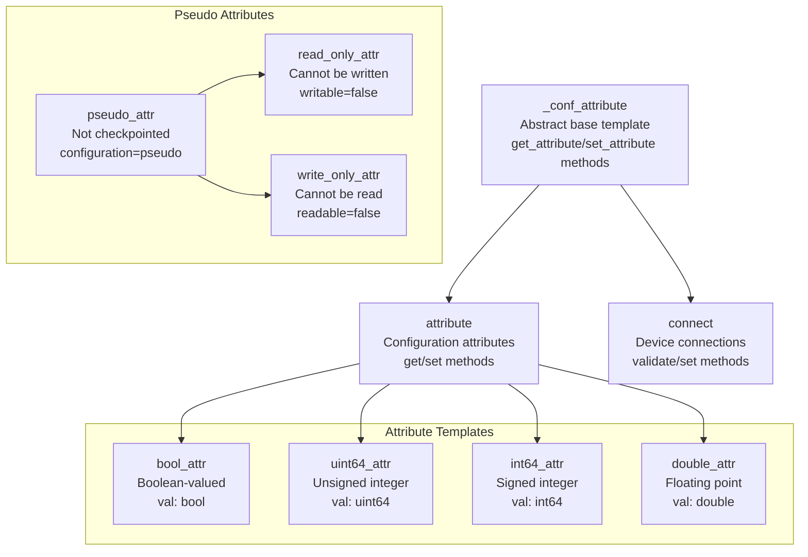
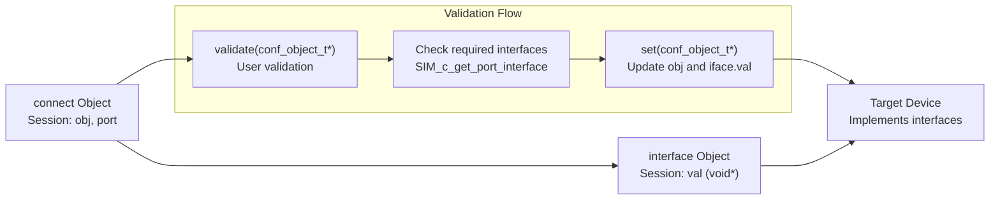
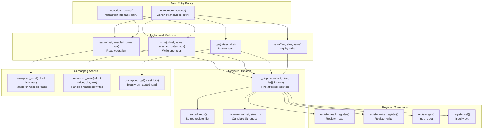
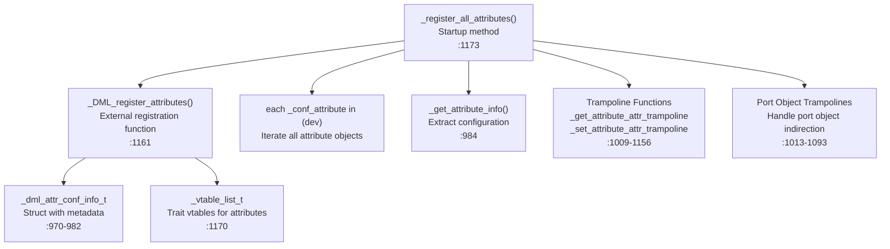
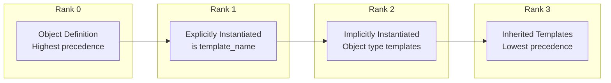

# Core Templates (dml-builtins)

<details>
<summary>Relevant source files</summary>

The following files were used as context for generating this wiki page:

- [lib/1.2/dml-builtins.dml](lib/1.2/dml-builtins.dml)
- [lib/1.4/dml-builtins.dml](lib/1.4/dml-builtins.dml)

</details>


This document describes the core templates defined in `lib/1.4/dml-builtins.dml` that form the foundation of the DML object model. These templates define the essential object types used in device modeling: `device`, `bank`, `register`, `field`, `attribute`, `connect`, `interface`, `implement`, `event`, `port`, `subdevice`, and `group`. Every DML device model automatically inherits these templates, which provide the structure for memory-mapped I/O, configuration attributes, inter-device connections, and lifecycle management.

For information about utility templates that build on these core templates (reset mechanisms, register behaviors, I/O patterns), see [Utility Templates](#4.2). For details on the runtime support that these templates interface with, see [Runtime Support (dmllib.h)](#5.6).

## Template Hierarchy and Object Model

All DML objects inherit from the `object` base template, which provides fundamental parameters and methods common to all object types. Each specific object type (device, bank, register, etc.) is defined by a template that extends `object` and sets the `objtype` parameter.

```mermaid
graph TD
    object["object<br/>Base template for all objects<br/>lib/1.4/dml-builtins.dml:540"]
    
    subgraph "Universal Templates"
        name["name<br/>String parameter for object name<br/>:284"]
        desc["desc<br/>Short description parameter<br/>:310"]
        documentation["documentation<br/>Long description parameter<br/>:345"]
        limitations["limitations<br/>Implementation limitations<br/>:367"]
    end
    
    subgraph "Lifecycle Templates"
        init["init<br/>Initialization method<br/>:387"]
        post_init["post_init<br/>Post-initialization method<br/>:410"]
        destroy["destroy<br/>Cleanup method<br/>:463"]
    end
    
    subgraph "Core Object Types"
        device["device<br/>Top-level device object<br/>:626"]
        bank["bank<br/>Register bank for I/O<br/>:1970"]
        register["register<br/>Hardware register<br/>line 2632+"]
        field["field<br/>Bit fields within registers<br/>line 3172+"]
        group["group<br/>Organizational container<br/>:738"]
    end
    
    subgraph "Configuration System"
        conf_attr["_conf_attribute<br/>Abstract attribute base<br/>:765"]
        attribute["attribute<br/>Configuration attributes<br/>:944"]
        connect["connect<br/>Inter-device connections<br/>:1404"]
        interface["interface<br/>Interface specification<br/>:1596"]
        implement["implement<br/>Interface implementation<br/>:1689"]
    end
    
    subgraph "Special Objects"
        event["event<br/>Timed callbacks<br/>line 4213+"]
        port["port<br/>Interface groups<br/>:1625"]
        subdevice["subdevice<br/>Sub-objects<br/>:1658"]
    end
    
    object --> name
    object --> desc
    object --> documentation
    object --> limitations
    
    object --> device
    object --> bank
    object --> register
    object --> field
    object --> group
    object --> conf_attr
    object --> event
    object --> port
    object --> subdevice
    object --> implement
    object --> interface
    
    device --> init
    device --> post_init
    device --> destroy
    
    conf_attr --> attribute
    conf_attr --> connect
```



**Sources:** [lib/1.4/dml-builtins.dml:177-722](), [lib/1.4/dml-builtins.dml:1970-2542]()

## Universal Templates

These templates are applicable to all object types and provide common functionality for naming, documentation, and lifecycle management.

### `object` Template

The `object` template is the base for all DML objects and provides core parameters that cannot be overridden:

| Parameter | Type | Description |
|-----------|------|-------------|
| `this` | reference | Current object reference |
| `objtype` | string | Object type (e.g., "register", "field") |
| `parent` | reference or undefined | Parent object, undefined for device |
| `qname` | string | Fully qualified name with indices |
| `dev` | reference | Top-level device object |
| `templates` | auto | For template-qualified method calls |
| `indices` | list | Local array indices for this object |
| `_is_simics_object` | bool | Whether object corresponds to Simics object |

The template also provides the `cancel_after()` method to cancel all pending `after` events associated with the object.

**Sources:** [lib/1.4/dml-builtins.dml:540-578]()

### `name`, `desc`, `documentation`, `limitations`

These templates provide documentation parameters:

- **`name`**: Exposes the object name to end-users in log messages and attribute names
- **`desc`**: Short description (few words or phrases); has shorthand syntax in object declarations
- **`documentation`**: Long-form documentation in XML format for reference manual generation
- **`limitations`**: Description of implementation limitations

Each template also provides a `shown_*` variant that can be overridden to hide confidential information from end-users.

**Sources:** [lib/1.4/dml-builtins.dml:284-370]()

### Lifecycle Templates: `init`, `post_init`, `destroy`

```mermaid
graph LR
    creation["Device Creation"]
    init_phase["init() Phase<br/>Before attributes initialized"]
    attr_init["Attribute Initialization<br/>Simics loads checkpoint"]
    post_init_phase["post_init() Phase<br/>After attributes initialized"]
    runtime["Runtime Operation"]
    deletion["Device Deletion"]
    destroy_phase["destroy() Phase<br/>Resource cleanup"]
    exit["Process Exit"]
    
    creation --> init_phase
    init_phase --> attr_init
    attr_init --> post_init_phase
    post_init_phase --> runtime
    runtime --> deletion
    deletion --> destroy_phase
    destroy_phase --> exit
```



**`init` Template** ([lib/1.4/dml-builtins.dml:387-397]()):
- Abstract method called before attribute initialization
- Used to initialize default values and set up data structures
- Called recursively: child objects' `init()` runs before parent objects' `init()`
- Device object's `init()` runs last

**`post_init` Template** ([lib/1.4/dml-builtins.dml:410-420]()):
- Abstract method called after attribute initialization
- Used to establish connections to other devices
- Can depend on configured attribute values
- Called recursively like `init()`

**`destroy` Template** ([lib/1.4/dml-builtins.dml:463-477]()):
- Abstract method called when device is deleted
- Used to clean up resources allocated with `new` (deallocated with `delete`)
- Cannot communicate with other Simics objects
- Cannot post/cancel time-based events (handled automatically)
- Side-effects (e.g., logging) not visible on program exit
- Cannot be instantiated for `event` objects

**Sources:** [lib/1.4/dml-builtins.dml:373-477]()

## Device Object Hierarchy

The DML object model enforces a specific containment hierarchy for hardware modeling.



**Sources:** [lib/1.4/dml-builtins.dml:626-722](), [lib/1.4/dml-builtins.dml:738-746]()

## Device Template

The `device` template defines the top-level scope of a DML file and inherits `init`, `post_init`, and `destroy` templates.

### Key Parameters

| Parameter | Type | Default | Description |
|-----------|------|---------|-------------|
| `classname` | string | `name` | Simics configuration class name |
| `register_size` | integer or undefined | `undefined` | Default register size in bytes |
| `byte_order` | string | `"little-endian"` | Default byte order for register access |
| `be_bitorder` | bool | Based on `bitorder` declaration | Default bit ordering for banks |
| `use_io_memory` | bool | `!_breaking_change_transaction_by_default` | Use legacy `io_memory` vs. `transaction` interface |
| `obj` | conf_object_t * | auto | Pointer to Simics configuration object |
| `simics_api_version` | string | auto | Simics API version (e.g., "6") |

### Methods

- **`init()`**: Called when device loads, before attributes initialized
- **`post_init()`**: Called after attributes initialized
- **`destroy()`**: Called when device is deleted

The device template also defines numerous `_breaking_change_*` and `_compat_*` parameters that control API compatibility across Simics versions.

**Sources:** [lib/1.4/dml-builtins.dml:626-722]()

## Group Objects

The `group` template provides a generic container for organizing other objects in the hierarchy. Groups can appear anywhere but have some restrictions:

- Groups named "bank" or "port" cannot contain `bank`, `port`, or `subdevice` objects (to avoid Simics namespace clashes)
- `implement` and `interface` objects cannot have a group as parent

Groups set `objtype = "group"` and `_is_simics_object = false` since they don't correspond to Simics objects.

**Sources:** [lib/1.4/dml-builtins.dml:738-746]()

## Attribute System

The attribute system allows device state to be exposed to Simics for configuration and checkpointing.



**Sources:** [lib/1.4/dml-builtins.dml:765-844](), [lib/1.4/dml-builtins.dml:944-968]()

### `_conf_attribute` Template

Abstract base template for all attribute-like objects (`attribute`, `connect`, `register`). Provides:

**Shared Methods:**
- `set_attribute(attr_value_t value) -> (set_error_t)`: Called by Simics to set value
- `get_attribute() -> (attr_value_t)`: Called by Simics to get value

**Parameters:**

| Parameter | Type | Default | Description |
|-----------|------|---------|-------------|
| `configuration` | string | `"optional"` | `"required"`, `"optional"`, `"pseudo"`, or `"none"` |
| `persistent` | bool | `false` | Saved with `save-persistent-state` |
| `internal` | bool | `!defined documentation && !defined desc` | Excluded from documentation |
| `readable` | bool | `configuration != "none"` | Can be read |
| `writable` | bool | `configuration != "none"` | Can be written |

**Sources:** [lib/1.4/dml-builtins.dml:765-844]()

### `attribute` Template

Concrete attribute objects with user-defined get/set behavior:

**Methods:**
- `get() -> (attr_value_t)`: Abstract method to return attribute value
- `set(attr_value_t val) throws`: Abstract method to set value; throws on error

**Parameters:**
- `type` (string): Simics attribute type string (e.g., `"i"`, `"b"`, `"[s*]"`)
- `allocate_type` (undefined): Legacy parameter for automatic type derivation

**Sources:** [lib/1.4/dml-builtins.dml:944-968]()

### Attribute Templates

Four templates create simple checkpointable attributes with standard types:

**`bool_attr`** ([lib/1.4/dml-builtins.dml:1255-1269]()):
- Stores value in session variable `val` (type `bool`)
- Type string: `"b"`
- Default `init_val`: `false`

**`uint64_attr`** ([lib/1.4/dml-builtins.dml:1271-1290]()):
- Stores value in session variable `val` (type `uint64`)
- Type string: `"i"`
- Default `init_val`: `0`
- Validates value is non-negative

**`int64_attr`** ([lib/1.4/dml-builtins.dml:1292-1311]()):
- Stores value in session variable `val` (type `int64`)
- Type string: `"i"`
- Default `init_val`: `0`
- Validates value fits in int64 range

**`double_attr`** ([lib/1.4/dml-builtins.dml:1313-1327]()):
- Stores value in session variable `val` (type `double`)
- Type string: `"f"`
- Default `init_val`: `0.0`

All four templates inherit both `attribute` and `init`, providing default implementations of `init()` that initialize `val` from `init_val`, and default `get()`/`set()` methods that access `val`.

**Sources:** [lib/1.4/dml-builtins.dml:1186-1327]()

### Pseudo Attribute Templates

**`pseudo_attr`** ([lib/1.4/dml-builtins.dml:1329-1332]()):
- Sets `configuration = "pseudo"`
- Value not saved in checkpoints
- Must provide abstract `get()` and `set()` methods

**`read_only_attr`** ([lib/1.4/dml-builtins.dml:1334-1339]()):
- Inherits `pseudo_attr`
- Sets `writable = false`
- `set()` method always asserts

**`write_only_attr`** ([lib/1.4/dml-builtins.dml:1341-1346]()):
- Inherits `pseudo_attr`
- Sets `readable = false`
- `get()` method always asserts

**Sources:** [lib/1.4/dml-builtins.dml:1329-1346]()

## Connect Objects and Interfaces

The `connect` template manages connections between devices, validating that connected objects implement required interfaces.



### `connect` Template

**Session Variables:**
- `obj` (conf_object_t *): Connected object
- `port` (const char *): Port name for port interfaces (deprecated)

**Methods:**
- `validate(conf_object_t *obj) -> (bool)`: User validation hook; return `false` to reject connection
- `set(conf_object_t *obj)`: Called after validation to commit connection; updates `obj` and interface values
- `set_attribute(attr_value_t)`, `get_attribute()`: Internal methods for Simics attribute system

**Parameters:**
- `configuration`: Controls how Simics treats the attribute (default: `"optional"`)
- `internal` (bool): Whether attribute is internal

**Sources:** [lib/1.4/dml-builtins.dml:1404-1531]()

### `interface` Template

Nested within `connect` objects to validate and access specific interfaces:

**Session Variable:**
- `val` (const void *): Pointer to interface struct; `NULL` if not implemented

**Parameters:**
- `required` (bool): Default `true`; if `false`, connection can succeed even if interface not found
- `_c_type` (string): C type name (e.g., `"io_memory_interface_t"`)

The `_c_type` parameter is used during code generation to properly cast the interface pointer.

**Sources:** [lib/1.4/dml-builtins.dml:1596-1613]()

### `init_as_subobj` Template

Specialized template for `connect` objects that automatically connect to a private subobject:

**Parameters:**
- `classname` (const char *): Simics class of subobject to create
- `configuration`: Default override to `"none"` (invisible to end-user)

**Method:**
- `init()`: Looks up subobject using `SIM_object_descendant()` and connects to it

> **Note:** The subobject class must be defined before the device class during module loading, or `SIM_get_class()` will fail. Consider moving subobject class to a separate module if needed.

**Sources:** [lib/1.4/dml-builtins.dml:1561-1581]()

## Port and Subdevice Objects

### `port` Template

Represents a group of interfaces exposed by the device:

**Parameters:**
- `obj` (conf_object_t *): 
  - Simics API 5 and earlier: Evaluates to `dev.obj`
  - Simics API 6+: Evaluates to port's port object (`_port_obj()`)

The port object is retrieved via `_dmllib_port_obj_from_device_obj()` with prefix `"port."`.

**Sources:** [lib/1.4/dml-builtins.dml:1625-1649]()

### `subdevice` Template

Represents a sub-object within the device hierarchy:

**Parameters:**
- `obj` (conf_object_t *): Pointer to Simics object representing the subdevice

Retrieved via `SIM_object_descendant(dev.obj, this._qname())`.

**Restrictions:**
- Cannot be named "port" or "bank"
- Cannot be declared under groups named "port" or "bank"

**Sources:** [lib/1.4/dml-builtins.dml:1658-1682]()

## Implement Objects

The `implement` template marks that an object exports a Simics interface:

**Parameters:**
- `_c_type` (string): C interface type name (e.g., `"io_memory_interface_t"`)

The template sets `objtype = "implement"` and `_is_simics_object = false`.

**Sources:** [lib/1.4/dml-builtins.dml:1689-1697]()

### `bank_io_memory` Template

Specialized template for implementing the `io_memory` interface, redirecting access to a bank:

**Parameters:**
- `bank`: Reference to bank object that handles access

**Method:**
- `operation(generic_transaction_t *mem_op, map_info_t map_info) -> (exception_type_t)`: Forwards to `bank.io_memory_access()`

Returns `Sim_PE_No_Exception` on success, `Sim_PE_IO_Not_Taken` on failure.

**Sources:** [lib/1.4/dml-builtins.dml:1710-1725]()

### `bank_transaction` Template

Similar to `bank_io_memory` but for the `transaction` interface:

**Parameters:**
- `bank`: Reference to bank object

**Method:**
- `issue(transaction_t *transaction, uint64 addr) -> (exception_type_t)`: Forwards to `bank.transaction_access()`

**Sources:** [lib/1.4/dml-builtins.dml:1727-1733]()

## Bank Objects

The `bank` template implements memory-mapped register banks and is one of the most complex core templates.



### Key Parameters

| Parameter | Type | Default | Description |
|-----------|------|---------|-------------|
| `mappable` | bool | `true` | Visible as `io_memory` interface port |
| `overlapping` | bool | `true` | Allow accesses covering multiple registers |
| `partial` | bool | `true` | Allow accesses covering part of a register |
| `register_size` | integer or undefined | `dev.register_size` | Default register size |
| `byte_order` | string | `dev.byte_order` | Byte order for register access |
| `be_bitorder` | bool | `dev.be_bitorder` | Bit ordering preference |
| `use_io_memory` | bool | `!_breaking_change_transaction_by_default` | Use `io_memory` vs. `transaction` interface |
| `obj` | conf_object_t * | `_bank_obj()` or `dev.obj` | Bank object pointer |

### Memory Access Flow

**For `use_io_memory = true`:**

1. `io_memory_access(memop, offset, aux)` is the entry point
2. Extracts size, inquiry flag, and initiator from `memop`
3. Calls bank instrumentation callbacks (`_callback_before_read`, etc.)
4. Routes to either:
   - `read(offset, enabled_bytes, aux)` for reads
   - `write(offset, value, enabled_bytes, aux)` for writes
   - `get(offset, size)` for inquiry reads
   - `set(offset, size, value)` for inquiry writes
5. Updates `memop` with results and returns success/failure

**For `use_io_memory = false`:**

1. `transaction_access(t, offset, aux)` is the entry point
2. Extracts bytes from transaction, splits large accesses (>8 bytes)
3. Routes to same `read`/`write`/`get`/`set` methods
4. Updates transaction with results

**Sources:** [lib/1.4/dml-builtins.dml:1970-2542]()

### Register Dispatch Algorithm

The `_dispatch()` method ([lib/1.4/dml-builtins.dml:2131-2180]()) implements efficient register lookup:

1. Uses binary search on `_sorted_regs()` to find first register at or before `offset`
2. Iterates forward through registers that might overlap the access range
3. Checks each register against:
   - Partial access allowed: `partial || inquiry || (offset <= r.offset && offset + size >= r.offset + r._size())`
   - Overlapping allowed: `overlapping || (offset >= r.offset && offset + size <= r.offset + r._size())`
4. Builds `hits[]` array (max 8 registers) and `unmapped_bytes` bitmask
5. Returns number of hits and unmapped byte pattern

### Unmapped Access Handling

**`unmapped_read(offset, bits, aux)`** ([lib/1.4/dml-builtins.dml:2182-2189]()):
- Default: Logs `spec_viol` message and throws exception
- `bits` parameter shows which bytes unmapped (0xff per unmapped byte)

**`unmapped_write(offset, value, bits, aux)`** ([lib/1.4/dml-builtins.dml:2191-2199]()):
- Default: Logs `spec_viol` message and throws exception

**`unmapped_get(offset, bits)`** ([lib/1.4/dml-builtins.dml:2258-2261]()):
- Default: Throws exception (inquiry reads of unmapped regions)

### Byte Order and Bit Ordering

Banks use the `byte_order` parameter (`"little-endian"` or `"big-endian"`) to interpret multi-byte register accesses. The `_intersect()` method ([lib/1.4/dml-builtins.dml:2052-2069]()) calculates bit ranges accounting for byte order.

The `be_bitorder` parameter is a presentation hint only: when `true`, bit 0 refers to MSB; when `false` (default), bit 0 is LSB. This affects user-facing displays but not behavior.

**Sources:** [lib/1.4/dml-builtins.dml:2000-2007]()

### Bank Instrumentation

Banks maintain callback vectors for instrumentation:

- `_before_read_callbacks`, `_after_read_callbacks`
- `_before_write_callbacks`, `_after_write_callbacks`
- `_connections` (connection objects)

These are managed by the `bank_instrumentation_subscribe` interface implementation, allowing external tools to monitor register accesses.

**Sources:** [lib/1.4/dml-builtins.dml:1987-1991]()

## Attribute Registration Infrastructure

The attribute system uses sophisticated infrastructure to handle arrays of attributes and proxy attributes for banks and ports.



### Registration Flow

1. **`_register_all_attributes()`** ([lib/1.4/dml-builtins.dml:1173-1184]()):
   - Independent startup method called once per device
   - Iterates over all `_conf_attribute` objects using `each _conf_attribute in (dev)`
   - Calls external `_DML_register_attributes()` with:
     - Device class
     - ID information (`_id_infos`)
     - Port object associations (`_port_object_assocs`)
     - Trait vtables (`_each___conf_attribute`)
     - Attribute sequence
     - Function pointers to info extractor and trampolines

2. **`_get_attribute_info()`** ([lib/1.4/dml-builtins.dml:984-993]()):
   - Independent method that extracts configuration from `_conf_attribute` object
   - Returns `_dml_attr_conf_info_t` struct with:
     - Attribute name (`_attr_name`)
     - Type string (`_attr_type`)
     - Documentation (`_documentation`)
     - Parent object class (`_parent_obj_class`)
     - Proxy information (`_parent_obj_proxy_info`)
     - Flags (`_flags`)
     - Dimensionality (`_object_relative_dims`)
     - Read/write permissions
     - Registration flag

3. **Trampoline Functions**:
   - `_get_attribute_attr_trampoline()` ([lib/1.4/dml-builtins.dml:1009-1011]()): Calls `_get_attribute_attr()` with no dimension/offset
   - `_set_attribute_attr_trampoline()` ([lib/1.4/dml-builtins.dml:1074-1077]()): Calls `_set_attribute_attr()` with no dimension/offset
   - Port object variants handle indirection through `_port_object_t` structure

### Array Attribute Handling

For attribute arrays, the getter/setter methods recursively construct/deconstruct nested lists:

**`_get_attribute_attr()`** ([lib/1.4/dml-builtins.dml:1030-1072]()):
- Base case (no dimensions): Call object's `get_attribute()` directly using trait reference
- Recursive case: Allocate array, recursively call for each element, build nested `attr_value_t` lists

**`_set_attribute_attr()`** ([lib/1.4/dml-builtins.dml:1095-1156]()):
- Recursively unpack nested lists into flat array
- Handle `allow_cutoff` flag for optional connect arrays (allow partial assignment)
- Call each object's `set_attribute()` with unpacked value

**Sources:** [lib/1.4/dml-builtins.dml:970-1184]()

## Template Instantiation Patterns

DML templates follow specific instantiation patterns depending on their purpose:

### Object Type Templates

Templates like `device`, `bank`, `register` are automatically instantiated for objects of that type:
- Set `objtype` parameter to identify object type
- Cannot be explicitly instantiated by users
- Provide default behavior for that object type

### Interface Templates

Templates that provide abstract methods (e.g., `init`, `read`, `write`) must be explicitly instantiated:

```dml
register r @ 0x00 is write {
    method write(uint64 value) {
        // Custom write behavior
        default(); // Call default implementation
    }
}
```

Instantiating the template alters the object's behavior to call the interface method.

### Extension Templates

Templates can extend existing templates to add functionality:

```dml
template init_to_ten is init_val {
    param init_val = 10;
}

register configured_reg @ 0x04 is init_to_ten;
```

The `is init_val` ensures the template can be used wherever `init_val` is required.

### Access Templates

Some templates need to access specific object members and must inherit templates providing those members:

```dml
template log_on_change is (write, get, name) {
    method write(uint64 value) {
        if (this.get() != value) {
            log info: "%s changed!", this.name;
        }
        default();
    }
}
```

Inheriting `write`, `get`, and `name` ensures they exist and have correct precedence.

**Sources:** [lib/1.4/dml-builtins.dml:177-267]()

## Parameter and Method Resolution

Templates use a rank-based system to resolve conflicts when multiple templates define the same parameter:



When a parameter is defined in multiple places, the definition with the lowest rank (highest precedence) wins. Methods use the same system, with `default` implementations having the lowest precedence.

**Sources:** [lib/1.4/dml-builtins.dml:219-246]()

## Summary

The core templates in `dml-builtins.dml` provide:

1. **Universal Infrastructure**: `object`, `name`, `desc`, `documentation`, `limitations` templates applicable to all objects
2. **Lifecycle Management**: `init`, `post_init`, `destroy` templates for initialization and cleanup
3. **Object Hierarchy**: `device`, `bank`, `register`, `field`, `group` for hardware modeling
4. **Configuration System**: `attribute`, `connect`, `interface`, `implement` for Simics integration
5. **Special Objects**: `port`, `subdevice`, `event` for advanced use cases
6. **Memory-Mapped I/O**: Complex bank template with register dispatch, byte order handling, and instrumentation

All templates follow consistent patterns for parameter inheritance, method overriding, and template composition, enabling flexible device modeling while maintaining type safety and code reuse.

**Sources:** [lib/1.4/dml-builtins.dml:1-7000+]()