# Utility Templates

Relevant source files

The following files were used as context for generating this wiki page:

- [lib/1.2/dml-builtins.dml](lib/1.2/dml-builtins.dml)
- [lib/1.4/dml-builtins.dml](lib/1.4/dml-builtins.dml)
- [lib/1.4/utility.dml](lib/1.4/utility.dml)
- [test/1.4/lib/T_io_memory.dml](test/1.4/lib/T_io_memory.dml)
- [test/1.4/lib/T_io_memory.py](test/1.4/lib/T_io_memory.py)
- [test/1.4/lib/T_map_target_connect.py](test/1.4/lib/T_map_target_connect.py)
- [test/1.4/lib/T_signal_templates.dml](test/1.4/lib/T_signal_templates.dml)
- [test/1.4/lib/T_signal_templates.py](test/1.4/lib/T_signal_templates.py)

## Purpose and Scope

The `utility.dml` library provides reusable templates for common device modeling patterns in DML 1.4. These templates implement standard behaviors for registers, fields, reset mechanisms, memory-mapped I/O operations, and signal handling. They are designed to be instantiated on registers, fields, banks, ports, and connections to add specific functionality without requiring custom method implementations.

This page provides an overview of all utility templates and their organization. For detailed documentation on specific template categories:
- Core object templates (`device`, `bank`, `register`, etc.) are covered in [Core Templates (dml-builtins)](#4.1)
- Reset mechanism details are in [Reset System](#4.3)
- Register behavior patterns are detailed in [Register and Field Behaviors](#4.4)
- Memory I/O patterns are explained in [Memory-Mapped I/O](#4.5)

**Sources:** [lib/1.4/utility.dml:1-26]()

## Template Categories

The utility library organizes templates into five main categories:

| Category | Purpose | Primary Targets | Common Use Cases |
|----------|---------|-----------------|------------------|
| **Reset Templates** | Define power-on, hard, and soft reset behaviors | Device, registers, fields | Initializing device state, handling reset signals |
| **Register/Field Behaviors** | Implement common read/write patterns | Registers, fields | Read-only, write-only, constant values, unimplemented features |
| **Memory-Mapped I/O** | Route memory transactions to banks and methods | Banks, ports, subdevices | Function-based routing, transaction handling |
| **Signal Templates** | Handle signal interface implementation and tracking | Ports, connections | Device interconnections, interrupt lines |
| **Map Target Templates** | Provide memory-mapped access to connections | Connections | DMA controllers, bus masters |

**Template Organization Diagram**

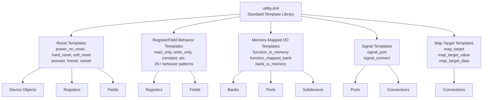

**Sources:** [lib/1.4/utility.dml:1-26](), [lib/1.4/utility.dml:50-85](), [lib/1.4/utility.dml:336-941](), [lib/1.4/utility.dml:942-1065](), [lib/1.4/utility.dml:1066-1239](), [lib/1.4/utility.dml:1240-1397]()

## Reset Template System

### Template Hierarchy

Reset templates provide a three-level system for device initialization and reset:

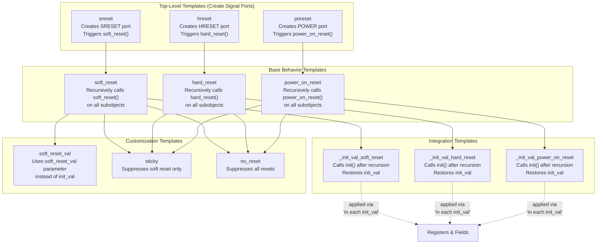

**Sources:** [lib/1.4/utility.dml:176-215](), [lib/1.4/utility.dml:217-255](), [lib/1.4/utility.dml:277-333](), [lib/1.4/utility.dml:363-369]()

### Key Template Implementations

| Template | Target | Method Provided | Default Behavior |
|----------|--------|-----------------|------------------|
| `power_on_reset` | Any object | `power_on_reset()` | Recurses to all subobjects implementing `power_on_reset` |
| `hard_reset` | Any object | `hard_reset()` | Recurses to all subobjects implementing `hard_reset` |
| `soft_reset` | Any object | `soft_reset()` | Recurses to all subobjects implementing `soft_reset` |
| `poreset` | Device (top-level) | Creates `POWER` port | Implements `signal` interface, calls `dev.power_on_reset()` on `signal_raise` |
| `hreset` | Device (top-level) | Creates `HRESET` port | Implements `signal` interface, calls `dev.hard_reset()` on `signal_raise` |
| `sreset` | Device (top-level) | Creates `SRESET` port | Implements `signal` interface, calls `dev.soft_reset()` on `signal_raise` |

**Sources:** [lib/1.4/utility.dml:176-215](), [lib/1.4/utility.dml:217-255](), [lib/1.4/utility.dml:277-333]()

### Reset Propagation Mechanism

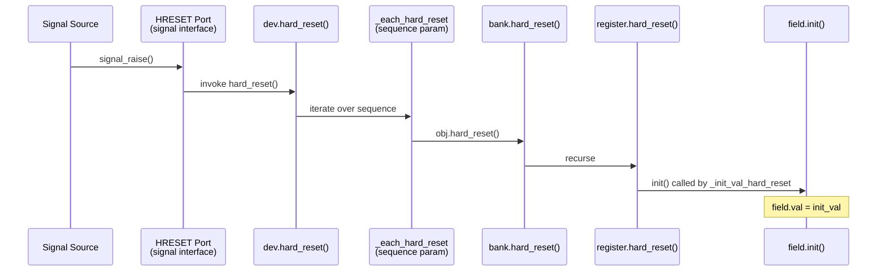

**Sources:** [lib/1.4/utility.dml:217-255](), [lib/1.4/utility.dml:233-238]()

## Register and Field Behavior Templates

### Behavioral Pattern Categories

The utility library provides 25+ templates implementing common register and field access patterns:

**Read/Write Control Templates**

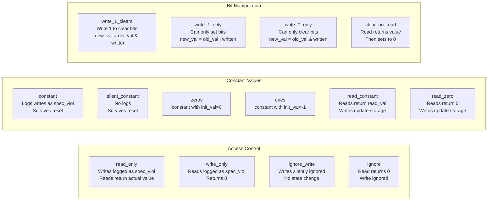

**Sources:** [lib/1.4/utility.dml:384-473](), [lib/1.4/utility.dml:490-560](), [lib/1.4/utility.dml:591-725]()

**Implementation Status Templates**

| Template | Log Level | Log Type | Use Case |
|----------|-----------|----------|----------|
| `unimpl` | 1 then 3 | `unimpl` | Feature not yet implemented |
| `read_unimpl` | 1 then 3 | `unimpl` | Read access unimplemented |
| `write_unimpl` | 1 then 3 | `unimpl` | Write access unimplemented |
| `silent_unimpl` | None | None | Unimplemented, suppress logs |
| `design_limitation` | 1 then 3 | `unimpl` | Known design limitation |
| `undocumented` | 1 then 3 | `unimpl` | Documentation unclear/missing |
| `reserved` | 2 (once) | `spec_viol` | Hardware reserved field |

**Sources:** [lib/1.4/utility.dml:776-941]()

### Template Composition Example

Templates can be combined to create complex behaviors. The composition follows these patterns:

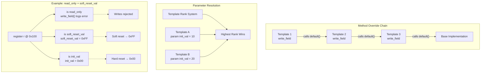

**Sources:** [lib/1.4/utility.dml:434-445](), [lib/1.4/utility.dml:363-369]()

## Memory-Mapped I/O Templates

### Function-Based I/O Routing

The `function_io_memory` template enables function-based memory routing where banks are accessed via a function number rather than a single flat address space:

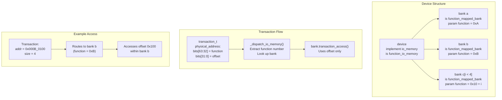

**Sources:** [lib/1.4/utility.dml:942-1011](), [test/1.4/lib/T_io_memory.dml:13-22]()

### Bank I/O Memory Template

The `bank_io_memory` template provides direct bank access without function routing:

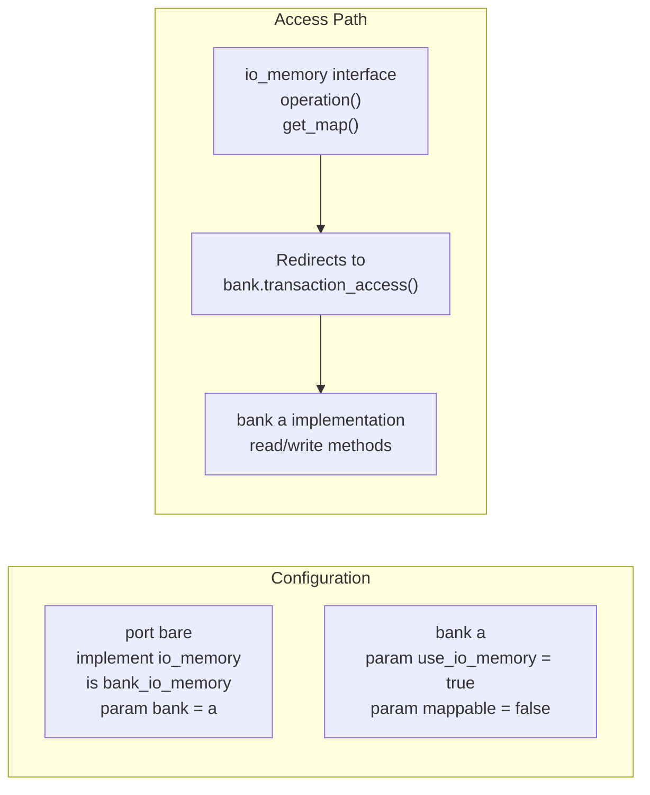

**Sources:** [lib/1.4/utility.dml:1013-1065](), [test/1.4/lib/T_io_memory.dml:23-44]()

### I/O Memory Access Methods

Banks using `io_memory_access` template get specialized transaction handling:

| Method | Transaction Type | Purpose |
|--------|-----------------|---------|
| `get(uint64 offset, uint64 size)` | Inquiry (read-only) | Return value at offset without side effects |
| `set(uint64 offset, uint64 size, uint64 value)` | Inquiry (write) | Store value without side effects |
| `read(uint64 offset, uint64 enabled_bytes, void *aux)` | Normal transaction | Perform actual read with side effects |
| `write(uint64 offset, uint64 value, uint64 enabled_bytes, void *aux)` | Normal transaction | Perform actual write with side effects |

The `transaction_access` method automatically dispatches to the appropriate method based on the transaction's inquiry flag.

**Sources:** [lib/1.4/utility.dml:1013-1065](), [test/1.4/lib/T_io_memory.dml:115-163]()

## Signal Templates

### Signal Port Template

The `signal_port` template implements the `signal` interface for input signal handling:

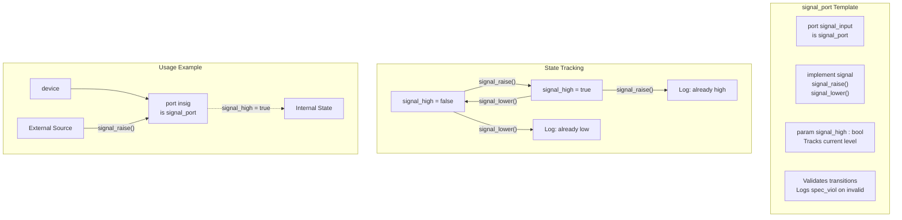

**Sources:** [lib/1.4/utility.dml:1066-1127](), [test/1.4/lib/T_signal_templates.dml:12-23]()

### Signal Connect Template

The `signal_connect` template manages outgoing signal connections with level tracking:

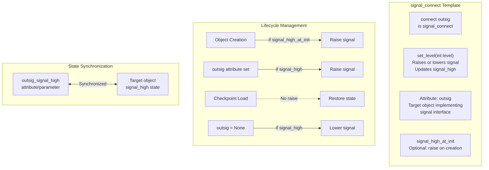

**Sources:** [lib/1.4/utility.dml:1129-1239](), [test/1.4/lib/T_signal_templates.py:25-99]()

## Map Target Templates

### Map Target Connection

The `map_target` template allows `connect` objects to provide memory-mapped access to target devices:

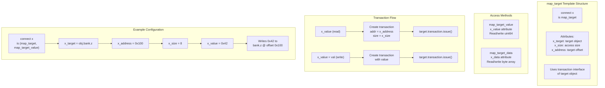

**Sources:** [lib/1.4/utility.dml:1240-1397](), [test/1.4/lib/T_map_target_connect.dml:1-29]()

### Map Target Attributes

| Attribute | Type | Purpose | Required |
|-----------|------|---------|----------|
| `x_target` | `conf_object_t *` | Target device/bank implementing `transaction` | Yes |
| `x_size` | `uint64` | Size of memory access in bytes | Yes |
| `x_address` | `uint64` | Offset within target object | Yes |
| `x_value` | `uint64` | Read/write 64-bit value (if `map_target_value`) | No |
| `x_data` | `[d*]` | Read/write byte array (if `map_target_data`) | No |

The `x_` prefix is replaced by the actual connection name. For a connection named `dma`, the attributes would be `dma_target`, `dma_size`, `dma_address`, etc.

**Sources:** [lib/1.4/utility.dml:1240-1325](), [test/1.4/lib/T_map_target_connect.py:9-43]()

### Error Handling and Logging

Map target templates provide comprehensive error logging:

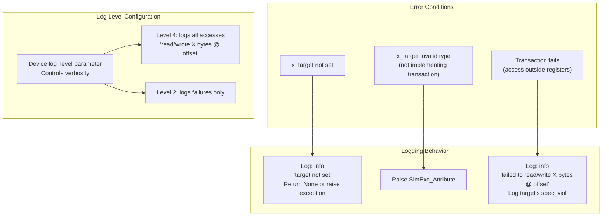

**Sources:** [lib/1.4/utility.dml:1326-1397](), [test/1.4/lib/T_map_target_connect.py:45-65]()

## Template Application Guidelines

### Choosing the Right Template

The following decision tree helps select appropriate templates:

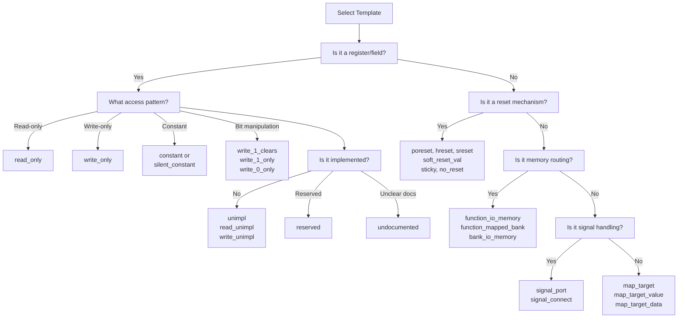

**Sources:** [lib/1.4/utility.dml:1-1397]()

### Common Template Combinations

Frequently used template combinations:

| Combination | Purpose | Example Use Case |
|-------------|---------|------------------|
| `read_only + init_val` | Readable constant initialized at device creation | Hardware version register |
| `constant + soft_reset_val` | Constant with different soft reset value | Configuration register |
| `write_1_clears + sticky` | Status bits cleared by software, persist across soft reset | Interrupt status register |
| `reserved + ignore_write` | Reserved field in implemented register | Future expansion bits |
| `unimpl + read_constant` | Unimplemented feature with fixed return value | Capability register returning 0 |
| `function_io_memory + hreset` | Function-routed banks with hard reset support | Multi-function device |

**Sources:** [lib/1.4/utility.dml:336-941](), [lib/1.4/utility.dml:176-333]()

### Internal Helper Templates

Several templates are internal implementation details and not intended for direct use:

| Template | Purpose | Used By |
|----------|---------|---------|
| `_reg_or_field` | Provides `is_register` parameter | Register/field behavior templates |
| `_simple_write` | Efficient write implementation | `write_1_clears`, `write_1_only`, etc. |
| `_log_unimpl_read` | Logs unimplemented reads | `unimpl`, `read_unimpl` |
| `_log_unimpl_write` | Logs unimplemented writes | `unimpl`, `write_unimpl` |
| `_init_val_power_on_reset` | Integrates `init_val` with `power_on_reset` | Applied by `poreset` |
| `_init_val_hard_reset` | Integrates `init_val` with `hard_reset` | Applied by `hreset` |
| `_init_val_soft_reset` | Integrates `init_val` with `soft_reset` | Applied by `sreset` |

These templates should not be instantiated directly in device models.

**Sources:** [lib/1.4/utility.dml:14-16](), [lib/1.4/utility.dml:890-895](), [lib/1.4/utility.dml:776-798](), [lib/1.4/utility.dml:192-197]()