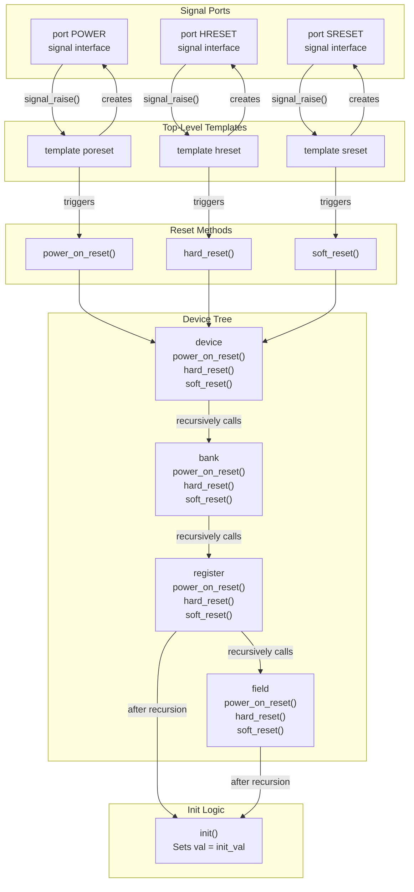
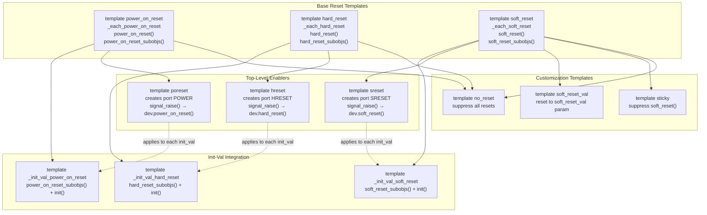
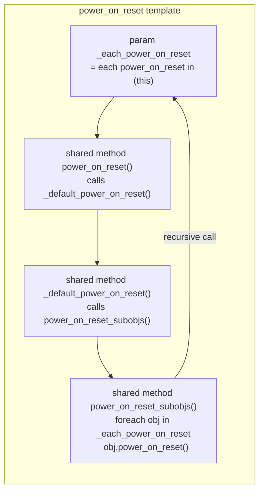
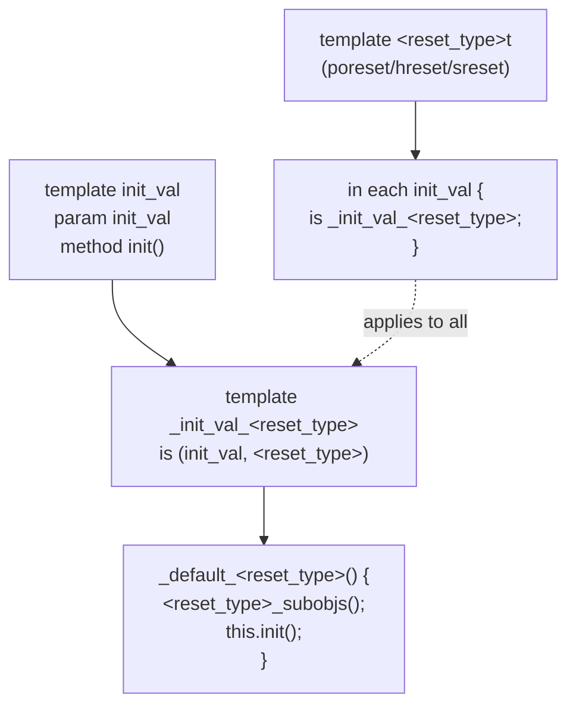
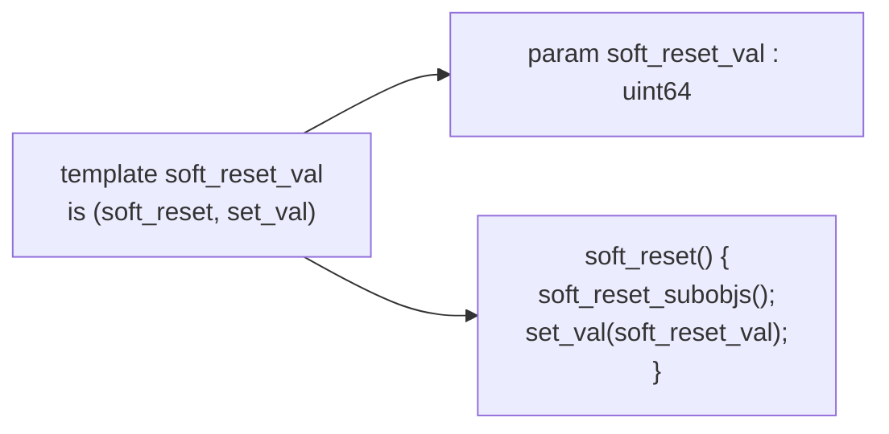
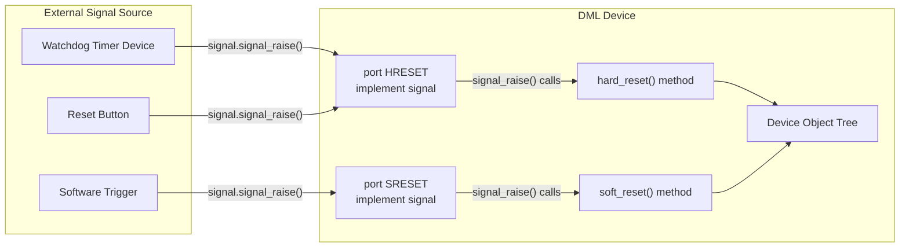
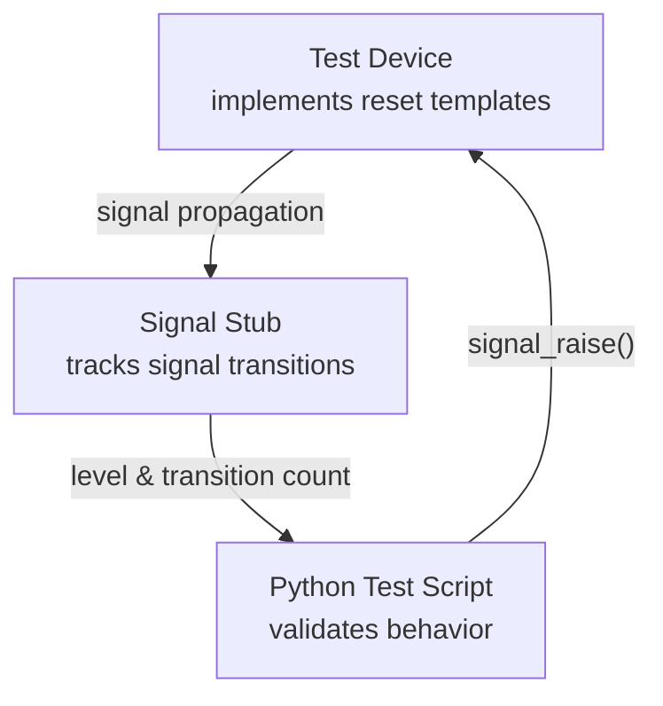

# Reset System

<details>
<summary>Relevant source files</summary>

The following files were used as context for generating this wiki page:

- [lib/1.4/utility.dml](lib/1.4/utility.dml)
- [test/1.4/lib/T_io_memory.dml](test/1.4/lib/T_io_memory.dml)
- [test/1.4/lib/T_io_memory.py](test/1.4/lib/T_io_memory.py)
- [test/1.4/lib/T_map_target_connect.py](test/1.4/lib/T_map_target_connect.py)
- [test/1.4/lib/T_signal_templates.dml](test/1.4/lib/T_signal_templates.dml)
- [test/1.4/lib/T_signal_templates.py](test/1.4/lib/T_signal_templates.py)

</details>


This page describes the DML reset system, which provides standard mechanisms for handling device reset behavior. The reset system includes three standard reset types (power-on, hard, and soft reset), templates for enabling and customizing reset behavior, and signal-based triggering through ports.

For information about register and field behaviors that interact with reset (such as sticky registers), see [Register and Field Behaviors](#4.4). For lifecycle management more broadly, see [Events and Lifecycle](#4.7).

## Overview

The DML reset system addresses the need to restore device registers to pre-defined values in response to different reset events. Reset behavior varies significantly between devices, so DML provides a flexible template-based system rather than built-in reset handling. The system supports three standard reset types commonly found in hardware devices, each triggered via signal ports implementing the Simics `signal` interface.

**Key Components:**
- **Signal Ports**: `POWER`, `HRESET`, `SRESET` ports that receive reset signals
- **Reset Methods**: `power_on_reset()`, `hard_reset()`, `soft_reset()` methods that execute reset logic
- **Reset Templates**: Templates for enabling, customizing, and suppressing reset behavior
- **Recursive Propagation**: Reset signals automatically propagate through the object hierarchy

Sources: [lib/1.4/utility.dml:50-170]()

## Reset Types

The reset system defines three standard reset types:

| Reset Type | Port Name | Method Name | Typical Trigger | Description |
|------------|-----------|-------------|-----------------|-------------|
| **Power-on reset** | `POWER` | `power_on_reset()` | Device power-up | Initial reset when power is first supplied to a device |
| **Hard reset** | `HRESET` | `hard_reset()` | Physical reset line, watchdog timer, reset button | Hardware-triggered reset, often identical to power-on reset |
| **Soft reset** | `SRESET` | `soft_reset()` | Software register write | Software-initiated reset, may affect only a subset of registers |

**Common Patterns:**
- Hard reset and power-on reset often behave identically. It's recommended to use only `HRESET` in this case, with `POWER` indicating distinct power-cycle behavior.
- Some devices may have multiple soft reset types. In this case, use device-specific port names instead of `SRESET`, while preserving `POWER` and `HRESET` if unambiguous.
- The effect of a reset is typically to restore all registers to the value defined by the `init_val` parameter.

Sources: [lib/1.4/utility.dml:57-84](), [lib/1.4/utility.dml:122-149]()

## Reset System Architecture



**Signal Flow:** The reset system works by having the top-level templates (`poreset`, `hreset`, `sreset`) create signal ports that implement the `signal` interface. When `signal_raise()` is called on a port, it invokes the corresponding device-level reset method, which then recursively propagates through the entire device tree.

Sources: [lib/1.4/utility.dml:201-215](), [lib/1.4/utility.dml:241-255](), [lib/1.4/utility.dml:318-333]()

## Core Template Hierarchy



**Template Composition:** Each reset type has a three-layer template structure:
1. **Base template** (e.g., `power_on_reset`) - provides the method and recursion mechanism
2. **Init-val integration template** (e.g., `_init_val_power_on_reset`) - combines reset with register initialization
3. **Top-level template** (e.g., `poreset`) - creates the signal port and wires it to the device

Sources: [lib/1.4/utility.dml:176-215](), [lib/1.4/utility.dml:217-255](), [lib/1.4/utility.dml:277-333]()

## Reset Method Implementation

### Base Reset Templates

Each base reset template follows the same pattern, shown here for `power_on_reset`:



**Mechanism:**
- `_each_<reset_type>` parameter collects all sub-objects implementing the reset template using a sequence expression
- `<reset_type>()` method provides the primary entry point with a `default` implementation
- `_default_<reset_type>()` method provides the default behavior that can be overridden
- `<reset_type>_subobjs()` method performs the recursive traversal

This structure allows overriding at multiple levels:
- Override `<reset_type>()` to completely replace reset behavior
- Override `_default_<reset_type>()` to add behavior before/after recursion
- Call `default()` from an override to preserve recursive propagation

Sources: [lib/1.4/utility.dml:176-190](), [lib/1.4/utility.dml:217-231](), [lib/1.4/utility.dml:277-290]()

### Integration with Register Initialization

For registers and fields, reset behavior is combined with the `init_val` template:



The top-level templates (`poreset`, `hreset`, `sreset`) use an `in each` statement to automatically apply the combined reset+init template to all objects that have `init_val`. This ensures that after recursing through sub-objects, registers and fields reset their stored value to `init_val`.

Sources: [lib/1.4/utility.dml:192-197](), [lib/1.4/utility.dml:233-238](), [lib/1.4/utility.dml:292-297](), [lib/1.4/utility.dml:212-214]()

## Signal Port Implementation

### Port Creation and Signal Handling

The top-level templates create signal ports that bridge external reset signals to internal reset methods:

**Power-on Reset Port (`poreset` template):**
```
template poreset is power_on_reset {
    port POWER {
        implement signal {
            method signal_raise() default {
                dev.power_on_reset();
            }
            method signal_lower() default {
            }
        }
    }
}
```

**Key Characteristics:**
- `signal_raise()` triggers the device-level reset method
- `signal_lower()` is typically a no-op (reset is edge-triggered on rising edge)
- Both methods can be overridden to add side effects (e.g., tracking reset state)

Sources: [lib/1.4/utility.dml:201-215](), [lib/1.4/utility.dml:241-255](), [lib/1.4/utility.dml:318-333]()

### Power Supply Simulation

The documentation describes two approaches to using the `POWER` port:

| Approach | Signal Behavior | Use Case | Device State |
|----------|----------------|----------|--------------|
| **Reset-only** | Pulse low→high to trigger reset | Simple power-on reset only | Always powered on |
| **Power supply** | High = powered, Low = unpowered | Accurate power simulation | Tracks power state |

For accurate power supply simulation:
- Signal high = device has power and is operational
- Signal low = device is powered off (should not react to stimuli)
- Reset triggered by transition from low to high
- Device starts unpowered after instantiation, requiring explicit signal raise

Sources: [lib/1.4/utility.dml:136-169]()

## Reset Customization Templates

### Soft Reset Value Template



The `soft_reset_val` template allows specifying a different reset value for soft reset than the default `init_val`. After recursing through sub-objects, it sets the value to the `soft_reset_val` parameter instead of calling `init()`.

**Usage Example:**
```
register status {
    param init_val = 0;
    param soft_reset_val = 0x80;  // Bit 7 set after soft reset
    is soft_reset_val;
}
```

Sources: [lib/1.4/utility.dml:363-369]()

### Reset Suppression Templates

| Template | Suppresses | Use Case | Implementation |
|----------|------------|----------|----------------|
| `sticky` | Soft reset only | Registers that preserve value across soft reset | Overrides `soft_reset()` with empty implementation |
| `no_reset` | All resets | Registers that never reset | Overrides all three reset methods with empty implementations |
| `constant` | All resets (implicitly via `no_reset`) | Constant register values | Prevents modification including by reset |
| `silent_constant` | All resets (implicitly via `no_reset`) | Silent constant values | Same as `constant` but without write warnings |

**Implementation Details:**

```
template sticky is soft_reset {
    shared method soft_reset() default {
        // do nothing - no recursion, no reset
    }
}

template no_reset is (power_on_reset, hard_reset, soft_reset) {
    shared method power_on_reset() default { }
    shared method hard_reset() default { }
    shared method soft_reset() default { }
}
```

Note that these overrides don't call `default()`, which means they also suppress reset propagation to any sub-objects (though registers and fields typically don't have resetable sub-objects).

Sources: [lib/1.4/utility.dml:1009-1013](), [lib/1.4/utility.dml:1053-1057](), [lib/1.4/utility.dml:638-653](), [lib/1.4/utility.dml:680]()

## Override Patterns and Recursion Control

### Standard Override Pattern

When overriding reset behavior while preserving recursion:

```
bank my_bank {
    is hard_reset;
    
    method hard_reset() {
        // Custom pre-reset logic
        log info: "Bank resetting";
        
        // Preserve recursive behavior
        default();
        
        // Custom post-reset logic
        // (all sub-objects have already been reset)
    }
}
```

### Suppressing Sub-object Reset

To prevent reset from propagating to sub-objects, override without calling `default()`:

```
register control {
    is soft_reset;
    
    method soft_reset() {
        // Only reset specific fields, not all
        field1.set_val(0);
        // field2 and field3 are NOT reset
    }
}
```

### Selective Recursion

For fine-grained control, bypass `default()` and manually recurse:

```
bank selective {
    is power_on_reset;
    
    method power_on_reset() {
        // Manually reset only specific registers
        register1.power_on_reset();
        register3.power_on_reset();
        // register2 is NOT reset
    }
}
```

Sources: [lib/1.4/utility.dml:103-108](), [lib/1.4/utility.dml:180-182]()

## Signal Interface Integration

The reset system integrates with Simics signal infrastructure for testing and device interconnection:



The signal ports can be connected to any Simics object implementing the `signal` interface, allowing reset to be triggered from:
- External hardware models (watchdog timers, reset controllers)
- Software-triggered mechanisms (register writes invoking `signal_raise()`)
- Test frameworks (Python test code calling the signal interface)
- Checkpoint restoration (automatic signal state restoration)

Sources: [lib/1.4/utility.dml:92-101](), [test/1.4/lib/T_signal_templates.py:71-82](), [test/1.4/lib/T_signal_templates.dml:12-23]()

## Code Entity Reference

### Template Definitions

| Template Name | File Location | Purpose |
|---------------|---------------|---------|
| `power_on_reset` | [lib/1.4/utility.dml:176-190]() | Base template for power-on reset behavior |
| `hard_reset` | [lib/1.4/utility.dml:217-231]() | Base template for hard reset behavior |
| `soft_reset` | [lib/1.4/utility.dml:277-290]() | Base template for soft reset behavior |
| `_init_val_power_on_reset` | [lib/1.4/utility.dml:192-197]() | Combines power-on reset with init_val |
| `_init_val_hard_reset` | [lib/1.4/utility.dml:233-238]() | Combines hard reset with init_val |
| `_init_val_soft_reset` | [lib/1.4/utility.dml:292-297]() | Combines soft reset with init_val |
| `poreset` | [lib/1.4/utility.dml:201-215]() | Top-level template creating POWER port |
| `hreset` | [lib/1.4/utility.dml:241-255]() | Top-level template creating HRESET port |
| `sreset` | [lib/1.4/utility.dml:318-333]() | Top-level template creating SRESET port |
| `soft_reset_val` | [lib/1.4/utility.dml:363-369]() | Custom soft reset value |
| `sticky` | [lib/1.4/utility.dml:1009-1013]() | Suppress soft reset |
| `no_reset` | [lib/1.4/utility.dml:1053-1057]() | Suppress all resets |

### Key Methods

| Method Name | Default Implementation | Override Points |
|-------------|----------------------|-----------------|
| `power_on_reset()` | Calls `_default_power_on_reset()` | Primary override point |
| `_default_power_on_reset()` | Calls `power_on_reset_subobjs()` | Default behavior override |
| `power_on_reset_subobjs()` | Iterates `_each_power_on_reset` | Rarely overridden |
| `hard_reset()` | Calls `_default_hard_reset()` | Primary override point |
| `_default_hard_reset()` | Calls `hard_reset_subobjs()` | Default behavior override |
| `hard_reset_subobjs()` | Iterates `_each_hard_reset` | Rarely overridden |
| `soft_reset()` | Calls `_default_soft_reset()` | Primary override point |
| `_default_soft_reset()` | Calls `soft_reset_subobjs()` | Default behavior override |
| `soft_reset_subobjs()` | Iterates `_each_soft_reset` | Rarely overridden |

### Key Parameters

| Parameter Name | Type | Purpose |
|----------------|------|---------|
| `_each_power_on_reset` | `sequence(power_on_reset)` | Collection of sub-objects for recursion |
| `_each_hard_reset` | `sequence(hard_reset)` | Collection of sub-objects for recursion |
| `_each_soft_reset` | `sequence(soft_reset)` | Collection of sub-objects for recursion |
| `soft_reset_val` | `uint64` | Custom soft reset value (in `soft_reset_val` template) |
| `init_val` | `uint64` | Default reset value for all reset types |

Sources: [lib/1.4/utility.dml:176-333](), [lib/1.4/utility.dml:363-369](), [lib/1.4/utility.dml:1009-1057]()

## Testing and Validation

Reset functionality is tested through signal interface integration tests:

**Test Structure:**


**Test Coverage:**
- Signal level tracking (high/low state)
- Transition counting (raise/lower events)
- Checkpoint persistence (signal state survives save/restore)
- Connection/disconnection behavior (plug/unplug signal targets)
- Error conditions (double raise/lower warnings)

Sources: [test/1.4/lib/T_signal_templates.py:9-99](), [test/1.4/lib/T_signal_templates.dml:1-24]()

## Best Practices

1. **Choose Reset Ports Carefully:**
   - Use only `HRESET` if power-on and hard reset are identical
   - Reserve `POWER` for devices with distinct power-cycle behavior
   - Use device-specific names for multiple soft reset types

2. **Reset Value Management:**
   - Set `init_val` for standard reset behavior
   - Use `soft_reset_val` only when soft reset differs from hard/power-on reset
   - Use `sticky` for registers that preserve value across soft reset
   - Use `no_reset` for configuration registers that survive all resets

3. **Override Recursion Carefully:**
   - Always call `default()` unless intentionally suppressing sub-object reset
   - Override `_default_<reset_type>()` rather than `<reset_type>()` when possible
   - Document any non-standard reset behavior clearly

4. **Signal Port Handling:**
   - Override `signal_lower()` if tracking reset assertion state
   - Don't assume signal stays low after `signal_lower()` (may pulse)
   - Handle checkpoint restoration correctly (don't re-initialize on load)

5. **Testing:**
   - Test all reset types independently
   - Verify recursive propagation through object hierarchy
   - Validate sticky registers don't reset on soft reset
   - Test signal connection/disconnection scenarios

Sources: [lib/1.4/utility.dml:122-149](), [lib/1.4/utility.dml:99-101]()