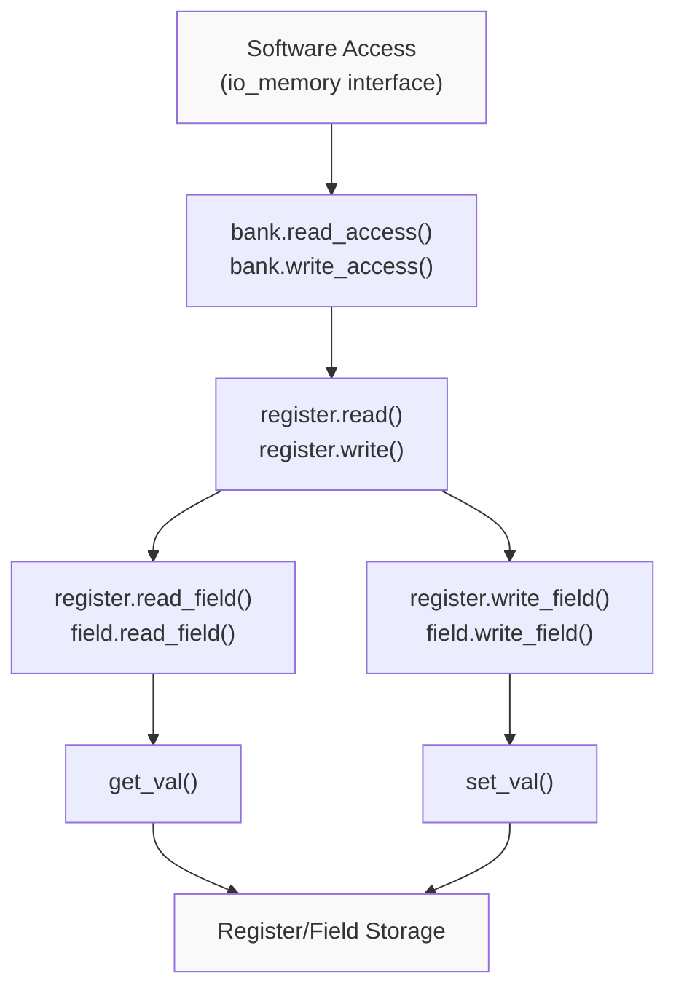
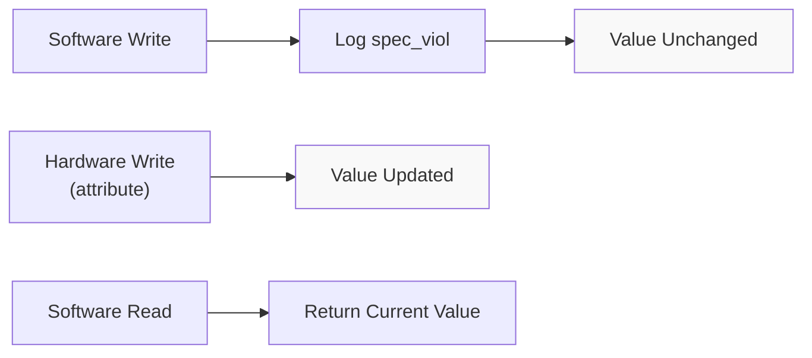
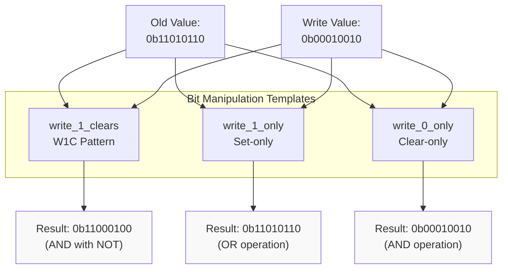
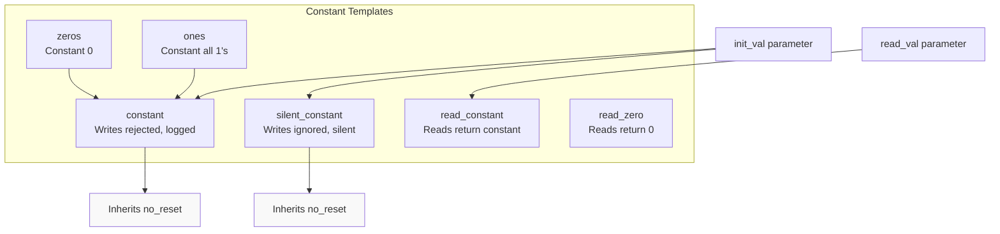
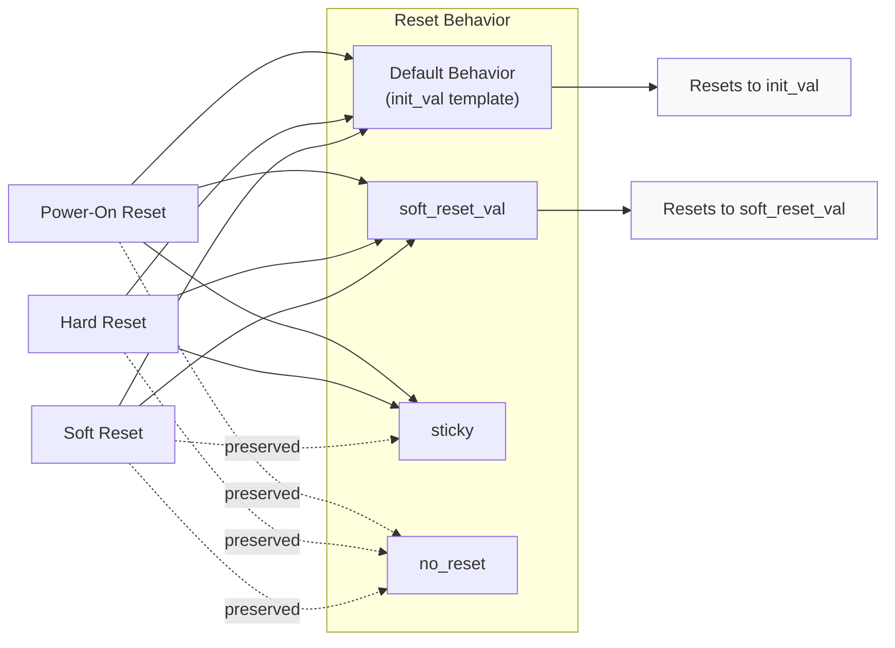
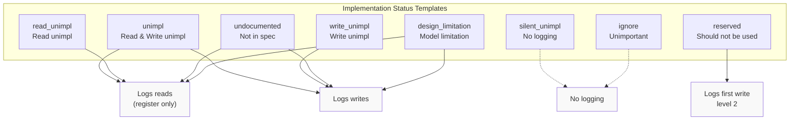
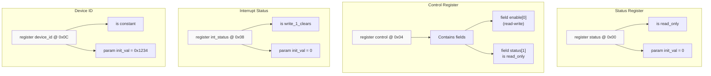

# Register and Field Behaviors

<details>
<summary>Relevant source files</summary>

The following files were used as context for generating this wiki page:

- [lib/1.2/dml-builtins.dml](lib/1.2/dml-builtins.dml)
- [lib/1.4/dml-builtins.dml](lib/1.4/dml-builtins.dml)
- [lib/1.4/utility.dml](lib/1.4/utility.dml)
- [test/1.4/lib/T_io_memory.dml](test/1.4/lib/T_io_memory.dml)
- [test/1.4/lib/T_io_memory.py](test/1.4/lib/T_io_memory.py)
- [test/1.4/lib/T_map_target_connect.py](test/1.4/lib/T_map_target_connect.py)
- [test/1.4/lib/T_signal_templates.dml](test/1.4/lib/T_signal_templates.dml)
- [test/1.4/lib/T_signal_templates.py](test/1.4/lib/T_signal_templates.py)

</details>


## Purpose and Scope

This page documents the standard templates in `utility.dml` that define common register and field behaviors in DML device models. These templates implement typical hardware register patterns such as read-only fields, write-to-clear bits, constant values, and unimplemented registers.

For information about the core register and field object types, see [Core Templates (dml-builtins)](#4.1). For reset mechanisms including `poreset`, `hreset`, and `sreset`, see [Reset System](#4.3). For memory-mapped I/O and bank-level access patterns, see [Memory-Mapped I/O](#4.5).

## Overview

Register and field behavior templates modify how software (via the `io_memory` interface) and hardware (via configuration attributes) interact with device state. Most templates affect either the read or write operation by overriding the `read_field` or `write_field` methods. When applied to a register, these templates bypass field-level implementations.

### Core Access Methods

The DML runtime dispatches accesses through a hierarchical method chain:



**Diagram: Register Access Method Chain**

Sources: [lib/1.4/dml-builtins.dml:2266-2386](), [lib/1.4/dml-builtins.dml:2425-2535]()

## Template Categories

### Access Control Templates

These templates restrict or modify read and write access permissions.

#### read_only

**Purpose**: Prevents software writes while allowing hardware modification. The most common pattern for status registers.

**Behavior**:
- Software reads: Returns current value via `get_val()`
- Software writes: Logged as spec violation, value unchanged
- Hardware access (attributes): Unrestricted

**Parameters**: None

**Logging**: First write logs at level 1, subsequent writes at level 2. Fields only log if the written value differs from the stored value.

**Implementation**: Overrides `write_field` method to reject writes and log violations.



**Diagram: read_only Template Behavior**

Sources: [lib/1.4/utility.dml:434-445]()

#### write_only

**Purpose**: For registers that can be written but not read back (e.g., command registers).

**Behavior**:
- Software reads: Returns 0, logs spec violation
- Software writes: Updates stored value
- Hardware access (attributes): Unrestricted

**Parameters**: None

**Logging**: First read logs at level 1, subsequent reads at level 2.

**Note**: For write-only fields within readable registers, use `read_zero` instead to avoid unnecessary logging.

Sources: [lib/1.4/utility.dml:467-473]()

#### ignore_write

**Purpose**: Silently ignores software writes without logging or updating the value.

**Behavior**:
- Software reads: Returns current value
- Software writes: Silently discarded
- Hardware access (attributes): Unrestricted

**Parameters**: None

**Logging**: None

**Use Case**: Read-only fields within otherwise writable registers, where software commonly writes to the entire register.

Sources: [lib/1.4/utility.dml:384-387]()

### Bit Manipulation Templates

These templates implement specialized bit-level write behaviors common in hardware registers.

#### write_1_clears

**Purpose**: Implements write-1-to-clear (W1C) behavior, commonly used for interrupt status registers.

**Behavior**:
- Software writes: `new_value = old_value & ~written_value`
- Only bits written as 1 are cleared
- Bits written as 0 remain unchanged

**Parameters**: None

**Example**:
```
Register value: 0b11010110
Write value:    0b00010010
New value:      0b11000100
```

Sources: [lib/1.4/utility.dml:490-494]()

#### write_1_only

**Purpose**: Software can only set bits to 1, never clear them.

**Behavior**:
- Software writes: `new_value = old_value | written_value`
- Only bits written as 1 can change
- Clearing requires hardware access or reset

**Parameters**: None

Sources: [lib/1.4/utility.dml:533-537]()

#### write_0_only

**Purpose**: Software can only clear bits to 0, never set them.

**Behavior**:
- Software writes: `new_value = old_value & written_value`
- Only bits written as 0 can change
- Setting requires hardware access or reset

**Parameters**: None

Sources: [lib/1.4/utility.dml:556-560]()



**Diagram: Bit Manipulation Template Examples**

Sources: [lib/1.4/utility.dml:490-560]()

### Constant Value Templates

Templates for registers or fields with fixed or read-only constant values.

#### constant

**Purpose**: Enforces that the register/field maintains a constant value. Writes are rejected with logging.

**Behavior**:
- Software reads: Returns current value (typically `init_val`)
- Software writes: Logged as spec violation, value unchanged
- Hardware access (attributes): Can modify value
- Reset behavior: Value is **not** reset (via `no_reset` template)

**Parameters**:
- `init_val`: The constant value (inherited from `init_val` template)

**Logging**: First write logs at level 1, subsequent writes at level 2.

**Use Case**: Registers that should remain constant but can be tweaked via attributes for testing.

Sources: [lib/1.4/utility.dml:638-653]()

#### read_constant

**Purpose**: Reads always return a specific constant, regardless of the stored value. Writes affect the stored value but not what reads return.

**Behavior**:
- Software reads: Returns `read_val` parameter
- Software writes: Updates stored value normally
- Hardware access (attributes): Reflects stored value, not `read_val`

**Parameters**:
- `read_val` (uint64): The constant value to return on reads

**Use Case**: Registers where software reads return a fixed value, but the stored value (visible via attributes) can change.

**Note**: For truly constant registers without storage, use `constant` instead.

Sources: [lib/1.4/utility.dml:591-601]()

#### silent_constant

**Purpose**: Maintains a constant value, silently ignoring writes without logging.

**Behavior**:
- Software reads: Returns current value
- Software writes: Silently discarded
- Hardware access (attributes): Can modify value
- Reset behavior: Value is **not** reset

**Parameters**:
- `init_val`: The constant value

**Use Case**: Constant registers in contexts where software commonly writes to them.

Sources: [lib/1.4/utility.dml:680]()

#### zeros

**Purpose**: Shorthand for constant value of 0.

**Behavior**: Inherits `constant` template with `init_val = 0`.

Sources: [lib/1.4/utility.dml:700-702]()

#### ones

**Purpose**: Shorthand for constant value of all 1's.

**Behavior**: Inherits `constant` template with `init_val = cast(-1, uint64)`.

Sources: [lib/1.4/utility.dml:723-725]()

#### read_zero

**Purpose**: Reads always return 0, writes are unaffected.

**Behavior**:
- Software reads: Returns 0
- Software writes: Updates stored value normally
- Hardware access (attributes): Reflects actual stored value

**Parameters**: None

**Use Case**: Write-only fields within otherwise readable registers.

Sources: [lib/1.4/utility.dml:405-409]()



**Diagram: Constant Template Relationships**

Sources: [lib/1.4/utility.dml:405-725]()

### Side-Effect Templates

Templates that modify state as a side effect of access operations.

#### clear_on_read

**Purpose**: Reading the register/field returns its value and then resets it to 0.

**Behavior**:
- Software reads: Returns current value, then sets value to 0
- Software writes: Updates value normally
- Hardware access (attributes): Normal get/set behavior

**Parameters**: None

**Use Case**: Event counters or status registers that clear when read.

Sources: [lib/1.4/utility.dml:508-514]()

### Reset Behavior Templates

Templates that modify how registers respond to reset events.

#### soft_reset_val

**Purpose**: Specifies a different reset value for soft reset than the default `init_val`.

**Behavior**:
- Power-on reset: Uses `init_val`
- Hard reset: Uses `init_val`
- Soft reset: Uses `soft_reset_val`

**Parameters**:
- `soft_reset_val` (uint64): Value to restore on soft reset

**Related**: See [Reset System](#4.3) for details on reset mechanisms.

Sources: [lib/1.4/utility.dml:363-369]()

#### sticky

**Purpose**: Register/field value persists across soft reset but not hard reset or power-on reset.

**Behavior**:
- Power-on reset: Resets to `init_val`
- Hard reset: Resets to `init_val`
- Soft reset: Value unchanged

**Parameters**: None

Sources: [lib/1.4/utility.dml:989-993]()

#### no_reset

**Purpose**: Register/field value persists across all reset types.

**Behavior**:
- Power-on reset: Value unchanged
- Hard reset: Value unchanged
- Soft reset: Value unchanged

**Parameters**: None

**Use Case**: Persistent configuration registers that survive all resets.

Sources: [lib/1.4/utility.dml:1002-1008]()



**Diagram: Reset Behavior Template Comparison**

Sources: [lib/1.4/utility.dml:363-369](), [lib/1.4/utility.dml:989-1008]()

### Status and Documentation Templates

Templates that mark implementation status and generate appropriate log messages.

#### unimpl

**Purpose**: Marks register/field functionality as unimplemented. Provides default read/write behavior with logging.

**Behavior**:
- Software reads: Returns current value, logs on first access (register only)
- Software writes: Updates value, logs on first access
- Hardware access (attributes): Unrestricted

**Parameters**:
- `limitations`: Defaults to "Not implemented."

**Logging**: 
- First read (register): unimpl level 1
- Subsequent reads (register): unimpl level 3
- First write: unimpl level 1
- Subsequent writes: unimpl level 3
- Fields: Only log writes if value changes

Sources: [lib/1.4/utility.dml:827-829]()

#### read_unimpl

**Purpose**: Marks only read functionality as unimplemented. Write behavior can be overridden.

**Behavior**:
- Software reads: Returns current value, logs on first access (register only)
- Software writes: Uses default implementation (can be overridden)

**Parameters**:
- `limitations`: Defaults to "Read access not implemented."

**Logging**: Same as `unimpl` for reads only.

Sources: [lib/1.4/utility.dml:855-857]()

#### write_unimpl

**Purpose**: Marks only write functionality as unimplemented. Read behavior can be overridden.

**Behavior**:
- Software reads: Uses default implementation (can be overridden)
- Software writes: Updates value, logs on first access

**Parameters**:
- `limitations`: Defaults to "Write access not implemented."

**Logging**: Same as `unimpl` for writes only.

Sources: [lib/1.4/utility.dml:884-886]()

#### silent_unimpl

**Purpose**: Like `unimpl` but without any logging.

**Behavior**:
- Software reads: Returns current value, no logging
- Software writes: Updates value, no logging

**Parameters**:
- `limitations`: Defaults to "Not implemented."

Sources: [lib/1.4/utility.dml:908-910]()

#### reserved

**Purpose**: Marks register/field as reserved (should not be used by software). Provides default behavior with minimal logging.

**Behavior**:
- Software reads: Returns current value
- Software writes: Updates value
- Hardware access (attributes): Unrestricted

**Parameters**: None

**Logging**: First write logs at level 2, subsequent writes are silent. Only logs if value changes for fields.

**Use Case**: Reserved fields in registers that software may inadvertently write to.

Sources: [lib/1.4/utility.dml:760-774]()

#### undocumented

**Purpose**: Marks functionality that exists in hardware but is not documented.

**Behavior**: Same as `unimpl` but with different default `limitations` text.

**Parameters**:
- `limitations`: Defaults to "Undocumented in the hardware specification."

Sources: [lib/1.4/utility.dml:924-926]()

#### design_limitation

**Purpose**: Marks functionality that is a known limitation of the model.

**Behavior**: Same as `unimpl` but with different default `limitations` text.

**Parameters**:
- `limitations`: Defaults to "Not modeled."

Sources: [lib/1.4/utility.dml:944-946]()

#### ignore

**Purpose**: Marks register/field as unimportant. Reads return 0, writes are ignored.

**Behavior**:
- Software reads: Returns 0
- Software writes: Silently discarded
- Hardware access (attributes): Can modify value
- Reset behavior: Value is **not** reset

**Parameters**: None

**Logging**: None

**Use Case**: Unimportant registers that software may access but the model doesn't need to track.

Sources: [lib/1.4/utility.dml:740]()



**Diagram: Status Template Logging Behavior**

Sources: [lib/1.4/utility.dml:740-946]()

## Template Application Examples

### Common Register Patterns



**Diagram: Common Register Pattern Applications**

Sources: [lib/1.4/utility.dml:1-946]()

### Template Composition

Multiple templates can be combined on a single register or field. Templates are inherited in order, with later templates able to override earlier ones.

**Example combinations**:
- `constant` + `read_only`: Redundant, `constant` already prevents writes
- `read_zero` + `write_unimpl`: Write-only unimplemented field
- `ignore_write` + `soft_reset_val`: Read-only with custom soft reset
- `unimpl` + `sticky`: Unimplemented but value persists across soft reset

**Template inheritance order matters**: When multiple templates define the same method, the rightmost template in the `is` clause takes precedence.

Sources: [lib/1.4/utility.dml:1-946]()

## Implementation Details

### Method Override Points

Behavior templates primarily override two methods:

1. **`read_field(uint64 enabled_bits, void *aux) -> (uint64)`**: Called during software read operations. The `enabled_bits` parameter indicates which bits in the register/field are being accessed.

2. **`write_field(uint64 value, uint64 enabled_bits, void *aux)`**: Called during software write operations. The `value` parameter is the value being written, and `enabled_bits` indicates which bits are being modified.

Sources: [lib/1.4/dml-builtins.dml:2266-2535]()

### Helper Templates

Several internal helper templates are used by behavior templates:

- **`_simple_write`**: Implements bitwise write with mask: `new_value = (old_value & ~enabled_bits) | (value & enabled_bits)`
- **`_reg_or_field`**: Provides `is_register` parameter for distinguishing register vs. field
- **`_qname`**: Provides qualified name for logging
- **`get_val()` / `set_val()`**: Access the underlying stored value

Sources: [lib/1.4/utility.dml:890-895](), [lib/1.4/utility.dml:14-16]()

### Register vs Field Behavior

When a behavior template is applied to a register containing fields:
- The template affects the entire register
- Individual field implementations of `read_field` or `write_field` are bypassed
- For partial control, apply templates to individual fields instead

**Example**: A register with `read_only` template will reject writes to the entire register, even if some fields don't have `read_only`.

Sources: [lib/1.4/utility.dml:336-345]()

## DML 1.2 Compatibility

Most behavior templates exist in both DML 1.2 and 1.4 with similar functionality. Key differences:

- DML 1.2 uses `parameter` instead of `param`
- DML 1.2 uses `$` prefix for parameter references
- Some template names or parameters may differ slightly
- Reset behavior integration differs (DML 1.2 uses `_hard_reset` and `_soft_reset` templates)

For migrating DML 1.2 code, see [Porting from DML 1.2 to 1.4](#7.2).

Sources: [lib/1.2/dml-builtins.dml:1-5000]()