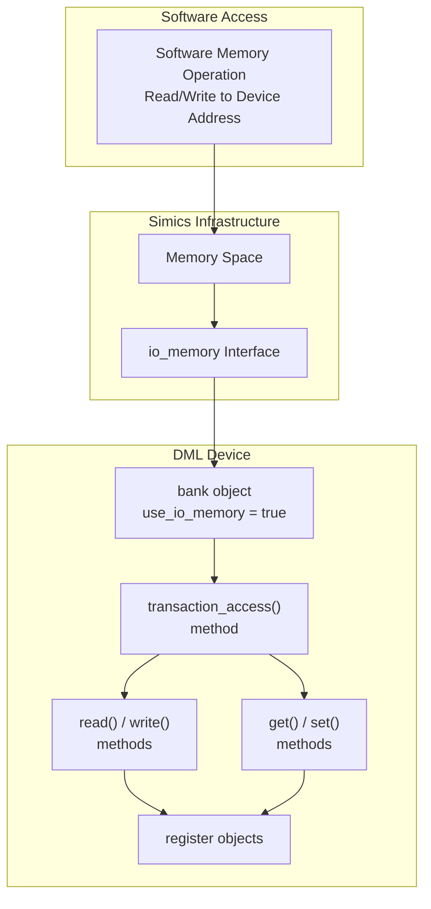
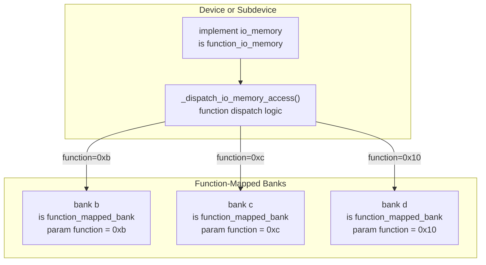
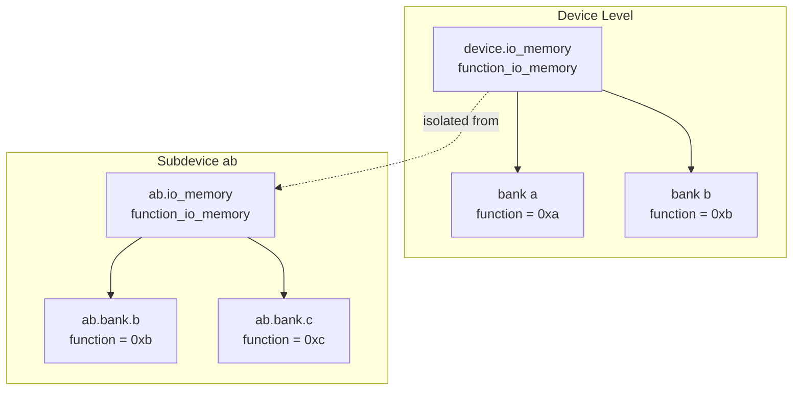
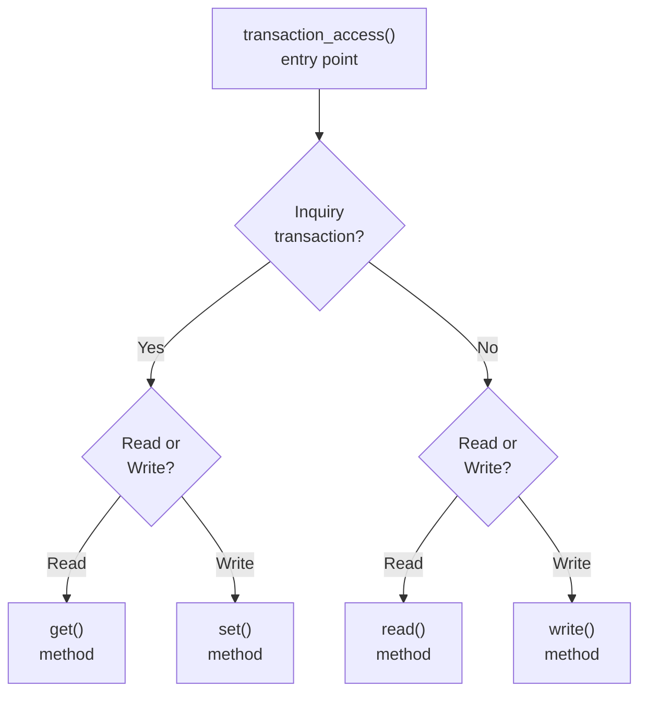
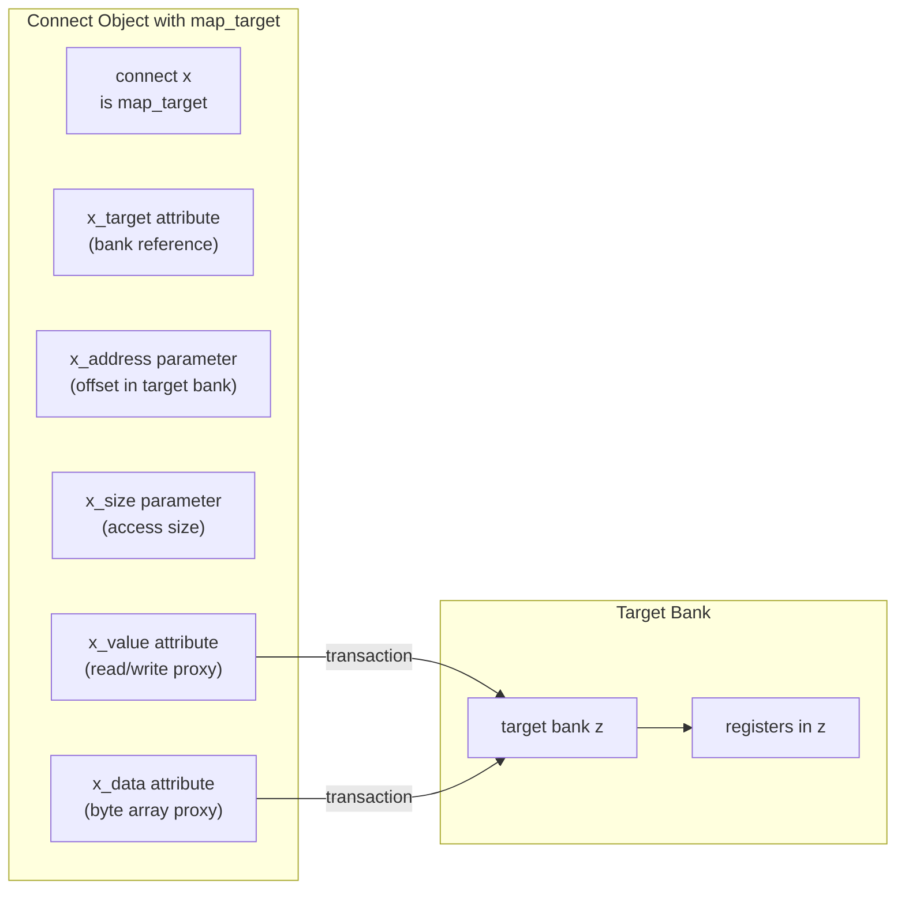
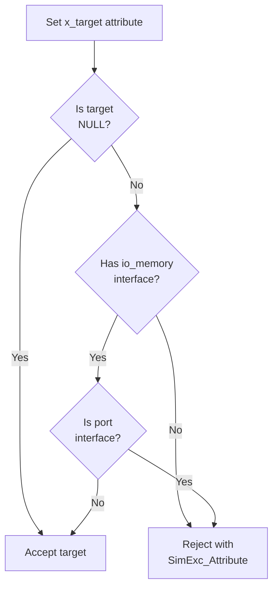

# Memory-Mapped I/O

<details>
<summary>Relevant source files</summary>

The following files were used as context for generating this wiki page:

- [lib/1.2/dml-builtins.dml](lib/1.2/dml-builtins.dml)
- [lib/1.4/dml-builtins.dml](lib/1.4/dml-builtins.dml)
- [lib/1.4/utility.dml](lib/1.4/utility.dml)
- [test/1.4/lib/T_io_memory.dml](test/1.4/lib/T_io_memory.dml)
- [test/1.4/lib/T_io_memory.py](test/1.4/lib/T_io_memory.py)
- [test/1.4/lib/T_map_target_connect.py](test/1.4/lib/T_map_target_connect.py)
- [test/1.4/lib/T_signal_templates.dml](test/1.4/lib/T_signal_templates.dml)
- [test/1.4/lib/T_signal_templates.py](test/1.4/lib/T_signal_templates.py)

</details>


## Purpose and Scope

This page documents the DML standard library templates and mechanisms for implementing memory-mapped I/O (MMIO) in device models. It covers how banks expose themselves for memory-mapped access through the `io_memory` interface, including direct bank mapping (`bank_io_memory`), function-based dispatch (`function_io_memory`), and connection-based redirection (`map_target`).

For information about the core bank, register, and field object types, see [Core Templates (dml-builtins)](#4.1). For attribute-based device configuration, see [Attributes and Connections](#4.6).

## Overview

DML devices implement memory-mapped I/O by having banks implement the `io_memory` Simics interface. When software performs memory read or write operations to addresses mapped to the device, these operations are converted to transactions that flow through the bank's access methods. The standard library provides several templates to configure how banks handle these transactions:

- **`bank_io_memory`**: Direct bank mapping where transactions go to a single bank
- **`function_io_memory`**: Function-based dispatch that routes transactions to multiple banks
- **`function_mapped_bank`**: Marks a bank as accessible through function dispatch
- **`map_target`**: Connect object that redirects accesses to another bank

### Key Parameter: use_io_memory

The `use_io_memory` parameter in banks controls whether the bank uses the traditional `io_memory` interface or the newer transaction-based API. When `use_io_memory` is `true`, the bank implements `io_memory` and uses `bank_io_memory`. When `false`, the bank expects to be accessed through direct transaction method calls.

Sources: [lib/1.4/dml-builtins.dml:1-300](), [lib/1.4/utility.dml:1-100]()

## Bank I/O Memory Architecture

### Transaction Flow Diagram



Sources: [lib/1.4/dml-builtins.dml:1700-1850](), [test/1.4/lib/T_io_memory.dml:1-50]()

### bank_io_memory Template

The `bank_io_memory` template implements the `io_memory` interface for a bank. When instantiated on an `implement io_memory` statement within a bank or port, it creates the necessary interface methods that route transactions to the bank's `transaction_access` method.

**Key Components:**

- **`bank` parameter**: Required parameter specifying which bank handles the transactions
- **`operation()` method**: Entry point from Simics that receives generic_transaction_t
- **`transaction_access()` method**: Bank method that processes the transaction

**Example Structure:**
```dml
bank mybank {
    param use_io_memory = true;
    implement io_memory {
        is bank_io_memory;
        param bank = mybank;  // references this bank
    }
}
```

Sources: [lib/1.4/dml-builtins.dml:1700-1800](), [test/1.4/lib/T_io_memory.dml:23-28]()

### transaction_access Method

The `transaction_access` method is the core handler for memory-mapped transactions. It receives a transaction object and an offset, processes the access, and returns an exception type.

**Signature:**
```dml
method transaction_access(transaction_t *t, uint64 offset, void *aux) 
    -> (exception_type_t)
```

**Default Behavior:**
The default implementation distinguishes between inquiry transactions (speculative reads) and normal transactions, routing to appropriate `get`/`set` or `read`/`write` methods based on the transaction properties.

Sources: [lib/1.4/dml-builtins.dml:1750-1850](), [test/1.4/lib/T_io_memory.dml:117-163]()

## Function-Based I/O Memory

Function-based I/O memory allows multiple banks to be accessed through a single `io_memory` interface by dispatching based on a function number. This is commonly used when a device presents multiple register banks that need separate addressing.

### Architecture Diagram



Sources: [lib/1.4/utility.dml:900-1100](), [test/1.4/lib/T_io_memory.dml:90-113]()

### function_io_memory Template

The `function_io_memory` template provides automatic dispatch to banks based on function numbers encoded in the transaction. It's typically instantiated at the device or subdevice level.

**Key Features:**

- Automatically collects all `function_mapped_bank` instances in scope
- Dispatches transactions based on the function number
- Handles function number validation and error reporting
- Supports nested subdevice isolation

**Instantiation Pattern:**
```dml
device mydevice {
    implement io_memory {
        is function_io_memory;
    }
    // Banks in this scope can use function_mapped_bank
}
```

Sources: [lib/1.4/utility.dml:900-1050](), [test/1.4/lib/T_io_memory.dml:13-21]()

### function_mapped_bank Template

The `function_mapped_bank` template marks a bank as accessible through function-based dispatch. The bank must specify a unique `function` parameter that identifies it within the scope.

**Required Parameters:**

| Parameter | Type | Description |
|-----------|------|-------------|
| `function` | uint64 | Unique function number for this bank |
| `use_io_memory` | bool | Must be `false` (accessed via function dispatch) |

**Example:**
```dml
bank status_regs {
    is function_mapped_bank;
    param function = 0x01;
    
    register status @ 0x00 {
        // register implementation
    }
}

bank control_regs {
    is function_mapped_bank;
    param function = 0x02;
    
    register control @ 0x00 {
        // register implementation
    }
}
```

Sources: [lib/1.4/utility.dml:1050-1150](), [test/1.4/lib/T_io_memory.dml:90-105]()

### Subdevice Isolation

When using `function_io_memory` in subdevices, each subdevice maintains its own dispatch scope. Banks within a subdevice are only visible to that subdevice's `function_io_memory` instance.

**Isolation Example:**



Sources: [test/1.4/lib/T_io_memory.dml:45-89](), [test/1.4/lib/T_io_memory.py:23-34]()

## Transaction Handling Methods

Banks provide multiple methods for handling memory transactions, offering different levels of abstraction and control.

### Method Hierarchy

| Method | Parameters | Use Case | Transaction Type |
|--------|------------|----------|------------------|
| `transaction_access()` | transaction_t*, offset, aux | Full transaction control | All |
| `read()` | offset, enabled_bytes, aux | Non-inquiry reads | Normal read |
| `write()` | offset, value, enabled_bytes, aux | Non-inquiry writes | Normal write |
| `get()` | offset, size | Inquiry reads | Inquiry read |
| `set()` | offset, size, value | Inquiry writes | Inquiry write |

### Transaction Access Patterns

The default `transaction_access` implementation routes transactions as follows:



Sources: [lib/1.4/dml-builtins.dml:1750-1850](), [test/1.4/lib/T_io_memory.dml:117-163]()

### Custom Transaction Handling

Banks can override `transaction_access` to provide custom transaction handling, including modifying the auxiliary data or implementing special access patterns.

**Example with Custom Auxiliary Data:**
```dml
bank custom {
    param use_io_memory = false;
    
    method transaction_access(transaction_t *t, uint64 offset, void *aux) 
        -> (exception_type_t) {
        // Pass custom auxiliary data to read/write methods
        return default(t, offset, cast(1234, void *));
    }
    
    method read(uint64 offset, uint64 enabled_bytes, void *aux)
        -> (uint64) throws {
        saved uint64 received_aux;
        received_aux = cast(aux, uintptr_t);  // Will be 1234
        // custom read logic
    }
}
```

Sources: [test/1.4/lib/T_io_memory.dml:115-163](), [test/1.4/lib/T_io_memory.py:43-70]()

### Exception Handling

Transaction methods can throw exceptions to signal access failures. The exceptions are converted to appropriate Simics exception types.

**Exception Types:**

- **`Sim_PE_No_Exception`**: Successful access
- **`Sim_PE_IO_Not_Taken`**: Access not handled (for miss patterns)
- **Other exceptions**: Converted from DML throws

Sources: [lib/1.4/dml-builtins.dml:1750-1850]()

## Map Target Connections

The `map_target` template enables a `connect` object to act as a proxy for accessing another bank's registers. This is useful for implementing address remapping or providing alternative access paths to device registers.

### map_target Architecture



Sources: [lib/1.4/utility.dml:1600-1800](), [test/1.4/lib/T_map_target_connect.py:1-70]()

### map_target Template

The `map_target` template provides a set of attributes that allow reading and writing target bank registers through a connection object.

**Required Parameters and Attributes:**

| Member | Type | Purpose |
|--------|------|---------|
| `_target` attribute | conf_object_t* | Reference to target bank's Simics object |
| `_address` attribute | uint64 | Offset within target bank |
| `_size` attribute | uint64 | Size of access in bytes |
| `_value` attribute | uint64 | Read/write integer value at target |
| `_data` attribute | byte array | Read/write raw bytes at target |

**Usage Pattern:**

```dml
connect x {
    is map_target;
}

// In Python test or CLI:
// obj.x_target = obj.bank.z  // Set target bank
// obj.x_address = 0x100       // Set offset
// obj.x_size = 8              // Set access size
// value = obj.x_value         // Read from bank.z @ 0x100
// obj.x_value = 0x42          // Write to bank.z @ 0x100
```

Sources: [lib/1.4/utility.dml:1600-1800](), [test/1.4/lib/T_map_target_connect.py:9-65]()

### Target Validation

The `map_target` template validates that the target is a valid memory-mapped bank. Invalid targets (such as port interfaces or regular conf_objects) are rejected with exceptions.

**Validation Logic:**



Sources: [lib/1.4/utility.dml:1650-1750](), [test/1.4/lib/T_map_target_connect.py:23-27]()

### Transaction Logging

When `log_level` is set appropriately, the `map_target` template logs transaction operations for debugging purposes.

**Logged Information:**

- Read operations: "read N bytes @ offset"
- Write operations: "wrote N bytes @ offset"  
- Failed operations: "failed to read/write N bytes @ offset"

Sources: [lib/1.4/utility.dml:1700-1750](), [test/1.4/lib/T_map_target_connect.py:45-65]()

## Practical Examples

### Example 1: Simple Bank with Direct I/O Memory

A basic bank that implements `io_memory` directly:

```dml
bank simple_bank {
    param use_io_memory = true;
    
    register status @ 0x00 {
        param size = 4;
        field ready @ [0];
        field busy @ [1];
    }
    
    register control @ 0x04 {
        param size = 4;
        field enable @ [0];
    }
}
```

The bank automatically implements the `io_memory` interface through the `bank_io_memory` template, routing accesses to its registers.

Sources: [lib/1.4/dml-builtins.dml:1200-1400]()

### Example 2: Multiple Function-Mapped Banks

A device with multiple register banks accessed via function numbers:

```dml
device multi_bank_device {
    implement io_memory {
        is function_io_memory;
    }
    
    bank status {
        is function_mapped_bank;
        param function = 0x01;
        
        register device_status @ 0x00 { param size = 4; }
        register error_status @ 0x04 { param size = 4; }
    }
    
    bank control {
        is function_mapped_bank;
        param function = 0x02;
        
        register device_control @ 0x00 { param size = 4; }
        register interrupt_mask @ 0x04 { param size = 4; }
    }
    
    bank data_buffer {
        is function_mapped_bank;
        param function = 0x10;
        
        register buffer[i < 16] @ 0x00 + i * 4 { param size = 4; }
    }
}
```

Software accesses these banks using function numbers encoded in the memory space mapping.

Sources: [test/1.4/lib/T_io_memory.dml:90-113](), [lib/1.4/utility.dml:900-1100]()

### Example 3: Bank with Custom Transaction Handling

A bank that processes transactions with custom auxiliary data:

```dml
bank custom_handler {
    param use_io_memory = false;
    
    method transaction_access(transaction_t *t, uint64 offset, void *aux)
        -> (exception_type_t) {
        local uint32 custom_flags = 0x5555;
        return default(t, offset, cast(custom_flags, void *));
    }
    
    method read(uint64 offset, uint64 enabled_bytes, void *aux)
        -> (uint64) throws {
        local uint32 flags = cast(aux, uint32);
        log info: "Read with flags 0x%x", flags;
        
        // Custom read logic based on flags
        if (offset == 0x00) {
            return compute_special_value(flags);
        }
        return default(offset, enabled_bytes, aux);
    }
}
```

Sources: [test/1.4/lib/T_io_memory.dml:115-163]()

### Example 4: Map Target for Register Aliasing

Using `map_target` to create an alias to another bank's registers:

```dml
device aliased_device {
    bank main_regs {
        register config @ 0x00 { param size = 4; }
        register data @ 0x10 { param size = 8; }
    }
    
    connect alias_to_data {
        is map_target;
    }
}

// In initialization or Python:
// obj.alias_to_data_target = obj.bank.main_regs
// obj.alias_to_data_address = 0x10
// obj.alias_to_data_size = 8
// Now obj.alias_to_data_value proxies to main_regs.data
```

This allows alternative access paths to the same underlying registers, useful for compatibility or legacy software support.

Sources: [test/1.4/lib/T_map_target_connect.py:9-44](), [lib/1.4/utility.dml:1600-1800]()

## Summary

The DML memory-mapped I/O system provides flexible mechanisms for exposing device registers to software:

- **`bank_io_memory`**: Direct mapping for simple single-bank devices
- **`function_io_memory`**: Function-based dispatch for multi-bank devices
- **`function_mapped_bank`**: Marks banks for function-based access
- **`map_target`**: Connection-based proxying to other banks
- **Transaction methods**: Layered access control with `transaction_access`, `read`/`write`, and `get`/`set`

These templates work together with the core bank and register infrastructure to provide comprehensive memory-mapped device modeling capabilities.

Sources: [lib/1.4/dml-builtins.dml:1-3000](), [lib/1.4/utility.dml:1-3000](), [test/1.4/lib/T_io_memory.dml:1-175]()