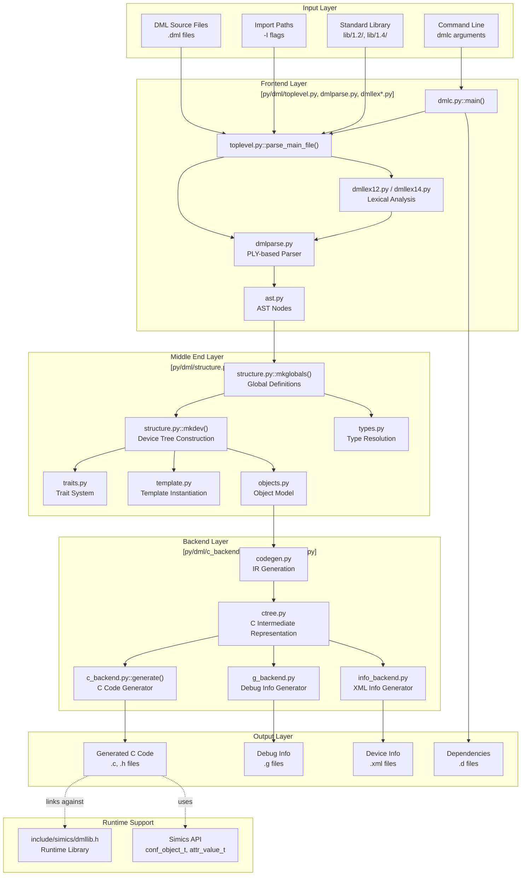
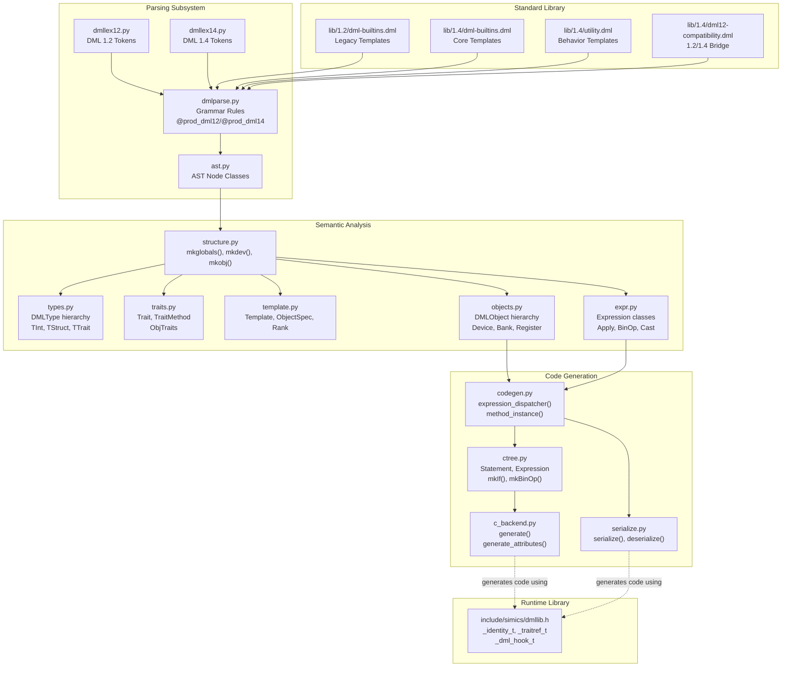
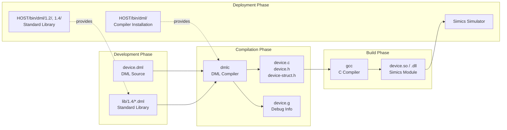

# Overview

<details>
<summary>Relevant source files</summary>

The following files were used as context for generating this wiki page:

- [RELEASENOTES-1.2.md](RELEASENOTES-1.2.md)
- [RELEASENOTES-1.4.md](RELEASENOTES-1.4.md)
- [RELEASENOTES.md](RELEASENOTES.md)
- [deprecations_to_md.py](deprecations_to_md.py)
- [doc/1.4/language.md](doc/1.4/language.md)
- [py/dml/breaking_changes.py](py/dml/breaking_changes.py)
- [py/dml/dmlc.py](py/dml/dmlc.py)
- [py/dml/dmlparse.py](py/dml/dmlparse.py)
- [py/dml/globals.py](py/dml/globals.py)
- [py/dml/messages.py](py/dml/messages.py)
- [py/dml/toplevel.py](py/dml/toplevel.py)

</details>


## Purpose and Scope

The Device Modeling Language (DML) compiler system (`dmlc`) transforms DML source code into C code that integrates with the Simics simulator for hardware device modeling. This document provides a high-level overview of the entire DML compiler ecosystem, including its architecture, major subsystems, language versions, and integration points.

For detailed information about specific subsystems, see:
- Compilation pipeline details: [Compilation Pipeline](#5.1)
- Language syntax and semantics: [DML Language Reference](#3)
- Standard library reference: [Standard Library](#4)
- Development and testing: [Development Guide](#7)

Sources: [RELEASENOTES-1.4.md:1-30](), [doc/1.4/language.md:1-40](), [py/dml/dmlc.py:1-50]()

## What is DML?

DML is a domain-specific modeling language for creating Simics device models. It is **not** a general-purpose programming language, but rather a specialized language combining:

- **Object-oriented device structure**: Hierarchical objects representing devices, banks, registers, fields, and connections
- **C-like imperative code**: Method bodies use C-like syntax for algorithmic logic
- **Automatic Simics bindings**: Automatic generation of configuration classes, attributes, and interface implementations
- **Template-based code reuse**: Parameterized templates for common device modeling patterns

The DML compiler generates C code that links against the Simics API and the DML runtime library (`dmllib.h`). The generated code is compiled by GCC into shared library modules (`.so`/`.dll`) that can be loaded by the Simics simulator.

Sources: [doc/1.4/language.md:8-35](), [RELEASENOTES-1.4.md:9-38]()

## Language Versions

### DML 1.2 (Legacy)

DML 1.2 is the legacy version of the language, still supported for backward compatibility. Key characteristics:
- Dollar-sign syntax for parameter references (`$param`)
- Less strict type checking
- Hard-coded reset mechanisms
- Limited override capabilities in standard library

Files: [py/dml/dmllex12.py](), [RELEASENOTES-1.2.md]()

### DML 1.4 (Modern)

DML 1.4 is the current version, introduced in Simics 6. Major improvements over 1.2:
- **2-3× faster compilation** for devices with large register banks
- **Simplified syntax**: No dollar signs, C-like method declarations
- **Templates as types**: Pass references to objects in variables
- **Multiple override levels**: Methods/parameters can be overridden any number of times
- **Flexible reset system**: Adaptable reset flows via `poreset`, `hreset`, `sreset` templates
- **Better semantics**: More consistent and predictable behavior

Files: [RELEASENOTES-1.4.md:6-38](), [py/dml/dmllex14.py]()

### Version Compatibility

The compiler supports:
- **Mixed-version imports**: DML 1.4 files can import DML 1.2 code via the `dml12-compatibility.dml` library
- **Automated migration**: The `port-dml.py` tool performs automatic conversion from 1.2 to 1.4
- **Simics API versions**: Supports Simics API 4.8, 5, 6, and 7 with version-specific behavior controlled by `breaking_changes.py`

Files: [py/dml/breaking_changes.py](), [py/dml/dmlc.py:441-446]()

Sources: [RELEASENOTES-1.4.md:1-40](), [py/dml/breaking_changes.py:1-50](), [doc/1.4/language.md:171-179]()

## System Architecture



**Figure 1: DML Compiler System Architecture**

The compilation process flows through four main layers:

1. **Input Layer**: DML source files, standard library modules, and compiler options
2. **Frontend Layer**: Lexical analysis and parsing into an Abstract Syntax Tree (AST)
3. **Middle End Layer**: Semantic analysis, type resolution, template instantiation, and object tree construction
4. **Backend Layer**: C code generation via intermediate representation

Sources: [py/dml/dmlc.py:72-96](), [py/dml/toplevel.py:1-50](), [py/dml/structure.py:1-100]()

## Core Components Mapping



**Figure 2: Core Component Mapping to Source Files**

### Key File Responsibilities

| Component | Primary Files | Key Classes/Functions |
|-----------|--------------|----------------------|
| **Entry Point** | `py/dml/dmlc.py` | `main()`, `process()` |
| **File Loading** | `py/dml/toplevel.py` | `parse_main_file()`, `import_file()`, `scan_statements()` |
| **Lexing** | `py/dml/dmllex12.py`, `py/dml/dmllex14.py` | Version-specific token definitions |
| **Parsing** | `py/dml/dmlparse.py` | `@prod_dml12`, `@prod_dml14` decorators |
| **AST** | `py/dml/ast.py` | `dml()`, `object_()`, `method()`, `param()` |
| **Structure Building** | `py/dml/structure.py` | `mkglobals()`, `mkdev()`, `mkobj()` |
| **Type System** | `py/dml/types.py` | `DMLType`, `TInt`, `TStruct`, `TTrait` |
| **Trait System** | `py/dml/traits.py` | `Trait`, `TraitMethod`, `ObjTraits` |
| **Template System** | `py/dml/template.py` | `Template`, `ObjectSpec`, `Rank` |
| **Object Model** | `py/dml/objects.py` | `DMLObject`, `Device`, `Bank`, `Register` |
| **Expressions** | `py/dml/expr.py` | `Expression`, `Apply`, `BinOp`, `Cast` |
| **IR Generation** | `py/dml/codegen.py` | `expression_dispatcher()`, `method_instance()` |
| **C IR** | `py/dml/ctree.py` | `Statement`, `Expression`, factory functions |
| **C Backend** | `py/dml/c_backend.py` | `generate()`, `generate_attributes()` |
| **Serialization** | `py/dml/serialize.py` | `serialize()`, `deserialize()` |

Sources: [py/dml/dmlc.py:1-100](), [py/dml/toplevel.py:1-50](), [py/dml/structure.py:1-50](), [py/dml/types.py:1-50]()

## Standard Library and Runtime

### Standard Library Structure

The DML standard library is version-specific and provides the core templates that define device modeling patterns:

**DML 1.2 Standard Library** (`lib/1.2/`):
- `dml-builtins.dml`: Core object templates (device, bank, register, field, attribute, connect, event)
- Legacy templates with limited override capabilities

**DML 1.4 Standard Library** (`lib/1.4/`):
- `dml-builtins.dml`: Modern core templates with improved semantics
- `utility.dml`: Behavior templates (`read_only`, `write_only`, `write_1_clears`, reset mechanisms)
- `dml12-compatibility.dml`: Bridge layer enabling DML 1.4 code to work when imported from DML 1.2

Key templates include:
- **Object hierarchy**: `object` (base), `device`, `bank`, `register`, `field`
- **Connections**: `attribute`, `connect`, `interface`, `implement`
- **Organization**: `group`, `port`, `subdevice`, `event`
- **Lifecycle**: `init`, `post_init`, `destroy`
- **Reset**: `poreset`, `hreset`, `sreset`
- **Register behaviors**: `read_only`, `write_only`, `write_1_clears`, `sticky`, `constant`

Sources: [doc/1.4/language.md:360-470](), [RELEASENOTES-1.4.md:12-21]()

### Runtime Library

The DML runtime library is provided by `include/simics/dmllib.h` and supports:

**Identity System**:
- `_identity_t`: Object identity for trait dispatch
- `_id_info_t`: Metadata for object identity

**Trait Dispatch**:
- `_traitref_t`: References to trait-implementing objects
- `_vtable_list_t`: Vtable structures for method dispatch
- Helper macros: `VTABLE_PARAM`, `CALL_TRAIT_METHOD`

**Hook System**:
- `_dml_hook_t`: Hook data structures
- `_hookref_t`: References to hook objects

**Event System**:
- `_simple_event_data_t`: Event callback data

**Serialization**:
- `_serialize_identity()`: Checkpoint support for object identity
- Type-specific serialization functions

Sources: [py/dml/c_backend.py:1-100](), [py/dml/serialize.py:1-50]()

## Build and Integration Workflow



**Figure 3: Build and Integration Workflow**

### Compilation Command

The primary entry point is the `dmlc` compiler:

```bash
dmlc [options] input.dml [output_base]
```

Key options (from [py/dml/dmlc.py:314-456]()):
- `-I PATH`: Add to import search path
- `-D NAME=VALUE`: Define compile-time parameter
- `--simics-api=VERSION`: Specify Simics API version (default: 7)
- `-g`: Generate debug artifacts
- `--dep FILE`: Generate makefile dependencies
- `--warn=TAG` / `--nowarn=TAG`: Control warnings
- `--breaking-change=TAG`: Enable breaking changes

### Generated Outputs

The compiler produces:
1. **C source files**: `<output>-dml.c`, `<output>-struct.h`, `<output>.h`
2. **Debug files** (with `-g`): `<output>.g`
3. **XML info files** (with `--info`): `<output>.xml`
4. **Dependency files** (with `--dep`): makefile rules

Sources: [py/dml/dmlc.py:308-511](), [py/dml/c_backend.py:1-100]()

## Error Handling and Diagnostics

The compiler provides comprehensive error reporting through a hierarchical message system defined in [py/dml/messages.py]():

**Message Types**:
- **Errors** (`DMLError`): Compilation-blocking issues (e.g., `ETYPE`, `ECAST`, `EAMBINH`)
- **Warnings** (`DMLWarning`): Non-blocking issues (e.g., `WUNUSED`, `WNDOC`, `WLOGMIXUP`)
- **Porting Messages** (`PortingMessage`): Migration hints for DML 1.2→1.4 conversion

**Error Message Format**:
```
<filename>:<line>:<column>: error: <TAG>: <message>
  <additional context>
```

The `-T` flag shows message tags, which can be used with `--warn`/`--nowarn` to control reporting.

Sources: [py/dml/messages.py:1-100](), [py/dml/logging.py]()

## API Version Management

The compiler supports multiple Simics API versions through the breaking changes system ([py/dml/breaking_changes.py]()):

**API Versions**:
- API 4.8: Legacy (deprecated)
- API 5: Simics 5
- API 6: Simics 6
- API 7: Simics 7 (current)

**Breaking Changes**: Each API version enables specific breaking changes that alter compiler behavior. Examples include:
- `transaction_by_default` (API 6): Banks use `transaction` interface by default
- `port_obj_param` (API 5): `obj` in banks/ports refers to port object
- `shared_logs_locally` (API 6): Log statements in shared methods log on nearest object
- `modern_attributes` (API 7): Use modern attribute registration API

Use `--breaking-change=TAG` to selectively enable changes before upgrading API version.

Sources: [py/dml/breaking_changes.py:1-100](), [deprecations_to_md.py]()

## Testing Infrastructure

The DML compiler includes a comprehensive test suite orchestrated by [py/dml/tests.py]():

**Test Types**:
- `DMLFileTestCase`: DML compilation tests
- `CTestCase`: Full compilation + Simics integration tests
- `ErrorTest`: Compiler error validation
- `XmlTestCase`: XML output validation

**Test Directories**:
- `test/errors/`: Compiler error validation
- `test/structure/`: Language construct tests
- `test/serialize/`: Checkpointing tests
- `test/lib/`: Standard library tests

**Test Annotations**: Test files use special comments:
```dml
/// ERROR ETAG
/// WARNING WTAG
```

Sources: [py/dml/tests.py](), test directories

## Documentation Generation

Documentation is generated from multiple sources:
- `doc/1.4/language.md`: Language specification
- `RELEASENOTES-1.4.md`: Version history
- Generated from compiler: `grammar_to_md.py`, `messages_to_md.py`, `deprecations_to_md.py`
- Library documentation: Extracted from DML comments via `dmlcomments_to_md.py`

The `dodoc` tool converts Markdown to HTML for the reference manual.

Sources: [deprecations_to_md.py:1-39](), [py/dml/dmlc.py:1-50]()