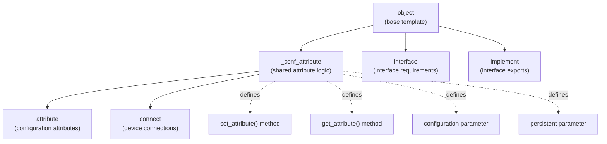
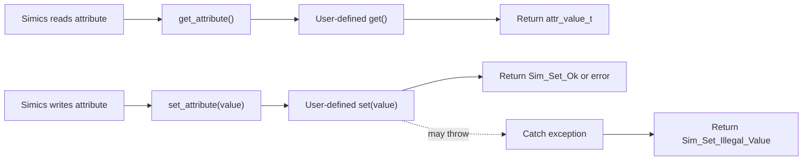
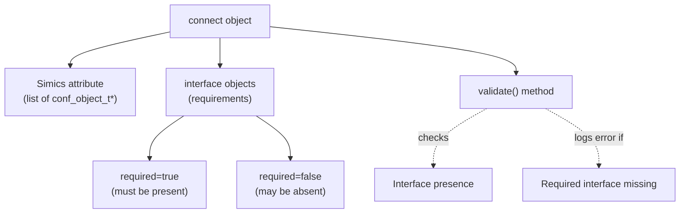
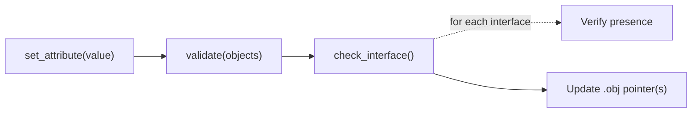
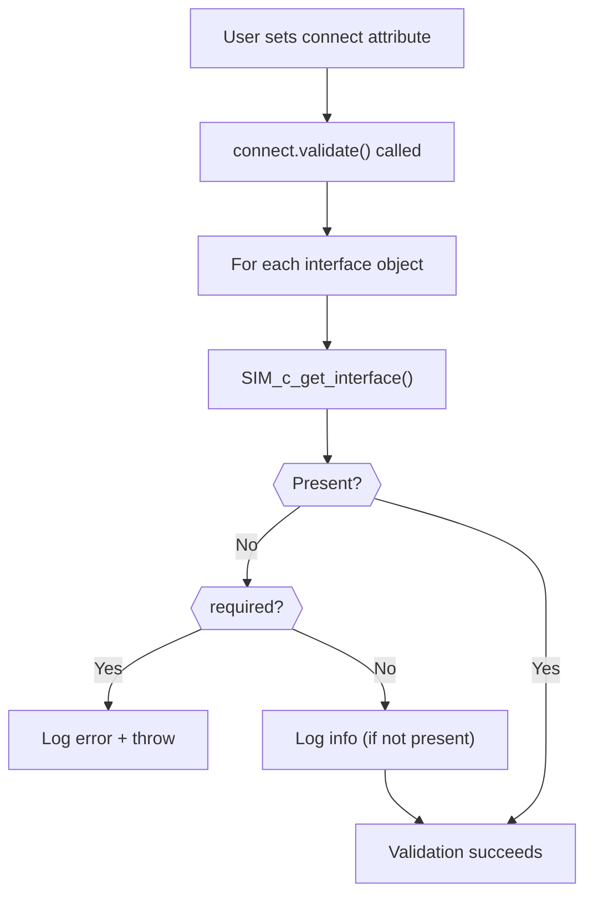
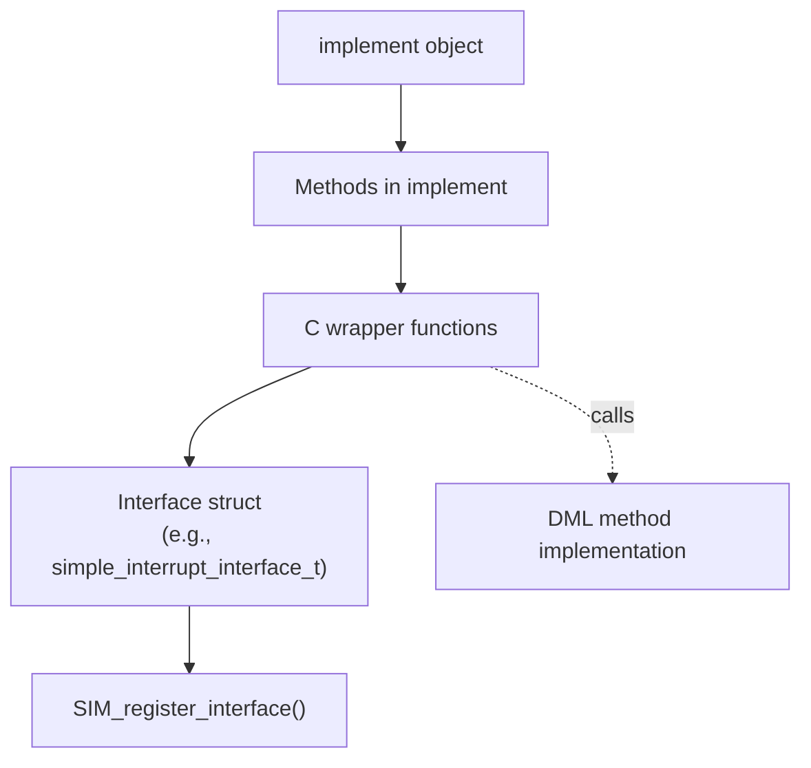
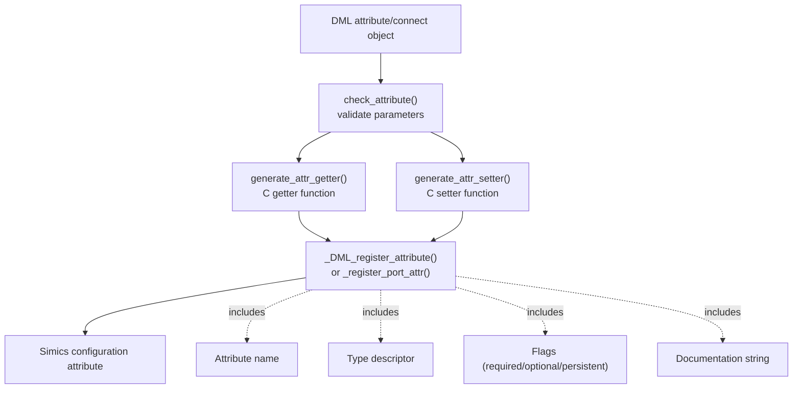
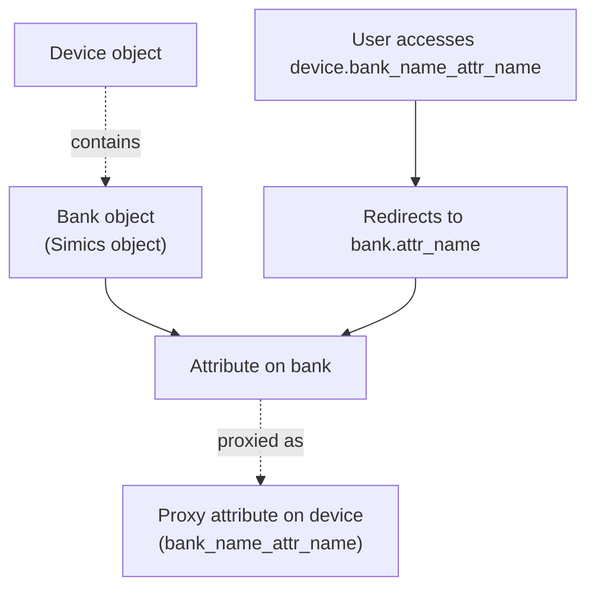

# Attributes and Connections

<details>
<summary>Relevant source files</summary>

The following files were used as context for generating this wiki page:

- [include/simics/dmllib.h](include/simics/dmllib.h)
- [lib/1.2/dml-builtins.dml](lib/1.2/dml-builtins.dml)
- [lib/1.4/dml-builtins.dml](lib/1.4/dml-builtins.dml)
- [py/dml/c_backend.py](py/dml/c_backend.py)
- [py/dml/codegen.py](py/dml/codegen.py)
- [py/dml/ctree.py](py/dml/ctree.py)

</details>


## Purpose and Scope

This page documents the standard library templates for exposing device state through Simics configuration attributes (`attribute` objects) and connecting devices to other Simics objects (`connect` objects). It also covers the related `interface` and `implement` templates for interface validation and export.

For memory-mapped I/O and bank access patterns, see [Memory-Mapped I/O](#4.5). For register and field attribute generation, see [Register and Field Behaviors](#4.4).

## Overview

The DML standard library provides four object types for device configuration and inter-device communication:

| Object Type | Purpose | Creates Simics Attribute |
|------------|---------|-------------------------|
| `attribute` | Expose arbitrary device state as configuration attributes | Yes |
| `connect` | Connect to other Simics objects and validate interfaces | Yes (list of connected objects) |
| `interface` | Declare required/optional interfaces on connected objects | No |
| `implement` | Export interfaces to other Simics objects | No |

All `attribute` and `connect` objects inherit from the `_conf_attribute` template, which provides common functionality for Simics attribute registration.

## Template Hierarchy



**Sources:** [lib/1.4/dml-builtins.dml:765-844](), [lib/1.4/dml-builtins.dml:944-968](), [lib/1.4/dml-builtins.dml:1469-1614](), [lib/1.4/dml-builtins.dml:1616-1696](), [lib/1.4/dml-builtins.dml:1698-1760]()

## Attribute Objects

The `attribute` template creates Simics configuration attributes that expose device state. Attributes can be read and written from the Simics command line or through scripts.

### Key Parameters

| Parameter | Type | Default | Description |
|-----------|------|---------|-------------|
| `type` | string | undefined | Simics attribute type descriptor (e.g., `"i"`, `"s"`, `"[i*]"`) |
| `configuration` | string | `"optional"` | One of: `"required"`, `"optional"`, `"pseudo"`, `"none"` |
| `persistent` | bool | `false` | Whether saved by `save-persistent-state` command |
| `internal` | bool | `true` if no docs | Whether excluded from documentation |
| `readable` | bool | `true` if config != "none" | Whether attribute can be read |
| `writable` | bool | `true` if config != "none" | Whether attribute can be written |
| `allocate_type` | string | undefined | DML 1.2 only: type for allocated storage |

### Abstract Methods

```dml
// User implements these methods
method get() -> (attr_value_t);
method set(attr_value_t value) throws;
```

The `get()` and `set()` methods define how the attribute value is retrieved and stored. The DML compiler wraps these in `get_attribute()` and `set_attribute()` methods that handle exceptions and type conversions for the Simics API.

### Attribute Lifecycle



**Sources:** [lib/1.4/dml-builtins.dml:944-968](), [lib/1.4/dml-builtins.dml:765-844]()

### Example Attribute Definition

```dml
// DML 1.4
attribute my_counter {
    param type = "i";
    param documentation = "Counts events";
    
    saved uint64 counter_value = 0;
    
    method get() -> (attr_value_t) {
        return SIM_make_attr_uint64(this.counter_value);
    }
    
    method set(attr_value_t val) throws {
        this.counter_value = SIM_attr_integer(val);
    }
}
```

### Configuration Types

The `configuration` parameter controls attribute behavior:

- **`"required"`**: Must be initialized when object is created; saved in checkpoints
- **`"optional"`**: May be left uninitialized; saved in checkpoints
- **`"pseudo"`**: Not saved in checkpoints; may be used for runtime-only state
- **`"none"`**: Suppresses attribute creation (no Simics attribute generated)

**Sources:** [lib/1.4/dml-builtins.dml:769-774](), [lib/1.4/dml-builtins.dml:888-903]()

## Connect Objects

The `connect` template creates connections to other Simics objects. Connect objects appear as list-valued attributes containing the connected object(s).

### Key Features



**Sources:** [lib/1.4/dml-builtins.dml:1469-1614](), [lib/1.4/dml-builtins.dml:1616-1696]()

### Connect Parameters

| Parameter | Type | Default | Description |
|-----------|------|---------|-------------|
| `configuration` | string | `"optional"` | Whether connection is required |
| `_attr_type` | string | `"[o*]"` | Simics type (list of objects) |
| `_attr_allow_cutoff` | bool | `true` if optional | Whether partial array setting allowed |

### Interface Validation

Connect objects can contain `interface` sub-objects that specify required or optional interfaces:

```dml
// DML 1.4
connect target {
    param documentation = "Target device for DMA";
    
    interface memory_space {
        param required = true;
    }
    
    interface transaction {
        param required = false;
    }
}
```

The `validate()` method (called during `set_attribute()`) checks that connected objects provide required interfaces.

### Connect Object Methods



**Sources:** [lib/1.4/dml-builtins.dml:1531-1595](), [lib/1.4/dml-builtins.dml:1656-1674]()

### Accessing Connected Objects

Connect objects provide an `.obj` member (or `.obj[]` for arrays) pointing to the connected Simics object:

```dml
connect target;

method do_dma() {
    if (this.target.obj != NULL) {
        // Access memory_space interface
        local memory_space_interface_t *iface = 
            SIM_c_get_interface(this.target.obj, "memory_space");
        // Use iface...
    }
}
```

**Sources:** [lib/1.4/dml-builtins.dml:1478-1484]()

## Interface Objects

Interface objects declare interface requirements within `connect` objects. They do not create Simics attributes themselves.

### Interface Parameters

| Parameter | Type | Default | Description |
|-----------|------|---------|-------------|
| `required` | bool | `false` | Whether interface must be present |

### Validation Process



**Sources:** [lib/1.4/dml-builtins.dml:1656-1674]()

## Implement Objects

Implement objects declare that the device exports a Simics interface. Methods defined within an `implement` object become the interface's method implementations.

### Implement Structure

```dml
// DML 1.4
implement simple_interrupt {
    method signal_interrupt() {
        log info: "Interrupt signaled";
        // Interrupt handling logic...
    }
    
    method lower_interrupt() {
        log info: "Interrupt lowered";
        // Clearing logic...
    }
}
```

### Code Generation for Implement Objects



The compiler generates:
1. C wrapper functions matching the interface signature
2. An interface struct instance with function pointers
3. Interface registration code in the device class initialization

**Sources:** [lib/1.4/dml-builtins.dml:1698-1760](), [py/dml/c_backend.py:766-829]()

## Attribute Registration and Code Generation

### Registration Flow



**Sources:** [py/dml/c_backend.py:388-505](), [py/dml/c_backend.py:508-522](), [py/dml/c_backend.py:636-677]()

### Generated Getter Function

For each attribute/connect, the compiler generates a C getter function:

```c
// Generated for: attribute my_counter
attr_value_t get_my_counter(conf_object_t *_obj, lang_void *_aux) {
    device_t *_dev = (device_t *)_obj;
    attr_value_t _val0;
    
    // Call user's get() method
    _val0 = /* result of DML get() */;
    
    // State change notification
    if (unlikely(_dev->_has_state_callbacks)) {
        device_notify_state_change(_dev);
    }
    
    return _val0;
}
```

**Sources:** [py/dml/c_backend.py:452-505]()

### Generated Setter Function

For each writable attribute/connect, the compiler generates a C setter function:

```c
// Generated for: attribute my_counter
set_error_t set_my_counter(conf_object_t *_obj, attr_value_t *_val, 
                          lang_void *_aux) {
    device_t *_dev = (device_t *)_obj;
    set_error_t _status = Sim_Set_Illegal_Value;
    
    // Call user's set_attribute() method (wraps set())
    // ... exception handling ...
    
    // State change notification
    if (unlikely(_dev->_has_state_callbacks)) {
        device_notify_state_change(_dev);
    }
    
    return _status;
}
```

**Sources:** [py/dml/c_backend.py:388-450]()

### Attribute Name Generation

Attributes on banks and ports receive prefixed names:

| Context | Attribute Name |
|---------|---------------|
| Device attribute | `attribute_name` |
| Bank attribute | `bank_name_attribute_name` |
| Port attribute | `port_name_attribute_name` |

For arrays, indices are not included in the attribute name; the entire array is registered as a single list-valued attribute.

**Sources:** [py/dml/structure.py referenced in c_backend.py:19](), [py/dml/c_backend.py:381-387]()

## Port Proxy Attributes (DML 1.2)

In DML 1.2, banks and ports may have "proxy attributes" registered both on the port object and as accessor attributes on the main device object.



This behavior is controlled by the `need_port_proxy_attrs()` function and is disabled when the `modern_attributes` breaking change is enabled.

**Sources:** [py/dml/c_backend.py:520-521](), [py/dml/c_backend.py:589-620](), [py/dml/structure.py referenced in c_backend.py:19]()

## DML 1.2 vs DML 1.4 Differences

### DML 1.2 Attributes

In DML 1.2, attributes have different method names and lifecycle:

```dml
// DML 1.2
attribute my_attr {
    parameter type = "i";
    parameter allocate_type = "uint64";
    
    method get -> (attr_value_t value) default {
        value = SIM_make_attr_uint64($this);
    }
    
    method set(attr_value_t value) default {
        $this = SIM_attr_integer(value);
    }
    
    method before_set default { }
    method after_set default { }
}
```

Key differences:
- Uses `$this` for storage reference instead of `this`
- Has `before_set()` and `after_set()` lifecycle hooks
- `allocate_type` parameter for automatic storage allocation
- Methods named `get` and `set` (vs. user implements, framework calls `get_attribute`/`set_attribute`)

**Sources:** [lib/1.2/dml-builtins.dml:360-427](), [lib/1.2/dml-builtins.dml:324-355]()

### DML 1.4 Improvements

DML 1.4 simplifies the attribute system:
- No `allocate_type` (use explicit `saved` variables)
- Cleaner separation between user methods (`get`/`set`) and framework wrappers (`get_attribute`/`set_attribute`)
- Methods are `shared` methods, allowing call from different object contexts
- Better typing and parameter system

**Sources:** [lib/1.4/dml-builtins.dml:944-968]()

## Runtime Support

The generated attribute code relies on runtime functions in `dmllib.h`:

| Function | Purpose |
|----------|---------|
| `SIM_make_attr_uint64()` | Create integer attribute value |
| `SIM_make_attr_string()` | Create string attribute value |
| `SIM_make_attr_list()` | Create list attribute value |
| `SIM_attr_integer()` | Extract integer from attribute value |
| `SIM_attr_string()` | Extract string from attribute value |
| `SIM_attribute_error()` | Signal attribute operation error |

For connect objects specifically:
- `SIM_c_get_interface()` - Check interface presence
- Interface validation occurs during `set_attribute()`

**Sources:** [include/simics/dmllib.h:1-30](), [lib/1.4/dml-builtins.dml:1656-1674]()

## Best Practices

1. **Documentation**: Always provide `documentation` or `desc` for non-internal attributes
2. **Configuration Type**: Use `"required"` for attributes that must be set at device creation
3. **Persistent State**: Set `persistent = true` for state that should survive simulation restarts
4. **Interface Requirements**: Mark interfaces as `required = true` only when absolutely necessary
5. **Type Safety**: In DML 1.4, prefer explicit `saved` variables over DML 1.2's `allocate_type`
6. **Exception Handling**: Use `throws` in `set()` methods to reject invalid values

**Sources:** [lib/1.4/dml-builtins.dml:848-942](), [py/dml/c_backend.py:509-521]()