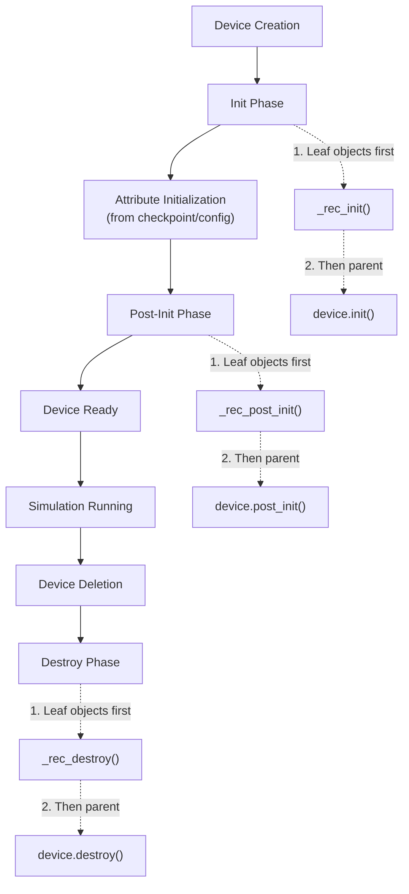
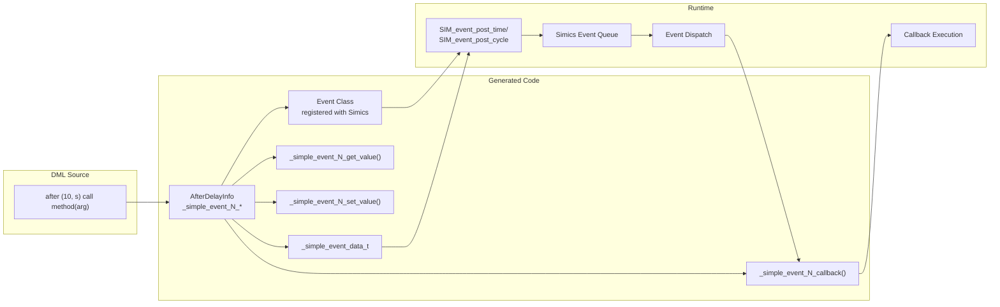
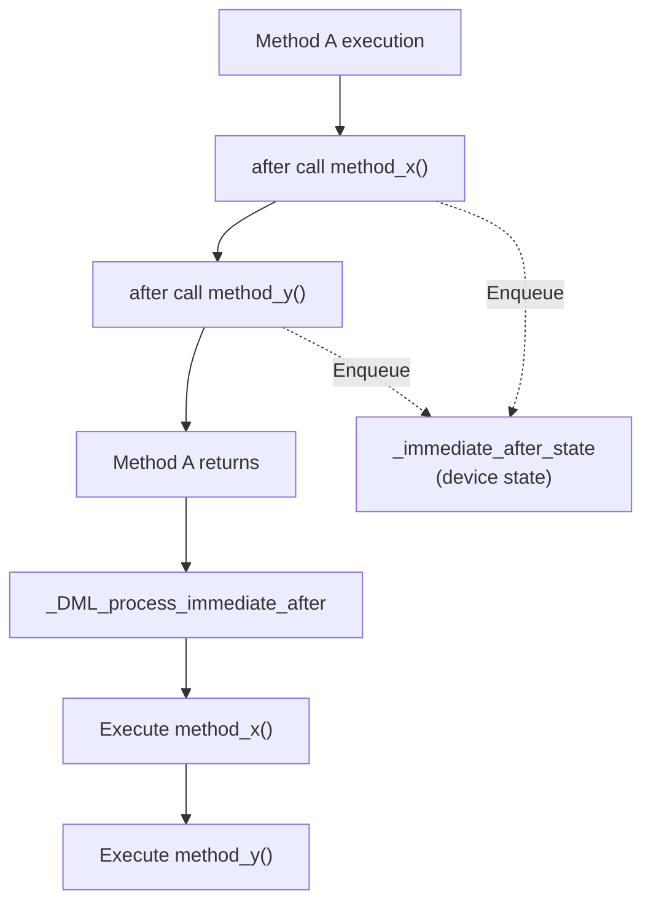
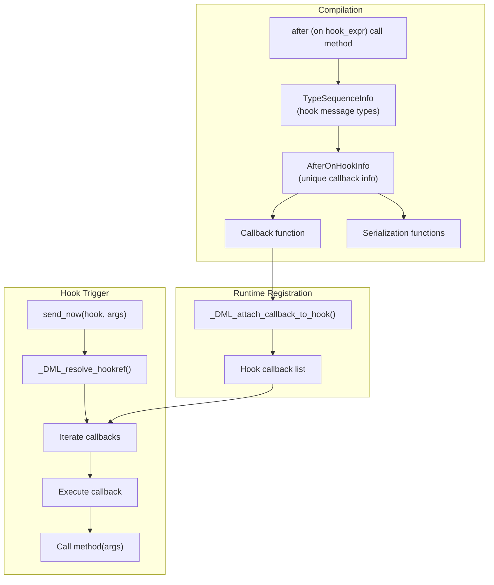

# Events and Lifecycle

<details>
<summary>Relevant source files</summary>

The following files were used as context for generating this wiki page:

- [include/simics/dmllib.h](include/simics/dmllib.h)
- [lib/1.2/dml-builtins.dml](lib/1.2/dml-builtins.dml)
- [lib/1.4/dml-builtins.dml](lib/1.4/dml-builtins.dml)
- [py/dml/c_backend.py](py/dml/c_backend.py)
- [py/dml/codegen.py](py/dml/codegen.py)
- [py/dml/ctree.py](py/dml/ctree.py)

</details>


## Purpose and Scope

This page documents the DML event system and object lifecycle mechanisms in the standard library. It covers:
- Object lifecycle templates (`init`, `post_init`, `destroy`) that define creation and destruction hooks
- Event objects and the `after` statement for delayed execution
- Timing mechanisms including cycle/time-based delays and immediate execution

For information about hook-based callbacks and the `after`-on-hook feature, see [Event and Hook System](#6.2). For serialization of event data during checkpointing, see [Serialization and Checkpointing](#6.1).

---

## Object Lifecycle

### Lifecycle Templates

DML provides three standard templates that define object lifecycle hooks, automatically invoked at specific points in a device's lifetime:

| Template | Invocation Time | Purpose |
|----------|----------------|---------|
| `init` | Device creation, before attribute initialization | Initialize default values and allocate resources |
| `post_init` | Device creation, after attribute initialization | Establish connections and configure based on attributes |
| `destroy` | Device deletion | Clean up dynamically allocated resources |

**Key Characteristics:**
- All three templates provide an abstract method of the same name
- Methods are automatically called on all objects that instantiate the template
- Execution order is depth-first: child objects execute before their parents
- The `device` object executes last in init/post_init, first in destroy

Sources: [lib/1.4/dml-builtins.dml:373-477]()

### Lifecycle Execution Flow



Sources: [lib/1.4/dml-builtins.dml:387-477](), [lib/1.4/dml-builtins.dml:626-722]()

### Template Implementation Details

Each lifecycle template follows a recursive pattern to ensure proper ordering:

**Init Template Structure:**
```
template init {
    param _each_init : sequence(init);
    shared method _rec_init() {
        foreach obj in (this._each_init)
            obj._rec_init();
        this.init();
    }
    shared method init();
    param _each_init = each init in (this);
}
```

- `_each_init` parameter collects all child objects implementing `init`
- `_rec_init()` recursively calls children before calling local `init()`
- Device template calls `_rec_init()` from its `_init()` wrapper method

**Restrictions:**
- The `destroy` template cannot be instantiated on `event` objects due to naming conflicts with event-specific `destroy()` methods (workaround: use a `group` within the event)
- `destroy()` must not interact with other Simics objects or post/cancel time-based events (automatic cancellation happens before `destroy()` is called)
- `destroy()` is not called on normal Simics exit; only on explicit device deletion

Sources: [lib/1.4/dml-builtins.dml:387-477]()

---

## Event System Overview

### Event Types and Mechanisms

DML provides three distinct event mechanisms for deferred execution:

| Mechanism | Trigger | Use Case | Checkpointable |
|-----------|---------|----------|----------------|
| `after` (delay) | Time/cycle elapsed | Model hardware timing | Yes |
| `after` (on hook) | Hook triggered | React to state changes | Yes |
| `after` (immediate) | Same simulation step | Deferred side effects | No |

```mermaid
graph TB
    subgraph "After Delay"
        AfterStmt["after (delay) call method"]
        PostEvent["SIM_event_post_time/<br/>SIM_event_post_cycle"]
        EventQueue["Simics Event Queue"]
        EventCallback["Event Callback"]
        MethodExec["Method Execution"]
        
        AfterStmt --> PostEvent
        PostEvent --> EventQueue
        EventQueue --> EventCallback
        EventCallback --> MethodExec
    end
    
    subgraph "After on Hook"
        AfterOnHook["after (on hook) call method"]
        AttachCallback["_DML_attach_callback_to_hook"]
        HookList["Hook Callback List"]
        HookTrigger["send_now triggers hook"]
        HookExec["Callback Execution"]
        
        AfterOnHook --> AttachCallback
        AttachCallback --> HookList
        HookTrigger --> HookList
        HookList --> HookExec
    end
    
    subgraph "Immediate After"
        ImmediateStmt["after call method"]
        ImmediateQueue["Immediate Callback Queue"]
        EndOfMethod["End of current method"]
        ImmediateExec["Immediate Execution"]
        
        ImmediateStmt --> ImmediateQueue
        EndOfMethod --> ImmediateQueue
        ImmediateQueue --> ImmediateExec
    end
```



Sources: [py/dml/ctree.py:697-817](), [py/dml/codegen.py:461-903]()

---

## Delayed Events (after with time/cycle)

### Compilation of After Statements

When the compiler encounters an `after` statement with a time or cycle delay, it generates infrastructure to schedule execution through the Simics event system:

**Generated Artifacts:**
1. **Event class** registered with Simics for the specific callback signature
2. **Callback function** (`_simple_event_N_callback`) that executes the method
3. **Get/set value functions** for checkpoint serialization (if needed)
4. **Event data structure** containing indices, arguments, and domain information



Sources: [py/dml/codegen.py:504-658](), [py/dml/ctree.py:697-756]()

### Event Data Structure

The `_simple_event_data_t` structure stores all information needed to execute a delayed callback:

```
typedef struct {
    uint32      *indices;       // Method array indices
    void        *args;          // Method arguments
    _identity_t *domains;       // Associated objects for cancellation
    uint64      no_domains;     // Number of domains
} _simple_event_data_t;
```

**Purpose of each field:**
- `indices`: Array indices if the method belongs to an array object
- `args`: Serialized method arguments (struct containing all input parameters)
- `domains`: List of object identities that can trigger event cancellation via `cancel_after()`
- `no_domains`: Count of domain entries

The structure supports event cancellation through `object.cancel_after()`, which cancels all pending events where the object appears in the domains list.

Sources: [include/simics/dmllib.h:859-885](), [py/dml/ctree.py:697-756]()

### Generated Callback Structure

For each unique `after` statement signature, the compiler generates:

**AfterDelayIntoMethodInfo** (method target):
```
_simple_event_<N>_callback(conf_object_t *obj, lang_void *data)
    - Extracts indices from data->indices
    - Extracts arguments from data->args
    - Calls target method with extracted parameters
```

**AfterDelayIntoSendNowInfo** (hook target):
```
_simple_event_<N>_callback(conf_object_t *obj, lang_void *data)
    - Extracts hookref from data->args
    - Extracts hook message arguments
    - Calls _DML_send_hook() with resolved hook and arguments
```

Sources: [py/dml/codegen.py:595-658]()

---

## Event Object Cancellation

### The cancel_after() Method

All objects inheriting from the `object` template have access to `cancel_after()`, which cancels pending events associated with that object:

```
shared method cancel_after() {
    local object ref = this;
    _cancel_simple_events(dev.obj, cast(&ref, _traitref_t *)->id);
}
```

**Cancellation Mechanism:**
1. Converts object reference to identity (`_identity_t`)
2. Calls `_cancel_simple_events()` which searches event queue
3. Matches events where the object identity appears in the `domains` list
4. Removes matching events from the Simics event queue

**When events are associated with objects (domains):**
- Automatically: The object in which the `after` statement appears
- Explicitly: Using `after` statement's optional domain specification
- The domains list allows multiple objects to be associated with a single event

Sources: [lib/1.4/dml-builtins.dml:574-577](), [include/simics/dmllib.h:866-885]()

---

## Event Checkpointing

### Serialization Format

Events are checkpointed using a pseudo-dictionary format to support backward compatibility:

**Modern Format (pseudo-dictionary):**
```
[["indices", [index0, index1, ...]],
 ["arguments", [arg0, arg1, ...]],
 ["domains", [domain0, domain1, ...]]]
```

**Legacy Format (pre-2022):**
```
[[index0, index1, ...], [arg0, arg1, ...]]
```

The runtime automatically detects the format during deserialization by inspecting the first element.

### Serialization Functions

For each unique event signature, the compiler generates:

**Get Value (Serialization):**
```
_simple_event_<N>_get_value(conf_object_t *obj, lang_void *data)
    - Serializes indices to attr_value_t list
    - Calls args_serializer for arguments
    - Serializes domains to attr_value_t list
    - Returns pseudo-dictionary attr_value_t
```

**Set Value (Deserialization):**
```
_simple_event_<N>_set_value(conf_object_t *obj, attr_value_t val)
    - Detects format (pseudodict vs legacy)
    - Deserializes indices
    - Calls args_deserializer for arguments
    - Deserializes domains
    - Reconstructs _simple_event_data_t
    - Re-posts event to Simics queue
```

Sources: [include/simics/dmllib.h:908-1119](), [py/dml/codegen.py:504-530]()

---

## Immediate After Execution

### Immediate Execution Mechanism

The `after call method()` syntax (without a delay) schedules execution for later in the same simulation step, after the current method completes:

**Use Cases:**
- Defer side effects until after register access completes
- Break circular dependencies in method calls
- Ensure consistent ordering of operations within a step

**Characteristics:**
- Not checkpointed (execution happens before checkpoint can occur)
- Executes in FIFO order within the same simulation step
- Cannot be cancelled via `cancel_after()`



Sources: [py/dml/ctree.py:792-817](), [py/dml/codegen.py:857-903]()

### Generated Code Structure

**ImmediateAfterIntoMethodInfo:**
- Generates callback function: `_immediate_after_<N>_callback()`
- Stores callback info in device state: `_immediate_after_state`
- Posted via: `_DML_post_immediate_after()`
- Executed by: Internal DML runtime at end of current operation

**Storage:**
The device structure contains:
```
_dml_immediate_after_state_t *_immediate_after_state;
```

This queue manages all pending immediate callbacks and processes them before returning control to Simics.

Sources: [py/dml/c_backend.py:144-145](), [py/dml/codegen.py:857-903]()

---

## After-on-Hook Events

### Hook-Based Callback Registration

The `after (on hook) call method()` syntax registers a callback to execute when a hook is triggered:

**Compilation Strategy:**
1. **AfterOnHookInfo** created for unique signature (method + hook type)
2. Callback registration: `_DML_attach_callback_to_hook()`
3. Serialization functions generated for checkpointing
4. Hook resolution at runtime via `_DML_resolve_hookref()`



Sources: [py/dml/codegen.py:531-855](), [py/dml/ctree.py:764-790]()

### Parameter Mapping

Hook callbacks support parameter mapping from hook message to method arguments:

**Scenarios:**
1. **Direct mapping**: Hook message fields match method parameters exactly
2. **Partial mapping**: Some parameters from hook, others stored with callback
3. **No mapping**: All parameters stored with callback at registration time

**Example:**
```dml
hook(int, string) h;
method callback(int x, string s, bool flag);

// Map first two params from hook, store 'flag' with callback
after (on h) call callback($0, $1, true);
```

The `param_to_msg_comp` dictionary tracks which parameters come from the hook message versus stored callback data, enabling efficient serialization.

Sources: [py/dml/codegen.py:669-855]()

---

## Event Domains and Cancellation Scope

### Domain Association

Events can be associated with multiple objects (domains) for cancellation purposes:

**Automatic domain**: The object containing the `after` statement
**Explicit domains**: Additional objects specified in the after statement (DML 1.4 feature)

**Cancellation behavior:**
- `object.cancel_after()` cancels events where `object` appears in domains list
- Events can have multiple domains, cancelled if ANY domain matches
- Useful for associating events with both hardware components and controllers

**Event predicate function:**
```c
int _simple_event_predicate(lang_void *_data, lang_void *match_data) {
    _simple_event_data_t *data = (_simple_event_data_t *)_data;
    _identity_t *domains = data->domains;
    uint64 no_domains = data->no_domains;
    
    _identity_t match_id = *(_identity_t *)match_data;
    for (uint64 i = 0; i < no_domains; ++i) {
        if (_identity_eq(match_id, domains[i]))
            return 1;  // Match found
    }
    return 0;
}
```

Sources: [include/simics/dmllib.h:866-885](), [py/dml/ctree.py:699-756]()

---

## Compilation Artifacts Summary

### Per-Event Artifacts

For each unique event signature, the compiler generates:

| Artifact Type | Naming Pattern | Purpose |
|--------------|----------------|---------|
| Info structure | `AfterDelayInfo` / `AfterOnHookInfo` / `ImmediateAfterInfo` | Metadata about event |
| Callback function | `_simple_event_<N>_callback` / `_after_on_hook_<N>_callback` / `_immediate_after_<N>_callback` | Execute deferred method |
| Serializer | `_simple_event_<N>_get_value` / `_after_on_hook_<N>_args_serializer` | Checkpoint support |
| Deserializer | `_simple_event_<N>_set_value` / `_after_on_hook_<N>_args_deserializer` | Restore from checkpoint |
| Args struct | `_simple_event_<N>_args` / `_after_on_hook_<N>_args` | Store method arguments |

### Global State

Device structure includes:
```
_dml_immediate_after_state_t *_immediate_after_state;  // Immediate callback queue
```

Static arrays maintain event class registrations and hook callback information for runtime dispatch.

Sources: [py/dml/codegen.py:421-903](), [py/dml/c_backend.py:144-145]()

---

## DML Version Differences

### DML 1.2 Lifecycle

In DML 1.2, lifecycle management is simpler but less flexible:

- Device template provides `init()`, `post_init()`, `destroy()` methods with default empty implementations
- Explicit iteration over banks in default implementations
- No automatic recursive invocation across all object types
- Try-catch wrapper around `destroy()` to prevent uncaught exceptions

### DML 1.4 Enhancements

DML 1.4 introduces systematic lifecycle management:

- Template-based lifecycle hooks (`init`, `post_init`, `destroy` templates)
- Automatic recursive invocation via `_rec_init()`, `_rec_post_init()`, `_rec_destroy()`
- Consistent execution ordering (depth-first, children before parents)
- `_each_init`, `_each_post_init`, `_each_destroy` parameters collect child objects
- Event domains for fine-grained cancellation control
- Improved serialization format with backward compatibility

Sources: [lib/1.2/dml-builtins.dml:285-308](), [lib/1.4/dml-builtins.dml:373-722]()