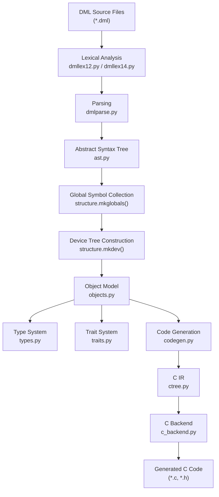
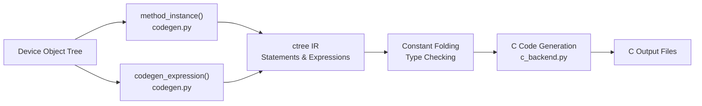
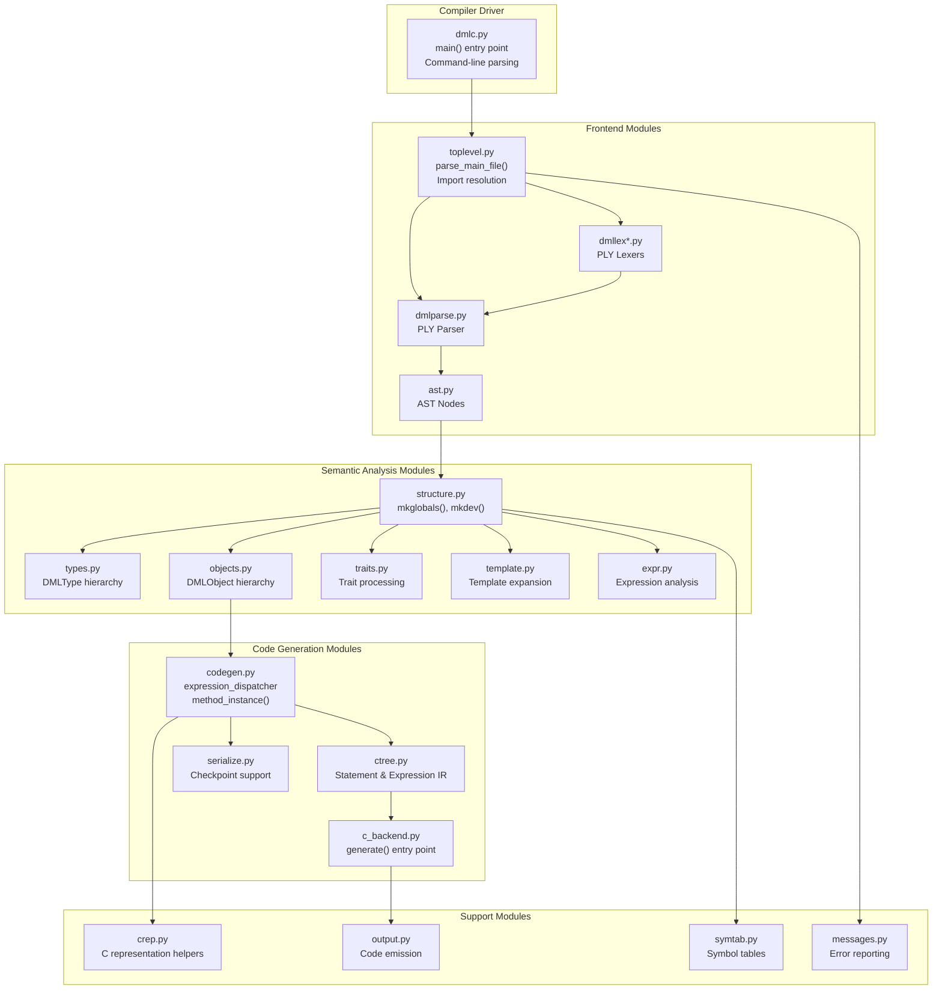
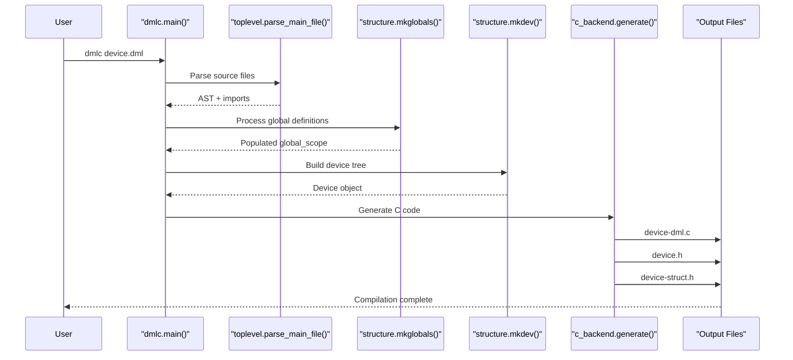

# Compiler Architecture

<details>
<summary>Relevant source files</summary>

The following files were used as context for generating this wiki page:

- [deprecations_to_md.py](deprecations_to_md.py)
- [include/simics/dmllib.h](include/simics/dmllib.h)
- [py/dml/breaking_changes.py](py/dml/breaking_changes.py)
- [py/dml/c_backend.py](py/dml/c_backend.py)
- [py/dml/codegen.py](py/dml/codegen.py)
- [py/dml/crep.py](py/dml/crep.py)
- [py/dml/ctree.py](py/dml/ctree.py)
- [py/dml/dmlc.py](py/dml/dmlc.py)
- [py/dml/globals.py](py/dml/globals.py)
- [py/dml/structure.py](py/dml/structure.py)
- [py/dml/template.py](py/dml/template.py)
- [py/dml/toplevel.py](py/dml/toplevel.py)
- [py/dml/traits.py](py/dml/traits.py)
- [py/dml/types.py](py/dml/types.py)

</details>


## Purpose and Scope

This page provides a high-level overview of the DML compiler's internal architecture, describing the major compilation phases and how they connect to transform DML source code into executable C code. For detailed information about specific phases, see the subsections: [Compilation Pipeline](#5.1), [Frontend](#5.2), [Semantic Analysis](#5.3), [Intermediate Representation](#5.4), [C Code Generation](#5.5), and [Runtime Support](#5.6).

## Overview

The DML compiler (`dmlc`) is a multi-stage compiler written in Python that translates Device Modeling Language (DML) source files into C code suitable for compilation into Simics device modules. The compiler implements a traditional three-phase architecture: frontend (lexing and parsing), middle-end (semantic analysis and type checking), and backend (code generation).

The compilation process transforms DML source through several intermediate representations:
- **Text** → **AST** (Abstract Syntax Tree)
- **AST** → **Device Object Tree** (semantic structure)
- **Device Object Tree** → **ctree IR** (C-like intermediate representation)
- **ctree IR** → **C source code**

## Compilation Phases



**Compilation Flow Diagram**

This diagram shows the major transformation stages in the DML compiler. Each arrow represents a transformation from one representation to another, with the primary Python module responsible listed at each stage.

Sources: [py/dml/dmlc.py:72-96](), [Diagram 1 from context]()

### Phase 1: Frontend (Parsing and Lexing)

The frontend is responsible for reading DML source files and converting them into an abstract syntax tree (AST).

**Key Modules:**
- `dmlc.py` - Entry point and command-line interface
- `toplevel.py` - File parsing, import resolution, and version detection
- `dmllex12.py`, `dmllex14.py` - Version-specific lexers using PLY (Python Lex-Yacc)
- `dmlparse.py` - Unified parser with version-specific grammar rules
- `ast.py` - AST node definitions

The frontend handles both DML 1.2 and DML 1.4 syntax through version-specific lexers and parser production rules decorated with `@prod_dml12` and `@prod_dml14`.

Sources: [py/dml/dmlc.py:1-500](), [py/dml/toplevel.py:1-350](), [Diagram 2 from context]()

### Phase 2: Semantic Analysis

The middle-end performs semantic analysis, type checking, and constructs the device object tree that represents the runtime structure of the device model.

**Key Modules:**
- `structure.py` - Primary orchestration (`mkglobals()`, `mkdev()`, `mkobj()`)
- `types.py` - Type system implementation (11 type classes)
- `objects.py` - Object model classes (Device, Bank, Register, Field, etc.)
- `traits.py` - Trait system for polymorphism
- `template.py` - Template instantiation and parameter resolution
- `expr.py` - Expression analysis and constant folding

**Critical Functions:**

| Function | Location | Purpose |
|----------|----------|---------|
| `mkglobals()` | structure.py:74 | Collect global constants, typedefs, templates |
| `mkdev()` | structure.py | Build device object tree |
| `mkobj()` | structure.py | Instantiate individual objects |
| `add_templates()` | structure.py:525 | Expand template instantiations |
| `merge_parameters()` | structure.py:604 | Resolve parameter overrides using Rank system |

The semantic analysis phase uses a `Rank` system to determine precedence when templates and object specifications conflict. Templates form a directed acyclic graph (DAG) through their inheritance relationships, and the compiler performs topological sorting to resolve declaration order.

Sources: [py/dml/structure.py:1-700](), [py/dml/types.py:1-400](), [py/dml/objects.py:1-300](), [Diagram 5 from context]()

### Phase 3: Code Generation

The backend transforms the semantic representation into C code through an intermediate representation (ctree).

**Key Modules:**
- `codegen.py` - Code generation orchestration and expression dispatching
- `ctree.py` - C-like IR with statement and expression classes
- `c_backend.py` - Final C code emission and Simics integration
- `serialize.py` - Checkpoint serialization code generation



**Code Generation Pipeline**

This shows how the device object tree is transformed into C code through the ctree intermediate representation.

The `ctree` module provides a C-like intermediate representation with:
- **Statement classes**: `Compound`, `If`, `While`, `For`, `Switch`, `Return`, etc.
- **Expression classes**: `BinOp`, `UnaryOp`, `Cast`, `Apply`, `Lit`, etc.
- **Factory functions**: `mkIf()`, `mkWhile()`, `mkCompound()`, etc. that perform optimizations
- **Built-in optimizations**: Constant folding, dead code elimination

The `codegen.py` module provides an expression dispatcher that routes DML expressions to appropriate ctree constructors, handling context-specific concerns like failure handling and loop boundaries.

Sources: [py/dml/codegen.py:1-600](), [py/dml/ctree.py:1-1200](), [py/dml/c_backend.py:1-800](), [Diagram 6 from context]()

## Main Compiler Modules



**Module Dependency Graph**

This diagram shows the major Python modules in the DML compiler and their dependencies. Modules are organized by compilation phase.

Sources: [py/dml/dmlc.py:1-100](), [py/dml/toplevel.py:1-100](), [py/dml/structure.py:1-100](), [py/dml/codegen.py:1-100](), [py/dml/ctree.py:1-100](), [py/dml/c_backend.py:1-100]()

## Key Data Structures

### Abstract Syntax Tree (AST)

The AST is defined in `ast.py` and represents the syntactic structure of DML source files. AST nodes are immutable tuples created by factory functions.

**Common AST Node Types:**
- `ast.template()` - Template declarations
- `ast.object()` - Object declarations (device, bank, register, etc.)
- `ast.method()` - Method definitions
- `ast.param()` - Parameter declarations
- `ast.session()`, `ast.saved()` - Variable declarations
- `ast.hashif()` - Conditional compilation blocks

Sources: [py/dml/ast.py:1-300]()

### Device Object Tree

The device object tree is constructed by `structure.mkdev()` and represents the runtime organization of the device model.

**Object Hierarchy:**
```
Device (root)
├── Bank / Port / Subdevice (arrays)
│   ├── Register (arrays)
│   │   └── Field (arrays)
│   ├── Connect
│   ├── Attribute
│   └── Interface (implement)
├── Group (organizational)
├── Event
└── Method / Parameter / Session / Saved (per object)
```

**Object Classes** (from `objects.py`):
- `Device` - Root device object
- `CompositeObject` - Base for objects containing sub-objects
- `Method` - Method implementation
- `Parameter` - Parameter definition
- `Session`, `Saved` - Variable storage

Sources: [py/dml/objects.py:1-400](), [Diagram 3 from context]()

### Type System

The type system in `types.py` defines 11 core type classes:

| Type Class | Purpose | Example |
|------------|---------|---------|
| `TInt` | Integer types | `int32`, `uint64` |
| `TBool` | Boolean type | `bool` |
| `TFloat` | Floating-point | `double` |
| `TPtr` | Pointer types | `uint8 *` |
| `TArray` | Array types | `int[10]` |
| `TStruct` | Structure types | `struct { int x; }` |
| `TTrait` | Trait references | `_traitref_t` |
| `TFunction` | Function types | `void(int, int)` |
| `THook` | Hook types | `hook(int)` |
| `TNamed` | Named types (typedefs) | User-defined |
| `TVoid` | Void type | `void` |

The function `realtype()` resolves `TNamed` types through the global `typedefs` dictionary to their underlying types.

Sources: [py/dml/types.py:1-600](), [Diagram 5 from context]()

## Control Flow Through Main Entry Points



**Main Compilation Sequence**

This sequence diagram shows the control flow through the main entry points of the compiler.

The main compilation sequence in `dmlc.py:main()`:

1. **Parse command-line arguments** - Handle `-I`, `-D`, `--simics-api`, etc.
2. **Parse main file** - `toplevel.parse_main_file()` reads and parses the top-level DML file
3. **Resolve imports** - Recursively parse imported files
4. **Process globals** - `structure.mkglobals()` evaluates constants, typedefs, templates
5. **Build device tree** - `structure.mkdev()` instantiates the device object
6. **Generate code** - `c_backend.generate()` emits C code
7. **Write output files** - Create `.c`, `.h`, and optional `.g` (debug) files

Sources: [py/dml/dmlc.py:308-600]()

## Error Handling and Reporting

The compiler uses an exception-based error handling system:

- **`DMLError`** - Base class for all compiler errors (in `messages.py`)
- **Site tracking** - Every AST node and IR node has a `site` attribute for error location
- **`report()`** - Global function to accumulate errors without immediately halting
- **Error classes** - Specific error types like `ESYNTAX`, `ETYPE`, `ENAMECOLL`, etc.

Errors are accumulated during compilation and reported at the end, allowing the compiler to report multiple errors in a single run.

Sources: [py/dml/messages.py:1-400](), [py/dml/logging.py:1-200]()

## Version Support

The compiler supports both DML 1.2 and DML 1.4 through:

- **Version-specific lexers** - `dmllex12.py` and `dmllex14.py`
- **Conditional grammar rules** - Decorated with `@prod_dml12` or `@prod_dml14`
- **Version detection** - `toplevel.determine_version()` reads the `dml X.Y;` statement
- **Breaking changes** - The `breaking_changes.py` module controls API compatibility

The global variable `dml.globals.dml_version` is set early and used throughout compilation to control version-specific behavior.

Sources: [py/dml/toplevel.py:66-112](), [py/dml/breaking_changes.py:1-300](), [Diagram 2 from context]()

## Output Files

The compiler generates several output files:

| File | Purpose |
|------|---------|
| `<device>-dml.c` | Main C implementation |
| `<device>.h` | Function declarations and type definitions |
| `<device>-struct.h` | Device structure definition |
| `<device>.g` | Debug information (with `-g` flag) |
| `<device>-info.xml` | Register layout (with `--info` flag) |

The device structure (`<device>-struct.h`) contains:
- Configuration object (`conf_object_t obj`)
- Static variables
- Nested structures for banks, ports, registers
- Session and saved variable storage
- Hook storage (`_dml_hook_t`)

Sources: [py/dml/c_backend.py:240-373](), [Diagram 1 from context]()

## Runtime Support

Generated C code links against the DML runtime library in `include/simics/dmllib.h`, which provides:

- **Identity system** - `_identity_t`, `_id_info_t` for object tracking
- **Trait dispatch** - `_traitref_t`, `_vtable_list_t` for polymorphism
- **Hook system** - `_dml_hook_t`, `_hookref_t` for event callbacks
- **Helper macros** - `VTABLE_PARAM()`, `CALL_TRAIT_METHOD()`, `UPCAST()`, `DOWNCAST()`
- **Safe arithmetic** - Division/modulo with zero checks, shift with range checks

See [Runtime Support](#5.6) for detailed documentation of the runtime library.

Sources: [include/simics/dmllib.h:1-700](), [Diagram 1 from context]()