# Compilation Pipeline

Relevant source files

The following files were used as context for generating this wiki page:

- [deprecations_to_md.py](deprecations_to_md.py)
- [include/simics/dmllib.h](include/simics/dmllib.h)
- [py/dml/breaking_changes.py](py/dml/breaking_changes.py)
- [py/dml/c_backend.py](py/dml/c_backend.py)
- [py/dml/codegen.py](py/dml/codegen.py)
- [py/dml/ctree.py](py/dml/ctree.py)
- [py/dml/dmlc.py](py/dml/dmlc.py)
- [py/dml/globals.py](py/dml/globals.py)
- [py/dml/toplevel.py](py/dml/toplevel.py)

This page provides an overview of the DML compiler's multi-stage compilation pipeline, describing how DML source code is transformed into executable C code. For detailed information about specific stages, see:
- Frontend implementation: [Frontend: Parsing and Lexing](#5.2)
- Middle-end analysis: [Semantic Analysis](#5.3)
- IR design: [Intermediate Representation (ctree)](#5.4)
- C code emission: [C Code Generation Backend](#5.5)
- Runtime library support: [Runtime Support (dmllib.h)](#5.6)

## Pipeline Overview

The DML compiler transforms device models written in DML into C code that integrates with the Simics simulator. The compilation process consists of five major stages:

1. **Input Processing**: Parse command-line arguments, locate and read DML source files
2. **Frontend**: Lexical analysis, parsing, and AST construction
3. **Semantic Analysis**: Type checking, template instantiation, and object tree construction
4. **IR Generation**: Translation to C-like intermediate representation
5. **Backend**: C code generation, serialization support, and output file production

The following diagram shows the complete pipeline with the primary code modules at each stage:

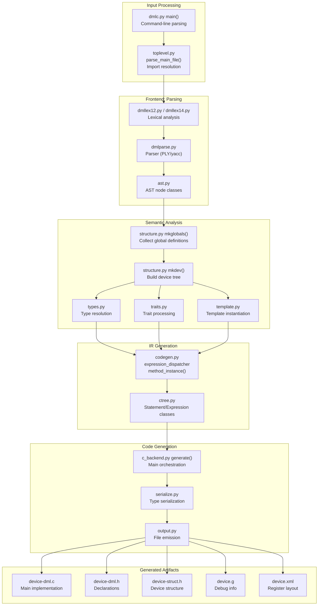

**Sources:** [py/dml/dmlc.py:1-600](), [py/dml/toplevel.py:1-460](), High-level architecture diagram from context

## Entry Point and Main Driver

The compilation process begins in `main()` within `dmlc.py`, which orchestrates the entire pipeline:

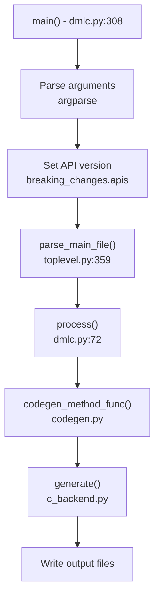

| Function | File | Purpose |
|----------|------|---------|
| `main()` | [py/dml/dmlc.py:308-580]() | Entry point, argument parsing, error handling |
| `parse_main_file()` | [py/dml/toplevel.py:359-459]() | File parsing and import resolution |
| `process()` | [py/dml/dmlc.py:72-96]() | Semantic analysis orchestration |
| `generate()` | [py/dml/c_backend.py:~900]() | C code generation orchestration |

**Sources:** [py/dml/dmlc.py:308-580](), [py/dml/toplevel.py:359-459]()

## Stage 1: Input Processing and Import Resolution

The first stage reads the main DML file, resolves all imports, and handles command-line parameters.

### Import Resolution Algorithm

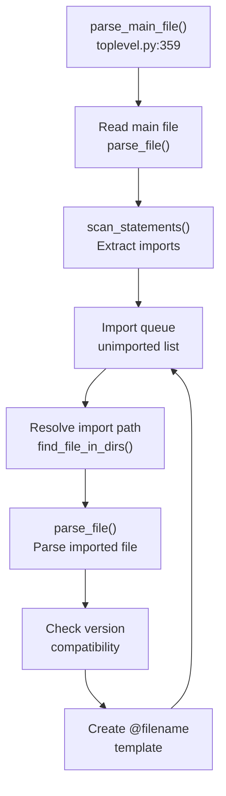

Key data structures during import resolution:

| Structure | Type | Purpose |
|-----------|------|---------|
| `unimported` | `list[(str, Site)]` | Queue of files to import with import sites |
| `imported` | `dict[str, list[str]]` | Normalized path → list of import spellings |
| `deps` | `dict[str, set[str]]` | File path → set of import spellings (for --dep) |
| `import_path` | `list[str]` | Directories to search for imports |

The import resolution process ([py/dml/toplevel.py:407-456]()):
1. Pop an import from `unimported` queue
2. Resolve relative or search-path-based imports
3. Normalize the absolute path
4. Skip if already imported (but create alias template)
5. Parse the file and add its imports to the queue
6. Create a template named `@filename.dml` containing the file's definitions

**Sources:** [py/dml/toplevel.py:359-459](), [py/dml/toplevel.py:129-186](), [py/dml/toplevel.py:327-350]()

## Stage 2: Frontend - Parsing and AST Construction

The frontend transforms raw text into an Abstract Syntax Tree (AST) using PLY-based lexer and parser implementations.

### Version-Specific Parsing

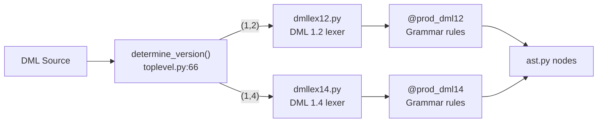

The parser supports both DML 1.2 and 1.4 through version-specific grammar rules marked with decorators:

| Decorator | Purpose | Example Grammar Rules |
|-----------|---------|----------------------|
| `@prod_dml12` | DML 1.2 only | `goto`, anonymous banks |
| `@prod_dml14` | DML 1.4 only | Trait syntax, `select` statements |
| (unmarked) | Both versions | Basic expressions, methods, parameters |

### Key AST Node Types

The `ast.py` module defines approximately 50 AST node types. Major categories include:

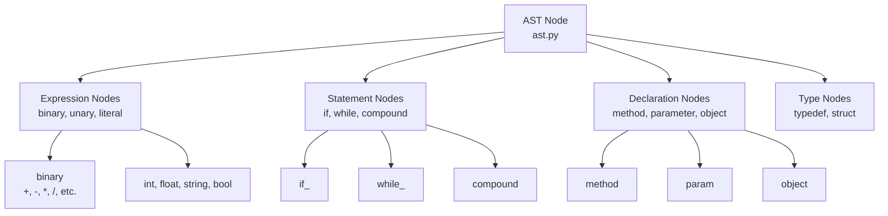

**Sources:** [py/dml/toplevel.py:114-127](), [py/dml/toplevel.py:66-112](), AST module references from context

## Stage 3: Semantic Analysis

Semantic analysis transforms the AST into a structured object tree, resolves types, instantiates templates, and performs type checking.

### Semantic Analysis Flow

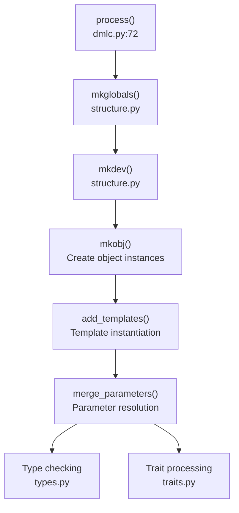

### Object Tree Construction

The `structure.py` module constructs the device object tree in three phases:

**Phase 1: `mkglobals()`** - Collect global definitions ([py/dml/structure.py:~1000-1200]()):
- Process `typedef`, `constant`, `extern`, `template` declarations
- Build `dml.globals.templates` dictionary
- Create global symbol table

**Phase 2: `mkdev()`** - Build device tree ([py/dml/structure.py:~1200-1400]()):
- Instantiate the device object
- Create hierarchy: device → bank/port → register → field
- Process object arrays and dimensions

**Phase 3: `mkobj()`** - Instantiate individual objects ([py/dml/structure.py:~800-1000]()):
- Apply templates via `add_templates()`
- Merge parameters via `merge_parameters()`
- Resolve object relationships

### Key Data Structures

| Structure | Type | Purpose |
|-----------|------|---------|
| `dml.globals.templates` | `dict[str, Template]` | Name → Template instance mapping |
| `dml.globals.device` | `Device` | Root of object tree |
| `typedefs` | `dict[str, DMLType]` | Type name → type definition mapping |
| `dml.globals.traits` | `dict[str, Trait]` | Trait name → trait definition mapping |

**Sources:** [py/dml/codegen.py:1-100](), Structure analysis from context diagrams

## Stage 4: IR Generation

The IR generation stage translates DML expressions and statements into the `ctree` intermediate representation, which closely resembles C but includes DML-specific constructs.

### Expression Translation

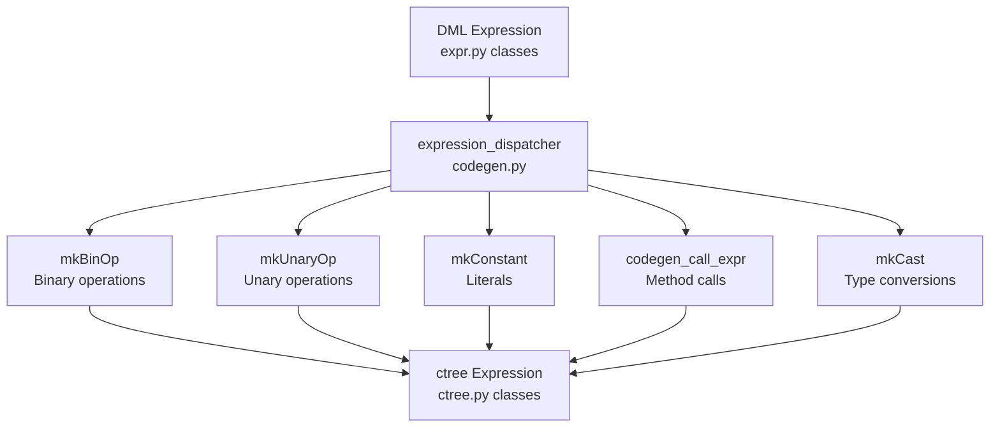

The `codegen.py` module provides the primary translation functions:

| Function | Purpose | Input | Output |
|----------|---------|-------|--------|
| `expression_dispatcher` | Route AST expression to IR | `ast.expression` | `ctree.Expression` |
| `method_instance()` | Generate method body | `Method` object | `ctree.Statement` |
| `codegen_call()` | Generate method call | Method + args | `ctree.Statement` |
| `eval_type()` | Evaluate type expression | `ast.type` | `DMLType` |

### Statement Translation

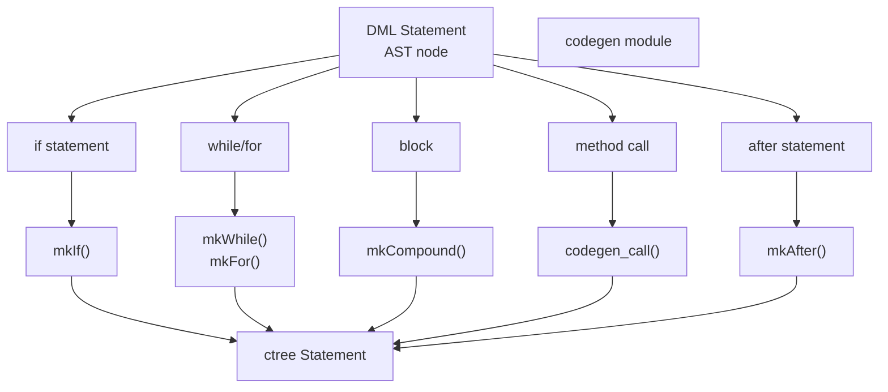

### Context Management

The IR generation process uses several context managers to track compilation state:

| Context | Purpose | Location |
|---------|---------|----------|
| `Failure` | Exception handling strategy | [py/dml/codegen.py:150-214]() |
| `ExitHandler` | Method return handling | [py/dml/codegen.py:216-268]() |
| `LoopContext` | Break/continue handling | [py/dml/codegen.py:96-149]() |
| `ErrorContext` | Error message enrichment | [py/dml/logging.py:~100-200]() |

**Sources:** [py/dml/codegen.py:1-700](), [py/dml/ctree.py:1-500](), IR generation sections from context

## Stage 5: Backend - C Code Generation

The backend traverses the `ctree` IR and emits C code, along with supporting files for debugging and register layout documentation.

### Generation Orchestration

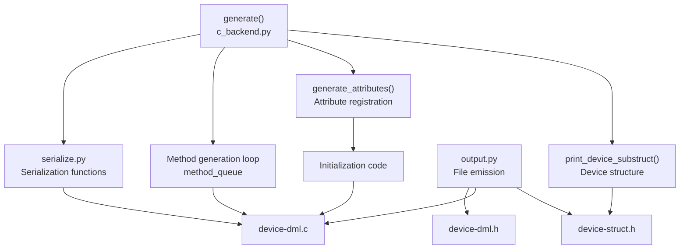

### Method Code Generation

The compiler maintains a work queue of methods requiring code generation:

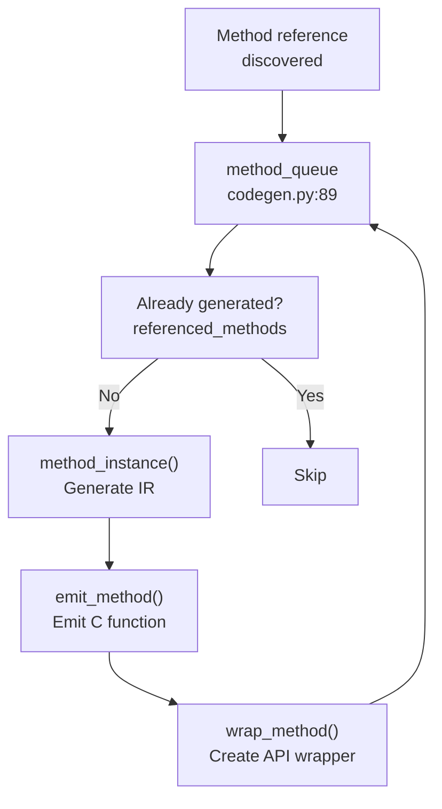

The method generation process ([py/dml/c_backend.py:713-800]()):
1. Pop method from `method_queue`
2. Check if already in `referenced_methods`
3. Call `method_instance()` to generate IR
4. Call `wrap_method()` for API methods
5. Emit function definition to C file
6. New method references discovered during generation are added to queue

### Output Files

| File | Generator | Purpose |
|------|-----------|---------|
| `device-dml.c` | [py/dml/c_backend.py:~900-1500]() | Main implementation |
| `device-dml.h` | [py/dml/c_backend.py:260-373]() | Function declarations |
| `device-struct.h` | [py/dml/c_backend.py:116-224]() | Device structure definition |
| `device.g` | [py/dml/g_backend.py:1-200]() | Debug information |
| `device.xml` | [py/dml/info_backend.py:1-300]() | Register layout |

**Sources:** [py/dml/c_backend.py:1-300](), [py/dml/output.py:1-150]()

## Data Flow Summary

The following table summarizes the primary data structures flowing through the pipeline:

| Stage | Input | Output | Key Transformations |
|-------|-------|--------|---------------------|
| Input Processing | DML text files | Import-resolved file list | Import resolution, version detection |
| Frontend | Text + import list | AST nodes | Lexical analysis, parsing |
| Semantic Analysis | AST nodes | Object tree, types, traits | Template instantiation, type checking |
| IR Generation | Object tree + methods | `ctree` IR | Expression translation, statement building |
| Backend | `ctree` IR | C source files | C code emission, serialization |

### Pipeline Data Structures

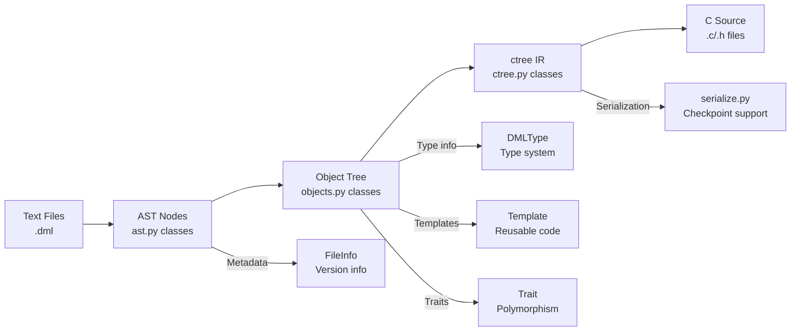

**Sources:** All stages referenced above, pipeline overview from context diagrams

## Compilation Modes and Options

The compiler supports several command-line options that affect pipeline behavior:

| Option | Module | Effect on Pipeline |
|--------|--------|-------------------|
| `--dep` | [py/dml/dmlc.py:346-364]() | Output dependencies, skip C generation |
| `--info` | [py/dml/info_backend.py:1-50]() | Generate XML register layout |
| `-g` | [py/dml/g_backend.py:1-50]() | Generate debug information |
| `--split-c-file` | [py/dml/c_backend.py:32]() | Split C output into multiple files |
| `--simics-api` | [py/dml/dmlc.py:441-446]() | Set API version, affects breaking changes |
| `--breaking-change` | [py/dml/breaking_changes.py:1-100]() | Enable individual breaking changes |

**Sources:** [py/dml/dmlc.py:308-511](), [py/dml/breaking_changes.py:1-467]()

## Error Handling and Reporting

Errors and warnings can be reported at any pipeline stage:

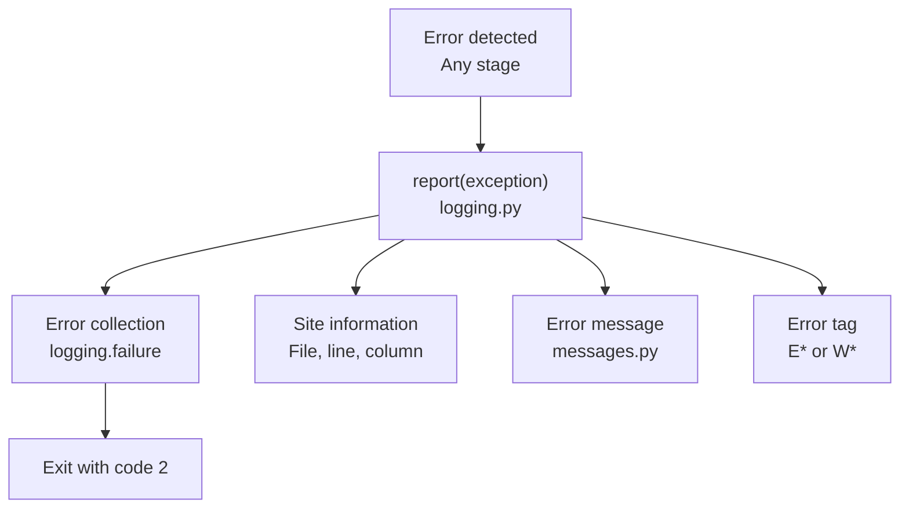

The error reporting system ([py/dml/logging.py:~1-300]()):
- Each error/warning is a `DMLError`/`DMLWarning` exception
- Errors are collected and reported via `report()`
- Site information provides source location
- Error tags (e.g., `ETYPE`, `ESYNTAX`) categorize issues
- Compilation continues after errors until `max_errors` reached

**Sources:** [py/dml/logging.py:1-300](), [py/dml/messages.py:1-200]()

## Runtime Library Integration

The generated C code links against the DML runtime library `dmllib.h`, which provides:

| Category | Functions/Macros | Purpose |
|----------|-----------------|---------|
| Identity system | `_identity_t`, `_id_info_t` | Object identification across serialization |
| Trait dispatch | `CALL_TRAIT_METHOD`, `VTABLE_PARAM` | Runtime polymorphism support |
| Hook system | `_dml_hook_t`, `_hookref_t` | Event callbacks and after-on-hook |
| Serialization | `_serialize_identity` | Checkpoint/restore support |
| Utilities | `DML_ASSERT`, `DML_combine_bits` | Runtime checks and bit operations |

The runtime library header ([include/simics/dmllib.h:1-1000]()) is included by all generated C files and provides the implementation-side interface between DML semantics and C execution.

**Sources:** [include/simics/dmllib.h:1-1000](), [py/dml/c_backend.py:1-100]()