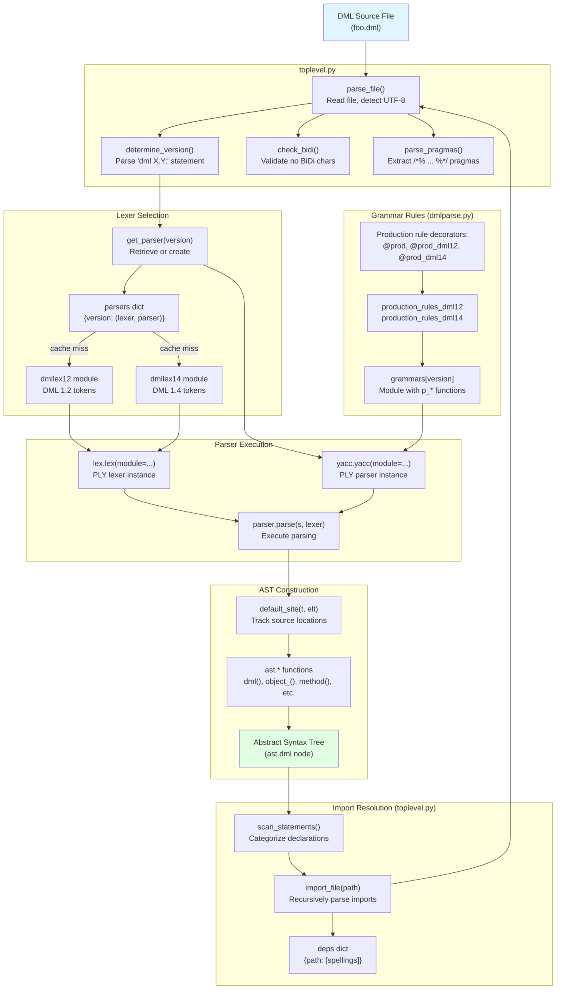
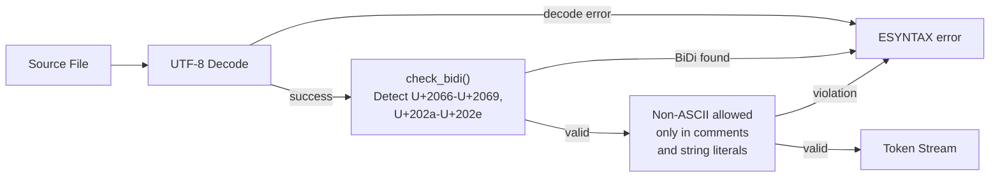
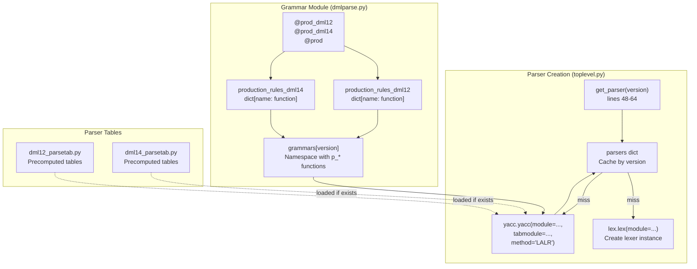
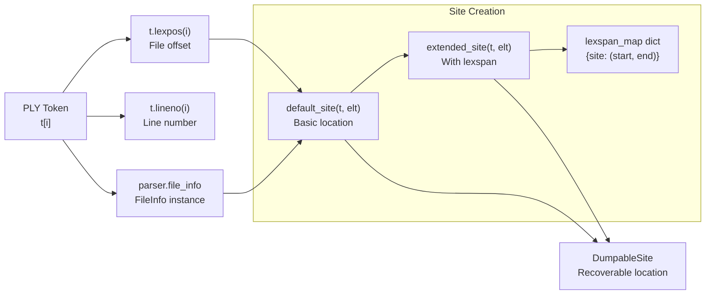
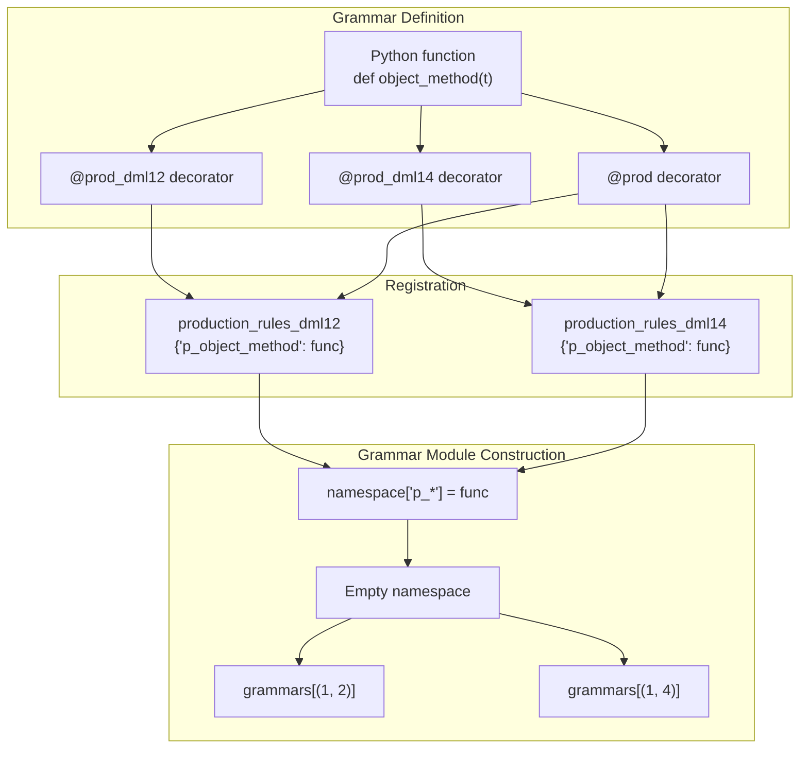
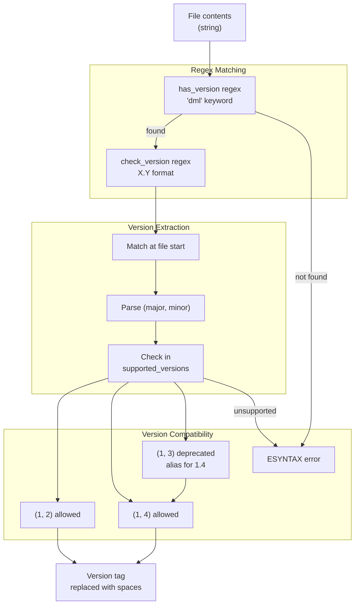
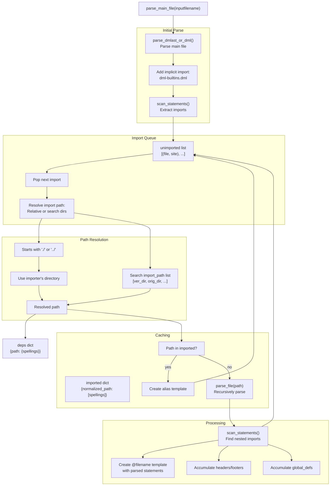
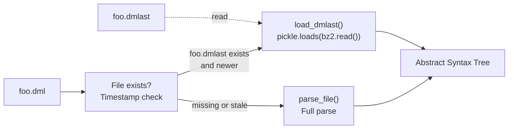
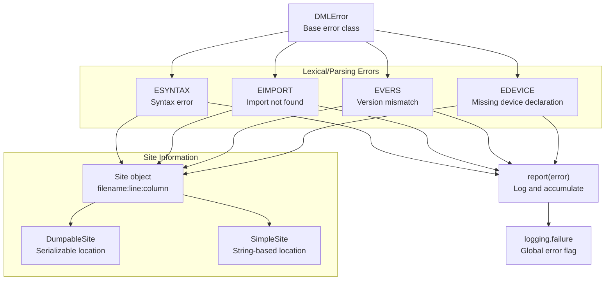

# Frontend: Parsing and Lexing

<details>
<summary>Relevant source files</summary>

The following files were used as context for generating this wiki page:

- [deprecations_to_md.py](deprecations_to_md.py)
- [doc/1.4/language.md](doc/1.4/language.md)
- [py/dml/breaking_changes.py](py/dml/breaking_changes.py)
- [py/dml/dmlc.py](py/dml/dmlc.py)
- [py/dml/dmlparse.py](py/dml/dmlparse.py)
- [py/dml/globals.py](py/dml/globals.py)
- [py/dml/messages.py](py/dml/messages.py)
- [py/dml/toplevel.py](py/dml/toplevel.py)

</details>


This document describes the DML compiler's frontend, which is responsible for transforming DML source files into Abstract Syntax Trees (ASTs). The frontend handles lexical analysis (tokenization), syntactic analysis (parsing), import resolution, and version detection. For information about semantic analysis performed after parsing, see [Semantic Analysis](#5.3). For details about code generation, see [C Code Generation Backend](#5.5).

## Overview

The DML frontend is built on PLY (Python Lex-Yacc) version 3.4 and consists of four major components:

1. **Lexical Analysis**: Version-specific tokenizers in `dmllex12.py` and `dmllex14.py`
2. **Syntactic Analysis**: Parser with version-specific grammar rules in `dmlparse.py`
3. **Import Resolution**: File handling, import expansion, and dependency tracking in `toplevel.py`
4. **AST Construction**: Syntax tree generation using factory functions in `ast.py`

The frontend supports two DML language versions (1.2 and 1.4) simultaneously, using a decorator-based system to define version-specific lexer tokens and grammar production rules.

Sources: [py/dml/dmlparse.py:1-50](), [py/dml/toplevel.py:1-30]()

## Frontend Processing Pipeline



**Frontend Processing Flow with Code Entities**

The diagram shows how source files flow through the frontend, with specific function and module names from the codebase. The process begins with file reading, proceeds through version-specific lexing and parsing, and concludes with AST construction and import resolution.

Sources: [py/dml/toplevel.py:48-127](), [py/dml/dmlparse.py:48-64](), [py/dml/dmlparse.py:82-98]()

## Lexical Analysis System

### Token Definition and Lexer Modules

DML uses separate lexer modules for each language version to accommodate syntax differences:

| Component | DML 1.2 | DML 1.4 | Purpose |
|-----------|---------|---------|---------|
| Module | `dmllex12` | `dmllex14` | Token definitions |
| Dictionary Key | `lexers[(1, 2)]` | `lexers[(1, 4)]` | Runtime lookup |
| Keyword Set | Legacy keywords | Modern keywords | Reserved words |

The lexer modules define:
- **Reserved Words**: All C keywords plus DML-specific keywords like `after`, `assert`, `cast`, `template`, etc.
- **Identifiers**: Starting with letter or underscore, followed by letters/digits/underscores
- **Literals**: Integer (decimal/hex/binary with `_` separators), floating-point, string, character, boolean
- **Operators**: C operators plus DML-specific operators
- **Comments**: C-style `//` and `/*...*/`

Sources: [doc/1.4/language.md:35-134](), [py/dml/dmlparse.py:13-14](), [py/dml/toplevel.py:52-53]()

### Character Encoding and Validation

The frontend enforces strict character encoding rules:



**Character Validation Pipeline**

The `check_bidi()` function in `toplevel.py` uses a regular expression to detect Unicode BiDi control characters that could enable "Trojan Source" attacks. Files must be valid UTF-8, and non-ASCII characters are restricted to comments and string literals.

Sources: [py/dml/toplevel.py:188-203](), [doc/1.4/language.md:43-51]()

### Pragma Processing

Special comment-like constructs called pragmas provide metadata to the compiler:

```python
# Regex in toplevel.py
pragma_re = re.compile(r'/\*%\s*([^\s*]+)\s*(?:\s([^*\s][^*]*))?%\*/')
```

Example pragma:
```dml
/*% COVERITY unreachable %*/
some_function(...);
```

The `parse_pragmas()` function extracts pragmas during file reading, and `process_pragma()` stores them in `dml.globals.coverity_pragmas` for later use during code generation.

Sources: [py/dml/toplevel.py:194-242](), [doc/1.4/language.md:208-263]()

## Parser Architecture

### PLY Integration and Parser Generation

The DML parser uses PLY (Python Lex-Yacc), which generates LALR parser tables:



**Parser Cache and Table Generation**

The `get_parser()` function maintains a cache of parser instances indexed by version tuple. When a parser doesn't exist in cache, PLY generates one from the grammar module, optionally loading precomputed parser tables for performance.

Sources: [py/dml/toplevel.py:48-64](), [py/dml/dmlparse.py:18]()

### Operator Precedence

The parser defines operator precedence matching C with DML extensions:

```python
def precedence(dml_version):
    return (
        ('nonassoc', 'LOWEST_PREC'),
        ('nonassoc', 'ELSE', 'HASHELSE'),  # HASHELSE only in 1.4
        ('left', 'LOG'),
        ('left', 'THROW'),
        ('right', 'EQUALS', 'PLUSEQUAL', ...),
        ('right', 'COLON', 'HASHCOLON'),
        ('right', 'CONDOP', 'HASHCONDOP'),
        ('left', 'LOR'),
        ('left', 'LAND'),
        # ... continues with all operators
        ('left', 'PERIOD', 'ARROW', 'LBRACKET', 'LPAREN', 'unary_postfix')
    )
```

Precedence levels follow Harbison & Steele's "C - A Reference Manual" but use multiples of 10 to accommodate DML-specific operators. Version-specific differences include the `HASH` prefix operators in DML 1.2 and preprocessor-like `#if`/`#else` constructs in DML 1.4.

Sources: [py/dml/dmlparse.py:22-79]()

### Site Tracking for Error Reporting

Every AST node records its source location using the `Site` abstraction:



**Source Location Tracking**

The `default_site()` function creates `DumpableSite` objects from PLY tokens. When porting mode is enabled (`-P` flag), `extended_site()` additionally stores token spans in `lexspan_map` for precise source transformations.

Sources: [py/dml/dmlparse.py:81-143]()

## Version-Specific Grammar Rules

### Production Rule Decorator System

DML's grammar supports two language versions through a decorator-based dispatch system:



**Production Rule Registration System**

Functions decorated with `@prod_dml12` register only in the DML 1.2 grammar, `@prod_dml14` only in DML 1.4, and `@prod` in both. PLY requires production rules to be functions named `p_*` in a module namespace.

Sources: [py/dml/dmlparse.py:151-174]()

### Version-Specific Differences

Key syntactic differences between DML 1.2 and 1.4:

| Feature | DML 1.2 | DML 1.4 | Production Rule |
|---------|---------|---------|-----------------|
| Method declarations | `method name() -> (type)` | `method name() -> (type)` | `object_method` |
| Input parameters | Optional `()` | Required `()` | `object_method_noinparams` |
| Shared methods | Not allowed | `shared method` | `method_qualifiers` |
| Saved variables | `data` keyword | `saved` keyword | `data` |
| Field arrays | `field f[i in 0..N]` | `field f[i < N]` | `field_array_size` |
| Inline methods | `method` with untyped params | `inline method` keyword | `object_inline_method` |
| Top-level `#if` | Not supported | Supported conditionally | `toplevel_if` |

Example of version-specific production:

```python
@prod_dml12
def object_method_noinparams(t):
    '''method : METHOD maybe_extern objident method_outparams maybe_default compound_statement'''
    # DML 1.2: input parameter list is optional
    # ...

@prod_dml14
def object_method(t):
    '''method : method_qualifiers METHOD objident method_params_typed maybe_default compound_statement'''
    # DML 1.4: requires typed parameters and supports qualifiers
    # ...
```

Sources: [py/dml/dmlparse.py:536-632](), [py/dml/dmlparse.py:369-401](), [py/dml/dmlparse.py:404-471]()

## Import Resolution and File Processing

### Version Detection and Validation

The `determine_version()` function extracts the version statement from each file:



**Version Statement Processing**

The version tag is removed from the source string but replaced with spaces to preserve character offsets for accurate site tracking. The `require_version_statement` breaking change controls whether the version statement is mandatory.

Sources: [py/dml/toplevel.py:34-112]()

### Import Resolution Flow



**Import Resolution and Dependency Tracking**

The `parse_main_file()` function processes imports breadth-first, maintaining an `unimported` queue. The `imported` dictionary caches normalized paths to avoid re-parsing. Each imported file's declarations are wrapped in a template named `@filename.dml` for consistent override semantics.

Sources: [py/dml/toplevel.py:359-459](), [py/dml/toplevel.py:327-350]()

### Import Path Search Strategy

The compiler searches for imported files in the following order:

1. **Relative imports** (starting with `./` or `../`): Resolved relative to the importing file's directory
2. **Versioned directories**: For each `-I` path, try `<path>/<version>/` first, then `<path>/`
3. **Main file directory**: The directory containing the main `.dml` file

Example search path construction:
```python
import_path = [
    path
    for orig_path in explicit_import_path + [os.path.dirname(inputfilename)]
    for path in [os.path.join(orig_path, version_str), orig_path]
]
```

This allows version-specific standard library files in `lib/1.2/` and `lib/1.4/` subdirectories.

Sources: [py/dml/toplevel.py:389-393]()

### Cached AST Loading (.dmlast Files)

For frequently-imported files like standard library modules, the frontend supports precompiled AST caching:



**Cached AST Loading**

The `parse_dmlast_or_dml()` function checks for a `.dmlast` file with a timestamp at least as recent as the source `.dml` file. Cached ASTs are stored as bzip2-compressed pickle files for fast loading.

Sources: [py/dml/toplevel.py:278-325]()

## AST Construction

### Statement Categorization

The `scan_statements()` function categorizes top-level declarations into five categories:

| Category | AST Kinds | Destination | Purpose |
|----------|-----------|-------------|---------|
| Imports | `'import'` | `imports` list | Files to recursively parse |
| Headers | `'header'` | `headers` list | C code for file header |
| Footers | `'footer'` | `footers` list | C code for file footer |
| Global definitions | `'constant'`, `'dml_typedef'`, `'extern'`, `'extern_typedef'`, `'loggroup'`, `'struct'`, `'template'`, `'template_dml12'` | `global_defs` list | Symbols in global scope |
| Object specifications | All other kinds | `spec_asts` list | Device structure |

Object specifications are wrapped in an automatically-instantiated template named `@<filename>` to enable consistent override semantics across multiple imports.

Sources: [py/dml/toplevel.py:129-186]()

### Production Rule AST Construction

Each production rule creates AST nodes using factory functions from the `ast` module:

```python
@prod
def object_regarray(t):
    'object : REGISTER objident array_list sizespec offsetspec maybe_istemplate object_spec'
    t[0] = ast.object_(site(t), t[2], 'register', t[3],
                       t[4] + t[5] + t[6] + t[7])
```

The `t[0]` assignment returns the AST node to the parser. Arguments `t[1]`, `t[2]`, etc. contain matched tokens or previously-reduced AST nodes. The `site(t)` function extracts source location from the first token.

Common AST node constructors:
- `ast.dml()` - Top-level file node
- `ast.object_()` - Object declaration
- `ast.method()` - Method declaration  
- `ast.param()` - Parameter declaration
- `ast.binop()` - Binary operator expression
- `ast.variable()` - Identifier reference

Sources: [py/dml/dmlparse.py:313-318](), [py/dml/dmlparse.py:177-180]()

### Error Recovery

The parser uses PLY's error recovery mechanisms but generally fails fast on syntax errors:

```python
try:
    ast = parser.parse(s, lexer=lexer, tracking=True)
except dml.dmlparse.UnexpectedEOF:
    raise ESYNTAX(DumpableSite(file_info, file_info.size()),
                   None, "unexpected end-of-file")
```

The `ESYNTAX` error class (from `messages.py`) provides formatted error messages with source location. The `tracking=True` argument enables full position tracking for accurate error reporting.

Sources: [py/dml/toplevel.py:114-127](), [py/dml/messages.py:775-790]()

## Error Handling and Diagnostics

### Error Message System

The frontend reports errors using the hierarchy in `messages.py`:



**Error Reporting Architecture**

All frontend errors inherit from `DMLError` and carry `Site` objects for source location. The `report()` function logs errors and sets the global `logging.failure` flag to prevent code generation.

Sources: [py/dml/messages.py:1-5](), [py/dml/messages.py:775-790](), [py/dml/messages.py:250-268]()

### Porting Message System

When invoked with the `-P` flag, the parser generates machine-readable porting hints:

```python
if logging.show_porting:
    report(PRETVAL(
        site,
        DumpableSite(file_info, start),
        DumpableSite(file_info, end),
        DumpableSite(file_info, rparen),
        [(psite.loc(), pname) for (_, psite, pname, _) in outp]))
```

Porting messages use `extended_site()` to track precise token boundaries in `lexspan_map`, enabling the `port_dml.py` tool to perform automated source transformations. Common porting messages include:
- `PRETVAL` - Convert output parameters to return values
- `PARRAY` - Update array syntax `[i in 0..N]` to `[i < N+1]`
- `PINPARAMLIST` - Add missing input parameter list `()`
- `PVERSION` - Update version statement `dml 1.2;` to `dml 1.4;`

Sources: [py/dml/dmlparse.py:100-143](), [py/dml/dmlparse.py:511-533]()

### Version Compatibility Warnings

The breaking changes system issues warnings for deprecated constructs:

| Breaking Change | Enabled After | Warning Issued |
|----------------|---------------|----------------|
| `require_version_statement` | API 7 | `WNOVER` - Missing version statement |
| `dml12_disable_inline_constants` | API 6 | None (behavioral change) |
| `dml12_not_typecheck` | API 5 | None (type checking change) |
| `dml12_remove_goto` | API 6 | Error on `goto` statement |

The `breaking_changes` module defines `BreakingChange` subclasses that control both compiler behavior and documentation generation.

Sources: [py/dml/breaking_changes.py:1-467](), [py/dml/toplevel.py:86-112]()