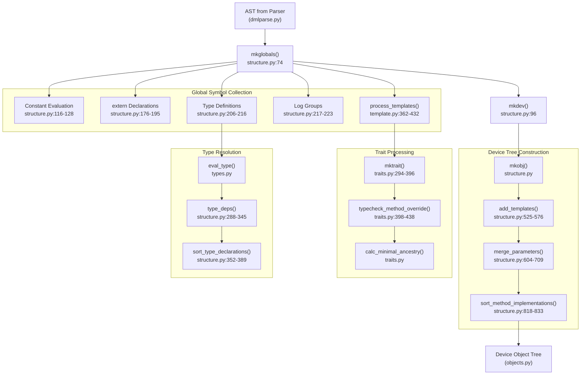
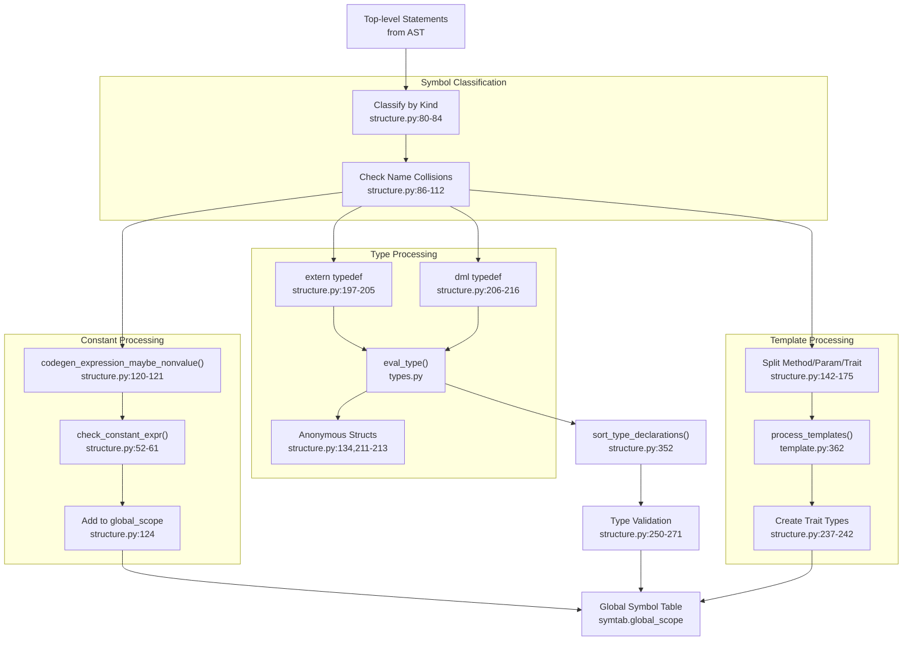
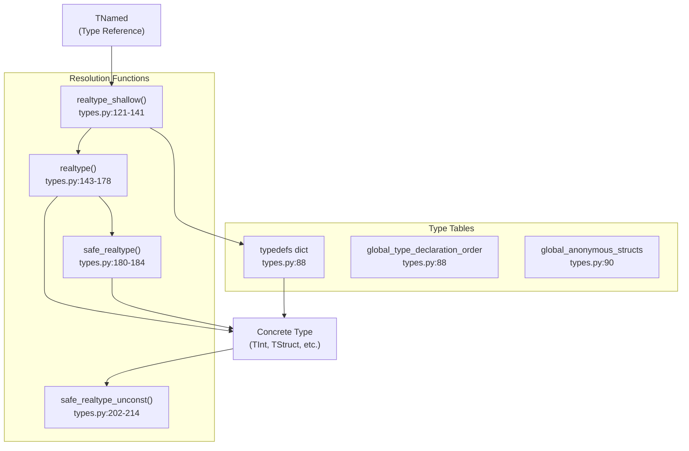
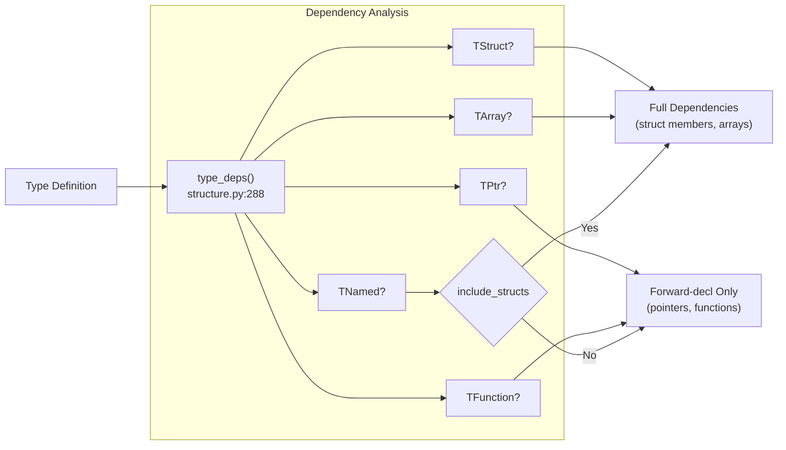
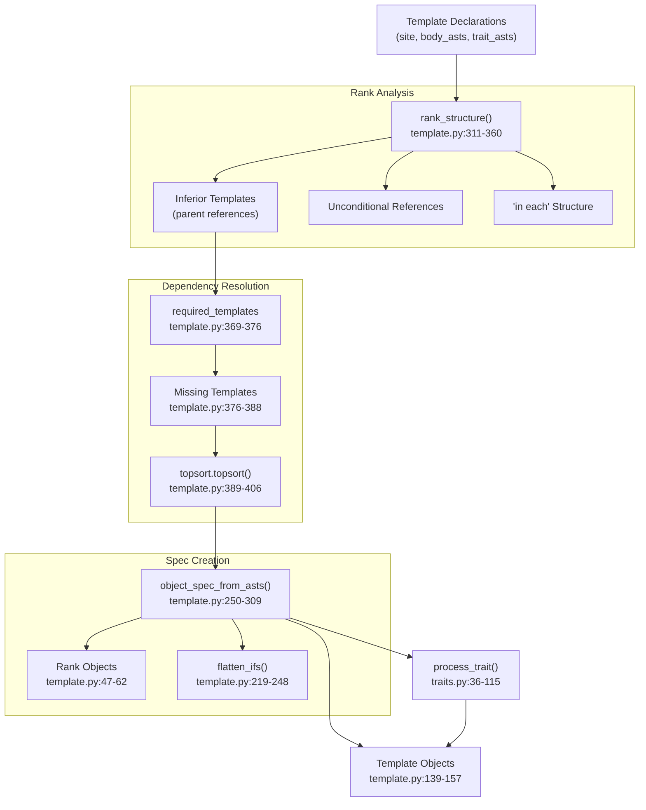
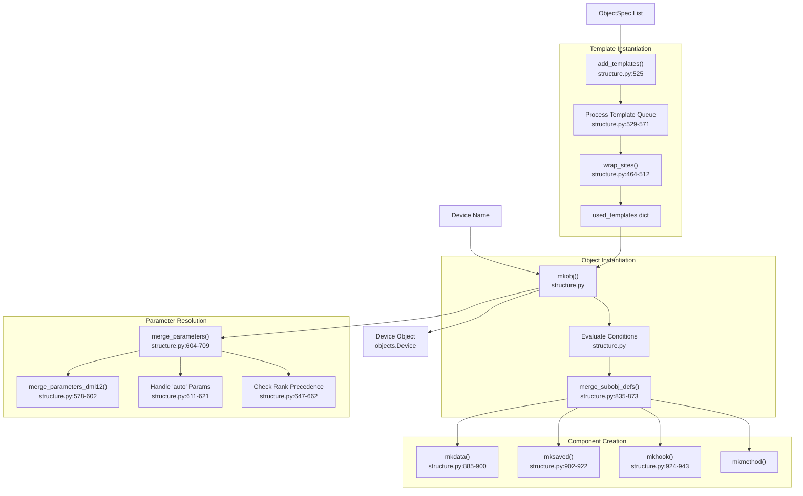
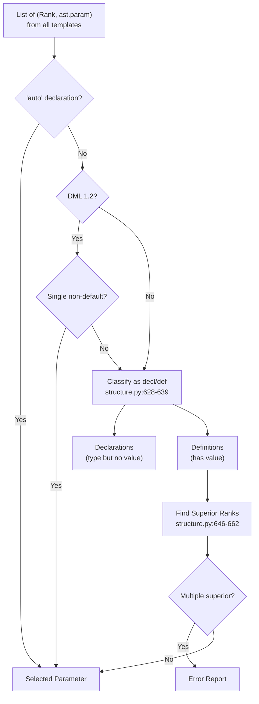
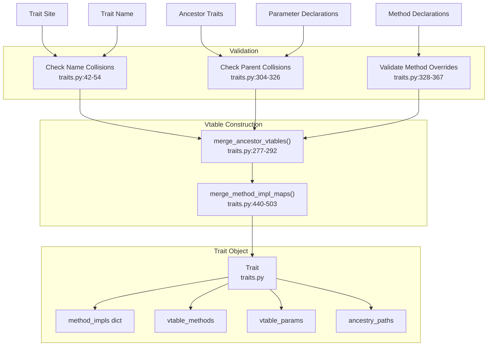
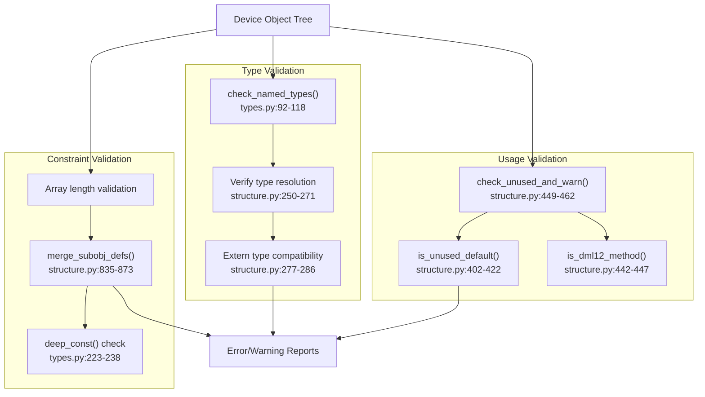
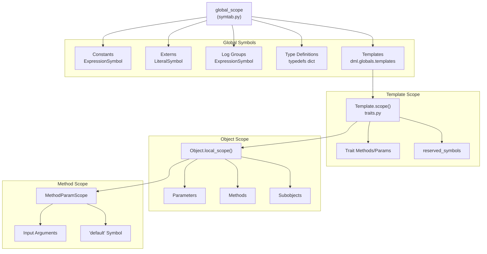

# Semantic Analysis

Relevant source files

The following files were used as context for generating this wiki page:

- [deprecations_to_md.py](deprecations_to_md.py)
- [py/dml/breaking_changes.py](py/dml/breaking_changes.py)
- [py/dml/crep.py](py/dml/crep.py)
- [py/dml/dmlc.py](py/dml/dmlc.py)
- [py/dml/globals.py](py/dml/globals.py)
- [py/dml/structure.py](py/dml/structure.py)
- [py/dml/template.py](py/dml/template.py)
- [py/dml/toplevel.py](py/dml/toplevel.py)
- [py/dml/traits.py](py/dml/traits.py)
- [py/dml/types.py](py/dml/types.py)

## Purpose and Scope

Semantic analysis is the middle-end phase of the DML compiler that transforms the Abstract Syntax Tree (AST) from parsing into a semantically validated device object tree. This phase performs type checking, symbol resolution, template instantiation, trait processing, and validates all language constraints. For information about the parsing phase that precedes this, see [Frontend: Parsing and Lexing](#5.2). For information about code generation that follows, see [C Code Generation Backend](#5.5).

The semantic analysis phase consists of two main entry points: `mkglobals()` which processes global declarations, and `mkdev()` which constructs the device object tree. These orchestrate type resolution, template processing, trait resolution, and comprehensive validation.

## Compilation Phase Overview

**Sources:** [py/dml/structure.py:74-243](), [py/dml/template.py:362-432](), [py/dml/traits.py:294-438](), [py/dml/types.py]()

## Global Symbol Collection

The `mkglobals()` function in `structure.py` processes all top-level declarations and populates the global symbol table. This phase must execute before object tree construction because objects may reference global symbols.

### Processing Pipeline

**Sources:** [py/dml/structure.py:74-287](), [py/dml/template.py:362-432]()

### Name Collision Resolution

The compiler handles various collision scenarios between global symbols:

| Collision Type | DML 1.2 Behavior | DML 1.4 Behavior | Code Reference |
|----------------|------------------|------------------|----------------|
| Multiple `extern foo;` | Redundant declarations dropped | Error reported | [py/dml/structure.py:63-93]() |
| Type vs. Value | Allowed (separate namespaces) | Allowed | [py/dml/structure.py:96-100]() |
| Duplicate `extern` with types | Type checked for compatibility | Type checked | [py/dml/structure.py:137-139,277-286]() |
| Non-extern duplicates | Error (ENAMECOLL) | Error (ENAMECOLL) | [py/dml/structure.py:106-112]() |

**Sources:** [py/dml/structure.py:63-112](), [py/dml/structure.py:277-286]()

### Constant Evaluation

Constants are evaluated during global symbol collection to enable their use in type definitions and struct declarations. The evaluation process:

1. Parse constant expression AST
2. Call `codegen_expression_maybe_nonvalue()` to evaluate in global scope
3. Verify the result is a proper constant value (not a non-value like a list of non-values)
4. Check that `expr.constant` is `True`
5. Add to `global_scope` as an `ExpressionSymbol`

**Sources:** [py/dml/structure.py:116-128](), [py/dml/structure.py:52-61]()

## Type System Resolution

The type system processes type definitions and resolves type dependencies to ensure correct declaration order in generated C code.

### Type Resolution Functions

**Sources:** [py/dml/types.py:86-214]()

### Type Dependency Analysis

The compiler analyzes dependencies between type definitions to determine correct declaration order. Type dependencies matter for:

- **Struct members and array types**: Require complete type definitions (not just forward declarations)
- **Pointer types**: Only require forward declarations
- **Function types**: Parameters and return types only need forward declarations

**Sources:** [py/dml/structure.py:288-345]()

### Type Declaration Ordering

The `sort_type_declarations()` function performs topological sorting of types to ensure dependencies appear before dependents:

1. Build dependency graph using `type_deps()`
2. Perform topological sort via `topsort.topsort()`
3. Detect circular dependencies and report ETREC error
4. Return ordered list for C code generation

**Sources:** [py/dml/structure.py:352-389]()

## Template Processing

Templates are processed to establish their inheritance hierarchy and create `Template` objects with their associated `ObjectSpec` specifications.

### Template Hierarchy Analysis

**Sources:** [py/dml/template.py:311-432](), [py/dml/traits.py:36-115]()

### Rank System

The `Rank` class establishes override precedence between templates. Each `ObjectSpec` has an associated rank that determines which declaration wins when multiple templates define the same parameter or method.

| Rank Component | Description | Code Reference |
|----------------|-------------|----------------|
| `inferior` | Set of ranks this rank overrides | [py/dml/template.py:52-57]() |
| `desc` | Human-readable description (`RankDesc`) | [py/dml/template.py:58-59]() |
| `RankDesc.kind` | One of: 'file', 'template', 'verbatim' | [py/dml/template.py:28]() |
| `RankDesc.text` | Template name or file name | [py/dml/template.py:29]() |
| `RankDesc.in_eachs` | Nested 'in each' block structure | [py/dml/template.py:32-33]() |

**Sources:** [py/dml/template.py:24-62]()

### ObjectSpec Structure

An `ObjectSpec` represents a partial specification of a DML object, containing:

- **site**: Source location where the spec is defined
- **rank**: `Rank` object for override precedence
- **templates**: List of `(site, Template)` pairs for instantiated templates
- **in_eachs**: List of `(templates, ObjectSpec)` for 'in each' statements
- **params**: List of `ast.param` nodes
- **blocks**: Conditional blocks as `(preconds, shallow_stmts, composite_stmts)` tuples

**Sources:** [py/dml/template.py:64-128]()

## Device Tree Construction

The `mkdev()` function constructs the device object tree by instantiating templates, merging parameters, and creating DML object instances.

### Object Creation Pipeline

**Sources:** [py/dml/structure.py:525-873](), [py/dml/structure.py:885-943]()

### Template Instantiation

The `add_templates()` function expands template references by:

1. Maintaining a queue of `(site, Template)` pairs to process
2. For each template, wrapping its `ObjectSpec` with instantiation context via `wrap_sites()`
3. Processing 'in each' statements by checking if all referenced templates are instantiated
4. Building `used_templates` dict mapping `Template` to `ObjectSpec`

**Sources:** [py/dml/structure.py:525-576]()

### Parameter Merging

Parameter merging resolves which parameter definition to use when multiple templates define the same parameter:

**Sources:** [py/dml/structure.py:604-709]()

### Method Override Type Checking

The `typecheck_method_override()` function validates that method overrides have compatible signatures:

- Input parameter count and types must match
- Output parameter count and types must match
- Qualifiers (`independent`, `startup`, `memoized`) must match
- `throws` annotations must match
- Type comparison uses `eq_fuzzy()` unless `strict_typechecking` is enabled

**Sources:** [py/dml/structure.py:711-805]()

## Trait System Integration

Traits provide polymorphism and shared method definitions. The trait system processes trait declarations and builds vtables for runtime dispatch.

### Trait Creation Process

**Sources:** [py/dml/traits.py:36-396](), [py/dml/traits.py:277-292](), [py/dml/traits.py:440-503]()

### Method Resolution

When multiple traits provide implementations of the same method, the compiler determines precedence using the partial order defined by trait inheritance:

1. Collect all implementations from ancestor traits
2. Filter out implementations overridden by others
3. If multiple unrelated implementations remain, check if all are overridable
4. Report ambiguity error (EAMBINH) if non-overridable implementations conflict

**Sources:** [py/dml/traits.py:440-503]()

### TraitMethod Structure

A `TraitMethod` represents a method implementation in a trait:

| Field | Description | Code Reference |
|-------|-------------|----------------|
| `site` | Source location | [py/dml/traits.py:155]() |
| `inp` | Input parameters | [py/dml/traits.py:156]() |
| `outp` | Output parameters | [py/dml/traits.py:157]() |
| `throws` | Exception specification | [py/dml/traits.py:158]() |
| `independent` | Independent method flag | [py/dml/traits.py:159]() |
| `startup` | Startup method flag | [py/dml/traits.py:160]() |
| `memoized` | Memoized method flag | [py/dml/traits.py:161]() |
| `overridable` | Can be overridden flag | [py/dml/traits.py:162]() |
| `astbody` | Method body AST | [py/dml/traits.py:163]() |
| `trait` | Parent trait | [py/dml/traits.py:164]() |
| `name` | Method name | [py/dml/traits.py:165]() |
| `default_traits` | Traits being overridden | [py/dml/traits.py:167]() |

**Sources:** [py/dml/traits.py:147-189]()

## Type Checking and Validation

After the device tree is constructed, the compiler performs comprehensive validation including type checking, unused symbol detection, and constraint verification.

### Validation Categories

**Sources:** [py/dml/structure.py:449-462](), [py/dml/types.py:92-118](), [py/dml/structure.py:835-873]()

### Unused Symbol Detection

The compiler warns about unused methods and parameters that are defined but never referenced. Special cases include:

- **Unused field methods**: Methods like `after_read`, `before_write` in fields that only affect registers
- **Unused register methods**: Override of `read`/`write` in registers with fields
- **DML 1.2 methods**: Methods like `read_access`, `write_access` that are DML 1.2-specific

**Sources:** [py/dml/structure.py:391-460]()

## Symbol Resolution

The semantic analysis phase establishes symbol tables at multiple scopes and resolves all identifier references.

### Symbol Table Hierarchy

**Sources:** [py/dml/structure.py:74-230](), [py/dml/traits.py:122-137]()

### Special Symbols

Several special symbols have unique resolution behavior:

| Symbol | Context | Resolution | Code Reference |
|--------|---------|------------|----------------|
| `default` | Method override | Previous method implementation | [py/dml/traits.py:230-246]() |
| `dev` | Template scope | Reserved, disallowed in typed params | [py/dml/traits.py:394]() |
| `$` prefix | Object reference | Current object in hierarchy | [py/dml/objects.py]() |

**Sources:** [py/dml/traits.py:122-246](), [py/dml/traits.py:384-396]()

## Error Handling and Reporting

Semantic analysis reports errors through the messaging system with specific error codes for different validation failures.

### Common Error Categories

| Error Code | Description | Reported By | Code Reference |
|------------|-------------|-------------|----------------|
| ENAMECOLL | Name collision | mkglobals, mktrait | [py/dml/structure.py:108](), [py/dml/traits.py:43-54]() |
| ETYPE | Invalid type reference | Type resolution | [py/dml/types.py:96]() |
| ENTMPL | Nonexistent template | Template instantiation | [py/dml/structure.py:541]() |
| EAMBINH | Ambiguous inheritance | Parameter/method merge | [py/dml/structure.py:660-662]() |
| EMETH | Method override mismatch | Type checking | [py/dml/structure.py:727](), [py/dml/traits.py:401-424]() |
| ENPARAM | Missing parameter definition | Parameter resolution | [py/dml/structure.py:644]() |
| ETREC | Recursive type definition | Type sorting | [py/dml/structure.py:377-379]() |
| ECYCLICTEMPLATE | Cyclic template inheritance | Template processing | [py/dml/template.py:400-401]() |

**Sources:** [py/dml/structure.py:108-809](), [py/dml/traits.py:36-438](), [py/dml/template.py:389-406]()

## Integration with Code Generation

The semantic analysis phase produces validated data structures consumed by the code generation backend:

- **Device object tree**: Hierarchical structure in `dml.globals.device`
- **Type declarations**: Ordered list in `global_type_declaration_order`
- **Trait vtables**: Method implementations in `trait.method_impls`
- **Template instances**: Used templates tracking for unused warnings
- **Symbol tables**: For expression code generation

The code generation phase (see [C Code Generation Backend](#5.5)) uses these structures to emit C code, while the debug backend (see [Runtime Support](#5.6)) uses them to generate debugging information.

**Sources:** [py/dml/structure.py:1-50](), [py/dml/dmlc.py:72-96](), [py/dml/types.py:86-90]()