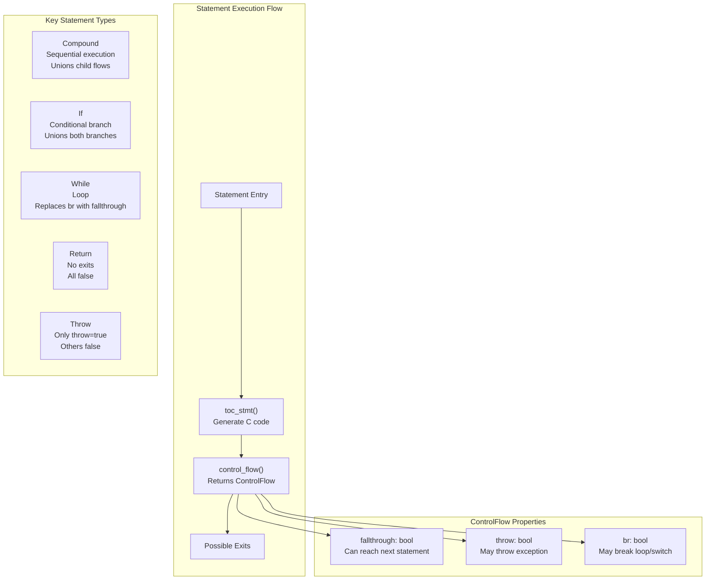
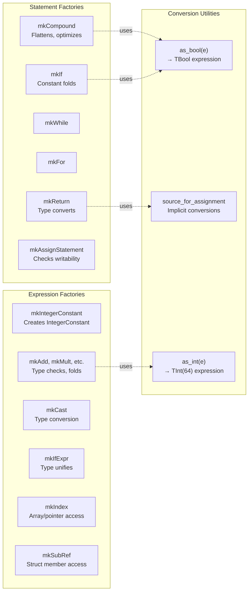
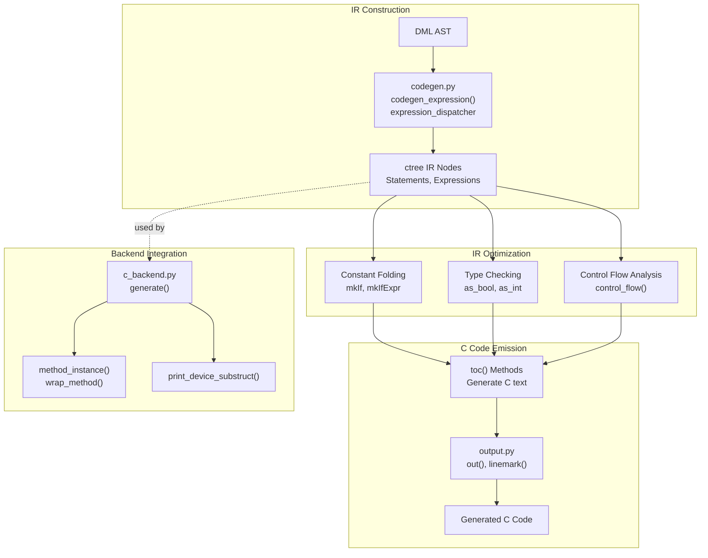

# Intermediate Representation (ctree)

<details>
<summary>Relevant source files</summary>

The following files were used as context for generating this wiki page:

- [include/simics/dmllib.h](include/simics/dmllib.h)
- [py/dml/c_backend.py](py/dml/c_backend.py)
- [py/dml/codegen.py](py/dml/codegen.py)
- [py/dml/ctree.py](py/dml/ctree.py)

</details>


The `ctree` module defines the C-like intermediate representation (IR) used by the DML compiler between semantic analysis and C code generation. This IR provides a structured, type-safe representation of C statements and expressions with built-in optimization passes, control flow analysis, and direct code emission capabilities.

For information about the overall compilation pipeline, see [Compilation Pipeline](#5.1). For details on the C code generation backend that consumes this IR, see [C Code Generation Backend](#5.5). For semantic analysis that produces input for the IR, see [Semantic Analysis](#5.3).

## IR Architecture

The ctree IR is organized into three main categories: **statements** (control flow and declarations), **expressions** (values and computations), and **initializers** (for variable initialization). All IR nodes support direct C code emission through `toc()` methods and maintain source location information for error reporting and linemark generation.

**Diagram: Core IR Class Hierarchy**

```mermaid
graph TB
    Code["Code<br/>(base class)"]
    Statement["Statement<br/>site, context<br/>toc(), control_flow()"]
    Expression["Expression<br/>site, type<br/>read(), write(), discard()"]
    Initializer["Initializer<br/>site"]
    
    Code --> Statement
    Code --> Expression
    Code --> Initializer
    
    Statement --> Compound["Compound<br/>substatements[]"]
    Statement --> If["If<br/>cond, truebranch, falsebranch"]
    Statement --> While["While<br/>cond, stmt"]
    Statement --> For["For<br/>pres, cond, posts, stmt"]
    Statement --> Return["Return<br/>expr"]
    Statement --> AssignStatement["AssignStatement<br/>target, initializer"]
    Statement --> TryCatch["TryCatch<br/>label, tryblock, catchblock"]
    
    Expression --> LValue["LValue<br/>writable, addressable"]
    Expression --> BinOp["BinOp<br/>op, lh, rh"]
    Expression --> IfExpr["IfExpr<br/>cond, texpr, fexpr"]
    Expression --> Constant["Constant<br/>constant, value"]
    Expression --> Variable["Variable<br/>name, type"]
    Expression --> Cast["Cast<br/>expr, type"]
    
    LValue --> NodeRef["NodeRef<br/>node, indices"]
    LValue --> LocalVariable["LocalVariable<br/>sym"]
    
    Constant --> IntegerConstant["IntegerConstant"]
    Constant --> FloatConstant["FloatConstant"]
    Constant --> StringConstant["StringConstant"]
    Constant --> BoolConstant["BoolConstant"]
    
    Initializer --> ExpressionInitializer["ExpressionInitializer<br/>expr"]
    Initializer --> CompoundInitializer["CompoundInitializer<br/>elements[]"]
```



Sources: [py/dml/ctree.py:341-435](), [py/dml/ctree.py:1216-1296]()

## Statement IR

Statements represent control flow, declarations, and side effects. The `Statement` base class at [py/dml/ctree.py:341-379]() defines the interface all statements must implement:

- **`toc_stmt()`**: Emit a single labeled C statement
- **`toc()`**: Emit any number of statements/declarations (may be placed in an existing block)
- **`toc_inline()`**: Emit statements guaranteed to be placed in a dedicated block
- **`control_flow()`**: Analyze how execution proceeds after this statement

**Diagram: Statement Control Flow**



Sources: [py/dml/ctree.py:302-379](), [py/dml/ctree.py:381-419]()

### Core Statement Types

**Compound Statement** [py/dml/ctree.py:381-419]():
```python
class Compound(Statement):
    def __init__(self, site, substatements, rbrace_site=None)
    def control_flow(self):
        # Union flows; early exit if no fallthrough
```

The `mkCompound` factory [py/dml/ctree.py:421-434]() optimizes by:
- Flattening nested compounds without declarations
- Removing empty statements
- Returning single non-declaration statements unwrapped

**Conditional Statement** [py/dml/ctree.py:834-854]():
```python
class If(Statement):
    def __init__(self, site, cond, truebranch, falsebranch, else_site)
```

The `mkIf` factory [py/dml/ctree.py:856-865]() performs constant folding: if `cond.constant`, returns only the live branch or `mkNoop`.

**Loop Statements** [py/dml/ctree.py:867-957]():
- `While`: Traditional while loop with condition check
- `DoWhile`: Do-while loop (body executes at least once)
- `For`: Traditional for loop with init, condition, and post statements

All loop statements analyze whether they're infinite (constant true condition) or have a dead body (constant false condition) in their `control_flow()` methods.

**Exception Handling** [py/dml/ctree.py:530-562]():
```python
class TryCatch(Statement):
    def __init__(self, site, label, tryblock, catchblock)
```

Generates a try block followed by a catch label. Uses control flow analysis to determine if the catch block is reachable.

Sources: [py/dml/ctree.py:381-567](), [py/dml/ctree.py:834-957]()

## Expression IR

Expressions represent values and computations. The `Expression` base class defines:

- **`read()`**: Generate C code to read the value
- **`write(initializer)`**: Generate C code to write to this lvalue (if applicable)
- **`discard()`**: Generate C code to evaluate for side effects only
- **`ctype()`**: Return the DML type of this expression
- **`constant`**, **`value`**: Track compile-time constant values

**Diagram: Expression Categories and Operations**

```mermaid
graph TB
    subgraph "Expression Interface"
        ExprBase["Expression"]
        ReadOp["read() → str<br/>Get value"]
        WriteOp["write(init) → str<br/>Assign value"]
        DiscardOp["discard() → str<br/>Evaluate for side effects"]
        TypeOp["ctype() → DMLType"]
    end
    
    ExprBase --> ReadOp
    ExprBase --> WriteOp
    ExprBase --> DiscardOp
    ExprBase --> TypeOp
    
    subgraph "LValue Expressions"
        LVal["LValue<br/>writable=True<br/>addressable=True"]
        NodeRefEx["NodeRef<br/>DML object reference"]
        LocalVarEx["LocalVariable<br/>Local scope variable"]
        StaticVarEx["StaticVariable<br/>Static/global variable"]
    end
    
    subgraph "RValue Expressions"
        BinOpEx["BinOp<br/>+, -, *, /, &, |, etc."]
        UnaryOpEx["UnaryOp<br/>!, ~, -, ++, --"]
        IfExprEx["IfExpr<br/>cond ? texpr : fexpr"]
        CastEx["Cast<br/>Type conversion"]
        ApplyEx["Apply<br/>Function call"]
    end
    
    subgraph "Constant Expressions"
        IntConstEx["IntegerConstant<br/>Compile-time integer"]
        FloatConstEx["FloatConstant<br/>Compile-time float"]
        StringConstEx["StringConstant<br/>String literal"]
        BoolConstEx["BoolConstant<br/>true/false"]
    end
    
    ExprBase --> LVal
    ExprBase --> BinOpEx
    ExprBase --> IntConstEx
    
    LVal --> NodeRefEx
    LVal --> LocalVarEx
    LVal --> StaticVarEx
```



Sources: [py/dml/ctree.py:1216-1296](), [py/dml/expr.py:1-200]()

### Binary and Unary Operations

**Binary Operations** [py/dml/ctree.py:1298-1336]():

The `BinOp` class handles operators with priority-based parenthesization. The `make()` class method routes to specific subclasses:

- **Arithmetic**: `ArithBinOp` (Add, Subtract, Mult, Div, Mod)
- **Bitwise**: `BitBinOp` (BitAnd, BitOr, BitXOr), `BitShift` (ShL, ShR)
- **Comparison**: `Compare` (LessThan, GreaterThan, Equals, NotEquals)
- **Logical**: `Logical` (And, Or)

Each operation type performs appropriate type checking and conversions in its `make_simple()` method [py/dml/ctree.py:1337-1800]().

**Unary Operations** [py/dml/codegen.py:1102-1178]():

Handled through factory functions:
- `mkNot`: Boolean negation with `as_bool` conversion
- `mkBitNot`: Bitwise negation
- `mkUnaryMinus`, `mkUnaryPlus`: Arithmetic unary operators
- `mkAddressOf`, `mkDereference`: Pointer operations
- `mkPreInc`, `mkPostInc`, `mkPreDec`, `mkPostDec`: Increment/decrement

Sources: [py/dml/ctree.py:1298-1800](), [py/dml/codegen.py:1102-1178]()

### Constant Folding and Optimization

Factory functions perform constant folding and dead code elimination. Key examples:

**mkIf Optimization** [py/dml/ctree.py:856-865]():
```python
def mkIf(site, cond, truebranch, falsebranch=None, else_site=None):
    if cond.constant:
        if cond.value:
            return truebranch
        elif falsebranch:
            return falsebranch
        else:
            return mkNoop(site)
    return If(site, cond, truebranch, falsebranch, else_site)
```

**mkIfExpr Optimization** [py/dml/ctree.py:1238-1296]():
- Folds constant conditions to single branch
- Performs type unification and implicit conversions
- Handles pointer/arithmetic/boolean type combinations

**Logical Short-Circuit** [py/dml/ctree.py:1373-1389]():
```python
def mkAnd(site, lh, rh):
    if lh.constant:
        if lh.value:
            return rh  # true && x → x
        else:
            return lh  # false && x → false
    if rh.constant and rh.value:
        return lh      # x && true → x
    return And(site, lh, rh)
```

Sources: [py/dml/ctree.py:856-865](), [py/dml/ctree.py:1238-1296](), [py/dml/ctree.py:1373-1389]()

## Factory Functions and Type Conversions

The module provides over 100 factory functions (prefixed with `mk`) that construct IR nodes with built-in optimizations and type checking. These are the primary interface for IR construction.

**Diagram: Factory Function Categories**



Sources: [py/dml/ctree.py:421-1044](), [py/dml/ctree.py:1160-1203]()

### Type Conversion Functions

**as_bool** [py/dml/ctree.py:1160-1176]():
Converts expressions to boolean type:
- `TBool` → identity
- `TInt` with 1 bit → `mkFlag`
- `TPtr` → compare with NULL
- Otherwise → error, returns `mkBoolConstant(False)`

**as_int** [py/dml/ctree.py:1178-1202]():
Converts expressions to integer type:
- DML 1.2 compat: returns TInt as-is
- DML 1.4: converts to `TInt(64, signed)` or `TInt(64, unsigned)`
- Handles endian integers with load functions
- Reports `EBTYPE` for non-integer types

**source_for_assignment** [py/dml/ctree.py:2805-2930]():
Performs implicit conversions for assignment compatibility:
- Integer promotions and truncations
- Pointer type compatibility checks
- Array decay to pointer
- Endian integer handling
- Reports errors for incompatible types

Sources: [py/dml/ctree.py:1160-1202](), [py/dml/ctree.py:2805-2930]()

## Control Flow Analysis

The `ControlFlow` class [py/dml/ctree.py:302-339]() represents possible execution paths after a statement:

- **`fallthrough`**: May proceed to the following statement
- **`throw`**: May throw an exception
- **`br`**: May break an enclosing switch or loop

This analysis enables the compiler to verify that methods always return or throw, and to emit warnings about unreachable code.

**Diagram: Control Flow Analysis Examples**

```mermaid
graph TB
    subgraph "Return Statement"
        ReturnEntry["return expr;"]
        ReturnFlow["ControlFlow()<br/>All paths: false"]
    end
    
    subgraph "If-Else Statement"
        IfEntry["if (cond) A else B"]
        IfTrue["A.control_flow()"]
        IfFalse["B.control_flow()"]
        IfUnion["Union both flows"]
    end
    
    subgraph "While Loop"
        WhileEntry["while (cond) body"]
        WhileBody["body.control_flow()"]
        WhileResult["fallthrough=true<br/>br=false<br/>throw preserved"]
        WhileNote["br converted to<br/>fallthrough"]
    end
    
    subgraph "Compound Statement"
        CompoundEntry["{ stmt1; stmt2; ... }"]
        CompoundSequential["Process sequentially<br/>Early exit if !fallthrough"]
        CompoundResult["Union of all flows"]
    end
    
    ReturnEntry --> ReturnFlow
    IfEntry --> IfTrue
    IfEntry --> IfFalse
    IfTrue --> IfUnion
    IfFalse --> IfUnion
    WhileEntry --> WhileBody
    WhileBody --> WhileNote
    WhileNote --> WhileResult
    CompoundEntry --> CompoundSequential
    CompoundSequential --> CompoundResult
```



Sources: [py/dml/ctree.py:302-339](), [py/dml/ctree.py:361-379](), [py/dml/ctree.py:412-419](), [py/dml/ctree.py:850-854](), [py/dml/ctree.py:877-888]()

### Control Flow Methods by Statement Type

**Compound** [py/dml/ctree.py:412-419]():
```python
def control_flow(self):
    acc = ControlFlow(fallthrough=True)
    for sub in self.substatements:
        flow = sub.control_flow()
        acc = acc.union(flow, fallthrough=flow.fallthrough)
        if not acc.fallthrough:
            return acc  # Early exit
    return acc
```

**If** [py/dml/ctree.py:850-854]():
Unions the true and false branch flows.

**While** [py/dml/ctree.py:877-888]():
- Infinite loop (constant true): returns `bodyflow.replace(fallthrough=bodyflow.br, br=False)`
- Dead body (constant false): returns `ControlFlow(fallthrough=True)`
- Otherwise: `fallthrough=True, br=False`

**Switch** [py/dml/ctree.py:1022-1042]():
Analyzes case labels and checks for default case to determine if execution can fall through the switch end.

Sources: [py/dml/ctree.py:412-419](), [py/dml/ctree.py:850-854](), [py/dml/ctree.py:877-888](), [py/dml/ctree.py:1022-1042]()

## Integration with Code Generation

The IR interfaces directly with the code generation system through three key mechanisms:

**Code Emission** [py/dml/ctree.py:350-358]():
- `toc_stmt()`: Emit a single labeled C statement
- `toc()`: Emit statements that may be in an existing block
- `toc_inline()`: Emit statements in a dedicated block

**Symbol Management** [py/dml/ctree.py:258-277]():
- `ExpressionSymbol`: Symbol corresponding to an expression
- `LiteralSymbol`: Symbol mapping directly to a C identifier
- `lookup_var()`: Resolve variable references to expressions

**Device Context** [py/dml/crep.py:1-100]():
The `crep` module (C representation) works with ctree to:
- Generate C names for DML objects: `cname()`, `cref_method()`, `cref_hook()`
- Access device structure members: `cref_node()`, `cref_session()`
- Manage device instance context: `DeviceInstanceContext`

**Diagram: IR to C Code Generation Flow**



Sources: [py/dml/ctree.py:258-277](), [py/dml/ctree.py:350-358](), [py/dml/codegen.py:977-985](), [py/dml/c_backend.py:1-100]()

## Special IR Constructs

### DML-Specific Expressions

**After Statements** [py/dml/ctree.py:697-757]():
```python
class After(Statement):
    def __init__(self, site, clock, unit, delay, domains, info, indices, args_init)
```

Generates code to post Simics events with serialized data for delayed method execution.

**Trait References** [py/dml/ctree.py:2386-2565]():
- `TraitUpcast`: Convert trait reference to ancestor trait
- `TraitMethodRef`: Reference to trait method for dispatch
- `TraitMethodDirect`, `TraitMethodIndirect`: Direct/indirect trait method calls
- `ObjIdentity`, `TraitObjIdentity`: Object identity tracking

**Hook Operations** [py/dml/ctree.py:2172-2282]():
- `HookSendNowRef`, `HookSendNowApply`: Immediate hook dispatch
- `HookSendRef`, `HookSendApply`: Hook reference and invocation
- `mkAfterOnHook`: Attach callback to hook

**Each-In Sequences** [py/dml/ctree.py:2713-2775]():
```python
class EachIn(AbstractList):
    # Represents 'each T in this' expressions
    def __init__(self, site, trait, num_expr, base_idx_expr, array_idx_expr, array_size_expr)
```

Sources: [py/dml/ctree.py:697-757](), [py/dml/ctree.py:2172-2282](), [py/dml/ctree.py:2386-2565](), [py/dml/ctree.py:2713-2775]()

### Non-Value Expressions

The IR includes `NonValue` expressions [py/dml/expr.py:150-200]() that represent references that cannot be used as values but may be valid in specific contexts:

- `InterfaceMethodRef`: Reference to an interface method (checked with `defined`)
- `NodeRef`: Reference to a DML object (can take address in 1.4)
- `AbstractList`: List-like constructs (each-in sequences)

These become errors if used as values, but have special handling in unary operators like `defined`, `!`, and `&`.

Sources: [py/dml/expr.py:150-200](), [py/dml/ctree.py:2083-2170]()

## Initialization and Declarations

The IR supports complex initialization patterns through the `Initializer` hierarchy [py/dml/ctree.py:3208-3280]():

**ExpressionInitializer** [py/dml/ctree.py:3218-3227]():
Simple initialization from an expression: `int x = expr;`

**CompoundInitializer** [py/dml/ctree.py:3229-3250]():
Aggregate initialization: `struct { ... } x = { init1, init2, ... };`

**DesignatedStructInitializer** [py/dml/ctree.py:3252-3267]():
Designated initialization: `struct S x = { .field1 = val1, .field2 = val2 };`

**MemsetInitializer** [py/dml/ctree.py:3269-3280]():
Zero-initialization using memset for large structures.

The `get_initializer()` function [py/dml/ctree.py:3282-3330]() selects the appropriate initializer type based on the target type and initialization expression.

Sources: [py/dml/ctree.py:3208-3330]()