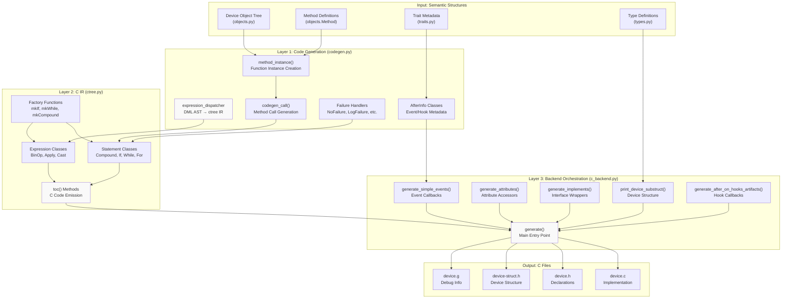
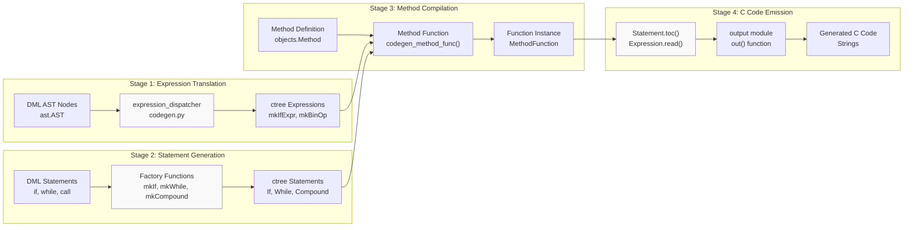
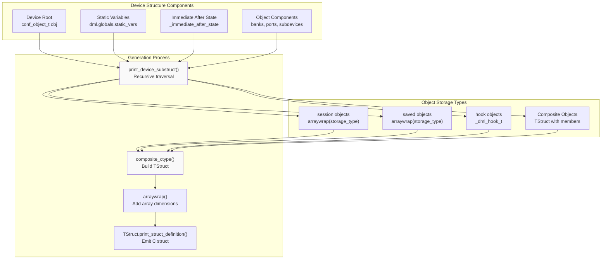
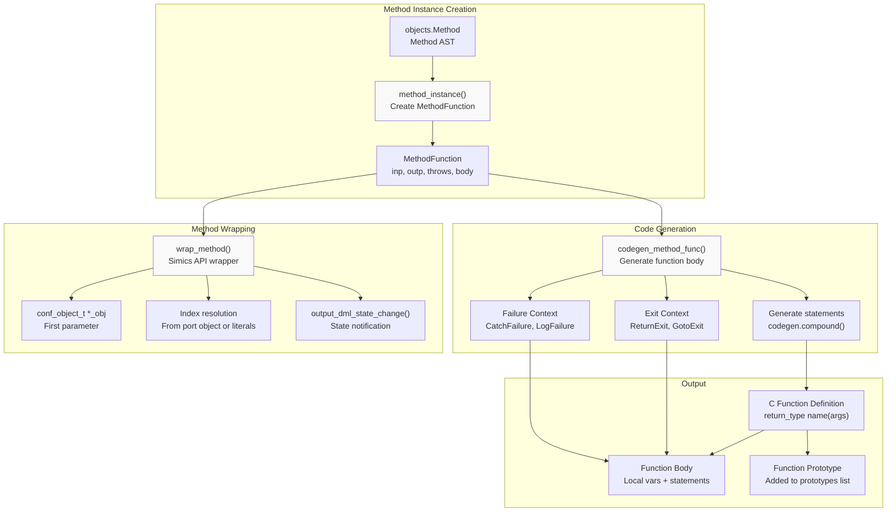
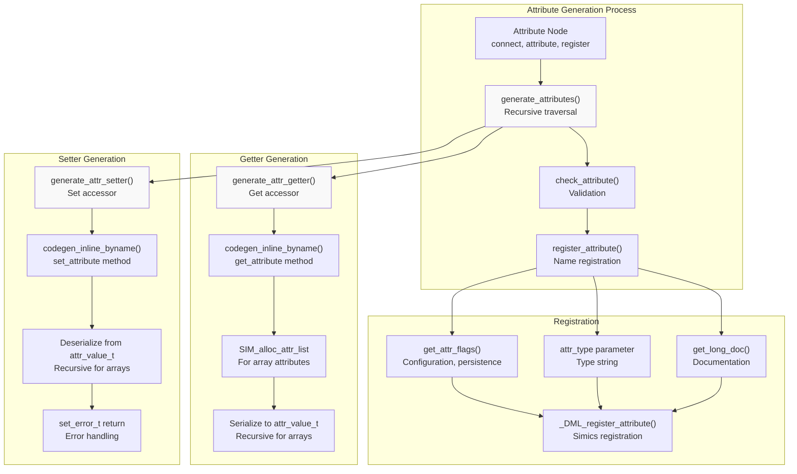
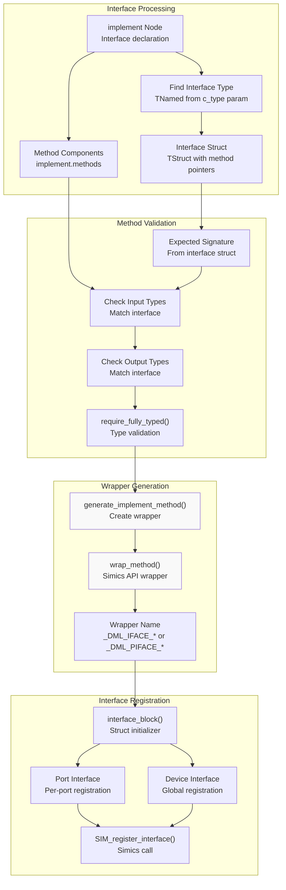
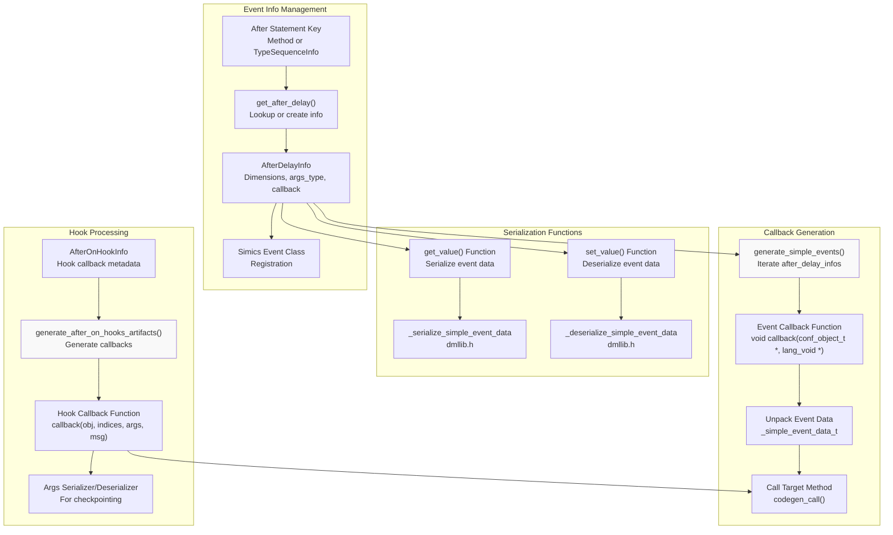
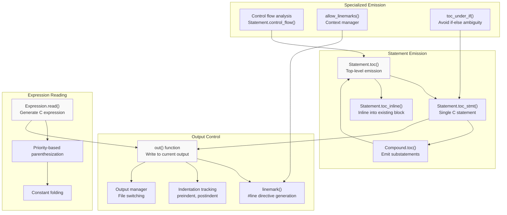

# C Code Generation Backend

<details>
<summary>Relevant source files</summary>

The following files were used as context for generating this wiki page:

- [include/simics/dmllib.h](include/simics/dmllib.h)
- [py/dml/c_backend.py](py/dml/c_backend.py)
- [py/dml/codegen.py](py/dml/codegen.py)
- [py/dml/ctree.py](py/dml/ctree.py)

</details>


## Purpose and Scope

The C Code Generation Backend is the final stage of the DML compilation pipeline that transforms the analyzed device model into executable C code compatible with the Simics simulator. This backend takes the semantic structures built during analysis (see [Semantic Analysis](#5.3)) and generates multiple C files including device structure definitions, method implementations, attribute accessors, interface wrappers, and event callbacks.

This page covers the code generation orchestration, device structure construction, method compilation, and output file management. For details about the intermediate representation used during generation, see [Intermediate Representation (ctree)](#5.4). For runtime library functions that the generated code links against, see [Runtime Support (dmllib.h)](#5.6).

## Architecture Overview

The C code generation backend consists of three main layers that transform DML semantic structures into C code:



Sources: [py/dml/c_backend.py:1-30](), [py/dml/codegen.py:1-71](), [py/dml/ctree.py:1-189]()

## Code Generation Pipeline

The code generation pipeline transforms DML semantic structures through multiple stages:



Sources: [py/dml/codegen.py:977-1327](), [py/dml/ctree.py:341-420]()

### Expression Translation

The expression dispatcher converts DML AST nodes to ctree expressions:

| DML AST Node | Handler Function | ctree Output |
|--------------|-----------------|--------------|
| `conditional` | `expr_conditional()` | `IfExpr` |
| `binop` | `expr_binop()` | `BinOp` subclasses |
| `unop` | `expr_unop()` | Unary operator nodes |
| `apply` | `expr_apply()` | `Apply` |
| `variable` | `expr_variable()` | `NodeRef`, `LocalVariable` |
| `objectref` | `expr_objectref()` | `NodeRef` |
| `member` | `expr_member()` | `SubRef` |
| `cast` | `expr_cast()` | `Cast` |

Sources: [py/dml/codegen.py:979-1327]()

### Statement Factory Functions

The ctree module provides factory functions that create optimized statement IR:

- `mkCompound(site, statements)` - Creates compound statements with automatic flattening [py/dml/ctree.py:421-434]()
- `mkIf(site, cond, truebranch, falsebranch)` - Creates conditional statements with constant folding [py/dml/ctree.py:856-865]()
- `mkWhile(site, expr, stmt)` - Creates while loops [py/dml/ctree.py:890-891]()
- `mkFor(site, pres, expr, posts, stmt)` - Creates for loops [py/dml/ctree.py:956-957]()
- `mkAssignStatement(site, target, init)` - Creates assignments with type checking [py/dml/ctree.py:1126-1141]()

Sources: [py/dml/ctree.py:421-957]()

## Device Structure Generation

The device structure is a C struct containing all device state, generated by recursively traversing the object hierarchy:



Sources: [py/dml/c_backend.py:116-223]()

### Structure Generation Rules

The `print_device_substruct()` function determines storage for each node type:

| Object Type | Storage Type | Notes |
|------------|--------------|-------|
| `device` | `TStruct` with all components | Root structure, includes `conf_object_t obj` |
| `session` | `arraywrap(node_storage_type())` | Session variables |
| `saved` | `arraywrap(node_storage_type())` | Checkpointed variables |
| `hook` | `arraywrap(_dml_hook_t)` | Hook storage |
| `bank` | `TStruct` with `_obj` pointer + components | Port object pointer for named banks |
| `port` | `TStruct` with `_obj` pointer + components | Port object pointer |
| `subdevice` | `TStruct` with `_obj` pointer + components | Port object pointer |
| `register`, `field` | `TStruct` or `arraywrap` | Depends on `allocate` parameter in DML 1.2 |
| `group`, `event`, `connect` | `TStruct` with components | Composite containers |

Sources: [py/dml/c_backend.py:140-223]()

## Method Compilation

Methods are compiled into C functions through a multi-stage process:



Sources: [py/dml/codegen.py:2200-2500](), [py/dml/c_backend.py:713-764]()

### Method Function Structure

A compiled method function has this general structure:

```
static return_type METHOD_NAME(device_t *_dev, [indices], [inputs], [outputs])
{
    // Local variable declarations
    // Method body statements
    // Return statement or exit label
}
```

Sources: [py/dml/codegen.py:2350-2450]()

### Failure Handling

Different failure handlers control exception behavior:

| Handler | Purpose | Generated Code |
|---------|---------|----------------|
| `NoFailure` | Disallow exceptions | Reports ICE if `throw` encountered |
| `LogFailure` | Log and continue | Generates `SIM_LOG_ERROR` call |
| `CatchFailure` | Re-throw | Generates `goto throw_label` |
| `ReturnFailure` | Return boolean | Returns `true` on exception |
| `IgnoreFailure` | Silent failure | Generates empty statement |

Sources: [py/dml/codegen.py:150-214]()

### Exit Handling

Exit handlers control how methods return:

| Handler | Purpose | Generated Code |
|---------|---------|----------------|
| `ReturnExit` | Direct return | `return [value];` |
| `GotoExit_dml12` | Goto exit label (DML 1.2) | `goto exit_label;` |
| `GotoExit_dml14` | Goto exit label (DML 1.4) | Assigns outputs then `goto exit_label;` |

Sources: [py/dml/codegen.py:217-268]()

## Attribute Generation

Attributes are generated as getter/setter function pairs that interface with Simics:



Sources: [py/dml/c_backend.py:388-632]()

### Attribute Accessor Structure

Generated attribute accessors follow this pattern:

**Getter:**
```c
attr_value_t get_ATTR(conf_object_t *_obj, lang_void *_aux)
{
    device_t *_dev = (device_t *)_obj;
    attr_value_t _val0;
    // For arrays: allocate list and iterate
    // Call get_attribute method
    // Return attr_value_t
}
```

**Setter:**
```c
set_error_t set_ATTR(conf_object_t *_obj, attr_value_t *_val, lang_void *_aux)
{
    device_t *_dev = (device_t *)_obj;
    set_error_t _status = Sim_Set_Illegal_Value;
    // For arrays: iterate and extract list items
    // Call set_attribute method
    // Return status
}
```

Sources: [py/dml/c_backend.py:452-505]()

## Interface Implementation

Interface methods are wrapped to match the expected function signature:



Sources: [py/dml/c_backend.py:766-925]()

### Interface Block Structure

The generated interface implementation:

```c
static const interface_name_t varname = {
    .method1 = &_DML_IFACE_method1,
    .method2 = &_DML_IFACE_method2,
    // ...
};
SIM_register_interface(class, "interface_name", &varname);
```

For port interfaces, the wrapper name uses `_DML_PIFACE_` prefix and receives indices from the port object.

Sources: [py/dml/c_backend.py:831-925]()

## Event and Hook Artifacts

The backend generates callbacks for `after` statements and hooks:



Sources: [py/dml/c_backend.py:1009-1195](), [py/dml/codegen.py:461-855]()

### Event Callback Structure

Generated event callbacks:

```c
void _simple_event_N_callback(conf_object_t *_obj, lang_void *_data)
{
    device_t *_dev = (device_t *)_obj;
    _simple_event_data_t *data = (_simple_event_data_t *)_data;
    const uint32 *_indices = data ? data->indices : ...;
    const args_type *_args = data ? data->args : ...;
    
    // Call target method
    
    if (data) {
        _free_simple_event_data(*data);
        MM_FREE(data);
    }
}
```

Sources: [py/dml/c_backend.py:1031-1110]()

### Hook Callback Structure

Generated hook callbacks:

```c
void _after_on_hook_N_callback(conf_object_t *_obj, 
                               const uint32 *indices,
                               const void *_args, 
                               const void *_msg)
{
    device_t *_dev = (device_t *)_obj;
    const typeseq_struct_t *msg = _msg;
    const args_type *args = _args;
    
    // Call target method with args from msg/args
}
```

Sources: [py/dml/c_backend.py:1112-1195]()

## Output File Generation

The backend generates multiple C files with specific purposes:

```mermaid
graph TB
    subgraph "Main Generation Entry"
        GENERATE["generate()<br/>c_backend.py entry point"]
        SPLITTING["Code Splitting<br/>c_split_threshold"]
    end
    
    subgraph "Structure File (device-struct.h)"
        STRUCTFILE["generate_structfile()<br/>Struct typedef and init function"]
        TYPEDEF["typedef struct device device_t"]
        INIT_PROTO["init_function_name() prototype"]
        EXPORT_DECL["Exported method declarations"]
    end
    
    subgraph "Header File (device.h)"
        HFILE["generate_hfile()<br/>Main header"]
        GUARD["Include guards"]
        MACROS["DML_PREFIX macro"]
        TYPES["Type declarations<br/>Traits, structs, vtables"]
        DEV_STRUCT["Device structure definition<br/>print_device_substruct()"]
        LOG_GROUPS["Log group constants"]
        RESET_PROTOS["Reset function prototypes"]
    end
    
    subgraph "Implementation File (device.c)"
        CFILE["Implementation code"]
        INCLUDES["Standard includes + device.h"]
        PROTOS["generate_protofile()<br/>Function prototypes"]
        PORT_CLASSES["generate_port_classes()<br/>Port registrations"]
        ATTRIBUTES["generate_attributes()<br/>Attribute accessors"]
        IMPLEMENTS["generate_implements()<br/>Interface implementations"]
        EVENTS["generate_simple_events()<br/>Event callbacks"]
        HOOKS["generate_after_on_hooks_artifacts()<br/>Hook callbacks"]
        METHODS["Method implementations<br/>Referenced methods"]
        INIT["Initialization function"]
    end
    
    subgraph "Debug File (device.g)"
        GFILE["g_backend.py<br/>Debug metadata (optional)"]
    end
    
    GENERATE --> SPLITTING
    SPLITTING --> STRUCTFILE
    SPLITTING --> HFILE
    SPLITTING --> CFILE
    SPLITTING --> GFILE
    
    STRUCTFILE --> TYPEDEF
    STRUCTFILE --> INIT_PROTO
    STRUCTFILE --> EXPORT_DECL
    
    HFILE --> GUARD
    HFILE --> MACROS
    HFILE --> TYPES
    HFILE --> DEV_STRUCT
    HFILE --> LOG_GROUPS
    HFILE --> RESET_PROTOS
    
    CFILE --> INCLUDES
    CFILE --> PROTOS
    CFILE --> PORT_CLASSES
    CFILE --> ATTRIBUTES
    CFILE --> IMPLEMENTS
    CFILE --> EVENTS
    CFILE --> HOOKS
    CFILE --> METHODS
    CFILE --> INIT
    
    style GENERATE fill:#f9f9f9
```



Sources: [py/dml/c_backend.py:240-373]()

### Generated File Summary

| File | Purpose | Key Contents |
|------|---------|--------------|
| `device-struct.h` | Public device interface | `typedef struct device device_t;`<br/>Init function prototype<br/>Exported method declarations |
| `device.h` | Type definitions | Trait types, struct definitions<br/>Device structure with all state<br/>Vtable struct declarations |
| `device.c` | Implementation | All method implementations<br/>Attribute getters/setters<br/>Interface wrappers<br/>Event/hook callbacks<br/>Initialization function |
| `device.g` | Debug info | Source locations, method info<br/>(optional, for debugging) |

Sources: [py/dml/c_backend.py:240-373]()

### Code Splitting

When `c_split_threshold` is set, the backend splits generated code across multiple files to improve compilation parallelism:

- `splitting_point()` is called between major code sections [py/dml/output.py]()
- Prototypes use `static` linkage within single files, `extern` across split files [py/dml/c_backend.py:376-379]()
- The split preserves functional correctness by ensuring all dependencies are included

Sources: [py/dml/c_backend.py:32-33](), [py/dml/c_backend.py:376-379]()

## C Code Emission

The final stage converts ctree IR to actual C code through the `toc()` method hierarchy:



Sources: [py/dml/ctree.py:350-420](), [py/dml/output.py]()

### Statement Emission Methods

Key statement emission methods:

- `toc_stmt()` - Emits a single labeled C statement [py/dml/ctree.py:352]()
- `toc()` - Emits any number of statements/declarations for existing block [py/dml/ctree.py:355]()
- `toc_inline()` - Emits statements guaranteed in dedicated block [py/dml/ctree.py:358]()

The `Compound` statement flattens nested compounds without declarations to avoid excessive bracing [py/dml/ctree.py:402-410]().

Sources: [py/dml/ctree.py:341-420]()

### Expression Reading

Expression `read()` methods generate C code with proper precedence:

```python
def read(self):
    lh = self.lh.read()
    rh = self.rh.read()
    if self.lh.priority <= self.priority:
        lh = '(' + lh + ')'
    if self.rh.priority <= self.priority:
        rh = '(' + rh + ')'
    return lh + ' ' + self.op + ' ' + rh
```

This ensures correct parenthesization based on operator priority values.

Sources: [py/dml/ctree.py:1313-1320]()

### Control Flow Analysis

The `control_flow()` method performs limited dataflow analysis:

- Returns a `ControlFlow` object indicating possible exit paths [py/dml/ctree.py:302-339]()
- Used to prove methods never reach their end without returning [py/dml/ctree.py:361-378]()
- Handles fallthrough, exceptions (`throw`), and breaks [py/dml/ctree.py:318]()
- Conservative analysis that may fail to prove some valid cases [py/dml/ctree.py:361-378]()

Sources: [py/dml/ctree.py:302-379]()