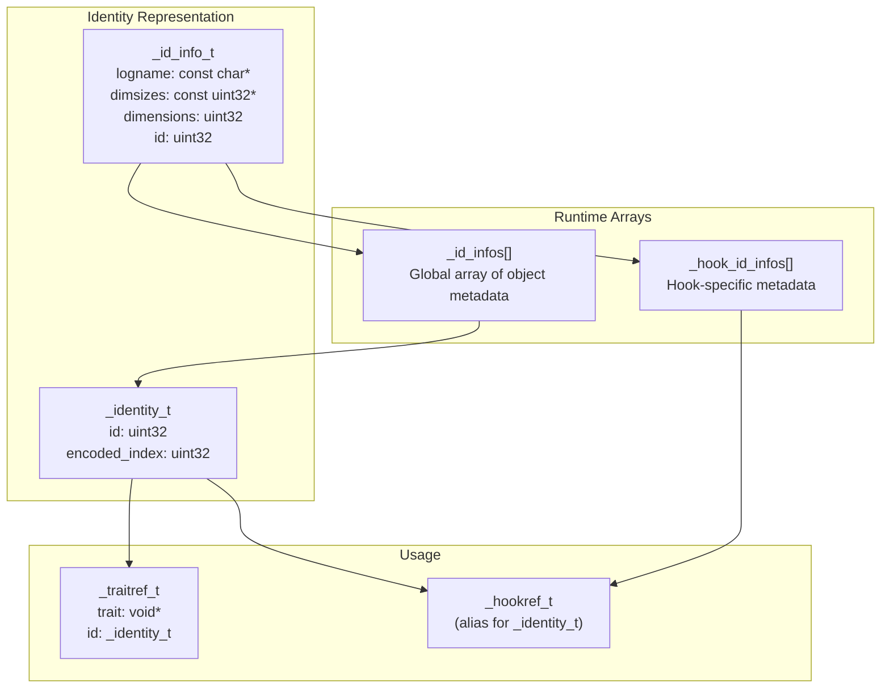
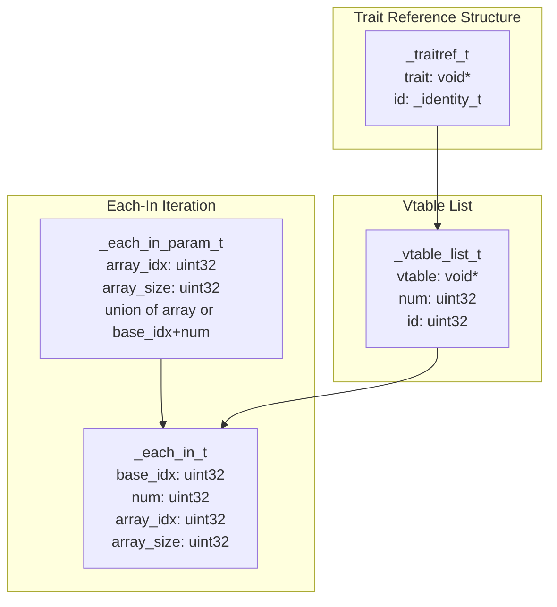
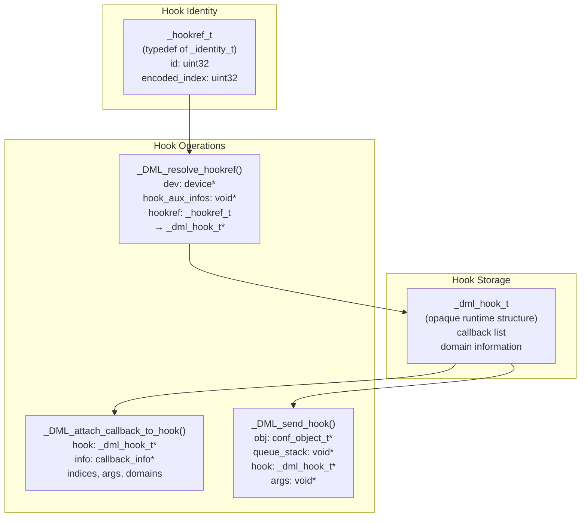
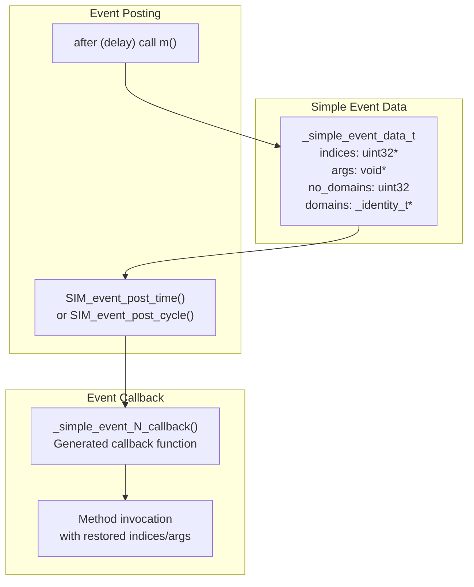
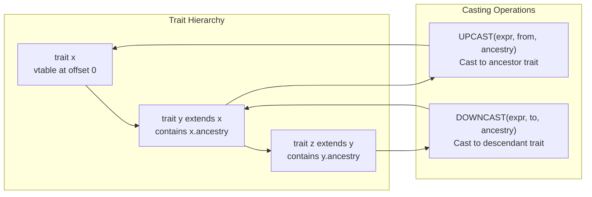
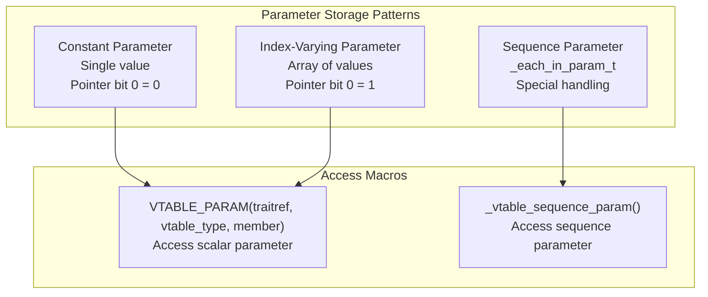
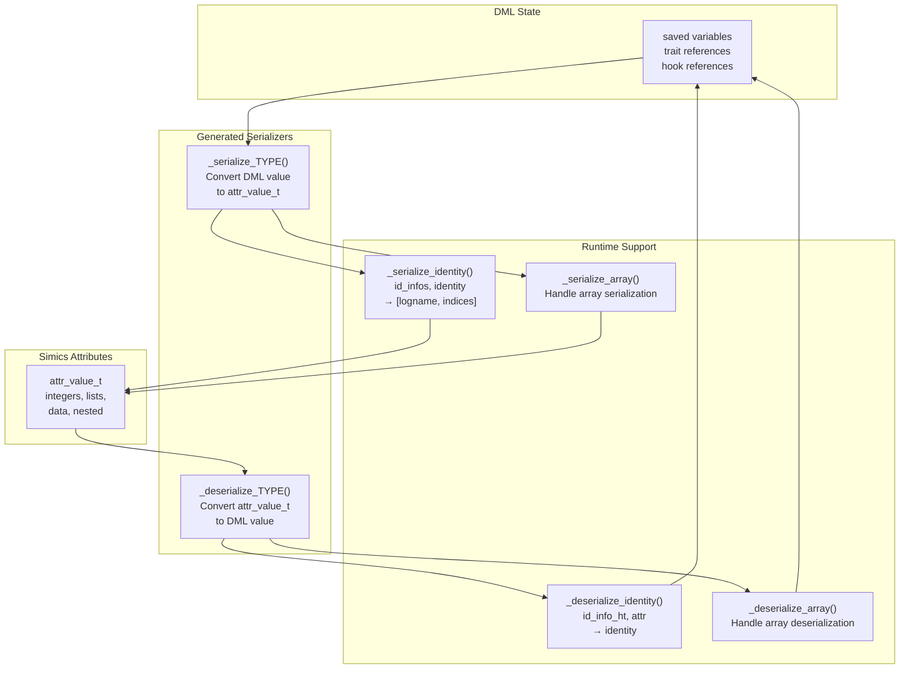
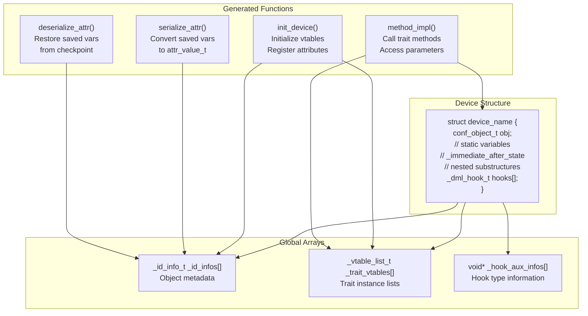

# Runtime Support (dmllib.h)

<details>
<summary>Relevant source files</summary>

The following files were used as context for generating this wiki page:

- [include/simics/dmllib.h](include/simics/dmllib.h)
- [py/dml/c_backend.py](py/dml/c_backend.py)
- [py/dml/codegen.py](py/dml/codegen.py)
- [py/dml/ctree.py](py/dml/ctree.py)
- [py/dml/ctree_test.py](py/dml/ctree_test.py)
- [py/dml/expr.py](py/dml/expr.py)
- [py/dml/objects.py](py/dml/objects.py)
- [py/dml/serialize.py](py/dml/serialize.py)
- [test/1.4/serialize/T_saved_declaration.dml](test/1.4/serialize/T_saved_declaration.dml)
- [test/1.4/serialize/T_saved_declaration.py](test/1.4/serialize/T_saved_declaration.py)

</details>


## Purpose and Scope

The runtime support library (`dmllib.h`) provides C-level infrastructure that generated DML device models depend on at runtime. This header defines core data structures, macros, and utility functions that enable trait dispatch, object identity tracking, hook management, event handling, and serialization support within the Simics simulator environment.

This page documents the runtime library interface and data structures. For the code generation process that produces C code using these facilities, see [C Code Generation Backend](#5.5). For serialization implementation details, see [Serialization and Checkpointing](#6.1).

## Core Data Structures

The runtime library defines several fundamental types used throughout generated device code to represent DML concepts in C.

### Identity System

The identity system allows runtime identification and resolution of DML objects across the device hierarchy.



**Sources:** [include/simics/dmllib.h:209-227]()

The `_identity_t` structure encodes both an object's unique ID and its position within array dimensions:
- `id` - Unique identifier for the object type (matches index in `_id_infos` array)
- `encoded_index` - Flattened array index for multi-dimensional object arrays

The `_id_info_t` structure provides metadata about each object type:
- `logname` - Format string for object's qualified name (e.g., "bank[%u].reg[%u]")
- `dimsizes` - Array dimensions for this object type
- `dimensions` - Number of array dimensions
- `id` - Same as the `id` field in `_identity_t`

### Trait References and Vtables

Trait references enable dynamic dispatch in DML's trait system by combining a vtable pointer with object identity.



**Sources:** [include/simics/dmllib.h:222-263]()

The `_traitref_t` type represents a reference to a trait implementation:
- `trait` - Pointer to vtable struct containing method pointers and parameters
- `id` - Identity of the specific object instance implementing the trait

The `_vtable_list_t` describes all instances of a trait in a specific object:
- `vtable` - Pointer to the trait's vtable structure
- `num` - Total number of trait instances (product of object's dimensions)
- `id` - Object type identifier

The `_each_in_t` and `_each_in_param_t` structures support iteration over trait sequences ("each T in ..."):
- Used by `foreach` statements over trait sequences
- Handle partial array indexing and iteration bounds

### Hook References

Hook references identify specific hook instances for callback attachment and invocation.



**Sources:** [include/simics/dmllib.h:226](), [include/simics/dmllib.h:759-789]()

The `_hookref_t` type is an alias for `_identity_t` used for hook references. The runtime provides:
- `_DML_resolve_hookref()` - Convert a hook reference to a runtime hook pointer
- `_DML_attach_callback_to_hook()` - Register an "after on" callback
- `_DML_send_hook()` - Invoke all callbacks attached to a hook

### Event Data

Event data structures support DML's timed callback mechanism (`after` statements).



**Sources:** [include/simics/dmllib.h:836-843]()

The `_simple_event_data_t` structure stores information needed to invoke a delayed callback:
- `indices` - Array indices for the method being called
- `args` - Serialized method arguments
- `no_domains` - Number of domain identities
- `domains` - Array of domain identities for domain-specific execution

## Helper Macros

The runtime library provides extensive macro support for working with traits, vtables, and object identity.

### Trait Casting Operations



**Sources:** [include/simics/dmllib.h:279-296]()

**`UPCAST(expr, from, ancestry)`** - Convert a trait reference to an ancestor trait type by adjusting the vtable pointer using the offset of the ancestry field.

Example: If trait `y` extends `z`, and `x` extends `y`, then `UPCAST(xyz, x, y.z)` produces a reference to trait `z`.

**`DOWNCAST(expr, to, ancestry)`** - Convert a trait reference from an ancestor back to a descendant type by subtracting the offset. This is similar to the `container_of` pattern in Linux kernel code.

### Trait Method Invocation

**Sources:** [include/simics/dmllib.h:298-310]()

The library provides macros for calling trait methods through vtables:

| Macro | Purpose |
|-------|---------|
| `CALL_TRAIT_METHOD(type, method, dev, traitref, ...)` | Call non-independent trait method with device context |
| `CALL_TRAIT_METHOD0(type, method, dev, traitref)` | Zero-argument variant |
| `CALL_INDEPENDENT_TRAIT_METHOD(type, method, traitref, ...)` | Call independent trait method (no device context) |
| `CALL_INDEPENDENT_TRAIT_METHOD0(type, method, traitref)` | Zero-argument independent variant |

All variants safely extract the vtable pointer and pass the trait reference to ensure proper identity is maintained.

### Vtable Parameter Access

The runtime library provides sophisticated support for accessing parameters stored in vtables, which may vary across object indices.



**Sources:** [include/simics/dmllib.h:318-356]()

**`VTABLE_PARAM(traitref, vtable_type, member)`** - Access a parameter value from a vtable. The macro handles two storage patterns:
- **Constant parameters** - Pointer's bit 0 is clear; dereference directly
- **Varying parameters** - Pointer's bit 0 is set; index by `encoded_index`

This encoding allows efficient storage: parameters that don't vary across indices occupy a single value, while varying parameters use arrays.

**`_vtable_sequence_param(traitref, vtable_member_offset)`** - Access sequence-valued parameters. Handles three cases:
- General case with array of `_each_in_t` structures
- Common case `each T in this` where array_idx is encoded_index
- Literal sequences that don't depend on index

**`VTABLE_SESSION(dev, traitref, vtable_type, member, var_type)`** - Access session variable storage by computing device offset plus encoded index.

**`VTABLE_HOOK(traitref, vtable_type, member, coeff, offset)`** - Create a hook reference from vtable information with index scaling.

## Utility Functions

The runtime library provides various utility functions for safe arithmetic and data manipulation.

### Safe Arithmetic Operations

**Sources:** [include/simics/dmllib.h:80-174]()

To prevent undefined behavior in C, dmllib.h provides wrappers for operations that can have undefined results:

| Function | Purpose |
|----------|---------|
| `DML_shlu(a, b)` | Unsigned left shift (returns 0 if b > 63) |
| `DML_shl(a, b, file, line)` | Signed left shift with negative check |
| `DML_shru(a, b)` | Unsigned right shift |
| `DML_shr(a, b, file, line)` | Signed right shift with negative check |
| `DML_divu(a, b, file, line)` | Unsigned division with zero check |
| `DML_div(a, b, file, line)` | Signed division with zero check |
| `DML_modu(a, b, file, line)` | Unsigned modulo with zero check |
| `DML_mod(a, b, file, line)` | Signed modulo with zero check |

Functions that take `file` and `line` parameters call `_DML_fault()` on error, which triggers a critical error in Simics.

### Mixed-Signedness Comparisons

**Sources:** [include/simics/dmllib.h:176-206]()

Comparing signed and unsigned values in C can produce unexpected results. The library provides:

- `DML_lt_iu(int64 a, uint64 b)` - True if signed `a` < unsigned `b`
- `DML_lt_ui(uint64 a, int64 b)` - True if unsigned `a` < signed `b`
- `DML_leq_iu(int64 a, uint64 b)` - True if signed `a` ≤ unsigned `b`
- `DML_leq_ui(uint64 a, int64 b)` - True if unsigned `a` ≤ signed `b`
- `DML_eq(uint64 a, uint64 b)` - True if values are equal and neither is negative

These functions correctly handle cases where mixing signed and unsigned values would otherwise produce incorrect comparisons.

### Endian Conversion

**Sources:** [include/simics/dmllib.h:369-616]()

The library defines inline functions for loading and storing values with specific endianness:

```c
// Pattern: _raw_load_{type}_{endian}_t
_raw_load_uint8_be_t(addr)
_raw_load_uint16_le_t(addr)
_raw_load_int32_be_t(addr)
_raw_load_uint64_le_t(addr)

// Pattern: _raw_store_{type}_{endian}_t
_raw_store_uint8_be_t(addr, value)
_raw_store_int16_le_t(addr, value)
_raw_store_uint32_be_t(addr, value)
```

These functions handle:
- Standard sizes: 8, 16, 32, 64 bits
- Non-standard sizes: 24, 40, 48, 56 bits
- Both big-endian (be) and little-endian (le) variants
- Both signed and unsigned types

## Serialization Support

The runtime library provides infrastructure for checkpointing device state by serializing DML values to Simics attribute values.

### Serialization Data Flow



**Sources:** [include/simics/dmllib.h:820-970](), [py/dml/serialize.py:1-600]()

### Identity Serialization

The runtime provides functions to serialize object identities and trait/hook references:

**`_serialize_identity(id_infos, identity)`** - Converts an `_identity_t` to an attribute value `[logname, [indices...]]`:
- Uses `id_infos` array to look up object metadata
- Formats logname string with decoded array indices
- Returns a two-element list suitable for checkpointing

**`_deserialize_identity(id_info_ht, attr, out_identity)`** - Reconstructs an identity from checkpoint:
- Uses hash table to map logname strings to id_info entries
- Decodes indices from attribute list
- Validates dimensions match expected object

**`_deserialize_trait_reference(id_info_ht, vtable_ht, trait_name, attr, out_traitref)`** - Deserializes trait references by combining identity deserialization with vtable lookup.

**`_deserialize_hook_reference(id_info_ht, hook_aux_infos, expected_typeseq_uniq, attr, out_hookref)`** - Deserializes hook references with type validation.

### Array Serialization

**`_serialize_array(data, sizeof_elem, dimsizes, ndims, elem_serializer)`** - Recursively serializes multi-dimensional arrays:
- Creates nested lists matching array structure
- Handles byte arrays specially (as data instead of integer lists)
- Allows NULL `elem_serializer` for uint8 arrays

**`_deserialize_array(attr, data, sizeof_elem, dimsizes, ndims, elem_deserializer, elems_are_bytes)`** - Reconstructs arrays from checkpoint:
- Validates list structure matches expected dimensions
- Handles both list and data formats for byte arrays
- Returns `Sim_Set_Ok` on success or error code on failure

## Integration with Generated Code

Generated device code extensively uses dmllib.h facilities throughout the compilation pipeline.

### Generated Code Patterns



**Sources:** [py/dml/c_backend.py:116-224](), [py/dml/c_backend.py:386-450]()

### Trait Method Implementation

When generating code for trait method calls, the compiler uses macros from dmllib.h:

```c
// Example generated trait method call
_traitref_t trait_ref = /* ... */;
CALL_TRAIT_METHOD(my_trait, method_name, _dev, trait_ref, arg1, arg2);

// Accessing trait parameters
int param_value = VTABLE_PARAM(trait_ref, struct _my_trait, param_name);

// Accessing session variables
int *session_var = VTABLE_SESSION(_dev, trait_ref, 
                                   struct _my_trait, 
                                   offset_member, int*);
```

**Sources:** [py/dml/codegen.py:621-697]()

### Event Callback Generation

For `after` statements that invoke methods, the compiler generates callback functions using runtime structures:

```c
static void _simple_event_N_callback(conf_object_t *obj, 
                                     lang_void *data) {
    device_t *_dev = (device_t*)obj;
    _simple_event_data_t *_data = (_simple_event_data_t*)data;
    
    // Extract indices and arguments
    uint32 *indices = _data->indices;
    args_type *args = (args_type*)_data->args;
    
    // Call method with restored context
    method_impl(_dev, indices[0], indices[1], 
                args->arg1, args->arg2);
    
    // Free allocated memory
    MM_FREE(_data->indices);
    MM_FREE(_data->args);
    MM_FREE(_data);
}
```

**Sources:** [py/dml/codegen.py:595-626](), [py/dml/ctree.py:697-757]()

### Hook Operations

Generated code for hook operations uses runtime support:

```c
// Posting callback to hook with 'after on'
_dml_hook_t *hook = _DML_resolve_hookref(_dev, _hook_aux_infos, hookref);
_DML_attach_callback_to_hook(hook, &_after_on_hook_infos[N],
                              indices, num_indices,
                              args, domains, num_domains);

// Sending hook immediately
_DML_send_hook(&_dev->obj, &_dev->_detached_hook_queue_stack,
               hook_ptr, args);
```

**Sources:** [py/dml/ctree.py:759-818](), [include/simics/dmllib.h:759-789]()

### Serialization Integration

The compiler generates attribute getter/setter functions that use serialization support:

```c
attr_value_t get_saved_var(conf_object_t *obj, lang_void *aux) {
    device_t *_dev = (device_t*)obj;
    attr_value_t result;
    
    // Use generated serializer
    result = _serialize_TYPE(&_dev->saved_var);
    return result;
}

set_error_t set_saved_var(conf_object_t *obj, 
                          attr_value_t *val, 
                          lang_void *aux) {
    device_t *_dev = (device_t*)obj;
    set_error_t status;
    
    // Use generated deserializer
    status = _deserialize_TYPE(*val, &_dev->saved_var);
    return status;
}
```

**Sources:** [py/dml/c_backend.py:388-505](), [py/dml/serialize.py:134-360]()