# Advanced Topics

Relevant source files

The following files were used as context for generating this wiki page:

- [RELEASENOTES-1.2.md](RELEASENOTES-1.2.md)
- [RELEASENOTES-1.4.md](RELEASENOTES-1.4.md)
- [RELEASENOTES.md](RELEASENOTES.md)
- [include/simics/dmllib.h](include/simics/dmllib.h)
- [py/dml/c_backend.py](py/dml/c_backend.py)
- [py/dml/codegen.py](py/dml/codegen.py)
- [py/dml/ctree.py](py/dml/ctree.py)
- [py/dml/ctree_test.py](py/dml/ctree_test.py)
- [py/dml/expr.py](py/dml/expr.py)
- [py/dml/objects.py](py/dml/objects.py)
- [py/dml/serialize.py](py/dml/serialize.py)
- [test/1.4/serialize/T_saved_declaration.dml](test/1.4/serialize/T_saved_declaration.dml)
- [test/1.4/serialize/T_saved_declaration.py](test/1.4/serialize/T_saved_declaration.py)

This page covers advanced DML features that involve sophisticated runtime behavior and code generation. These topics require understanding of DML's compilation pipeline and runtime support infrastructure.

The advanced features documented here include:
- **Serialization and Checkpointing** ([6.1](#6.1)): Converting DML state to/from `attr_value_t` for checkpointing
- **Event and Hook System** ([6.2](#6.2)): Delayed execution mechanisms including `after` statements and hooks
- **Trait System Implementation** ([6.3](#6.3)): Runtime polymorphism through vtables and identity tracking
- **Breaking Changes and Compatibility** ([6.4](#6.4)): Version management across DML 1.2/1.4 and Simics API versions

For basic language concepts, see [DML Language Reference](#3). For standard library usage, see [Standard Library](#4). For compiler internals not related to these runtime features, see [Compiler Architecture](#5).

## Overview of Advanced Runtime Features

The DML compiler generates C code that interfaces with the `dmllib.h` runtime library to support advanced features. These features share common infrastructure for object identity tracking, type serialization, and delayed execution.

### Runtime Support Architecture

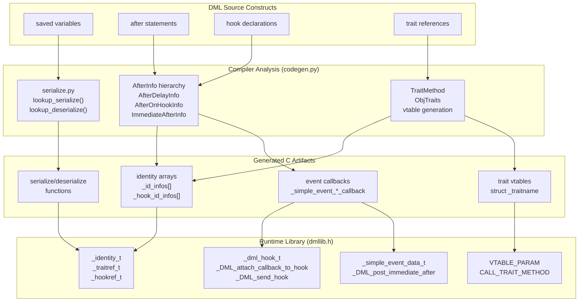

Sources: [py/dml/serialize.py:1-856](), [py/dml/codegen.py:421-667](), [py/dml/c_backend.py:1-3143](), [include/simics/dmllib.h:1-1370]()

### Identity System Foundation

All advanced features rely on the identity system to track objects at runtime. Each object that can be referenced (via traits, hooks, or serialization) is assigned a unique ID stored in `_id_info_t` structures.

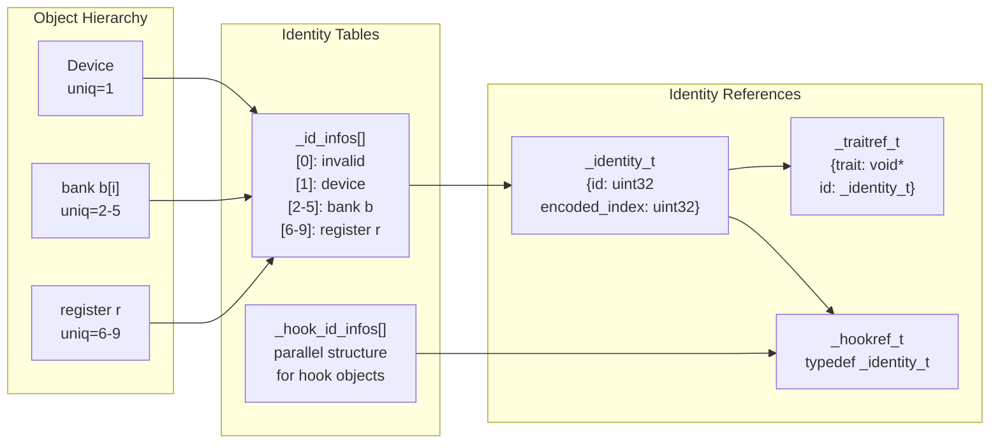

Sources: [include/simics/dmllib.h:209-226](), [py/dml/objects.py:194-239](), [py/dml/c_backend.py:116-223]()

The `uniq` property on `CompositeObject` instances ([py/dml/objects.py:238]()) is set during code generation and corresponds to the index into `_id_infos` plus one (zero is reserved for invalid references).

## Serialization System

The serialization system converts DML values to and from `attr_value_t` for checkpointing. The compiler generates specialized serialization functions for each unique type encountered in `saved` variables or `after` statement arguments.

### Type-Specific Serialization

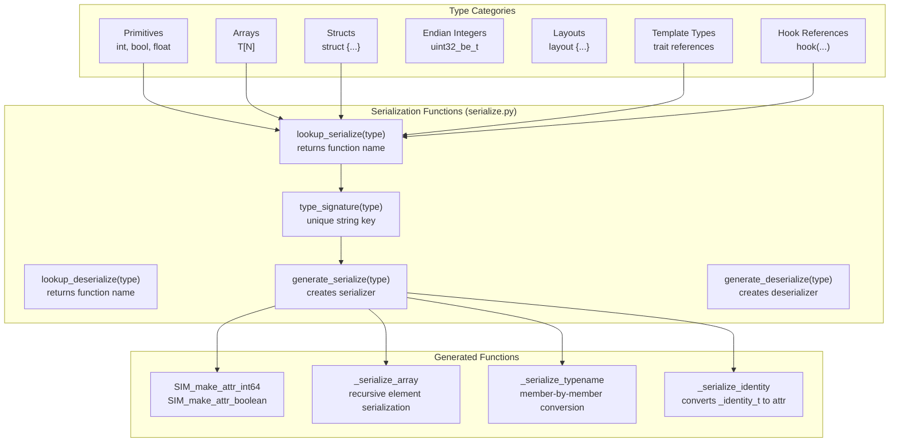

Sources: [py/dml/serialize.py:36-75](), [py/dml/serialize.py:133-218](), [py/dml/serialize.py:429-581]()

### Saved Variable Attributes

For each `saved` variable, DMLC generates getter and setter attributes that invoke the appropriate serialization functions:

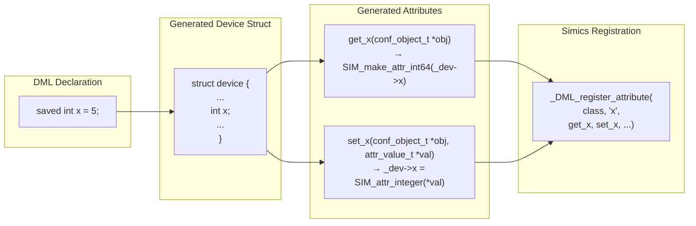

Sources: [py/dml/c_backend.py:387-450](), [py/dml/c_backend.py:452-505](), [test/1.4/serialize/T_saved_declaration.dml:16-25]()

### Special Cases

**Array Serialization**: The final dimension of `uint8` arrays is serialized as `data` attribute values rather than integer lists for efficiency ([py/dml/serialize.py:166-187]()).

**Layout Serialization**: Layout types are serialized by converting to/from byte arrays, handling endianness and member alignment ([py/dml/serialize.py:507-546]()).

**Identity Serialization**: Trait references and hook references serialize their `_identity_t` component using `_serialize_identity()` which stores the object's logname format string and indices ([py/dml/serialize.py:196-213](), [include/simics/dmllib.h:846-916]()).

## Event and Hook System

DML provides three mechanisms for delayed execution: time-based `after`, hook-based `after`, and immediate `after`. Each has different scheduling semantics and generated code patterns.

### After Statement Variants

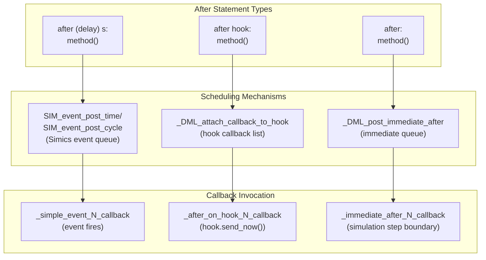

Sources: [py/dml/ctree.py:697-818](), [py/dml/codegen.py:461-667](), [include/simics/dmllib.h:1047-1177]()

### After Delay Implementation

Time-based `after` statements compile to Simics event postings with serialized arguments:

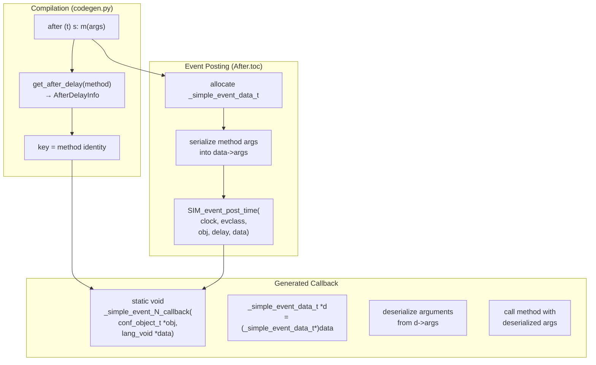

Sources: [py/dml/codegen.py:595-626](), [py/dml/ctree.py:697-756](), [include/simics/dmllib.h:1047-1084]()

The `AfterDelayInfo` class ([py/dml/codegen.py:495-529]()) stores metadata about the callback including argument types and dimensions. Each unique method+arguments combination gets its own event class and callback function.

### Hook-Based After Implementation

Hook-based `after` statements attach callbacks to hook objects that execute when `send_now()` is called:

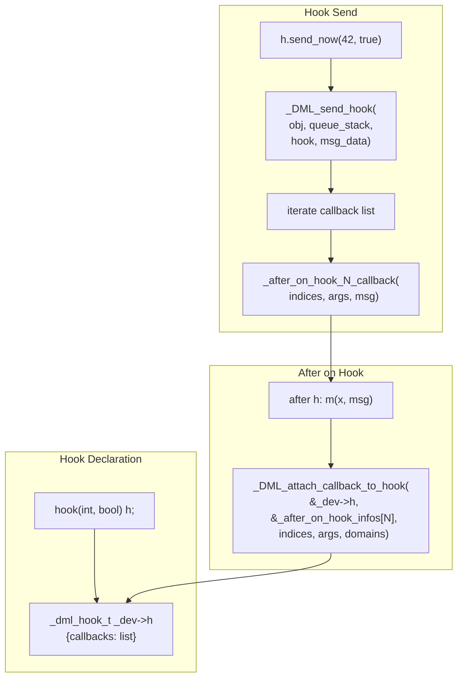

Sources: [py/dml/ctree.py:764-789](), [py/dml/codegen.py:531-582](), [include/simics/dmllib.h:1086-1133]()

The `AfterOnHookInfo` hierarchy ([py/dml/codegen.py:531-582]()) handles two cases:
1. `AfterOnHookIntoMethodInfo`: Target is a method call
2. Hook messages can be passed to the callback via `param_to_msg_comp` mapping

Hook callbacks support serialization for checkpointing, requiring complex bookkeeping in `_after_on_hook_state_t` structures ([include/simics/dmllib.h:1107-1133]()).

### Immediate After Implementation

Immediate `after` defers execution until the current device entry completes:

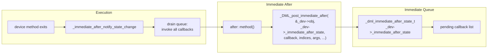

Sources: [py/dml/ctree.py:792-817](), [py/dml/codegen.py:583-593](), [include/simics/dmllib.h:1135-1177]()

Immediate after uses a simpler queue structure since callbacks execute within the same simulation cycle and don't require checkpointing.

## Trait System Runtime

Traits provide polymorphism in DML through vtable-based dispatch. Each trait reference is a `_traitref_t` containing a vtable pointer and object identity.

### Vtable Structure

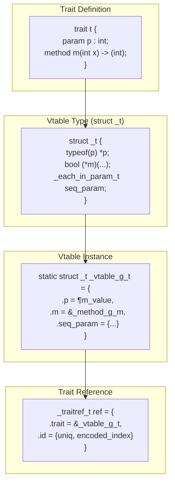

Sources: [py/dml/traits.py:1-951](), [py/dml/c_backend.py:2191-2288](), [include/simics/dmllib.h:223-324]()

### Parameter Access

Parameters in vtables are stored with a tagged pointer scheme to handle both constant and index-varying values:

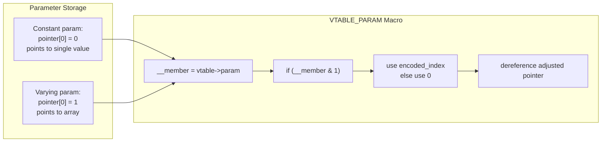

Sources: [include/simics/dmllib.h:312-324](), [py/dml/c_backend.py:2219-2288]()

The least significant bit serves as a tag because parameter values are always aligned to at least 2 bytes.

### Method Dispatch

Calling a trait method requires dereferencing the vtable function pointer:

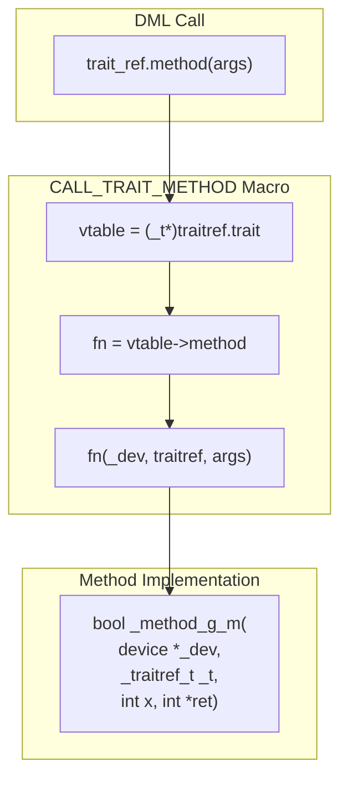

Sources: [include/simics/dmllib.h:298-310](), [py/dml/codegen.py:1887-2056]()

Independent trait methods (those marked `independent`) don't receive `_dev` parameter and can operate without device context ([py/dml/codegen.py:330-385]()).

### Trait Casting and Ancestry

Traits support inheritance, requiring upcasting and downcasting between related trait types:

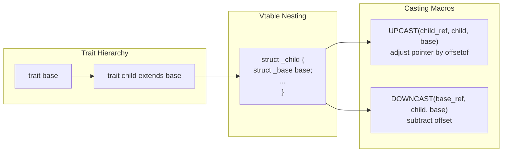

Sources: [include/simics/dmllib.h:274-296](), [py/dml/traits.py:573-677]()

The vtable for a derived trait embeds the base trait's vtable as its first member, enabling pointer arithmetic for casting.

## Breaking Changes and Compatibility

DML manages compatibility across language versions (1.2 vs 1.4) and Simics API versions (4.8, 5, 6, 7) through feature flags and compatibility layers.

### Compatibility Architecture

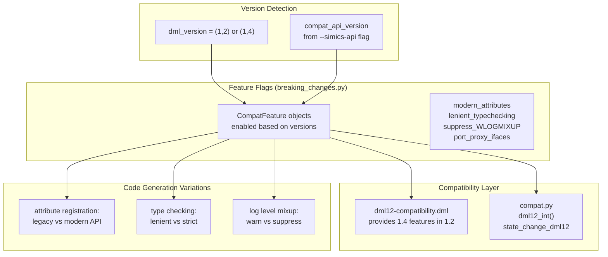

Sources: [py/dml/breaking_changes.py:1-465](), [py/dml/compat.py:1-77](), [RELEASENOTES-1.4.md:1-588]()

### Breaking Change Mechanism

The `CompatFeature` class represents a specific compatibility feature that can be enabled or disabled:

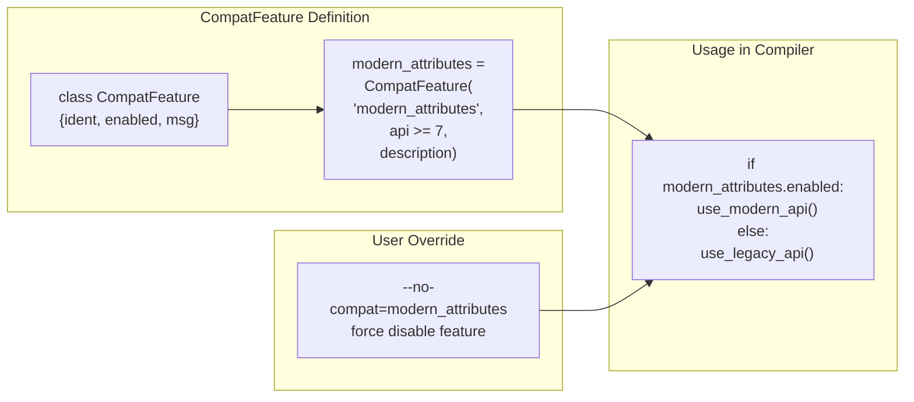

Sources: [py/dml/breaking_changes.py:46-142](), [py/dml/c_backend.py:264-265]()

Key compatibility features:

| Feature | Default Enabled | Purpose |
|---------|-----------------|---------|
| `modern_attributes` | API >= 8 | Use modern attribute registration API without dictionary support |
| `lenient_typechecking` | API <= 7 | Allow loose pointer type conversions |
| `suppress_WLOGMIXUP` | API <= 6 | Don't warn about log level/group confusion |
| `port_proxy_ifaces` | API < ∞ | Generate interface trampolines for port arrays |
| `legacy_attributes` | API <= 7 | Use legacy attribute registration API |

Sources: [py/dml/breaking_changes.py:263-465](), [RELEASENOTES.md:168-170]()

### DML 1.2/1.4 Interoperability

The `dml12-compatibility.dml` library enables DML 1.4 code to be imported from DML 1.2 devices:

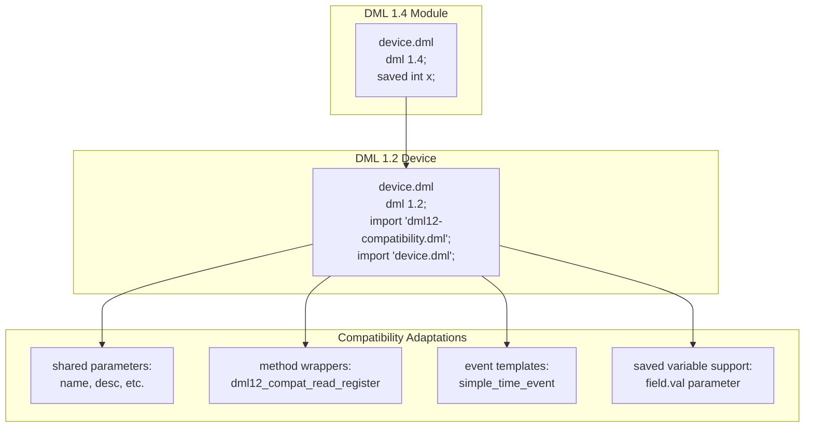

Sources: [lib/1.4/dml12-compatibility.dml:1-1084](), [RELEASENOTES.md:62-66](), [RELEASENOTES-1.2.md:86-118]()

The compatibility layer works by:
1. Defining 1.4-style templates that work in 1.2 context
2. Providing shared parameters that both versions can access
3. Wrapping method signatures to handle different calling conventions
4. Translating event semantics between versions

This allows gradual migration where parts of a device are converted to 1.4 while the main device remains in 1.2.

Sources: [lib/1.4/dml12-compatibility.dml:1-1084](), [py/dml/compat.py:1-77](), [RELEASENOTES-1.2.md:1-121](), [RELEASENOTES-1.4.md:1-588]()