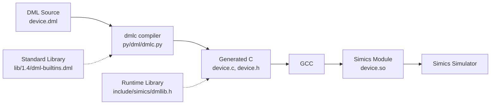
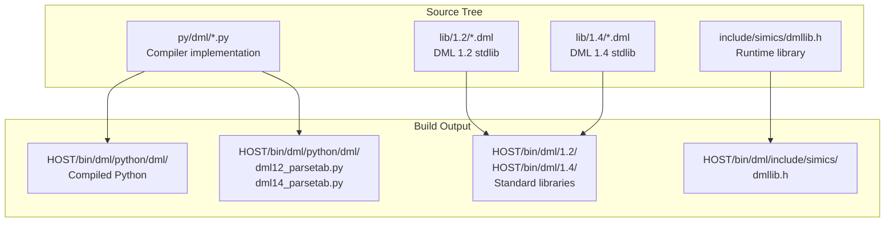
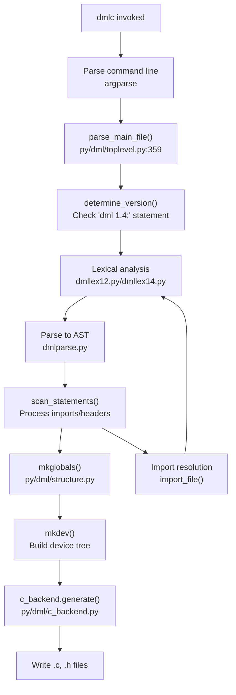
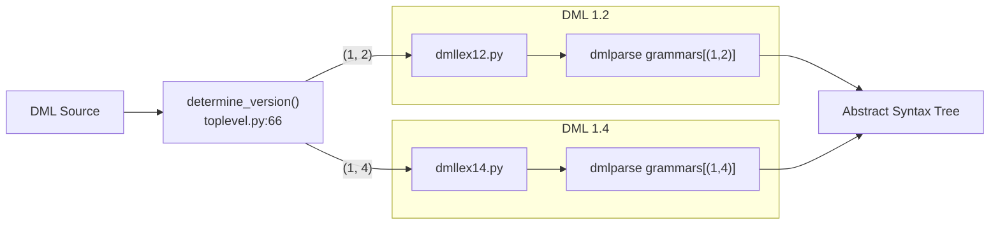
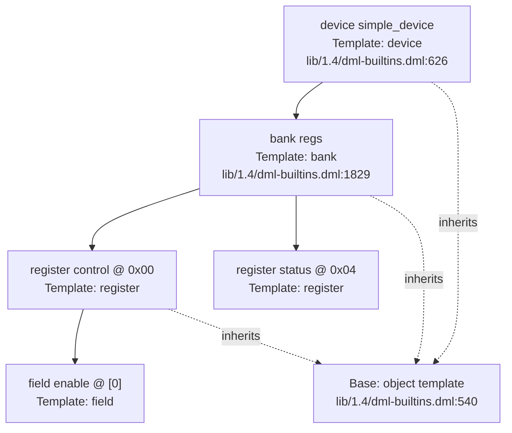
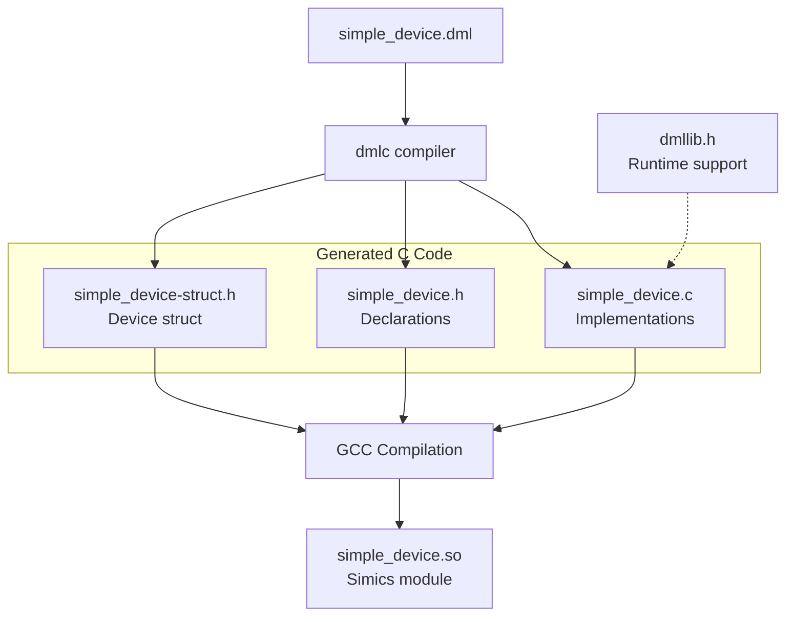

# Getting Started

<details>
<summary>Relevant source files</summary>

The following files were used as context for generating this wiki page:

- [MODULEINFO](MODULEINFO)
- [Makefile](Makefile)
- [deprecations_to_md.py](deprecations_to_md.py)
- [lib/1.2/dml-builtins.dml](lib/1.2/dml-builtins.dml)
- [lib/1.4/dml-builtins.dml](lib/1.4/dml-builtins.dml)
- [md_to_github.py](md_to_github.py)
- [py/dml/breaking_changes.py](py/dml/breaking_changes.py)
- [py/dml/dmlc.py](py/dml/dmlc.py)
- [py/dml/globals.py](py/dml/globals.py)
- [py/dml/toplevel.py](py/dml/toplevel.py)
- [validate_md_links.py](validate_md_links.py)

</details>


This page provides an introduction to using the DML (Device Modeling Language) compiler to create Simics device models. It covers installation, basic compilation commands, and creating a minimal device model. For detailed language reference, see [DML Language Reference](#3). For information about the standard library templates, see [Standard Library](#4).

## Overview of DML and the Compiler

DML is a domain-specific language for modeling hardware devices in the Simics simulator. The DML compiler (`dmlc`) translates `.dml` source files into C code that integrates with the Simics API. The compiler is implemented in Python and generates C code that links against the `dmllib.h` runtime library.

**Key Architecture Components:**



Sources: [py/dml/dmlc.py:1-811](), [lib/1.4/dml-builtins.dml:1-100](), [Makefile:1-251]()

## Prerequisites

To use the DML compiler, you need:

- Python 3 with UTF-8 mode enabled (required by [py/dml/dmlc.py:310-311]())
- GCC or compatible C compiler
- Simics installation with appropriate API version
- Access to DML standard library files

The compiler supports multiple Simics API versions (4.8, 5, 6, 7) as defined in [py/dml/breaking_changes.py:14-24]().

## Building the Compiler

The DML compiler is built as part of the Simics module system. The build process:

1. **Python Module Compilation**: Python source files from `py/dml/` are compiled and installed to `$(HOST)/bin/dml/python/dml/` using `copy_python.py` [Makefile:102-110]().

2. **Parser Table Generation**: Grammar tables are generated for DML 1.2 and 1.4 using PLY (Python Lex-Yacc) [Makefile:123-129]().

3. **Standard Library Copying**: DML library files from `lib/1.2/` and `lib/1.4/` are copied to installation directories [Makefile:148-158]().

4. **Runtime Header Installation**: The `dmllib.h` header is processed and installed [Makefile:115-116]().

**Build Directory Structure:**



Sources: [Makefile:88-97](), [MODULEINFO:28-73]()

## Command Line Interface

The compiler is invoked through `dmlc`, which is implemented as `__main__.py` calling into [py/dml/dmlc.py:308-811](). The main entry point is `main(argv)` at [py/dml/dmlc.py:308]().

**Basic Syntax:**
```
dmlc [options] input_file.dml [output_base]
```

**Essential Options:**

| Option | Description | Implementation |
|--------|-------------|----------------|
| `-I PATH` | Add import search path | [py/dml/dmlc.py:326-330]() |
| `-D NAME=VALUE` | Define compile-time parameter | [py/dml/dmlc.py:337-341]() |
| `--simics-api=VERSION` | Specify Simics API version | [py/dml/dmlc.py:441-446]() |
| `-g` | Generate debug artifacts | [py/dml/dmlc.py:382-384]() |
| `--warn=TAG` | Enable specific warning | [py/dml/dmlc.py:389-393]() |
| `--nowarn=TAG` | Disable specific warning | [py/dml/dmlc.py:398-402]() |
| `--werror` | Treat warnings as errors | [py/dml/dmlc.py:408-409]() |

The `-D` option parsing is handled by `parse_define()` at [py/dml/dmlc.py:116-147](), which accepts string, integer, float, and boolean literals.

Sources: [py/dml/dmlc.py:308-511]()

## Compilation Pipeline

The compilation process follows these stages as orchestrated by `main()` in [py/dml/dmlc.py:308-811]():



**Key Functions:**

- `parse_main_file()` [py/dml/toplevel.py:359-459]() - Entry point for parsing
- `determine_version()` [py/dml/toplevel.py:66-112]() - Extracts DML version from source
- `parse()` [py/dml/toplevel.py:114-127]() - Invokes PLY parser
- `scan_statements()` [py/dml/toplevel.py:129-186]() - Categorizes top-level statements
- `process()` [py/dml/dmlc.py:72-96]() - Creates device structure
- `generate()` [dml/c_backend.py] - Produces C code

Sources: [py/dml/dmlc.py:691-759](), [py/dml/toplevel.py:359-459]()

## Language Version Selection

DML supports two major versions: 1.2 (legacy) and 1.4 (modern). Each file must begin with a version statement:

```dml
dml 1.4;
```

The version statement is parsed by regex patterns in [py/dml/toplevel.py:34-40]():
- `has_version` matches the `dml` keyword
- `check_version` extracts major and minor version numbers

Version-specific lexers and parsers are selected in `get_parser()` [py/dml/toplevel.py:48-64](). The global version is stored in `dml.globals.dml_version` [py/dml/globals.py:29]().

**Version-Specific Parsers:**



Sources: [py/dml/toplevel.py:31-112](), [py/dml/globals.py:28-29]()

## Standard Library Import

All DML files implicitly import `dml-builtins.dml` [py/dml/toplevel.py:376-377](), which provides:

- Core templates: `device`, `bank`, `register`, `field`, `attribute`, `connect`, `event`, `port`, `group`
- Lifecycle templates: `init`, `post_init`, `destroy`
- Universal templates: `name`, `desc`, `documentation`, `object`

The standard library location is determined by adding versioned subdirectories to the import path [py/dml/toplevel.py:389-393]():
```python
import_path = [
    path
    for orig_path in explicit_import_path + [os.path.dirname(inputfilename)]
    for path in [os.path.join(orig_path, version_str), orig_path]]
```

**Import Resolution:**

| DML Version | Library Path | Key Files |
|-------------|--------------|-----------|
| 1.2 | `HOST/bin/dml/1.2/` | `dml-builtins.dml`, `utility.dml`, `simics-api.dml` |
| 1.4 | `HOST/bin/dml/1.4/` | `dml-builtins.dml`, `utility.dml`, `dml12-compatibility.dml` |

Sources: [py/dml/toplevel.py:376-393](), [lib/1.4/dml-builtins.dml:1-50](), [MODULEINFO:95-114]()

## Creating Your First Device Model

A minimal DML 1.4 device consists of:

```dml
dml 1.4;

device simple_device;

bank regs {
    register control @ 0x00 size 4 {
        field enable @ [0];
    }
    register status @ 0x04 size 4 is read_only;
}
```

**Structure Breakdown:**

1. **Version Declaration**: `dml 1.4;` - Required at file start [py/dml/toplevel.py:85-94]()
2. **Device Declaration**: `device simple_device;` - Creates the device object with `classname` parameter [lib/1.4/dml-builtins.dml:626-722]()
3. **Bank Object**: `bank regs` - Memory-mapped register bank [lib/1.4/dml-builtins.dml:1829-2215]()
4. **Register Objects**: Declared with address (`@`) and size [lib/1.4/dml-builtins.dml:2497-2917]()
5. **Field Objects**: Bit fields within registers [lib/1.4/dml-builtins.dml:3042-3241]()

**Object Hierarchy:**



Sources: [lib/1.4/dml-builtins.dml:540-578](), [lib/1.4/dml-builtins.dml:626-722](), [lib/1.4/dml-builtins.dml:1829-2215]()

## Compiling Your Device

**Compilation Command:**
```bash
dmlc --simics-api=6 simple_device.dml
```

This produces:
- `simple_device.c` - Main C implementation
- `simple_device.h` - Function declarations
- `simple_device-struct.h` - Device structure definition

**Generated Files Structure:**



The C backend generation is handled by `generate()` in [dml/c_backend.py], which produces:
- Device structure definitions
- Method wrappers for Simics API
- Attribute registration code
- Event and hook serialization

Sources: [py/dml/dmlc.py:750-759](), [py/dml/output.py]()

## Error Handling

The compiler reports errors with file location and error codes. Common error types:

| Error Type | Code | Description | Reference |
|------------|------|-------------|-----------|
| Syntax error | `ESYNTAX` | Invalid DML syntax | [py/dml/messages.py] |
| Import error | `EIMPORT` | Cannot find imported file | [py/dml/messages.py] |
| Version error | `EVERS` | Version mismatch in imports | [py/dml/messages.py] |
| No device | `EDEVICE` | Missing device declaration | [py/dml/messages.py] |

Error reporting is centralized through `logging.report()` and controlled by `--max-errors` [py/dml/dmlc.py:450-454](). Warnings can be controlled with `--warn` and `--nowarn` flags [py/dml/dmlc.py:389-402]().

Sources: [py/dml/dmlc.py:777-799](), [py/dml/logging.py]()

## Next Steps

After successfully compiling your first device:

- **Learn DML syntax**: See [Syntax and Grammar](#3.2) for language constructs
- **Explore templates**: See [Standard Library](#4) for reusable components
- **Add functionality**: See [Methods and Parameters](#3.7) for implementing behavior
- **Handle memory access**: See [Memory-Mapped I/O](#4.5) for transaction handling
- **Manage state**: See [Serialization and Checkpointing](#6.1) for save/restore

For detailed compiler architecture, see [Compiler Architecture](#5). For testing and development workflows, see [Development Guide](#7).

Sources: [py/dml/dmlc.py:1-811](), [lib/1.4/dml-builtins.dml:1-300]()