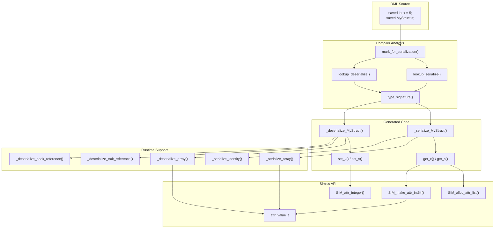
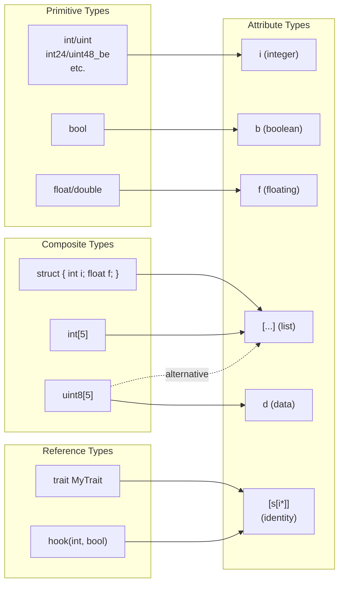
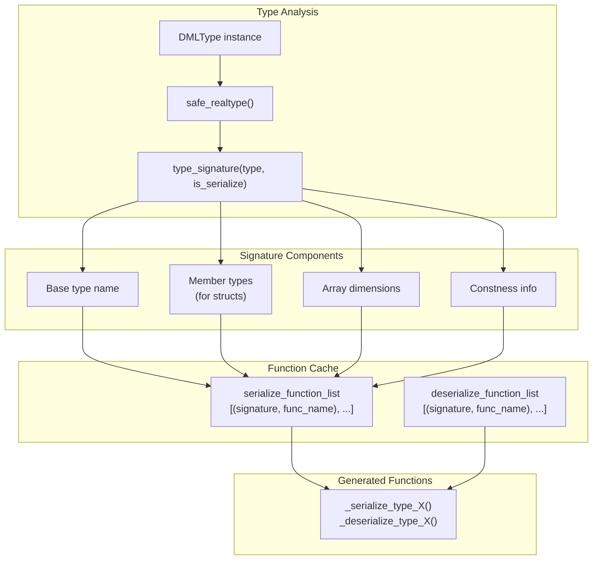
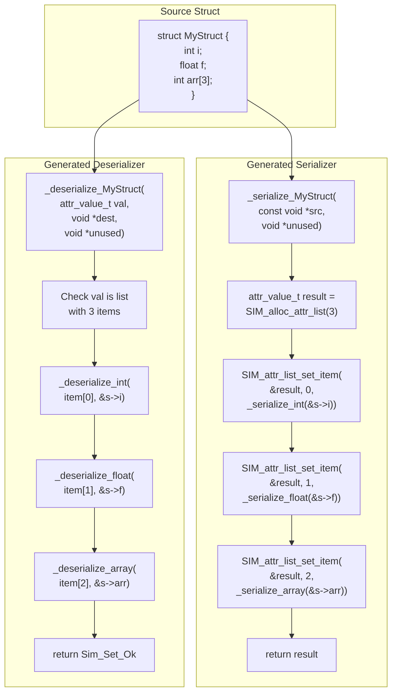
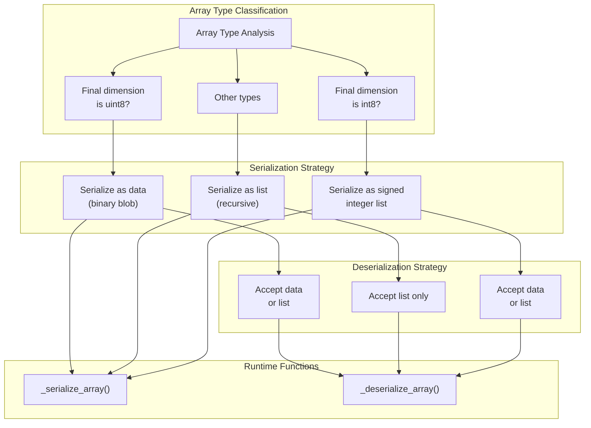
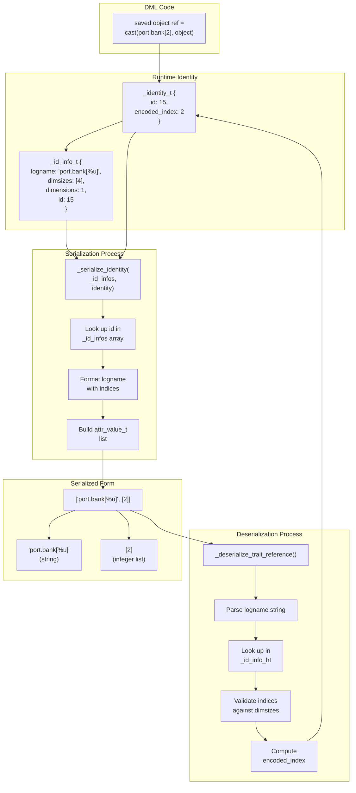
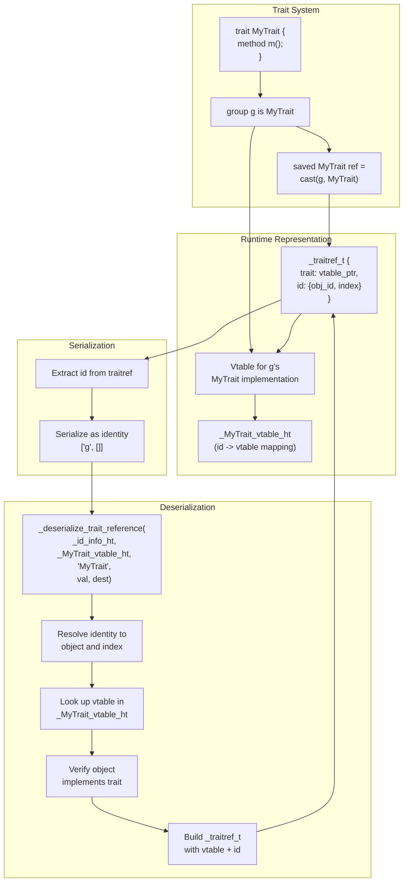
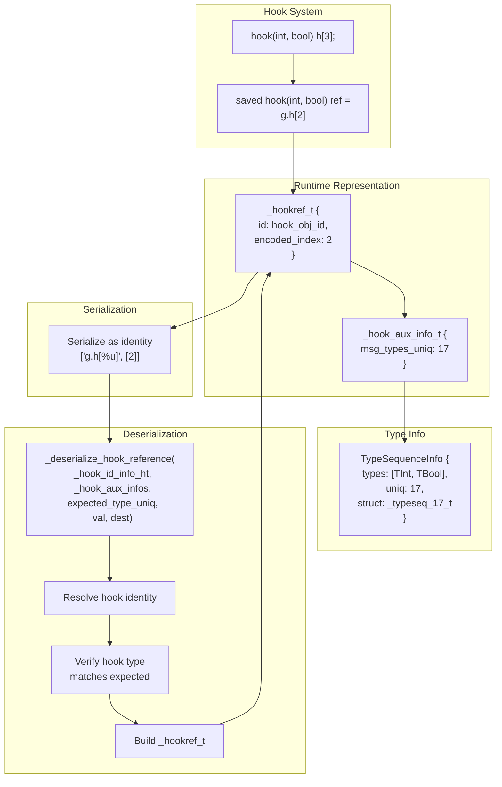
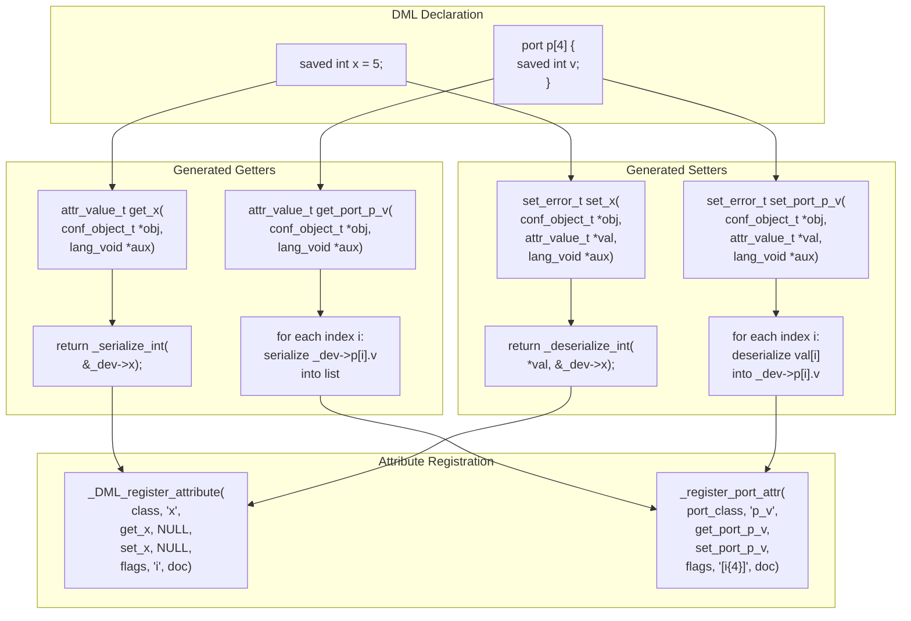
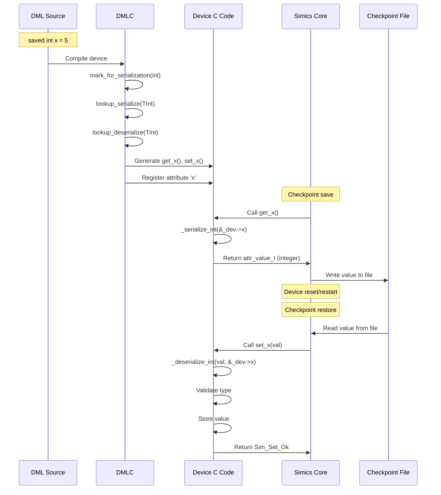

# Serialization and Checkpointing

<details>
<summary>Relevant source files</summary>

The following files were used as context for generating this wiki page:

- [include/simics/dmllib.h](include/simics/dmllib.h)
- [py/dml/c_backend.py](py/dml/c_backend.py)
- [py/dml/codegen.py](py/dml/codegen.py)
- [py/dml/ctree.py](py/dml/ctree.py)
- [py/dml/ctree_test.py](py/dml/ctree_test.py)
- [py/dml/expr.py](py/dml/expr.py)
- [py/dml/objects.py](py/dml/objects.py)
- [py/dml/serialize.py](py/dml/serialize.py)
- [test/1.4/serialize/T_saved_declaration.dml](test/1.4/serialize/T_saved_declaration.dml)
- [test/1.4/serialize/T_saved_declaration.py](test/1.4/serialize/T_saved_declaration.py)

</details>


## Purpose and Scope

This document describes the DML compiler's serialization and checkpointing system, which enables device state to be saved and restored in Simics. The system automatically generates C code to convert between DML types and Simics `attr_value_t` values, allowing device state to persist across checkpoints.

For information about the attribute system that exposes serialized state, see [Attributes and Connections](#4.6). For details on the code generation backend, see [C Code Generation Backend](#5.5).

## System Overview

The serialization system provides bidirectional conversion between DML values and Simics attribute values (`attr_value_t`). When a DML variable is marked as `saved`, the compiler generates:

1. A serialization function to convert the DML value to `attr_value_t`
2. A deserialization function to convert `attr_value_t` back to the DML value
3. Attribute getter/setter methods that use these functions
4. Runtime support code for complex types



**Sources**: [py/dml/serialize.py:1-800](), [py/dml/c_backend.py:388-633](), [include/simics/dmllib.h:1-650]()

## Type Mapping and Conversion

The `map_dmltype_to_attrtype()` function maps DML types to Simics attribute type descriptor strings:

| DML Type | Attribute Type String | Notes |
|----------|---------------------|-------|
| `int`, `uint`, endian integers | `"i"` | All integer types map to 64-bit integers |
| `bool` | `"b"` | Boolean value |
| `float`, `double` | `"f"` | Floating-point value |
| `struct` | `"[...]"` | List of member types |
| `array[N]` | `"[T{N}]"` | Fixed-length list of type T |
| `uint8 array[N]` | `"[i{N}]\|d"` | Can be data or integer list |
| `trait` references | `"[s[i*]]"` | Identity: logname string + index list |
| `hook()` references | `"[s[i*]]"` | Identity: logname string + index list |



**Sources**: [py/dml/serialize.py:362-395](), [test/1.4/serialize/T_saved_declaration.dml:1-375]()

## Serialization Function Generation

The compiler generates unique serialization/deserialization functions for each distinct type. Functions are cached using a type signature to avoid duplicates.

### Type Signature System

Each type gets a unique signature string used for caching and naming:



**Sources**: [py/dml/serialize.py:48-75](), [py/dml/serialize.py:396-462]()

### Primitive Type Serialization

For primitive types, serialization uses Simics API calls directly:

| Type | Serialization | Deserialization |
|------|---------------|-----------------|
| Signed integers | `SIM_make_attr_int64()` | `SIM_attr_integer()` |
| Unsigned integers | `SIM_make_attr_uint64()` | `SIM_attr_integer()` with cast |
| Boolean | `SIM_make_attr_boolean()` | `SIM_attr_boolean()` |
| Float/double | `SIM_make_attr_floating()` | `SIM_attr_floating()` |
| Endian integers | Convert to int first, then serialize | Deserialize int, then convert |

**Sources**: [py/dml/serialize.py:134-166](), [py/dml/serialize.py:275-287]()

### Struct Serialization

For struct types, the compiler generates functions that recursively serialize each member:



**Sources**: [py/dml/serialize.py:190-196](), [py/dml/serialize.py:306-311](), [py/dml/serialize.py:463-556]()

## Array Serialization

Arrays have special handling, particularly for byte arrays which can use the more efficient `data` attribute type.

### Array Serialization Strategy



**Sources**: [py/dml/serialize.py:166-188](), [py/dml/serialize.py:288-305](), [include/simics/dmllib.h:818-1030]()

### Multi-Dimensional Arrays

For multi-dimensional arrays, only the final dimension gets special treatment:

```
// DML declaration
saved uint8 matrix[4][3];

// Serialization produces:
// [ (data: 3 bytes), (data: 3 bytes), (data: 3 bytes), (data: 3 bytes) ]
//   ^row 0           ^row 1           ^row 2           ^row 3

// Can be deserialized from either:
// 1. Data format: [ (data), (data), (data), (data) ]
// 2. List format: [ [i, i, i], [i, i, i], [i, i, i], [i, i, i] ]
```

**Sources**: [test/1.4/serialize/T_saved_declaration.dml:50-75](), [test/1.4/serialize/T_saved_declaration.py:62-74]()

## Identity and Reference Serialization

DML supports serializing references to objects, traits, and hooks. These are serialized as "identities" consisting of a logname string and index array.

### Identity Structure

The `_identity_t` structure represents an object's identity:

```c
typedef struct {
    uint32 id;              // Unique object ID
    uint32 encoded_index;   // Flattened array index
} _identity_t;
```

The `_id_info_t` structure provides metadata for resolving identities:

```c
typedef struct {
    const char *logname;    // Format string with %u for indices
    const uint32 *dimsizes; // Array dimensions
    uint32 dimensions;      // Number of dimensions
    uint32 id;              // Object ID
} _id_info_t;
```

**Sources**: [include/simics/dmllib.h:209-219](), [py/dml/serialize.py:197-214]()

### Object Identity Serialization



**Sources**: [include/simics/dmllib.h:1031-1137](), [py/dml/serialize.py:312-336]()

### Trait Reference Serialization

Trait references serialize the object identity plus validate that the object implements the trait:



**Sources**: [py/dml/serialize.py:312-336](), [include/simics/dmllib.h:1138-1228](), [test/1.4/serialize/T_saved_declaration.dml:177-187]()

### Hook Reference Serialization

Hook references are serialized similarly to identities but with type validation:



**Sources**: [py/dml/serialize.py:337-357](), [include/simics/dmllib.h:1229-1290](), [test/1.4/serialize/T_saved_declaration.dml:189-214]()

## Attribute Integration

The serialization system integrates with the DML attribute system to provide checkpoint-able attributes.

### Attribute Getter/Setter Generation

For each `saved` variable or object, the compiler generates attribute getter and setter methods:



**Sources**: [py/dml/c_backend.py:388-450](), [py/dml/c_backend.py:452-505](), [py/dml/c_backend.py:629-633]()

### Device Structure Layout

Saved variables are stored in the device structure, with careful layout to handle arrays and nested objects:

```
Device Structure:
├── conf_object_t obj
├── Static variables
├── _immediate_after_state pointer
└── Composite objects (banks, ports, etc.)
    ├── _obj pointer (if named)
    ├── Session variables (runtime only)
    ├── Saved variables (checkpointed)
    └── Hook structures
```

**Sources**: [py/dml/c_backend.py:116-224](), [py/dml/c_backend.py:355-359]()

## Runtime Support Functions

The `dmllib.h` header provides runtime support functions used by generated code:

### Array Serialization Runtime

| Function | Purpose |
|----------|---------|
| `_serialize_array()` | Recursively serialize multi-dimensional arrays |
| `_deserialize_array()` | Recursively deserialize multi-dimensional arrays |
| Element serializer parameter | Function pointer for element-wise serialization |
| Element deserializer parameter | Function pointer for element-wise deserialization |

### Identity Resolution Runtime

| Function | Purpose |
|----------|---------|
| `_serialize_identity()` | Convert `_identity_t` to `["name[%u]", [indices]]` |
| `_deserialize_trait_reference()` | Parse identity and look up trait vtable |
| `_deserialize_hook_reference()` | Parse identity and validate hook type |
| `_id_info_ht` | Hash table mapping lognames to `_id_info_t` |
| `_MyTrait_vtable_ht` | Hash table mapping object IDs to trait vtables |
| `_hook_aux_infos` | Array of hook auxiliary info (type signatures) |

**Sources**: [include/simics/dmllib.h:818-1030](), [include/simics/dmllib.h:1031-1290]()

### Error Handling

Deserialization functions return `set_error_t` to indicate success or failure:

| Error Code | Meaning |
|------------|---------|
| `Sim_Set_Ok` | Successfully deserialized |
| `Sim_Set_Illegal_Type` | Attribute value has wrong type |
| `Sim_Set_Illegal_Value` | Value is out of range or invalid |

Serialization is expected to always succeed if the type is correctly marked as serializable.

**Sources**: [py/dml/serialize.py:220-360](), [py/dml/c_backend.py:388-450]()

## Checkpointing Flow

The complete flow from DML source to checkpoint and back:



**Sources**: [py/dml/serialize.py:1-800](), [py/dml/c_backend.py:388-677](), [test/1.4/serialize/T_saved_declaration.py:1-153]()