# Event and Hook System

<details>
<summary>Relevant source files</summary>

The following files were used as context for generating this wiki page:

- [include/simics/dmllib.h](include/simics/dmllib.h)
- [lib/1.2/dml-builtins.dml](lib/1.2/dml-builtins.dml)
- [lib/1.4/dml-builtins.dml](lib/1.4/dml-builtins.dml)
- [py/dml/c_backend.py](py/dml/c_backend.py)
- [py/dml/codegen.py](py/dml/codegen.py)
- [py/dml/ctree.py](py/dml/ctree.py)

</details>


## Purpose and Scope

This page documents DML's event and hook system, which provides mechanisms for delayed execution and callback registration. The system consists of:

- **Events**: Three forms of the `after` statement for scheduling delayed execution
- **Hooks**: Objects that allow multiple callbacks to be registered and invoked together

For information about the lifecycle methods (`init`, `post_init`, `destroy`), see [Standard Library](#4). For trait-based polymorphism, see [Trait System Implementation](#6.3).

---

## After Statement Overview

DML provides three distinct forms of the `after` statement for scheduling delayed execution:

| Form | Execution Time | Checkpointed | Use Case |
|------|---------------|--------------|----------|
| `after` delay | After time/cycle delay | Yes | Time-based device behavior |
| `after` on hook | When hook is sent | Yes | Event-driven callbacks |
| `immediate after` | Before next Simics instruction | No | Deferred side effects |

All three forms support **after domains**, which are object identity values used for selective cancellation via `cancel_after()`.

Sources: [lib/1.4/dml-builtins.dml:2906-3198](), [py/dml/ctree.py:697-817]()

---

## After with Time/Cycle Delay

### DML Syntax

```dml
after (delay_expr) seconds: callback_method(args);
after (delay_expr) cycles: callback_method(args);
after (delay_expr) s on (domain_expr): callback_method(args);
```

### Compilation Pipeline

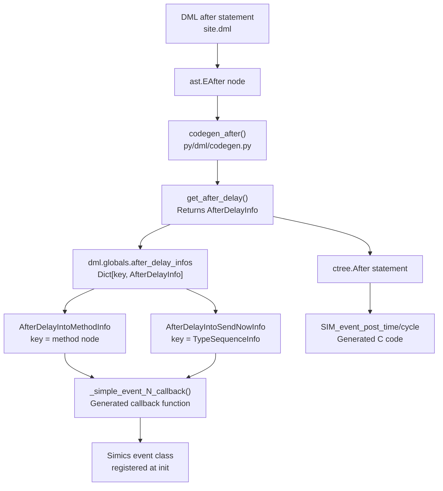

### AfterDelayInfo Structure

The compiler creates an `AfterDelayInfo` instance for each unique combination of target callback and argument types:

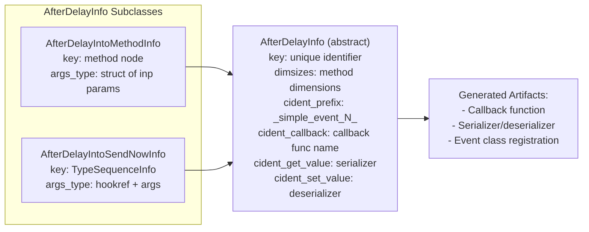

Sources: [py/dml/codegen.py:461-665](), [py/dml/ctree.py:697-756]()

### Runtime Structures

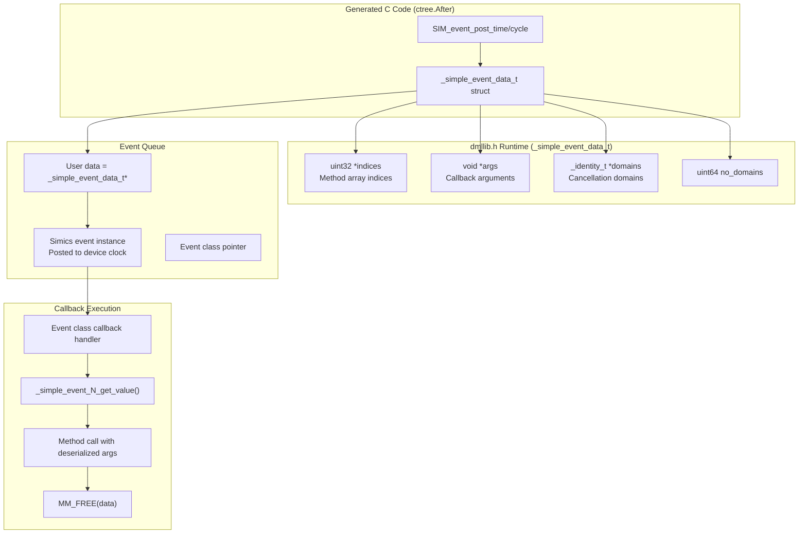

Sources: [include/simics/dmllib.h:859-967](), [py/dml/c_backend.py]()

### Event Serialization Format

Events are checkpointed using a pseudo-dictionary format in `attr_value_t`:

```
[["indices", [idx0, idx1, ...]],
 ["arguments", [arg0, arg1, ...]],
 ["domains", [domain0, domain1, ...]]]
```

Legacy format (pre-2022) is also supported for backward compatibility:
```
[[idx0, idx1, ...], [arg0, arg1, ...]]
```

Sources: [include/simics/dmllib.h:887-1015]()

---

## After on Hook

### DML Syntax

```dml
after on (hookref_expr): callback_method(args);
after on (hookref_expr) on (domain_expr): callback_method(args);
```

### Compilation Pipeline

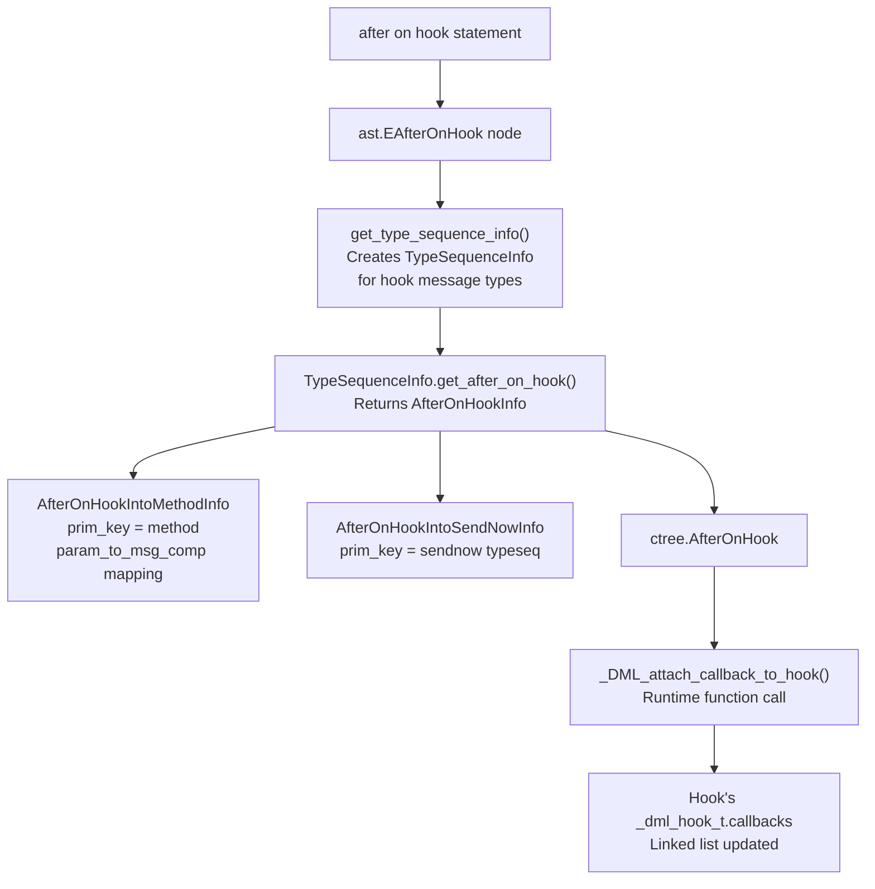

### AfterOnHookInfo Structure

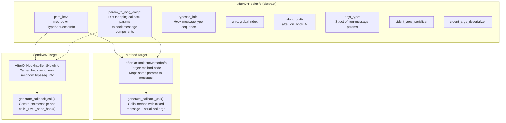

### Hook Callback Lifecycle

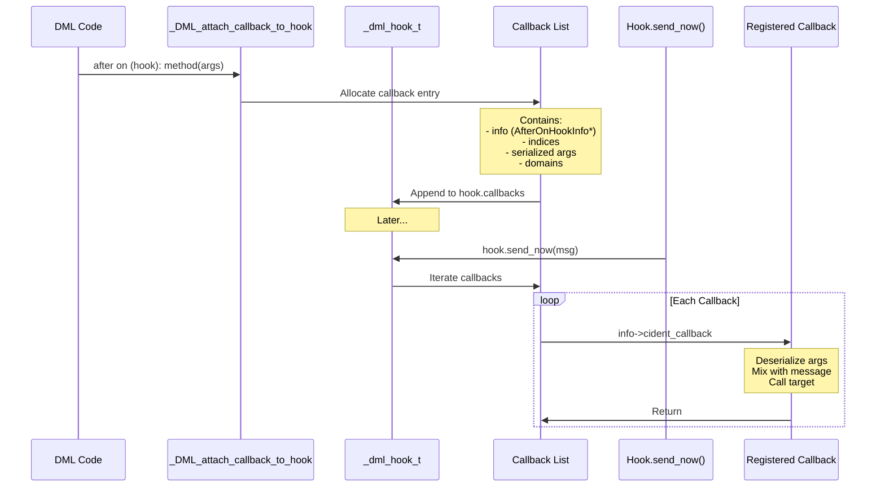

Sources: [py/dml/codegen.py:531-855](), [py/dml/ctree.py:764-790]()

---

## Immediate After

### DML Syntax

```dml
immediate after: callback_method(args);
immediate after on (domain_expr): callback_method(args);
```

Immediate after executes before the next Simics instruction step, making it suitable for deferred side effects that must complete within the current transaction context. Unlike timed events, immediate after callbacks are **not checkpointed**.

### Compilation Pipeline

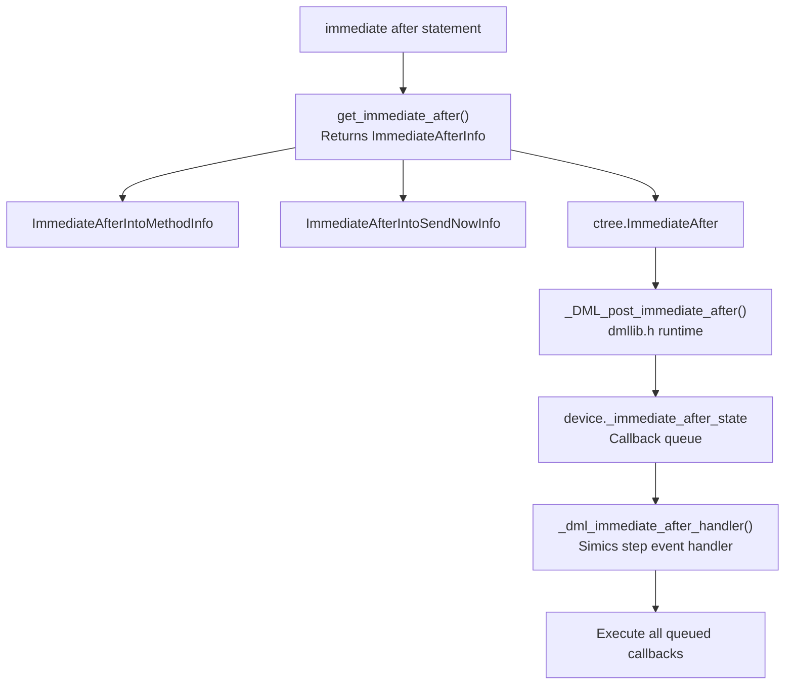

### Runtime State

The device structure contains an `_immediate_after_state` pointer managed by the runtime library:

```c
// In generated device struct
_dml_immediate_after_state_t *_immediate_after_state;
```

The runtime maintains a queue of pending callbacks that execute before the next instruction. The queue is cleared after execution and is not persisted in checkpoints.

Sources: [py/dml/codegen.py:583-903](), [py/dml/ctree.py:792-817](), [include/simics/dmllib.h]()

---

## Hook Objects and Operations

### Hook Template Hierarchy

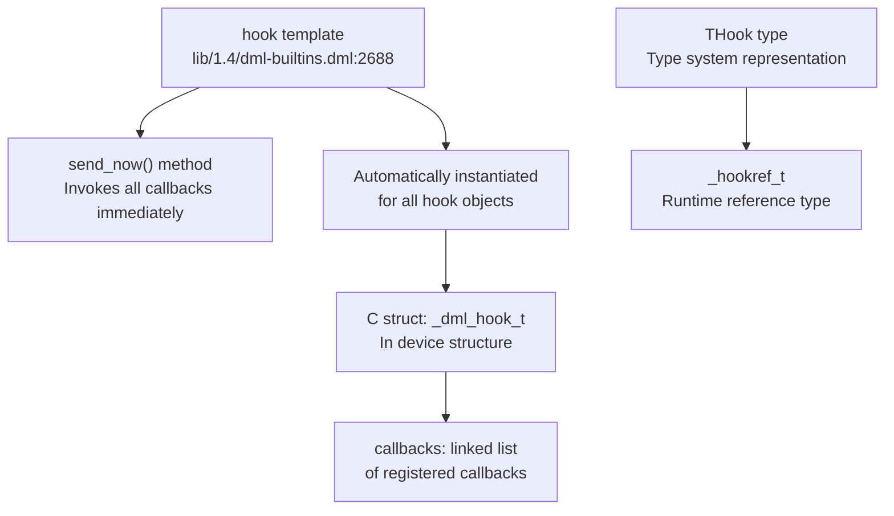

### Hook Type System

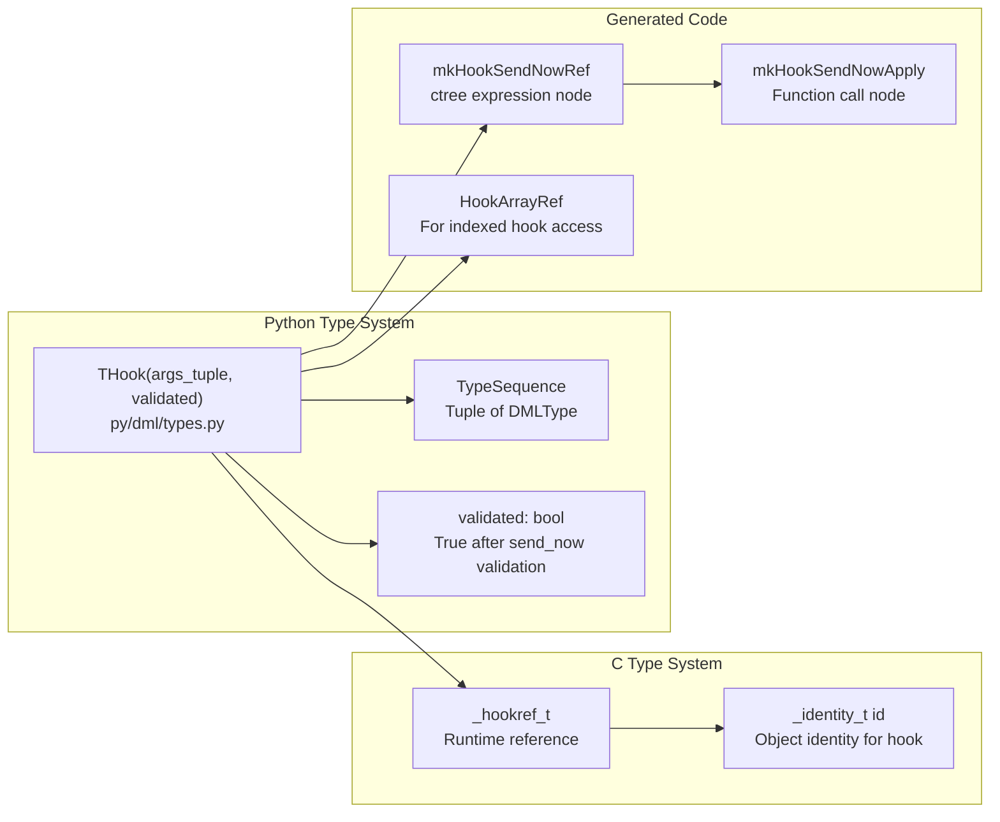

Sources: [py/dml/types.py](), [lib/1.4/dml-builtins.dml:2688-2904]()

### Hook Send Operation

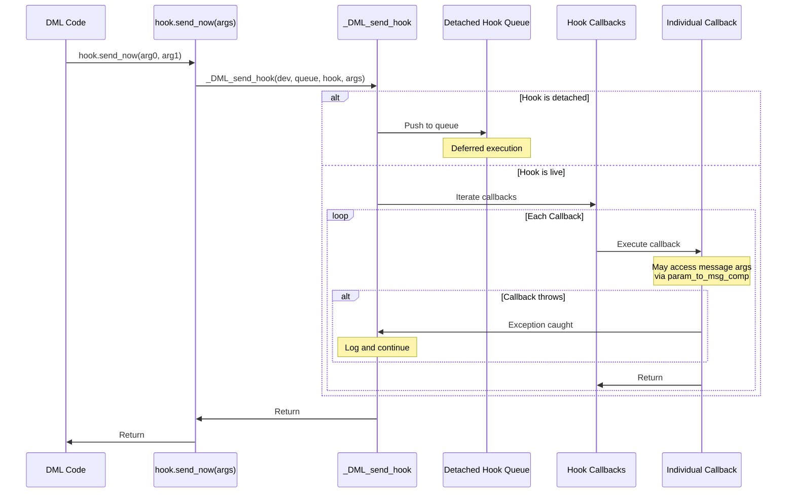

### Hook Reference Resolution

```c
// C macro in generated code
_DML_resolve_hookref(_dev, _hook_aux_infos, hookref)

// Returns _dml_hook_t* by:
// 1. If hookref is constant (HookRef), return &_dev->hookpath
// 2. Otherwise, use _hook_aux_infos lookup table to resolve
//    _hookref_t.id to _dml_hook_t* at runtime
```

Sources: [py/dml/ctree.py:759-762](), [include/simics/dmllib.h]()

---

## Hook Serialization

### Serialization Format

Hook references are serialized as `_identity_t` values, which checkpoint the object and index:

```
[logname_string, [index0, index1, ...]]
```

Example:
```
["device.hooks.my_hook", [0]]  // hooks.my_hook[0]
["", []]                        // Zero-initialized hookref
```

### Callback Serialization

Callbacks attached via `after on hook` are serialized within the hook's checkpoint data:

```
{
  "callbacks": [
    {
      "info_uniq": N,           // AfterOnHookInfo index
      "indices": [i, j],        // Method indices
      "args": <serialized>,     // Non-message arguments
      "domains": [<id>, <id>]   // Cancellation domains
    },
    ...
  ]
}
```

### Checkpoint Compatibility

The system supports deserializing hooks from older checkpoints where:
- Hook objects didn't exist (creates empty hooks)
- Callback format was different (legacy format support)
- Object topology has changed (reports error with helpful message)

Sources: [include/simics/dmllib.h:691-829](), [py/dml/serialize.py]()

---

## Event Cancellation

### cancel_after() Method

Every DML object provides a `cancel_after()` method that cancels pending events:

```dml
// In object template
shared method cancel_after() {
    local object ref = this;
    _cancel_simple_events(dev.obj, cast(&ref, _traitref_t *)->id);
}
```

### Cancellation Mechanism

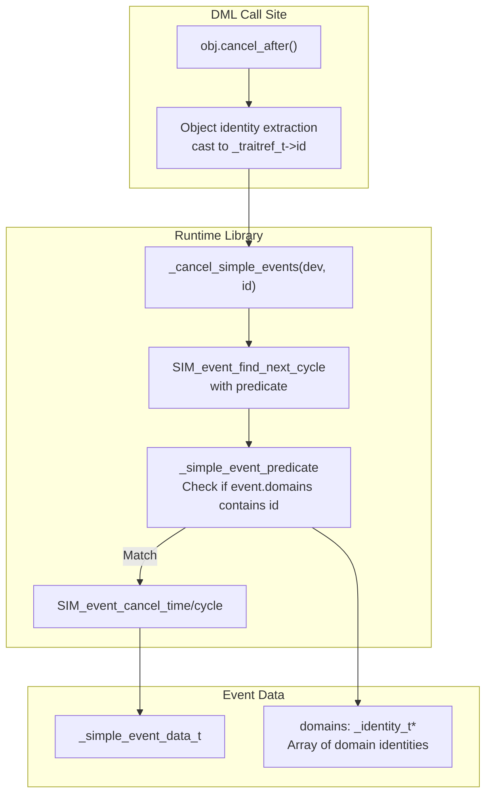

Cancellation works by:
1. Finding all events with matching device
2. Filtering to events whose `domains` array contains the cancelling object's identity
3. Calling Simics `SIM_event_cancel` on matched events
4. The event destructor (`_destroy_simple_event_data`) frees allocated memory

Sources: [lib/1.4/dml-builtins.dml:574-577](), [include/simics/dmllib.h:866-885]()

---

## Generated Artifacts

### Per-Device Artifacts

For each device, the compiler generates:

| Artifact | Purpose | Location |
|----------|---------|----------|
| `_immediate_after_state` | Runtime state for immediate after queue | Device struct member |
| `_detached_hook_queue_stack` | Stack of detached hook queues | Device struct member |
| `_hook_aux_infos` | Hookref resolution lookup table | Global array |
| `_after_on_hook_infos` | AfterOnHookInfo metadata | Global array |
| `_id_infos` | Object identity metadata | Global array |

### Per-AfterInfo Artifacts

For each unique `AfterDelayInfo`:

```c
// Event callback function
static void _simple_event_N_callback(conf_object_t *obj, lang_void *data) {
    _simple_event_data_t *event_data = (_simple_event_data_t *)data;
    // Deserialize indices and args
    // Call target method or send hook
    _free_simple_event_data(*event_data);
}

// Serialization functions (if needed)
static attr_value_t _simple_event_N_get_value(conf_object_t *obj, 
                                                lang_void *data);
static set_error_t _simple_event_N_set_value(void *dont_care, 
                                              conf_object_t *obj,
                                              lang_void *data,
                                              attr_value_t *value);

// Event class registration in init
_DML_register_event_class(&_dev->obj, "simple_event_N",
                          _simple_event_N_callback,
                          _simple_event_N_get_value,
                          _simple_event_N_set_value,
                          &_simple_event_classes[N]);
```

For each unique `AfterOnHookInfo`:

```c
// Callback function
static void _after_on_hook_N_callback(conf_object_t *obj,
                                       const uint32 *indices,
                                       const void *args,
                                       const void *msg);

// Argument serializers (if has_serialized_args)
static attr_value_t _after_on_hook_N_args_serializer(const void *args);
static set_error_t _after_on_hook_N_args_deserializer(attr_value_t val,
                                                        void *out);

// Info struct in global array
{
    .cident_callback = _after_on_hook_N_callback,
    .cident_args_serializer = _after_on_hook_N_args_serializer,
    .cident_args_deserializer = _after_on_hook_N_args_deserializer,
    .dimensions = <N>,
    .typeseq_uniq = <M>,
    .string_key = "(<types>, (<param_map>))"
}
```

Sources: [py/dml/c_backend.py](), [py/dml/codegen.py:461-903]()

---

## Type Sequence System

### TypeSequenceInfo

Hook message types are tracked through `TypeSequenceInfo` instances, which cache information about unique type sequences:

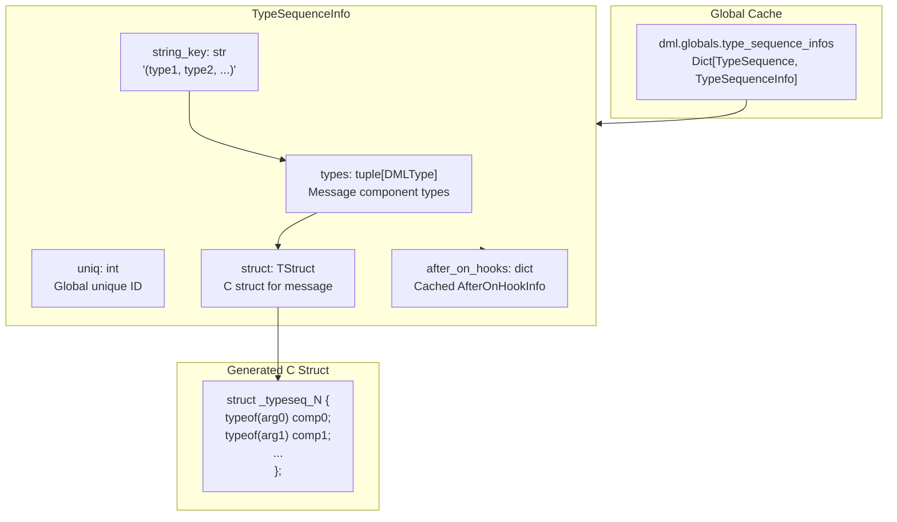

### Type Sequence Creation

```python
# py/dml/codegen.py
def get_type_sequence_info(index, create_new=False):
    typeseq = TypeSequence(index)  # Tuple of types
    try:
        return dml.globals.type_sequence_infos[typeseq]
    except KeyError:
        if create_new:
            info = TypeSequenceInfo(typeseq.types, 
                                   len(dml.globals.type_sequence_infos))
            dml.globals.type_sequence_infos[typeseq] = info
            return info
        else:
            return None
```

Each `TypeSequenceInfo` serves as a cache key for:
- `AfterDelayIntoSendNowInfo` (for `after delay: hook.send_now(...)`)
- `AfterOnHookIntoSendNowInfo` (for `after on hook: other_hook.send_now(...)`)
- `AfterOnHookIntoMethodInfo` (for `after on hook: method(...)` with parameter mapping)

Sources: [py/dml/codegen.py:421-459]()

---

## Error Handling

### Exception Propagation

Events and hooks handle exceptions differently:

| Context | Behavior | Implementation |
|---------|----------|----------------|
| `after` delay callback | Log error, continue | `LogFailure` wrapper |
| `after on hook` callback | Log error, continue | Loop catches per-callback |
| `immediate after` callback | Log error, continue | Runtime catches exceptions |
| `send_now()` method | Propagates to caller | Normal DML exception handling |

### Logging Context

When event callbacks execute, they run with a `LogFailure` context that logs uncaught exceptions:

```c
// Generated in AfterDelayIntoMethodInfo.generate_callback_call
void _simple_event_N_callback(conf_object_t *obj, lang_void *data) {
    // ... setup ...
    
    // LogFailure context: logs "Uncaught DML exception" on throw
    method_call(indices, args);  // May throw
    
    // Cleanup even if exception occurred
}
```

Sources: [py/dml/codegen.py:178-188](), [py/dml/c_backend.py]()

---

## Performance Considerations

### Event Data Allocation

Event data is allocated with `MM_MALLOC`/`MM_ZALLOC` and freed in the event callback or destructor. For events with no indices/args/domains, no allocation occurs:

```c
// Optimized case: no allocation needed
if (!indices && !args && !domains) {
    SIM_event_post_time(clock, evclass, obj, delay, NULL);
}
```

### Hook Callback Overhead

Hook callbacks are stored in a linked list and executed sequentially. Performance characteristics:
- **Registration**: O(1) append to list
- **Send**: O(n) iteration over callbacks
- **Cancellation**: O(n) list traversal

### Memoization Interaction

Independent methods with memoization (see [Memoization](#)) cannot use `after` statements that reference `this`, as the `this` object may vary across memoized calls.

Sources: [py/dml/ctree.py:697-817](), [include/simics/dmllib.h]()