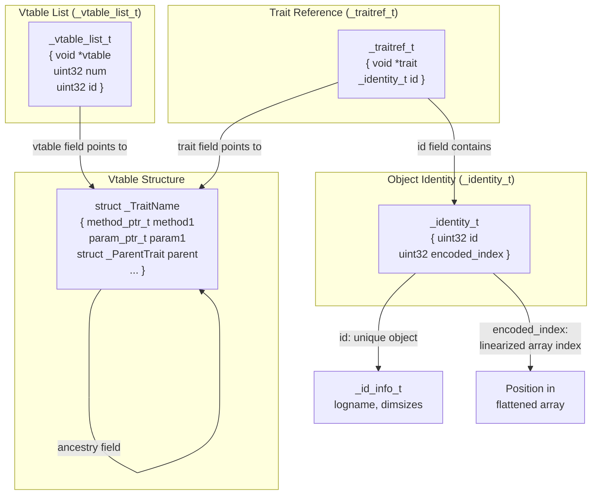
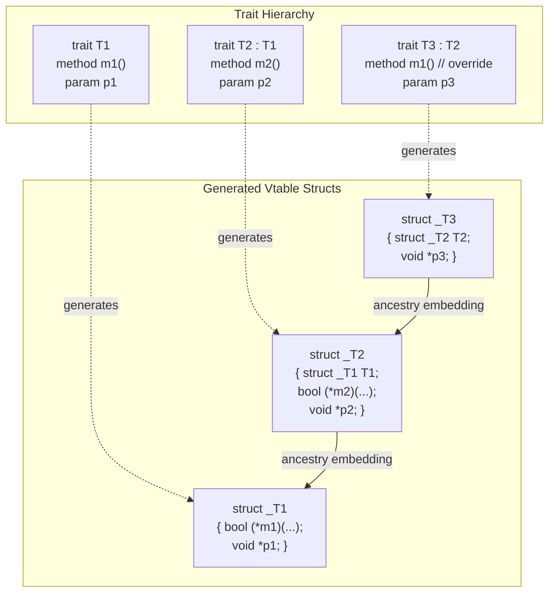
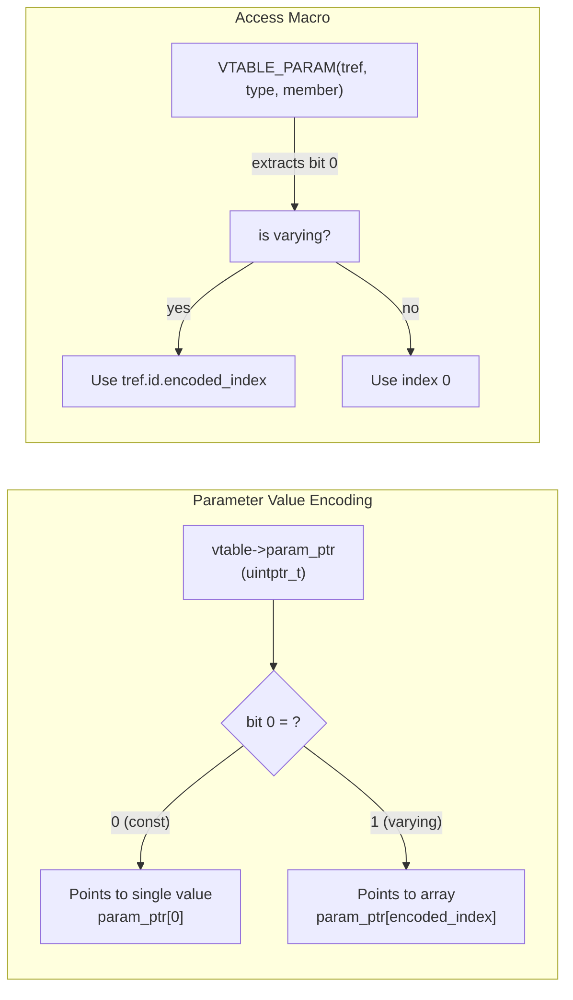
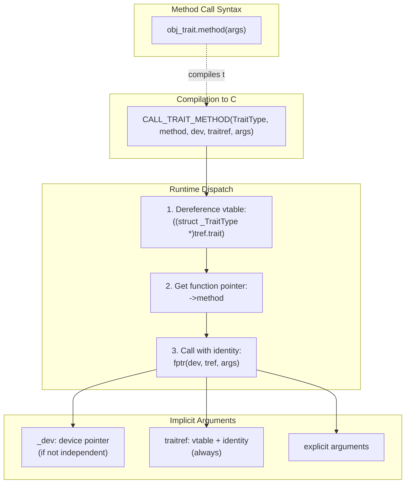
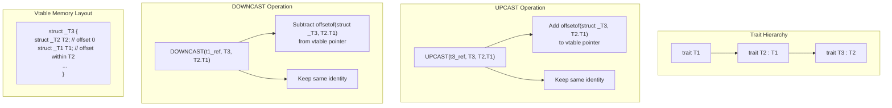
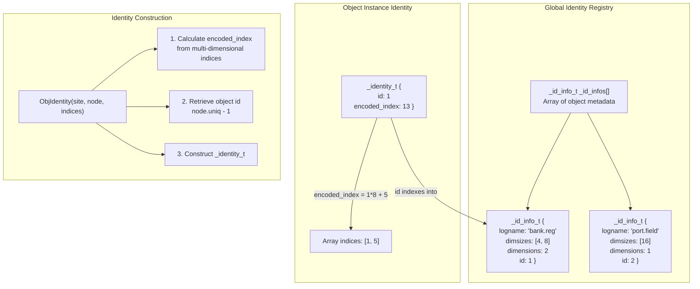
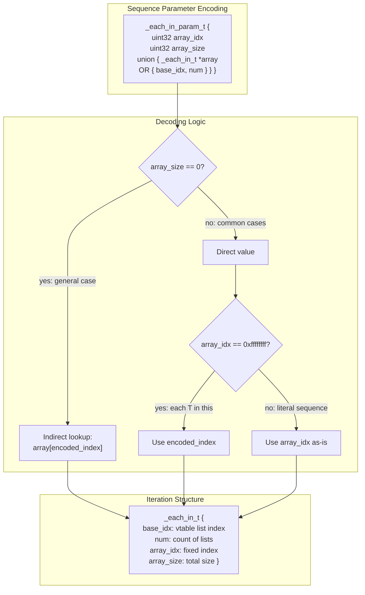
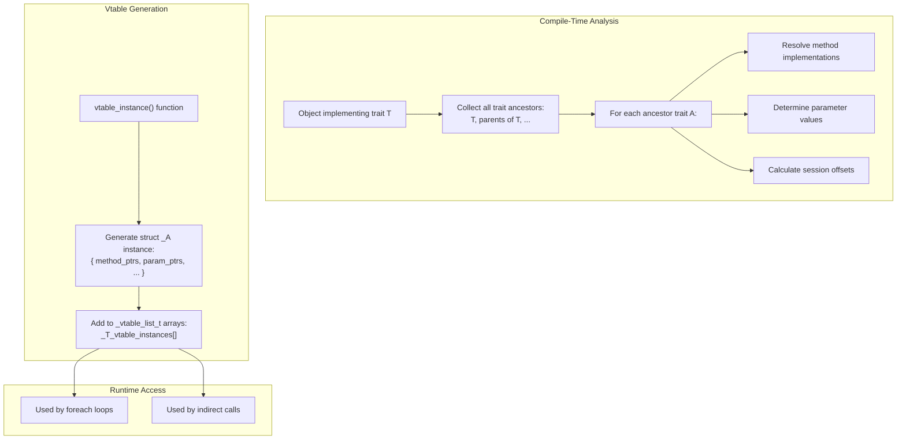

# Trait System Implementation

<details>
<summary>Relevant source files</summary>

The following files were used as context for generating this wiki page:

- [include/simics/dmllib.h](include/simics/dmllib.h)
- [py/dml/c_backend.py](py/dml/c_backend.py)
- [py/dml/codegen.py](py/dml/codegen.py)
- [py/dml/crep.py](py/dml/crep.py)
- [py/dml/ctree.py](py/dml/ctree.py)
- [py/dml/structure.py](py/dml/structure.py)
- [py/dml/template.py](py/dml/template.py)
- [py/dml/traits.py](py/dml/traits.py)
- [py/dml/types.py](py/dml/types.py)

</details>


This page describes the runtime implementation of DML's trait system, including vtable generation, trait dispatch, identity management, and type casting mechanisms. For the language-level specification of traits, see [Traits](#3.6). For compile-time trait processing and template instantiation, see [Templates](#3.5).

## Overview

DML's trait system provides polymorphism through vtables, similar to C++ virtual functions. At compile time, the trait infrastructure in [py/dml/traits.py]() processes trait definitions and method overrides. At runtime, trait references (`_traitref_t`) combine a vtable pointer with an object identity, enabling dynamic dispatch to trait methods and parameters that vary across object instances.

The runtime implementation consists of:
- **Vtable structures** containing method pointers and parameter values
- **Identity system** for uniquely identifying objects and their array indices
- **Trait references** that pair vtables with identities
- **Dispatch macros** for calling methods and accessing parameters
- **Type casting** operations for navigating trait hierarchies

Sources: [py/dml/traits.py:1-700](), [include/simics/dmllib.h:209-356]()

## Core Runtime Data Structures



**Core Structure Definitions**

The runtime uses three fundamental structures defined in [include/simics/dmllib.h:209-236]():

| Structure | Fields | Purpose |
|-----------|--------|---------|
| `_identity_t` | `id`, `encoded_index` | Uniquely identifies an object instance within an array |
| `_traitref_t` | `trait` (void*), `id` (_identity_t) | Complete trait reference combining vtable and identity |
| `_vtable_list_t` | `vtable` (void*), `num`, `id` | Describes vtable instances for iteration |

The `_identity_t` structure encodes both which object is being referenced (`id`) and its position in multi-dimensional arrays (`encoded_index`). The `encoded_index` is a linearized representation of array indices, computed as `index[0] * dim[1] * dim[2] + index[1] * dim[2] + index[2]` for a 3D array.

Sources: [include/simics/dmllib.h:209-236](), [py/dml/ctree.py:141-154]()

## Vtable Structure and Generation



**Vtable Field Types**

Each trait generates a C struct type named `struct _TraitName` containing:

1. **Ancestry fields**: Embedded parent vtable structs for trait inheritance
2. **Method pointers**: Function pointers for shared methods declared in this trait
3. **Parameter pointers**: Tagged pointers to parameter values (see Parameter Encoding below)
4. **Session offsets**: Device struct offsets for session variables
5. **Hook identities**: Identity values for hook references
6. **Memoized output structs**: For memoized independent startup methods

The vtable struct is generated in [py/dml/c_backend.py:1146-1223]() using the trait's `vtable_methods`, `vtable_params`, `vtable_sessions`, `vtable_hooks`, and `vtable_memoized_outs` dictionaries populated during trait processing.

**Ancestry Embedding**

When trait `B` extends trait `A`, the generated `struct _B` contains a field `struct _A A` as its first member. This enables pointer casting: a pointer to `struct _B` can be safely cast to `struct _A*` since they share the same initial layout. This is how `UPCAST` works at runtime.

Sources: [py/dml/c_backend.py:1146-1223](), [py/dml/traits.py:276-292]()

## Parameter Encoding in Vtables



Parameters in vtables use a space-efficient encoding scheme defined in [include/simics/dmllib.h:313-324]():

**Encoding Scheme**: The least significant bit of the parameter pointer acts as a tag:
- **Bit 0 = 0**: Parameter is constant across all indices; pointer references a single value
- **Bit 0 = 1**: Parameter varies by index; pointer (with bit 0 cleared) references an array indexed by `encoded_index`

**Access Pattern**:
```c
#define VTABLE_PARAM(traitref, vtable_type, member)
    ({ _traitref_t __tref = traitref;
       uintptr_t __member = (uintptr_t)((vtable_type *)__tref.trait)->member;
       ((typeof(((vtable_type*)NULL)->member))(__member & ~1))[
          (__member & 1) ? __tref.id.encoded_index : 0]; })
```

This encoding enables efficient storage: if a parameter has the same value for all 1000 instances of an object array, only one copy is stored rather than 1000.

Sources: [include/simics/dmllib.h:313-324](), [py/dml/c_backend.py:1071-1094]()

## Trait Method Dispatch



**Call Mechanism**

Trait method calls are compiled using the `CALL_TRAIT_METHOD` family of macros defined in [include/simics/dmllib.h:298-310]():

1. **Non-independent methods**: `CALL_TRAIT_METHOD(type, method, dev, traitref, ...)`
   - Takes device pointer as first argument
   - Passes trait reference as second implicit argument

2. **Independent methods**: `CALL_INDEPENDENT_TRAIT_METHOD(type, method, traitref, ...)`
   - No device pointer
   - Trait reference is only implicit argument

**Method Signatures**

Generated trait methods have signatures following [py/dml/traits.py:211-222]():
```c
bool _DML_TM_TraitName__methodname(
    device_t *_dev,              // if not independent
    _traitref_t _TraitName,      // implicit trait arg
    /* explicit input parameters */,
    /* output parameter pointers */)
```

The implicit trait argument provides both the vtable (for accessing parameters/sessions) and the identity (for knowing which object instance is being operated on).

Sources: [include/simics/dmllib.h:298-310](), [py/dml/traits.py:211-222](), [py/dml/codegen.py:954-1033]()

## Type Casting Between Traits



**Casting Macros**

The trait system provides two casting primitives defined in [include/simics/dmllib.h:279-296]():

**UPCAST**: Navigate from derived trait to ancestor trait
```c
#define UPCAST(expr, from, ancestry)
    ({ _traitref_t __tref = expr;
       __tref.trait = (char *)(__tref.trait)
                      + offsetof(struct _##from, ancestry);
       __tref; })
```

**DOWNCAST**: Navigate from ancestor trait back to derived trait
```c
#define DOWNCAST(expr, to, ancestry)
    ({ _traitref_t __tref = expr;
       __tref.trait = (char *)(__tref.trait)
                      - offsetof(struct _##to, ancestry);
       __tref; })
```

**Usage Example**: If `t3` implements trait `T3` which extends `T2` which extends `T1`:
- `UPCAST(t3, T3, T2.T1)` yields a reference to the `T1` part of `t3`
- `DOWNCAST(t1_ref, T3, T2.T1)` recovers the full `T3` reference from `t1_ref`

These operations only adjust the vtable pointer, leaving the identity unchanged. The ancestry path (e.g., `T2.T1`) specifies which parent vtable struct to access within the derived struct.

Sources: [include/simics/dmllib.h:279-296](), [py/dml/traits.py:264-275]()

## Identity System



**Identity Structure**

Each object instance is identified by an `_identity_t` structure containing:
- `id`: Unique identifier for the object type (assigned as `node.uniq - 1`)
- `encoded_index`: Linearized position within multi-dimensional arrays

**Identity Information Registry**

A global array `_id_info_t _id_infos[]` maps object IDs to metadata:
- `logname`: Human-readable name for the object
- `dimsizes`: Array dimensions (e.g., `[4, 8]` for a 4×8 array)
- `dimensions`: Number of array dimensions
- `id`: The object ID

This registry is used for error messages and debugging, allowing runtime code to decode an identity back to a human-readable form.

**Index Encoding**

Multi-dimensional indices are flattened using row-major order. For a 3D array with dimensions `[D0, D1, D2]` and indices `[i0, i1, i2]`:
```
encoded_index = i0 * D1 * D2 + i1 * D2 + i2
```

This encoding is generated in [py/dml/ctree.py:2393-2421]() using the `ObjIdentity` expression class.

Sources: [include/simics/dmllib.h:209-219](), [py/dml/ctree.py:2393-2421](), [py/dml/c_backend.py:1029-1068]()

## Trait Sequences and Iteration



**Sequence Parameters**

DML's `sequence(T)` type represents sets of trait references for iteration. The most common form is `each T in this`, representing all instances of trait `T` within the current object. This is encoded specially for efficiency.

**Encoding Optimization**

Three cases are handled by [include/simics/dmllib.h:341-356]():

1. **General case**: `array_size == 0` indicates the sequence varies by index, requiring indirect lookup through an array
2. **Common case**: `each T in this` uses a sentinel `array_idx == 0xffffffffu` to signal using `encoded_index`
3. **Literal case**: Other constant sequences store the index directly

**Iteration Mechanism**

Iteration over `each T in (...)` expressions compiles to nested loops generated by `mkForeachSequence` in [py/dml/ctree.py:959-1010]():
1. Outer loop: Iterates over vtable lists in the `_each_in_t`
2. Inner loop: Iterates over elements within each vtable list

This two-level structure supports iteration over objects distributed across multiple parent objects (e.g., `each T in bank[0..3]` where each bank contains multiple instances of `T`).

Sources: [include/simics/dmllib.h:237-272](), [include/simics/dmllib.h:341-356](), [py/dml/ctree.py:959-1010]()

## Session and Hook Access

**Session Variable Access**

Session variables declared in traits are stored in the device struct. The vtable contains an offset (type `uint32`) from the device base pointer to the session variable's location:

```c
#define VTABLE_SESSION(dev, traitref, vtable_type, member, var_type)
    ({ _traitref_t __tref = traitref;
       (var_type)((uintptr_t)dev + ((vtable_type *)__tref.trait)->member)
          + __tref.id.encoded_index; })
```

The offset is calculated at vtable generation time and indexed by `encoded_index` to access the correct array element.

**Hook Access**

Hooks in traits are accessed similarly, but the vtable stores a base `_identity_t` that is adjusted by array coefficients:

```c
#define VTABLE_HOOK(traitref, vtable_type, member, coeff, offset)
    ({ _traitref_t __tref = traitref;
       (_hookref_t){ .id = ((vtable_type *)__tref.trait)->member,
                     .encoded_index = __tref.id.encoded_index * (coeff) + (offset) }; })
```

The `coeff` and `offset` parameters handle cases where hook arrays don't align exactly with the object's array dimensions.

Sources: [include/simics/dmllib.h:358-367](), [py/dml/c_backend.py:1119-1145]()

## Vtable Instance Creation



For each object that implements traits, the compiler generates vtable instances in [py/dml/c_backend.py:944-1027]():

1. **Instance Creation**: A static `struct _TraitName` instance is initialized with:
   - Function pointers to the resolved method implementations
   - Pointers to parameter values (with LSB encoding)
   - Device struct offsets for session variables
   - Hook identities with appropriate coefficients

2. **Registry Construction**: Each vtable instance is registered in a global `_vtable_list_t` array for the trait, enabling:
   - Runtime iteration via `each T in (...)` expressions
   - Dynamic trait reference creation from identities

3. **Index Mapping**: The `_vtable_list_t` structure records:
   - Total number of instances (`num`)
   - The unique object ID (`id`)
   - A pointer to the vtable instance

Sources: [py/dml/c_backend.py:944-1027](), [py/dml/c_backend.py:1146-1223]()