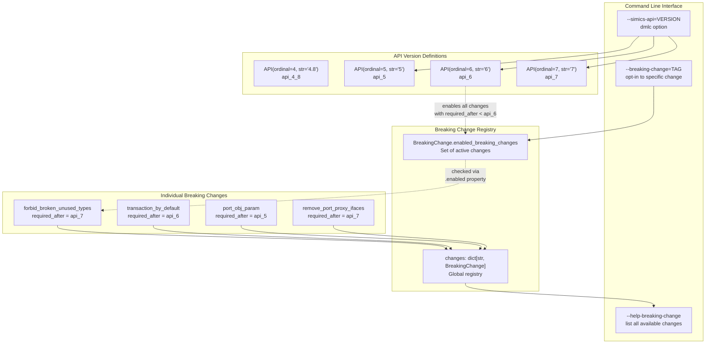
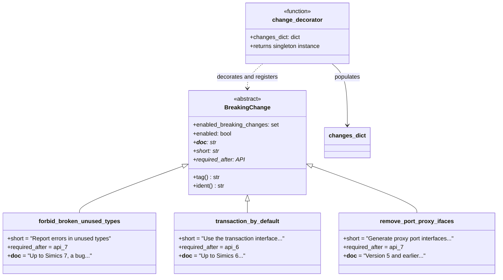
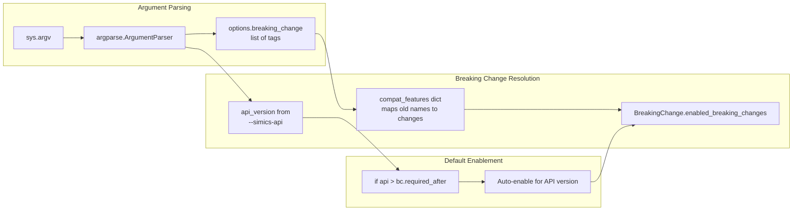
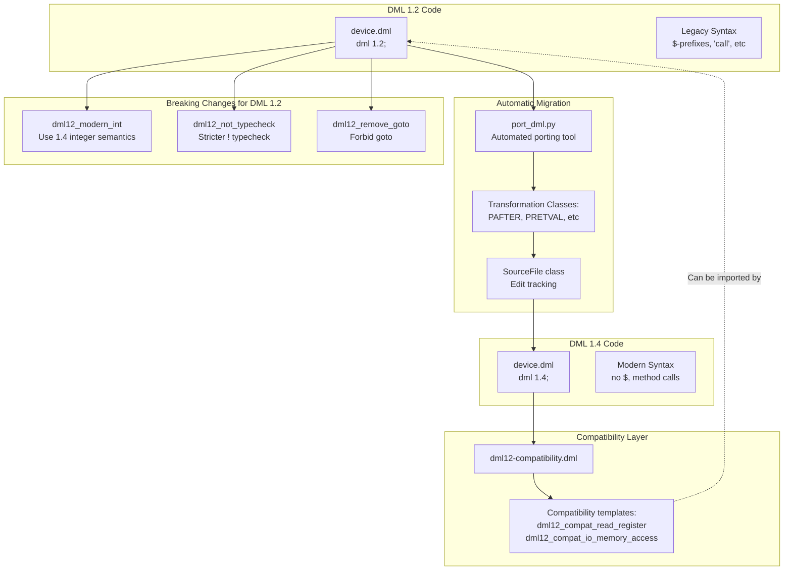
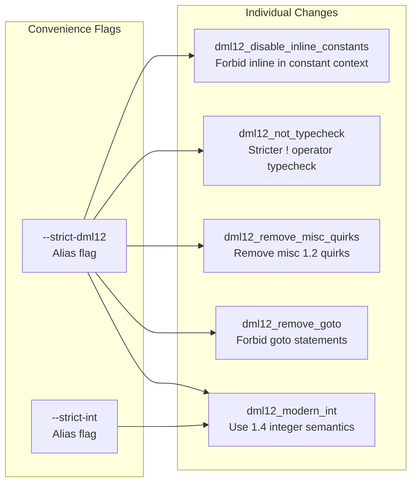
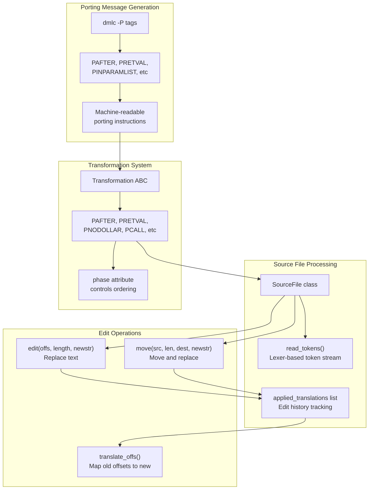
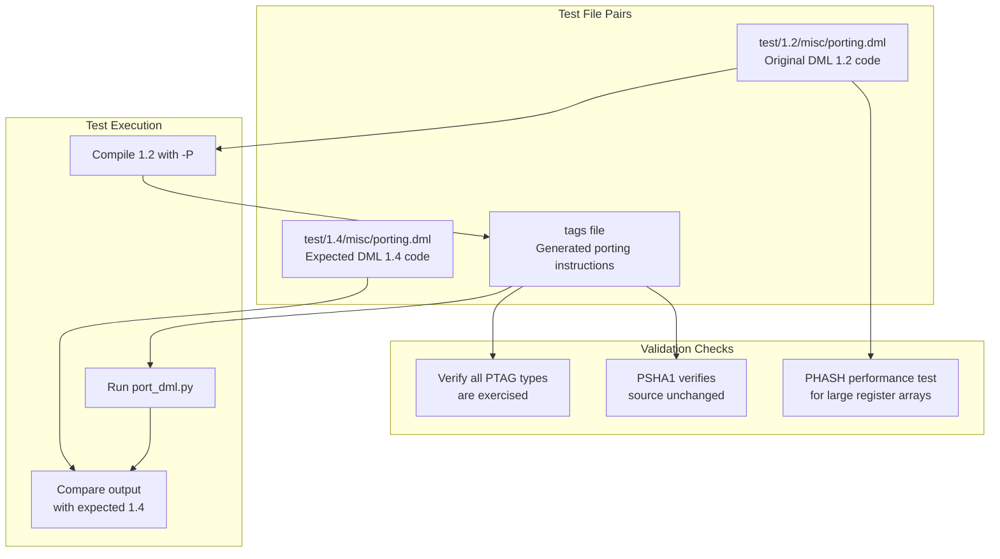
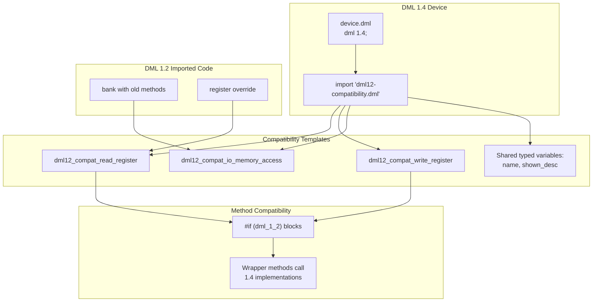
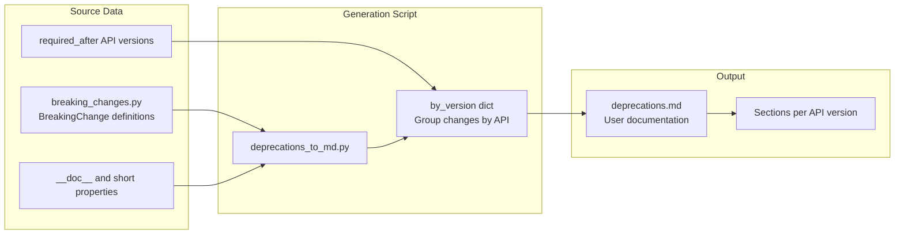

# Breaking Changes and Compatibility

<details>
<summary>Relevant source files</summary>

The following files were used as context for generating this wiki page:

- [RELEASENOTES-1.2.md](RELEASENOTES-1.2.md)
- [RELEASENOTES-1.4.md](RELEASENOTES-1.4.md)
- [RELEASENOTES.md](RELEASENOTES.md)
- [deprecations_to_md.py](deprecations_to_md.py)
- [py/dml/breaking_changes.py](py/dml/breaking_changes.py)
- [py/dml/dmlc.py](py/dml/dmlc.py)
- [py/dml/globals.py](py/dml/globals.py)
- [py/dml/toplevel.py](py/dml/toplevel.py)
- [py/port_dml.py](py/port_dml.py)
- [test/1.2/misc/porting.dml](test/1.2/misc/porting.dml)
- [test/1.4/misc/porting-common-compat.dml](test/1.4/misc/porting-common-compat.dml)
- [test/1.4/misc/porting-common.dml](test/1.4/misc/porting-common.dml)
- [test/1.4/misc/porting.dml](test/1.4/misc/porting.dml)
- [test/tests.py](test/tests.py)

</details>


This document describes the DML compiler's system for managing breaking changes across Simics API versions and DML language versions. It covers how breaking changes are defined, how they relate to API versions, and how to enable or work around them. For information about the automated porting tool for migrating DML 1.2 code to DML 1.4, see [Porting from DML 1.2 to 1.4](#7.2).

## Purpose and Scope

The breaking changes system allows DMLC to introduce backwards-incompatible changes in a controlled manner. Breaking changes are typically tied to specific Simics API versions - when a new API version is released, certain breaking changes become mandatory. However, users can opt into these changes earlier using command-line flags, allowing incremental migration.

The system handles:
- API version-dependent language behavior changes
- DML 1.2 to 1.4 migration support
- Compatibility features that can be selectively disabled
- Deprecation of legacy constructs

Sources: [py/dml/breaking_changes.py:1-100](), [py/dml/dmlc.py:464-596]()

## API Version Architecture



**API Version and Breaking Change Relationship**

The compiler uses an `API` dataclass to represent Simics API versions with both an ordinal number for comparison and a string representation. Each breaking change specifies a `required_after` API version - when compiling with a newer API version, that change becomes mandatory. Users can manually enable specific changes earlier using `--breaking-change` flags.

Sources: [py/dml/breaking_changes.py:7-24](), [py/dml/dmlc.py:530-540](), [py/dml/dmlc.py:285-307]()

## Breaking Change Framework



**Breaking Change Class Hierarchy**

Each breaking change is implemented as a singleton subclass of `BreakingChange`. The `@change` decorator registers each instance in the global `changes` dictionary. The `enabled` property checks whether the change is in `enabled_breaking_changes`, which is populated based on the API version and explicit `--breaking-change` flags.

Sources: [py/dml/breaking_changes.py:27-60](), [py/dml/breaking_changes.py:63-78]()

## Command-Line Interface

### Enabling Breaking Changes

The compiler accepts the `--breaking-change=TAG` option (formerly `--no-compat`) to enable specific changes:

```
dmlc --simics-api=6 --breaking-change=transaction_by_default mydevice.dml
```

The `--help-breaking-change` option lists all available breaking changes grouped by the API version where they become mandatory:

Sources: [py/dml/dmlc.py:463-471](), [py/dml/dmlc.py:285-307]()

### Processing in dmlc.py



**Breaking Change Enablement Flow**

The compiler processes breaking changes in stages: first, it parses the `--simics-api` flag to determine the API version. Then it processes any explicit `--breaking-change` flags. Finally, it automatically enables all breaking changes whose `required_after` is less than the current API version.

Sources: [py/dml/dmlc.py:530-596](), [py/dml/toplevel.py:369-398]()

## Major Breaking Changes

### API Version 7 Changes

| Breaking Change | Tag | Impact |
|-----------------|-----|--------|
| **Unused Type Errors** | `forbid_broken_unused_types` | Reports errors in unused `extern typedef` declarations that reference undefined types |
| **Conditional Template Errors** | `forbid_broken_conditional_is` | Reports errors when instantiating nonexistent templates in `#if` blocks |
| **Strict Type Checking** | `strict_typechecking` | Enforces C-like type checking, especially for pointer types and `const` qualifiers |
| **Modern Attributes** | `modern_attributes` | Uses `SIM_register_attribute` instead of legacy API; dictionary type unsupported |
| **Remove Proxy Interfaces** | `remove_port_proxy_ifaces` | Stops generating interface ports for banks and ports (use dedicated port objects) |
| **Remove Proxy Attributes** | `remove_port_proxy_attrs` | Stops generating top-level proxy attributes for attributes in banks/ports |
| **Function in Extern Struct** | `forbid_function_in_extern_struct` | Requires `*` for function pointer members in extern structs |
| **Version Statement Required** | `require_version_statement` | Makes `dml 1.4;` statement mandatory |

Sources: [py/dml/breaking_changes.py:63-201]()

### API Version 6 Changes

| Breaking Change | Tag | Impact |
|-----------------|-----|--------|
| **Transaction by Default** | `transaction_by_default` | Banks implement `transaction` interface by default instead of `io_memory` |
| **Shared Logs Locally** | `shared_logs_locally` | Log statements in shared methods log on enclosing object, not device object |
| **Enable WLOGMIXUP** | `enable_WLOGMIXUP` | Enables warning about likely swapped log levels and log groups |

Sources: [py/dml/breaking_changes.py:203-255]()

### API Version 5 Changes

| Breaking Change | Tag | Impact |
|-----------------|-----|--------|
| **Port Object Parameter** | `port_obj_param` | `obj` parameter in banks/ports resolves to port object, not device object |

Sources: [py/dml/breaking_changes.py:217-229]()

## DML Version Compatibility (1.2 vs 1.4)



**DML 1.2 to 1.4 Migration Path**

The compiler supports both DML 1.2 and 1.4, with three migration mechanisms: (1) the `port_dml.py` tool for automated syntax conversion, (2) the `dml12-compatibility.dml` library for writing 1.4 code that works when imported from 1.2, and (3) breaking change flags that enable 1.4-style behavior in 1.2 code incrementally.

Sources: [py/port_dml.py:1-50](), [test/1.4/misc/porting-common-compat.dml:1-20](), [py/dml/breaking_changes.py:300-400]()

## DML 1.2 Strictness Flags

Special breaking changes target DML 1.2 code to enable 1.4-like behavior:



**DML 1.2 Strictness Aliases**

The `--strict-dml12` flag enables all major 1.4-style restrictions in DML 1.2 code. The `--strict-int` flag specifically enables modern integer semantics. These are processed early in argument parsing and expanded into individual breaking change flags.

Sources: [py/dml/dmlc.py:411-416](), [py/dml/dmlc.py:574-584](), [py/dml/breaking_changes.py:300-450]()

## Automated Porting System



**Automated Porting Architecture**

The porting system works in two phases: First, DMLC compiles the DML 1.2 code with the `-P` flag to generate a machine-readable tag file containing transformation instructions. Second, `port_dml.py` processes this tag file, applying transformations to the source file in order by phase number to handle non-commutative edits correctly.

Sources: [py/port_dml.py:80-230](), [py/port_dml.py:308-360](), [test/tests.py:19-25]()

## Transformation Classes

Major transformation types in the porting system:

| Transformation | Purpose | Example |
|----------------|---------|---------|
| `PAFTER` | Convert `after` statements from 1.2 to 1.4 syntax | `after (1.3) call $m;` → `after 1.3 s: m();` |
| `PRETVAL` | Convert method return values | `method m -> (val) { val = 5; }` → `method m() -> (int) { return 5; }` |
| `PNODOLLAR` | Remove `$` prefixes | `$fieldname` → `fieldname` or `this.fieldname` |
| `PCALL` | Convert method calls | `call $method()` → `method()` |
| `PINPARAMLIST` | Add empty parameter lists | `method_ref` → `method_ref()` |
| `PTHROWS` | Add throws declarations | `method m` → `method m() throws` |
| `PHASH` | Convert hash operator | `#expression` → `stringify(expression)` |

Sources: [py/port_dml.py:1100-1400](), [test/1.2/misc/porting.dml:1-50](), [test/1.4/misc/porting.dml:1-50]()

## Testing and Validation



**Testing Strategy**

The test suite includes paired test files in `test/1.2/misc/porting.dml` and `test/1.4/misc/porting.dml` that exercise all transformation types. The test framework verifies that all defined `PTAG` message types are used, ensures acceptable performance on large files with many transformations, and validates that source files haven't changed between tag generation and porting application.

Sources: [test/1.2/misc/porting.dml:1-20](), [test/1.4/misc/porting.dml:1-20](), [test/tests.py:491-551]()

## Compatibility with Mixed-Version Code

DML 1.4 code can import and use DML 1.2 code through the compatibility layer:



**Mixed-Version Compatibility**

The `dml12-compatibility.dml` library provides templates like `dml12_compat_read_register` that contain `#if (dml_1_2)` blocks. When 1.4 code using these templates is imported from a 1.2 device, the compatibility wrappers ensure that 1.2 method overrides are properly invoked.

Sources: [test/1.4/misc/porting-common-compat.dml:1-30](), [RELEASENOTES.md:64-66](), [RELEASENOTES-1.2.md:88-118]()

## Environment Variables

| Variable | Purpose |
|----------|---------|
| `DMLC_PORTING_TAG_FILE` | Specifies filename for appending porting messages during builds |
| `DMLC_DIR` | Path to DMLC installation (used by `port_dml.py` to find lexer) |

When `DMLC_PORTING_TAG_FILE` is set during a build, DMLC creates the file if it doesn't exist and appends machine-readable porting instructions. This allows collecting porting data across multiple module compilations for batch processing by `port_dml.py`.

Sources: [py/dml/dmlc.py:238-263](), [py/port_dml.py:22-35](), [RELEASENOTES-1.2.md:19-20]()

## Deprecation Documentation Generation



**Documentation Generation**

The `deprecations_to_md.py` script extracts breaking change information from `breaking_changes.py` and generates user-facing documentation grouped by API version. Each breaking change's `__doc__` property provides detailed migration guidance, while the `short` property provides a one-line summary for help messages.

Sources: [deprecations_to_md.py:1-39](), [py/dml/breaking_changes.py:42-50]()