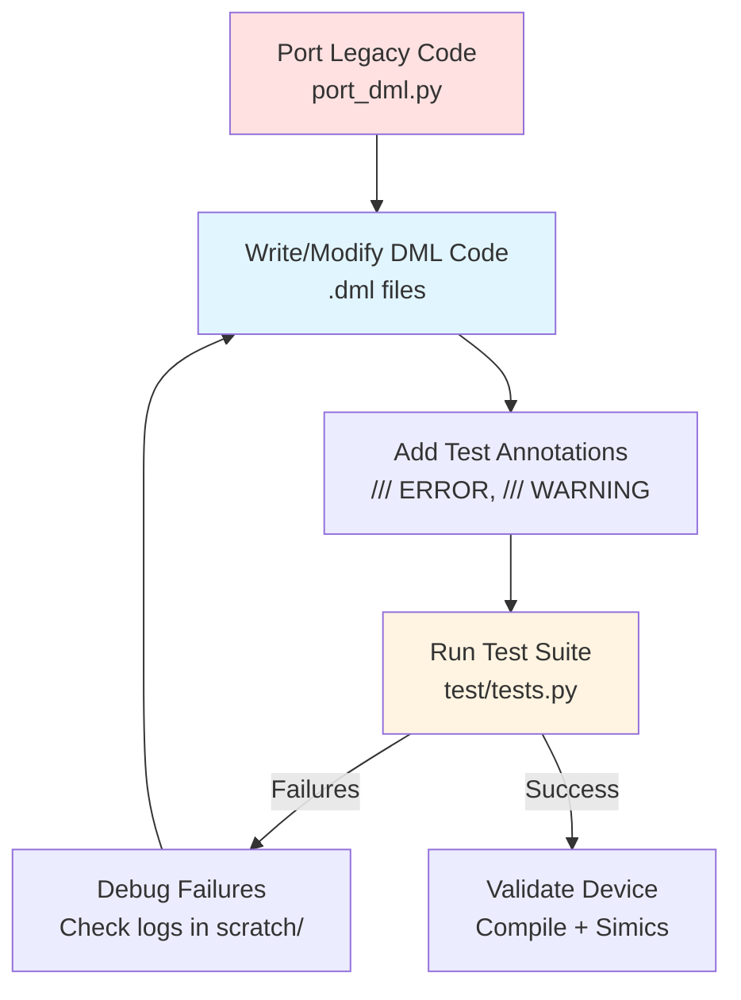
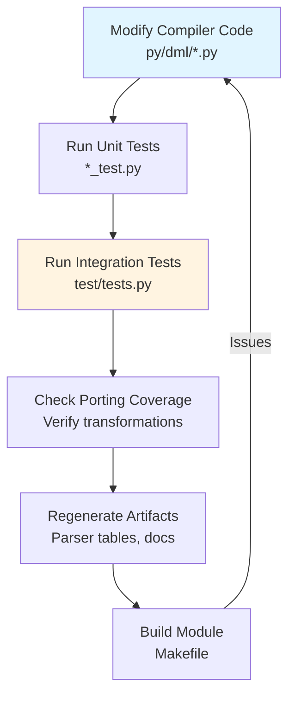
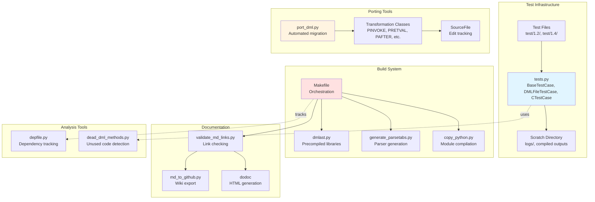
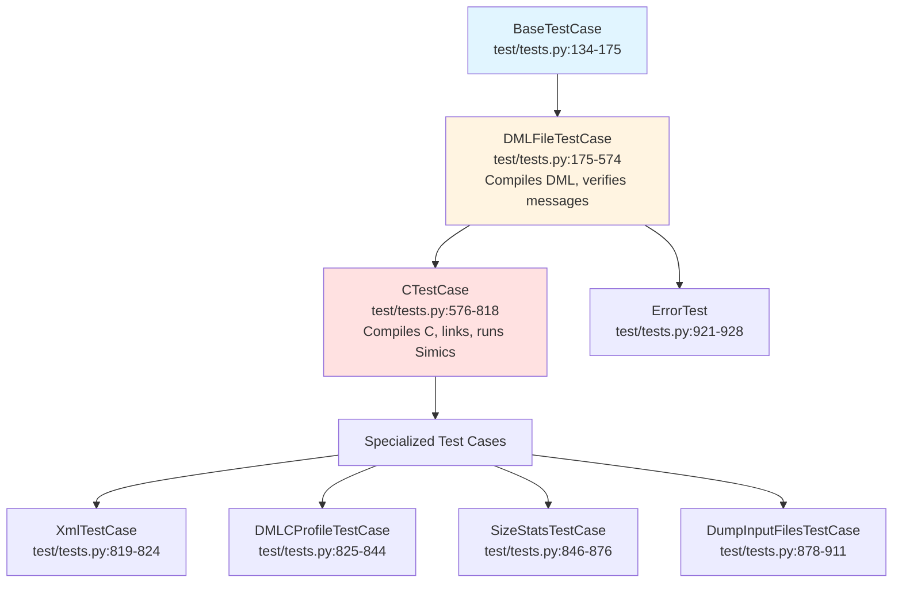
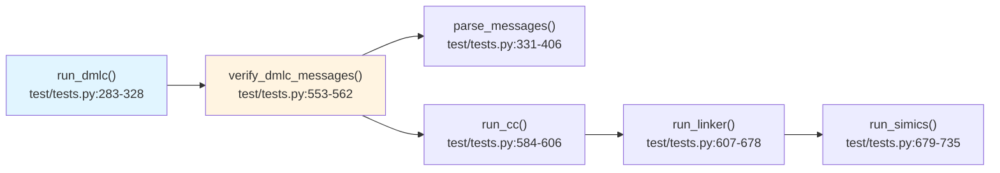
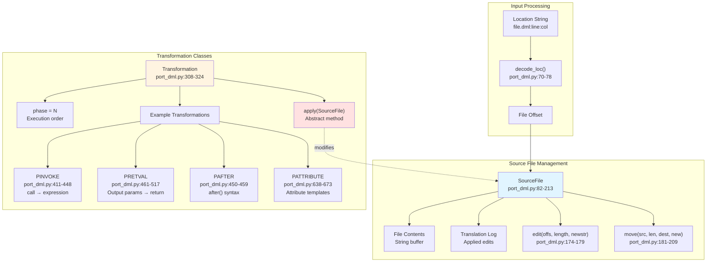
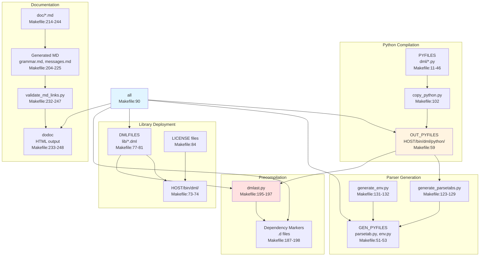
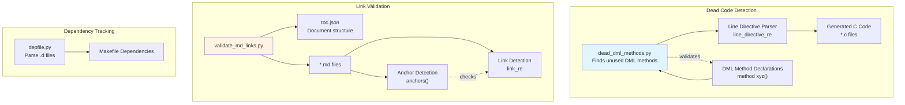

# Development Guide

<details>
<summary>Relevant source files</summary>

The following files were used as context for generating this wiki page:

- [MODULEINFO](MODULEINFO)
- [Makefile](Makefile)
- [md_to_github.py](md_to_github.py)
- [py/port_dml.py](py/port_dml.py)
- [test/1.2/misc/porting.dml](test/1.2/misc/porting.dml)
- [test/1.4/misc/porting-common-compat.dml](test/1.4/misc/porting-common-compat.dml)
- [test/1.4/misc/porting-common.dml](test/1.4/misc/porting-common.dml)
- [test/1.4/misc/porting.dml](test/1.4/misc/porting.dml)
- [test/tests.py](test/tests.py)
- [validate_md_links.py](validate_md_links.py)

</details>


This guide is intended for developers who are working on DML device models or contributing to the DML compiler itself. It covers the essential tools, workflows, and practices for effective development in the DML ecosystem.

**Scope**: This page provides an overview of development tools and workflows. For detailed information on specific topics, see:
- [Testing Framework](#7.1) - Writing and running tests
- [Porting from DML 1.2 to 1.4](#7.2) - Migrating legacy code
- [Build System and Documentation](#7.3) - Building and generating documentation
- [Code Analysis Tools](#7.4) - Dead code detection and debugging utilities

For information about the compiler's internal architecture, see [Compiler Architecture](#5).

---

## Development Workflow Overview

DML development typically follows one of two paths: device model development or compiler development. Both share common tooling but have different primary workflows.

**Workflow: Device Model Development**



**Workflow: Compiler Development**



Sources: [test/tests.py:1-100](), [py/port_dml.py:1-50](), [Makefile:1-100]()

---

## Key Development Tools

The DML development environment provides several integrated tools for testing, porting, building, and analyzing code.

**Tool Architecture**



Sources: [test/tests.py:134-175](), [py/port_dml.py:82-213](), [Makefile:1-50](), [validate_md_links.py:1-50]()

---

## Test Framework Architecture

The test framework is built around a hierarchy of test case classes that validate different aspects of DML compilation and execution.

**Test Case Hierarchy**



**Test Annotations**

Test files use special annotations to specify expected compiler behavior:

| Annotation | Purpose | Example |
|------------|---------|---------|
| `/// ERROR ETAG` | Expect error with tag `ETAG` on next line | `/// ERROR EDUPOBJ` |
| `/// WARNING WTAG` | Expect warning with tag `WTAG` on next line | `/// WARNING WDEPRECATED` |
| `/// ERROR ETAG file.dml` | Expect error `ETAG` anywhere in `file.dml` | `/// ERROR EIMPORT imported.dml` |
| `/// DMLC-FLAG --flag` | Pass `--flag` to compiler | `/// DMLC-FLAG --warn-missing-docs` |
| `/// API-VERSION 6` | Test with specific Simics API version | `/// API-VERSION 7` |
| `/// CC-FLAG -Wno-unused` | Pass flag to C compiler | `/// CC-FLAG -O3` |
| `/// COMPILE-ONLY` | Skip linking and Simics execution | `/// COMPILE-ONLY` |
| `/// NO-CC` | Skip C compilation | `/// NO-CC` |
| `/// GREP pattern` | Expect pattern in Simics output | `/// GREP test passed` |

Sources: [test/tests.py:50-54](), [test/tests.py:479-551](), [test/1.4/misc/porting.dml:1-20]()

**Test Execution Pipeline**



Sources: [test/tests.py:283-735]()

For detailed information on writing and running tests, see [Testing Framework](#7.1).

---

## Porting Tool Architecture

The `port_dml.py` tool automates migration from DML 1.2 to DML 1.4 through a sophisticated transformation system.

**Transformation System**



**Transformation Phases**

Transformations are applied in phases to handle dependencies:

| Phase | Transformations | Purpose |
|-------|----------------|---------|
| -10 | `PSHA1` | Verify file hasn't changed since tag generation |
| -1 | `PINPARAMLIST`, `PTYPEDOUTPARAM` | Parameter list conversions (before `PTHROWS`) |
| 0 | `PINVOKE`, `PRETVAL_END`, `PRETURNARGS` | Basic syntax conversions |
| 1 | `PINARGTYPE`, `POUTARGRETURN`, `PBEFAFT` | Method signature conversions |
| 2 | `PRETVAL`, `PATTRIBUTE` | Return value and attribute handling |
| 3 | `RemoveMethod` | Dead code removal |

Sources: [py/port_dml.py:304-309](), [py/port_dml.py:342-517]()

**Example: PINVOKE Transformation**

The `PINVOKE` transformation converts DML 1.2's `call` statement to DML 1.4's direct call syntax:

```
DML 1.2: call $method(args) -> (out1, out2);
DML 1.4: (out1, out2) = method(args);
```

Implementation: [py/port_dml.py:411-448]()

For detailed porting workflows and troubleshooting, see [Porting from DML 1.2 to 1.4](#7.2).

---

## Build System Overview

The build system orchestrates compilation of Python modules, generation of parser tables, copying of DML libraries, and documentation generation.

**Build Targets and Dependencies**



**Key Build Variables**

| Variable | Purpose | Example Value |
|----------|---------|---------------|
| `DMLC_DIR` | Source directory | `$(SRC_BASE)/$(TARGET)` |
| `LIBDIR` | Output directory | `$(SIMICS_PROJECT)/$(HOST_TYPE)/bin` |
| `PYTHONPATH` | Python module path | `$(LIBDIR)/dml/python` |
| `DMLLIB_DEST` | DML library destination | `$(LIBDIR)/dml` |
| `HOST_TYPE` | Platform identifier | `linux64`, `win64` |

Sources: [Makefile:1-100]()

For detailed build procedures and documentation generation, see [Build System and Documentation](#7.3).

---

## Code Analysis Tools

The development environment includes several tools for analyzing and validating code quality.

**Analysis Tool Suite**



**Dead Method Detection**

The `dead_dml_methods.py` tool identifies DML methods that are declared but never instantiated in generated C code:

1. Parses line directives in generated C code: [py/dead_dml_methods.py:36]()
2. Extracts method names from `#line` directives pointing to `.dml` files
3. Compares against method declarations in DML source
4. Reports methods that appear in DML but not in C

**Documentation Validation**

The `validate_md_links.py` tool ensures documentation integrity:

- Validates all `[text](link)` references in markdown files
- Checks that anchor targets exist (explicit `<a id="...">` or headers)
- Prevents broken internal links: [validate_md_links.py:62-79]()
- Enforces style guidelines (e.g., `&mdash;` instead of `--`)

Sources: [test/tests.py:35-36](), [validate_md_links.py:23-103]()

For detailed usage of analysis tools, see [Code Analysis Tools](#7.4).

---

## Environment Variables for Development

The DML compiler and test suite respect several environment variables for customization:

| Variable | Purpose | Default |
|----------|---------|---------|
| `DMLC_DIR` | Compiler directory | Auto-detected from build |
| `DMLC_PYTHON` | Alternative Python interpreter | None (uses mini-python) |
| `DMLC_CC` | C compiler to use | Package GCC or auto-detected |
| `DMLC_DEBUG` | Enable debug output | `t` (enabled in tests) |
| `DMLC_LINE_DIRECTIVES` | Generate `#line` directives | `yes` |
| `DMLC_PORTING_TAG_FILE` | Porting hints output | Not set |
| `DMLC_GATHER_SIZE_STATS` | Collect code size statistics | Not set |
| `DMLC_DUMP_INPUT_FILES` | Create tarball of inputs | Not set |

Sources: [test/tests.py:71-124](), [py/port_dml.py:22-34]()

---

## Module Structure and Deployment

The DML compiler is packaged as a Simics module with specific deployment structure:

**Deployment Layout**

```
HOST/bin/dml/
├── python/
│   ├── __main__.py
│   ├── dml/
│   │   ├── __init__.py
│   │   ├── dmlc.py (main entry point)
│   │   ├── dmlparse.py
│   │   ├── dmllex12.py, dmllex14.py
│   │   ├── codegen.py, c_backend.py
│   │   └── ... (30+ modules)
│   ├── dml12_parsetab.py
│   ├── dml14_parsetab.py
│   ├── port_dml.py
│   └── dead_dml_methods.py
├── 1.2/
│   ├── dml-builtins.dml
│   ├── utility.dml
│   └── ... (.dml + .dmlast files)
├── 1.4/
│   ├── dml-builtins.dml
│   ├── utility.dml
│   └── ... (.dml + .dmlast files)
└── include/
    └── simics/
        └── dmllib.h
```

**MODULEINFO Groups**

The `MODULEINFO` file defines deployment groups:

- `dmlc`: Main compiler group (includes all sub-groups)
- `dmlc-py`: Python modules [MODULEINFO:28-73]()
- `dmlc-lib`: DML standard libraries [MODULEINFO:85-134]()
- `dmllib(name)`: Individual library file macro [MODULEINFO:8-12]()
- `dml-1.4-reference-manual`: Generated documentation [MODULEINFO:23-26]()

Sources: [MODULEINFO:1-134](), [Makefile:88-97]()

---

## Quick Reference: Common Development Tasks

**Running All Tests**
```bash
cd test
python tests.py
```

**Running Specific Tests**
```bash
python tests.py 1.4/structure  # All tests in directory
python tests.py 1.4/structure/bank  # Specific test
```

**Porting a DML 1.2 File**
```bash
# Generate porting tags
dmlc -T --porting-tags=tagfile.json old.dml output

# Apply transformations
python port_dml.py tagfile.json old.dml > new.dml
```

**Rebuilding Parser Tables**
```bash
make dml14_parsetab.py
```

**Regenerating Documentation**
```bash
make generated-md-1.4/grammar.md
make $(DOC_MARKER_14)
```

**Checking for Dead Methods**
```bash
python dead_dml_methods.py generated.c source.dml
```

Sources: [test/tests.py:58-60](), [py/port_dml.py:1-50](), [Makefile:123-248]()

---

## Related Documentation

- [Testing Framework](#7.1) - Detailed test writing and execution
- [Porting from DML 1.2 to 1.4](#7.2) - Complete porting guide
- [Build System and Documentation](#7.3) - Build procedures and documentation generation
- [Code Analysis Tools](#7.4) - Using analysis and debugging tools
- [Compiler Architecture](#5) - Understanding compiler internals