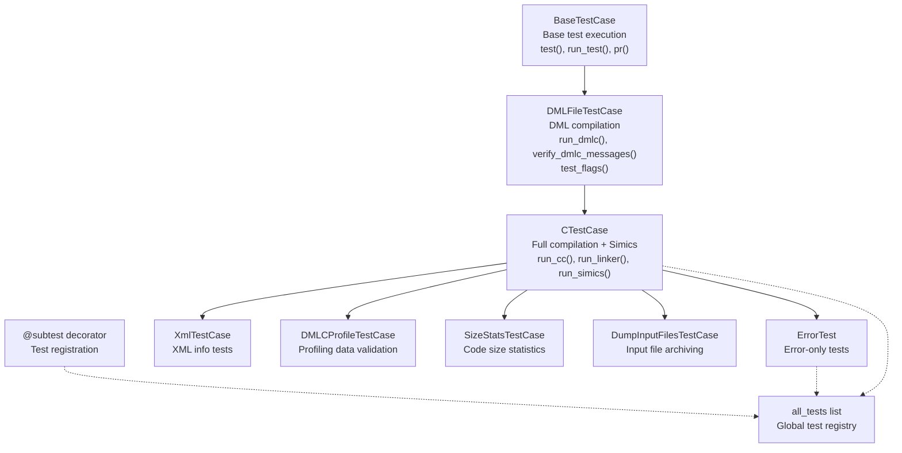
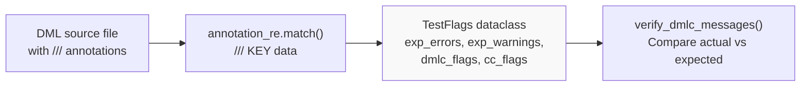
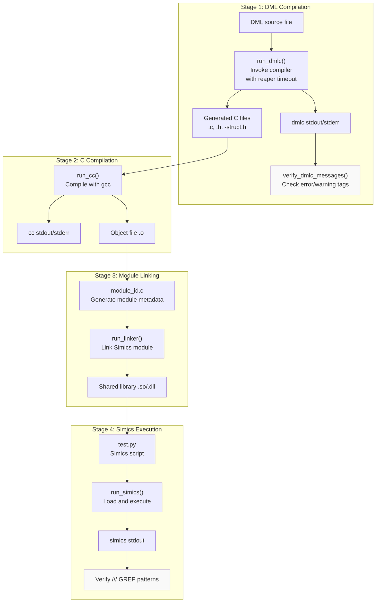
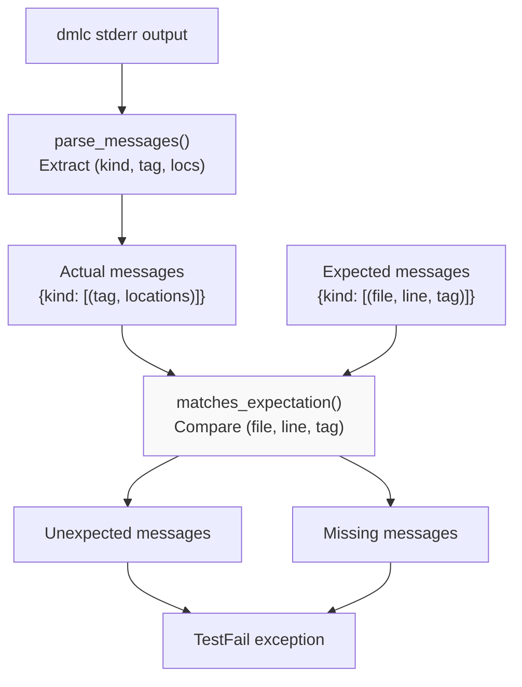
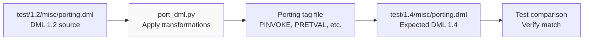

# Testing Framework

<details>
<summary>Relevant source files</summary>

The following files were used as context for generating this wiki page:

- [py/port_dml.py](py/port_dml.py)
- [test/1.2/errors/T_EASSIGN_34.dml](test/1.2/errors/T_EASSIGN_34.dml)
- [test/1.2/methods/T_inline_smallint.dml](test/1.2/methods/T_inline_smallint.dml)
- [test/1.2/misc/porting.dml](test/1.2/misc/porting.dml)
- [test/1.4/misc/T_register_view_fields.py](test/1.4/misc/T_register_view_fields.py)
- [test/1.4/misc/porting-common-compat.dml](test/1.4/misc/porting-common-compat.dml)
- [test/1.4/misc/porting-common.dml](test/1.4/misc/porting-common.dml)
- [test/1.4/misc/porting.dml](test/1.4/misc/porting.dml)
- [test/1.4/structure/T_array_size_param.dml](test/1.4/structure/T_array_size_param.dml)
- [test/XFAIL](test/XFAIL)
- [test/tests.py](test/tests.py)

</details>


This document describes the DML compiler's test infrastructure, including test case types, execution pipeline, annotation system, and verification mechanisms. The framework supports compilation testing, full Simics integration testing, and automated porting validation.

For information about the porting tool that the test framework validates, see [Porting from DML 1.2 to 1.4](#7.2). For compiler architecture details, see [Compilation Pipeline](#5.1).

---

## Overview

The DML testing framework provides comprehensive validation through multiple layers: DML compilation, C compilation, linking, and Simics runtime execution. Tests are defined in the `test/` directory and executed by `test/tests.py`, which implements a multi-stage pipeline that validates compiler output, error messages, and runtime behavior.

**Key capabilities:**
- **Compilation verification**: Tests can verify successful compilation or expected error/warning messages
- **Full integration**: Tests can instantiate devices in Simics and verify runtime behavior
- **Message matching**: Tests specify expected compiler messages using inline annotations
- **Porting validation**: Tests verify DML 1.2 to 1.4 automated migration
- **Known failures**: XFAIL registry tracks expected test failures linked to Simics issues

Sources: [test/tests.py:1-50](), [test/tests.py:134-174]()

---

## Test Framework Architecture

The testing framework is built on a hierarchy of test case classes, each adding functionality for different validation scenarios:



**Class responsibilities:**

| Class | Purpose | Key Methods |
|-------|---------|-------------|
| `BaseTestCase` | Base functionality | `run_test()`, `pr()`, `expect_equal_sets()` |
| `DMLFileTestCase` | DML compilation | `run_dmlc()`, `test_flags()`, `verify_dmlc_messages()` |
| `CTestCase` | Full pipeline | `run_cc()`, `run_linker()`, `run_simics()` |
| `ErrorTest` | Error validation | Overrides `test_flags()` to set expected errors |
| `XmlTestCase` | XML generation | Moves XML file for Simics loading |
| `DMLCProfileTestCase` | Profiling | Validates `.prof` file generation |
| `SizeStatsTestCase` | Size statistics | Validates code size JSON output |

Sources: [test/tests.py:134-174](), [test/tests.py:175-237](), [test/tests.py:576-818](), [test/tests.py:819-876]()

---

## Test File Organization

Tests are organized by DML version and category in the `test/` directory:

```
test/
├── 1.2/                    # DML 1.2 tests
│   ├── errors/            # Compiler error tests
│   ├── structure/         # Language structure tests
│   ├── serialize/         # Checkpointing tests
│   ├── lib/              # Standard library tests
│   ├── methods/          # Method tests
│   ├── operators/        # Operator tests
│   └── misc/             # Miscellaneous tests
├── 1.4/                    # DML 1.4 tests
│   ├── errors/            # Compiler error tests
│   ├── structure/         # Language structure tests
│   ├── serialize/         # Checkpointing tests
│   ├── lib/              # Standard library tests
│   └── misc/             # Miscellaneous tests
├── bugs/                   # Regression tests for specific bugs
├── common/                 # Shared test utilities
├── tests.py               # Main test framework
├── testparams.py          # Test configuration
└── XFAIL                  # Known test failures
```

**Test discovery:** Tests are discovered by scanning directories and creating test case instances for each `.dml` file. The `@subtest` decorator registers test instances in the `all_tests` global list.

Sources: [test/tests.py:912-918]()

---

## Test Annotation System

Test files use special inline comments to specify expected compiler behavior. Annotations begin with `///` followed by a keyword and optional parameters:

### Annotation Syntax



### Common Annotations

| Annotation | Purpose | Example |
|------------|---------|---------|
| `/// ERROR ETAG` | Expect compiler error | `/// ERROR ETYPE` |
| `/// WARNING WTAG` | Expect compiler warning | `/// WARNING WDEPRECATED` |
| `/// ERROR ETAG file.dml` | Error in another file | `/// ERROR ESYNTAX imported.dml` |
| `/// GREP pattern` | Match in stdout | `/// GREP test passed` |
| `/// DMLC-FLAG flag` | Add compiler flag | `/// DMLC-FLAG -Werror` |
| `/// CC-FLAG flag` | Add C compiler flag | `/// CC-FLAG -O0` |
| `/// API-VERSION ver` | Set Simics API version | `/// API-VERSION 6` |
| `/// COMPILE-ONLY` | Skip Simics execution | `/// COMPILE-ONLY` |
| `/// NO-CC` | Skip C compilation | `/// NO-CC` |
| `/// INSTANTIATE-MANUALLY` | Manual object creation | `/// INSTANTIATE-MANUALLY` |
| `/// SCAN-FOR-TAGS file` | Import expectations | `/// SCAN-FOR-TAGS other.dml` |

**Annotation processing:** The `test_flags()` method parses annotations using `annotation_re` to build a `TestFlags` object containing all expectations and configuration.

Sources: [test/tests.py:50-52](), [test/tests.py:479-551]()

### Example Test File

```dml
dml 1.4;
device test;

/// COMPILE-ONLY
/// ERROR ETYPE
/// WARNING WDEPRECATED

bank b {
    /// ERROR ETYPE
    register r size 1 @ 0 {
        // Line after annotation should trigger ETYPE error
        field f @ [32:33];  // Invalid bit range
    }
}
```

Sources: [test/1.4/misc/porting.dml:1-24]()

---

## Test Execution Pipeline

The test execution pipeline consists of multiple stages, each validating a different aspect of compilation and execution:



### Pipeline Implementation

**Stage 1: DML Compilation** ([test/tests.py:283-328]())
- Invokes `dmlc` with reaper timeout (default 80s, configurable per test)
- Captures stdout/stderr for message verification
- Supports comparison with alternative Python interpreter (`pypy_dmlc`)
- Exit status checked against expected status (0 for success, 2 for errors)

**Stage 2: C Compilation** ([test/tests.py:584-605]())
- Compiles generated C code with gcc
- Includes Simics headers and dmllib headers
- Uses flags: `-O2 -std=gnu99 -Wall -Werror -fPIC`
- Captures compiler output for error reporting

**Stage 3: Module Linking** ([test/tests.py:607-677]())
- Generates `module_id.c` with Simics module metadata
- Links object files with Simics runtime libraries
- Produces loadable Simics module (`.so` or `.dll`)
- Uses flags: `-shared -lsimics-common -lvtutils`

**Stage 4: Simics Execution** ([test/tests.py:679-734]())
- Generates Python script to load module and instantiate device
- Executes Simics in batch mode with `--werror`
- For 1.2 tests: checks `runtest` attribute
- For tests with `.py` files: executes custom Python test script
- Verifies `/// GREP` patterns in stdout

Sources: [test/tests.py:239-250](), [test/tests.py:736-817]()

---

## Message Verification System

The framework provides sophisticated message parsing and verification to ensure the compiler produces expected errors and warnings:



### Message Parsing Algorithm

The `parse_messages()` method extracts structured error and warning information from compiler stderr:

**Message format:**
```
file.dml:3:20: In template abc
file.dml:4:9: error EDPARAM: description
file.dml:8:12: conflicting definition
```

**Parsed structure:**
```python
('error', 'EDPARAM', [
    ('file.dml', 4, "file.dml:4:9: error EDPARAM: description"),
    ('file.dml', 3, "file.dml:3:20: In template abc"),
    ('file.dml', 8, "file.dml:8:12: conflicting definition")
])
```

**Key features:**
- Groups multi-line error messages with context
- Handles "In template/method" prefixes
- Supports warnings, errors, and porting messages
- Extracts file, line number, and message tag

Sources: [test/tests.py:331-406]()

### Message Matching

The `expect_messages()` method verifies actual messages against expectations:

**Matching rules:**
1. Each actual message must match at least one expected message
2. Each expected message must match at least one actual message location
3. File names must match (basename comparison)
4. Tags must match exactly
5. Line numbers must match (or expected line is None for any-line matches)

**Failure cases:**
- **Unexpected messages**: Actual message with no matching expectation
- **Missing messages**: Expected message with no matching actual location

Sources: [test/tests.py:408-466]()

---

## Test Case Types

### Basic Compilation Tests

**DMLFileTestCase** tests DML compilation without C compilation or Simics execution:

```python
class DMLFileTestCase(BaseTestCase):
    def test_flags(self, filename):
        # Parse /// annotations from DML file
        return TestFlags(exp_errors=[], exp_warnings=[], ...)
    
    def verify_dmlc_messages(self, stderr, expected_msgs):
        # Parse stderr and verify against expectations
        actual_msgs = parse_messages(lines)
        expect_messages('error', actual, expected['error'])
        expect_messages('warning', actual, expected['warning'])
```

Sources: [test/tests.py:175-237](), [test/tests.py:553-561]()

### Full Integration Tests

**CTestCase** extends DMLFileTestCase to include C compilation, linking, and Simics execution:

**Features:**
- Compiles generated C code to object files
- Links with Simics runtime to create loadable module
- Generates Simics script to instantiate device
- Executes Simics and verifies output
- Supports custom Python test scripts

**Example test with Python script:**

Test file: `test/1.4/misc/T_register_view_fields.dml`
Python script: `test/1.4/misc/T_register_view_fields.py`

```python
# T_register_view_fields.py
from simics import *
from stest import expect_equal

def test(obj):
    b = SIM_get_port_interface(obj, 'register_view', 'b')
    expect_equal(b.register_info(0)[4], [['all', '', 0, 31]])
    # ... more assertions

test(obj)
```

Sources: [test/tests.py:576-817](), [test/1.4/misc/T_register_view_fields.py:1-19]()

### Specialized Test Cases

**ErrorTest** - Tests that only verify compiler errors:
```python
class ErrorTest(CTestCase):
    def __init__(self, path, filename, errors, warnings, **info):
        self.errors = errors
        self.warnings = warnings
        CTestCase.__init__(self, path, filename, status=2, **info)
```

Sources: [test/tests.py:921-927]()

**XmlTestCase** - Tests XML info generation:
```python
class XmlTestCase(CTestCase):
    def run_simics(self, pyfile=None, auto_instantiate=True):
        # Rename generated XML file for Simics loading
        os.rename(f'{self.cfilename}.xml', 
                  join(self.scratchdir, 'test.xml'))
        return CTestCase.run_simics(self, pyfile, auto_instantiate)
```

Sources: [test/tests.py:819-823]()

**DMLCProfileTestCase** - Validates profiling data:
```python
class DMLCProfileTestCase(CTestCase):
    def test(self):
        super().test()
        stats_file_name = os.path.splitext(self.cfilename)[0] + ".prof"
        if exists(stats_file_name):
            pstats.Stats(stats_file_name)  # Validate format
        else:
            raise TestFail('stats file not generated')
```

Sources: [test/tests.py:825-843]()

**SizeStatsTestCase** - Validates code size statistics:
```python
class SizeStatsTestCase(CTestCase):
    def test(self):
        super().test()
        stats = json.loads(Path(self.scratchdir) / 
                          f'T_{self.shortname}-size-stats.json').read_text())
        # Validate: [(size, count, location), ...]
        funcs = [tuple(x) for x in stats if 'size_stats.dml:' in x[2]]
```

Sources: [test/tests.py:846-876]()

**DumpInputFilesTestCase** - Validates input file archiving:
```python
class DumpInputFilesTestCase(CTestCase):
    def test(self):
        super().test()
        # Extract tarball and verify contents
        with tarfile.open(Path(self.scratchdir) / 
                         f'T_{self.shortname}.tar.bz2', 'r:bz2') as tf:
            tf.extractall(dir)
        # Verify recompilation works
        subprocess.check_call(main_dmlc + [filename], cwd=dir)
```

Sources: [test/tests.py:878-910]()

---

## Porting Test Integration

The test framework integrates with `port_dml.py` to validate automated DML 1.2 to 1.4 migration. Porting tests verify that transformations correctly convert old syntax to new syntax.

### Porting Test Files

Porting tests come in pairs:
- **1.2 source**: `test/1.2/misc/porting.dml` - Original DML 1.2 code
- **1.4 target**: `test/1.4/misc/porting.dml` - Expected DML 1.4 result



### Porting Transformations

The porting infrastructure uses `Transformation` classes to convert DML 1.2 constructs to DML 1.4. Each transformation is applied in phases to handle dependencies:

| Transformation | Phase | Purpose |
|----------------|-------|---------|
| `PSHA1` | -10 | Verify source file hash |
| `PINPARAMLIST` | -1 | Add `()` to method references |
| `PTYPEDOUTPARAM` | -1 | Convert output parameter types |
| `PNOTHROW` | 0 | Remove `nothrow` keyword |
| `PINVOKE` | 0 | Convert `call` to direct invocation |
| `PAFTER` | 0 | Convert `after` syntax |
| `PRETVAL_END` | 0 | Add `return` statement at method end |
| `PRETVAL` | 2 | Convert output parameters to return values |
| `PATTRIBUTE` | 2 | Add attribute templates |
| `RemoveMethod` | 3 | Remove dead methods |

**Transformation workflow:**
1. Parse DML 1.2 file with lexer
2. Collect transformation directives from tag file
3. Group by phase and sort
4. Apply transformations using `SourceFile.edit()` and `SourceFile.move()`
5. Track offset translations for overlapping edits
6. Write converted file

Sources: [py/port_dml.py:304-325](), [py/port_dml.py:326-714]()

### Example Porting Pattern

**DML 1.2 method with output parameters:**
```dml
method mo() -> (int i, int e) default {
    i = 3;
    e = 4;
    if (i == 3)
        return;
}
```

**DML 1.4 method with return statement:**
```dml
method mo() -> (int, int) /* i, e */ default {
    local int i;
    local int e;
    i = 3;
    e = 4;
    if (i == 3)
        return (i, e);
    return (i, e);
}
```

**Transformations applied:**
1. `PRETVAL`: Move output parameters to local variables
2. `PRETVAL_END`: Add final return statement
3. `PRETURNARGS`: Convert bare `return` to `return (i, e)`

Sources: [test/1.2/misc/porting.dml:241-246](), [test/1.4/misc/porting.dml:264-272](), [py/port_dml.py:461-517](), [py/port_dml.py:519-531](), [py/port_dml.py:533-544]()

---

## XFAIL Registry

The `XFAIL` file tracks known test failures linked to Simics issue tracking numbers. These tests are expected to fail until the underlying issues are resolved.

### XFAIL Format

```
# SIMICS-8793
1.2/errors/EVARPARAM_2
1.2/errors/EVARPARAM_3

# SIMICS-8783
1.2/errors/EASSIGN_06
1.2/errors/EASSIGN_09

# SIMICS-19603
1.4/structure/object_naming
```

Each entry consists of:
- Comment line with Simics issue number
- One or more test paths (relative to `test/`)

**Purpose:**
- Documents known limitations
- Prevents CI failures for expected issues
- Links test failures to issue tracking
- Provides visibility into technical debt

**Statistics:**
- 29 tests tracked in XFAIL (as of document creation)
- Issues span DML 1.2 and 1.4
- Most common: type system issues (EASSIGN, EVARPARAM)
- Tracked issues: SIMICS-8783, SIMICS-8793, SIMICS-8806, SIMICS-8857, etc.

Sources: [test/XFAIL:1-81]()

---

## Test Execution Environment

### Directory Structure

Each test execution uses isolated directories:

```
sandbox/
├── scratch/
│   └── 1.4/misc/porting/
│       ├── T_porting.c              # Generated C code
│       ├── T_porting.h
│       ├── T_porting-struct.h
│       ├── T_porting.o              # Compiled object
│       ├── module_id.c              # Module metadata
│       ├── module_id.o
│       ├── dml-test-porting.so      # Simics module
│       ├── test.py                  # Generated script
│       ├── porting.dmlc_stdout      # Compiler output
│       ├── porting.dmlc_stderr
│       ├── porting.cc_stdout        # C compiler output
│       ├── porting.cc_stderr
│       ├── porting.ld_stdout        # Linker output
│       ├── porting.ld_stderr
│       ├── porting.simics_stdout    # Simics output
│       └── porting.simics_stderr
└── logs/
    └── 1.4/misc/porting/
        └── (copied from scratch on failure)
```

### Environment Variables

| Variable | Purpose | Default |
|----------|---------|---------|
| `DMLC_DIR` | Compiler location | Auto-detected |
| `DMLC_CC` | C compiler path | Platform-specific gcc |
| `DMLC_PYTHON` | Alternative Python interpreter | None (use mini-python) |
| `DMLC_LINE_DIRECTIVES` | Enable/disable line directives | `yes` |
| `DMLC_DEBUG` | Enable debug mode | `t` (set by tests) |
| `DMLC_GATHER_SIZE_STATS` | Enable size statistics | Test-specific |
| `DMLC_DUMP_INPUT_FILES` | Dump input archive | Test-specific |
| `DMLC_PORTING_TAG_FILE` | Porting tag file path | Port-dml tests only |

Sources: [test/tests.py:29-124]()

### Timeout Management

Compiler timeout is managed using the `reaper` tool:
- Default timeout: 80 seconds
- Configurable per test via `dmlc_timeout_multipliers`
- Example: `"1.2/registers/largearray": 3` (240s timeout)
- Reaper returns exit code 1 on timeout

Sources: [test/tests.py:88-95]()

---

## Test Utilities and Helpers

### Dead Method Detection

The `dead_dml_methods.py` tool detects unused DML methods that have no corresponding C code generation. This helps identify dead code in the standard library and test files.

**Detection algorithm:**
1. Parse generated C file for `#line` directives
2. Extract referenced DML file locations
3. Compare against declared DML methods
4. Report methods with no C code references

Sources: [test/tests.py:35-36]()

### Test Filtering

Tests can be filtered by pattern matching:
- `testparams.matches_test_pattern(fullname)` - Check if test matches filter
- `active_test(fullname)` - Wrapper for pattern matching
- Allows selective test execution for development

Sources: [test/tests.py:58-59]()

### Parallel Execution

The framework supports multi-threaded test execution:
- Each test is a `BaseTestCase` with `finished` threading event
- Tests use `DeferredOutput` to collect messages
- Output is flushed after test completion
- Prevents interleaved output from concurrent tests

Sources: [test/tests.py:128-146]()

---

## Summary

The DML testing framework provides multi-level validation:

| Level | Validates | Test Type |
|-------|-----------|-----------|
| **Compilation** | DML syntax, semantics, type checking | `DMLFileTestCase` |
| **C Generation** | Correct C code output | `CTestCase` (compilation stage) |
| **Linkage** | Module structure, Simics API compatibility | `CTestCase` (linking stage) |
| **Runtime** | Device behavior, register access, events | `CTestCase` (Simics stage) |
| **Porting** | DML 1.2 → 1.4 transformation correctness | Porting test pairs |

**Key files:**
- [test/tests.py:1-2000]() - Main framework implementation
- [py/port_dml.py:1-1500]() - Porting transformation infrastructure  
- [test/XFAIL:1-81]() - Known failure registry
- [test/testparams.py:1-200]() - Test configuration

The framework ensures compiler correctness through comprehensive validation of compilation, code generation, and runtime behavior, while maintaining backward compatibility through automated porting tests.