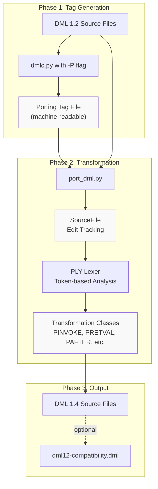
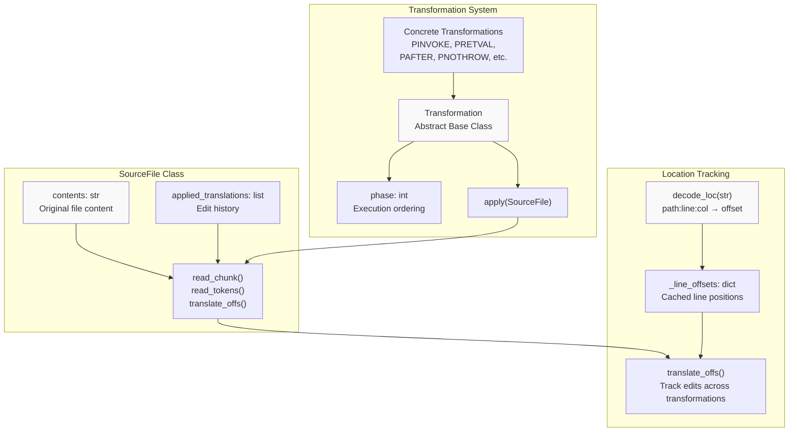
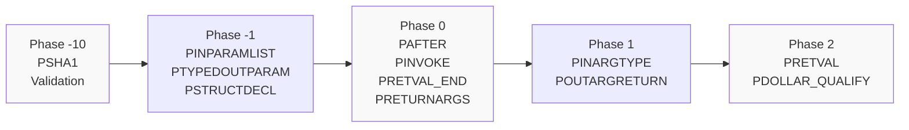
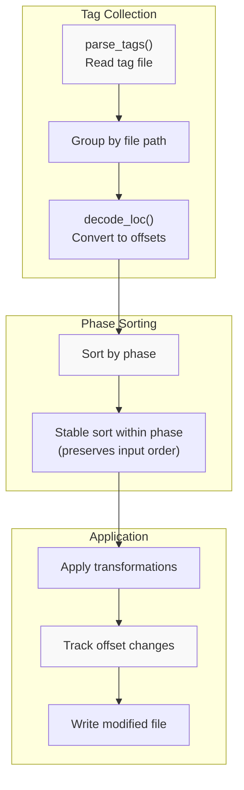
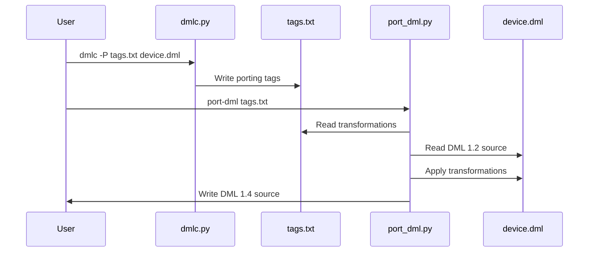
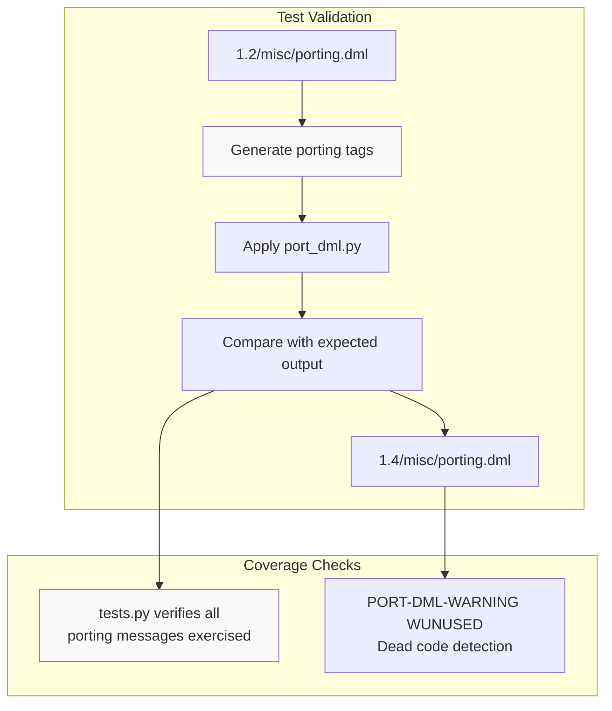

# Porting from DML 1.2 to 1.4

<details>
<summary>Relevant source files</summary>

The following files were used as context for generating this wiki page:

- [RELEASENOTES-1.2.md](RELEASENOTES-1.2.md)
- [RELEASENOTES-1.4.md](RELEASENOTES-1.4.md)
- [RELEASENOTES.md](RELEASENOTES.md)
- [py/port_dml.py](py/port_dml.py)
- [test/1.2/misc/porting.dml](test/1.2/misc/porting.dml)
- [test/1.4/misc/porting-common-compat.dml](test/1.4/misc/porting-common-compat.dml)
- [test/1.4/misc/porting-common.dml](test/1.4/misc/porting-common.dml)
- [test/1.4/misc/porting.dml](test/1.4/misc/porting.dml)
- [test/tests.py](test/tests.py)

</details>


## Purpose and Scope

This page documents the automated migration process from DML 1.2 to DML 1.4, focusing on the `port_dml.py` tool and the transformation system that converts legacy DML syntax and semantics to the modern language version. This guide covers the technical mechanisms of code transformation, the phased transformation architecture, and common migration workflows.

For information about the language differences between DML 1.2 and 1.4, see [Language Versions](#3.1). For details on API compatibility and breaking changes, see [Breaking Changes and Compatibility](#6.4).

---

## Porting Pipeline Overview

The porting process converts DML 1.2 source files to DML 1.4 through a multi-stage automated transformation pipeline. The compiler generates machine-readable porting hints during compilation, which are then consumed by the `port_dml.py` script to apply lexical-level source transformations.



**Diagram: DML 1.2 to 1.4 Porting Pipeline**

The pipeline consists of three phases:
1. **Tag Generation**: DMLC analyzes DML 1.2 source and outputs transformation hints
2. **Transformation**: `port_dml.py` applies lexical transformations based on tags
3. **Output**: Generated DML 1.4 code with optional compatibility layer

Sources: [py/port_dml.py:1-35](), [test/tests.py:89-96](), [RELEASENOTES.md:24-38]()

---

## The port_dml.py Tool

### Tool Architecture



**Diagram: port_dml.py Tool Architecture**

The tool is organized around three core components:
- **SourceFile**: Manages file content and tracks all applied edits
- **Transformation**: Abstract pattern for source transformations with phase ordering
- **Location Tracking**: Converts compiler-generated locations to file offsets

Sources: [py/port_dml.py:82-232](), [py/port_dml.py:308-324]()

### SourceFile Edit Tracking

The `SourceFile` class maintains transformation history to handle overlapping edits correctly:

| Method | Purpose | Parameters |
|--------|---------|------------|
| `edit(offs, length, newstr)` | Replace text at offset | offset, length/string, replacement |
| `move(src_offs, length, dest_offs, newstr)` | Move and transform text | source, length, destination, replacement |
| `read_tokens(offset, end_offset)` | Lex tokens for analysis | start offset, optional end |
| `translate_offs(offset)` | Map original offset to current | original file offset |

Each transformation is recorded as a tuple `(left, right, dest, newlen)` representing the source interval, destination offset, and new length. This allows subsequent transformations to correctly calculate offsets even after earlier edits have modified the file.

Sources: [py/port_dml.py:82-209](), [py/port_dml.py:233-281]()

---

## Transformation System

### Transformation Phases

Transformations are executed in phases to handle dependencies and ensure correct ordering:



**Diagram: Transformation Phase Ordering**

Phases are necessary because some transformations depend on others being completed first. For example, `PINPARAMLIST` (phase -1) must complete before `PTHROWS` to correctly handle method signatures with implicit parameter lists.

Sources: [py/port_dml.py:304-309](), [py/port_dml.py:364-366](), [py/port_dml.py:397-398]()

### Key Transformation Classes

The transformation system implements approximately 40 distinct transformation rules. Here are the most important ones:

| Transformation | Phase | Purpose | Example |
|----------------|-------|---------|---------|
| `PSHA1` | -10 | Validate source file hasn't changed | Hash verification |
| `PINPARAMLIST` | -1 | Add empty parameter list `()` | `method_ref` → `method_ref()` |
| `PSTRUCTDECL` | 0 | Convert struct to typedef | `struct X {...} x;` → `typedef struct {...} X; X x;` |
| `PINVOKE` | 0 | Convert `call` to direct invocation | `call $m() -> (x);` → `x = m();` |
| `PAFTER` | 0 | Convert `after` statement syntax | `after (1) call $m;` → `after 1 s: m()` |
| `PRETVAL` | 2 | Add local variables for out parameters | Adds `local Type name;` |
| `POUTARGRETURN` | 1 | Convert implicit return to explicit | Adds `return (x, y);` |
| `PDOLLAR_QUALIFY` | 2 | Remove `$` prefix, add `this.` | `$field` → `this.field` |
| `PNODOLLAR` | 2 | Remove `$` from references | `$constant` → `constant` |

Sources: [py/port_dml.py:342-355](), [py/port_dml.py:356-363](), [py/port_dml.py:364-409](), [py/port_dml.py:411-448](), [py/port_dml.py:450-459](), [py/port_dml.py:461-517]()

### Transformation Application Example

Consider the transformation of method calls with output arguments:

**DML 1.2 Input:**
```dml
call $method() -> (out1, out2);
```

The porting process applies multiple transformations:

1. **PINVOKE** (phase 0): Removes `call` keyword and moves output arguments
   ```dml
   (out1, out2) = $method();
   ```

2. **PDOLLAR_QUALIFY** (phase 2): Removes `$` prefix
   ```dml
   (out1, out2) = method();
   ```

Sources: [py/port_dml.py:411-448](), [test/1.2/misc/porting.dml:169-177](), [test/1.4/misc/porting.dml:183-185]()

---

## Porting Tag File System

### Tag File Generation

The compiler generates porting tags when invoked with specific flags:

```bash
# Generate tags during compilation
dmlc -P tagfile.txt device.dml

# Or set environment variable
export DMLC_PORTING_TAG_FILE=tagfile.txt
make
```

The tag file contains machine-readable transformation instructions:

```
FILE /path/to/device.dml
PINVOKE location:line:col offs1:line:col offs2:line:col offs3:line:col num_out
PDOLLAR location:line:col
PRETVAL location:line:col body_start:line:col body_end:line:col rparen:line:col (type1 name1) (type2 name2)
```

Each line specifies:
- **Transformation type** (e.g., `PINVOKE`, `PDOLLAR`)
- **Location** in format `path:line:col`
- **Parameters** specific to each transformation

Sources: [RELEASENOTES-1.2.md:19-24](), [py/port_dml.py:308-324]()

### Tag Processing Workflow



**Diagram: Tag File Processing Workflow**

The tag processing ensures transformations are applied in the correct order while maintaining as much of the original tag ordering as possible within each phase. This approach allows for deterministic results even with randomized testing.

Sources: [py/port_dml.py:60-78](), [py/port_dml.py:304-324]()

---

## Porting Workflows

### Basic Porting Workflow

The standard workflow for porting a single DML file:



**Diagram: Basic Porting Workflow Sequence**

Sources: [py/port_dml.py:1-35](), [RELEASENOTES-1.2.md:19-24]()

### Module-Level Porting

For porting entire Simics modules, use `port-dml-module`:

1. **Preparation**: Ensure module builds successfully in DML 1.2
2. **Tag Generation**: Set `DMLC_PORTING_TAG_FILE` and build module
3. **Transformation**: Run `port-dml-module --compat tags.txt` for compatibility mode
4. **Verification**: Compile and test the ported module

The `--compat` flag generates code that maintains compatibility with DML 1.2 when imported:

```bash
# Port with compatibility layer
port-dml-module --compat tags.txt

# Port for standalone DML 1.4
port-dml-module tags.txt
```

Sources: [RELEASENOTES.md:66-72](), [test/1.4/misc/porting-common-compat.dml:1-11](), [test/1.4/misc/porting-common.dml:1-11]()

---

## Compatibility Options

### The --compat Flag

The `--compat` flag modifies porting behavior to generate code compatible with DML 1.2 imports. This is useful for gradual migration of large codebases.

**Without --compat (clean 1.4):**
```dml
method read_register(uint64 enabled_bytes, void *aux) -> (uint64) {
    log info: "before read";
    return default(enabled_bytes, aux);
}
```

**With --compat (1.2 compatible):**
```dml
is dml12_compat_read_register;

method read_register(uint64 enabled_bytes, void *aux) -> (uint64) {
    log info: "before read";
    return default(enabled_bytes, aux);
}
```

The compatibility templates in `dml12-compatibility.dml` provide bridge methods that allow DML 1.2 code to call DML 1.4 implementations correctly.

Sources: [RELEASENOTES.md:64-77](), [test/1.4/misc/porting-common-compat.dml:12-67]()

### Common Compatibility Patterns

| Pattern | DML 1.2 | DML 1.4 with Compatibility |
|---------|---------|---------------------------|
| Register reads | Override `read_register` | `is dml12_compat_read_register` + override |
| Register writes | Override `write_register` | `is dml12_compat_write_register` + override |
| Field reads | Override `read_field` | `is dml12_compat_read_field` + override |
| Field writes | Override `write_field` | `is dml12_compat_write_field` + override |
| IO memory access | Override `io_memory_access` | `is dml12_compat_io_memory_access` + override |

Sources: [test/1.4/misc/porting-common-compat.dml:13-107](), [RELEASENOTES.md:64-66]()

---

## Common Migration Patterns

### Method Calls and Return Values

**Pattern: Converting `call` statements with output parameters**

DML 1.2 uses `call` with `->` syntax for methods with return values:
```dml
call $method() -> (result1, result2);
```

DML 1.4 uses standard function call syntax:
```dml
(result1, result2) = method();
```

The `PINVOKE` transformation handles this conversion automatically.

Sources: [py/port_dml.py:411-448](), [test/1.2/misc/porting.dml:169-177](), [test/1.4/misc/porting.dml:183-185]()

### After Statements

**Pattern: Converting timed callbacks**

DML 1.2 syntax:
```dml
after (1.3 + 0.3) call $method;
after(2.3) call $method();
```

DML 1.4 syntax:
```dml
after 1.3 + 0.3 s: method();
after 2.3 s: method();
```

The `PAFTER` transformation converts the syntax and adds the time unit suffix.

Sources: [py/port_dml.py:450-459](), [test/1.2/misc/porting.dml:176-177](), [test/1.4/misc/porting.dml:191-192]()

### Parameter and Constant References

**Pattern: Removing `$` prefix and qualifying references**

DML 1.2 uses `$` to reference parameters, constants, and object members:
```dml
$constant_value
$field
$parent_object.child
```

DML 1.4 removes `$` and uses explicit qualification where needed:
```dml
constant_value
this.field
parent_object.child
```

The `PDOLLAR_QUALIFY` and `PNODOLLAR` transformations handle this conversion, intelligently determining when `this.` qualification is required.

Sources: [py/port_dml.py:735-789](), [test/1.2/misc/porting.dml:40-44](), [test/1.4/misc/porting.dml:45-50]()

### Struct Declarations

**Pattern: Converting struct definitions to typedefs**

DML 1.2 allows inline struct definitions:
```dml
struct foo_t { int i; }
```

DML 1.4 requires typedef syntax:
```dml
typedef struct { int i; } foo_t;
```

The `PSTRUCTDECL` transformation handles this conversion automatically.

Sources: [py/port_dml.py:373-384](), [test/1.2/misc/porting.dml:26](), [test/1.4/misc/porting.dml:26]()

### Bank Arrays

**Pattern: Converting array dimension syntax**

DML 1.2 uses range syntax:
```dml
bank arr[j in 0..15];
bank arr[j in 0..$sixteen - 1];
```

DML 1.4 uses size syntax:
```dml
bank arr[j < 16];
bank arr[j < sixteen];
```

The `PINDEXED` transformation converts array declarations automatically.

Sources: [py/port_dml.py:1039-1118](), [test/1.2/misc/porting.dml:133-140](), [test/1.4/misc/porting.dml:145-153]()

### Events

**Pattern: Converting event objects**

The porting tool can automatically convert simple events to use the new event templates:

DML 1.2:
```dml
event simple_ev {
    parameter timebase = "cycles";
    method event(void *data) {}
}
```

DML 1.4:
```dml
event simple_ev is simple_cycle_event {
    method event() {}
}
```

This conversion is handled by the `PEVENT_NO_ARG`, `PEVENT_UINT64_ARG`, and related transformations.

Sources: [py/port_dml.py:1265-1324](), [test/1.2/misc/porting.dml:382-390](), [test/1.4/misc/porting.dml:405-407](), [RELEASENOTES-1.2.md:87-118]()

---

## Testing Ported Code

The test framework includes comprehensive validation of porting transformations:



**Diagram: Porting Test Validation Process**

The testing framework ensures:
1. All porting transformations are exercised
2. Dead code detection identifies unused methods
3. Output matches expected 1.4 code

Sources: [test/tests.py:1-50](), [test/1.2/misc/porting.dml:1-18](), [test/1.4/misc/porting.dml:1-18]()

### Unused Method Detection

The porting tool can warn about methods that are no longer called in DML 1.4:

```dml
// PORT-DML-WARNING WUNUSED
method dead_inline(inline i) {
    log info: "%d", $b.r.f;
}
```

This warning indicates that the method signature or usage pattern changed between 1.2 and 1.4, and manual review is needed.

Sources: [test/1.4/misc/porting.dml:201-204](), [test/1.2/misc/porting.dml:195-198]()

---

## Manual Conversion Requirements

While `port_dml.py` automates most conversions, some patterns require manual intervention:

### Patterns Requiring Manual Conversion

| Pattern | Reason | Action Required |
|---------|--------|----------------|
| Complex `io_memory_access` overrides | Signature changed | Review TODO comments, adapt logic |
| Custom miss patterns with multiple read/write paths | Different control flow | Refactor into `unmapped_read`/`unmapped_write` |
| Methods using `inline` parameters extensively | Semantics changed | Review inlining requirements |
| Complex template inheritance conflicts | Resolution rules changed | Resolve diamond inheritance explicitly |

The porting tool marks areas needing manual review with `TODO` comments:

```dml
method io_memory_access(generic_transaction_t *memop, uint64 offset, void *aux) -> (bool) {
    // TODO: further conversion likely needed; probably move
    // old_access implementation into this method
    try {
        old_access(memop, offset, SIM_get_mem_op_size(memop));
    } catch {
        return false;
    }
    return true;
}
```

Sources: [test/1.4/misc/porting-common.dml:88-104](), [test/1.4/misc/porting-common-compat.dml:109-128]()

---

## Troubleshooting

### Common Issues

| Issue | Cause | Solution |
|-------|-------|----------|
| SHA1 mismatch error | Modified source after tag generation | Regenerate tags or revert source changes |
| Overlapping edits | Complex transformations conflict | Review transformation phases, may need manual merge |
| Missing `this.` qualification | Ambiguous reference context | Manually add `this.` where needed |
| Incorrect type conversions | Type inference limitations | Add explicit type annotations |

### Debugging Transformations

To debug transformation issues:

1. Enable verbose output in `port_dml.py`
2. Review applied transformations in order
3. Compare intermediate states after each phase
4. Check for conflicting transformations using the test suite

The transformation tracking in `SourceFile.applied_translations` records all edits, allowing post-mortem analysis of transformation sequences.

Sources: [py/port_dml.py:82-209](), [py/port_dml.py:342-355]()