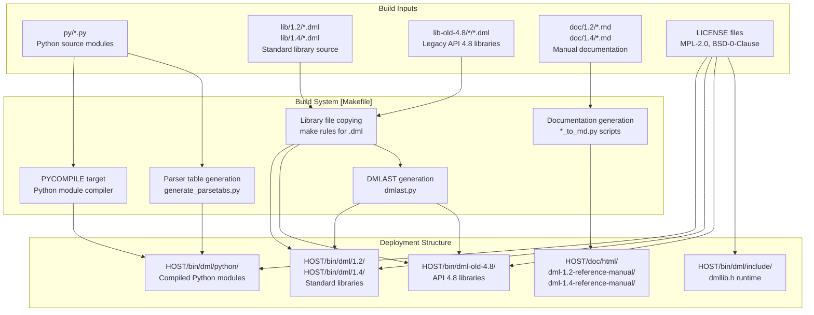
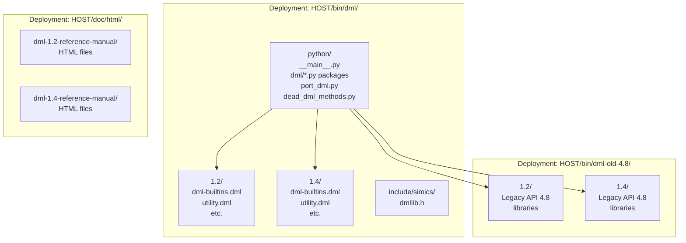
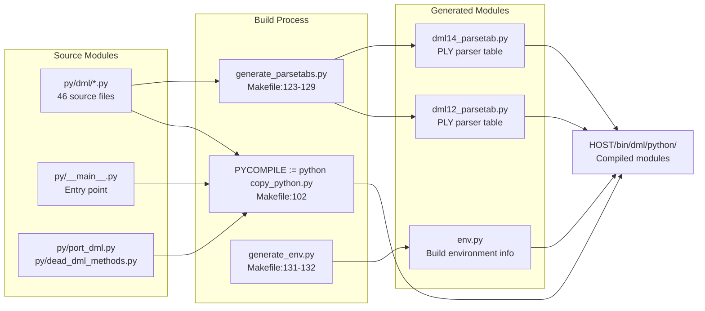
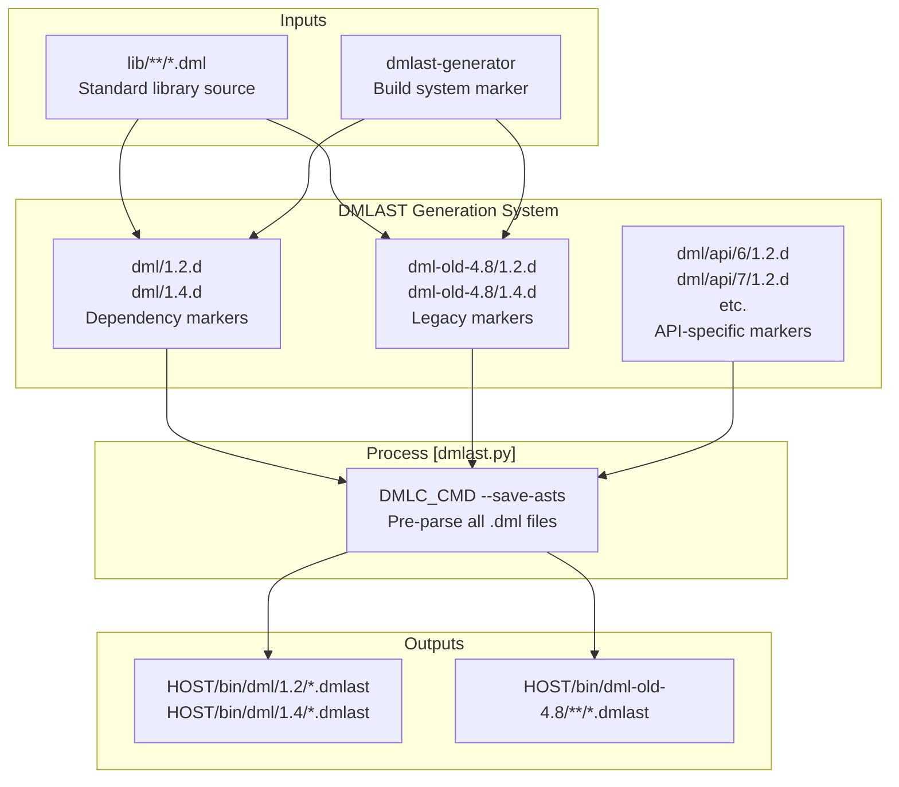
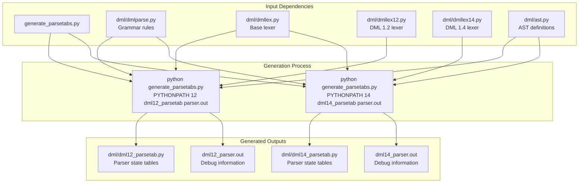
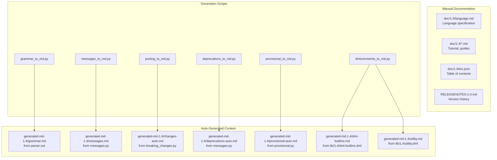
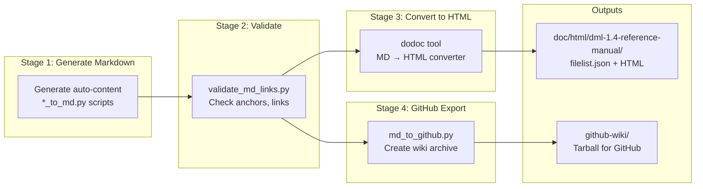
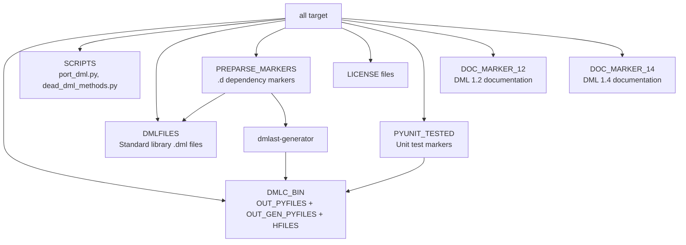

# Build System and Documentation

<details>
<summary>Relevant source files</summary>

The following files were used as context for generating this wiki page:

- [MODULEINFO](MODULEINFO)
- [Makefile](Makefile)
- [md_to_github.py](md_to_github.py)
- [validate_md_links.py](validate_md_links.py)

</details>


## Purpose and Scope

This page describes the build system and documentation generation infrastructure for the DML compiler. It covers the Makefile-based build orchestration, Python module compilation, standard library deployment, parser table generation, and the complete documentation pipeline from source Markdown and code comments to HTML reference manuals and GitHub wiki archives.

For information about the compiler's internal architecture, see [Compiler Architecture](#5). For testing infrastructure, see [Testing Framework](#7.1).

## Build System Overview

The DML compiler build system is orchestrated by a GNU Makefile that performs five major build phases:

1. **Python Module Compilation**: Compiles Python source modules into the deployment structure
2. **Library Deployment**: Copies DML standard library files to version-specific directories
3. **Parser Table Generation**: Pre-generates PLY parser tables for fast startup
4. **DMLAST Precompilation**: Pre-parses standard library files into `.dmlast` format
5. **Documentation Generation**: Produces HTML reference manuals and GitHub wiki archives



**Diagram: DML Compiler Build System Architecture**

Sources: [Makefile:1-251](), [MODULEINFO:1-134]()

## Module Structure and Deployment

The MODULEINFO file defines five module groups that organize the compiler's components for Simics package management:

| Group | Purpose | Key Components |
|-------|---------|----------------|
| `dmlc` | Main compiler module | All sub-groups, release notes |
| `dmlc-py` | Python source modules | 31 Python files in `dml/` package |
| `dmlc-lib` | Standard library files | DML libraries, runtime headers, licenses |
| `dml-1.2-reference-manual` | DML 1.2 documentation | HTML reference manual |
| `dml-1.4-reference-manual` | DML 1.4 documentation | HTML reference manual |

The deployment structure supports multiple DML versions and Simics API versions:



**Diagram: Deployed Module Directory Structure**

The `@6-only()` directive in MODULEINFO conditionally includes API 4.8 libraries only in Simics 6 builds. This allows the compiler to support legacy devices while encouraging migration to modern APIs.

Sources: [MODULEINFO:1-134](), [Makefile:8-97]()

## Python Module Compilation

Python modules are compiled using the `copy_python.py` script, which copies source files while optionally compiling to bytecode:



**Diagram: Python Module Compilation Pipeline**

The Makefile defines three sets of Python files:

1. **PYFILES** [Makefile:11-46](): 46 source modules copied from `py/` directory
2. **GEN_PYFILES** [Makefile:51-53](): 3 generated modules created during build
3. **SCRIPTS** [Makefile:82](): 2 standalone scripts copied without modification

The compilation rules ensure dependencies are respected:

- `OUT_PYFILES` depends on source files [Makefile:108-110]()
- `OUT_GEN_PYFILES` depends on source files [Makefile:104-106]()
- Parser tables depend on lexer and parser modules [Makefile:123-129]()

Sources: [Makefile:11-142]()

## Standard Library Management

The build system manages three sets of DML library files with version-specific deployment:

### Library Source Organization

| Source Directory | Target Directory | DML Versions | Description |
|-----------------|------------------|--------------|-------------|
| `lib/1.2/` | `$(HOST)/bin/dml/1.2/` | All APIs | DML 1.2 standard library |
| `lib/1.4/` | `$(HOST)/bin/dml/1.4/` | All APIs | DML 1.4 standard library |
| `lib-old-4.8/` | `$(HOST)/bin/dml-old-4.8/` | API 4.8 only | Legacy API-specific libraries |

### DMLAST Precompilation

The build system pre-parses all standard library files into `.dmlast` format for faster compilation. This process is managed by dependency markers:



**Diagram: DMLAST Precompilation System**

The dependency markers serve dual purposes [Makefile:182-198]():
1. **Markers**: Track when precompilation is needed (when any `.dml` file changes)
2. **Depfiles**: Make-style dependency files that trigger rebuilds

The `dmlast-generator` marker [Makefile:177-178]() is touched whenever the parser or compiler changes, forcing recompilation of all `.dmlast` files.

Sources: [Makefile:66-198](), [MODULEINFO:8-133]()

## Parser Table Generation

The compiler uses PLY (Python Lex-Yacc) for parsing, which requires pre-generated parser tables for performance. The build system generates two sets of tables for DML 1.2 and 1.4:



**Diagram: Parser Table Generation Process**

The Makefile rule [Makefile:123-129]() ensures parser tables are regenerated when:
- Grammar rules in `dmlparse.py` change
- Lexer definitions in `dmllex*.py` change
- AST definitions in `ast.py` change

The `parser.out` debug files are also used by documentation generation to extract grammar rules for the reference manual [Makefile:63-64]().

Sources: [Makefile:51-53](), [Makefile:123-132]()

## Documentation Generation Pipeline

The DML reference manual combines hand-written Markdown with auto-generated content extracted from multiple sources:

### Documentation Sources



**Diagram: Documentation Generation Sources**

### Build Pipeline

The documentation build follows this sequence:



**Diagram: Documentation Build Pipeline**

The validation step [Makefile:232-233]() ensures:
- All internal links point to valid anchors [validate_md_links.py:62-79]()
- Referenced HTML files exist in the documentation set
- No en-dashes (`--`) are used instead of em-dashes (`&mdash;`) [validate_md_links.py:99-102]()

Sources: [Makefile:200-250](), [validate_md_links.py:1-107]()

## Documentation Generation Scripts

Each auto-generated documentation file is produced by a specialized Python script:

| Script | Input | Output | Purpose |
|--------|-------|--------|---------|
| `grammar_to_md.py` | `parser.out` | `grammar.md` | Extract grammar rules from PLY parser |
| `messages_to_md.py` | `messages.py` | `messages.md` | Document compiler error/warning messages |
| `porting_to_md.py` | `breaking_changes.py` | `changes-auto.md` | List breaking changes by API version |
| `deprecations_to_md.py` | `messages.py` | `deprecations-auto.md` | Document deprecated features |
| `provisional_to_md.py` | `provisional.py` | `provisional-auto.md` | List provisional (unstable) features |
| `dmlcomments_to_md.py` | `lib/1.4/*.dml` | `dml-builtins.md`, `utility.md` | Extract API docs from DML comments |

### Grammar Extraction

The `grammar_to_md.py` script parses PLY's parser debug output to generate human-readable grammar documentation [Makefile:204-205]():

```
dmlparse.py → PLY → parser.out → grammar_to_md.py → grammar.md
```

This ensures the documented grammar exactly matches the implemented parser.

### Library Documentation Extraction

The `dmlcomments_to_md.py` script extracts documentation from special comments in DML library files [Makefile:227-228]():

```dml
// Documentation comment format:
/// This is a documented template
template my_template {
    /// This parameter controls...
    param my_param;
}
```

Sources: [Makefile:204-228]()

## GitHub Wiki Export

The `md_to_github.py` script converts the reference manual to GitHub wiki format by:

1. **Rewriting Links** [md_to_github.py:90-96](): Converts relative HTML links to wiki-style links
   ```
   [text](language.html#section) → [text](Language#section)
   ```

2. **Adding Copyright Headers** [md_to_github.py:48-52](): Prepends MPL-2.0 license notice to each file

3. **Creating Front Page** [md_to_github.py:68-69](): Generates table of contents with hierarchical section numbering

4. **Packaging** [md_to_github.py:88-105](): Creates `.tar.gz` archive for upload to GitHub

The script uses the same `toc.json` structure as the main documentation build [md_to_github.py:15-31](), ensuring consistency between HTML and wiki versions.

Sources: [md_to_github.py:1-106]()

## Link Validation System

The `validate_md_links.py` script ensures documentation integrity through comprehensive link checking:

### Anchor Detection

The validator detects three types of anchors [validate_md_links.py:36-53]():

1. **Explicit anchors**: `<a id="anchor-name"/>`
2. **Header anchors**: Generated from `#` header lines (normalized to lowercase, hyphenated)
3. **Ambiguous anchors**: Headers with identical text (excluded from valid anchors)

### Link Validation

For each link, the validator [validate_md_links.py:62-79]():

1. Parses the link format: `[text](file.html#anchor)`
2. Resolves the target file from multiple source directories
3. Verifies the anchor exists in the target file's content
4. Reports errors with file and line number information

### Special Validations

- **External links**: URLs starting with `https://` are skipped [validate_md_links.py:67-68]()
- **Typography**: Detects `--` that should be `&mdash;` [validate_md_links.py:99-102]()
- **Character restrictions**: Headers with special characters cannot be referenced [validate_md_links.py:30-33](), [validate_md_links.py:45-47]()

Sources: [validate_md_links.py:1-107]()

## License Management

The build system manages three license types across the codebase:

| License | Files | Purpose |
|---------|-------|---------|
| MPL-2.0 | `$(PYTHONPATH)/LICENSE` | Python compiler modules |
| BSD-0-Clause | `$(DMLLIB_DEST)/*/LICENSE` | DML standard library (public domain) |
| BSD-0-Clause | `$(DMLLIB_DEST)/include/simics/LICENSE` | Runtime header `dmllib.h` |

License deployment rules [Makefile:84](), [Makefile:164-173]():

```makefile
MPL_LICENSE := $(PYTHONPATH)/LICENSE
BSD0_LICENSES := $(addsuffix /LICENSE,$(DMLLIB_DESTDIRS) 
                              $(OLD_DMLLIB_DESTDIRS_4_8) 
                              $(DMLLIB_DEST)/include/simics)
```

The separation reflects different usage models:
- **Compiler (MPL-2.0)**: Requires derivative works to remain open source
- **Libraries (BSD-0-Clause)**: No restrictions, suitable for embedding in proprietary devices

Sources: [Makefile:83-84](), [Makefile:160-173](), [MODULEINFO:88-93]()

## Build Targets and Phases

The Makefile defines several key targets that can be built independently:

### Primary Target: `all`

The default target [Makefile:90-97]() builds all components:

```makefile
all: $(DMLC_BIN)                    # Compiler binaries
     $(SCRIPTS)                     # Utility scripts
     $(DMLFILES)                    # Standard libraries
     $(OLD_DMLFILES_4_8)            # Legacy libraries
     $(BSD0_LICENSES)               # Library licenses
     $(MPL_LICENSE)                 # Compiler license
     $(PYUNIT_TESTED)               # Unit test results
     $(PARSER_DEBUGFILES)           # Parser debug info
```

### Dependency Chain



**Diagram: Build Target Dependencies**

Sources: [Makefile:90-97](), [Makefile:177-198](), [Makefile:235](), [Makefile:250]()

## Unit Test Integration

The build system runs Python unit tests as part of the build process [Makefile:48-50](), [Makefile:138-142]():

```makefile
PYUNIT_FILES := $(wildcard $(DMLC_DIR)/py/dml/*_test.py)
PYUNIT_TESTED := $(foreach x,$(PYUNIT_FILES),
                    $(basename $(notdir $x))-pyunit-tested)

%-pyunit-tested: $(DMLC_DIR)/py/dml/%.py $(OUT_PYFILES)
	$(RUN_PY_UNIT_TEST) $(SIMICS_PROJECT)/$(HOST_TYPE) $<
	touch $@
```

The build creates marker files (e.g., `ctree_test-pyunit-tested`) that track successful test execution. Tests are re-run when:
- The tested module changes
- Any compiled Python module changes (dependency on `$(OUT_PYFILES)`)

Some tests require external tools [Makefile:134-136]():
```makefile
# needed by ctree_test.py
export CC
export SIMICS_BASE
```

Sources: [Makefile:48-50](), [Makefile:134-142]()

## Build Environment Variables

The build system configures several environment variables and paths:

| Variable | Definition | Purpose |
|----------|-----------|---------|
| `DMLC_DIR` | `$(SRC_BASE)/$(TARGET)` | Source directory location |
| `LIBDIR` | `$(SIMICS_PROJECT)/$(HOST_TYPE)/bin` | Deployment base directory |
| `PYTHONPATH` | `$(LIBDIR)/dml/python` | Python module search path |
| `DMLC_CMD` | `$(PYTHON) $(PYTHONPATH)/__main__.py` | Compiler invocation command |
| `PYCOMPILE` | `$(PYTHON) $(SIMICS_BASE)/scripts/copy_python.py` | Python compilation script |
| `DODOC` | `$(SIMICS_BASE)/$(HOST_TYPE)/bin/dodoc$(EXE_SUFFIX)` | Documentation tool |

The `generate_env.py` script creates `env.py` [Makefile:131-132]() with build-time configuration that the compiler can query at runtime.

Sources: [Makefile:8-10](), [Makefile:57-58](), [Makefile:100-102](), [Makefile:200]()