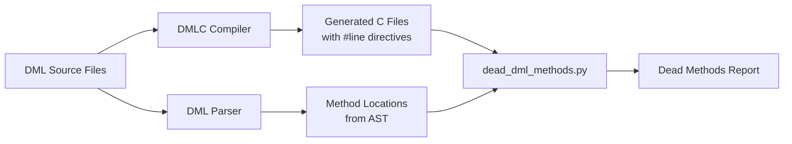
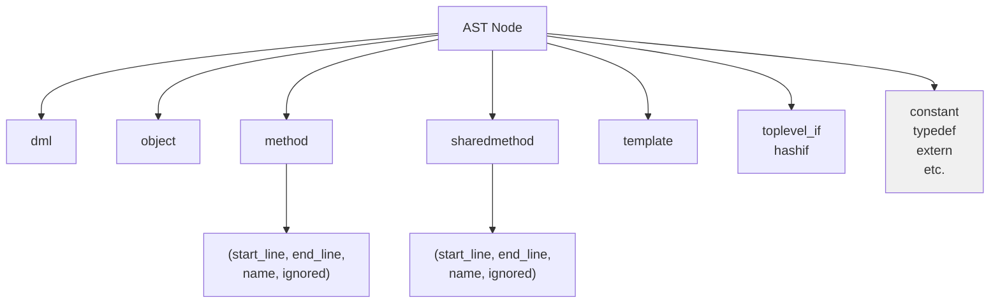
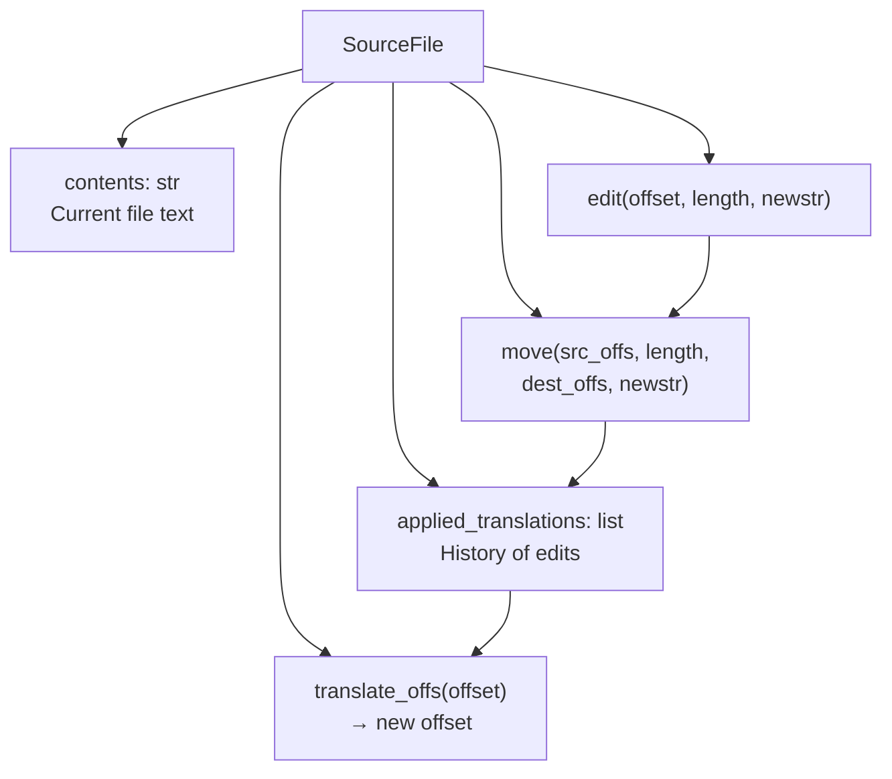
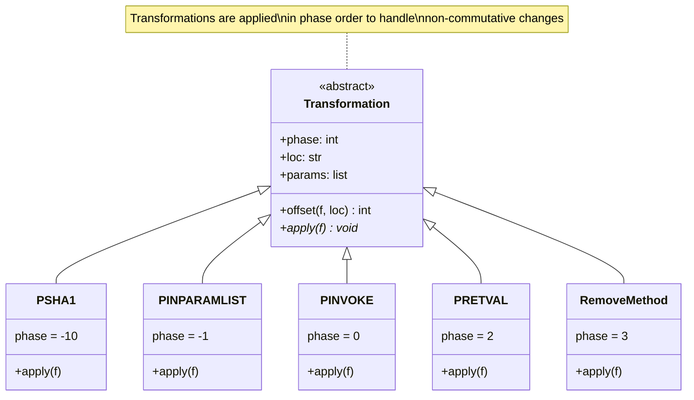
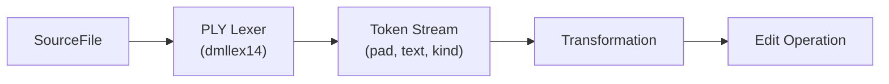
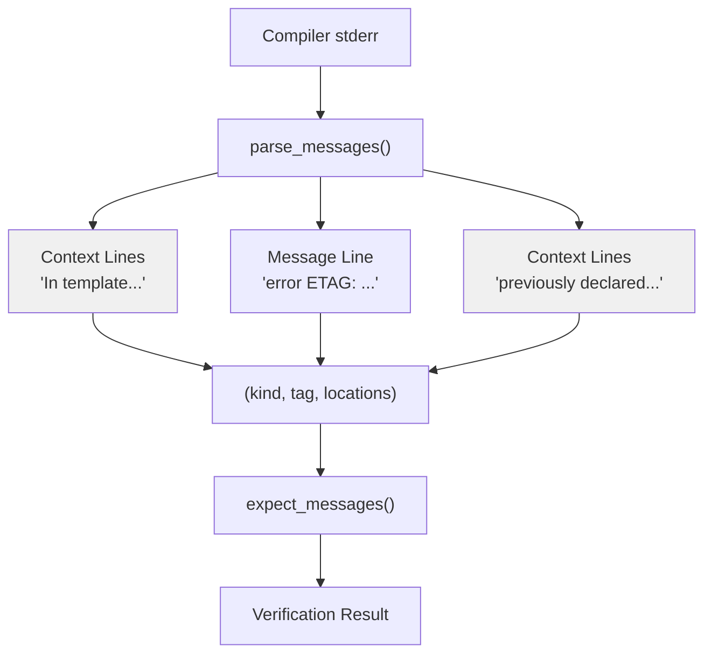
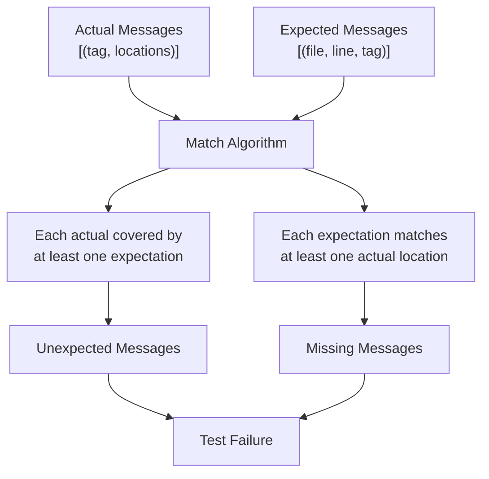
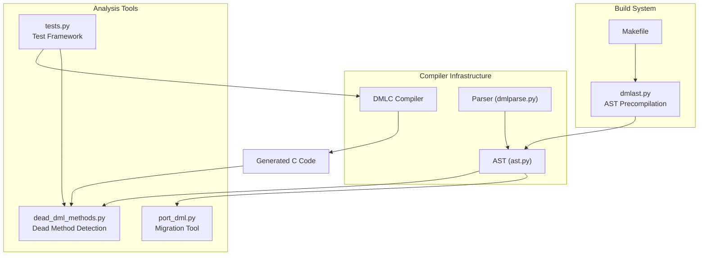

# Code Analysis Tools

<details>
<summary>Relevant source files</summary>

The following files were used as context for generating this wiki page:

- [dmlast.py](dmlast.py)
- [py/dead_dml_methods.py](py/dead_dml_methods.py)
- [py/port_dml.py](py/port_dml.py)
- [test/1.2/misc/porting.dml](test/1.2/misc/porting.dml)
- [test/1.4/misc/dead_methods.dml](test/1.4/misc/dead_methods.dml)
- [test/1.4/misc/dead_methods_imported.dml](test/1.4/misc/dead_methods_imported.dml)
- [test/1.4/misc/dead_methods_unimported.dml](test/1.4/misc/dead_methods_unimported.dml)
- [test/1.4/misc/dead_methods_unimported_dml12.dml](test/1.4/misc/dead_methods_unimported_dml12.dml)
- [test/1.4/misc/porting-common-compat.dml](test/1.4/misc/porting-common-compat.dml)
- [test/1.4/misc/porting-common.dml](test/1.4/misc/porting-common.dml)
- [test/1.4/misc/porting.dml](test/1.4/misc/porting.dml)
- [test/tests.py](test/tests.py)

</details>


This page documents the code analysis and diagnostic tools available for DML development. These tools help identify unused code, validate compiler behavior, and facilitate code migration. For information about the testing framework itself, see [Testing Framework](#7.1). For the automated migration tool, see [Porting from DML 1.2 to 1.4](#7.2).

## Dead Method Detection

The `dead_dml_methods.py` module provides functionality to identify DML methods that are never invoked during compilation, making them candidates for removal or testing.

### How It Works

The dead method detector operates by analyzing the relationship between DMLC-generated C code and the original DML source files:



**Figure 1: Dead Method Detection Pipeline**

The tool uses two key data sources:

1. **#line directives** in generated C code indicate which DML source lines produced each C statement
2. **AST traversal** of DML files identifies the syntactic boundaries of all method definitions

A method is considered "dead" if no #line directive points to any location within that method's definition.

Sources: [py/dead_dml_methods.py:1-192]()

### API Usage

The module exposes two primary functions:

**`dml_sources(c_file: Path) -> set[Path]`**

Extracts the list of DML source files used to generate a C file by parsing the header comment:

```python
c_files = set(Path('linux64/obj/modules').glob('*/*-dml.c'))
dml_files = set().union(*(dml_sources(c_file) for c_file in c_files))
```

**`find_dead_methods(c_files: set[Path], dml_files: set[Path]) -> (dict[Path, list[int]], list[Path])`**

Analyzes C files and returns a tuple of `(dead, skipped)`:
- `dead`: Maps DML file paths to lists of `(line_number, method_name)` tuples
- `skipped`: Files referenced in #line directives but not in the `dml_files` set

Sources: [py/dead_dml_methods.py:59-65](), [py/dead_dml_methods.py:143-192]()

### Implementation Details

**Line Mark Collection**

The tool scans generated C files using a regular expression to extract #line directives:

```python
line_directive_re = re.compile('^ *#line ([0-9]+) "(.*)"$', flags=re.M)
```

All line numbers are collected into a map `linemarks_by_path[dml_file]` for efficient lookup.

Sources: [py/dead_dml_methods.py:135-166]()

**AST Traversal**

The `traverse_ast()` function walks the DML abstract syntax tree to identify methods:



**Figure 2: AST Node Types Processed by traverse_ast()**

Methods are excluded from analysis (marked as `ignored=True`) if they:
- Have `inline` parameters (may be optimized away)
- Contain only `error` statements (intentionally dead)

Sources: [py/dead_dml_methods.py:67-132]()

**Example Test Case**

The test file [test/1.4/misc/dead_methods.dml:1-62]() demonstrates the tool's behavior with various method types:

| Method Type | Status | Reason |
|-------------|--------|--------|
| `dead()` | DEAD | No references in C code |
| `live()` | Not dead | Called from `init()` |
| `exported()` | Not dead | Exported via `export` statement |
| `inline_dead()` | Not dead | Inline methods excluded from analysis |

Sources: [test/1.4/misc/dead_methods.dml:33-61]()

### Integration with Test Framework

The test framework uses dead method detection to validate that test files don't contain unreachable code. The test system imports the module and validates that methods marked with `/// DEAD` comments are indeed detected as dead:

Sources: [test/tests.py:35-36]()

## Port DML Source Transformation System

While the main porting tool is documented in [Porting from DML 1.2 to 1.4](#7.2), this section covers the underlying transformation infrastructure used by `port_dml.py`.

### SourceFile Edit Tracking

The `SourceFile` class manages source file modifications while maintaining location information for overlapping edits:



**Figure 3: SourceFile Edit Management**

Each transformation records a tuple `(left, right, dest, newlen)` describing:
- `left`, `right`: Original source interval (half-open)
- `dest`: Destination offset where content was moved
- `newlen`: Length of content after transformation

The `translate_offs()` method applies all recorded transformations to map original file offsets to current offsets, enabling transformations to be applied in any order.

Sources: [py/port_dml.py:82-210]()

### Transformation Class Hierarchy

All transformations inherit from the abstract `Transformation` base class:



**Figure 4: Transformation Class Hierarchy with Phase Ordering**

The `phase` attribute ensures transformations are applied in the correct order. Lower phases execute first to establish preconditions for later transformations.

Sources: [py/port_dml.py:308-325]()

### Location Decoding

The `decode_loc()` function converts string locations `"path:line:col"` into file offsets:

```python
_line_offsets = {}  # Cached line offset maps

def decode_loc(loc_str):
    (path, line, col) = loc_str.rsplit(':', 2)
    if path not in _line_offsets:
        with open(path, newline='') as f:
            _line_offsets[path] = [0] + list(accumulate(
                len(line) for line in f))
    return (path, _line_offsets[path][int(line) - 1] + int(col) - 1)
```

This allows transformations to specify edit locations using the same coordinate system as compiler error messages.

Sources: [py/port_dml.py:67-78]()

### Token-Based Editing

The `SourceFile.read_tokens()` method integrates PLY lexer support to perform token-aware edits:



**Figure 5: Token-Based Editing Pipeline**

Transformations can use `skip_tokens()` to measure text spans in terms of lexical tokens rather than character counts, making edits resilient to whitespace variations.

Sources: [py/port_dml.py:123-145]()

## Test Framework Message Analysis

The test framework in `tests.py` provides utilities for analyzing and validating compiler output.

### Message Parsing

The `DMLFileTestCase.parse_messages()` static method extracts structured error and warning information from compiler stderr:



**Figure 6: Compiler Message Parsing and Verification Flow**

Each message is represented as a triple `(kind, tag, locations)` where:
- `kind`: `'error'`, `'warning'`, or `'porting'`
- `tag`: Message identifier (e.g., `'ETAG'`, `'WTAG'`)
- `locations`: List of `(filename, lineno, full_line)` tuples

Sources: [test/tests.py:330-407]()

### Message Context Heuristics

The parser uses heuristics to group related message lines:

| Line Pattern | Classification | Action |
|--------------|----------------|--------|
| Starts with `"In "` | Pre-context | Add to current message locations |
| Contains `"error ETAG:"` | Main message | Start new message, record location |
| Contains `"warning WTAG:"` | Main message | Start new message, record location |
| Other patterns | Post-context | Add to current message locations |

The parser handles multi-location messages where a single error/warning is reported at multiple source locations.

Sources: [test/tests.py:348-406]()

### Test Annotation System

Test files use special comments to specify expected compiler behavior:

```python
annotation_re = re.compile(b' */// +([A-Z-]+)(?: +(.*))?')
```

Supported annotations include:

| Annotation | Purpose | Example |
|------------|---------|---------|
| `/// ERROR ETAG` | Expect error on next line | `/// ERROR EUNDEF` |
| `/// WARNING WTAG` | Expect warning on next line | `/// WARNING WEXPERIMENTAL` |
| `/// ERROR ETAG file.dml` | Expect error anywhere in file | `/// ERROR ESYNTAX imported.dml` |
| `/// DMLC-FLAG` | Additional compiler flag | `/// DMLC-FLAG --strict` |
| `/// API-VERSION` | Override API version | `/// API-VERSION 6` |
| `/// COMPILE-ONLY` | Skip C compilation | `/// COMPILE-ONLY` |

Sources: [test/tests.py:50-52](), [test/tests.py:491-551]()

### Message Expectation Matching

The `expect_messages()` method verifies that actual compiler messages match test expectations:



**Figure 7: Message Expectation Matching Algorithm**

The matching algorithm allows flexible line number specifications:
- Exact match: `(file, 42, tag)` expects the message at line 42
- Any line: `(file, None, tag)` expects the message anywhere in the file

Sources: [test/tests.py:408-466]()

### XFAIL Registry

The test system tracks expected failures using an XFAIL registry. Tests can be marked as expected to fail when they exercise known Simics or compiler issues that are not yet fixed.

Sources: [test/tests.py:920-927]()

## DMLAST Precompilation

The `dmlast.py` script generates precompiled `.dmlast` files from DML source files to speed up compilation.

### Purpose

DMLAST files are pickled Python objects representing the parsed abstract syntax tree of a DML file. Loading a `.dmlast` file is significantly faster than reparsing the source `.dml` file, especially for large standard library files that are imported by many device models.

### Usage in Build System

The build system generates `.dmlast` files for all library files:

```python
def create_dmlasts(dmlc_path, dmlast_path, dml_path, depfile):
    dml_files_abs = list(dml_path.rglob('*.dml'))
    for f in dml_files:
        produce_dmlast(dmlast_path / f)
```

The function also generates a dependency file tracking which DML source files affect the `.dmlast` outputs.

Sources: [dmlast.py:7-37]()

### Integration with Compiler

When DMLC loads a DML file, it first checks for a corresponding `.dmlast` file in the same directory. If found and up-to-date, the compiler loads the precompiled AST instead of reparsing the source.

The `produce_dmlast()` function (from `dml.toplevel`) handles:
1. Parsing the DML file
2. Serializing the AST using Python's `pickle` module
3. Writing the `.dmlast` file alongside the source

Sources: [dmlast.py:9]()

## Coverage and Profiling

### DMLC Profiling Support

The test framework includes support for profiling DMLC compilation:

The `DMLCProfileTestCase` class extends `CTestCase` to verify that profiling data is generated when requested:

```python
class DMLCProfileTestCase(CTestCase):
    def test(self):
        super().test()
        stats_file_name = os.path.splitext(self.cfilename)[0] + ".prof"
        if exists(stats_file_name):
            pstats.Stats(stats_file_name)  # Validate format
        else:
            raise TestFail('stats file not generated')
```

This allows developers to identify performance bottlenecks in the compiler itself.

Sources: [test/tests.py:825-843]()

### Size Statistics Collection

The `SizeStatsTestCase` validates the `DMLC_GATHER_SIZE_STATS` environment variable functionality, which generates JSON reports of generated C code size per method:

```python
stats = json.loads((Path(self.scratchdir) / 
                   f'T_{self.shortname}-size-stats.json').read_text())
# Format: [[size, num_instances, location], ...]
```

This helps identify code size issues caused by template instantiation or inlining.

Sources: [test/tests.py:846-876]()

### Input File Dumping

The `DumpInputFilesTestCase` validates that the `DMLC_DUMP_INPUT_FILES` variable creates a tarball of all input DML files:

```python
with tarfile.open(Path(self.scratchdir) / f'T_{self.shortname}.tar.bz2',
                  'r:bz2') as tf:
    tf.extractall(dir)
```

This feature enables:
- Bug report creation with complete reproducible test cases
- Standalone compilation verification
- Archive of exact input files used for a build

Sources: [test/tests.py:878-911]()

## Tool Relationships



**Figure 8: Code Analysis Tool Ecosystem**

The analysis tools integrate with the compiler at different levels:
- **Dead method detection** analyzes both C output and DML AST
- **Port DML** manipulates source text using lexer integration
- **Test framework** validates compiler behavior through message analysis
- **DMLAST** optimizes the parsing phase

Sources: [test/tests.py:1-100](), [py/dead_dml_methods.py:1-50](), [py/port_dml.py:1-50](), [dmlast.py:1-38]()