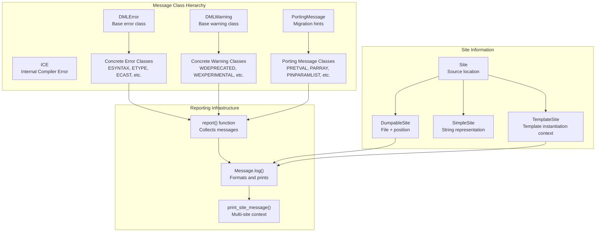
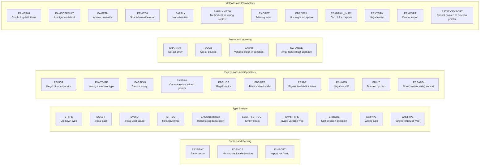
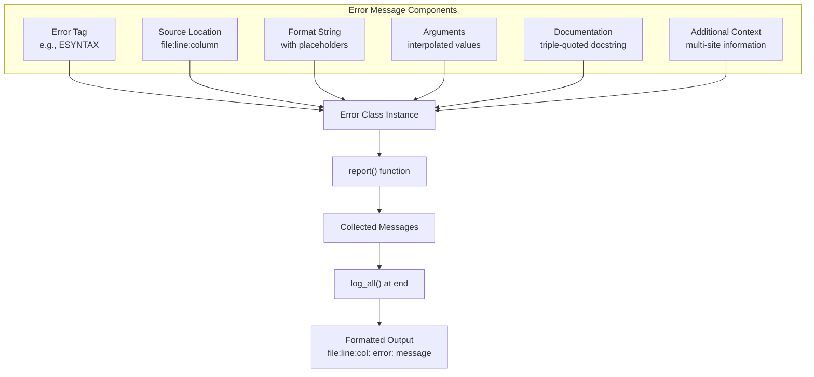
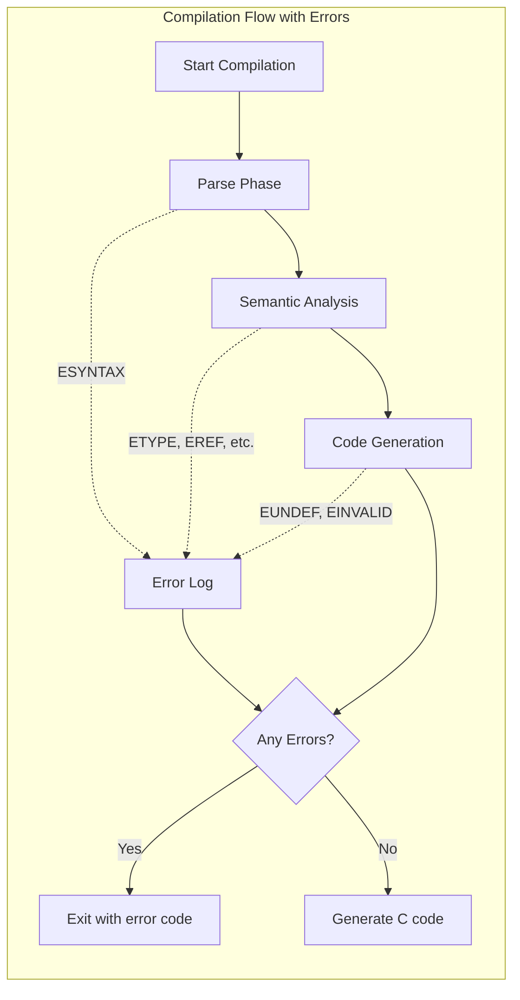
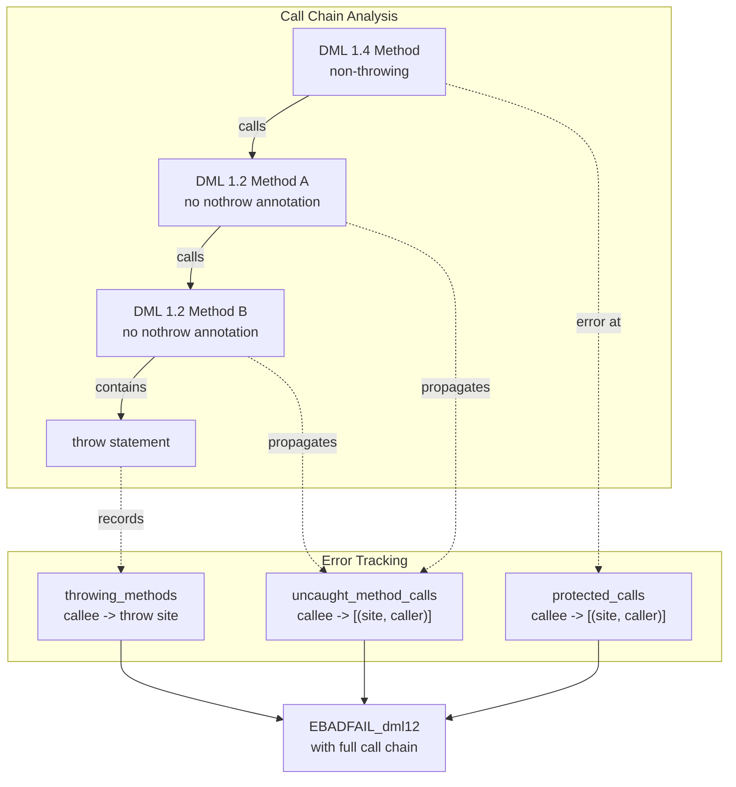

# Error Messages Reference

<details>
<summary>Relevant source files</summary>

The following files were used as context for generating this wiki page:

- [doc/1.4/language.md](doc/1.4/language.md)
- [py/dml/dmlparse.py](py/dml/dmlparse.py)
- [py/dml/messages.py](py/dml/messages.py)
- [test/1.2/errors/T_EASSIGN_34.dml](test/1.2/errors/T_EASSIGN_34.dml)
- [test/1.2/methods/T_inline_smallint.dml](test/1.2/methods/T_inline_smallint.dml)
- [test/1.4/misc/T_register_view_fields.py](test/1.4/misc/T_register_view_fields.py)
- [test/1.4/structure/T_array_size_param.dml](test/1.4/structure/T_array_size_param.dml)
- [test/XFAIL](test/XFAIL)

</details>


This page provides a comprehensive catalog of all error and warning messages produced by the DML compiler. Each message is documented with its meaning, common causes, and resolution strategies. For information about the compiler's overall architecture and compilation pipeline, see [Compiler Architecture](#5). For details on the testing framework that validates error messages, see [Testing Framework](#7.1).

## Purpose and Scope

The DML compiler reports two types of diagnostic messages:

- **Error messages** (prefix `E*`): Fatal issues that prevent code generation. Compilation stops after all errors are reported.
- **Warning messages** (prefix `W*`): Non-fatal issues that indicate potential problems or deprecated features. Compilation continues.
- **Porting messages** (prefix `P*`): Generated with the `-P` flag to assist migration from DML 1.2 to 1.4. See [Porting from DML 1.2 to 1.4](#7.2).

Each message has a unique tag (e.g., `ESYNTAX`, `WDEPRECATED`) that identifies it in the source code and can be used to suppress warnings selectively.

## Error Message System Architecture

The DML compiler's error reporting system is implemented through a class hierarchy that captures contextual information and formats messages for display.



**Sources:** [py/dml/messages.py:1-890](), [py/dml/logging.py]()

### Message Structure

Every error message consists of:

1. **Tag**: Unique identifier (e.g., `ETYPE`, `ESYNTAX`)
2. **Format string**: Template for the message text
3. **Site**: Source location where the error occurred
4. **Arguments**: Values interpolated into the format string
5. **Additional context**: Optional supplementary information at other source locations

**Example from code:**

```python
class ETYPE(DMLError):
    """The data type is not defined in the DML code."""
    fmt = "unknown type: '%s'"
```

Multi-site errors can provide context across multiple locations:

```python
class ECYCLICIMP(DMLError):
    """A DML file imports itself, either directly or indirectly."""
    fmt = "cyclic import"
    def __init__(self, sites):
        DMLError.__init__(self, sites[0])
        self.other_sites = sites[1:]
    def log(self):
        DMLError.log(self)
        for site in self.other_sites:
            self.print_site_message(site, "via here")
```

**Sources:** [py/dml/messages.py:115-139](), [py/dml/logging.py]()

## Error Message Categories

The DML compiler's error messages are organized by the language feature or compilation phase that triggered them.



**Sources:** [py/dml/messages.py:27-890]()

### Category: Syntax and Parsing Errors

These errors occur during lexical analysis and parsing when the source code is malformed.

| Error Tag | Description | Common Causes |
|-----------|-------------|---------------|
| `ESYNTAX` | Malformed source code | Missing semicolons, unmatched braces, unexpected tokens |
| `EDEVICE` | Missing device declaration | Main file lacks `device <name>;` statement |
| `EIMPORT` | Cannot find imported file | Wrong path, missing `-I` directory, typo in filename |
| `ECYCLICIMP` | Cyclic import chain | File A imports B which imports A |
| `ESIMAPI` | DML version incompatible with API | Using old DML with new Simics API |

**Example ESYNTAX:**
```dml
register r1 @ 0x100  // Missing semicolon - ESYNTAX
```

**Example EIMPORT:**
```dml
import "non_existent.dml"  // EIMPORT: cannot find file to import
```

**Sources:** [py/dml/messages.py:775-790](), [py/dml/messages.py:250-268](), [py/dml/dmlparse.py]()

### Category: Type System Errors

Type-related errors occur when expressions have incompatible types or when type declarations are invalid.

| Error Tag | Description | Common Causes |
|-----------|-------------|---------------|
| `ETYPE` | Unknown type name | Typo in type name, missing typedef/import |
| `ECAST` | Illegal cast operation | Cannot cast to `void`, incompatible pointer cast |
| `EVOID` | Illegal void usage | Using void as variable/struct member type |
| `ETREC` | Recursive type definition | Struct contains itself directly or indirectly |
| `EANONSTRUCT` | Struct declaration not allowed | Anonymous struct in method args, cast, etc. |
| `EEMPTYSTRUCT` | Empty struct/layout | Must have at least one field |
| `EBTYPE` | Wrong type for operation | Type mismatch in assignment, comparison, etc. |
| `EASTYPE` | Wrong initializer type | Initializer doesn't match target type |
| `ENBOOL` | Non-boolean condition | Using integer in `if`/`while` instead of comparison |
| `EEARG` | Endian integer in argument | Cannot use endian int as function argument type |

**Example ETYPE:**
```dml
method m() {
    unknown_type_t x;  // ETYPE: unknown type: 'unknown_type_t'
}
```

**Example ETREC:**
```dml
typedef struct {
    int x;
    my_struct *ptr;  // OK - pointer
    my_struct nested;  // ETREC: recursive type definition
} my_struct;
```

**Example ENBOOL:**
```dml
method m(int i) {
    if (i) {  // ENBOOL: non-boolean condition
        // Should be: if (i != 0)
    }
}
```

**Sources:** [py/dml/messages.py:269-332](), [py/dml/messages.py:281-309]()

### Category: Expression and Operator Errors

These errors relate to invalid operations on expressions.

| Error Tag | Description | Common Causes |
|-----------|-------------|---------------|
| `EBINOP` | Illegal binary operation | Wrong operand types for operator |
| `EINCTYPE` | Wrong type for increment | `++`/`--` on non-integer/pointer |
| `EASSIGN` | Cannot assign to expression | Target is not an l-value |
| `EASSINL` | Cannot assign inlined parameter | Parameter has constant value in inlined call |
| `EBSLICE` | Illegal bitslice operation | Bitslice on non-integer expression |
| `EBSSIZE` | Bitslice size out of range | Must be 1-64 bits |
| `EBSBE` | Big-endian bitslice issue | Cannot determine bit width for BE slice |
| `ESHNEG` | Negative shift count | Right operand to `<<`/`>>` is negative |
| `EDIVZ` | Division by zero | Right operand to `/` or `%` is zero |
| `EUNDEF` | Undefined value | Expression contains `undefined` |
| `EINVALID` | Invalid expression | Expression doesn't produce a value |
| `ECSADD` | Non-constant string concat | Cannot use `+` on runtime strings |

**Example EBINOP:**
```dml
method m() {
    local uint64 x = 10;
    local char *s = "hello";
    local uint64 y = x + s;  // EBINOP: illegal operands to binary '+'
}
```

**Example EBSLICE:**
```dml
method m() {
    local char *p = NULL;
    local uint8 bits = p[3:0];  // EBSLICE: illegal bitslice operation
}
```

**Sources:** [py/dml/messages.py:334-395](), [py/dml/messages.py:460-495]()

### Category: Array and Indexing Errors

Errors related to array declarations and indexing operations.

| Error Tag | Description | Common Causes |
|-----------|-------------|---------------|
| `ENARRAY` | Not an array | Indexing non-array expression |
| `EOOB` | Array index out of bounds | Constant index exceeds array size |
| `EAVAR` | Variable index in constant list | Cannot use runtime index on compile-time list |
| `EZRANGE` | Array range must start at 0 | DML 1.2: `j in 1..5` instead of `j in 0..4` |
| `ENLST` | Not a list | Expected list expression |

**Example EOOB:**
```dml
bank regs {
    register r[i < 4] @ i * 4;
    method init() {
        r[5].val = 0;  // EOOB: array index out of bounds
    }
}
```

**Sources:** [py/dml/messages.py:502-537]()

### Category: Object Model Errors

Errors related to DML's object hierarchy and structure.

| Error Tag | Description | Common Causes |
|-----------|-------------|---------------|
| `EREF` | Reference to unknown object | Typo in object name, wrong scope |
| `ENOBJ` | Object expected | Expression doesn't refer to an object |
| `ENVAL` | Not a value | Object cannot be used as value directly |
| `EREGVAL` | Cannot use register with fields as value | Use `.get()` instead of `.val` |
| `ENOPTR` | Not a pointer | Dereference operation on non-pointer |
| `ENOSTRUCT` | Not a struct | Member access on non-struct type |
| `EIDENT` | Unknown identifier | Variable/constant not declared |
| `ENAMEID` | Invalid name parameter | `name` parameter must be valid identifier |

**Example ENVAL:**
```dml
bank b {
    register r1 size 4 @ 0;
}
method m() {
    local uint64 x = b;  // ENVAL: not a value: b
}
```

**Sources:** [py/dml/messages.py:539-587](), [py/dml/messages.py:730-744]()

### Category: Method and Parameter Errors

Errors in method declarations, calls, and parameter definitions.

| Error Tag | Description | Common Causes |
|-----------|-------------|---------------|
| `EAMBINH` | Conflicting method/parameter definitions | Multiple templates define same member ambiguously |
| `EAMBDEFAULT` | Ambiguous default invocation | Cannot determine which default method to call |
| `EAMETH` | Abstract method overrides existing | Cannot declare abstract when method exists |
| `ETMETH` | Shared/non-shared mismatch | Shared method tries to override non-shared |
| `EAPPLY` | Not a function | Trying to call non-function value |
| `EAPPLYMETH` | Method call in unsupported context | Inline/throwing method used as expression |
| `ENORET` | Missing return statement | Method with return value lacks return |
| `ERETTYPE` | Return type not specified | Interface method needs explicit return type |
| `ERETARGNAME` | Named return argument | DML 1.4: return values are anonymous |
| `EPARAM` | Illegal parameter value | Parameter bound to invalid expression |
| `EUNINITIALIZED` | Parameter not yet initialized | Cannot access in object-level if statement |
| `ECONDP` | Conditional parameter | Cannot declare parameter in if statement |

**Example EAMBINH:**
```dml
template t1 {
    param p default 1;
}
template t2 {
    param p default 2;
}
bank b is (t1, t2) {  // EAMBINH: conflicting definitions of p
}
```

**Example ENORET:**
```dml
method compute(int x) -> (int result) {
    if (x > 0) {
        result = x * 2;
    }
    // ENORET: missing return statement if x <= 0
}
```

**Sources:** [py/dml/messages.py:141-249](), [py/dml/messages.py:547-563](), [py/dml/messages.py:792-826]()

### Category: Template and Trait Errors

Errors specific to DML's template and trait systems.

| Error Tag | Description | Common Causes |
|-----------|-------------|---------------|
| `ECYCLICTEMPLATE` | Cyclic template inheritance | Template inherits from itself via chain |
| `EABSTEMPLATE` | Abstract member not implemented | Template requires method/parameter to be defined |
| `ETEMPLATEUPCAST` | Invalid template cast | Expression not implementing target template |
| `ECONDT` | Conditional template | Cannot use template in if statement |
| `ECONDINEACH` | Conditional in-each | Cannot use in-each in if statement |

**Example EABSTEMPLATE:**
```dml
template abstract_t {
    method required_method();  // abstract
}
bank b is (abstract_t) {
    // EABSTEMPLATE: requires abstract method required_method to be implemented
}
```

**Sources:** [py/dml/messages.py:128-248]()

### Category: After, Event, and Hook Errors

Errors related to DML's event system, including `after` statements and hooks.

| Error Tag | Description | Common Causes |
|-----------|-------------|---------------|
| `EAFTER` | Illegal after statement | Callback has output params or unserializable inputs |
| `EAFTERSENDNOW` | Illegal after with send_now | Hook message components not serializable |
| `EAFTERHOOK` | Illegal hook-bound after | Wrong number of message component parameters |
| `EAFTERMSGCOMPPARAM` | Misuse of message component param | Used outside direct callback argument |
| `EHOOKTYPE` | Invalid hook message component type | Anonymous struct or variable-sized array |

**Example EAFTER:**
```dml
method callback(custom_struct_t data) {
    // ...
}
method init() {
    after 1.0 s: callback(some_struct);
    // EAFTER if custom_struct_t is not serializable
}
```

**Sources:** [py/dml/messages.py:27-114]()

### Category: Attribute and Interface Errors

Errors in attribute and interface declarations.

| Error Tag | Description | Common Causes |
|-----------|-------------|---------------|
| `EATYPE` | Attribute type undefined | Neither `attr_type` nor `type` parameter set |
| `EANAME` | Illegal attribute name | Name conflicts with auto-generated attribute |
| `EACHK` | Checkpointable attribute incomplete | Missing get or set method |
| `EANULL` | Attribute has no methods | Must have get or set method |
| `EATTRDATA` | allocate_type with data objects | Cannot mix allocate_type and data declarations |
| `EIFREF` | Illegal interface method reference | Complex expression instead of simple reference |

**Sources:** [py/dml/messages.py:561-847]()

### Category: Exception and Control Flow Errors

Errors related to exception handling and control flow.

| Error Tag | Description | Common Causes |
|-----------|-------------|---------------|
| `EBADFAIL` | Uncaught exception | Throw in context where exception won't be caught |
| `EBADFAIL_dml12` | DML 1.2 uncaught exception | DML 1.2 method throws when called from non-throwing 1.4 |
| `EERRSTMT` | Forced error statement | Source contains `error;` statement |

**Example EBADFAIL_dml12:**

This complex error occurs when porting mixed DML 1.2/1.4 code. The compiler analyzes call chains to determine if a 1.2 method (without `nothrow`) actually throws.

**Sources:** [py/dml/messages.py:618-698]()

### Category: Log and Format Errors

Errors in log statements and format strings.

| Error Tag | Description | Common Causes |
|-----------|-------------|---------------|
| `ELTYPE` | Invalid log type | Not one of: info, warning, error, spec_viol, unimpl |
| `ELLEV` | Invalid log level | Must be 1-4 (or 1-5 for subsequent), 1 for warnings/errors |
| `EFORMAT` | Malformed format string | Invalid format specifier at position |

**Sources:** [py/dml/messages.py:759-773]()

### Category: Import and File Errors

Errors during file processing and imports.

| Error Tag | Description | Common Causes |
|-----------|-------------|---------------|
| `EIMPORT` | Cannot find file to import | Path not found, missing -I option |
| `ECYCLICIMP` | Cyclic import | File imports itself directly or indirectly |
| `ESIMAPI` | Incompatible API version | DML version doesn't support specified Simics API |
| `EDEVICE` | Missing device declaration | Main file must have `device <name>;` |

**Sources:** [py/dml/messages.py:115-268](), [py/dml/messages.py:752-757]()

## Complete Error Reference

This section provides an alphabetical reference of all error messages with detailed documentation.



**Sources:** [py/dml/messages.py:1-26](), [py/dml/logging.py]()

### Error Severity and Compilation Behavior

The compiler collects all errors during compilation and reports them together, then exits with non-zero status. This allows developers to see multiple issues at once rather than fixing them one at a time.



**Sources:** [py/dml/logging.py](), [py/dmlc.py]()

### Version-Specific Errors

Some errors are specific to DML 1.4 and marked with `version = "1.4"` in the class definition:

| Error Tag | Version | Description |
|-----------|---------|-------------|
| `ENORET` | 1.4 | Missing return in method with return value |
| `ERETARGNAME` | 1.4 | Named return argument (1.4 uses anonymous returns) |
| `ETMETH` | 1.4 | Shared method override error |
| `EABSTEMPLATE` | 1.4 | Abstract template member not implemented |
| `ETEMPLATEUPCAST` | 1.4 | Invalid template cast |
| `ECONDINEACH` | 1.4 | Conditional in-each statement |
| `EAFTERHOOK` | 1.4 | Hook-bound after statement error |
| `EAFTERMSGCOMPPARAM` | 1.4 | Message component parameter misuse |
| `EHOOKTYPE` | 1.4 | Invalid hook message component type |
| `EEXPORT` | 1.4 | Cannot export method |
| `ESTATICEXPORT` | 1.4 | Cannot convert method to function pointer |

DML 1.2 specific errors:

| Error Tag | Version | Description |
|-----------|---------|-------------|
| `EEXTERN` | 1.2 | Illegal extern method declaration |

**Sources:** [py/dml/messages.py:68](), [py/dml/messages.py:218](), [py/dml/messages.py:558]()

### Multi-Site Error Reporting

Some errors involve multiple source locations to provide full context. These errors override the `log()` method to print additional locations.

**Example: ECYCLICIMP**

```python
class ECYCLICIMP(DMLError):
    """A DML file imports itself, either directly or indirectly."""
    fmt = "cyclic import"
    def __init__(self, sites):
        DMLError.__init__(self, sites[0])
        self.other_sites = sites[1:]
    def log(self):
        DMLError.log(self)
        for site in self.other_sites:
            self.print_site_message(site, "via here")
```

This produces output like:
```
file1.dml:5:1: error: cyclic import
file2.dml:3:1: note: via here
file3.dml:7:1: note: via here
```

Other multi-site errors:
- `EAMBINH`: Shows conflicting definition locations with resolution hints
- `ETREC`: Shows chain of struct members leading to recursion
- `EAMBDEFAULT`: Shows all candidate default method locations
- `EBADFAIL_dml12`: Shows call chain leading to uncaught exception

**Sources:** [py/dml/messages.py:115-198](), [py/dml/messages.py:281-293]()

### Special Error Classes

**EBADFAIL_dml12: Complex Call Chain Analysis**

This error performs sophisticated analysis to detect exceptions in DML 1.2 code called from non-throwing DML 1.4 code:



**Sources:** [py/dml/messages.py:624-698]()

### Error Tag Naming Conventions

Error tags follow consistent naming patterns:

- **E** prefix: Error (compilation fails)
- **W** prefix: Warning (compilation continues)
- **P** prefix: Porting message (migration assistance)

Common suffixes and their meanings:

| Pattern | Meaning | Examples |
|---------|---------|----------|
| `E*TYPE` | Type-related error | `ETYPE`, `EBTYPE`, `EASTYPE`, `EVARTYPE` |
| `E*METH` | Method-related error | `EAMETH`, `ETMETH`, `EAPPLYMETH` |
| `E*ASSIGN` | Assignment error | `EASSIGN`, `EASSINL` |
| `E*ARRAY` | Array error | `ENARRAY`, `EAVAR` |
| `ECOND*` | Conditional error | `ECONDP`, `ECONDT`, `ECONDINEACH` |
| `E*STRUCT` | Struct error | `ENOSTRUCT`, `EANONSTRUCT`, `EEMPTYSTRUCT` |

**Sources:** [py/dml/messages.py]()

## Working with Error Messages

### Suppressing Warnings

Warnings can be suppressed using the `-W` compiler flag:

```bash
# Suppress specific warning
dmlc -Wno-deprecated mydevice.dml

# Treat warnings as errors
dmlc -Werror mydevice.dml

# Suppress all warnings
dmlc -w mydevice.dml
```

### Understanding Error Context

Many errors provide additional context through secondary messages marked with "note:":

```
mydevice.dml:45:5: error: conflicting definitions of p when instantiating template t1 and template t2
mydevice.dml:12:9: note: conflicting definition
mydevice.dml:45:5: note: to resolve, either add 'is t2' near this line...
mydevice.dml:12:9: note: ... or add 'is t1' near this line
```

The primary error location is where the conflict is detected. The "note" messages show:
1. Related definition locations
2. Suggested resolutions
3. Context for understanding the error

**Sources:** [py/dml/messages.py:141-183](), [py/dml/logging.py]()

### Error Message Documentation

Each error class includes a docstring that is extracted to generate the error message documentation. These docstrings are the authoritative explanation of what the error means and how to fix it.

```python
class ENBOOL(DMLError):
    """
    Conditions must be properly boolean expressions; e.g., "`if (i ==
    0)`" is allowed, but "`if (i)`" is not, if `i` is an
    integer.
    """
    fmt = "non-boolean condition: '%s' of type '%s'"
```

The documentation generation tools extract these docstrings and format them as markdown for the reference manual.

**Sources:** [py/dml/messages.py:324-332](), [doc/1.4/language.md]()

## Testing and Validation

The test suite includes comprehensive coverage of error messages. Each error condition has associated test files that verify the compiler produces the correct error.

### Error Test Structure

Error tests are located in `test/*/errors/` directories:

```
test/1.2/errors/T_ETYPE_*.dml    # Type errors
test/1.4/errors/T_ESYNTAX_*.dml  # Syntax errors
test/1.4/errors/T_EAFTER_*.dml   # After statement errors
```

Test files use special annotations to specify expected errors:

```dml
dml 1.4;
device test;
/// ERROR ETYPE

method m() {
    unknown_type_t x;  // This line should produce ETYPE
}
```

The test framework:
1. Compiles the test file
2. Verifies that ETYPE error is reported
3. Checks that the error location matches expectations
4. Fails if error is not reported or wrong error is reported

**Sources:** [test/1.2/errors/](), [test/1.4/errors/](), [py/tests.py]()

### Expected Failures (XFAIL)

Known issues are tracked in the `XFAIL` file, listing tests that are expected to fail:

```
# SIMICS-8793: Parameter inference issues
1.2/errors/EVARPARAM_2
1.2/errors/EVARPARAM_3

# SIMICS-8783: Assignment target analysis
1.2/errors/EASSIGN_06
1.2/errors/EASSIGN_09
```

Each entry links to a bug tracking issue explaining why the test fails and what needs to be fixed.

**Sources:** [test/XFAIL:1-81]()

### Error Message Consistency

The test suite ensures error messages are:
- **Consistent**: Same error for same mistake across different contexts
- **Helpful**: Provide actionable information for fixing
- **Accurate**: Report correct source locations
- **Complete**: Multi-site errors show all relevant locations

**Sources:** [py/tests.py](), [test/]()

## Common Error Resolution Patterns

### Pattern 1: Type Mismatch (EBTYPE, EASTYPE)

**Problem:** Assigning incompatible types

```dml
method m() {
    local uint64 x;
    local int32 *p;
    x = p;  // EBTYPE: wrong type, got: int32 *, expected: uint64
}
```

**Solutions:**
- Add explicit cast: `x = cast(p, uint64);`
- Change types to match: `local uint64 *p;`
- Use appropriate conversion function

### Pattern 2: Non-Boolean Condition (ENBOOL)

**Problem:** Using integer where boolean expected

```dml
method m(int i) {
    if (i) { ... }  // ENBOOL: non-boolean condition
}
```

**Solutions:**
- Add comparison: `if (i != 0) { ... }`
- Use boolean expression: `if (i > 0) { ... }`

### Pattern 3: Missing Return (ENORET)

**Problem:** Not all paths return a value

```dml
method compute(int x) -> (int result) {
    if (x > 0) {
        return x * 2;
    }
    // ENORET: missing return statement
}
```

**Solutions:**
- Add return for all paths: `else { return 0; }`
- Add assertion if unreachable: `assert false;`
- Simplify control flow to ensure return

### Pattern 4: Ambiguous Inheritance (EAMBINH)

**Problem:** Multiple templates define same parameter without clear precedence

```dml
template t1 { param p default 1; }
template t2 { param p default 2; }
bank b is (t1, t2) { }  // EAMBINH
```

**Solutions:**
- Explicitly instantiate one template in the other's scope
- Override parameter in object: `bank b is (t1, t2) { param p = 3; }`
- Restructure templates to avoid conflict

### Pattern 5: Uncaught Exception (EBADFAIL)

**Problem:** Throw in non-throwing context

```dml
method process() {  // implicitly non-throwing in 1.4
    throw;  // EBADFAIL: uncaught exception
}
```

**Solutions:**
- Add `throws` keyword: `method process() throws { ... }`
- Wrap in try/catch: `try { ... } catch { ... }`
- Remove throw and handle error differently

**Sources:** [py/dml/messages.py](), [doc/1.4/language.md]()

## Error Message Development

For compiler developers adding new error messages:

1. **Define error class** in `py/dml/messages.py`:
   ```python
   class ENEWFEATURE(DMLError):
       """Detailed explanation of what causes this error
       and how to fix it."""
       fmt = "descriptive message with %s placeholder"
   ```

2. **Report error** at detection site:
   ```python
   from .messages import ENEWFEATURE
   report(ENEWFEATURE(site, argument))
   ```

3. **Add test cases** in `test/*/errors/`:
   ```dml
   /// ERROR ENEWFEATURE
   // code that triggers error
   ```

4. **Document** in this reference (update this page)

5. **Update** message extraction tools if needed

**Sources:** [py/dml/messages.py:1-26](), [py/tests.py]()

---

This reference guide is automatically kept in sync with the compiler implementation through the message extraction system documented in [Build System and Documentation](#7.3).