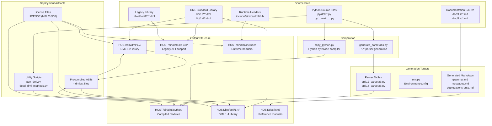
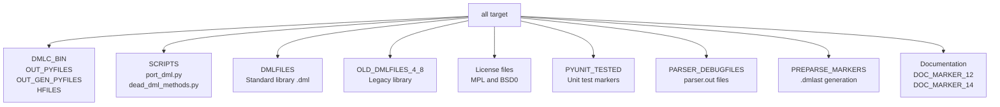
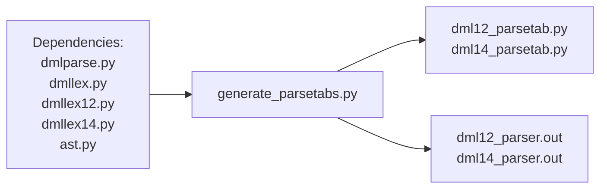
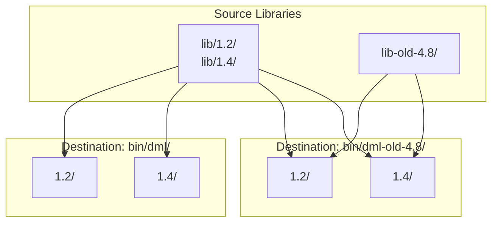
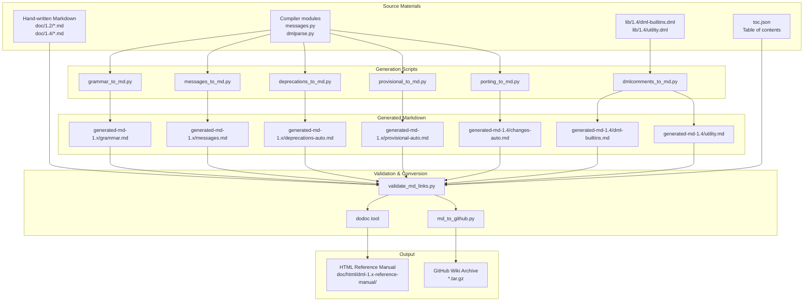

# Installation and Build

<details>
<summary>Relevant source files</summary>

The following files were used as context for generating this wiki page:

- [MODULEINFO](MODULEINFO)
- [Makefile](Makefile)
- [md_to_github.py](md_to_github.py)
- [validate_md_links.py](validate_md_links.py)

</details>


## Purpose and Scope

This page covers building the DML compiler from source, including prerequisites, the build system architecture, build targets, and output structure. For information about using the compiler after installation, see [Basic Usage](#2.2). For details about the testing infrastructure, see [Testing Framework](#7.1).

## Prerequisites

The DML compiler requires the following dependencies:

| Component | Purpose | Used By |
|-----------|---------|---------|
| **Python 3.x** | Primary implementation language | All compiler modules |
| **PLY (Python Lex-Yacc)** | Parser generator framework | [dmlparse.py](), [dmllex12.py](), [dmllex14.py]() |
| **GCC or compatible C compiler** | Compiles generated C code to Simics modules | Test framework and end-user builds |
| **Simics Base** | Provides API headers and runtime infrastructure | All builds via `SIMICS_BASE` environment variable |
| **dodoc** | Documentation generator (optional) | [Makefile:200]() for reference manual generation |

The build system expects `SIMICS_BASE` and `SIMICS_PROJECT` environment variables to be set, pointing to the Simics installation and project directories respectively.

**Sources:** [Makefile:1-251](), [MODULEINFO:1-134]()

## Build System Architecture

The DML compiler uses a Make-based build system that orchestrates Python compilation, library file deployment, parser generation, and documentation building.

### Build Pipeline Overview



**Sources:** [Makefile:1-251](), [MODULEINFO:28-83]()

### Key Build Variables

The Makefile defines several important path variables:

| Variable | Definition | Purpose |
|----------|-----------|---------|
| `DMLC_DIR` | `$(SRC_BASE)/$(TARGET)` | Source directory root |
| `LIBDIR` | `$(SIMICS_PROJECT)/$(HOST_TYPE)/bin` | Output binary directory |
| `PYTHONPATH` | `$(LIBDIR)/dml/python` | Compiled Python module location |
| `DMLLIB_SRC` | `$(DMLC_DIR)/lib` | DML standard library source |
| `DMLLIB_DEST` | `$(LIBDIR)/dml` | DML library installation location |
| `OLD_DMLLIB_SRC_4_8` | `$(DMLC_DIR)/lib-old-4.8` | Legacy API library source |

**Sources:** [Makefile:8-75]()

## Build Process

### Primary Build Target

The default `all` target builds all compiler components:



**Sources:** [Makefile:90-97](), [Makefile:198](), [Makefile:235](), [Makefile:250]()

### Python Compilation

Python source files are compiled using the `copy_python.py` script, which generates bytecode-optimized `.pyc` files:

```makefile
PYCOMPILE:=$(PYTHON) $(SIMICS_BASE)/scripts/copy_python.py

$(OUT_PYFILES): $(LIBDIR)/dml/python/%.py: $(DMLC_DIR)/py/%.py
    $(PYCOMPILE) $^ $@
```

The compiler consists of 46 Python modules listed in `PYFILES`:

**Core modules:**
- `dml/__init__.py` - Package initialization
- `dml/dmlc.py` - Main compiler driver
- `dml/toplevel.py` - File parsing and import resolution
- `dml/dmlparse.py` - Parser implementation
- `dml/dmllex12.py`, `dml/dmllex14.py` - Version-specific lexers

**Generated modules:**
- `dml12_parsetab.py`, `dml14_parsetab.py` - PLY parser tables
- `env.py` - Environment configuration

**Sources:** [Makefile:11-53](), [Makefile:102-110]()

### Parser Table Generation

Parser tables are generated from the grammar definitions using PLY. This is an expensive operation, so tables are only rebuilt when relevant files change:



Invocation:
```makefile
dml%_parsetab.py $(PYTHONPATH)/dml%_parser.out: \
    $(SRC_BASE)/$(TARGET)/generate_parsetabs.py \
    $(filter %dmlparse.py %dmllex.py %dmllex12.py %dmllex14.py %ast.py, \
      $(OUT_PYFILES))
    $(PYTHON) $< $(PYTHONPATH) $* dml$*_parsetab $(PYTHONPATH)/dml$*_parser.out
```

**Sources:** [Makefile:123-129](), [Makefile:63-64]()

### Standard Library Deployment

DML standard library files are copied from source to versioned output directories. The system supports multiple API versions with different library sets:



**Core library files (all APIs):**
- `dml-builtins.dml` - Core templates
- `utility.dml` - Common utility templates
- `dml12-compatibility.dml` - Compatibility layer
- Various interface libraries: `simics-api.dml`, `simics-event.dml`, etc.

**Legacy API files (4.8 only):**
- `i2c.dml`, `mii.dml`, `ppc.dml`, `x86.dml`, etc.

**Sources:** [Makefile:68-82](), [Makefile:147-158](), [MODULEINFO:85-133]()

### Precompiled AST Generation

To speed up compilation, the build system generates `.dmlast` precompiled AST files for all standard library files. This process uses dependency tracking via marker files:

```makefile
PREPARSE_MARKERS := $(foreach d,1.2 1.4,\
  dml-old-4.8/$d.d dml/$d.d $(foreach a,$(API_VERSIONS),dml/api/$a/$d.d))

$(PREPARSE_MARKERS): dmlast-generator
    $(PYTHON) $(SRC_BASE)/$(TARGET)/dmlast.py $(PYTHONPATH) \
      $(SIMICS_PROJECT)/$(HOST_TYPE)/bin/$(@:.d=) \
      $(DMLAST_SRC_BASE)/$(HOST_TYPE)/bin/$(@:.d=) $@
```

The marker files serve dual purposes:
1. Makefile dependency tracking for rebuilds
2. Depfiles that list all `.dml` files in the directory

**Sources:** [Makefile:177-198]()

### Unit Testing During Build

Python unit tests are automatically run during the build process. Each test file generates a marker file on success:

```makefile
RUN_PY_UNIT_TEST := $(PYTHON) $(DMLC_DIR)/run_unit_tests.py
%-pyunit-tested: $(DMLC_DIR)/py/dml/%.py $(OUT_PYFILES)
    $(RUN_PY_UNIT_TEST) $(SIMICS_PROJECT)/$(HOST_TYPE) $<
    touch $@
```

Tests that require the `CC` and `SIMICS_BASE` environment variables have them exported automatically.

**Sources:** [Makefile:48-49](), [Makefile:134-142]()

## Output Structure

### Directory Layout

After a successful build, the output structure is organized as follows:

```
$(HOST_TYPE)/
├── bin/
│   ├── dml/
│   │   ├── python/                      # Compiled compiler modules
│   │   │   ├── __main__.py             # Entry point
│   │   │   ├── dml/                    # Core package
│   │   │   │   ├── *.py                # Compiled modules
│   │   │   │   ├── dml12_parsetab.py   # DML 1.2 parser tables
│   │   │   │   └── dml14_parsetab.py   # DML 1.4 parser tables
│   │   │   ├── port_dml.py             # Migration tool
│   │   │   ├── dead_dml_methods.py     # Analysis tool
│   │   │   └── LICENSE                 # MPL-2.0
│   │   ├── 1.2/                        # DML 1.2 standard library
│   │   │   ├── *.dml                   # Library files
│   │   │   ├── *.dmlast                # Precompiled ASTs
│   │   │   └── LICENSE                 # BSD0
│   │   ├── 1.4/                        # DML 1.4 standard library
│   │   │   ├── *.dml
│   │   │   ├── *.dmlast
│   │   │   └── LICENSE
│   │   └── include/simics/
│   │       ├── dmllib.h                # Runtime library header
│   │       └── LICENSE
│   └── dml-old-4.8/                    # Legacy Simics 4.8 API support
│       ├── 1.2/
│       └── 1.4/
└── doc/
    └── html/
        ├── dml-1.2-reference-manual/   # DML 1.2 documentation
        │   └── filelist.json           # Build marker
        └── dml-1.4-reference-manual/   # DML 1.4 documentation
            └── filelist.json
```

**Sources:** [MODULEINFO:8-26](), [Makefile:73-86]()

### Module Groups (MODULEINFO)

The `MODULEINFO` file defines logical groupings of installed files for packaging:

| Group | Contents | Purpose |
|-------|----------|---------|
| `dmlc-py` | Python compiler modules | Core compiler implementation |
| `dmlc-lib` | DML standard libraries and headers | Runtime support files |
| `dml-1.2-reference-manual` | HTML documentation for DML 1.2 | User documentation |
| `dml-1.4-reference-manual` | HTML documentation for DML 1.4 | User documentation |
| `dmlc` | All of the above | Complete compiler package |

**Sources:** [MODULEINFO:18-83]()

## Documentation Generation

The build system generates comprehensive documentation from multiple sources:

### Documentation Pipeline



**Sources:** [Makefile:200-250]()

### Generated Documentation Types

| Document Type | Source | Generator | Output |
|--------------|--------|-----------|--------|
| **Grammar Reference** | `dml12_parser.out`, `dml14_parser.out` | `grammar_to_md.py` | `grammar.md` |
| **Error Messages** | `messages.py` | `messages_to_md.py` | `messages.md` |
| **Deprecations** | `messages.py` + header | `deprecations_to_md.py` | `deprecations-auto.md` |
| **Provisional Features** | `provisional.py` + header | `provisional_to_md.py` | `provisional-auto.md` |
| **Porting Guide** | `breaking_changes.py` | `porting_to_md.py` | `changes-auto.md` (1.4 only) |
| **Library API** | `lib/1.4/*.dml` comments | `dmlcomments_to_md.py` | `dml-builtins.md`, `utility.md` (1.4 only) |

**Sources:** [Makefile:204-228]()

### Documentation Validation

Before generating HTML, all Markdown files undergo link validation using `validate_md_links.py`:

**Validation checks:**
1. Internal links reference existing files
2. Anchor links point to valid section headers or `<a id="...">` tags
3. No use of `--` (should be `&mdash;`)
4. Valid characters in section headers for auto-generated anchors

The validation script builds an anchor map from:
- Explicit `<a id="...">` tags
- Section headers (automatically converted to kebab-case anchors)
- Both hand-written and generated Markdown files

**Sources:** [validate_md_links.py:1-107](), [Makefile:232-233]()

### GitHub Wiki Export

The `md_to_github.py` script converts the reference manual into GitHub Wiki format:

**Conversion process:**
1. Read `toc.json` structure
2. Extract titles from Markdown files using regex: `# ([^\n]*)`
3. Generate hierarchical filenames: section number + title (spaces replaced with dashes)
4. Rewrite internal links from `file.html#anchor` to `filename`
5. Create a master index page with links to all sections
6. Package as `.tar.gz` archive

**Special handling:**
- Detects Simics version from `package_specs`
- Adds copyright headers to all pages
- Preserves external HTTPS links unchanged

**Sources:** [md_to_github.py:1-106]()

## Build Commands

### Standard Build

```bash
# From Simics project directory
cd modules/dmlc
make
```

This builds all targets including compiler, libraries, tests, and documentation.

### Partial Build Targets

Individual components can be built separately:

```bash
# Build only Python compiler modules
make $(OUT_PYFILES) $(OUT_GEN_PYFILES)

# Build only standard libraries
make $(DMLFILES)

# Build only documentation
make $(DOC_MARKER_14) $(DOC_MARKER_12)

# Run only unit tests
make $(PYUNIT_TESTED)

# Generate only parser tables
make dml12_parsetab.py dml14_parsetab.py
```

**Sources:** [Makefile:90-251]()

## Troubleshooting

### Common Build Issues

| Symptom | Possible Cause | Solution |
|---------|---------------|----------|
| `SIMICS_BASE not set` | Missing environment variable | Export `SIMICS_BASE` and `SIMICS_PROJECT` |
| `PLY not found` | Missing Python dependency | Install PLY: `pip install ply` |
| Parser generation fails | Corrupted parser state | Delete `dml*_parsetab.py` and rebuild |
| Link validation fails | Broken documentation links | Check error output for file and line number |
| `.dmlast` generation fails | DML syntax error in library | Check library files for errors |

### Clean Build

To force a complete rebuild:

```bash
# Remove all generated files in build directory
rm -rf $(HOST_TYPE)/bin/dml
rm -rf $(HOST_TYPE)/doc/html/dml-*-reference-manual
rm -f dml*_parsetab.py env.py
rm -rf generated-md-*

# Rebuild
make
```

**Sources:** [Makefile:1-251]()