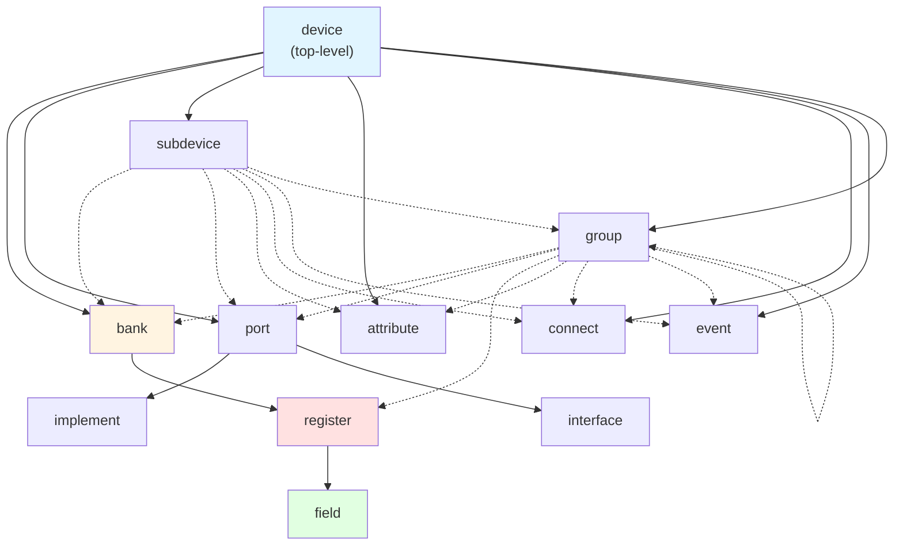
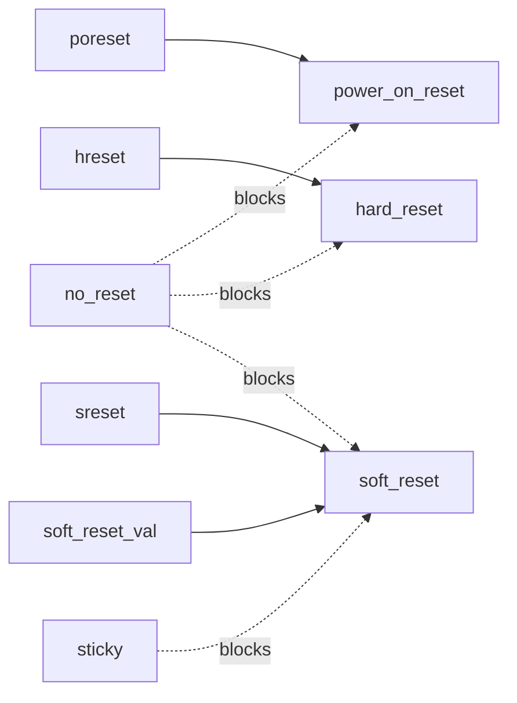
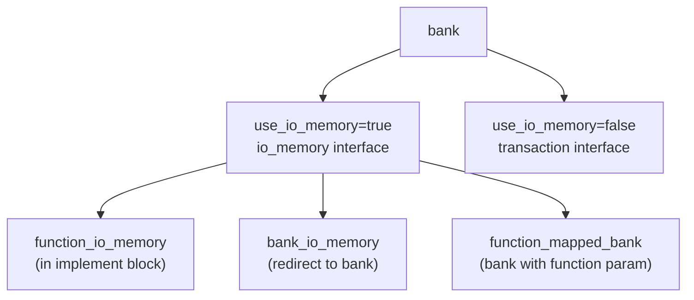

# API Reference

<details>
<summary>Relevant source files</summary>

The following files were used as context for generating this wiki page:

- [deprecations_to_md.py](deprecations_to_md.py)
- [lib/1.2/dml-builtins.dml](lib/1.2/dml-builtins.dml)
- [lib/1.4/dml-builtins.dml](lib/1.4/dml-builtins.dml)
- [lib/1.4/utility.dml](lib/1.4/utility.dml)
- [py/dml/breaking_changes.py](py/dml/breaking_changes.py)
- [py/dml/dmlc.py](py/dml/dmlc.py)
- [py/dml/globals.py](py/dml/globals.py)
- [py/dml/toplevel.py](py/dml/toplevel.py)
- [test/1.4/lib/T_io_memory.dml](test/1.4/lib/T_io_memory.dml)
- [test/1.4/lib/T_io_memory.py](test/1.4/lib/T_io_memory.py)
- [test/1.4/lib/T_map_target_connect.py](test/1.4/lib/T_map_target_connect.py)
- [test/1.4/lib/T_signal_templates.dml](test/1.4/lib/T_signal_templates.dml)
- [test/1.4/lib/T_signal_templates.py](test/1.4/lib/T_signal_templates.py)

</details>


This page provides a quick reference for the DML compiler command-line options, language constructs, standard library templates, and commonly used parameters and methods. For detailed language semantics and concepts, see [DML Language Reference](#3). For compiler architecture details, see [Compiler Architecture](#5). For standard library implementation details, see [Standard Library](#4).

## Compiler Command-Line Options

The DML compiler `dmlc` is invoked with: `dmlc [options] <input.dml> [output_base]`

### Essential Options

| Option | Description |
|--------|-------------|
| `-I PATH` | Add PATH to import search path |
| `-D NAME=VALUE` | Define compile-time constant (literal values only) |
| `-g` | Generate debug artifacts for source-level debugging |
| `--simics-api=VERSION` | Specify Simics API version (e.g., `6`, `7`) |
| `--warn=TAG` | Enable specific warning |
| `--nowarn=TAG` | Disable specific warning |
| `--werror` | Treat all warnings as errors |

### Code Generation Options

| Option | Description |
|--------|-------------|
| `--noline` | Suppress C line directives for debugging generated code |
| `--info` | Generate XML file describing register layout |
| `--coverity` | Add Coverity annotations to suppress false positives |

### Dependency and Debugging Options

| Option | Description |
|--------|-------------|
| `--dep=FILE` | Generate makefile dependencies |
| `--dep-target=TARGET` | Specify custom dependency target (repeatable) |
| `--no-dep-phony` | Omit phony targets from dependency output |
| `-T` | Show warning tags in messages |
| `--help-warn` | List available warning tags |
| `--max-errors=N` | Limit error messages to N |

### Breaking Change Options

| Option | Description |
|--------|-------------|
| `--breaking-change=TAG` | Enable specific breaking change |
| `--help-breaking-change` | List available breaking change tags |
| `--strict-dml12` | Enable strict DML 1.2 semantics (multiple breaking changes) |

Sources: [py/dml/dmlc.py:314-511]()

## DML Object Type Hierarchy

The following diagram shows the containment relationships between DML object types and their associated templates:



**Legend**: Solid arrows represent mandatory containment, dashed arrows represent optional containment

Sources: [lib/1.4/dml-builtins.dml:269-722]()

## Core Template Parameters

### Universal Object Parameters

Available on all object types through the `object` template:

| Parameter | Type | Description |
|-----------|------|-------------|
| `this` | reference | Current object |
| `parent` | reference | Parent object (`undefined` for device) |
| `objtype` | string | Object type name (e.g., `"register"`) |
| `name` | const char * | Object name (user-visible) |
| `qname` | string | Fully qualified name with indices |
| `dev` | reference | Top-level device object |
| `indices` | list | Local array indices for this object |
| `templates` | auto | Template namespace for qualified calls |
| `desc` | string | Short description (optional) |
| `documentation` | string | Longer documentation (optional) |
| `limitations` | string | Implementation limitations (optional) |

Sources: [lib/1.4/dml-builtins.dml:540-578]()

### Device Parameters

| Parameter | Type | Default | Description |
|-----------|------|---------|-------------|
| `classname` | string | `name` | Simics configuration class name |
| `register_size` | int | `undefined` | Default register width in bytes |
| `byte_order` | string | `"little-endian"` | Default byte order (`"little-endian"` or `"big-endian"`) |
| `be_bitorder` | bool | auto | Use big-endian bit ordering in banks |
| `use_io_memory` | bool | `true` | Use `io_memory` interface by default in banks |
| `obj` | conf_object_t * | auto | Pointer to Simics configuration object |
| `simics_api_version` | string | auto | Simics API version string |

Sources: [lib/1.4/dml-builtins.dml:626-722]()

### Bank Parameters

| Parameter | Type | Default | Description |
|-----------|------|---------|-------------|
| `register_size` | int | `dev.register_size` | Register width in bytes |
| `byte_order` | string | `dev.byte_order` | Byte order for multi-byte registers |
| `overlapping` | bool | `false` | Allow overlapping register ranges |
| `partial` | bool | `false` | Allow partial register accesses |
| `function` | uint64 | `undefined` | Function number for function-mapped banks |

Sources: [lib/1.2/dml-builtins.dml:429-469]()

### Register and Field Parameters

| Parameter | Type | Default | Description |
|-----------|------|---------|-------------|
| `size` | uint32 | `bank.register_size` | Size in bytes (registers only) |
| `offset` | uint64 | required | Address offset in bank |
| `init_val` | uint64 | `0` | Initial value after reset |
| `configuration` | string | `"optional"` | Attribute type: `"required"`, `"optional"`, `"pseudo"`, `"none"` |

Sources: [lib/1.4/dml-builtins.dml:944-968]()

## Core Template Methods

### Lifecycle Methods

These methods are called automatically when their corresponding templates are instantiated:

| Template | Method | When Called |
|----------|--------|-------------|
| `init` | `init()` | Device creation, before attribute initialization |
| `post_init` | `post_init()` | Device creation, after attribute initialization |
| `destroy` | `destroy()` | Device deletion |

Sources: [lib/1.4/dml-builtins.dml:387-477]()

### Reset Methods

| Template | Method | Triggered By |
|----------|--------|--------------|
| `power_on_reset` | `power_on_reset()` | `POWER` port signal raise |
| `hard_reset` | `hard_reset()` | `HRESET` port signal raise |
| `soft_reset` | `soft_reset()` | `SRESET` port signal raise |

Sources: [lib/1.4/utility.dml:176-333]()

### Register and Field Access Methods

| Method | Context | Description |
|--------|---------|-------------|
| `read() -> (uint64)` | register | Read entire register value |
| `write(uint64 value)` | register | Write entire register value |
| `read_field(uint64 enabled_bits, void *aux) -> (uint64)` | register/field | Read with bit mask |
| `write_field(uint64 value, uint64 enabled_bits, void *aux)` | register/field | Write with bit mask |
| `get() -> (uint64)` | register/field | Get stored value |
| `set(uint64 value)` | register/field | Set stored value |
| `get_val() -> (uint64)` | register/field | Alias for `get()` |
| `set_val(uint64 value)` | register/field | Alias for `set()` |

Sources: [lib/1.4/dml-builtins.dml:1300-1700]()

### Attribute Methods

| Method | Description |
|--------|-------------|
| `get() -> (attr_value_t)` | Get attribute value for Simics |
| `set(attr_value_t value) throws` | Set attribute value from Simics |
| `get_attribute() -> (attr_value_t)` | Internal wrapper for Simics API |
| `set_attribute(attr_value_t value) -> (set_error_t)` | Internal wrapper for Simics API |

Sources: [lib/1.4/dml-builtins.dml:944-968]()

## Utility Templates by Category

### Reset Templates

These templates control reset behavior for registers and fields:



| Template | Purpose | Parameters |
|----------|---------|------------|
| `poreset` | Enable power-on reset via `POWER` port | - |
| `hreset` | Enable hard reset via `HRESET` port | - |
| `sreset` | Enable soft reset via `SRESET` port | - |
| `soft_reset_val` | Reset to custom value on soft reset | `soft_reset_val`: uint64 |
| `sticky` | Suppress soft reset only | - |
| `no_reset` | Suppress all resets | - |

Sources: [lib/1.4/utility.dml:50-333]()

### Read/Write Behavior Templates

| Template | Read Behavior | Write Behavior |
|----------|---------------|----------------|
| `read_only` | Normal | Log spec violation, no change |
| `write_only` | Return 0, log spec violation | Normal |
| `ignore_write` | Normal | Silently ignored |
| `read_zero` | Always return 0 | Normal |
| `read_constant` | Return `read_val` parameter | Normal |
| `constant` | Normal | Log spec violation, no change |
| `silent_constant` | Normal | Silently ignored |
| `zeros` | Normal (always 0) | Log spec violation, no change |
| `ones` | Normal (always all 1s) | Log spec violation, no change |
| `ignore` | Always return 0 | Silently ignored |

Sources: [lib/1.4/utility.dml:372-740]()

### Write Modification Templates

| Template | Behavior |
|----------|----------|
| `write_1_clears` | Writing 1 clears bits, writing 0 has no effect |
| `write_1_only` | Can only set bits to 1 (OR with old value) |
| `write_0_only` | Can only clear bits to 0 (AND with old value) |
| `clear_on_read` | Reading returns value then sets to 0 |

Sources: [lib/1.4/utility.dml:476-560]()

### Status Register Templates

| Template | Purpose |
|----------|---------|
| `reserved` | Reserved field, log on write (level 2) |
| `undocumented` | Undocumented in spec, log on access (level 2/3) |
| `unimplemented` | Not yet implemented, log on access (level 1) |
| `read_unimpl` | Read not implemented, write works |
| `write_unimpl` | Write not implemented, read works |
| `design_limitation` | Known limitation, log on access (level 1) |

Sources: [lib/1.4/utility.dml:760-880]()

## Bank I/O Templates



| Template | Context | Purpose | Key Parameters |
|----------|---------|---------|----------------|
| `function_io_memory` | `implement io_memory` | Route accesses by function number | - |
| `bank_io_memory` | `implement io_memory` | Redirect to single bank | `bank`: reference |
| `function_mapped_bank` | `bank` | Bank with function number | `function`: uint64 |
| `io_memory_access` | `bank` | Custom read/write methods | - |

Sources: [lib/1.4/utility.dml:1148-1400](), [test/1.4/lib/T_io_memory.dml:1-175]()

## Signal and Connection Templates

| Template | Context | Purpose | Key Parameters/Methods |
|----------|---------|---------|------------------------|
| `signal_port` | `port` | Receive signal interface | `signal_high` (bool), `signal_raise()`, `signal_lower()` |
| `signal_connect` | `connect` | Connect to signal target | `set_level(int level)` |
| `map_target` | `connect` | Memory-mapped target connection | `address`, `size`, `target` attributes |

Sources: [lib/1.4/utility.dml:1700-2100](), [test/1.4/lib/T_signal_templates.dml:1-24](), [test/1.4/lib/T_map_target_connect.py:1-66]()

## Breaking Change Tags

Breaking changes can be enabled individually using `--breaking-change=TAG`. They are automatically enabled when using newer Simics API versions.

### API 6 Changes

| Tag | Effect |
|-----|--------|
| `transaction-by-default` | Banks use `transaction` interface instead of `io_memory` |
| `shared-logs-locally` | Logs in shared methods target enclosing object |
| `enable-WLOGMIXUP` | Enable warning about mixed log object usage |
| `dml12-disable-inline-constants` | DML 1.2: disable constant inlining in typed params |
| `dml12-remove-misc-quirks` | DML 1.2: disallow various legacy patterns |
| `dml12-remove-goto` | DML 1.2: disallow `goto` statement |

### API 7 Changes

| Tag | Effect |
|-----|--------|
| `forbid-broken-unused-types` | Report errors in unused `extern` types |
| `forbid-broken-conditional-is` | Report errors for nonexistent templates in `#if` |
| `remove-port-proxy-ifaces` | Remove legacy interface port proxies |
| `remove-port-proxy-attrs` | Remove legacy attribute proxies for banks/ports |
| `forbid-function-in-extern-struct` | Require `*` for function pointers in structs |
| `require-version-statement` | Mandate `dml X.Y;` statement |
| `modern-attributes` | Use modern attribute registration (no dict type) |
| `strict-typechecking` | Stricter type checking similar to C |
| `range-check-method-indices` | Assert array indices in method calls |
| `restrict-log-levels` | Restrict warning/error/critical to levels 1 and 5 |

### DML 1.2 Compatibility Changes

| Tag | Effect |
|-----|--------|
| `dml12-not-typecheck` | Type-check operand of `!` operator |
| `dml12-modern-int` | Use DML 1.4 integer semantics |

Sources: [py/dml/breaking_changes.py:1-412](), [deprecations_to_md.py:1-39]()

## Type System Quick Reference

### Primitive Types

| Type | Description | Size |
|------|-------------|------|
| `int8`, `int16`, `int32`, `int64` | Signed integers | 1-8 bytes |
| `uint8`, `uint16`, `uint32`, `uint64` | Unsigned integers | 1-8 bytes |
| `bool` | Boolean | 1 byte |
| `float`, `double` | Floating point | 4-8 bytes |
| `char *`, `const char *` | C string pointers | Platform-dependent |
| `void *` | Generic pointer | Platform-dependent |

### DML-Specific Types

| Type | Description |
|------|-------------|
| `attr_value_t` | Simics attribute value container |
| `conf_object_t *` | Simics configuration object pointer |
| `transaction_t *` | Transaction interface transaction |
| `generic_transaction_t *` | Generic memory transaction (legacy) |
| `exception_type_t` | Transaction exception type |
| `set_error_t` | Attribute setter error code |

Sources: [lib/1.4/dml-builtins.dml:30-86]()

## Common Extern Declarations

### Memory Operations

```dml
extern void *memset(void *s, int c, size_t n);
extern void *memcpy(void *dest, const void *src, size_t n);
extern size_t strlen(const char *s);
extern char *strcpy(char *dest, const char *src);
extern int strcmp(const char *s1, const char *s2);
```

### Memory Allocation

```dml
extern char *MM_STRDUP(const char *s);
extern void MM_FREE(void *m);
```

Sources: [lib/1.4/dml-builtins.dml:41-52]()

## Session and Saved Variables

Variables that persist across method calls:

```dml
// Session variable: not checkpointed
session uint32 call_count;

// Saved variable: included in checkpoints
saved uint64 accumulated_value;
```

Sources: [py/dml/globals.py:32-34]()

## Compiler Environment Variables

| Variable | Effect |
|----------|--------|
| `DMLC_DEBUG` | Enable debug mode with stack traces |
| `DMLC_PROFILE` | Generate profiling data |
| `DMLC_DUMP_INPUT_FILES` | Save all imported files to tarball |

Sources: [py/dml/dmlc.py:45-48, 682-703]()

## Warning Tags

Common warning tags that can be controlled with `--warn` and `--nowarn`:

| Tag | Description | Default |
|-----|-------------|---------|
| `WASSERT` | Assert statement evaluation | Disabled |
| `WNDOC` | Missing documentation | Disabled |
| `WSHALL` | Use of "shall" in comments | Disabled |
| `WUNUSED` | Unused declarations | Disabled |
| `WNSHORTDESC` | Missing short description | Disabled |
| `WLOGMIXUP` | Mixed log object usage | Disabled (API 6: Enabled) |
| `WOLDAST` | Stale .dmlast file | Enabled |

Use `dmlc --help-warn` to see complete list.

Sources: [py/dml/dmlc.py:38-43, 635-648]()