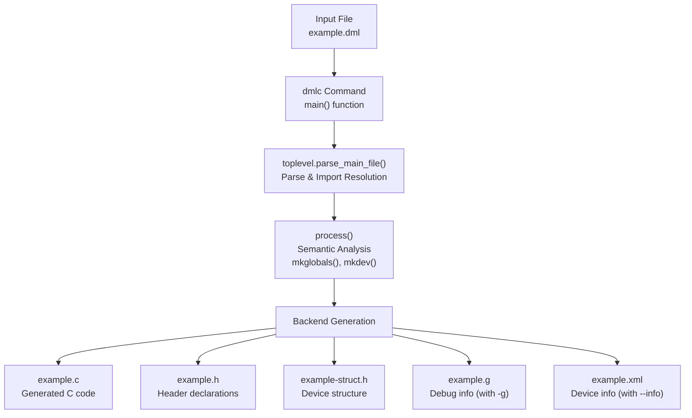
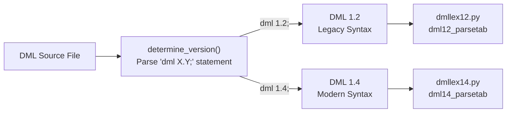
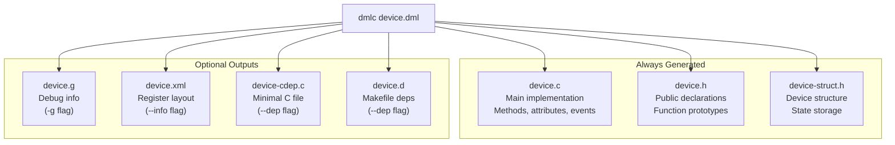
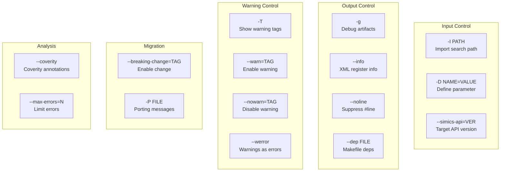

# Basic Usage

<details>
<summary>Relevant source files</summary>

The following files were used as context for generating this wiki page:

- [RELEASENOTES-1.2.md](RELEASENOTES-1.2.md)
- [RELEASENOTES-1.4.md](RELEASENOTES-1.4.md)
- [RELEASENOTES.md](RELEASENOTES.md)
- [deprecations_to_md.py](deprecations_to_md.py)
- [py/dml/breaking_changes.py](py/dml/breaking_changes.py)
- [py/dml/dmlc.py](py/dml/dmlc.py)
- [py/dml/globals.py](py/dml/globals.py)
- [py/dml/toplevel.py](py/dml/toplevel.py)

</details>


This page covers the basic command-line usage of the DML compiler (`dmlc`), including command-line options, compilation workflow, and output files. For information about building the compiler from source, see [Installation and Build](#2.1). For a step-by-step tutorial on creating a device model, see [Your First Device Model](#2.3).

## Basic Invocation

The DML compiler is invoked through the `dmlc` command, which compiles a DML source file into C code suitable for building a Simics device module:

```bash
dmlc [OPTIONS] input.dml [output_base]
```

- `input.dml`: Main DML file to compile. Must contain a `device` statement at top level.
- `output_base`: Optional prefix for generated files (default: input filename without `.dml` suffix)

**Minimal Example:**
```bash
dmlc my_device.dml
```

This generates `my_device.c`, `my_device.h`, and related files in the current directory.

**Sources:** [py/dml/dmlc.py:308-511]()

## Compilation Workflow



**Workflow Description:**

| Phase | Module | Description |
|-------|--------|-------------|
| Parsing | `toplevel.parse_main_file()` | Reads input file, determines DML version, resolves imports |
| Semantic Analysis | `structure.mkglobals()` | Processes global definitions (types, templates, constants) |
| Device Construction | `structure.mkdev()` | Builds device object tree from templates |
| Code Generation | `c_backend.generate()` | Generates C implementation and headers |
| Debug Info | `g_backend.generate()` | Generates debug symbols (if `-g` specified) |
| Device Info | `info_backend.generate()` | Generates XML register layout (if `--info` specified) |

**Sources:** [py/dml/dmlc.py:692-696](), [py/dml/dmlc.py:72-96](), [py/dml/toplevel.py:359-459]()

## Command-Line Options Reference

### Import and Include Paths

**`-I PATH`**  
Add `PATH` to the search path for imported modules. When a DML file uses `import "filename.dml";`, the compiler searches for the file in directories specified by `-I` flags (in order), followed by the directory containing the importing file. Version-specific subdirectories (`1.2/`, `1.4/`) are also searched automatically.

```bash
dmlc -I lib -I ../common device.dml
```

**Sources:** [py/dml/dmlc.py:326-330]()

### Compile-Time Parameters

**`-D NAME=VALUE`**  
Define a compile-time parameter in the top-level scope. The value must be a literal: integer, float, boolean (`true`/`false`), or string.

```bash
dmlc -D FEATURE_X=true -D MAX_SIZE=1024 device.dml
```

The parameter assignment is processed by `parse_define()` which parses the value using the DML 1.4 lexer and creates an AST node.

**Sources:** [py/dml/dmlc.py:337-342](), [py/dml/dmlc.py:116-147]()

### Dependency Generation

**`--dep FILE`**  
Generate makefile dependencies showing which files the compilation depends on. Writes a rule to `FILE` in makefile format:

```makefile
output.c output.dmldep : input.dml imported1.dml imported2.dml
imported1.dml:
imported2.dml:
```

**`--no-dep-phony`**  
Suppress generation of phony targets for dependencies (the `imported1.dml:` lines above).

**`--dep-target TARGET`**  
Override the target name in the dependency rule. Can be specified multiple times for multiple targets.

```bash
dmlc --dep device.d --dep-target build/device.o device.dml
```

**Sources:** [py/dml/dmlc.py:345-365](), [py/dml/dmlc.py:704-744]()

### Warning Control

**`-T`**  
Show warning tags in compiler messages. Tags can then be used with `--warn` and `--nowarn`.

```bash
dmlc -T device.dml
# Output: device.dml:45: warning (WUNUSED): parameter 'foo' is not used
```

**`--warn=TAG`**  
Enable a specific warning. Use `--help-warn` to list all available tags.

**`--nowarn=TAG`**  
Suppress a specific warning. By default, several warnings are disabled: `WASSERT`, `WNDOC`, `WSHALL`, `WUNUSED`, `WNSHORTDESC`.

**`--help-warn`**  
Display all warning tags and their default enabled/disabled status.

**`--werror`**  
Treat all warnings as errors.

```bash
dmlc --warn=WUNUSED --werror device.dml
```

**Sources:** [py/dml/dmlc.py:369-409](), [py/dml/dmlc.py:39-43](), [py/dml/dmlc.py:272-283]()

### Debugging and Analysis

**`-g`**  
Generate debug artifacts for source-level debugging:
- `.g` file with DML debug information for `debug-simics`
- C code that follows DML structure more closely (less optimization)

```bash
dmlc -g device.dml
```

**`--noline`**  
Suppress `#line` directives in generated C code. Useful when debugging the generated C directly.

**`--coverity`**  
Add Synopsys® Coverity® annotations to suppress common false positives in generated code for DML 1.4 devices.

**Sources:** [py/dml/dmlc.py:382-384](), [py/dml/dmlc.py:429-431](), [py/dml/dmlc.py:421-425]()

### Output Control

**`--info`**  
Generate an XML file describing the device register layout. Used for documentation and introspection tools.

**`--max-errors=N`**  
Limit the number of error messages to `N`. Default is 0 (unlimited).

**Sources:** [py/dml/dmlc.py:435-437](), [py/dml/dmlc.py:450-454]()

### API Version Selection

**`--simics-api=VERSION`**  
Specify which Simics API version to target. Valid values: `4.8`, `5`, `6`, `7`. Default is the current Simics version.

The API version affects:
- Which Simics API functions are available
- Default values of breaking change flags
- Compatibility features enabled/disabled

```bash
dmlc --simics-api=6 device.dml
```

**Sources:** [py/dml/dmlc.py:441-446](), [py/dml/dmlc.py:530-533]()

### Breaking Changes and Migration

**`--breaking-change=TAG`**  
Enable a specific breaking change, allowing migration to newer API semantics incrementally. Breaking changes are features that change behavior in newer Simics API versions but can be enabled early for testing.

**`--help-breaking-change`**  
Display all breaking change tags and their descriptions.

**Common Breaking Change Tags:**

| Tag | Description | Default After |
|-----|-------------|---------------|
| `strict-typechecking` | Enforce strict type checking similar to C | API 7 |
| `modern-attributes` | Use modern attribute registration (no dict support) | API 7 |
| `transaction-by-default` | Use transaction interface in banks by default | API 6 |
| `shared-logs-locally` | Log statements in shared methods use local object | API 6 |
| `dml12-modern-int` | Apply modern integer semantics in DML 1.2 | API 6 |

```bash
dmlc --breaking-change=strict-typechecking device.dml
```

**Legacy `--no-compat` flag:**  
The older `--no-compat=TAG` syntax is still supported but deprecated. It uses feature names instead of breaking change tags:

```bash
# Old style (still works)
dmlc --no-compat=lenient_typechecking device.dml

# New style (preferred)
dmlc --breaking-change=strict-typechecking device.dml
```

**Sources:** [py/dml/dmlc.py:465-471](), [py/dml/dmlc.py:585-633](), [py/dml/breaking_changes.py:27-50](), [py/dml/breaking_changes.py:277-298]()

## DML Version Selection



Every DML file must begin with a version statement (with API 8+):

```dml
dml 1.4;

device my_device;
// ...
```

**Version Detection:**
1. The compiler reads the file to find the `dml X.Y;` statement
2. Version-specific lexer and parser are selected
3. Standard library path includes version subdirectory (`lib/1.4/` or `lib/1.2/`)

**Version Compatibility:**
- DML 1.4 files can import DML 1.2 files (for migration)
- DML 1.2 files **cannot** import DML 1.4 files (except with `dml12-compatibility.dml`)
- Mixed-version compilation uses the main file's version for defaults

**Sources:** [py/dml/toplevel.py:66-112](), [py/dml/toplevel.py:359-398]()

## Generated Output Files



### Core Output Files

**`device.c`** - Main implementation file containing:
- Device structure initialization
- Method implementations (translated from DML)
- Attribute registration and accessors
- Event callbacks
- Interface method wrappers
- Runtime support (serialization, traits, hooks)

**`device.h`** - Public header with:
- Function declarations for exported methods
- Type definitions needed by external code
- Include guards

**`device-struct.h`** - Device state structure:
```c
typedef struct {
    conf_object_t obj;
    // Session variables
    // Saved variables (checkpointable state)
    // Bank/port configuration objects
    // Event data structures
} device_t;
```

### Optional Output Files

**`device.g`** (with `-g`) - Debug information file:
- Mapping from DML source to generated C
- Symbol information for debuggers
- Used by `debug-simics` for source-level debugging

**`device.xml`** (with `--info`) - Device documentation:
- Register layout and offsets
- Field definitions
- Bank configurations
- Attribute descriptions

**`device-cdep.c`** (with `--dep`) - Minimal C file:
- Contains only `#include` directives from `header` blocks
- Used for C-level dependency generation
- Enables build systems to track C header dependencies

**`device.d`** (with `--dep`) - Makefile dependencies:
- Lists all imported DML files
- Formatted for GNU Make inclusion

**Sources:** [py/dml/dmlc.py:149-159](), [dml/c_backend.py (backend generation)](), [dml/g_backend.py (debug info)](), [dml/info_backend.py (XML info)]()

## Porting and Migration Support

**`-P FILE`**  
Append machine-readable porting messages to `FILE` for automated migration from DML 1.2 to 1.4. Used with the `port-dml.py` script.

```bash
# Generate porting hints
dmlc -P porting.log -T old_device.dml

# Apply automatic porting
port-dml.py --tags porting.log old_device.dml > new_device.dml
```

**Environment Variable: `DMLC_PORTING_TAG_FILE`**  
When building multiple modules, set this variable to collect porting hints across all compilations:

```bash
export DMLC_PORTING_TAG_FILE=all_porting.log
make  # builds multiple DML devices
port-dml.py --tags all_porting.log module/*.dml
```

**Sources:** [py/dml/dmlc.py:483-486](), [py/dml/dmlc.py:665-673](), [RELEASENOTES-1.2.md:19-20]()

## Usage Patterns and Examples

### Basic Compilation
```bash
# Compile with default settings
dmlc device.dml

# Specify output directory
dmlc device.dml build/device
# Generates: build/device.c, build/device.h, build/device-struct.h
```

### Development Workflow
```bash
# Enable all warnings and debug info
dmlc -g -T --warn=WUNUSED --warn=WNDOC device.dml

# Check without generating C code (fast syntax check)
dmlc --dep /dev/null device.dml
```

### Build System Integration
```bash
# Generate dependencies for Make
dmlc --dep device.d device.dml
include device.d

# Multi-target dependencies
dmlc --dep device.d \
     --dep-target device.o \
     --dep-target device-pic.o \
     device.dml
```

### Migration and Compatibility
```bash
# Compile DML 1.2 with modern integer semantics
dmlc --breaking-change=dml12-modern-int legacy_device.dml

# Compile for older Simics version
dmlc --simics-api=6 device.dml

# Prepare for Simics 8 migration
dmlc --simics-api=7 \
     --breaking-change=strict-typechecking \
     --breaking-change=modern-attributes \
     device.dml
```

### Static Analysis
```bash
# Coverity analysis support
dmlc --coverity device.dml

# No line directives for C debugging
dmlc --noline device.dml
```

**Sources:** [py/dml/dmlc.py:308-747]()

## Error Handling and Diagnostics

The compiler exits with the following status codes:

| Exit Code | Meaning |
|-----------|---------|
| 0 | Success (no errors or warnings with `--werror`) |
| 1 | Invalid command-line arguments |
| 2 | Compilation errors |

**Error Message Format:**
```
filename:line:column: error (ETAG): message
filename:line:column: warning (WTAG): message
```

**Controlling Error Output:**
- Use `-T` to see error/warning tags
- Use `--max-errors=N` to limit error count
- Use `--werror` to make warnings fatal
- Use `--nowarn=TAG` to suppress specific warnings

**Sources:** [py/dml/dmlc.py:227-236](), [py/dml/dmlc.py:450-454]()

## Environment Variables

| Variable | Purpose |
|----------|---------|
| `DMLC_PORTING_TAG_FILE` | File to append porting messages (alternative to `-P`) |
| `DMLC_DEBUG` | Enable debug mode with full stack traces on errors |
| `DMLC_PROFILE` | Enable profiling output |
| `DMLC_DUMP_INPUT_FILES` | Create `.tar.bz2` archive of all imported files |

**Sources:** [py/dml/dmlc.py:45-48](), [py/dml/dmlc.py:682-687](), [py/dml/dmlc.py:701-703]()

## Complete Option Summary



**Sources:** [py/dml/dmlc.py:314-511]()