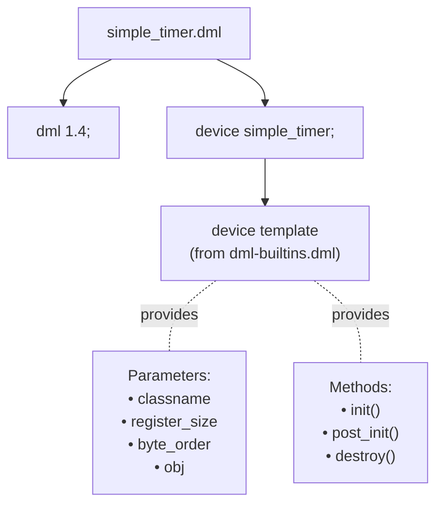
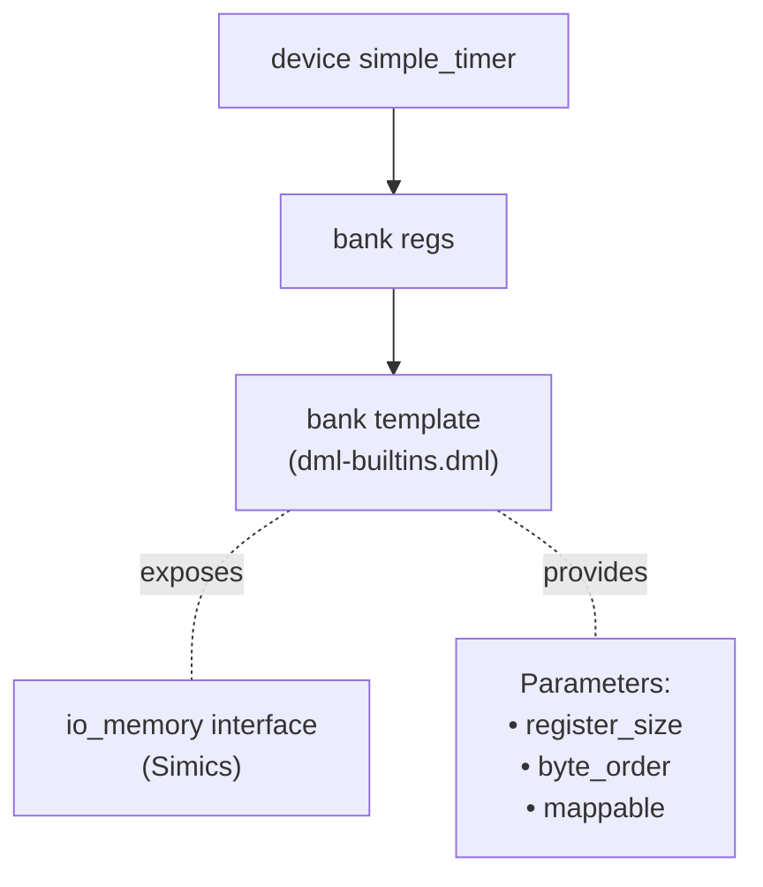
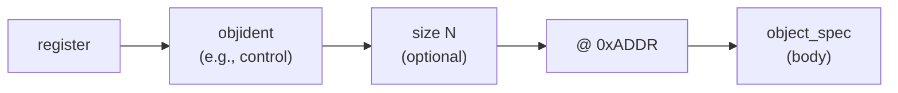
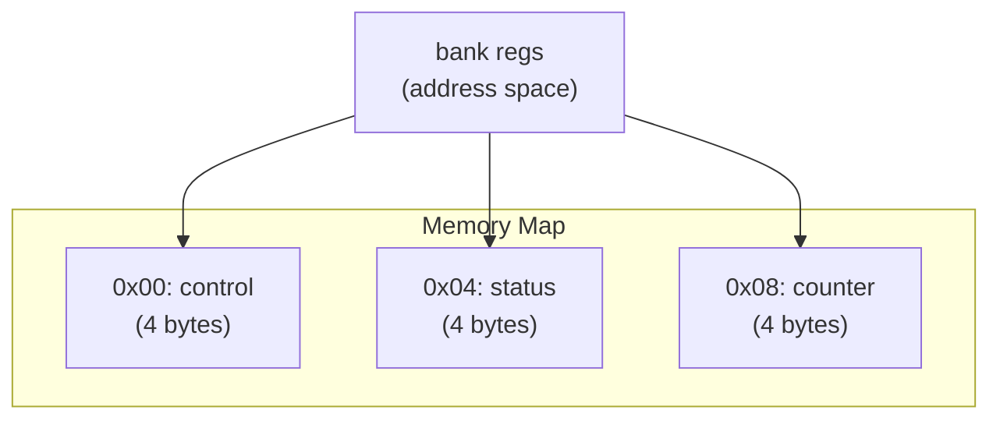
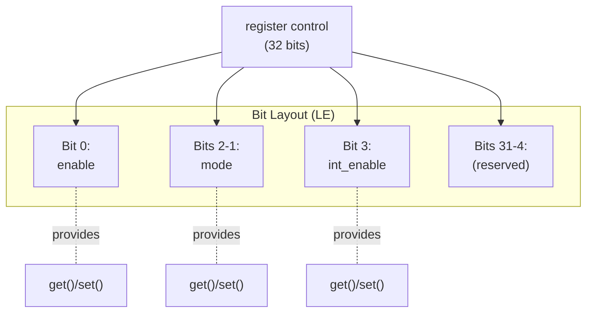
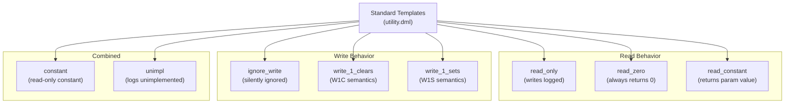
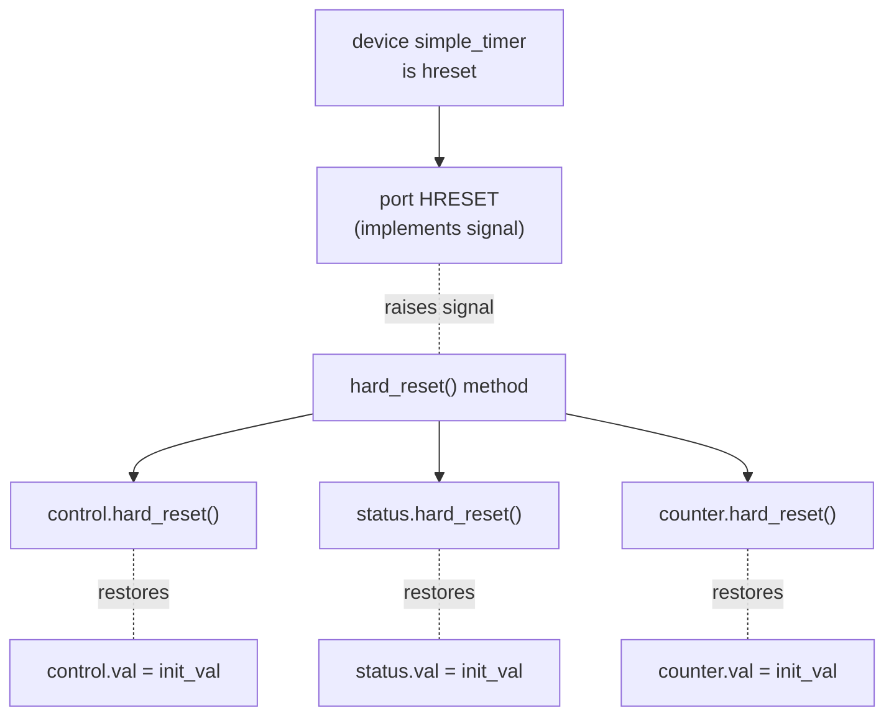
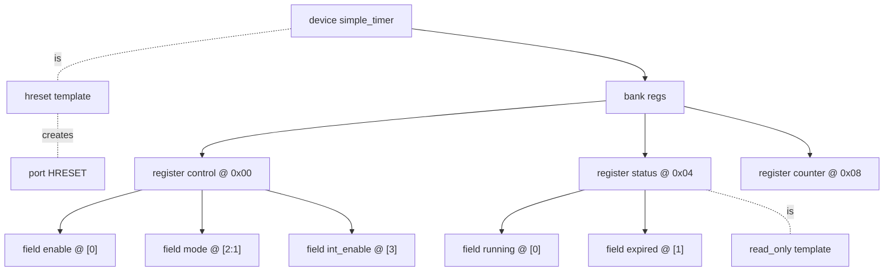
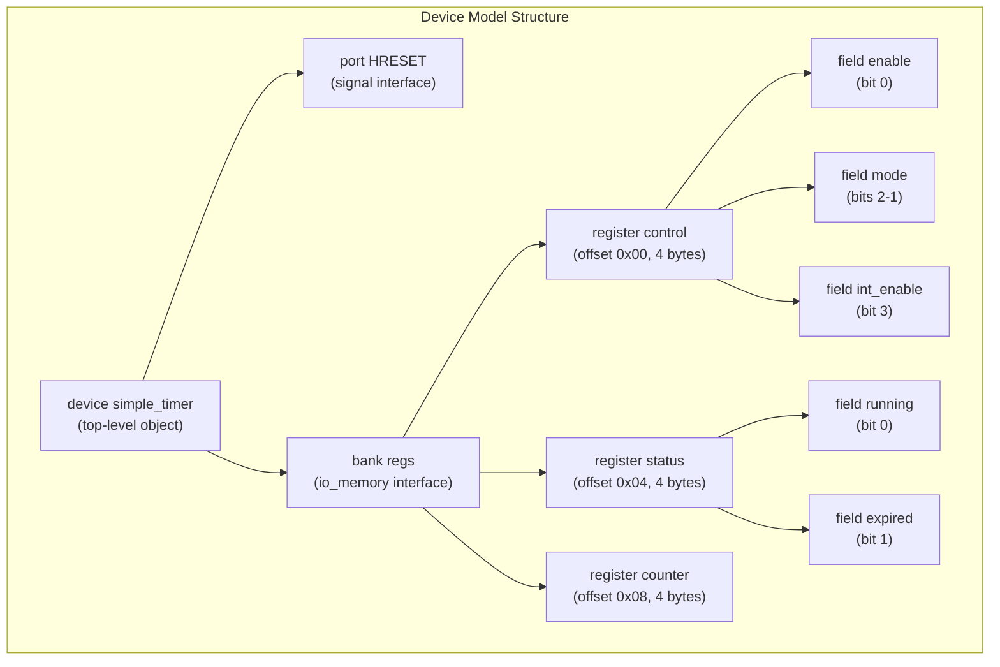

# Your First Device Model

<details>
<summary>Relevant source files</summary>

The following files were used as context for generating this wiki page:

- [doc/1.4/language.md](doc/1.4/language.md)
- [lib/1.2/dml-builtins.dml](lib/1.2/dml-builtins.dml)
- [lib/1.4/dml-builtins.dml](lib/1.4/dml-builtins.dml)
- [lib/1.4/utility.dml](lib/1.4/utility.dml)
- [py/dml/dmlparse.py](py/dml/dmlparse.py)
- [py/dml/messages.py](py/dml/messages.py)
- [test/1.4/lib/T_io_memory.dml](test/1.4/lib/T_io_memory.dml)
- [test/1.4/lib/T_io_memory.py](test/1.4/lib/T_io_memory.py)
- [test/1.4/lib/T_map_target_connect.py](test/1.4/lib/T_map_target_connect.py)
- [test/1.4/lib/T_signal_templates.dml](test/1.4/lib/T_signal_templates.dml)
- [test/1.4/lib/T_signal_templates.py](test/1.4/lib/T_signal_templates.py)

</details>


This page provides a hands-on tutorial for creating a simple but complete DML device model. It assumes you have already installed the DML compiler and understand basic command-line usage (see [Installation and Build](#2.1) and [Basic Usage](#2.2)). For comprehensive language reference, see [DML Language Reference](#3). For details on the standard library templates used here, see [Standard Library](#4).

We will create a simple timer device with control registers, demonstrating the core building blocks of DML device modeling.

---

## Overview: What We're Building

We will create a timer device model with:
- A control register to start/stop the timer
- A status register showing the current state
- A counter register holding the timer value

This simple example demonstrates the essential DML concepts: device declaration, register banks, registers, bit fields, and standard templates.

---

## Minimal Device Structure

Every DML model starts with a version declaration and device declaration. Create a file named `simple_timer.dml`:

```dml
dml 1.4;

device simple_timer;
```

The `dml 1.4;` statement must be the first declaration in the file (see [lib/1.4/dml-builtins.dml:6]()). This selects DML version 1.4 and loads the appropriate standard library.

The `device simple_timer;` statement names the Simics configuration class that will be created. This becomes the top-level object in your device hierarchy (see [doc/1.4/language.md:190-207]()).

### Device Object Structure



Sources: [lib/1.4/dml-builtins.dml:626-722](), [doc/1.4/language.md:379-401]()

---

## Adding a Register Bank

Registers must be organized into banks. A bank provides memory-mapped I/O functionality and groups related registers together:

```dml
dml 1.4;

device simple_timer;

bank regs {
    param register_size = 4;  // Default register size: 4 bytes
}
```

The `bank` object type creates a register bank that will be exposed to the simulated system through the `io_memory` interface (see [doc/1.4/language.md:402-420]()).

### Bank Object Hierarchy



| Parameter | Purpose | Default |
|-----------|---------|---------|
| `register_size` | Default size in bytes for registers in this bank | `undefined` (from device) |
| `byte_order` | Byte order for multi-byte registers | `"little-endian"` |
| `mappable` | Whether bank can be mapped in memory space | `true` (if named) |

Sources: [lib/1.4/dml-builtins.dml:1495-1630](), [doc/1.4/language.md:402-420]()

---

## Creating Registers

Now add registers to the bank. Registers are declared with an offset (memory address) and optional size:

```dml
dml 1.4;

device simple_timer;

bank regs {
    param register_size = 4;
    
    // Control register at offset 0x00
    register control @ 0x00;
    
    // Status register at offset 0x04
    register status @ 0x04;
    
    // Counter register at offset 0x08
    register counter @ 0x08;
}
```

The `@ 0x00` syntax specifies the register's offset within the bank's address space (see [doc/1.4/language.md:471-512]()). Since we set `register_size = 4`, all registers default to 4 bytes unless overridden.

### Register Declaration Syntax



### Register Memory Layout



Each register automatically provides:
- `val` member - the register's value (see [doc/1.4/language.md:554-558]())
- `get()` method - read the register value
- `set(value)` method - write the register value
- Automatic checkpoint attribute creation

Sources: [lib/1.4/dml-builtins.dml:1632-1852](), [doc/1.4/language.md:421-559]()

---

## Adding Register Fields

Registers often contain multiple logical fields occupying different bit ranges. Let's add fields to our control register:

```dml
dml 1.4;

device simple_timer;

bank regs {
    param register_size = 4;
    
    register control @ 0x00 {
        // Bit 0: Timer enable
        field enable @ [0];
        
        // Bits 2-1: Timer mode
        field mode @ [2:1];
        
        // Bit 3: Interrupt enable
        field int_enable @ [3];
    }
    
    register status @ 0x04 {
        // Bit 0: Timer running
        field running @ [0];
        
        // Bit 1: Timer expired
        field expired @ [1];
    }
    
    register counter @ 0x08;
}
```

Field syntax `@ [msb:lsb]` specifies the bit range in little-endian bit order (bit 0 is LSB). For single-bit fields, `@ [n]` is shorthand for `@ [n:n]` (see [doc/1.4/language.md:559-637]()).

### Register Field Structure



### Field to Register Value Mapping

| Field Access | Register Impact |
|--------------|-----------------|
| `control.enable.set(1)` | Sets bit 0 of `control.val` |
| `control.mode.get()` | Returns bits 2-1 of `control.val` |
| `control.val = 0x0F` | Sets all bits; fields reflect new values |

Sources: [lib/1.4/dml-builtins.dml:1854-2052](), [doc/1.4/language.md:559-637]()

---

## Adding Register Behavior

Raw registers allow arbitrary read/write access. Use standard templates to define specific behaviors:

```dml
dml 1.4;

device simple_timer;

import "utility.dml";

bank regs {
    param register_size = 4;
    
    register control @ 0x00 {
        field enable @ [0];
        field mode @ [2:1];
        field int_enable @ [3];
    }
    
    register status @ 0x04 is (read_only) {
        field running @ [0];
        field expired @ [1];
    }
    
    register counter @ 0x08 {
        // Custom write behavior
        method write(uint64 value) {
            log info: "Counter set to %d", value;
            default(value);
        }
    }
}
```

### Common Register Templates



| Template | Read Behavior | Write Behavior | Use Case |
|----------|---------------|----------------|----------|
| `read_only` | Return current value | Log warning, ignore write | Hardware-controlled status |
| `ignore_write` | Return current value | Silently ignore write | Reserved read-only fields |
| `write_1_clears` | Return current value | Clear bits where value is 1 | Interrupt status (W1C) |
| `constant` | Return parameter value | Log warning, ignore write | Fixed configuration values |
| `unimpl` | Log unimplemented | Log unimplemented | Placeholder registers |

The `is (template_name)` syntax instantiates templates (see [doc/1.4/language.md:1356-1380]()). The `read_only` template automatically logs violations when software attempts writes (see [lib/1.4/utility.dml:413-445]()).

Sources: [lib/1.4/utility.dml:336-1178](), [lib/1.4/dml-builtins.dml:177-267]()

---

## Adding Reset Support

Most devices need reset functionality. Add reset templates to define power-on and hard reset behavior:

```dml
dml 1.4;

device simple_timer;

import "utility.dml";

// Enable hard reset support
is hreset;

bank regs {
    param register_size = 4;
    
    register control @ 0x00 {
        param init_val = 0x0;  // Reset to 0
        
        field enable @ [0];
        field mode @ [2:1];
        field int_enable @ [3];
    }
    
    register status @ 0x04 is (read_only) {
        param init_val = 0x0;
        
        field running @ [0];
        field expired @ [1];
    }
    
    register counter @ 0x08 {
        param init_val = 0x0;
    }
}
```

### Reset Template Hierarchy



| Template | Port Created | Method Called | Default Behavior |
|----------|--------------|---------------|------------------|
| `poreset` | `POWER` | `power_on_reset()` | Restore `init_val` |
| `hreset` | `HRESET` | `hard_reset()` | Restore `init_val` |
| `sreset` | `SRESET` | `soft_reset()` | Restore `init_val` |

The reset signal is delivered via the `signal` interface on the generated port. Registers automatically implement the reset methods to restore their `init_val` parameter (see [lib/1.4/utility.dml:50-333]()).

Sources: [lib/1.4/utility.dml:176-333](), [lib/1.4/dml-builtins.dml:387-420]()

---

## Complete Example

Here is the complete device model with all components:

```dml
dml 1.4;

device simple_timer;

import "utility.dml";

// Enable hard reset
is hreset;

// Register bank
bank regs {
    param register_size = 4;
    
    // Control register with fields
    register control @ 0x00 {
        param init_val = 0x0;
        
        field enable @ [0] {
            // Add custom write behavior
            method write_field(uint64 value, uint64 enabled_bits, void *aux) {
                if (value & enabled_bits) {
                    log info: "Timer enabled";
                }
                default(value, enabled_bits, aux);
            }
        }
        field mode @ [2:1];
        field int_enable @ [3];
    }
    
    // Read-only status register
    register status @ 0x04 is (read_only) {
        param init_val = 0x0;
        
        field running @ [0];
        field expired @ [1];
    }
    
    // Counter register with custom logging
    register counter @ 0x08 {
        param init_val = 0x0;
        
        method write(uint64 value) {
            log info: "Counter written: 0x%08x", value;
            default(value);
        }
        
        method read() -> (uint64) {
            local uint64 value = default();
            log info, 4: "Counter read: 0x%08x", value;
            return value;
        }
    }
}
```

### Complete Device Structure



Sources: [test/1.4/lib/T_io_memory.dml:1-175](), [lib/1.4/dml-builtins.dml:626-722]()

---

## Compilation and Testing

### Compiling the Device

Compile the device model using the DML compiler:

```bash
dmlc simple_timer.dml --simics-api=6
```

This generates:
- `simple_timer.c` - C implementation
- `simple_timer.h` - Header declarations
- Additional support files

The `--simics-api` flag specifies which Simics API version to target (see [Basic Usage](#2.2)).

### Generated Simics Class

The compilation creates a Simics configuration class named `simple_timer` (from the device declaration) with:

| Simics Entity | DML Source | Purpose |
|---------------|------------|---------|
| Class `simple_timer` | `device simple_timer` | Configuration object class |
| Object `obj.bank.regs` | `bank regs` | Bank configuration object |
| Interface `io_memory` | `bank regs` | Memory-mapped I/O access |
| Attribute `regs_control` | `register control` | Control register value |
| Attribute `regs_status` | `register status` | Status register value |
| Attribute `regs_counter` | `register counter` | Counter register value |
| Port `HRESET` | `is hreset` | Reset signal input |

### Testing in Simics

Create a test script `test.simics`:

```python
# Create device instance
$dev = (create-simple-timer name = timer0)

# Map register bank to memory space
$mem = (create-memory-space name = mem)
$mem.map $dev.bank.regs base = 0x1000 size = 0x1000

# Test register access
$mem.write 0x1000 0x00000001 4    # Write to control register
$val = ($mem.read 0x1004 4)       # Read status register
echo "Status: " + $val

# Test reset
$dev.port.HRESET.signal.signal_raise
$val = ($mem.read 0x1000 4)       # Should be 0 after reset
echo "Control after reset: " + $val
```

Run with: `simics test.simics`

Sources: [test/1.4/lib/T_io_memory.py:1-70]()

---

## Object Hierarchy Summary

The complete device hierarchy:



### Key Concepts Covered

| Concept | DML Construct | Purpose |
|---------|---------------|---------|
| Device class | `device simple_timer` | Top-level Simics configuration class |
| Register grouping | `bank regs` | Memory-mapped register container |
| Register declaration | `register control @ 0x00` | Hardware register with address |
| Bit fields | `field enable @ [0]` | Sub-register bit ranges |
| Behavior templates | `is (read_only)` | Standard register behaviors |
| Reset handling | `is hreset` | Device reset support |
| Method overrides | `method write(...)` | Custom register behavior |

Sources: [doc/1.4/language.md:265-340](), [lib/1.4/dml-builtins.dml:1-2832]()

---

## Next Steps

Now that you understand basic device structure, explore:

- **[Type System](#3.3)** - Understanding DML data types and type safety
- **[Templates](#3.5)** - Creating reusable code patterns
- **[Standard Library](#4)** - Complete reference of built-in templates
- **[Memory-Mapped I/O](#4.5)** - Advanced bank and transaction handling
- **[Attributes and Connections](#4.6)** - Device configuration and inter-device communication
- **[Events and Lifecycle](#4.7)** - Timed callbacks and initialization

For detailed language syntax and semantics, see [DML Language Reference](#3).

Sources: [doc/1.4/language.md:1-8936](), [lib/1.4/dml-builtins.dml:177-2832]()