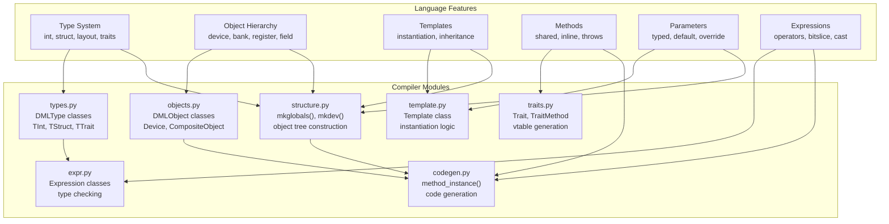
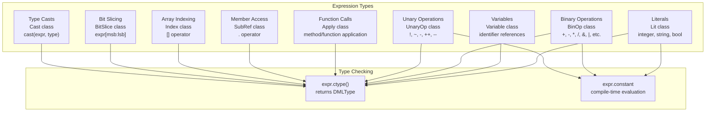
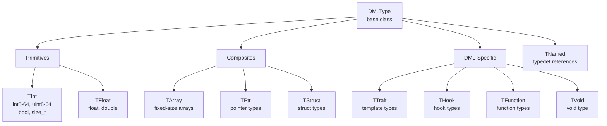

# DML Language Reference

<details>
<summary>Relevant source files</summary>

The following files were used as context for generating this wiki page:

- [RELEASENOTES-1.2.md](RELEASENOTES-1.2.md)
- [RELEASENOTES-1.4.md](RELEASENOTES-1.4.md)
- [RELEASENOTES.md](RELEASENOTES.md)
- [doc/1.4/language.md](doc/1.4/language.md)
- [py/dml/dmlparse.py](py/dml/dmlparse.py)
- [py/dml/messages.py](py/dml/messages.py)

</details>


This document provides a comprehensive reference for the Device Modeling Language (DML) syntax, semantics, and language constructs. It covers both DML 1.2 (legacy) and DML 1.4 (modern) versions, documenting the core language features used to model hardware devices in Simics.

For implementation details of the DML compiler architecture, see [Compiler Architecture](#5). For the standard library API and built-in templates, see [Standard Library](#4). For practical usage and tutorials, see [Getting Started](#2).

## Language Overview

DML is a domain-specific modeling language for writing Simics device models. It combines C-like algorithmic constructs with declarative object-oriented features for defining device structures. The language is designed to automatically generate C code and Simics API bindings from high-level device descriptions.

**Key Language Features:**

- **Object Model**: Hierarchical device structure with predefined object types (`device`, `bank`, `register`, `field`, etc.)
- **Template System**: Reusable code blocks with parameterization and override mechanisms
- **Type System**: Static typing with primitives, composites, and special DML types (traits, hooks, template types)
- **Method System**: Functions with multiple return values, exceptions, and various qualifiers (shared, inline, independent)
- **Parameter System**: Compile-time constant expressions with override semantics
- **Bit Manipulation**: Built-in syntax for bit-slicing and field access
- **Meta-programming**: Compile-time conditionals (`#if`) and template instantiation

Sources: [doc/1.4/language.md:6-38]()

## Language Architecture

### DML Source to AST Mapping

The following diagram shows how DML language constructs map to Abstract Syntax Tree (AST) nodes and parser production rules in the compiler implementation.

```mermaid
graph TB
    subgraph "DML Source Constructs"
        DEVICE_DECL["device my_device;"]
        BANK_DECL["bank regs { }"]
        REG_DECL["register r @ 0x100 size 4;"]
        FIELD_DECL["field f @ [7:0];"]
        METHOD_DECL["method m() { }"]
        PARAM_DECL["param size = 4;"]
        TEMPLATE_DECL["template t { }"]
        TRAIT_DECL["shared method m();"]
        IS_STMT["is (read, write);"]
        IMPORT_STMT["import 'file.dml';"]
    end
    
    subgraph "Parser Rules (dmlparse.py)"
        PROD_DEVICE["p_maybe_device_yes()"]
        PROD_OBJECT3["p_object3()"]
        PROD_REGARRAY["p_object_regarray()"]
        PROD_FIELD["p_object_field()"]
        PROD_METHOD["p_object_method()"]
        PROD_PARAM["p_object_param()"]
        PROD_TEMPLATE["p_template()"]
        PROD_SHARED["p_template_statement_shared_method()"]
        PROD_IS["p_istemplate()"]
        PROD_IMPORT["p_import_str()"]
    end
    
    subgraph "AST Node Types (ast.py)"
        AST_DML["ast.dml()"]
        AST_OBJECT["ast.object_()"]
        AST_METHOD["ast.method()"]
        AST_PARAM["ast.param()"]
        AST_TEMPLATE["ast.template()"]
        AST_SHARED["ast.sharedmethod()"]
        AST_IS["ast.is_()"]
        AST_IMPORT["ast.import_()"]
    end
    
    DEVICE_DECL --> PROD_DEVICE
    BANK_DECL --> PROD_OBJECT3
    REG_DECL --> PROD_REGARRAY
    FIELD_DECL --> PROD_FIELD
    METHOD_DECL --> PROD_METHOD
    PARAM_DECL --> PROD_PARAM
    TEMPLATE_DECL --> PROD_TEMPLATE
    TRAIT_DECL --> PROD_SHARED
    IS_STMT --> PROD_IS
    IMPORT_STMT --> PROD_IMPORT
    
    PROD_DEVICE --> AST_DML
    PROD_OBJECT3 --> AST_OBJECT
    PROD_REGARRAY --> AST_OBJECT
    PROD_FIELD --> AST_OBJECT
    PROD_METHOD --> AST_METHOD
    PROD_PARAM --> AST_PARAM
    PROD_TEMPLATE --> AST_TEMPLATE
    PROD_SHARED --> AST_SHARED
    PROD_IS --> AST_IS
    PROD_IMPORT --> AST_IMPORT
```



Sources: [py/dml/dmlparse.py:177-875]()

### Language Feature to Compiler Module Mapping

This diagram shows how different language features are processed by various compiler modules.



Sources: [py/dml/types.py:1-100](), [py/dml/objects.py:1-100](), [py/dml/template.py:1-100](), [py/dml/traits.py:1-100](), [py/dml/structure.py:1-100](), [py/dml/expr.py:1-100](), [py/dml/codegen.py:1-100]()

## Language Versions: DML 1.2 vs 1.4

DML has two major versions with significant differences in syntax and semantics.

### Version Declaration and Support

Every DML file must begin with a version declaration:

```dml
dml 1.4;  // or dml 1.2;
```

The version declaration selects:
- The appropriate lexer (`dmllex12.py` or `dmllex14.py`)
- Version-specific parser production rules (decorated with `@prod_dml12` or `@prod_dml14`)
- The correct standard library (`lib/1.2/` or `lib/1.4/`)

Sources: [py/dml/dmlparse.py:152-175](), [doc/1.4/language.md:171-187]()

### Key Language Differences

| Feature | DML 1.2 | DML 1.4 |
|---------|---------|---------|
| **Method Syntax** | `method m() -> (int x)` | `method m() -> (int)` |
| **Parameter Access** | `$param` in expressions | `param` (no dollar sign) |
| **Exceptions** | `nothrow` annotation | `throws` annotation |
| **Object Access** | `this.obj` | Direct object reference |
| **Conditionals** | `if` for both compile-time and runtime | `#if` for compile-time, `if` for runtime |
| **Templates as Types** | Not supported | `register r; local typeof(r) x = r;` |
| **Reset System** | Hard-coded `hard_reset_value` | Configurable reset templates |
| **Performance** | Baseline | 2-3x faster for large register banks |

For detailed migration information, see [Language Versions](#3.1) and [Porting from DML 1.2 to 1.4](#7.2).

Sources: [RELEASENOTES-1.4.md:6-43](), [doc/1.4/language.md:1-50]()

## Core Language Constructs

### Lexical Structure

**Reserved Words:**
- All ISO C reserved words: `if`, `for`, `while`, `return`, `struct`, `int`, etc.
- C99/C++ additions: `inline`, `restrict`, `this`, `new`, `delete`, `throw`, `try`, `catch`, `template`
- DML-specific: `after`, `assert`, `call`, `cast`, `defined`, `each`, `error`, `foreach`, `in`, `is`, `local`, `log`, `param`, `saved`, `select`, `session`, `shared`, `sizeoftype`, `typeof`, `undefined`, `vect`, `where`

**Identifiers:**
- Follow C conventions: `[a-zA-Z_][a-zA-Z0-9_]*`
- Leading underscore reserved for DML language and standard library
- Exception: Single underscore `_` is the *discard identifier* with special semantics

**Literals:**
- **Integers**: Decimal (`123`), hexadecimal (`0x7F`), binary (`0b1010`)
- **Floats**: Standard C notation
- **Strings**: UTF-8 encoded, double-quoted, with C escape sequences
- **Characters**: Single-quoted, single ASCII character or escape sequence
- **Booleans**: `true`, `false`

Sources: [doc/1.4/language.md:36-134]()

### Expression System

DML expressions are processed by the `expr.py` module, which defines expression AST nodes and type checking:



Sources: [py/dml/expr.py:1-200]()

### Statement Types

Common statements in DML methods and blocks:

| Statement | Syntax Example | AST Node |
|-----------|----------------|----------|
| Local Variable | `local int x = 5;` | `ast.local()` |
| Assignment | `x = expr;` | `ast.expression()` with `ast.set()` |
| Compound | `{ stmt1; stmt2; }` | `ast.compound()` |
| If | `if (cond) { } else { }` | `ast.if_()` |
| While | `while (cond) { }` | `ast.while_()` |
| For | `for (init; cond; step) { }` | `ast.for_()` |
| Switch | `switch (expr) { case 1: ... }` | `ast.switch()` |
| Return | `return expr;` | `ast.return_()` |
| Throw | `throw;` | `ast.throw()` |
| Try/Catch | `try { } catch { }` | `ast.trycatch()` |
| Log | `log info: "message";` | `ast.log()` |
| Assert | `assert cond;` | `assert_()` |
| After | `after (1.0 s): callback();` | `ast.after()` |

Sources: [py/dml/dmlparse.py:1500-2000]()

## Error Messages and Language Constraints

The `messages.py` module defines all compiler errors and warnings, documenting language rules and constraints:

### Type Errors

- `ETYPE`: Unknown type reference
- `ECAST`: Illegal cast operation
- `EBTYPE`: Wrong type for expression
- `EANONSTRUCT`: Struct declaration in invalid context
- `ETREC`: Recursive type definition

### Expression Errors

- `ENBOOL`: Non-boolean condition (e.g., `if (i)` where i is int)
- `EASSIGN`: Cannot assign to non-lvalue
- `EBINOP`: Illegal operands to binary operator
- `EBSLICE`: Illegal bitslice operation
- `ENARRAY`: Indexing non-array
- `ENOPTR`: Not a pointer

### Method/Parameter Errors

- `EARG`: Wrong number of arguments
- `EARGT`: Wrong type in parameter
- `ENARGT`: Missing parameter type
- `ENMETH`: Not a method
- `ENORET`: Missing return statement
- `EBADFAIL`: Uncaught exception

### Object/Template Errors

- `EAMBINH`: Conflicting definitions (ambiguous inheritance)
- `EABSTEMPLATE`: Abstract template/method not implemented
- `ECYCLICTEMPLATE`: Cyclic template inheritance
- `ENTMPL`: Unknown template
- `ENALLOW`: Object not allowed in this context

Sources: [py/dml/messages.py:1-1200]()

## Compilation Process for Language Constructs

The following diagram shows how DML language constructs flow through the compilation pipeline:

```mermaid
graph LR
    subgraph "Source"
        DML["DML Source<br/>.dml file"]
    end
    
    subgraph "Frontend"
        LEX["Lexer<br/>dmllex12/14.py<br/>tokenization"]
        PARSE["Parser<br/>dmlparse.py<br/>production rules"]
        AST["AST<br/>ast.py<br/>syntax tree"]
    end
    
    subgraph "Semantic Analysis"
        GLOBALS["mkglobals()<br/>collect types,<br/>templates, externs"]
        MKDEV["mkdev()<br/>build device tree"]
        TEMPLATE_INST["add_templates()<br/>instantiate templates"]
        TYPE_CHECK["eval_type()<br/>type checking"]
    end
    
    subgraph "Code Generation"
        METHOD_GEN["method_instance()<br/>generate method code"]
        CTREE["ctree IR<br/>C statements/expressions"]
        CGEN["c_backend.py<br/>emit C code"]
    end
    
    DML --> LEX
    LEX --> PARSE
    PARSE --> AST
    AST --> GLOBALS
    GLOBALS --> MKDEV
    MKDEV --> TEMPLATE_INST
    TEMPLATE_INST --> TYPE_CHECK
    TYPE_CHECK --> METHOD_GEN
    METHOD_GEN --> CTREE
    CTREE --> CGEN
```



Sources: [py/dml/structure.py:1-500](), [py/dml/codegen.py:1-300](), [py/dml/c_backend.py:1-200]()

## Language Feature Categories

The DML Language Reference covers these major categories, each detailed in a separate sub-page:

### 3.1 Language Versions
Differences between DML 1.2 and 1.4, compatibility considerations, migration strategies, and the compatibility layer (`dml12-compatibility.dml`).

### 3.2 Syntax and Grammar
Complete lexical structure, grammar rules, operator precedence, statement syntax, and parsing behavior. Covers both version-specific and common syntax.

### 3.3 Type System
Type categories (primitives, composites, DML-specific), type declarations, type checking rules, type conversion, endian types, layout types, and the `typeof` operator.

### 3.4 Object Model
Device hierarchy, object types (`device`, `bank`, `register`, `field`, `connect`, `attribute`, etc.), containment rules, object arrays, and the instantiation model.

### 3.5 Templates
Template definition and instantiation, parameterization, template inheritance, override precedence (rank system), the `is` statement, and template composition.

### 3.6 Traits
Trait-based polymorphism, shared methods, vtables, template types as values, trait inheritance, identity system, and method resolution.

### 3.7 Methods and Parameters
Method types (regular, shared, inline, independent, startup, memoized), parameter system (compile-time constants), method calling conventions, default implementations, and the `throws`/`nothrow` system.

## Quick Reference Tables

### Object Type Containment Rules

| Parent Type | Can Contain |
|-------------|-------------|
| `device` | `bank`, `port`, `subdevice`, `connect`, `attribute`, `event`, `group`, `implement` |
| `bank` | `register`, `connect`, `attribute`, `event`, `group`, `implement` |
| `port` | `connect`, `attribute`, `event`, `group`, `implement` |
| `subdevice` | `bank`, `port`, `connect`, `attribute`, `event`, `group`, `implement` |
| `register` | `field`, `event`, `group` |
| `field` | `event`, `group` |
| `group` | Same as parent (except `interface`, `implement`) |
| `connect` | `interface`, `attribute`, `event`, `group` |

Sources: [doc/1.4/language.md:304-340]()

### Method Qualifiers

| Qualifier | DML Version | Effect |
|-----------|-------------|--------|
| `inline` | Both | Parameters may be untyped; method inlined at call site |
| `shared` | 1.2 (trait), 1.4 (template) | Method callable through trait/template type reference |
| `throws` | 1.4 | Method may throw exceptions |
| `nothrow` | 1.2 | Method does not throw exceptions |
| `default` | Both | Provides default implementation; can be overridden |
| `independent` | 1.4 | Static method, no access to object state |
| `startup` | 1.4 | Called during initialization; no input parameters |
| `memoized` | 1.4 | Result cached for startup methods |
| `extern` | 1.2 | External C function binding |

Sources: [py/dml/dmlparse.py:556-633](), [doc/1.4/language.md:1200-1400]()

### Type Categories



Sources: [py/dml/types.py:1-500]()

## Related Documentation

For detailed information on specific topics:

- **Object Model Details**: [Object Model](#3.4)
- **Template System**: [Templates](#3.5)  
- **Trait System**: [Traits](#3.6)
- **Standard Library**: [Standard Library](#4)
- **Compiler Implementation**: [Compiler Architecture](#5)
- **Porting Between Versions**: [Porting from DML 1.2 to 1.4](#7.2)
- **Error Messages**: [Error Messages Reference](#8)
- **API Quick Reference**: [API Reference](#9)