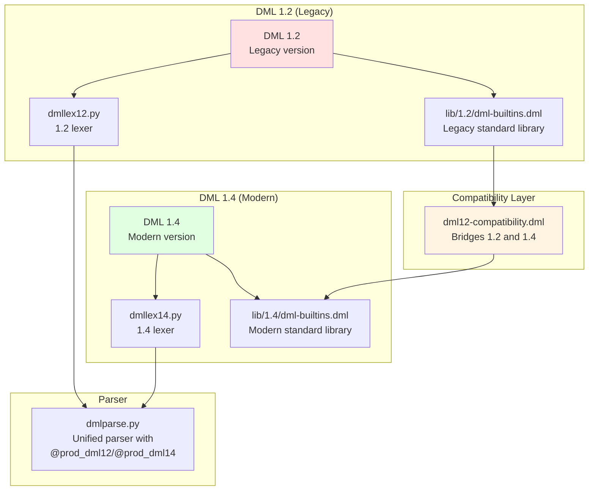
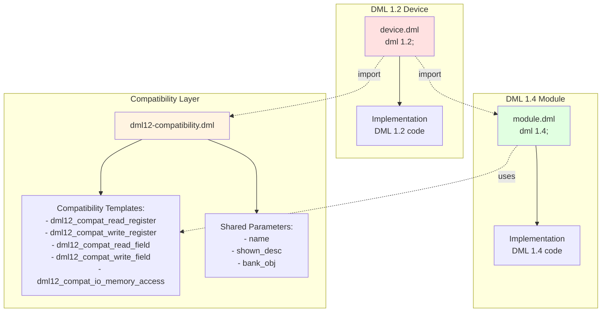
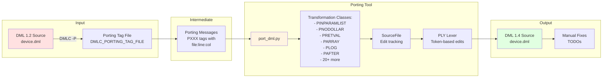
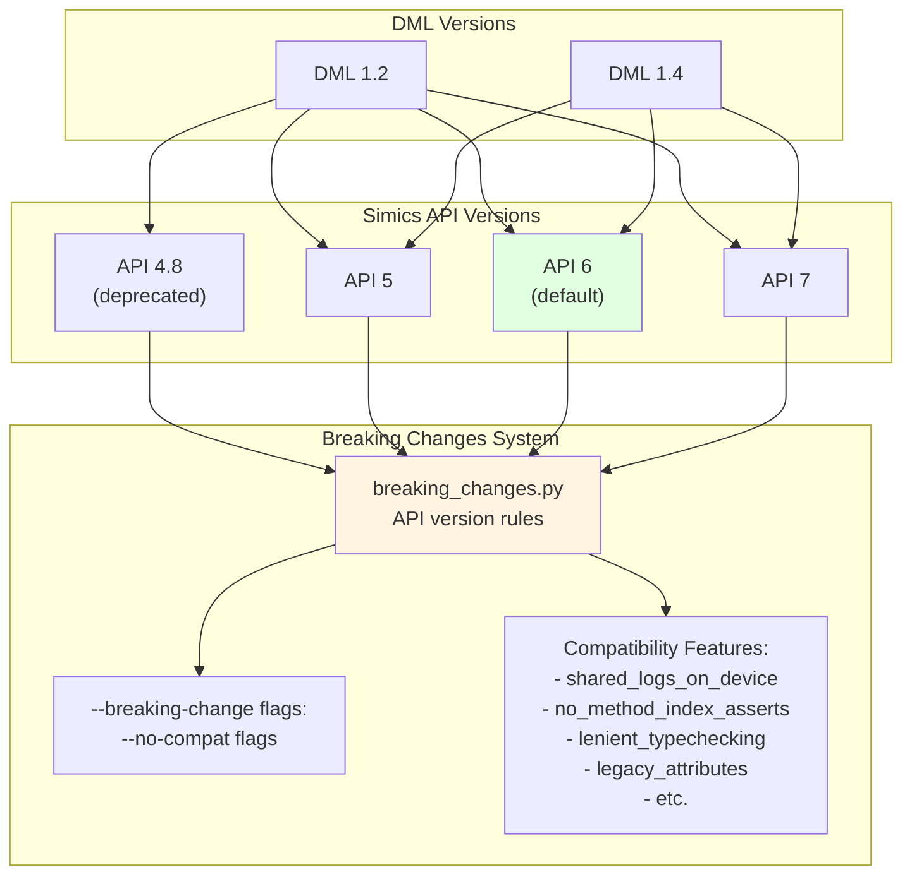

# Language Versions

<details>
<summary>Relevant source files</summary>

The following files were used as context for generating this wiki page:

- [RELEASENOTES-1.2.md](RELEASENOTES-1.2.md)
- [RELEASENOTES-1.4.md](RELEASENOTES-1.4.md)
- [RELEASENOTES.md](RELEASENOTES.md)
- [doc/1.4/language.md](doc/1.4/language.md)
- [py/dml/dmlparse.py](py/dml/dmlparse.py)
- [py/dml/messages.py](py/dml/messages.py)
- [py/port_dml.py](py/port_dml.py)
- [test/1.2/misc/porting.dml](test/1.2/misc/porting.dml)
- [test/1.4/misc/porting-common-compat.dml](test/1.4/misc/porting-common-compat.dml)
- [test/1.4/misc/porting-common.dml](test/1.4/misc/porting-common.dml)
- [test/1.4/misc/porting.dml](test/1.4/misc/porting.dml)
- [test/tests.py](test/tests.py)

</details>


## Purpose and Scope

This document describes the DML language version system, covering the differences between DML 1.2 and DML 1.4, their compatibility mechanisms, and the migration path between versions. It also explains how DML versions interact with different Simics API versions.

For details on the language syntax and semantics of DML 1.4, see the [Language Specification](#3.2). For information on the porting tools implementation, see [Porting from DML 1.2 to 1.4](#7.2).

## Language Version Declaration

Every DML source file must begin with a language version declaration that specifies which version of DML the file uses. The declaration must appear before any other statements except comments.

**Syntax:**
```dml
dml 1.4;
```
or
```dml
dml 1.2;
```

The version declaration serves multiple purposes:
- Allows the compiler to select the correct parser and lexer
- Determines which standard library version to load
- Controls language semantics and available features
- A file cannot import another file with a different language version

Sources: [doc/1.4/language.md:164-187](), [py/dml/dmlparse.py:178-203]()

## DML Language Versions Overview



**DML Version File Structure**

Sources: [py/dml/dmlparse.py:152-174](), [RELEASENOTES-1.4.md:6-24]()

## Major Differences Between DML 1.2 and DML 1.4

### Performance Improvements

DML 1.4 provides **2-3 times faster compilation** for devices with large register banks through optimizations in type system and code generation.

Sources: [RELEASENOTES-1.4.md:10-11]()

### Syntax Changes

| Feature | DML 1.2 | DML 1.4 |
|---------|---------|---------|
| Parameter reference | `$name` | `name` |
| Method declaration | `method m -> (int x)` | `method m() -> (int)` |
| Method call | `call $m() -> (x);` | `x = m();` |
| Constants | `constant x = 5;` | `param x = 5;` |
| Data members | `data int x;` | `session int x;` |
| Field bit ranges | `field f[4:3]` | `field f @ [4:3]` |
| Register offset undefined | `@ undefined` | `@ unmapped_offset` |
| Array declaration | `register r[10]` | `register r[i < 10]` |
| Event time units | `after (1.5)` | `after 1.5 s` |

Sources: [test/1.2/misc/porting.dml:1-466](), [test/1.4/misc/porting.dml:1-466]()

### Semantic Changes

**Method Calls and Return Values:**
- DML 1.2: Uses `call` statement with explicit output parameters
- DML 1.4: C-like function call syntax with return values

**Reset Mechanism:**
- DML 1.2: Hard-coded reset behavior via `hard_reset_value`/`soft_reset_value` parameters
- DML 1.4: Flexible reset system via `poreset`, `hreset`, `sreset` templates

**Templates as Types:**
- DML 1.4 introduces template types that can be stored in variables and passed as parameters
- Enables passing references to banks/registers/fields

Sources: [RELEASENOTES-1.4.md:17-23]()

### Standard Library Changes

**DML 1.2 Templates:**
- `unimplemented`, `silent_unimplemented`, `_read_unimplemented`, `_write_unimplemented`
- `hard_reset_value`, `soft_reset_value` parameters
- Implicit `read` and `write` method behavior

**DML 1.4 Templates:**
- `read`, `write`, `read_only`, `write_only` explicit templates
- `init_val`, `soft_reset_val` parameters
- `poreset`, `hreset`, `sreset` templates for reset behavior
- `unmapped` template instead of `@ undefined`

Sources: [test/1.2/misc/porting.dml:34-125](), [test/1.4/misc/porting.dml:31-138]()

## Compatibility System



**Compatibility Architecture**

### The `dml12-compatibility.dml` Library

This library enables DML 1.4 code to be imported and used from DML 1.2 devices. It provides:

**Compatibility Templates:**

When a DML 1.4 file needs to be callable from DML 1.2, specific templates ensure methods are invoked correctly:

- `dml12_compat_read_register` - Bridges DML 1.2 `read_register` calls to DML 1.4 implementations
- `dml12_compat_write_register` - Bridges DML 1.2 `write_register` calls to DML 1.4 implementations  
- `dml12_compat_read_field` - Handles field read compatibility
- `dml12_compat_write_field` - Handles field write compatibility
- `dml12_compat_io_memory_access` - Bridges bank I/O access methods

**Example Usage:**
```dml
// In DML 1.4 module
dml 1.4;
import "dml12-compatibility.dml";

bank b {
    register r size 4 @ 0x00 {
        is dml12_compat_read_register;
        is dml12_compat_write_register;
        
        method read_register(uint64 enabled_bytes, void *aux) -> (uint64) {
            // 1.4 implementation callable from 1.2
            return this.val;
        }
    }
}
```

**Shared Parameters:**

The compatibility library provides shared access to typed parameters across versions:
- Template parameter types from common templates like `name`, `shown_desc`
- `bank_obj` template for accessing bank configuration objects

Sources: [RELEASENOTES-1.4.md:29](), [RELEASENOTES.md:75-77](), [test/1.4/misc/porting-common-compat.dml:1-319]()

### Import Restrictions

Key compatibility rules:
- A DML 1.2 file **can** import DML 1.4 files (with compatibility layer)
- A DML 1.4 file **cannot** import DML 1.2 files
- Files must have matching language versions unless using the compatibility layer
- The top-level device file determines the device's primary version

Sources: [doc/1.4/language.md:136-157]()

## Migration Path



**DML 1.2 to 1.4 Migration Workflow**

### Automated Porting Tool: `port_dml.py`

The `port_dml.py` script provides automated migration from DML 1.2 to DML 1.4.

**Basic Usage:**
```bash
# Step 1: Generate porting tags
export DMLC_PORTING_TAG_FILE=tags.txt
make  # Build with DMLC, generates tags

# Step 2: Run porting tool
python3 port_dml.py tags.txt device.dml

# Step 3: Optional - compatibility mode for mixed codebases
python3 port_dml.py --compat tags.txt device.dml
```

Sources: [py/port_dml.py:1-43](), [RELEASENOTES-1.2.md:19]()

### Transformation System

The porting tool uses a sophisticated transformation system with 20+ transformation classes:

| Transformation | Purpose | Example |
|---------------|---------|---------|
| `PINPARAMLIST` | Convert parameter syntax | `$name` → `name` |
| `PNODOLLAR` | Remove $ prefix | `$this` → `this.val` |
| `PRETVAL` | Convert return syntax | `method m -> (x)` → `method m() -> (int)` |
| `PARRAY` | Convert array declarations | `r[10]` → `r[i < 10]` |
| `PLOG` | Update log statements | `log "info"` → `log info` |
| `PAFTER` | Convert after statements | `after (1.5) call $m` → `after 1.5 s: m()` |
| `PINLPARAM` | Convert inline parameters | `method m(p)` → `method m(inline p)` |
| `PCALL` | Convert method calls | `call $m() -> (x)` → `x = m()` |

**Transformation Implementation:**

Each transformation is a class that:
1. Identifies applicable code patterns using source locations
2. Computes replacement text
3. Tracks edits to handle overlapping transformations
4. Applies lexical-level changes via the `SourceFile` class

Sources: [py/port_dml.py:285-3495]()

### The `SourceFile` Class

Manages source file transformations with precise offset tracking:

**Key Methods:**
- `edit(offset, length, newstr)` - Replace text at offset
- `move(src_offs, length, dest_offs, newstr)` - Move and transform text
- `translate_offs(offset)` - Map original offsets to current positions
- `read_tokens(offset, end_offset)` - Lexical token stream
- `commit(f)` - Write final result

The class maintains `applied_translations` to handle multiple overlapping edits correctly.

Sources: [py/port_dml.py:82-212]()

### Porting Messages

The compiler generates **porting messages** (PXXX tags) when compiling with the `-P` flag:

**Common Porting Message Tags:**

| Tag | Meaning |
|-----|---------|
| `PINPARAMLIST` | Method parameter list conversion needed |
| `PNODOLLAR` | Dollar sign removal needed |
| `PFIELDRANGE` | Field bit range syntax update |
| `PRETVAL` | Return value conversion |
| `PARRAY` | Array declaration conversion |
| `PLOG` | Log statement syntax update |
| `PSESSION` | `data` → `session` conversion |
| `PAFTER` | After statement conversion |

**Porting Message Format:**
```
file.dml:line:col: porting PTAG: description
```

Sources: [py/dml/messages.py:1-5](), [test/tests.py:50-52]()

### Compatibility Mode (`--compat`)

When using `--compat`, the tool generates DML 1.4 code that remains compatible with DML 1.2 imports:

```bash
python3 port_dml.py --compat tags.txt device.dml
```

This mode:
- Automatically adds compatibility template instantiations
- Inserts `is dml12_compat_*` declarations where needed
- Preserves backward-compatible method signatures
- Adds conditional compilation blocks for 1.2-specific code

**Example Output with `--compat`:**
```dml
register r size 4 @ 0x00 {
    is dml12_compat_read_register;
    is dml12_compat_write_register;
    
    method read_register(uint64 enabled_bytes, void *aux) -> (uint64) {
        // Implementation
        return this.val;
    }
}
```

Sources: [test/1.4/misc/porting-common-compat.dml:1-319](), [test/1.4/misc/porting-common.dml:1-230]()

## Simics API Versioning



**Simics API Version Management**

### API Version Declaration

Specify the Simics API version when compiling:

```bash
dmlc --simics-api=6 device.dml
dmlc --simics-api=7 device.dml
```

**Default API Version:** `6`

Sources: [test/tests.py:126](), [py/dml/messages.py:260-268]()

### API Version Compatibility

| API Version | DML 1.2 Support | DML 1.4 Support | Status |
|-------------|-----------------|-----------------|--------|
| 4.8 | Yes | No | Deprecated |
| 5 | Yes | Yes | Supported |
| 6 | Yes | Yes | Default |
| 7 | Yes | Yes | Current |

DML 1.4 devices require Simics API 5 or later. The error `ESIMAPI` is raised when attempting to use an incompatible combination.

Sources: [py/dml/messages.py:260-268](), [test/tests.py:213-220]()

### Breaking Changes System

The compiler manages API compatibility through a **breaking changes system** that selectively enables/disables features based on API version.

**Compatibility Features:**

Features that maintain backward compatibility with older API versions:

- `shared_logs_on_device` - Log statements in shared methods use device object (API ≤ 6)
- `no_method_index_asserts` - Skip index bounds checks in object array methods (API ≤ 7)
- `lenient_typechecking` - Less strict pointer type checking (API ≤ 7)
- `legacy_attributes` - Use legacy attribute registration API (API ≤ 7)
- `suppress_WLOGMIXUP` - Suppress log level/group confusion warning (API ≤ 6)
- `meaningless_log_levels` - Allow invalid log levels for error/warning logs (API ≤ 7)
- `function_in_extern_struct` - Allow legacy function pointer syntax (API ≤ 7)

**Explicitly Enabling Breaking Changes:**

Use the `--breaking-change` (or `--no-compat`) flag to selectively disable compatibility features:

```bash
# Enable strict typechecking even with API 6
dmlc --simics-api=6 --breaking-change=lenient_typechecking device.dml

# Disable legacy attributes
dmlc --simics-api=6 --breaking-change=legacy_attributes device.dml

# List all compatibility features
dmlc --help-breaking-change
```

Sources: [RELEASENOTES.md:146-171](), [RELEASENOTES-1.4.md:247](), [RELEASENOTES-1.4.md:284-286]()

### API-Specific Behavior

Some features automatically change behavior based on API version:

**Example: Log Statement Behavior**

```dml
// In API 6 and below, logs in shared methods always use device object
shared method m() {
    log info: "message";  // Uses dev.log, not nearest port/bank
}

// In API 7+, logs use nearest enclosing device/port/bank/subdevice
shared method m() {
    log info: "message";  // Uses correct context object
}
```

To get API 7 behavior with API 6:
```bash
dmlc --simics-api=6 --breaking-change=shared_logs_on_device device.dml
```

Sources: [RELEASENOTES-1.4.md:244-247]()

## Version-Specific Parser Implementation

### Parser Production Rules

The parser uses decorators to define version-specific grammar rules:

```python
@prod_dml12  # Only in DML 1.2 grammar
def object_field_1(t):
    'object : FIELD objident bitrange maybe_istemplate object_spec'
    # DML 1.2: field f[4:3]
    
@prod_dml14  # Only in DML 1.4 grammar  
def object_field(t):
    'object : FIELD objident array_list bitrangespec maybe_istemplate object_spec'
    # DML 1.4: field f @ [4:3]
    
@prod  # In both grammars
def device_statement(t):
    'device_statement : object_statement'
```

**Decorator Functions:**
- `@prod_dml12` - Adds rule to DML 1.2 grammar only
- `@prod_dml14` - Adds rule to DML 1.4 grammar only  
- `@prod` - Adds rule to both grammars

Sources: [py/dml/dmlparse.py:152-175](), [py/dml/dmlparse.py:226-295]()

### Version-Specific Lexers

Separate lexer modules handle tokenization differences:

- **`dmllex12.py`** - DML 1.2 lexer, recognizes `DATA` token, dollar syntax
- **`dmllex14.py`** - DML 1.4 lexer, recognizes `SESSION`, `SAVED`, `HOOK` tokens

The parser selects the appropriate lexer based on the file's language version declaration.

Sources: [py/dml/dmlparse.py:10-17]()

### Precedence and Associativity

Token precedence is version-specific:

```python
def precedence(dml_version):
    return (
        ('nonassoc', 'LOWEST_PREC'),
        # DML 1.4 adds HASHELSE token for #else
        ('nonassoc', 'ELSE') + (() if dml_version == (1, 2) else ('HASHELSE',)),
        # ... additional precedence rules
        # DML 1.2 has HASH token for stringify operator
        ('right', 'NEW', 'DELETE', 'BNOT', 'LNOT', 'SIZEOF',
         'PLUSPLUS', 'MINUSMINUS', 'DEFINED', 'TYPEOF',
         'unary_prefix') + (('HASH',) if dml_version == (1, 2) else ()),
    )
```

Sources: [py/dml/dmlparse.py:50-79]()

### Test Infrastructure

The test framework validates version-specific behavior:

**API Version Filtering:**
```python
class BaseTestCase(object):
    api_version = default_api_version  # "6"
    
class DMLFileTestCase(BaseTestCase):
    def __init__(self, fullname, filename, **info):
        self.api_version = self.flags.api_version
        # ... setup based on API version
```

**Version-Specific Libraries:**
```python
if self.api_version == "4.8":
    libdir = "dml-old-4.8"
else:
    libdir = "dml"
self.includepath = (join(project_host_path(), "bin", libdir),
                   join(project_host_path(), "bin", "dml", "api",
                        self.api_version),
                   testdir)
```

Sources: [test/tests.py:134-220]()