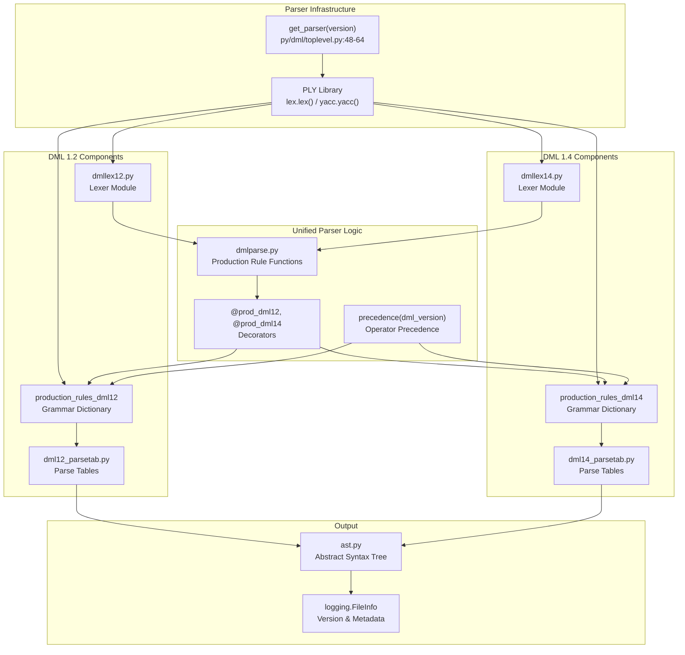
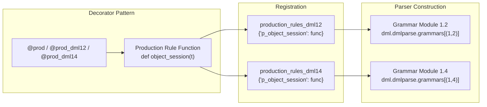
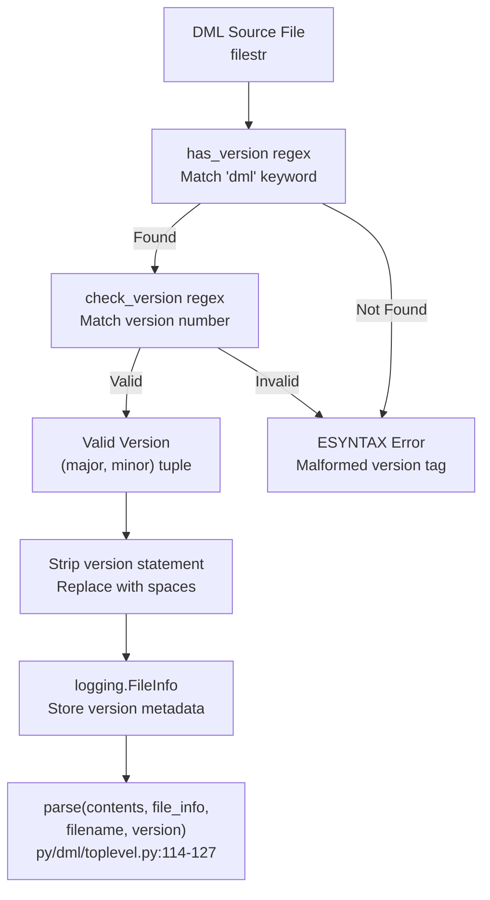
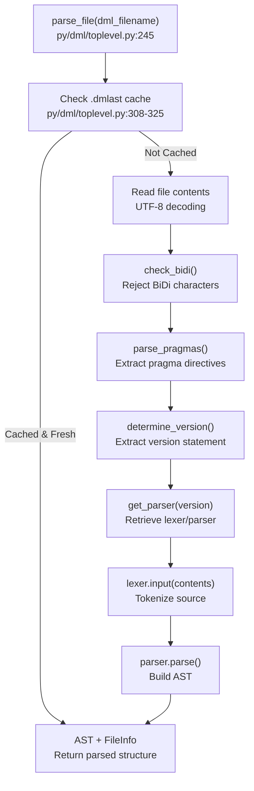
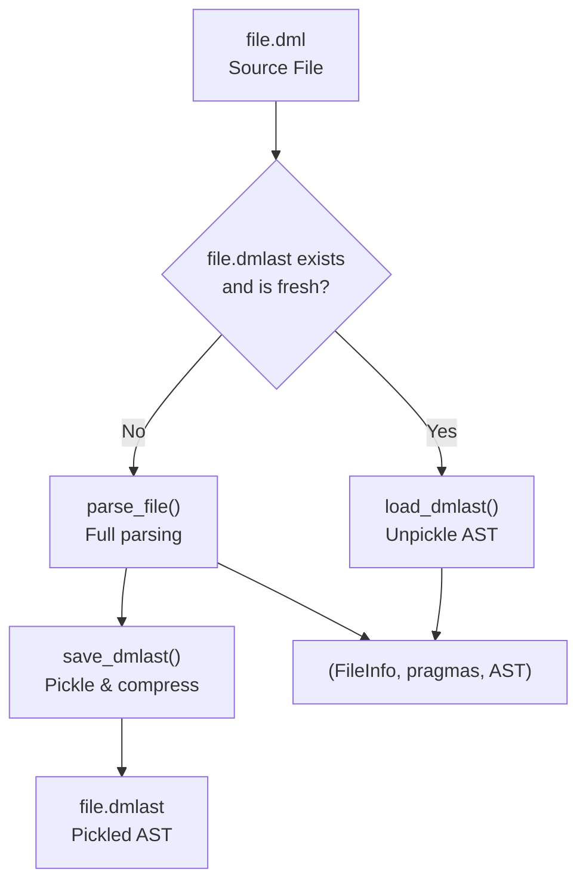
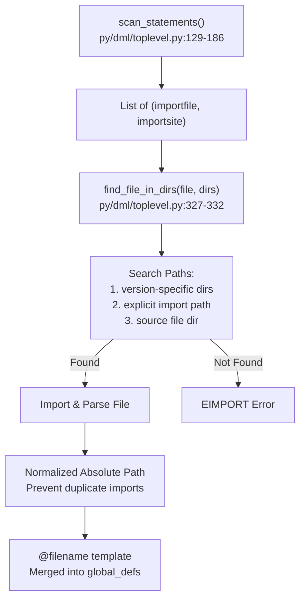

# Syntax and Grammar

<details>
<summary>Relevant source files</summary>

The following files were used as context for generating this wiki page:

- [deprecations_to_md.py](deprecations_to_md.py)
- [doc/1.4/language.md](doc/1.4/language.md)
- [py/dml/breaking_changes.py](py/dml/breaking_changes.py)
- [py/dml/dmlc.py](py/dml/dmlc.py)
- [py/dml/dmlparse.py](py/dml/dmlparse.py)
- [py/dml/globals.py](py/dml/globals.py)
- [py/dml/messages.py](py/dml/messages.py)
- [py/dml/toplevel.py](py/dml/toplevel.py)

</details>


## Purpose and Scope

This page documents the lexical structure and grammatical rules that define valid DML source code. It covers character encoding, identifiers, literals, reserved words, and the parser implementation that transforms DML source into an Abstract Syntax Tree (AST). For information about the type system and type resolution, see [Type System](#3.3). For details about the AST structure and semantic analysis, see [Semantic Analysis](#5.3).

## Lexical Structure

### Character Encoding and Basic Rules

DML source files use UTF-8 encoding. Non-ASCII characters are only permitted in comments and string literals. String values are handled as byte arrays, so a string literal with three characters may create an array of more than three bytes when Unicode is involved.

Unicode BiDi control characters (U+2066 to U+2069 and U+202a to U+202e) are explicitly forbidden to prevent "Trojan Source" attacks.

**Sources:** [doc/1.4/language.md:43-51](), [py/dml/toplevel.py:188-203]()

### Reserved Words

DML reserves all ISO/ANSI C keywords, plus C99 and C++ keywords like `restrict`, `inline`, `this`, `new`, `delete`, `throw`, `try`, and `catch`. Additionally, DML-specific keywords include:

- **Control flow:** `after`, `assert`, `call`, `foreach`, `select`, `error`
- **Type system:** `cast`, `typeof`, `sizeoftype`, `is`, `defined`, `undefined`
- **DML constructs:** `param`, `saved`, `session`, `local`, `shared`, `template`, `vect`, `stringify`, `each`, `in`, `where`, `async`, `await`, `with`

Identifiers beginning with underscore (`_`) are reserved, except for the single underscore `_` which serves as the "discard identifier" in specific contexts like local variable declarations and object array indices.

**Sources:** [doc/1.4/language.md:54-94]()

### Identifiers and Literals

Identifiers follow C conventions: start with a letter or underscore, followed by letters, numbers, or underscores.

**Integer Literals:**
- Decimal: `01234`
- Hexadecimal: `0x12af`
- Binary: `0b110110`
- Underscores allowed for readability: `123_456`, `0b10_1110`, `0x_eace_f9b6`

**String Literals:**
- Surrounded by double quotes (`"`)
- Escape sequences: `\"`, `\\`, `\n`, `\r`, `\t`, `\b`
- Byte values: `\x1f` (exactly two hex digits)

**Character Literals:**
- Single quotes surrounding one printable ASCII character or escape sequence
- Value is the character's ASCII value

**Sources:** [doc/1.4/language.md:76-126]()

## Parser Architecture

### PLY-Based Parser System

The DML compiler uses PLY (Python Lex-Yacc) version 3.4 for lexing and parsing. The parser system maintains separate components for each DML version while sharing common infrastructure.



**Sources:** [py/dml/dmlparse.py:1-19](), [py/dml/toplevel.py:46-64]()

### Production Rule System

Parser production rules are defined as Python functions and organized using decorators:

| Decorator | Purpose | Example Usage |
|-----------|---------|---------------|
| `@prod` | Rule used in both DML 1.2 and 1.4 | `@prod def object_session(t)` |
| `@prod_dml12` | Rule specific to DML 1.2 | `@prod_dml12 def object_method(t)` |
| `@prod_dml14` | Rule specific to DML 1.4 | `@prod_dml14 def object_saved(t)` |

The decorators populate version-specific dictionaries (`production_rules_dml12`, `production_rules_dml14`) that are used when constructing the parser for each language version.



**Sources:** [py/dml/dmlparse.py:151-174]()

### Operator Precedence

Operator precedence is defined in the `precedence()` function, which returns tuples specifying associativity and operator groups. The precedence follows the C operator precedence table with additions for DML-specific operators:

```mermaid
graph TB
    subgraph "Precedence Levels (High to Low)"
        P160["160: Postfix<br/>PERIOD, ARROW, LBRACKET, LPAREN<br/>Left associative"]
        P150["150: Unary Prefix<br/>PLUSPLUS, MINUSMINUS, BNOT, LNOT<br/>SIZEOF, NEW, DELETE<br/>Right associative"]
        P140["140: Cast<br/>CAST<br/>Right associative"]
        P130["130: Multiplicative<br/>TIMES, DIVIDE, MOD<br/>Left associative"]
        P120["120: Additive<br/>PLUS, MINUS<br/>Left associative"]
        P110["110: Shift<br/>LSHIFT, RSHIFT<br/>Left associative"]
        P100["100: Relational<br/>LT, GT, LE, GE<br/>Left associative"]
        P90["90: Equality<br/>EQ, NE<br/>Left associative"]
        P80["80: Bitwise AND<br/>BAND<br/>Left associative"]
        P70["70: Bitwise XOR<br/>BXOR<br/>Left associative"]
        P60["60: Bitwise OR<br/>BOR<br/>Left associative"]
        P50["50: Logical AND<br/>LAND<br/>Left associative"]
        P40["40: Logical OR<br/>LOR<br/>Left associative"]
        P30["30: Conditional<br/>CONDOP, COLON<br/>Right associative"]
        P20["20: Assignment<br/>EQUALS, PLUSEQUAL, etc.<br/>Right associative"]
    end
    
    P160 --> P150 --> P140 --> P130 --> P120 --> P110 --> P100 --> P90 --> P80 --> P70 --> P60 --> P50 --> P40 --> P30 --> P20
```



**Sources:** [py/dml/dmlparse.py:22-79]()

## Version Detection and File Parsing

### Version Statement Processing

Every DML file must begin with a version declaration like `dml 1.4;`. The parser uses regular expressions to detect and validate this statement before parsing.



The version statement is replaced with spaces (preserving character positions) so that site locations remain accurate when reporting errors.

**Sources:** [py/dml/toplevel.py:33-112]()

### Parse Process Flow



**Sources:** [py/dml/toplevel.py:245-276](), [py/dml/toplevel.py:308-325]()

### Site Tracking

The parser tracks the location of each AST node using a `site` function that captures file position information:

```python
def default_site(t, elt=1):
    lexpos = t.lexpos(elt)
    return DumpableSite(t.parser.file_info, lexpos)
```

When porting tracking is enabled (with the `-P` flag), an extended `extended_site()` function stores additional lexical span information in `lexspan_map` for precise token positioning.

**Sources:** [py/dml/dmlparse.py:82-138]()

## Grammar Rules and AST Generation

### Top-Level Structure

The top-level grammar rule produces a DML AST containing device declaration and statements:

```
dml : maybe_provisional maybe_device maybe_bitorder device_statements
```

This structure is defined identically in both DML 1.2 and 1.4, but the `device_statements` production differs between versions.

**Sources:** [py/dml/dmlparse.py:177-180]()

### DML 1.2 vs 1.4 Grammar Differences

The `device_statement` production illustrates version-specific syntax:

**DML 1.2:**
```python
@prod_dml12
def device_statement(t):
    '''device_statement : object_statement
                        | toplevel'''
```

**DML 1.4:**
```python
@prod_dml14
def device_statement(t):
    '''device_statement : toplevel
                        | object
                        | toplevel_param
                        | method
                        | bad_shared_method
                        | istemplate SEMI
                        | toplevel_if
                        | error_stmt
                        | in_each'''
```

DML 1.4 supports top-level `#if` blocks and separates various statement types that DML 1.2 groups together.

**Sources:** [py/dml/dmlparse.py:226-295]()

### Key Grammar Productions

The parser defines hundreds of production rules. Key categories include:

| Category | Example Productions | AST Nodes Generated |
|----------|-------------------|---------------------|
| Objects | `object_regarray`, `object_field`, `object_session` | `ast.object_()`, `ast.session()`, `ast.saved()` |
| Methods | `object_method`, `object_inline_method` | `ast.method()` |
| Parameters | `param_assign`, `param_default` | `ast.param()` |
| Statements | `compound_statement`, `if_statement`, `while_statement` | `ast.compound()`, `ast.if_()`, `ast.while_()` |
| Expressions | `binop_expression`, `unary_expression`, `apply` | `ast.binop()`, `ast.unaryop()`, `ast.apply()` |
| Type Declarations | `cdecl`, `struct_declaration` | `ast.cdecl()`, `ast.struct()` |

**Sources:** [py/dml/dmlparse.py:296-2800]() (approximate range for major production rules)

## Syntax Error Handling

### Error Reporting

Syntax errors are reported using the `ESYNTAX` error class, which captures the site, offending token, and an optional reason:

```python
class ESYNTAX(DMLError):
    """
    The code is malformed.
    """
    fmt = "syntax error%s%s"
    def __init__(self, site, tokenstr, reason):
        if tokenstr:
            where = " at '%s'" % truncate(tokenstr, 20)
        else:
            where = ""
        if reason:
            reason = ": " + reason
        else:
            reason = ""
        DMLError.__init__(self, site, where, reason)
```

**Sources:** [py/dml/messages.py:775-790]()

### Parser Error Recovery

When the parser encounters unexpected end-of-file, it raises `UnexpectedEOF`, which is caught and converted to an `ESYNTAX` error:

```python
try:
    ast = parser.parse(s, lexer = lexer, tracking = True)
except dml.dmlparse.UnexpectedEOF:
    raise ESYNTAX(DumpableSite(file_info, file_info.size()),
                   None, "unexpected end-of-file")
```

**Sources:** [py/dml/toplevel.py:122-126](), [py/dml/dmlparse.py:20]()

## Pragma System

DML supports pragmas as directives to the compiler that are orthogonal to the language. Pragmas use the syntax:

```
/*% TAG ... %*/
```

### COVERITY Pragma

The `COVERITY` pragma allows manual suppression of Coverity defects in generated C code:

```
/*% COVERITY event classification %*/
```

Pragmas are parsed using regular expressions and processed during file parsing. They are stored in `dml.globals.coverity_pragmas` keyed by `(filename, end_lineno)`.

**Sources:** [doc/1.4/language.md:208-263](), [py/dml/toplevel.py:188-242]()

## AST Caching System

### .dmlast Files

To improve compilation speed, the parser can save and load precompiled AST representations:



The `.dmlast` file contains:
- `logging.FileInfo` with version and metadata
- Parsed pragma directives
- Complete AST structure

Files are cached using `pickle` with `bz2` compression. A freshness check ensures the `.dmlast` is newer than the source `.dml` file.

**Sources:** [py/dml/toplevel.py:278-306](), [py/dml/toplevel.py:308-325]()

## Import Resolution and Module System

### Import Statement Processing

After parsing, import statements are extracted and resolved into actual file paths:



Import resolution:
1. Checks if import path is relative (`./ ` or `../`)
2. Searches in version-specific directories (e.g., `1.4/` subdirs)
3. Normalizes paths to prevent duplicate imports
4. Creates templates named `@filename` for merged imports

**Sources:** [py/dml/toplevel.py:359-459]()