# Type System

<details>
<summary>Relevant source files</summary>

The following files were used as context for generating this wiki page:

- [doc/1.4/language.md](doc/1.4/language.md)
- [py/dml/crep.py](py/dml/crep.py)
- [py/dml/dmlparse.py](py/dml/dmlparse.py)
- [py/dml/messages.py](py/dml/messages.py)
- [py/dml/structure.py](py/dml/structure.py)
- [py/dml/template.py](py/dml/template.py)
- [py/dml/traits.py](py/dml/traits.py)
- [py/dml/types.py](py/dml/types.py)

</details>


This page describes the DML type system, including the type hierarchy, type resolution mechanisms, type checking operations, and how types are used throughout the compilation pipeline. The type system defines all value types that can be used in DML expressions and declarations, and provides the infrastructure for type checking and C code generation.

For information about the Object Model (device/bank/register hierarchy), see [Object Model](#3.4). For information about Traits (polymorphism system), see [Traits](#3.6). For information about how types are evaluated from AST nodes during semantic analysis, see [Semantic Analysis](#5.3).

## Type Hierarchy

The DML type system is implemented through a class hierarchy rooted at `DMLType`. All types in DML inherit from this base class and implement common operations like equality checking, C code generation, and type metadata.

### Type Class Hierarchy

```mermaid
graph TB
    DMLType["DMLType<br/>(abstract base)"]
    
    TVoid["TVoid<br/>void type"]
    TUnknown["TUnknown<br/>unknown type (1.2 only)"]
    TDevice["TDevice<br/>device pointer"]
    TNamed["TNamed<br/>typedef reference"]
    TBool["TBool<br/>boolean"]
    
    IntegerType["IntegerType<br/>(abstract)<br/>integer types"]
    TInt["TInt<br/>sized integer"]
    TEndianInt["TEndianInt<br/>endian integer"]
    TLong["TLong<br/>long integer"]
    TSize["TSize<br/>size_t"]
    
    TFloat["TFloat<br/>floating point"]
    TPtr["TPtr<br/>pointer"]
    TArray["TArray<br/>array"]
    TVector["TVector<br/>vector (GCC)"]
    
    StructType["StructType<br/>(abstract)<br/>struct types"]
    TStruct["TStruct<br/>DML struct"]
    TExternStruct["TExternStruct<br/>extern struct"]
    TLayout["TLayout<br/>layout type"]
    
    TFunction["TFunction<br/>function pointer"]
    TTrait["TTrait<br/>trait reference"]
    TTraitList["TTraitList<br/>trait sequence"]
    THook["THook<br/>hook type"]
    
    DMLType --> TVoid
    DMLType --> TUnknown
    DMLType --> TDevice
    DMLType --> TNamed
    DMLType --> TBool
    DMLType --> IntegerType
    DMLType --> TFloat
    DMLType --> TPtr
    DMLType --> TArray
    DMLType --> TVector
    DMLType --> StructType
    DMLType --> TFunction
    DMLType --> TTrait
    DMLType --> TTraitList
    DMLType --> THook
    
    IntegerType --> TInt
    IntegerType --> TEndianInt
    IntegerType --> TLong
    IntegerType --> TSize
    
    StructType --> TStruct
    StructType --> TExternStruct
    StructType --> TLayout
```

**Sources:** [py/dml/types.py:257-392]()

### Key Type Properties

Every `DMLType` instance has the following core properties:

| Property | Type | Description |
|----------|------|-------------|
| `const` | `bool` | Whether the type is const-qualified |
| `declaration_site` | `Site` | Source location where type was declared |
| `void` | `bool` | Whether type is void (only `TVoid`) |
| `is_int` | `bool` | Shorthand for `isinstance(x, IntegerType)` |
| `is_float` | `bool` | Shorthand for `isinstance(x, TFloat)` |
| `is_arith` | `bool` | Whether type is arithmetic (int or float) |

**Sources:** [py/dml/types.py:257-273]()

## Global Type Registry

The type system maintains global registries that track all types defined in the DML program:

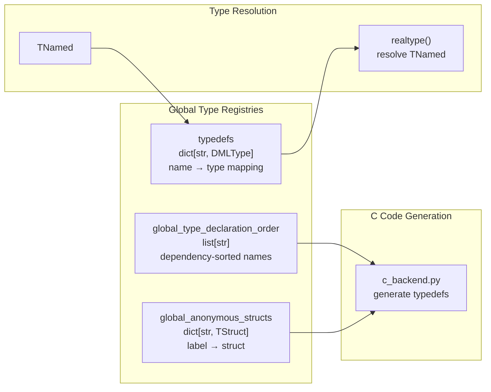

**Sources:** [py/dml/types.py:86-90](), [py/dml/structure.py:232-248]()

## Primitive Types

### Void Type

`TVoid` represents the void type, used for functions that return no value.

```python
# TVoid cannot be used as a variable type
void_type = TVoid()
# Valid: void method()
# Invalid: session void x;
```

**Sources:** [py/dml/types.py:394-404]()

### Boolean Type

`TBool` represents the boolean type, compatible with 1-bit unsigned integers.

```python
# TBool can store booleans and 1-bit uints
TBool().canstore(TBool())           # (True, False, False)
TBool().canstore(TInt(1, False))    # (True, False, False)
```

**Sources:** [py/dml/types.py:502-521]()

### Integer Types

All integer types inherit from `IntegerType` and share common properties:

| Type Class | Description | Example |
|------------|-------------|---------|
| `TInt` | Standard sized integer | `uint8`, `int32`, `uint64` |
| `TEndianInt` | Endian-specific integer | `uint32_le_t`, `uint16_be_t` |
| `TLong` | Long integer | `long`, `unsigned long` |
| `TSize` | Size type | `size_t` |

**Integer Type Properties:**

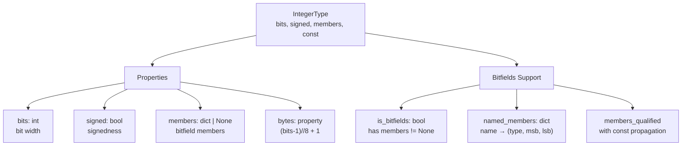

**Bitfields Example:**

```python
# Integer type with bitfield members
bitfields_type = TInt(32, False, members={
    'status': (TInt(3, False), 2, 0),    # bits [2:0]
    'flags': (TInt(6, False), 8, 3),     # bits [8:3]
    'reserved': (TInt(23, False), 31, 9) # bits [31:9]
})
```

**Sources:** [py/dml/types.py:522-635]()

### Floating-Point Type

`TFloat` represents floating-point types:

```python
TFloat(32)  # float
TFloat(64)  # double
```

**Sources:** [py/dml/types.py:744-789]()

## Composite Types

### Pointer Types

`TPtr` represents pointer types, with const qualification applying to the pointer itself:

```python
TPtr(TInt(32, False))              # uint32 *
TPtr(TInt(32, False), const=True)  # uint32 * const
TPtr(TInt(32, True))               # int32 *
```

**Sources:** [py/dml/types.py:791-845]()

### Array Types

`TArray` represents fixed-size arrays:

```python
TArray(TInt(32, False), 10)  # uint32[10]
```

**Size Computation:**
- If base type size is known: `base.sizeof() * array_size`
- Otherwise: `None`

**Sources:** [py/dml/types.py:847-916]()

### Vector Types

`TVector` represents GCC vector types (not frequently used in DML):

```python
TVector(TInt(32, False))  # __attribute__((vector_size(...)))
```

**Sources:** [py/dml/types.py:918-956]()

### Function Types

`TFunction` represents function pointer types:

```python
TFunction(
    input_types=(TInt(32, False), TPtr(TNamed('char'))),
    output_type=TBool(),
    varargs=False
)
# Represents: bool (*)(uint32, char *)
```

**Properties:**
- `input_types`: tuple of parameter types
- `output_type`: return type
- `varargs`: whether function accepts variable arguments
- `const`: functions cannot be const (raises error)

**Sources:** [py/dml/types.py:1178-1266]()

### Struct Types

Struct types come in three flavors:

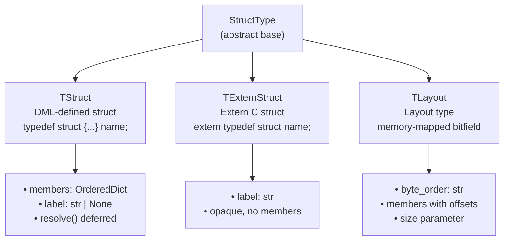

**TStruct Example:**

```python
# Struct definition
struct_type = TStruct(members_dict={
    'field1': TInt(32, False),
    'field2': TPtr(TNamed('char')),
    'field3': TBool()
}, label='my_struct_s')

# Access
struct_type.resolve()  # Finalize definition
struct_type.members    # OrderedDict of members
```

**TLayout Example:**

```python
# Layout type for memory-mapped registers
layout_type = TLayout(
    members_dict={
        'status': (TInt(8, False), 0),    # byte offset 0
        'control': (TInt(8, False), 1),   # byte offset 1
        'data': (TInt(32, False), 4)      # byte offset 4
    },
    size=8,
    byte_order='little-endian'
)
```

**Sources:** [py/dml/types.py:958-1176]()

## DML-Specific Types

### Device Type

`TDevice` represents the type of the device object (`$dev` in DML 1.2, `dev` in DML 1.4):

```python
TDevice('my_device')  # my_device *
```

This is a special pointer type that cannot be dereferenced but can be passed to methods.

**Sources:** [py/dml/types.py:420-448]()

### Trait Types

DML has two trait-related types:

#### TTrait - Single Trait Reference

```python
TTrait(trait_instance)  # Reference to specific trait
```

Used for casting objects to trait types and for trait method parameters.

**Sources:** [py/dml/types.py:1268-1377]()

#### TTraitList - Trait Sequence

```python
TTraitList('my_template')  # sequence(my_template)
```

Used in `each` statements to iterate over objects implementing a template.

**Sources:** [py/dml/types.py:1379-1411]()

### Hook Type

`THook` represents hook types used for event callbacks:

```python
# Hook with two message components
THook(
    msg_types=(TInt(32, False), TPtr(TNamed('char'))),
    validated=True
)
```

**Properties:**
- `msg_types`: tuple of message component types
- `validated`: whether hook type has been validated
- Message component types must be serializable

**Sources:** [py/dml/types.py:1413-1484]()

### Named Types

`TNamed` represents a reference to a typedef:

```python
TNamed('my_type')  # Reference to typedef 'my_type'
```

Named types are resolved to their underlying types through the `realtype()` function.

**Sources:** [py/dml/types.py:475-501]()

## Type Resolution

### Resolution Functions

The type system provides several resolution functions:

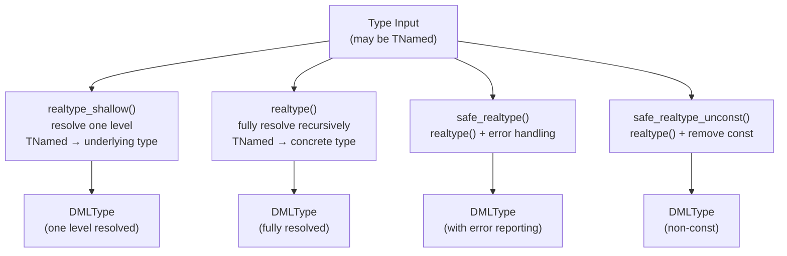

**Resolution Algorithm:**

1. **realtype_shallow()**: Follows one `TNamed` reference
   ```python
   TNamed('my_type') → typedefs['my_type']
   ```

2. **realtype()**: Recursively resolves all `TNamed` references and sub-types
   ```python
   # Resolves nested structures
   TPtr(TNamed('foo')) → TPtr(TStruct(...))
   TArray(TNamed('bar'), 10) → TArray(TInt(32, False), 10)
   ```

3. **safe_realtype()**: Wraps `realtype()` and converts exceptions to error messages

4. **safe_realtype_unconst()**: Removes const qualifiers recursively

**Sources:** [py/dml/types.py:120-214]()

### Type Dependency Analysis

When types reference other types, dependencies must be analyzed to determine declaration order:

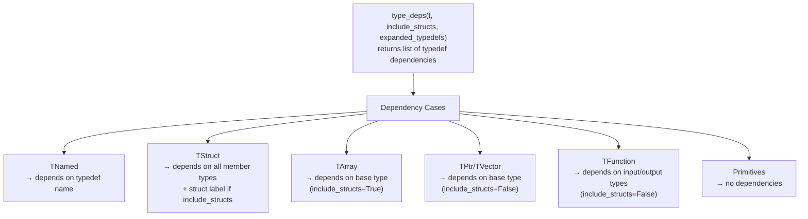

**Why include_structs varies:**
- **Arrays and struct members**: Need complete type definition (include_structs=True)
- **Pointers and function parameters**: Only need declaration (include_structs=False)

**Sources:** [py/dml/structure.py:288-346]()

### Type Declaration Ordering

Types must be declared in dependency order in generated C code:

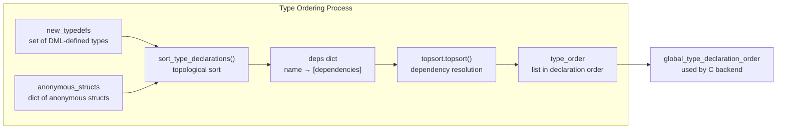

**Error Handling:**
- **Circular dependencies**: Detected by topsort, reported as `ETREC`
- **Missing types**: Reported as `ETYPE`

**Sources:** [py/dml/structure.py:352-389]()

## Type Checking Operations

### Type Equivalence

The type system provides multiple equivalence checks:

| Method | Purpose | Considers Const? | Use Case |
|--------|---------|------------------|----------|
| `eq()` | Strict equivalence | Yes | Type compatibility checks |
| `eq_fuzzy()` | Fuzzy equivalence | No | Legacy DML 1.2 compatibility |
| `canstore()` | Assignment compatibility | Yes (returns flag) | Assignment validation |

**Strict Equivalence (eq):**

```python
# Must match exactly
TInt(32, False).eq(TInt(32, False))  # True
TInt(32, False).eq(TInt(32, True))   # False (different signedness)
TInt(32, False, const=True).eq(TInt(32, False))  # False (different const)
```

**Fuzzy Equivalence (eq_fuzzy):**

```python
# More lenient, ignores const
TInt(32, False).eq_fuzzy(TInt(32, False, const=True))  # True
# In DML 1.2 without dml12_modern_int, ignores signedness
TInt(32, False).eq_fuzzy(TInt(32, True))  # True (in DML 1.2)
```

**Can Store (canstore):**

```python
# Returns (ok, truncation, const_violation)
TInt(32, False).canstore(TInt(32, False))  # (True, False, False)
TInt(32, False).canstore(TInt(32, False, const=True))  # (True, False, True)
```

**Sources:** [py/dml/types.py:285-344]()

### Type Key Generation

Types can be serialized to string keys for checkpointing:

```python
# Generate unique key for type
key = typ.key()  # Returns string identifier
```

**Key Requirements:**
- Must be unique for equivalent types
- Must be stable across compilations
- Used in serialization/deserialization

**Unkeyable Types:**
- Anonymous structs
- Arrays of variable/unknown size
- Raise `DMLUnkeyableType` exception

**Sources:** [py/dml/types.py:368-377]()

## Type System in Compilation Pipeline

### Type Evaluation from AST

Types are evaluated from AST nodes during semantic analysis:

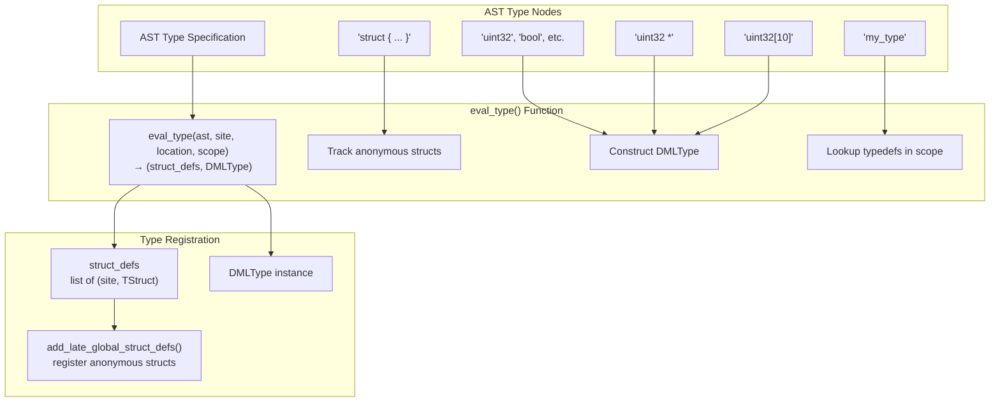

**Sources:** [py/dml/structure.py:886-923]()

### Type Usage in Objects

Different object types have associated types:

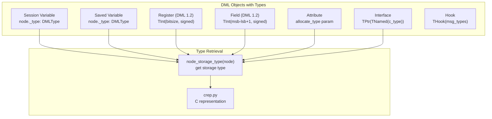

**Sources:** [py/dml/crep.py:154-216]()

### Type in Method Signatures

Methods have typed input and output parameters:

```mermaid
graph TB
    subgraph "Method Type Information"
        Method["Method Object"]
        
        inp["inp: list[MethodParam]<br/>input parameters"]
        outp["outp: list[(name, type)]<br/>output parameters"]
        throws["throws: bool<br/>may throw exceptions"]
    end
    
    subgraph "MethodParam"
        MethodParam["MethodParam"]
        ident["ident: str<br/>parameter name"]
        typ["typ: DMLType<br/>parameter type"]
        logref["logref: str<br/>for error messages"]
    end
    
    subgraph "Type Checking"
        typecheck_method_override["typecheck_method_override()<br/>verify override compatibility"]
        
        check_inp["Check input param types<br/>safe_realtype_unconst + eq()"]
        check_outp["Check output param types<br/>safe_realtype_unconst + eq()"]
        check_throws["Check throws annotation<br/>must match"]
    end
    
    Method --> inp
    Method --> outp
    Method --> throws
    
    inp --> MethodParam
    MethodParam --> ident
    MethodParam --> typ
    MethodParam --> logref
    
    typecheck_method_override --> check_inp
    typecheck_method_override --> check_outp
    typecheck_method_override --> check_throws
```

**Sources:** [py/dml/traits.py:398-425](), [py/dml/structure.py:711-805]()

## Type System Integration Points

### Integration with Structure Building

Type analysis is tightly integrated with device structure construction:

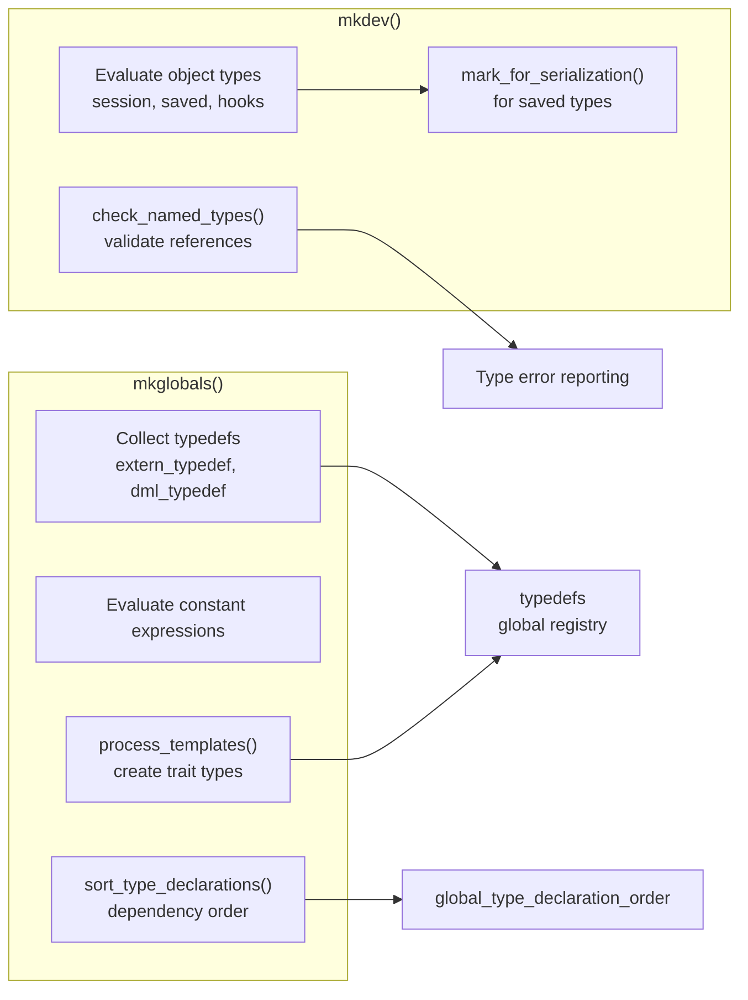

**Sources:** [py/dml/structure.py:74-287]()

### Integration with Code Generation

Types drive C code generation throughout the backend:

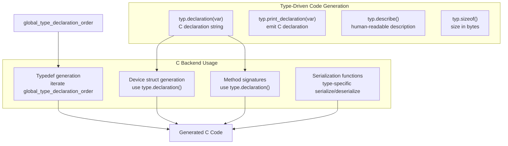

**Sources:** [py/dml/types.py:350-356](), [py/dml/c_backend.py]()

## Type System Error Handling

The type system reports errors through various message classes:

| Error Code | Meaning | When Reported |
|------------|---------|---------------|
| `ETYPE` | Unknown type | Type reference cannot be resolved |
| `ETREC` | Recursive type | Circular type dependency detected |
| `ETYPE` | Type error | Generic type mismatch |
| `EVARTYPE` | Invalid variable type | Variable declared with invalid type |
| `EANONSTRUCT` | Anonymous struct not allowed | Struct in forbidden context |
| `EEMPTYSTRUCT` | Empty struct | Struct with no fields |
| `EVOID` | Illegal void use | Void used as value type |
| `ECONSTFUN` | Const function | Attempt to make function const |

**Sources:** [py/dml/messages.py:269-323]()

## Summary

The DML type system provides:

1. **Rich Type Hierarchy**: 20+ type classes covering primitives, composites, and DML-specific types
2. **Type Resolution**: Named type resolution with dependency tracking and cycle detection
3. **Type Checking**: Multiple equivalence modes (strict, fuzzy, assignment)
4. **C Code Generation**: Direct mapping from DML types to C declarations
5. **Serialization Support**: Type keys for checkpointing
6. **Integration**: Deep integration with structure building, semantic analysis, and code generation

The type system is central to the DML compiler, ensuring type safety while enabling efficient C code generation.

**Sources:** [py/dml/types.py:1-1843](), [py/dml/structure.py:74-923](), [py/dml/crep.py:154-243]()